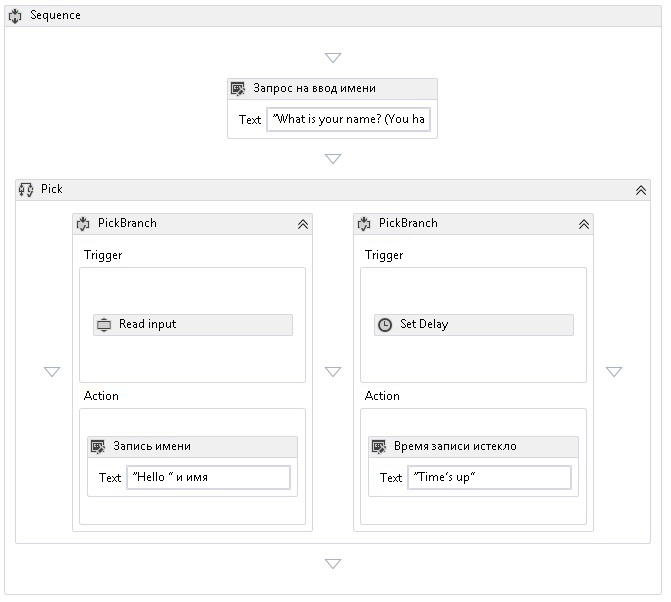

# Действие Pick
Действие <xref:System.Activities.Statements.Pick> позволяет упростить моделирование набора триггеров событий и соответствующих обработчиков.  <xref:System.Activities.Statements.Pick> содержит коллекцию действий <xref:System.Activities.Statements.PickBranch>, в которой все элементы <xref:System.Activities.Statements.PickBranch> являются парами, состоящими из действия <xref:System.Activities.Statements.PickBranch.Trigger%2A> и действия <xref:System.Activities.Statements.PickBranch.Action%2A>.  Во время выполнения триггеры для всех ветвей выполняются параллельно.  Когда срабатывает один триггер, выполняется соответствующее действие, а остальные триггеры отменяются.  По своему поведению действие [!INCLUDE[netfx_current_short](../../../includes/netfx-current-short-md.md)]<xref:System.Activities.Statements.Pick> аналогично действию [!INCLUDE[netfx35_short](../../../includes/netfx35-short-md.md)]<xref:System.Workflow.Activities.Listen>.  
  
 На следующем снимке экрана из примера пакета SDK [Использование действия Pick](../../../docs/framework/windows-workflow-foundation/samples/using-the-pick-activity.md) показано действие Pick с двумя ветвями.  В одной ветви есть триггер с именем **Read input** — настраиваемое действие, считывающее входные данные из командной строки. Во второй ветви есть триггер действия <xref:System.Activities.Statements.Delay>. Если действие **Read input** получает данные до завершения действия <xref:System.Activities.Statements.Delay>, задержка <xref:System.Activities.Statements.Delay> отменяется и в консоль выводится приветствие.  В противном случае, если действие **Read input** не получает данные в отведенное время, это действие отменяется, и в консоль выводится сообщение об окончании времени ожидания.  Это стандартный прием для добавления периода времени ожидания к любому действию.  
  
   
  
## <a name="best-practices"></a>Рекомендации  
 При использовании действия Pick выполняемой ветвью действия становится ветвь, триггеры которой первыми завершат выполнение.  Теоретически, все триггеры выполняются параллельно, и один триггер может выполнить большую часть свой логики до того, как будет отменен из-за завершения работы другого.  С учетом этого необходимо соблюдать следующие инструкции при работе с действием Pick: работать с триггером, как если бы он представлял одно событие, и помещать в него минимально возможный объем логики.  В идеале триггер должен содержать объем логики, достаточный лишь для получения события, и обработка этого события должна выполняться в действии этой ветви.  Этот метод минимизирует объем перекрытия при выполнении триггеров.  Для примера можно представить действие <xref:System.Activities.Statements.Pick> с двумя триггерами, где каждый триггер содержит действие <xref:System.ServiceModel.Activities.Receive> с дополнительной логикой.  Если дополнительная логика представляет точку простоя, существует вероятность успешного завершения обоих действий <xref:System.ServiceModel.Activities.Receive>.  Один триггер будет полностью выполнен, а второй будет выполнен частично.  В определенных ситуациях принятие сообщения и последующее частичное выполнение его обработки недопустимо.  Следовательно, что касается применения таких встроенных действий обмена сообщениями WF, как <xref:System.ServiceModel.Activities.Receive> и <xref:System.ServiceModel.Activities.SendReply>, то <xref:System.ServiceModel.Activities.Receive> часто используется в триггерах, а <xref:System.ServiceModel.Activities.SendReply> и другая логика должны быть при любой возможности помещены в действие.  
  
## <a name="using-the-pick-activity-in-the-designer"></a>Использование действия Pick в конструкторе  
 Чтобы использовать Pick в конструкторе, найдите **Pick** и **PickBranch** на панели элементов.  Перетащите **Pick** на холст.  По умолчанию новое действие **Pick** в конструкторе будет содержать две ветви.  Чтобы добавить дополнительные ветви, перетащите действие **PickBranch** в область рядом с существующими ветвями. Действия можно перетаскивать в действие **Pick** в области **Trigger** или область **Action** любого действия **PickBranch**.  
  
## <a name="using-the-pick-activity-in-code"></a>Использование действия Pick в коде  
 Действие <xref:System.Activities.Statements.Pick> используется при заполнении его коллекции <xref:System.Activities.Statements.Pick.Branches%2A> действиями <xref:System.Activities.Statements.PickBranch>. Все действия <xref:System.Activities.Statements.PickBranch> включают свойство <xref:System.Activities.Statements.PickBranch.Trigger%2A> типа <xref:System.Activities.Activity>. Когда завершается выполнение указанного действия, выполняется <xref:System.Activities.Statements.PickBranch.Action%2A>.  
  
 В следующем примере кода показано использование действия <xref:System.Activities.Statements.Pick> для реализации времени ожидания для действия, которое считывает строку в консоли.  
  
```csharp  
Sequence body = new Sequence()  
{  
    Variables = { name },  
    Activities =   
   {  
       new System.Activities.Statements.Pick  
        {  
           Branches =   
           {  
               new PickBranch  
               {  
                   Trigger = new ReadLine  
                   {  
                      Result = name,  
                      BookmarkName = "name"  
                   },  
                   Action = new WriteLine   
                   {   
                       Text = ExpressionServices.Convert<string>(ctx => "Hello " +   
                           name.Get(ctx))   
                   }  
               },  
               new PickBranch  
               {  
                   Trigger = new Delay  
                   {  
                      Duration = new TimeSpan(0, 0, 5)  
                   },  
                   Action = new WriteLine  
                   {  
                      Text = "Time is up."  
                   }  
               }  
           }  
       }  
   }  
};  
  
```  
  
```xaml  
<Sequence xmlns="http://schemas.microsoft.com/netfx/2009/xaml/activities" xmlns:x="http://schemas.microsoft.com/winfx/2006/xaml">  
  <Sequence.Variables>  
    <Variable x:TypeArguments="x:String" Name="username" />  
  </Sequence.Variables>  
  <Pick>  
    <PickBranch>  
      <PickBranch.Trigger>  
        <ReadLine BookmarkName="name" Result="username" />  
      </PickBranch.Trigger>  
      <WriteLine>[String.Concat("Hello ", username)]</WriteLine>  
    </PickBranch>  
    <PickBranch>  
      <PickBranch.Trigger>  
        <Delay>00:00:05</Delay>  
      </PickBranch.Trigger>  
      <WriteLine>Time is up.</WriteLine>  
    </PickBranch>  
  </Pick>  
</Sequence>  
  
```