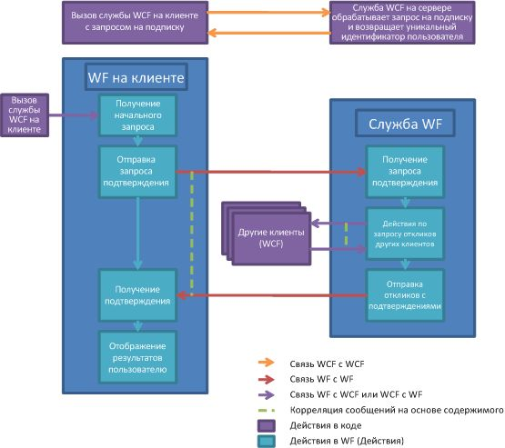

# Процесс утверждения документаDocument Approval Process
В этом образце демонстрируется использование многих возможностей Windows Workflow Foundation (WF) и Windows Communication Foundation (WCF) друг с другом.This sample demonstrates the use of many Windows Workflow Foundation (WF) and Windows Communication Foundation (WCF) features together. Вместе они реализуют сценарий утверждения документов.Together they implement a document approval process scenario. Клиентское приложение может представлять документы на утверждение и утверждать документы.A client application can submit documents for approval and approve documents. Диспетчер утверждений облегчает взаимодействие между клиентами и обеспечивает соблюдение порядка утверждения.An approval manager application exists to facilitate communications between clients and to enforce the rules of the approval process. Утверждение - это рабочий процесс, который может выполняться несколькими способами.The approval process is a workflow that can execute several types of approval. Поддерживается единичное утверждение, утверждение кворумом (частью группы утверждающих) и составное утверждение, состоящее из утверждения кворумом и следующего за ним единичного утверждения.Activities exist to get a single approval, a quorum approval (a percentage of set of approvers), and a complex approval process that consists of a quorum and single approval in a sequence.  
  
> [!IMPORTANT]
>  Образцы уже могут быть установлены на компьютере.The samples may already be installed on your machine. Перед продолжением проверьте следующий каталог (по умолчанию).Check for the following (default) directory before continuing.  
>   
>  `<InstallDrive>:\WF_WCF_Samples`  
>   
>  Если этот каталог не существует, перейдите к [Windows Communication Foundation (WCF) и образцы Windows Workflow Foundation (WF) для .NET Framework 4](http://go.microsoft.com/fwlink/?LinkId=150780) для загрузки всех Windows Communication Foundation (WCF) и [!INCLUDE[wf1](../../../../includes/wf1-md.md)] образцов.If this directory does not exist, go to [Windows Communication Foundation (WCF) and Windows Workflow Foundation (WF) Samples for .NET Framework 4](http://go.microsoft.com/fwlink/?LinkId=150780) to download all Windows Communication Foundation (WCF) and [!INCLUDE[wf1](../../../../includes/wf1-md.md)] samples. Этот образец расположен в следующем каталоге.This sample is located in the following directory.  
>   
>  `<InstallDrive>:\WF_WCF_Samples\WF\Application\DocumentApprovalProcess`  
  
## Подробные сведения об образцеSample Details  
 На следующем графике представлена схема процесса утверждения документа.The following graphic demonstrates the document approval process workflow.  
  
   
  
 С точки зрения клиента процесс утверждения документа протекает следующим образом.From the client's perspective, the approval process functions as follows:  
  
1.  Клиент отправляет заявку на участие в системе утверждения.A client subscribes to be a user in the approval process system.  
  
2.  Клиент WCF отправляет службы WCF, размещенной в диспетчере утверждения.A WCF client sends to a WCF service hosted by the approval manager application.  
  
3.  Клиенту возвращается индивидуальный пользовательский идентификатор.A unique user ID is returned to the client. Теперь клиент может участвовать в процессе утверждения.The client can now participate in approval processes.  
  
4.  Присоединившись к системе, клиент может отправить документ на единичное утверждение, утверждение кворумом и составное утверждение.Once joined, a client can send a document for approval using single, quorum or complex approval processes.  
  
5.  По нажатию кнопки в клиентском интерфейсе запускается экземпляр рабочего процесса, размещенного в клиентском узле службы рабочих процессов.A button in the client’s interface is clicked, starting a workflow instance in a client Workflow Service Host.  
  
6.  Рабочий процесс отправляет запрос на утверждение приложению диспетчера утверждения.The workflow sends an approval request to the approval manager application.  
  
7.  Диспетчер рабочего процесса запускает на своем сайте рабочий процесс, представляющий процесс утверждения.The workflow manager starts a workflow on its own side to represent an approval process.  
  
8.  По завершении рабочего процесса утверждения диспетчер возвращает клиенту результаты.Once the manager approval workflow executes, the results are sent back to the client.  
  
9. Результаты отображаются клиентом.The client displays the results.  
  
10. Клиент может получить запрос на утверждение и в любой момент ответить на него.A client may receive an approval request and respond to the request at any point in time.  
  
11. Служба WCF, размещенная в клиенте может получать запрос на утверждение от диспетчера утверждений.A WCF service hosted on the client can receive an approval request from the approval manager application.  
  
12. Данные о документе представляются на обозрение в клиенте.The document information is presented on the client for review.  
  
13. Пользователь может утвердить или отклонить документ.The user can approve or reject the document.  
  
14. Клиент WCF используется для отправки ответа обратно в диспетчере утверждения.A WCF client is used to send an approval response back to the approval manager application.  
  
 С точки зрения диспетчера утверждений процесс утверждения протекает следующим образом.From the approval manager application’s point of view, the approval process functions as follows:  
  
1.  Клиент отправляет заявку на участие в системе утверждения.A client requests to participate to the approval process system.  
  
2.  Служба WCF диспетчера утверждений получает запрос на могут входить в системе утверждения.A WCF service on the approval manager receives a request to be part of the approval process system.  
  
3.  Для клиента создается индивидуальный идентификатор.A unique ID is generated for the client. Пользовательские данные сохраняются в базе данных.The user information is stored in a database.  
  
4.  Пользователю возвращается индивидуальный идентификатор.The unique ID is sent back to the user.  
  
5.  Получение запроса на утверждение.An approval request is receive. Диспетчер запускает процесс утверждения.The approval manager executes an approval process.  
  
6.  Диспетчер получает запрос на утверждение и начинает новый рабочий процесс.An approval request is received by the approval manager, starting a new workflow.  
  
7.  В зависимости от типа запроса (простое утверждение, утверждение кворумом или составное утверждение) запускается определенное действие.Depending on the type of request (simple, quorum, or complex) a different activity is executed.  
  
8.  Действия по отправке и получению с корреляцией используются для отправки запроса на утверждение клиенту на рассмотрения и для получения ответа.Send and Receive activities with correlation are used to send the approval request to the client for review and receive the response.  
  
9. Результат рабочего процесса утверждения отправляется клиенту.The result of the approval process workflow is sent to the client.  
  
## Использование образцаUsing the Sample  
  
##### Настройка базы данныхTo set up the database  
  
1.  Из командной строки [!INCLUDE[vs2010](../../../../includes/vs2010-md.md)], открытой с правами администратора, перейдите в каталог DocumentApprovalProcess и запустите команду Setup.cmd.From a [!INCLUDE[vs2010](../../../../includes/vs2010-md.md)] command prompt opened with Administrator privileges, navigate to this DocumentApprovalProcess folder and run Setup.cmd.  
  
##### Настройка приложенияTo set up the application  
  
1.  Откройте файл решения DocumentApprovalProcess.sln в среде [!INCLUDE[vs2010](../../../../includes/vs2010-md.md)].Using [!INCLUDE[vs2010](../../../../includes/vs2010-md.md)], open the DocumentApprovalProcess.sln solution file.  
  
2.  Для построения решения нажмите CTRL+SHIFT+B.To build the solution, press CTRL+SHIFT+B.  
  
3.  Чтобы запустить решение, запустите приложение утверждающий, щелкнув правой кнопкой мыши проект ApprovalManager в **обозревателе решений** и щелкнув **отладки**->**запуск**  новый экземпляр из контекстного меню.To run the solution, launch the Approval Manager Application by right-clicking the ApprovalManager project in the **Solution Explorer** and clicking **Debug**->**Start** new instance from the right-click menu.  
  
     Подождите, пока от диспетчера не придет сообщение о готовности.Wait for the manager’s output to let you know that it is ready.  
  
##### Выполнение сценария одиночного утвержденияTo run the single approval scenario  
  
1.  Откройте командную строку с разрешениями администратора.Open a command prompt with administrator permission.  
  
2.  Перейдите в каталог, содержащий решение.Navigate to the directory that contains the solution.  
  
3.  Перейдите в папку ApprovalClient\Bin\Debug и запустите два экземпляра ApprovalClient.exe.Navigate to the ApprovalClient\Bin\Debug folder and execute two instances of ApprovalClient.exe.  
  
4.  Нажмите кнопку **обнаружение**, подождите, пока **подписаться** кнопка включена.Click **discover**, wait until the **subscribe** button is enabled.  
  
5.  Введите любое имя пользователя и нажмите кнопку **подписаться**.Type any user name and click **subscribe**. Для первого клиента используйте `UserType1`, а для второго - `UserType2`.For one client, use `UserType1` and the other type `UserType2`.  
  
6.  На клиенте `UserType1` выберите один тип подтверждения из раскрывающегося меню и введите имя и содержимое документа.In the `UserType1` client, select the single approval type from the drop down menu and type a document name and content. Нажмите кнопку **запросить утверждение**.Click **Request Approval**.  
  
7.  В клиенте `UserType2` появится документ, ожидающий утверждения.In the `UserType2` client, a document awaiting approval appears. Выберите его и нажмите клавишу **утвердить** или **Отклонить**.Select it and press **approve** or **reject**. Результаты должны отобразиться на клиенте `UserType1`.The results should show in the `UserType1` client.  
  
##### Выполнение сценария утверждения кворумомTo run the quorum approval scenario  
  
1.  Откройте командную строку с разрешениями администратора.Open a command prompt with administrator permission.  
  
2.  Перейдите в каталог, содержащий решение.Navigate to the directory that contains the solution.  
  
3.  Перейдите в папку ApprovalClient\Bin\Debug и запустите три экземпляра ApprovalClient.exe.Navigate to the ApprovalClient\Bin\Debug folder and execute three instances of ApprovalClient.exe.  
  
4.  Нажмите кнопку **обнаружение**, подождите, пока **подписаться** кнопка включена.Click **discover**, wait until the **subscribe** button is enabled.  
  
5.  Введите любое имя пользователя и нажмите кнопку **подписаться**.Type any user name and click **subscribe**. Для одного клиента используйте `UserType1`, а для двух других - `UserType2`.For one client use `UserType1` and the other two type `UserType2`.  
  
6.  В клиенте `UserType1` выберите в раскрывающемся меню утверждение кворумом и введите имя и содержимое документа.In the `UserType1` client, select the quorum approval type from the drop down menu and type a document name and content. Нажмите кнопку **запросить утверждение**.Click **Request Approval**. В данном случае требуется, чтобы два клиента `UserType2` утвердили или отклонили документ.This requests that the two `UserType2` clients approve or reject the document. Хотя ответить должны оба клиента `UserType2`, для утверждения документа достаточно, чтобы его утвердил один из них.While both `UserType2` clients must respond, only one client must approve the document for it to be approved.  
  
7.  На клиентах `UserType2` появится документ, ожидающий подтверждения.In the `UserType2` clients, a document awaiting approval appears. Выберите его и нажмите клавишу **утвердить** или **Отклонить**.Select it and press **approve** or **reject**. Результаты должны отобразиться на клиенте `UserType1`.The results should show in the `UserType1` client.  
  
##### Выполнение сценария составного утвержденияTo run the complex approval scenario  
  
1.  Откройте командную строку с разрешениями администратора.Open a command prompt with administrator permission.  
  
2.  Перейдите в каталог, содержащий решение.Navigate to the directory that contains the solution.  
  
3.  Перейдите в папку ApprovalClient\Bin\Debug и запустите четыре экземпляра ApprovalClient.exe.Navigate to the ApprovalClient\Bin\Debug folder and execute four instances of ApprovalClient.exe.  
  
4.  Нажмите кнопку **обнаружение**, подождите, пока **подписаться** кнопка включена.Click **discover**, wait until the **subscribe** button is enabled.  
  
5.  Введите любое имя пользователя и нажмите кнопку **подписаться**.Type any user name and click **subscribe**. Для одного клиента используйте `UserType1`, для двух других - `UserType2`, а для последнего - `UserType3`.For one client use `UserType1`, in two uses type `UserType2`, and in the last use `UserType3`.  
  
6.  На клиенте `UserType1` выберите один тип подтверждения из раскрывающегося меню и введите имя и содержимое документа.In the `UserType1` client, select the single approval type from the drop down menu and type a document name and content. Нажмите кнопку **запросить утверждение**.Click **Request Approval**.  
  
7.  На клиентах `UserType2` появится документ, ожидающий подтверждения.In the `UserType2` clients, a document awaiting approval appears. Выберите его и нажмите клавишу **утвердить**, документ передан `UserType3` клиента.Select it and press **approve**, the document is passed to the `UserType3` client.  
  
     Если документ был утвержден первым кворумом `UserType2`, этот документ буден передан клиенту `UserType3`.If the document is approved by the first `UserType2` quorum, the document is passed to the `UserType3` client.  
  
8.  Утвердите или отклоните документ, полученный от клиента `UserType3`.Approve or reject the document from the `UserType3` client. Результаты должны отобразиться на клиенте `UserType1`.The results should show in the `UserType1` client.  
  
##### ОчисткаTo clean up  
  
1.  В командной строке [!INCLUDE[vs2010](../../../../includes/vs2010-md.md)] перейдите в директорию DocumentApprovalProcess и запустите команду Cleanup.cmd.From a [!INCLUDE[vs2010](../../../../includes/vs2010-md.md)] command prompt, navigate to the DocumentApprovalProcess folder and run Cleanup.cmd.