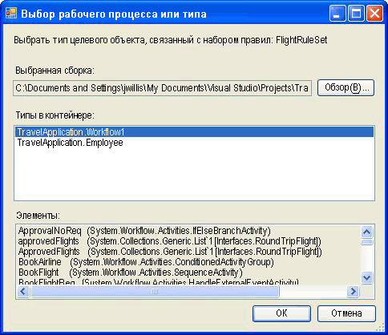

# <a name="external-ruleset-toolkit"></a>Набор средств внешнего набора правил

Обычно, когда правила используются в приложении рабочего процесса, они являются частью сборки. В некоторых случаях, возможно, потребуется создать наборы правил отдельно от сборки, чтобы можно было обновлять их, без повторного построения и развертывания сборки рабочего процесса. В этом образце показано, как управлять и изменять наборы правил в базе данных, а также как получить доступ к этим наборам правил из рабочего процесса в среде выполнения. Это позволяет запускать экземпляры рабочего процесса, чтобы автоматически включать изменения в наборах правил.

В примере набора средств "External RuleSet Toolkit" содержится средство на основе Windows Forms, которое можно использовать для управления и изменения версий набора правил в базе данных. Также включены действие и служба размещения для выполнения этих правил.

> [!NOTE]
> Для этого примера требуется [Microsoft SQL Server](https://go.microsoft.com/fwlink/?LinkId=96181).

Visual Studio предоставляет редактор набора правил в составе Windows Workflow Foundation (WF). Редактор запускается двойным щелчком действия `Policy` в рабочем процессе; редактор выполняет сериализацию объекта набора правил в файл с расширением RULES, связанный с рабочим процессом (действие `Policy` запускает экземпляр набора правил из рабочего процесса). При построении проекта рабочего процесса выполняет компиляция в сборку файла с расширением RULES как ресурса.

Компоненты данного образца включают следующее:

- Средство пользовательского графического интерфейса набора правил, которое используется для редактирования и управления версиями набора правил в базе данных.

- Служба набора правил, настройка которой выполняется в ведущем приложении, осуществляет доступ к наборам правил из базы данных.

- Действие `ExternalPolicy` запрашивает набор правил из службы набора правил и запускает набор правил из рабочего процесса.

Взаимодействие компонентов показано на следующем рисунке. В следующих разделах приведено описание каждого из компонентов.


> [!IMPORTANT]
> Образцы уже могут быть установлены на компьютере. Перед продолжением проверьте следующий каталог (по умолчанию).
>
> `<InstallDrive>:\WF_WCF_Samples`
>
> Если этот каталог не существует, перейдите к [примерам Windows Communication Foundation (WCF) и Windows Workflow Foundation (WF) для .NET Framework 4](https://www.microsoft.com/download/details.aspx?id=21459) , чтобы скачать все Windows Communication Foundation (WCF) и [!INCLUDE[wf1](../../../../includes/wf1-md.md)] Samples. Этот образец расположен в следующем каталоге.
>
> `<InstallDrive>:\WF_WCF_Samples\WF\Scenario\ExternalRuleSetToolKit`

## <a name="ruleset-tool"></a>Средство "RuleSet"

На следующем рисунке показан снимок экрана средства создания правил. В меню **хранилище правил** можно загрузить доступные наборы правил из базы данных и сохранить измененные наборы правил обратно в хранилище. Файл конфигурации приложения предоставляет строку подключения базы данных для базы данных набора правил. При запуске это средство автоматически загружает наборы правил из настроенной базы данных.


Средство "RuleSet" служит для применения основного и вспомогательного номеров версий к наборам правил, что позволяет одновременно создавать и хранить несколько версий (средство не предоставляет возможности блокировки или другие возможности управления конфигурацией, помимо поддержки версий). С помощью данного средства можно создавать новые версии набора правил или удалять существующие версии. При нажатии кнопки **создать**средство создает новое имя набора правил и применяет версию 1,0. При копировании версии средство создает копию выбранной версии набора правил, включая содержащиеся правила, и присваивает новые уникальные номера версий. Эти номера версий основаны на номерах версий существующих наборов правил. Имя и номера версий набора правил можно изменить с помощью связанных полей на форме.

При нажатии кнопки **изменить правила**запускается редактор набора правил, как показано на следующем рисунке:


Это повторное размещение диалогового окна редактора, входящего в состав Windows Workflow Foundation надстройки Visual Studio. Оно предоставляет тот же набор функциональных возможностей, включая поддержку Intellisense. Правила создаются для целевого типа (например, рабочего процесса), связанного с набором правил в средстве. Если нажать кнопку **Обзор** в главном диалоговом окне средства, откроется диалоговое окно **выбора рабочего процесса или типа** , как показано на рис. 4.



Рисунок 4. Выбор рабочего процесса или типа

Диалоговое окно **выбора рабочего процесса или типа** можно использовать, чтобы указать сборку и конкретный тип в этой сборке. Этот тип является конечным типом, по которому создаются (и запускаются) правила. В большинстве случаев конечным типом является рабочий процесс или какой-либо другой тип действия. Тем не менее можно запустить набор правил по любому типу .NET.

Путь к файлу сборки и типу `name are stored with the` RuleSet в базе данных, чтобы при извлечении набора правил из базы данных средство предпримет попытку автоматически загрузить целевой тип.

При нажатии кнопки **ОК** в диалоговом окне **выбора рабочего процесса или типа** он проверяет выбранный тип на соответствие с набором правил, чтобы убедиться, что целевой тип содержит все элементы, на которые имеются ссылки в правилах. Ошибки отображаются в диалоговом окне **ошибок проверки** . Можно выбрать продолжение изменения, несмотря на ошибки, или нажмите кнопку **Отмена**. В меню **Сервис** диалогового окна основное средство можно нажать кнопку **проверить** , чтобы повторно проверить версию набора правил на соответствие целевому действию.


В меню **данные** в средстве можно импортировать и экспортировать наборы правил. При нажатии кнопки **Импорт**появляется диалоговое окно выбора файла, в котором можно выбрать файл rules. Это может быть файл, изначально созданный в Visual Studio. В RULES-файле должен содержаться сериализованный экземпляр `RuleDefinitions` с коллекцией условий и коллекцией наборов правил. Средство не использует коллекцию условий, но использует формат `RuleDefinitions`. rules, чтобы разрешить взаимодействие с средой Visual Studio.

После выбора файла rules открывается диалоговое окно **выбора набора правил** . Можно использовать диалоговое окно для выбора наборов правил из файла, который требуется импортировать (по умолчанию указаны все наборы правил). Наборы правил в RULES-файле не содержат номеров версии, поскольку их версии в рамках проекта WF совпадают с версией сборки. Во время процесса импорта средство автоматически назначает следующий доступный основной номер версии (который можно изменить после импорта); Номера назначенных версий можно просмотреть в списке **выбора набора правил** .

Для каждого импортируемого набора правил средство пытается поместить связанный тип из папки bin\Debug в местоположение RULES-файла (если есть), в зависимости от членов, используемых в наборе правил. Если средство обнаруживает несколько соответствующих типов, оно пытается выбирать тип в соответствии с совпадением между именем RULES-файла и именем типа (например, тип `Workflow1` соответствует файлу "Workflow1.rules"). При наличии нескольких совпадений предлагается выбрать тип. Если механизму автоматической идентификации не удается найти соответствующую сборку или тип, после импорта можно нажать кнопку **Обзор** в главном диалоговом окне, чтобы перейти к связанному типу. На следующем рисунке показан селектор набора правил.


При нажатии кнопки **Экспорт данных** в главном меню средства диалоговое окно **выбора набора правил** появляется снова, из которого можно определить наборы правил из базы данных, которую необходимо экспортировать. При нажатии кнопки **ОК**появляется диалоговое окно **Save File (сохранить файл** ), в котором можно указать имя и расположение результирующего файла rules. Поскольку в RULES-файл не содержатся сведения о версии, для заданного имени набора правил можно выбрать только одну версию набора правил.

## <a name="policyfromservice-activity"></a>Действие "PolicyFromService".

Код для действия `PolicyFromService` является прямолинейным. Функционирование этого кода во многом аналогично действию `Policy`, предоставляемому в WF, однако вместо извлечения конечного набора правил из RULES-файла данный код выполняет вызов службы размещения, чтобы получить экземпляр набора правил. Затем код запускает набор правил из экземпляра действия корневого рабочего процесса.

Чтобы использовать данное действие в рабочем процессе, следует добавить ссылку на сборки `PolicyActivities` и `RuleSetService` из проекта рабочего процесса. Обсуждение способов добавления действия на панель инструментов см. в процедуре в конце данного раздела.

После того, как действие помещено в рабочий процесс, необходимо указать имя набора правил, который требуется запустить. Можно ввести имя как буквенное значение, либо выполнить привязку к переменной рабочего процесса или свойству другого действия. Дополнительно можно задать номера версий для конкретного набора правил, который требуется запустить. Если оставить значение по умолчанию "0" для основного и вспомогательного номеров версий, действию будет автоматически присвоен номер последней версии в базе данных.

## <a name="ruleset-service"></a>Служба "RuleSet"

Эта служба отвечает за извлечение заданной версии набора правил из базы данных и ее возврат в вызывающее действие. Как уже обсуждалось ранее, если значения основной и вспомогательной версии, переданные в вызов `GetRuleSet` оба равны "0", служба выполняет извлечение последней версии. На этой стадии не выполняется кэширование определений или экземпляров набора правил; также, отсутствуют функции пометки версий набора правил как "развертываемых", чтобы отличить их от наборов правил в процессе выполнения.

База данных, доступ к которой осуществляется службой, должна быть настроена на узле с помощью файла конфигурации приложения.

#### <a name="to-run-the-tool"></a>Запуск средства

1. В папке, в которой задана таблица набора правил, используемая средством и службой, также содержится файл "Setup.sql". Можно запустить пакетный файл "Setup.cmd", чтобы создать базу данных правил в SQL Express и задать таблицу набора правил.

2. При редактировании пакетного файла или файла "Setup.sql", если использование SQL Express или размещение таблицы в базе данных с именем, отличным от `Rules`, не задано, файлы конфигурации приложения в средстве "RuleSet" и проекты `UsageSample` следует редактировать, используя одинаковые сведения.

3. После запуска скрипта "Setup.sql" можно построить решение `ExternalRuleSetToolkit`, а затем запустить средство "RuleSet" из проекта "ExternalRuleSetTool".

4. Решение консольного приложения последовательного рабочего процесса `RuleSetToolkitUsageSample` включает образец рабочего процесса. Рабочий процесс включает действие `PolicyFromService` и две переменные: `orderValue` и `discount`, для которых выполняется запуск конечного набора правил.

5. Чтобы использовать этот образец, необходимо построить решение `RuleSetToolkitUsageSample`. Затем в главном меню средства набора правил щелкните **Импорт данных** и укажите файл дискаунтрулесет. rules в папке рулесеттулкитусажесампле. Щелкните пункт меню **хранилище правил — сохранить** , чтобы сохранить импортированный набор правил в базе данных.

6. Поскольку ссылка на сборку `PolicyActivities` дана из образца проекта рабочего процесса, действие `PolicyFromService` используется в рабочем процессе. Тем не менее, это оно не отображается на панели инструментов по умолчанию. Чтобы добавить действие на панель инструментов, необходимо сделать следующее.

    - Щелкните правой кнопкой мыши панель элементов и выберите **пункт Выбрать элементы** (это может занять некоторое время).

    - Когда откроется диалоговое окно **Выбор элементов панели элементов** , перейдите на вкладку **действия** .

    - Перейдите к `PolicyActivities` сборке в `ExternalRuleSetToolkit` решении и нажмите кнопку **Открыть**.

    - Убедитесь, что в диалоговом окне **Выбор элементов панели элементов** выбрано действие `PolicyFromService`, а затем нажмите кнопку **ОК**.

    - Теперь действие должно отобразиться в области элементов в категории **компоненты рулесеттулкитусажесампле** .

7. Служба "RuleSet" уже настроена на узле консольного приложения с помощью приведенного ниже оператора в файле "Program.cs".

    ```csharp
    workflowRuntime.AddService(new RuleSetService());
    ```

8. Можно также настроить службу на узле с помощью файла конфигурации. Дополнительные сведения см. в документации по пакету SDK.

9. Файл конфигурации приложения добавляется в проект рабочего процесса, чтобы указать строку подключения для базы данных, которая будет использоваться службой. Средством "RuleSet" должна использоваться та же строка подключения, что указывает на базу данных, содержащую таблицу набора правил.

10. Теперь можно выполнить проект `RuleSetToolkitUsageSample`, а также остальные консольные приложения рабочего процесса. Нажмите клавишу F5 или CTRL + F5 в Visual Studio или непосредственно запустите файл Рулесеттулкитусажесампле. exe.

    > [!NOTE]
    > Чтобы повторную скомпилировать выборку использования, необходимо закрыть средство "RuleSet", поскольку средство загружает сборку выборки использования.
