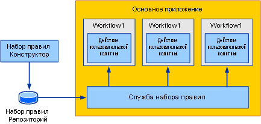
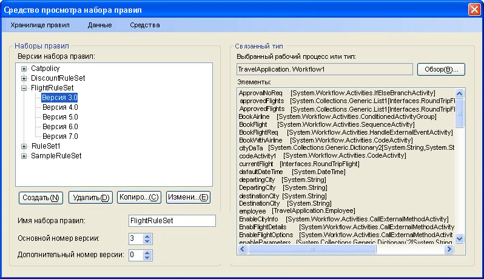
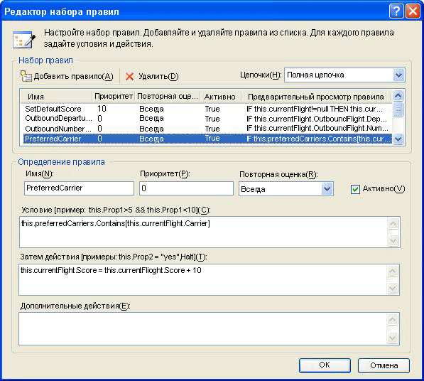
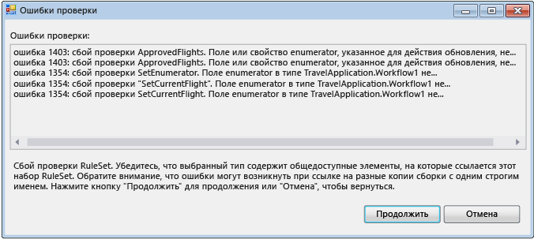
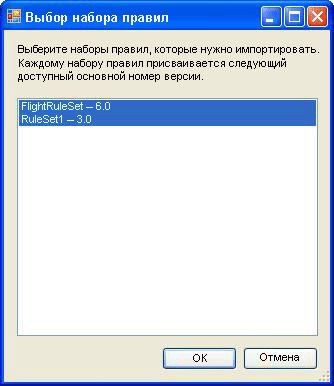

# <a name="external-ruleset-toolkit"></a>Набор средств внешнего набора правил

Обычно, когда правила используются в приложении рабочего процесса, они являются частью сборки. В некоторых случаях, возможно, потребуется создать наборы правил отдельно от сборки, чтобы можно было обновлять их, без повторного построения и развертывания сборки рабочего процесса. В этом образце показано, как управлять и изменять наборы правил в базе данных, а также как получить доступ к этим наборам правил из рабочего процесса в среде выполнения. Это позволяет запускать экземпляры рабочего процесса, чтобы автоматически включать изменения в наборах правил.

В примере набора средств "External RuleSet Toolkit" содержится средство на основе Windows Forms, которое можно использовать для управления и изменения версий набора правил в базе данных. Также включены действие и служба размещения для выполнения этих правил.

> [!NOTE]
> Данный образец требует [Microsoft SQL Server](https://go.microsoft.com/fwlink/?LinkId=96181).

Visual Studio предоставляет редактор набора правил в рамках Windows Workflow Foundation (WF). Редактор запускается двойным щелчком действия `Policy` в рабочем процессе; редактор выполняет сериализацию объекта набора правил в файл с расширением RULES, связанный с рабочим процессом (действие `Policy` запускает экземпляр набора правил из рабочего процесса). При построении проекта рабочего процесса выполняет компиляция в сборку файла с расширением RULES как ресурса.

Компоненты данного образца включают следующее:

- Средство пользовательского графического интерфейса набора правил, которое используется для редактирования и управления версиями набора правил в базе данных.

- Служба набора правил, настройка которой выполняется в ведущем приложении, осуществляет доступ к наборам правил из базы данных.

- Действие `ExternalPolicy` запрашивает набор правил из службы набора правил и запускает набор правил из рабочего процесса.

Взаимодействие компонентов показано на рисунке 1. В следующих разделах приведено описание каждого из компонентов.



Рис. 1. Общие сведения о примере

> [!IMPORTANT]
> Образцы уже могут быть установлены на компьютере. Перед продолжением проверьте следующий каталог (по умолчанию).
>
> `<InstallDrive>:\WF_WCF_Samples`
>
> Если этот каталог не существует, перейдите к [Windows Communication Foundation (WCF) и образцы Windows Workflow Foundation (WF) для .NET Framework 4](https://go.microsoft.com/fwlink/?LinkId=150780) для загрузки всех Windows Communication Foundation (WCF) и [!INCLUDE[wf1](../../../../includes/wf1-md.md)] примеры. Этот образец расположен в следующем каталоге.
>
> `<InstallDrive>:\WF_WCF_Samples\WF\Scenario\ExternalRuleSetToolKit`

## <a name="ruleset-tool"></a>Средство "RuleSet"

Снимок экрана средства RuleSet показан на рисунке 2. Из **Store правило** меню, можно загрузить доступные наборы правил из базы данных и сохранить отредактированные наборы правил обратно в хранилище. Файл конфигурации приложения предоставляет строку подключения базы данных для базы данных набора правил. При запуске это средство автоматически загружает наборы правил из настроенной базы данных.



Рис. 2. Обозреватель наборов правил

Средство "RuleSet" служит для применения основного и вспомогательного номеров версий к наборам правил, что позволяет одновременно создавать и хранить несколько версий (средство не предоставляет возможности блокировки или другие возможности управления конфигурацией, помимо поддержки версий). С помощью данного средства можно создавать новые версии набора правил или удалять существующие версии. При нажатии кнопки **New**, средство создает новое имя набора правил и применяет номер версии 1.0. При копировании версии средство создает копию выбранной версии набора правил, включая содержащиеся правила, и присваивает новые уникальные номера версий. Эти номера версий основаны на номерах версий существующих наборов правил. Имя и номера версий набора правил можно изменить с помощью связанных полей на форме.

При нажатии кнопки **изменение правил**, запускается редактор набора правил, как показано на рис. 3.



Рис. 3. Редактор набора правил

Это повторное размещение диалогового окна редактора, который является частью надстройки Windows Workflow Foundation Visual Studio. Оно предоставляет тот же набор функциональных возможностей, включая поддержку Intellisense. Правила создаются по конечному типу (например, рабочий процесс), связанный с набором правил в средстве; При нажатии кнопки **Обзор** в главном диалоговом окне средства, **Выбор рабочего процесса или типа** откроется диалоговое окно, как показано на рис. 4.


Рис. 4. Выбор рабочего процесса или типа

Можно использовать **Выбор рабочего процесса или типа** диалоговое окно, чтобы указать сборку и определенный тип внутри этой сборки. Этот тип является конечным типом, по которому создаются (и запускаются) правила. В большинстве случаев конечным типом является рабочий процесс или какой-либо другой тип действия. Тем не менее можно запустить набор правил по любому типу .NET.

Путь к файлу сборки и тип `name are stored with the` набора правил в базе данных, чтобы при получении набора правил из базы данных, программа пытается автоматически загрузить конечный тип.

При нажатии кнопки **ОК** в **Выбор рабочего процесса или типа** диалоговое окно, его Проверка выбранного типа на соответствие с набором правил, чтобы обеспечить все члены, на которые ссылаются правила в целевой тип. Ошибки отображаются в **ошибки проверки** диалоговое окно (см. рис. 5). Вы можете продолжить изменение несмотря на ошибки, или нажмите кнопку **отменить**. Из **средства** меню в главном диалоговом окне средства, можно щелкнуть **Validate** Чтобы выполнить повторную проверку версии набора правил на соответствие конечному действию.



Рис. 5. Ошибки проверки

Из **данных** меню в средстве можно импортировать и экспортировать наборы правил. При нажатии кнопки **импорта**, откроется диалоговое окно выбора файла, из которого можно выбрать файл с расширением RULES. Это может или не может быть файлом, изначально созданные в Visual Studio. В RULES-файле должен содержаться сериализованный экземпляр `RuleDefinitions` с коллекцией условий и коллекцией наборов правил. Средство не использует коллекцию условий, но он использует `RuleDefinitions` формате с расширением RULES, чтобы разрешить взаимодействие со средой Visual Studio.

После выбора Rules-файл, **Выбор набора правил** откроется диалоговое окно (см. рис. 6). Можно использовать диалоговое окно для выбора наборов правил из файла, который требуется импортировать (по умолчанию указаны все наборы правил). Наборы правил в RULES-файле не содержат номеров версии, поскольку их версии в рамках проекта WF совпадают с версией сборки. В процессе импорта средство автоматически присваивает следующий доступный основной номер версии (который можно изменить после импорта); Вы увидите присвоенные номера версий **Выбор набора правил** списка.

Для каждого импортируемого набора правил средство пытается поместить связанный тип из папки bin\Debug в местоположение RULES-файла (если есть), в зависимости от членов, используемых в наборе правил. Если средство обнаруживает несколько соответствующих типов, оно пытается выбирать тип в соответствии с совпадением между именем RULES-файла и именем типа (например, тип `Workflow1` соответствует файлу "Workflow1.rules"). При наличии нескольких совпадений предлагается выбрать тип. Если этот механизм автоматической идентификации не удалось найти соответствующую сборку или тип, то после импорта можно щелкнуть **Обзор** в диалоговом окне основного средства для перехода с соответствующими типами.



Рис. 6. Выбор набора правил

При нажатии кнопки **Экспорт данных** из в главном меню средства, **Выбор набора правил** снова отображается диалоговое окно, из которого можно определить наборы правил из базы данных, которое должно быть экспортировано. При нажатии кнопки **ОК**, **сохранить файл** откроется диалоговое окно, в котором можно указать имя и местоположение конечного Rules-файла. Поскольку в RULES-файл не содержатся сведения о версии, для заданного имени набора правил можно выбрать только одну версию набора правил.

## <a name="policyfromservice-activity"></a>Действие "PolicyFromService".

Код для действия `PolicyFromService` является прямолинейным. Функционирование этого кода во многом аналогично действию `Policy`, предоставляемому в WF, однако вместо извлечения конечного набора правил из RULES-файла данный код выполняет вызов службы размещения, чтобы получить экземпляр набора правил. Затем код запускает набор правил из экземпляра действия корневого рабочего процесса.

Чтобы использовать данное действие в рабочем процессе, следует добавить ссылку на сборки `PolicyActivities` и `RuleSetService` из проекта рабочего процесса. Обсуждение способов добавления действия на панель инструментов см. в процедуре в конце данного раздела.

После того, как действие помещено в рабочий процесс, необходимо указать имя набора правил, который требуется запустить. Можно ввести имя как буквенное значение, либо выполнить привязку к переменной рабочего процесса или свойству другого действия. Дополнительно можно задать номера версий для конкретного набора правил, который требуется запустить. Если оставить значение по умолчанию "0" для основного и вспомогательного номеров версий, действию будет автоматически присвоен номер последней версии в базе данных.

## <a name="ruleset-service"></a>Служба "RuleSet"

Эта служба отвечает за извлечение заданной версии набора правил из базы данных и ее возврат в вызывающее действие. Как уже обсуждалось ранее, если значения основной и вспомогательной версии, переданные в вызов `GetRuleSet` оба равны "0", служба выполняет извлечение последней версии. На этой стадии не выполняется кэширование определений или экземпляров набора правил; также, отсутствуют функции пометки версий набора правил как "развертываемых", чтобы отличить их от наборов правил в процессе выполнения.

База данных, доступ к которой осуществляется службой, должна быть настроена на узле с помощью файла конфигурации приложения.

#### <a name="to-run-the-tool"></a>Запуск средства

1. В папке, в которой задана таблица набора правил, используемая средством и службой, также содержится файл "Setup.sql". Можно запустить пакетный файл "Setup.cmd", чтобы создать базу данных правил в SQL Express и задать таблицу набора правил.

2. При редактировании пакетного файла или файла "Setup.sql", если использование SQL Express или размещение таблицы в базе данных с именем, отличным от `Rules`, не задано, файлы конфигурации приложения в средстве "RuleSet" и проекты `UsageSample` следует редактировать, используя одинаковые сведения.

3. После запуска скрипта "Setup.sql" можно построить решение `ExternalRuleSetToolkit`, а затем запустить средство "RuleSet" из проекта "ExternalRuleSetTool".

4. Решение консольного приложения последовательного рабочего процесса `RuleSetToolkitUsageSample` включает образец рабочего процесса. Рабочий процесс включает действие `PolicyFromService` и две переменные: `orderValue` и `discount`, для которых выполняется запуск конечного набора правил.

5. Чтобы использовать этот образец, необходимо построить решение `RuleSetToolkitUsageSample`. Затем в главном меню средства набора правил нажмите кнопку **импорта данных** и укажите файл "discountruleset.Rules" в папке "rulesettoolkitusagesample". Нажмите кнопку **Store правил-Сохранить** пункт меню, чтобы сохранить импортированный набор правил в базе данных.

6. Поскольку ссылка на сборку `PolicyActivities` дана из образца проекта рабочего процесса, действие `PolicyFromService` используется в рабочем процессе. Тем не менее, это оно не отображается на панели инструментов по умолчанию. Чтобы добавить действие на панель инструментов, необходимо сделать следующее.

    - Щелкните правой кнопкой мыши панель и выберите **Выбор элементов** (это может занять некоторое время).

    - Когда **Выбор элементов панели элементов** откроется диалоговое окно, нажмите кнопку **действия** вкладки.

    - Перейдите к `PolicyActivities` сборки в `ExternalRuleSetToolkit` решения и нажмите кнопку **откройте**.

    - Убедитесь, что `PolicyFromService` действие выбранного в **Выбор элементов панели элементов** диалоговое окно, а затем нажмите кнопку **ОК**.

    - Действие должно появиться в области элементов в **компоненты "rulesettoolkitusagesample"** категории.

7. Служба "RuleSet" уже настроена на узле консольного приложения с помощью приведенного ниже оператора в файле "Program.cs".

    ```csharp
    workflowRuntime.AddService(new RuleSetService());
    ```

8. Можно также настроить службу на узле с помощью файла конфигурации. Дополнительные сведения см. в документации по пакету SDK.

9. Файл конфигурации приложения добавляется в проект рабочего процесса, чтобы указать строку подключения для базы данных, которая будет использоваться службой. Средством "RuleSet" должна использоваться та же строка подключения, что указывает на базу данных, содержащую таблицу набора правил.

10. Теперь можно выполнить проект `RuleSetToolkitUsageSample`, а также остальные консольные приложения рабочего процесса. Нажмите клавишу F5 или Ctrl + F5 в Visual Studio или запустить непосредственно файл RuleSetToolkitUsageSample.exe.

    > [!NOTE]
    > Чтобы повторную скомпилировать выборку использования, необходимо закрыть средство "RuleSet", поскольку средство загружает сборку выборки использования.
