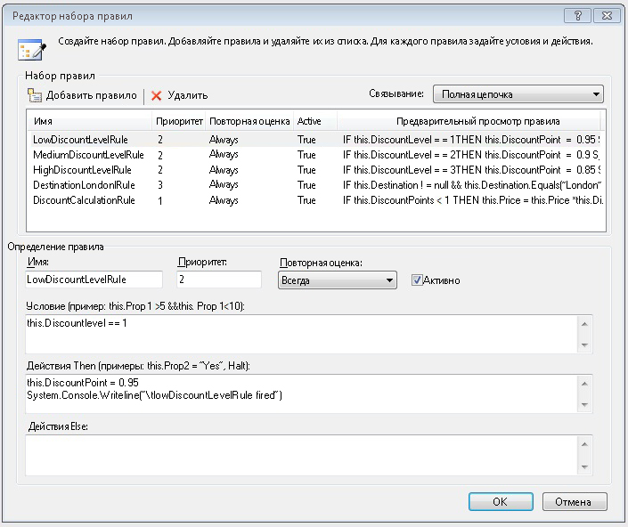
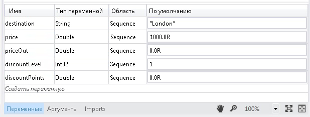
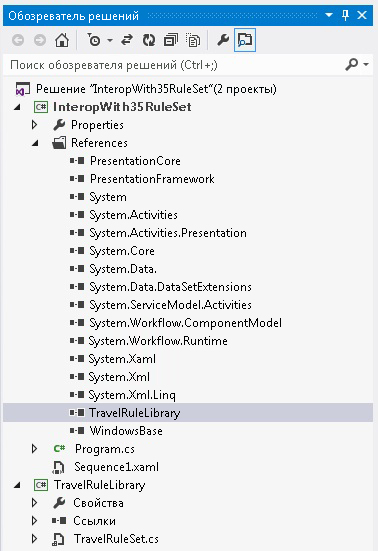
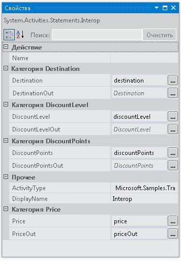

# <a name="interop-with-35-rule-set"></a><span data-ttu-id="e3ccf-102">Взаимодействие с набором правил 3.5</span><span class="sxs-lookup"><span data-stu-id="e3ccf-102">Interop with 3.5 Rule Set</span></span>
<span data-ttu-id="e3ccf-103">В этом примере демонстрируется использование <xref:System.Activities.Statements.Interop> для интеграции с пользовательским действием в [!INCLUDE[netfx35_short](../../../../includes/netfx35-short-md.md)] с помощью <!--zz <xref:System.Workflow.Activities.Policy> --> `System.Workflow.Activities.Policy` и правил.</span><span class="sxs-lookup"><span data-stu-id="e3ccf-103">This sample demonstrates the use of the <xref:System.Activities.Statements.Interop> activity to integrate with a custom activity in [!INCLUDE[netfx35_short](../../../../includes/netfx35-short-md.md)] using <!--zz <xref:System.Workflow.Activities.Policy> --> `System.Workflow.Activities.Policy` and rules.</span></span> <span data-ttu-id="e3ccf-104">Оно передает данные для пользовательского действия, привязывая переменные [!INCLUDE[netfx_current_long](../../../../includes/netfx-current-long-md.md)] к свойствам зависимостей, предоставляемым пользовательским действием.</span><span class="sxs-lookup"><span data-stu-id="e3ccf-104">It passes data to the custom activity by binding [!INCLUDE[netfx_current_long](../../../../includes/netfx-current-long-md.md)] variables to the dependency properties exposed by the custom activity.</span></span>  
  
## <a name="requirements"></a><span data-ttu-id="e3ccf-105">Требования</span><span class="sxs-lookup"><span data-stu-id="e3ccf-105">Requirements</span></span>  
  
1.  [!INCLUDE[vs_current_long](../../../../includes/vs-current-long-md.md)]  
  
2.  [!INCLUDE[netfx_current_long](../../../../includes/netfx-current-long-md.md)]  
  
3.  [!INCLUDE[netfx35_long](../../../../includes/netfx35-long-md.md)]  
  
## <a name="demonstrates"></a><span data-ttu-id="e3ccf-106">Демонстрации</span><span class="sxs-lookup"><span data-stu-id="e3ccf-106">Demonstrates</span></span>  
 <span data-ttu-id="e3ccf-107"><xref:System.Activities.Statements.Interop> действие, <!--zz <xref:System.Workflow.Activities.Policy> --> `System.Workflow.Activities.Policy` действия в [!INCLUDE[netfx35_short](../../../../includes/netfx35-short-md.md)] со свойствами зависимости</span><span class="sxs-lookup"><span data-stu-id="e3ccf-107"><xref:System.Activities.Statements.Interop> activity, <!--zz <xref:System.Workflow.Activities.Policy> --> `System.Workflow.Activities.Policy` activity in [!INCLUDE[netfx35_short](../../../../includes/netfx35-short-md.md)] with dependency properties</span></span>  
  
## <a name="discussion"></a><span data-ttu-id="e3ccf-108">Обсуждение</span><span class="sxs-lookup"><span data-stu-id="e3ccf-108">Discussion</span></span>  
 <span data-ttu-id="e3ccf-109">В этом образце демонстрируется один из сценариев интеграции для интеграции с действием [!INCLUDE[netfx35_short](../../../../includes/netfx35-short-md.md)].</span><span class="sxs-lookup"><span data-stu-id="e3ccf-109">The sample demonstrates one of the integration scenarios for integrating with a [!INCLUDE[netfx35_short](../../../../includes/netfx35-short-md.md)] activity.</span></span> <span data-ttu-id="e3ccf-110">Этот пример включает [!INCLUDE[netfx35_short](../../../../includes/netfx35-short-md.md)] пользовательское действие, которое вызывает <!--zz <xref:System.Workflow.Activities.Policy> --> `System.Workflow.Activities.Policy` действия.</span><span class="sxs-lookup"><span data-stu-id="e3ccf-110">This sample includes a [!INCLUDE[netfx35_short](../../../../includes/netfx35-short-md.md)] custom activity that invokes a <!--zz <xref:System.Workflow.Activities.Policy> --> `System.Workflow.Activities.Policy` activity.</span></span>  
  
## <a name="travelrulelibrary"></a><span data-ttu-id="e3ccf-111">TravelRuleLibrary</span><span class="sxs-lookup"><span data-stu-id="e3ccf-111">TravelRuleLibrary</span></span>  
 <span data-ttu-id="e3ccf-112">При открытии TravelRuleSet.cs в конструкторе следующим образом показывается последовательное пользовательское действие, содержащее действие PolicyActivity:</span><span class="sxs-lookup"><span data-stu-id="e3ccf-112">Opening TravelRuleSet.cs in the designer shows a custom sequential activity that contains a Policy activity as follows</span></span>  
  
 <span data-ttu-id="e3ccf-113"></span><span class="sxs-lookup"><span data-stu-id="e3ccf-113"></span></span>  
  
 <span data-ttu-id="e3ccf-114">Дважды щелкните **DiscountPolicy** действие политики для просмотра правил.</span><span class="sxs-lookup"><span data-stu-id="e3ccf-114">Double-click the **DiscountPolicy** policy activity to examine the rules.</span></span> <span data-ttu-id="e3ccf-115">Появляется редактор правил, показывающий правила.</span><span class="sxs-lookup"><span data-stu-id="e3ccf-115">The Rules editor appears to show the rules.</span></span>  
  
 <span data-ttu-id="e3ccf-116"></span><span class="sxs-lookup"><span data-stu-id="e3ccf-116"></span></span>  
  
 <span data-ttu-id="e3ccf-117">Щелкните правой кнопкой мыши **DiscountPolicy** действие и выберите **Просмотр кода** возможность рассмотреть с кодом C# код, данного действия.</span><span class="sxs-lookup"><span data-stu-id="e3ccf-117">Right-click the **DiscountPolicy** activity and select the **View Code** option to examine the code-beside C# code that goes with this activity.</span></span> <span data-ttu-id="e3ccf-118">Проверьте значения свойства зависимости для `DiscountLevel`.</span><span class="sxs-lookup"><span data-stu-id="e3ccf-118">Observe the dependency property setting for `DiscountLevel`.</span></span> <span data-ttu-id="e3ccf-119">Это эквивалентно <xref:System.Activities.Argument> в [!INCLUDE[netfx_current_short](../../../../includes/netfx-current-short-md.md)].</span><span class="sxs-lookup"><span data-stu-id="e3ccf-119">This is equivalent to an <xref:System.Activities.Argument> in [!INCLUDE[netfx_current_short](../../../../includes/netfx-current-short-md.md)].</span></span>  
  
```  
public static DependencyProperty DiscountLevelProperty = DependencyProperty.Register("DiscountLevel", typeof(int), typeof(TravelRuleSet));  
  
[DescriptionAttribute("DiscountLevel")]  
[CategoryAttribute("DiscountLevel Category")]  
[BrowsableAttribute(true)]  
[DesignerSerializationVisibilityAttribute(DesignerSerializationVisibility.Visible)]  
public int DiscountLevel  
{  
   get  
   {  
return ((int)base.GetValue(TravelRuleSet.DiscountLevelProperty)));  
   }  
   set  
   {  
base.SetValue(TravelRuleSet.DiscountLevelProperty, value);  
   }  
}  
```  
  
## <a name="interopwith35ruleset"></a><span data-ttu-id="e3ccf-120">InteropWith35RuleSet</span><span class="sxs-lookup"><span data-stu-id="e3ccf-120">InteropWith35RuleSet</span></span>  
 <span data-ttu-id="e3ccf-121">Это проект последовательного рабочего процесса [!INCLUDE[netfx_current_short](../../../../includes/netfx-current-short-md.md)], использующий действие <xref:System.Activities.Statements.Interop> для интеграции с пользовательским набором правил, создаваемым в проекте TravelRuleLibrary.</span><span class="sxs-lookup"><span data-stu-id="e3ccf-121">This is a [!INCLUDE[netfx_current_short](../../../../includes/netfx-current-short-md.md)] sequential workflow project that uses the <xref:System.Activities.Statements.Interop> activity to integrate with the custom rule set created in the TravelRuleLibrary project.</span></span> <span data-ttu-id="e3ccf-122">Переменные создаются при действии верхнего уровня <xref:System.Activities.Statements.Sequence> следующим образом.</span><span class="sxs-lookup"><span data-stu-id="e3ccf-122">Variables are created on the top-level <xref:System.Activities.Statements.Sequence> as follows.</span></span>  
  
 <span data-ttu-id="e3ccf-123"></span><span class="sxs-lookup"><span data-stu-id="e3ccf-123"></span></span>  
  
 <span data-ttu-id="e3ccf-124"></span><span class="sxs-lookup"><span data-stu-id="e3ccf-124"></span></span>  
  
 <span data-ttu-id="e3ccf-125">Наконец, действие <xref:System.Activities.Statements.Interop> используется для интеграции с TravelRuleSet.</span><span class="sxs-lookup"><span data-stu-id="e3ccf-125">Lastly, the <xref:System.Activities.Statements.Interop> activity is used to integrate with the TravelRuleSet.</span></span> <span data-ttu-id="e3ccf-126">Переменные, объявленные ранее в <xref:System.Activities.Statements.Sequence>, используются для привязки к свойствам зависимости.</span><span class="sxs-lookup"><span data-stu-id="e3ccf-126">The variables that were declared earlier on the <xref:System.Activities.Statements.Sequence> are used to bind to the dependency properties.</span></span>  
  
 <span data-ttu-id="e3ccf-127"></span><span class="sxs-lookup"><span data-stu-id="e3ccf-127"></span></span>  
  
 <span data-ttu-id="e3ccf-128"></span><span class="sxs-lookup"><span data-stu-id="e3ccf-128"></span></span>  
  
 <span data-ttu-id="e3ccf-129"></span><span class="sxs-lookup"><span data-stu-id="e3ccf-129"></span></span>  
  
> [!IMPORTANT]
>  <span data-ttu-id="e3ccf-130">Образцы уже могут быть установлены на компьютере.</span><span class="sxs-lookup"><span data-stu-id="e3ccf-130">The samples may already be installed on your machine.</span></span> <span data-ttu-id="e3ccf-131">Перед продолжением проверьте следующий каталог (по умолчанию).</span><span class="sxs-lookup"><span data-stu-id="e3ccf-131">Check for the following (default) directory before continuing.</span></span>  
>   
>  `<InstallDrive>:\WF_WCF_Samples`  
>   
>  <span data-ttu-id="e3ccf-132">Если этот каталог не существует, перейдите к [Windows Communication Foundation (WCF) и образцы Windows Workflow Foundation (WF) для .NET Framework 4](https://go.microsoft.com/fwlink/?LinkId=150780) для загрузки всех Windows Communication Foundation (WCF) и [!INCLUDE[wf1](../../../../includes/wf1-md.md)] примеры.</span><span class="sxs-lookup"><span data-stu-id="e3ccf-132">If this directory does not exist, go to [Windows Communication Foundation (WCF) and Windows Workflow Foundation (WF) Samples for .NET Framework 4](https://go.microsoft.com/fwlink/?LinkId=150780) to download all Windows Communication Foundation (WCF) and [!INCLUDE[wf1](../../../../includes/wf1-md.md)] samples.</span></span> <span data-ttu-id="e3ccf-133">Этот образец расположен в следующем каталоге.</span><span class="sxs-lookup"><span data-stu-id="e3ccf-133">This sample is located in the following directory.</span></span>  
>   
>  `<InstallDrive>:\WF_WCF_Samples\WF\Basic\Built-InActivities\InteropWith35RuleSet`
