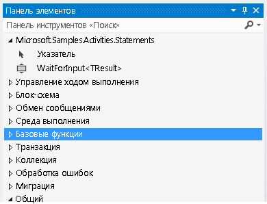

# Ожидание входного действия
Этот образец демонстрирует способ создания именованных закладок в рабочем процессе. Windows Workflow Foundation (WF) предоставляет действия для декларативного создания закладок. В связи с этим, когда необходимо создать закладку в рабочем процессе, необходимо написать пользовательское действие, которое ее создаст. Действие `WaitForInput`, определенное в этом образце, предоставляет эти функциональные возможности. С его помощью пользователи могут создавать в рабочем процессе закладки декларативным образом.  
  
## Проекты в этом образце  
  
|**Имя проекта**|**Описание**|**Основные файлы**|  
|-|-|-|  
|WaitForInput|Содержит действие `WaitForInput` и его конструктор|WaitForInput.cs   Определение действия `WaitForInput`.|  
|||WaitForInputDesigner.xaml   Пользовательский конструктор для действия `WaitForInput`.|  
|||TypeToFirstGenericArgumentConverter.cs   Преобразователь типа WPF, используемый для обновления универсального типа действия в конструкторе.|  
|WaitForInputTestClient|Образец клиентского приложения, настраивающего и запускающего рабочий процесс с помощью нескольких действий WaitForInput в конструкторе рабочих процессов.|Sequence1.xaml   Последовательный рабочий процесс, использующий действие `WaitForInput`.|  
|||Program.cs   Выполняет экземпляр рабочего процесса, определенного в Sequence1.xaml.|  
  
## Действие WaitForInput  
 Действие `WaitForInput` создает именованную закладку в рабочем процессе. Закладка ждет сигнала и получает данные заданного ей типа. После продолжения закладки данные, переданные рабочему процессу, доступны через свойство `Result`.  
  
 Действие `WaitForInput` является производным от класса <xref:System.Activities.NativeActivity>, поскольку оно должно создавать закладки, доступные только через класс <xref:System.Activities.NativeActivityContext>.  
  
 Действие имеет три атрибута, применяющиеся к нему для привязки конструктора, для добавления функции общего аргумента, которая может быть обновлена, и для задания общего типа по умолчанию для строки. Действие также имеет аргументы, перечисленные в следующей таблице.  
  
|**Name**|**Type**|**Описание**|  
|-|-|-|  
|TResult|Общий аргумент (TResult)|Тип закладки. Это тип данных, которые должны быть переданы закладке при продолжении.|  
|BookmarkName|Параметр InArgument\<строка >|Имя закладки.|  
|Результат|Параметр InArgument\<TResult >|Данные, передаваемые действию при продолжении с закладки.|  
  
## Конструктор действия WaitForInput  
 Конструктор действий `WaitForInput` реализован в файле WaitForInputDesigner.xaml. Действие `WaitForInput` и его конструктор включены в одну сборку. На следующем рисунке показано действие `WaitForInput` на панели элементов в категории с таким же именем, как у сборки.  
  
   
  
 На следующем рисунке показан конструктор `WaitForInput`. Поскольку действие `WaitForInput` является очень простым, конструктор позволяет задавать все аргументы напрямую в области конструктора.  
  
   
  
#### Использование этого образца  
  
1.  Откройте файл WaitForInput.sln в среде [!INCLUDE[vs2010](../../../../includes/vs2010-md.md)].  
  
2.  Для построения решения нажмите CTRL+SHIFT+B.  
  
3.  Чтобы запустить образец без отладки, нажмите сочетание клавиш CTRL+F5.  
  
> [!IMPORTANT]
>  Образцы уже могут быть установлены на компьютере. Перед продолжением проверьте следующий каталог (по умолчанию).  
>   
>  `<InstallDrive>:\WF_WCF_Samples`  
>   
>  Если этот каталог не существует, перейдите к [Windows Communication Foundation (WCF) и образцы Windows Workflow Foundation (WF) для .NET Framework 4](https://go.microsoft.com/fwlink/?LinkId=150780) для загрузки всех Windows Communication Foundation (WCF) и [!INCLUDE[wf1](../../../../includes/wf1-md.md)] примеры. Этот образец расположен в следующем каталоге.  
>   
>  `<InstallDrive>:\WF_WCF_Samples\WF\Scenario\ActivityLibrary\WaitForInput`