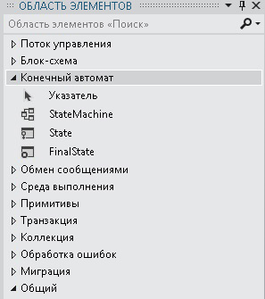

# Рабочие процессы конечного автомата
Конечный автомат — это широко известный принцип разработки программ.Действие <xref:System.Activities.Statements.StateMachine>, а также <xref:System.Activities.Statements.State>, <xref:System.Activities.Statements.Transition> и другие действия могут использоваться для построения программ рабочего процесса конечных автоматов.В этом разделе представлены общие сведения о создании рабочих процессов конечного автомата.  
  
## Общие сведения о рабочем процессе конечного автомата  
 Рабочие процессы конечного автомата обеспечивают стиль моделирования, с помощью которого вы можете моделировать рабочий процесс в режиме, управляемом событиями.Действие <xref:System.Activities.Statements.StateMachine> содержит состояния и переходы, которые образуют логику конечного автомата и могут использоваться везде, где может использоваться действие.В среде выполнения конечного автомата существуют следующие классы.  
  
-   <xref:System.Activities.Statements.StateMachine>  
  
-   <xref:System.Activities.Statements.State>  
  
-   <xref:System.Activities.Statements.Transition>  
  
 В ходе создания рабочего процесса конечного автомата состояния добавляются к действию <xref:System.Activities.Statements.StateMachine>, а переходы используются для управления переключением между состояниями.На следующем снимке экрана шага [Как создать рабочий процесс конечного автомата](../../../docs/framework/windows-workflow-foundation//how-to-create-a-state-machine-workflow.md) из учебника [Учебник по началу работы](../../../docs/framework/windows-workflow-foundation//getting-started-tutorial.md) приведен рабочий процесс конечного автомата с тремя состояниями и тремя переходами.**Инициализировать целевой объект** — исходное состояние, представляющее первое состояние в рабочем процессе.Это обозначается линией, ведущей к нему из узла **Начало**.Конечное состояние в рабочем процессе — **FinalState**, представляющее собой точку, в которой рабочий процесс завершается.  
  
   
  
 Рабочий процесс конечного автомата должен содержать только одно начальное состояние и хотя бы одно окончательное состояние.Каждое состояние, отличное от конечного, должно иметь по крайней мере один переход.В следующих разделах описывается создание и настройка состояний и переходов.  
  
## Создание и настройка состояний  
 <xref:System.Activities.Statements.State> представляет состояние, в котором может находиться конечный автомат.Чтобы добавить <xref:System.Activities.Statements.State> в рабочий процесс, перетащите конструктор действий **Состояние** из раздела **Конечный автоматобласти элементов** и поместите его в действие <xref:System.Activities.Statements.StateMachine> в области [!INCLUDE[wfd1](../../../includes/wfd1-md.md)].  
  
   
  
 Чтобы настроить состояние как **Начальное состояние**, щелкните правой кнопкой мыши состояние и выберите **Задать как начальное состояние**.Кроме того, если начальное состояние не было задано, начальное состояние может быть назначено путем перетаскивания линии от узла **Начало** в верхней части рабочего процесса до требуемого состояния.Когда действие <xref:System.Activities.Statements.StateMachine> помещается в конструктор рабочих процессов, для него задается предварительно настроенное начальное состояние с именем **State1**.Рабочий процесс конечного автомата должен содержать только одно начальное состояние.  
  
 Состояние, которое представляет завершающее состояние в конечном автомате, называется конечным состоянием.Конечное состояние — это состояние, для свойства <xref:System.Activities.Statements.State.IsFinal%2A> которого задано значение `true`, которое не имеет действия <xref:System.Activities.Statements.State.Exit%2A>, а также не имеет переходов, исходящих из него.Чтобы добавить конечное состояние рабочему процессу, перетащите конструктор действий **FinalState** из раздела **Конечный автоматобласти элементов** и поместите его в действие <xref:System.Activities.Statements.StateMachine> в области [!INCLUDE[wfd1](../../../includes/wfd1-md.md)].Рабочий процесс конечного автомата должен иметь как минимум одно конечное состояние.  
  
### Настройка действия входа и выхода  
 Состояние может иметь действия <xref:System.Activities.Statements.State.Entry%2A> и действия <xref:System.Activities.Statements.State.Exit%2A>.Состояние, настроенное как конечное состояние, может содержать только действия входа.Когда экземпляр рабочего процесса входит в состояние, выполняются все действия, находящиеся в действии входа.После завершения действия входа планируются триггеры для переходов состояния.При подтверждении перехода к другому состоянию выполняются действия в действии выхода, даже если осуществляется переход в то же самое состояние.После завершения действия выхода выполняются действия, находящиеся в действии перехода, а затем выполняется переход в новое состояние, и потом производится планирование его действий входа.  
  
> [!NOTE]
>  При отладке рабочего процесса конечного автомата точки останова можно поместить в корневое действие конечного автомата и в действия в рабочем процессе конечного автомата.Точки останова нельзя размещать непосредственно на переходах, однако их можно размещать на любых действиях, которые содержатся в состояниях и переходах.  
  
## Создание и настройка переходов  
 Все состояния, кроме конечного, должны иметь по крайней мере один переход. Конечное состояние не должно иметь переходов.Переходы можно добавлять после добавления состояния в рабочий процесс конечного автомата, а также при помещении состояния в область конструктора.  
  
 Чтобы добавить <xref:System.Activities.Statements.State> и создать переход за один шаг, перетащите действие **Состояние** из раздела **Конечный автоматобласти элементов** и поместите его над другим состоянием в конструкторе рабочих процессов.При наведении <xref:System.Activities.Statements.State> на другое <xref:System.Activities.Statements.State> вокруг другого <xref:System.Activities.Statements.State> будут отображены четыре треугольника.Если <xref:System.Activities.Statements.State> поместить на один из четырех треугольников, оно будет добавлено к конечному автомату, а также будет создан переход из исходного <xref:System.Activities.Statements.State> в целевое <xref:System.Activities.Statements.State>.Дополнительные сведения см. в разделе [Конструктор действий переходов](../Topic/Transition%20Activity%20Designer.md).  
  
 После создания состояния существуют два способа создания переходов.Первый способ — можно перетащить состояние из рабочей области конструктора рабочих процессов, навести его на существующее состояние и поместить его на одну из точек перетаскивания.Это очень похоже на метод, описанный в предыдущем разделе.Вы можете также навести мышь на выбранное состояние источника и перетащить линию до нужного целевого состояния.  
  
> [!NOTE]
>  Для одного состояния в конечном автомате может быть создано до 76 переходов в конструкторе рабочих процессов.Количество переходов состояний для рабочих процессов, созданных за пределами конструктора, ограничивается только системными ресурсами.  
  
 Переход может содержать объекты <xref:System.Activities.Statements.Transition.Trigger%2A>, <xref:System.Activities.Statements.Transition.Action%2A> и <xref:System.Activities.Statements.Transition.Condition%2A>.<xref:System.Activities.Statements.Transition.Trigger%2A> перехода планируется после завершения действия <xref:System.Activities.Statements.State.Entry%2A> исходного состояния перехода.Обычно <xref:System.Activities.Statements.Transition.Trigger%2A> представляет собой действие, ожидающее появления определенного типа события, но он может быть любым действием или даже не иметь действия.После завершения действия <xref:System.Activities.Statements.Transition.Trigger%2A> вычисляется значение <xref:System.Activities.Statements.Transition.Condition%2A> \(если существует\).Если действие <xref:System.Activities.Statements.Transition.Trigger%2A> отсутствует, выполняется немедленное вычисление условия <xref:System.Activities.Statements.Transition.Condition%2A>.Если условие оказывается равным `false`, то переход отменяется, а действие <xref:System.Activities.Statements.Transition.Trigger%2A> для всех переходов из состояния планируется заново.Если существуют другие переходы, которые совместно используют одно и то же исходное состояние, что и текущий переход, эти действия <xref:System.Activities.Statements.Transition.Trigger%2A> также отменяются и планируются повторно.Если <xref:System.Activities.Statements.Transition.Condition%2A> имеет значение `true` или условие отсутствует, выполняется действие <xref:System.Activities.Statements.State.Exit%2A> исходного состояния, а затем выполняется <xref:System.Activities.Statements.Transition.Action%2A> перехода.После завершения <xref:System.Activities.Statements.Transition.Action%2A> управление передается **Целевому** состоянию.  
  
 Переходы, имеющие общий триггер, называются переходами с общим триггером.Каждый переход в группе переходов с общим триггером имеет один и тот же триггер, но уникальные условие <xref:System.Activities.Statements.Transition.Condition%2A> и действие.Чтобы добавить дополнительные действия в переход и создать общий переход, щелкните круг, указывающий начало нужного перехода, и перетащите его в нужное состояние.Новый переход будет совместно использовать тот же триггер, что и исходный переход, но он будет иметь уникальное условие и действие.Общие переходы также можно создавать в конструкторе переходов, щелкнув в нижней части конструктора **Добавление перехода с общим триггером**, а затем выбрав требуемое целевое состояние из раскрывающегося списка **Состояния, доступные для подключения**.  
  
> [!NOTE]
>  Обратите внимание, что если состояние <xref:System.Activities.Statements.Transition.Condition%2A> перехода вычисляется как `False` \(или все условия перехода с общим триггером вычисляются как `False`\), переход не выполняется, а все триггеры для всех переходов из состояния будут запланированы заново.  
  
 Дополнительные сведения о создании рабочих процессов конечного автомата см. в разделах [Как создать рабочий процесс конечного автомата](../../../docs/framework/windows-workflow-foundation//how-to-create-a-state-machine-workflow.md), [Конструктор действий StateMachine](../Topic/StateMachine%20Activity%20Designer.md), [Конструктор State Activity](../Topic/State%20Activity%20Designer.md), [Конструктор FinalState Activity](../Topic/FinalState%20Activity%20Designer.md) и [Конструктор действий переходов](../Topic/Transition%20Activity%20Designer.md).  
  
## Терминология конечного автомата  
 В этом разделе описывается словарь конечного автомата, используемый на протяжении данного раздела.  
  
 State  
 Блок, который составляет основу конечного автомата.Конечный автомат может находиться в одном определенном состоянии в любой момент времени.  
  
 Действие входа  
 Действие, выполняемое при входе в состояние  
  
 Действие выхода  
 Действие, выполняемое при выходе из состояния  
  
 Переход  
 Прямая связь между двумя состояниями, которые представляют полную реакцию конечного автомата на возникновение события определенного типа.  
  
 Общий переход  
 Переход, который имеет общее исходное состояние и триггер с одним или несколькими переходами, но уникальное условие и действие.  
  
 Триггер  
 Запускающее действие, которое вызывает переход.  
  
 Условие  
 Ограничение, которое вычисляется в `true` после выполнения триггера, чтобы допустить завершение перехода.  
  
 Действие перехода  
 Действие, которое выполняется при выполнении определенного перехода.  
  
 Переход по условию  
 Переход с явным условием.  
  
 Переход на себя  
 Переход от состояния к тому же состоянию.  
  
 Начальное состояние  
 Состояние, которое представляет начальную точку конечного автомата.  
  
 Конечное состояние  
 Состояние, представляющее завершение конечного автомата.  
  
## См. также  
 [Как создать рабочий процесс конечного автомата](../../../docs/framework/windows-workflow-foundation//how-to-create-a-state-machine-workflow.md)   
 [Конструктор действий StateMachine](../Topic/StateMachine%20Activity%20Designer.md)   
 [Конструктор State Activity](../Topic/State%20Activity%20Designer.md)   
 [Конструктор FinalState Activity](../Topic/FinalState%20Activity%20Designer.md)   
 [Конструктор действий переходов](../Topic/Transition%20Activity%20Designer.md)