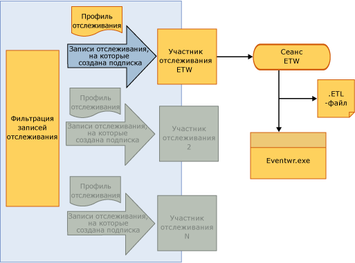

# <a name="tracking-participants"></a>Участники отслеживания
Участниками отслеживания являются точки расширения, обеспечивающие разработчику рабочего процесса доступ к объектам <xref:System.Activities.Tracking.InteropTrackingRecord.TrackingRecord%2A> и возможность их обработки. [!INCLUDE[netfx_current_long](../../../includes/netfx-current-long-md.md)] включает стандартного участника отслеживания, который пишет записи отслеживания в виде средства трассировки событий для Windows (ETW). Если это не отвечает заданным требованиям, то можно создать своего собственного участника отслеживания.  
  
## <a name="tracking-participants"></a>Участники отслеживания  
 Инфраструктура отслеживания позволяет применять фильтр к исходящим записям отслеживания таким образом, что участник может подписаться на подмножество записей. Фильтр применяется через профиль отслеживания.  
  
 Windows Workflow Foundation (WF) в [!INCLUDE[netfx_current_short](../../../includes/netfx-current-short-md.md)] предоставляет участника отслеживания, который пишет записи отслеживания в сеанс ETW. Участник настраивается в службе рабочего процесса путем добавления в файл конфигурации поведения, связанного с отслеживанием. Включив участника отслеживания ETW, можно будет просматривать записи отслеживания в обозревателе событий. Образец пакета SDK для отслеживания на основе ETW помогает освоиться с отслеживанием WF с помощью участника отслеживания на основе ETW.  
  
## <a name="etw-tracking-participant"></a>Участник отслеживания ETW  
 [!INCLUDE[netfx_current_short](../../../includes/netfx-current-short-md.md)] включает участника отслеживания ETW, который вносит записи в сеанс ETW. Это делается очень эффективно, с минимальным воздействием на работу приложения и пропускную способность сервера. Преимущество использования стандартного участника отслеживания трассировки событий Windows в том, что получаемые им записи отслеживания можно просматривать в других приложениях и системных журналах в обозревателе событий Windows.  
  
 Cтандартный участник отслеживания ETW настраивается в файле Web.config, как показано в следующем примере.  
  
```xml  
<configuration>  
  <system.web>  
    <compilation debug="true" targetFramework="4.0" />  
  </system.web>  
  <system.serviceModel>  
    <behaviors>  
      <serviceBehaviors>  
        <behavior>  
          <etwTracking profileName="Sample Tracking Profile"/>  
        </behavior>  
      </serviceBehaviors>  
    </behaviors>  
   <tracking>  
      <profiles>  
        <trackingProfile name="Sample Tracking Profile">  
        ….  
       </trackingProfile>  
      </profiles>  
    </tracking>  
  </system.serviceModel>  
</configuration>  
```  
  
> [!NOTE]
>  Если имя `trackingProfile` не указано (например, это просто `<etwTracking/>` или `<etwTracking profileName=""/>`), используется по умолчанию профиль отслеживания, установленный с [!INCLUDE[netfx_current_short](../../../includes/netfx-current-short-md.md)] в файле Machine.config.  
  
 По умолчанию профиль отслеживания в файле Machine.config подписывается на записи и сбои экземпляра рабочего процесса.  
  
 В ETW события записываются в сеанс ETW через идентификатор поставщика. Идентификатор поставщика, используемый участником отслеживания ETW для внесения записей отслеживания в ETW, определяется в разделе diagnostics файла Web.config (в `<system.serviceModel><diagnostics>`). Как показано в следующем примере, если идентификатор поставщика не задан, по умолчанию участник отслеживания ETW использует стандартный идентификатор.  
  
```xml  
<system.serviceModel>  
        <diagnostics etwProviderId="52A3165D-4AD9-405C-B1E8-7D9A257EAC9F" />  
```  
  
 На следующей иллюстрации показан поток данных отслеживания, проходящих через участника отслеживание ETW. Когда данные отслеживания попадают в сеанс ETW, обратиться к ним можно несколькими способами. Обращаться к этим событиям лучше всего с помощью обозревателя событий - простого инструмента Windows для просмотра журналов и данных трассировки, полученных от приложений и служб.  
  
   
  
## <a name="tracking-participant-event-data"></a>Данные события участника отслеживания  
 Участник отслеживания сериализует данные отслеживания события в сеансе ETW в формате «одно событие - одна запись отслеживания».  Событие определяется по идентификатору в диапазоне от 100 до 199. Для определения события отслеживания записей, созданных участником отслеживания. в разделе [отслеживание ссылок на события](../../../docs/framework/windows-workflow-foundation/tracking-events-reference.md) раздела.  
  
 Размер события ETW ограничен меньшей из двух величин: размером буфера ETW и максимальным размером полезных данных о событии ETW. Если размер события превышает любое из этих ограничений ETW, событие усекается и его содержание удаляется случайным образом. Переменные, аргументы, заметки и настраиваемые данные не удаляются выборочно. В случае усечения все они усекаются независимо от значения, из-за которого размер события превысил предела ETW.  Удаленные данные заменяются `<item>..<item>`.  
  
 Сложные типы в переменных, аргументах и настраиваемых данных сериализуются в записи события трассировки событий Windows с помощью [класса NetDataContractSerializer](http://go.microsoft.com/fwlink/?LinkId=177537). Этот класс включает информацию о типе CLR в сериализованном XML-потоке.  
  
 Усечение полезных данных из-за ограничений ETW может привести к дублированию записей отслеживания, которые направляются в сеанс ETW. Это может произойти, если события прослушиваются несколькими сеансами с разной предельной полезной нагрузкой для событий.  
  
 В сеансе с более низкой границей событие может быть усечено. Участник отслеживания трассировки событий Windows не имеет сведений о числе сеансов, прослушивающих события; если событие усекается для сеанса, то участник трассировки событий Windows пытается отправить событие повторно один раз. В этом случае сеанс, настроенный на прием полезных данных большего объема, получит событие дважды (неусеченное и усеченное событие). Дублирование можно предотвратить, задав для всех сеансов трассировки событий Windows одинаковый предельный размер буфера.  
  
## <a name="accessing-tracking-data-from-an-etw-participant-in-the-event-viewer"></a>Доступ к данным отслеживания из участника ETW в обозревателе событий  
 Обратиться к событиям, записанным участником отслеживания ETW в сеансе ETW, можно с помощью обозревателя событий (если по умолчанию используется идентификатор поставщика). Это позволяет быстро просмотреть записи отслеживания, созданные рабочим процессом.  
  
> [!NOTE]
>  События записей отслеживания, записанные в сеансах ETW, используют идентификаторы событий в диапазоне от 100 до 199.  
  
#### <a name="to-enable-viewing-the-tracking-records-in-event-viewer"></a>Включение просмотра записей отслеживания в обозревателе событий  
  
1.  Запустите обозреватель событий (EVENTVWR.EXE)  
  
2.  Выберите **средство просмотра событий, журналы приложений и служб, Microsoft Windows, сервер приложений-приложения**.  
  
3.  Щелкните правой кнопкой мыши и убедиться, что **представление, отобразить аналитический и отладочный журналы** выбран. Если он еще не выбран, выберите его, чтобы рядом появилась галочка. При этом отображаются **аналитический**, **производительности**, и **отладки** журналы.  
  
4.  Щелкните правой кнопкой мыши **аналитический** входа, а затем выберите **включить журнал**. Журнал будет существовать в файле %SystemRoot%\System32\Winevt\Logs\Microsoft-Windows-Application Server-Applications%4Analytic.etl.  
  
## <a name="custom-tracking-participant"></a>Настраиваемый участник отслеживания  
 API участника отслеживания позволяет расширить среду выполнения отслеживания с помощью пользовательского участника отслеживания, который может включать настраиваемую логику для обработки записей отслеживания, созданных средой рабочего процесса. Чтобы создать настраиваемого участника отслеживания, разработчик должен реализовать метод `Track` в классе <xref:System.Activities.Tracking.TrackingParticipant>. Этот метод вызывается, когда среда рабочего процесса выпускает запись отслеживания.  
  
 Участники отслеживания являются производными от класса <xref:System.Activities.Tracking.TrackingParticipant>. Предоставляемый системой <xref:System.Activities.Tracking.EtwTrackingParticipant> выпускает событие Event Tracking для Windows (ETW) для каждой из полученных записей отслеживания. Чтоб создать настраиваемого участника отслеживания, создается класс, производный от <xref:System.Activities.Tracking.TrackingParticipant>. Чтобы обеспечить основные функции отслеживания, переопределите метод <xref:System.Activities.Tracking.TrackingParticipant.Track%2A>. <xref:System.Activities.Tracking.TrackingParticipant.Track%2A> вызывается, когда среда выполнения отправляет отслеживаемую запись и эта запись может быть обработана нужным способом. В следующем примере определяется настраиваемый класс участника отслеживания, который выдает все записи отслеживания в окне консоли. Можно также использовать объект <xref:System.Activities.Tracking.TrackingParticipant>, обрабатывающий записи отслеживания асинхронно с помощью методов `BeginTrack` и `EndTrack`  
  
```csharp  
class ConsoleTrackingParticipant : TrackingParticipant  
{  
    protected override void Track(TrackingRecord record, TimeSpan timeout)  
    {  
        if (record != null)  
        {  
            Console.WriteLine("=================================");  
            Console.WriteLine(record);  
        }  
    }  
}  
```  
  
 Чтобы использовать конкретного участника отслеживания, зарегистрируйте его с экземпляром рабочего процесса, который хотите отследить, как показано в следующем примере.  
  
```csharp  
myInstance.Extensions.Add(new ConsoleTrackingParticipant());  
```  
  
 В следующем примере создается рабочий процесс, состоящий из действия <xref:System.Activities.Statements.Sequence>, включающего действие <xref:System.Activities.Statements.WriteLine>. `ConsoleTrackingParticipant` добавляется к расширениям, и вызывается рабочий процесс.  
  
```csharp  
Activity activity= new Sequence()  
{  
    Activities =  
    {  
        new WriteLine()  
        {  
            Text = "Hello World."  
        }  
    }  
};  
  
WorkflowApplication instance = new WorkflowApplication(activity);  
  
instance.Extensions.Add(new ConsoleTrackingParticipant());  
  instance.Completed = delegate(WorkflowApplicationCompletedEventArgs e)  
            {  
                Console.WriteLine("workflow instance completed, Id = " + instance.Id);  
                resetEvent.Set();  
            };  
            instance.Run();  
            Console.ReadLine();  
```  
  
## <a name="see-also"></a>См. также  
 [Наблюдение за Windows Server App Fabric](http://go.microsoft.com/fwlink/?LinkId=201273)  
 [Мониторинг приложений с](http://go.microsoft.com/fwlink/?LinkId=201275)
