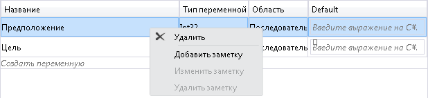
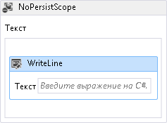
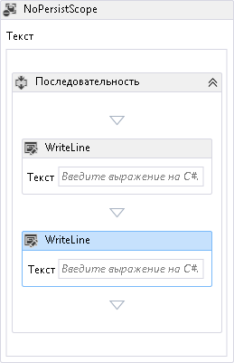
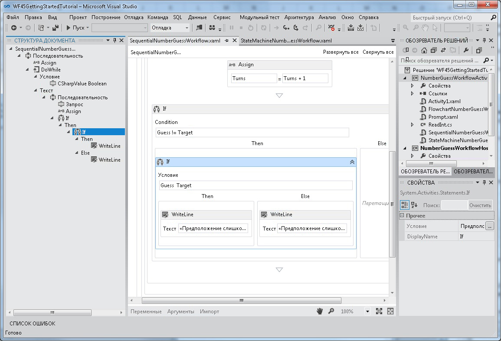
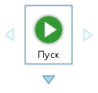
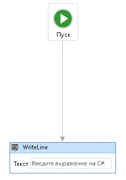
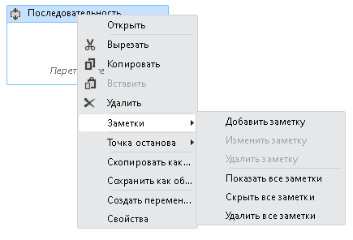
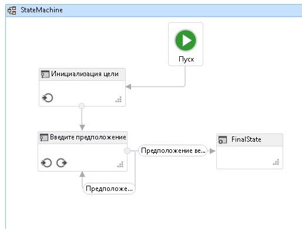

# Поддержка новых возможностей Workflow Foundation 4.5 во вновь размещенном конструкторе рабочих процессов
В [!INCLUDE[wf](../../../includes/wf-md.md)] на платформе [!INCLUDE[net_v45](../../../includes/net-v45-md.md)] появилось множество новых функций, в том числе некоторые улучшения работы конструктора рабочих процессов. В этом разделе подробно описываются те возможности, которые поддерживаются в повторно размещенном конструкторе, и те, которые в настоящее время не поддерживаются.  
  
> [!NOTE]
>  Список всех нового [!INCLUDE[wf](../../../includes/wf-md.md)] функций, представленных в [!INCLUDE[net_v45](../../../includes/net-v45-md.md)], включая те, которые не связаны с повторное размещение конструктора, в разделе [новые возможности Windows Workflow Foundation в .NET 4.5](../../../docs/framework/windows-workflow-foundation/whats-new-in-wf-in-dotnet.md).  
  
## Действия  
 Встроенная библиотека действий содержит новые действия, а также новые функции для существующих действий. Все эти действия поддерживаются в повторно размещенном конструкторе. Дополнительные сведения об этих новых действиях см. в разделе [действия](../../../docs/framework/windows-workflow-foundation/whats-new-in-wf-in-dotnet.md#BKMK_NewActivities) раздел [новые возможности Windows Workflow Foundation в .NET 4.5](../../../docs/framework/windows-workflow-foundation/whats-new-in-wf-in-dotnet.md).  
  
## Выражения C#  
 До [!INCLUDE[net_v45](../../../includes/net-v45-md.md)] все выражения в рабочих процессах можно было создавать только на Visual Basic. В [!INCLUDE[net_v45](../../../includes/net-v45-md.md)] выражения на языке Visual Basic используются только для проектов, созданных с помощью Visual Basic. Теперь в проектах Visual C# для выражений используется язык C#. При создании рабочих процессов в [!INCLUDE[vs_current_long](../../../includes/vs-current-long-md.md)] предоставляется полнофункциональный редактор выражений C# с такими возможностями, как выделение грамматики и технология Intellisense. Проекты рабочих процессов C#, созданные в предыдущих версиях с использованием выражений Visual Basic, будут по-прежнему работать.  
  
> [!WARNING]
>  Выражения на языке C# не поддерживаются в повторно размещенном конструкторе.  
  
## Новые возможности конструктора  
  
### Поиск конструктора  
 [Быстрый поиск](../../../docs/framework/windows-workflow-foundation/whats-new-in-wf-in-dotnet.md#BKMK_QuickFind) и [поиск в файлах](../../../docs/framework/windows-workflow-foundation/whats-new-in-wf-in-dotnet.md#BKMK_FindInFiles) функций, представленных [!INCLUDE[net_v45](../../../includes/net-v45-md.md)] не поддерживается в повторно размещенном конструкторе. Поиск `Toolbox` поддерживается в повторно размещенном конструкторе. Дополнительные сведения об этих возможностях см. в разделе [поиск конструктора](../../../docs/framework/windows-workflow-foundation/whats-new-in-wf-in-dotnet.md#BKMK_DesignerSearch).  
  
> [!WARNING]
>  [Быстрый поиск](../../../docs/framework/windows-workflow-foundation/whats-new-in-wf-in-dotnet.md#BKMK_QuickFind) и [поиск в файлах](../../../docs/framework/windows-workflow-foundation/whats-new-in-wf-in-dotnet.md#BKMK_FindInFiles) не поддерживается в повторно размещенном конструкторе.  
  
### Пункт контекстного меню «Удалить» в конструкторе переменных и аргументов  
 В [!INCLUDE[netfx40_short](../../../includes/netfx40-short-md.md)] переменные и аргументы могут быть удалены в конструкторе только с помощью клавиатуры. Начиная с [!INCLUDE[net_v45](../../../includes/net-v45-md.md)], переменные и аргументы можно удалить с помощью контекстного меню. Эта функция поддерживается в повторно размещенном конструкторе.  
  
 На следующем снимке экрана показано контекстное меню конструктора переменных и аргументов.  
  
   
  
### Автоматическое окружение с последовательностью  
 Поскольку рабочий процесс или некоторые действия с контейнерами (например, <xref:System.Activities.Statements.NoPersistScope>) могут содержать только одно действие с текстом, при добавлении второго действия разработчик должен удалить первое действие, добавить действие <xref:System.Activities.Statements.Sequence>, а затем добавить оба действия в действие последовательности. Начиная с [!INCLUDE[net_v45](../../../includes/net-v45-md.md)], при добавлении второго действия в область конструктора автоматически создается действие `Sequence`, включающее оба действия. Эта функция поддерживается в повторно размещенном конструкторе.  
  
 На следующем снимке экрана показано действие `WriteLine` в `Body` для `NoPersistScope`.  
  
   
  
 На следующем снимке экрана показано автоматически созданное действие `Sequence` в `Body`, когда второй объект `WriteLine` располагается ниже первого.  
  
   
  
### Панорамный режим  
 Для упрощения навигации по большому рабочему процессу в конструкторе можно включить панорамный режим, позволяющий разработчику перетаскивать мышью видимую часть рабочего процесса и не использовать полосы прокрутки. Кнопка для активации панорамного режима находится в правом нижнем углу конструктора. Эта функция поддерживается в повторно размещенном конструкторе.  
  
 На следующем снимке экрана показана кнопка панорамирования, расположенная в правом нижнем углу конструктора рабочих процессов.  
  
   
  
 Панорамирование в конструкторе рабочих процессов возможно также с помощью средней кнопки мыши или клавиши пробела.  
  
### Выбор нескольких действий  
 Можно выбрать несколько действий одновременно, растягивая прямоугольник вокруг них (если не включен панорамный режим) или удерживая клавишу CTRL и последовательно щелкая необходимые действия. Эта функция поддерживается в повторно размещенном конструкторе.  
  
 Несколько выделенных действий можно перетаскивать внутри конструктора, а также взаимодействовать с ними с помощью контекстного меню.  
  
### Представление структуры элементов рабочего процесса  
 Для упрощения навигации по иерархическим рабочим процессам компоненты рабочего процесса отображаются в виде древовидной структуры. Структура отображается в **Структура документа** представления. Чтобы открыть это представление в [!INCLUDE[vs_current_short](../../../includes/vs-current-short-md.md)], в верхнем меню выберите **представление**, **другие окна**, **Структура документа**, или нажмите клавиши Ctrl W, U. Щелкнув узел в представлении структуры, можно перейти к соответствующему действию в конструкторе рабочих процессов. Представление структуры будет обновлено с отображением действий, выбранных в конструкторе. Эта возможность поддерживается в повторно размещенном конструкторе.  
  
 Следующий снимок экрана завершенного рабочего процесса из [учебник по началу работы](../../../docs/framework/windows-workflow-foundation/getting-started-tutorial.md) показано представление структуры с последовательного рабочего процесса.  
  
   
  
### Дополнительные возможности управления видимостью панели оболочки и элементов заголовка  
 В повторно размещенном конструкторе некоторые из стандартных элементов управления пользовательского интерфейса могут не иметь значения для заданного рабочего процесса и могут быть отключены. В [!INCLUDE[netfx40_short](../../../includes/netfx40-short-md.md)] эта настройка поддерживается только панелью оболочки в нижней части конструктора. В [!INCLUDE[net_v45](../../../includes/net-v45-md.md)] видимость элементов заголовка оболочки в верхней части конструктора можно настроить, задав для <xref:System.Activities.Presentation.View.DesignerView.WorkflowShellHeaderItemsVisibility%2A> соответствующее значение <xref:System.Activities.Presentation.View.ShellHeaderItemsVisibility>.  
  
### Автоматическое соединение и автоматическая вставка в рабочих процессах блок-схемы и конечного автомата  
 В [!INCLUDE[netfx40_short](../../../includes/netfx40-short-md.md)] связи между узлами в рабочем процессе блок-схемы необходимо добавлять вручную. В [!INCLUDE[net_v45](../../../includes/net-v45-md.md)] узлы «Блок-схема» и «Конечный автомат» содержат точки автоматического соединения, которые становятся видимыми при перетаскивании действия из области элементов в область конструктора. При перетаскивании действия на одну из этих точек автоматически добавляется действие вместе с необходимым соединением.  
  
 На следующем снимке экрана показаны точки присоединения, которые появляются при перетаскивании действия из области элементов.  
  
   
  
 Действия можно также перетаскивать на соединения между узлами блок-схемы и состояниями для автоматической вставки узла между двумя другими узлами. На следующем снимке экрана показана выделенная соединительная линия, на которую можно перетаскивать действия из области элементов.  
  
   
  
 Автоматическое соединение и автоматическая вставка поддерживаются в повторно размещенном конструкторе.  
  
### Заметки конструктора  
 Для упрощения разработки крупных рабочих процессов конструктор теперь поддерживает добавление заметок, помогающих отслеживать процесс проектирования. Заметки можно добавлять к действиям, состояниям, узлам блок-схемы, переменным и аргументам. На следующем снимке экрана показано контекстное меню, которое используется для добавления заметок к конструктору.  
  
   
  
 Заметки конструктора поддерживаются в повторно размещенном конструкторе.  
  
### Определение и использование объектов ActivityDelegate в конструкторе  
 Действия в [!INCLUDE[netfx40_short](../../../includes/netfx40-short-md.md)] использовали объекты <xref:System.Activities.ActivityDelegate> для представления точек выполнения, где другие части рабочего процесса могли взаимодействовать с выполнением рабочего процесса, но использование этих точек выполнения обычно требовало большого объема кода. В этом выпуске разработчики могут определять и использовать делегаты действий с помощью конструктора рабочих процессов. Дополнительные сведения см. в разделе [как: определение и использование делегатов действий в конструкторе рабочих процессов](/visualstudio/workflow-designer/how-to-define-and-consume-activity-delegates-in-the-workflow-designer).  
  
 Делегаты действий поддерживаются в повторно размещенном конструкторе.  
  
### Проверка во время сборки  
 В [!INCLUDE[netfx40_short](../../../includes/netfx40-short-md.md)] ошибки проверки рабочего процесса не учитывались как ошибки сборки во время сборки проекта рабочего процесса. Это значило, что сборка проекта рабочего процесса могло завершиться успешно даже при наличии ошибок проверки рабочего процесса. В [!INCLUDE[net_v45](../../../includes/net-v45-md.md)] ошибки проверки рабочего процесса приводят к неудачному завершению сборки.  
  
> [!WARNING]
>  Проверка во время сборки не поддерживается в повторно размещенном конструкторе.  
  
### Фоновая проверка во время разработки  
 В [!INCLUDE[netfx40_short](../../../includes/netfx40-short-md.md)] рабочие процессы проверялись в виде процесса в основном режиме, что потенциально могло привести к «зависанию» пользовательского интерфейса во время сложных или длительных процессов проверки. Теперь проверка рабочего процесса выполняется в фоновом потоке, поэтому пользовательский интерфейс не блокируется.  
  
 Фоновая проверка во время разработки поддерживается в повторно размещенном конструкторе.  
  
### Состояние просмотра в отдельном расположении в файлах XAML  
 В [!INCLUDE[netfx40_short](../../../includes/netfx40-short-md.md)] данные о состоянии просмотра для рабочего процесса хранились по всему файлу XAML во множестве различных мест. Это неудобно для разработчиков, которым требуется прочитать язык XAML напрямую или написать код для извлечения информации о состоянии просмотра. В [!INCLUDE[net_v45](../../../includes/net-v45-md.md)], сведения о состоянии представления в XAML-файле сериализуется как отдельный элемент в XAML-файле.  Разработчики можно найти и изменить сведения о состоянии представления действия или полностью удалить состояние представления.  
  
 Эта функция поддерживается в повторно размещенном конструкторе рабочих процессов.  
  
### Включаемые по требованию функции рабочего процесса 4.5 в повторно размещенном конструкторе  
 Для сохранения обратной совместимости некоторые новые функции, которые входят в [!INCLUDE[net_v45](../../../includes/net-v45-md.md)], не включены по умолчанию в повторно размещенном конструкторе. Таким образом, работа существующих приложений, использующих повторно размещенный конструктор, не нарушается обновлением до последней версии. Чтобы включить новые функции в повторно размещенном конструкторе, задайте для <xref:System.Activities.Presentation.DesignerConfigurationService.TargetFrameworkName%2A> значение «.NET Framework 4.5» или задайте отдельные элементы <xref:System.Activities.Presentation.DesignerConfigurationService>, чтобы включить отдельные функции.  
  
## Новые модели разработки рабочего процесса  
 Помимо блок-схемы и последовательных моделей разработки рабочего процесса, этот выпуск включает рабочие процессы конечного автомата и службы рабочего процесса с первоначальным контрактом.  
  
### Рабочие процессы конечного автомата  
 Рабочие процессы конечного автомата впервые появились в составе .NET Framework 4.0.1 в [обновление 1 платформы Microsoft .NET Framework 4](http://go.microsoft.com/fwlink/?LinkID=215092). Это обновление включило несколько новых классов и действий, которые дали возможность разработчикам создавать рабочие процессы конечного автомата. Для [!INCLUDE[net_v45](../../../includes/net-v45-md.md)] эти классы и действия были обновлены. Обновления включают следующее:  
  
1.  Возможность установки точек останова на состояниях  
  
2.  Возможность копирования и вставки переходов в конструкторе рабочих процессов  
  
3.  Поддержка совместного создания перехода триггера в конструкторе  
  
4.  Действия для создания рабочих процессов конечного автомата, включая <xref:System.Activities.Statements.StateMachine>, <xref:System.Activities.Statements.State> и <xref:System.Activities.Statements.Transition>  
  
 На следующем рисунке показан завершенного автомата из [учебник по началу работы](../../../docs/framework/windows-workflow-foundation/getting-started-tutorial.md) шаг [как: создание конечного автомата](../../../docs/framework/windows-workflow-foundation/how-to-create-a-state-machine-workflow.md).  
  
   
  
 Дополнительные сведения о создании конечных автоматов см. в разделе [конечных автоматов](../../../docs/framework/windows-workflow-foundation/state-machine-workflows.md). Рабочие процессы конечного автомата поддерживаются в повторно размещенном конструкторе.  
  
### Разработка рабочих процессов с первоначальным контрактом  
 Средство разработки рабочего процесса с первоначальным контрактом позволяет разработчику создать контракт в Code First, а затем с помощью нескольких щелчков в [!INCLUDE[vs_current_short](../../../includes/vs-current-short-md.md)] автоматически сформировать шаблон действия в области элементов с представлением каждой операции. Эти действия затем используются для создания рабочего процесса с операциями, указанными в контракте. Конструктор рабочих процессов проверяет службу рабочего процесса для проверки того, что эти операции реализованы, а сигнатура рабочего процесса соответствует сигнатуре контракта. Разработчик также может связать службу рабочего процесса с коллекцией реализованных контрактов. Дополнительные сведения о разработке рабочих процессов на основе контракта службы см. в разделе [как: создание службы рабочего процесса, который использует существующий контракт службы](../../../docs/framework/windows-workflow-foundation/how-to-create-a-workflow-service-that-consumes-an-existing-service-contract.md).  
  
> [!WARNING]
>  Разработка рабочего процесса с первоначальным контрактом не поддерживается в конструкторе рабочих процессов.
