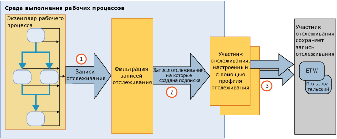

# Отслеживание и трассировка рабочих процессовWorkflow Tracking and Tracing
Отслеживание рабочих процессов Windows является функцией [!INCLUDE[netfx_current_long](../../../includes/netfx-current-long-md.md)], разработанной для обеспечения возможности отслеживания выполнения рабочих процессов.Windows Workflow tracking is a [!INCLUDE[netfx_current_long](../../../includes/netfx-current-long-md.md)] feature designed to provide visibility into workflow execution. Она обеспечивает инфраструктуру отслеживания выполнения экземпляра рабочего процесса.It provides a tracking infrastructure to track the execution of a workflow instance. Инфраструктура отслеживания WF прозрачно инструментирует рабочий процесс таким образом, что выдаются записи, отражающие ключевые события выполнения.The WF tracking infrastructure transparently instruments a workflow to emit records reflecting key events during the execution. Эта функция доступна по умолчанию для всех рабочих процессов [!INCLUDE[netfx_current_short](../../../includes/netfx-current-short-md.md)].This functionality is available by default for any [!INCLUDE[netfx_current_short](../../../includes/netfx-current-short-md.md)] workflow. Для выполнения отслеживания в рабочий процесс [!INCLUDE[netfx_current_long](../../../includes/netfx-current-long-md.md)] не нужно вносить изменения.No changes are required to be made to a [!INCLUDE[netfx_current_long](../../../includes/netfx-current-long-md.md)] workflow for tracking to occur. Необходимо лишь определить объем данных отслеживания, которые требуется получать.It is just a matter of deciding how much tracking data you want to receive. При запуске или завершении экземпляра рабочего процесса создаются записи отслеживания, которые затем обрабатываются.When a workflow instance starts or completes, its processing tracking records are emitted. Отслеживание также позволяет извлекать важные для бизнеса данные, связанные с переменными рабочего процесса.Tracking can also extract business-relevant data associated with the workflow variables. Например, если рабочий процесс представляет собой систему обработки заказов, вместе с объектом <xref:System.Activities.Tracking.TrackingRecord> можно извлечь идентификатор заказа.For example, if the workflow represents an order processing system, the order ID can be extracted along with the <xref:System.Activities.Tracking.TrackingRecord> object. Как правило, функции отслеживания WF позволяют упростить диагностику и доступ к данным бизнес-аналитики из выполняемого рабочего процесса.In general, enabling WF tracking facilitates diagnostics or business analytics data to be accessed from a workflow execution.  
  
 Эти компоненты отслеживания эквивалентны службе отслеживания в [!INCLUDE[vstecwinfx](../../../includes/vstecwinfx-md.md)].These tracking components are equivalent to the tracking service in [!INCLUDE[vstecwinfx](../../../includes/vstecwinfx-md.md)]. [!INCLUDE[netfx_current_short](../../../includes/netfx-current-short-md.md)] отличается более высоким уровнем производительности, а модель программирования для функции отслеживания WF - более простая.In [!INCLUDE[netfx_current_short](../../../includes/netfx-current-short-md.md)], the performance has been improved and the programming model simplified for the WF tracking feature. Среды выполнения отслеживания инструментирует экземпляр рабочего процесса для создания событий, связанных с жизненным циклом рабочего процесса, действиями рабочего процесса и настраиваемыми событиями.The tracking runtime instruments a workflow instance to emit events related to the workflow life cycle, workflow activities and custom events.  
  
 Windows Server App Fabric также дает возможность наблюдать за выполнением WCF и службы Workflow Service.Windows Server App Fabric also provides the ability to monitor the execution of a WCF and workflow services. [!INCLUDE[crdefault](../../../includes/crdefault-md.md)][Мониторинга Windows Server App Fabric](http://go.microsoft.com/fwlink/?LinkId=201273) и [мониторинг приложений с Windows Server AppFabric](http://go.microsoft.com/fwlink/?LinkId=201287) [Windows Server App Fabric Monitoring](http://go.microsoft.com/fwlink/?LinkId=201273) and [Monitoring Applications with Windows Server AppFabric](http://go.microsoft.com/fwlink/?LinkId=201287)  
  
 Чтобы провести диагностику среды выполнения рабочего процесса, можно включить трассировку рабочего процесса диагностики.To troubleshoot the workflow runtime, you can turn on diagnostic workflow tracing. [!INCLUDE[crdefault](../../../includes/crdefault-md.md)][Трассировка рабочего процесса](../../../docs/framework/windows-workflow-foundation/workflow-tracing.md). [Workflow Tracing](../../../docs/framework/windows-workflow-foundation/workflow-tracing.md).  
  
 В этом разделе описаны основные компоненты инфраструктуры отслеживания, которые позволяют понять принципы работы модели программирования:To understand the programming model, the primary components of the tracking infrastructure are discussed in this topic:  
  
-   Объекты <xref:System.Activities.Tracking.TrackingRecord>, создаваемые во время выполнения рабочего процесса.<xref:System.Activities.Tracking.TrackingRecord> objects emitted from the workflow runtime. [!INCLUDE[crdefault](../../../includes/crdefault-md.md)][Записи отслеживания](../../../docs/framework/windows-workflow-foundation/tracking-records.md). [Tracking Records](../../../docs/framework/windows-workflow-foundation/tracking-records.md).  
  
-   Объекты <xref:System.Activities.Tracking.TrackingParticipant> подписываются на объекты <xref:System.Activities.Tracking.TrackingRecord>.<xref:System.Activities.Tracking.TrackingParticipant> objects subscribe to <xref:System.Activities.Tracking.TrackingRecord> objects. Участники отслеживания содержат логику обработки полезных данных из объектов <xref:System.Activities.Tracking.TrackingRecord> (например, они могут записывать данные в файл).The tracking participants contain the logic to process the payload from the <xref:System.Activities.Tracking.TrackingRecord> objects (for example, they could choose to write to a file). [!INCLUDE[crdefault](../../../includes/crdefault-md.md)][Участникам отслеживания](../../../docs/framework/windows-workflow-foundation/tracking-participants.md). [Tracking Participants](../../../docs/framework/windows-workflow-foundation/tracking-participants.md).  
  
-   Записи отслеживания фильтра объекта <xref:System.Activities.Tracking.TrackingProfile>, создаваемые экземпляром рабочего процесса.<xref:System.Activities.Tracking.TrackingProfile> objects filter tracking records emitted from a workflow instance. [!INCLUDE[crdefault](../../../includes/crdefault-md.md)][Профили отслеживания](../../../docs/framework/windows-workflow-foundation/tracking-profiles.md). [Tracking Profiles](../../../docs/framework/windows-workflow-foundation/tracking-profiles.md).  
  
## Инфраструктура отслеживания рабочих процессовWorkflow Tracking Infrastructure  
 Инфраструктура отслеживания рабочего процесса основана на принципе публикации и подписки.The workflow tracking infrastructure follows a publish-and-subscribe paradigm. Экземпляр рабочего процесса является издателем записей отслеживания, а подписчики записей отслеживания регистрируются как расширения рабочего процесса.The workflow instance is the publisher of tracking records, while subscribers of the tracking records are registered as extensions to the workflow. Эти расширения, подписанные на объекты <xref:System.Activities.Tracking.TrackingRecord>, называются участниками отслеживания.These extensions that subscribe to <xref:System.Activities.Tracking.TrackingRecord> objects are called tracking participants. Участниками отслеживания являются точки расширения, обращающиеся к объектам <xref:System.Activities.Tracking.TrackingRecord> и обрабатывающие их с использованием заданных для них способов.Tracking participants are extensibility points that access <xref:System.Activities.Tracking.TrackingRecord> objects and process them in whatever manner they are written to do so. Инфраструктура отслеживания позволяет применять к исходящим записям отслеживания фильтр таким образом, что участник может подписаться на определенное подмножество записей.The tracking infrastructure allows the application of a filter on the outgoing tracking records to allow a participant to subscribe to a subset of the records. Механизм фильтрации реализуется с помощью файла профиля отслеживания.This filtering mechanism is accomplished through a tracking profile file.  
  
 На следующем рисунке показано высокоуровневое представление инфраструктуры отслеживания.A high level view of the tracking infrastructure is shown in the following illustration.  
  
   
  
## СодержаниеIn This Section  
 [Записи отслеживанияTracking Records](../../../docs/framework/windows-workflow-foundation/tracking-records.md)  
 Описывает записи отслеживания, создаваемые средой выполнения рабочего процесса.Describes the tracking records that the workflow runtime emits.  
  
 [Профили отслеживанияTracking Profiles](../../../docs/framework/windows-workflow-foundation/tracking-profiles.md)  
 Описывает использование профилей отслеживания.Discusses how tracking profiles are used.  
  
 [Участники отслеживанияTracking Participants](../../../docs/framework/windows-workflow-foundation/tracking-participants.md)  
 Описывает использование предоставленных системой участников отслеживания и создание настраиваемых участников отслеживания.Describes how to use system-provided tracking participant or how to create custom tracking participants.  
  
 [Настройка отслеживания рабочего процессаConfiguring Tracking for a Workflow](../../../docs/framework/windows-workflow-foundation/configuring-tracking-for-a-workflow.md)  
 Описывает настройку отслеживания рабочего процесса.Describes how to configure tracking for a workflow.  
  
 [Трассировка рабочих процессовWorkflow Tracing](../../../docs/framework/windows-workflow-foundation/workflow-tracing.md)  
 Описывает два способа включения трассировки отладки рабочего процесса.Describes the two ways to enable debug tracing for a workflow.  
  
 [Использование трассировки для определения длительности выполнения рабочего процессаDetermining Workflow Execution Duration Using Tracing](../../../docs/framework/windows-workflow-foundation/determining-workflow-execution-duration-using-tracing.md)  
 Описывает, как использовать сообщения трассировки для определения продолжительности выполнения рабочего процесса.Describes how to use tracing messages to determine workflow execution duration.  
  
## См. такжеSee Also  
 [Трассировка SQLSQL Tracking](../../../docs/framework/windows-workflow-foundation/samples/sql-tracking.md)
