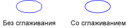

# Сглаживание прямых и кривых линийAntialiasing with Lines and Curves
При использовании [!INCLUDE[ndptecgdiplus](../../../../includes/ndptecgdiplus-md.md)] Чтобы нарисовать линию, предоставляют начальную и конечную точку линии, но нет необходимости предоставлять данные об отдельных пикселях в строке.When you use [!INCLUDE[ndptecgdiplus](../../../../includes/ndptecgdiplus-md.md)] to draw a line, you provide the starting point and ending point of the line, but you do not have to provide any information about the individual pixels on the line. [!INCLUDE[ndptecgdiplus](../../../../includes/ndptecgdiplus-md.md)] работает в сочетании с программным обеспечением драйвера экрана, чтобы определить, какие точек будет включена для отображения в строке на устройстве отображения.works in conjunction with the display driver software to determine which pixels will be turned on to show the line on a particular display device.  
  
## Присвоение псевдонимаAliasing  
 Рассмотрите возможность непосредственно красная линия, идущий от точки (4, 2) в точку (16, 10).Consider the straight red line that goes from the point (4, 2) to the point (16, 10). Предположим, система координат расположен в левом верхнем углу и означает что единицы измерения пиксель.Assume the coordinate system has its origin in the upper-left corner and that the unit of measure is the pixel. Также предполагается, что ось x обращена вправо, а ось y точек вниз.Also assume that the x-axis points to the right and the y-axis points down. На следующем рисунке увеличенное изображение красной линии, рисуемой на многоцветном фоне.The following illustration shows an enlarged view of the red line drawn on a multicolored background.  
  
   
  
 Красные пиксели, используемый для отображения линии, непрозрачный.The red pixels used to render the line are opaque. В строке есть не частично прозрачных точек.There are no partially transparent pixels in the line. Этот тип отрисовки линии делает зубчатой и строке похож на лестница.This type of line rendering gives the line a jagged appearance, and the line looks somewhat like a staircase. Этот метод представления линии называется Совмещение имен; лестница является псевдонимом для теоретической линии.This technique of representing a line with a staircase is called aliasing; the staircase is an alias for the theoretical line.  
  
## СглаживаниеAntialiasing  
 Более сложный прием для подготовки к просмотру строки заключаются в использовании частично прозрачных точек вместе с непрозрачными.A more sophisticated technique for rendering a line involves using partially transparent pixels along with opaque pixels. Пиксели задаются чистый красный цвет, либо смешение красного и цвет фона, зависимости от того, насколько близко эти строки.Pixels are set to pure red, or to some blend of red and the background color, depending on how close they are to the line. Этот тип визуализации называется сглаживания и результаты в строке, которая человеческим глазом они выглядели более smooth.This type of rendering is called antialiasing and results in a line that the human eye perceives as more smooth. Ниже показано, как несколько точек смешиваются с цветом фона для образования сглаженной линии.The following illustration shows how certain pixels are blended with the background to produce an antialiased line.  
  
   
  
 Сглаживание, также называемый сглаживание, могут также применяться к кривым.Antialiasing, also called smoothing, can also be applied to curves. На следующем рисунке увеличенное изображение сглаженного эллипса.The following illustration shows an enlarged view of a smoothed ellipse.  
  
   
  
 Ниже показан тот же эллипс в натуральную величину, без применения и один раз с помощью сглаживания.The following illustration shows the same ellipse in its actual size, once without antialiasing and once with antialiasing.  
  
   
  
 Для рисования линий и кривых, использующих сглаживания, создайте экземпляр <xref:System.Drawing.Graphics> и присвоить его <xref:System.Drawing.Graphics.SmoothingMode%2A> свойства <xref:System.Drawing.Drawing2D.SmoothingMode.AntiAlias> или <xref:System.Drawing.Drawing2D.SmoothingMode.HighQuality>.To draw lines and curves that use antialiasing, create an instance of the <xref:System.Drawing.Graphics> class and set its <xref:System.Drawing.Graphics.SmoothingMode%2A> property to <xref:System.Drawing.Drawing2D.SmoothingMode.AntiAlias> or <xref:System.Drawing.Drawing2D.SmoothingMode.HighQuality>. Затем вызовите один из методов рисования этого же <xref:System.Drawing.Graphics> класса.Then call one of the drawing methods of that same <xref:System.Drawing.Graphics> class.  
  
 [!code-csharp[LinesCurvesAndShapes#81](~/samples/snippets/csharp/VS_Snippets_Winforms/LinesCurvesAndShapes/CS/Class1.cs#81)]
 [!code-vb[LinesCurvesAndShapes#81](~/samples/snippets/visualbasic/VS_Snippets_Winforms/LinesCurvesAndShapes/VB/Class1.vb#81)]  
  
## См. такжеSee also

- <xref:System.Drawing.Drawing2D.SmoothingMode?displayProperty=nameWithType>
- [Линии, кривые и фигурыLines, Curves, and Shapes](lines-curves-and-shapes.md)
- [Практическое руководство. Сглаживание текстаHow to: Use Antialiasing with Text](how-to-use-antialiasing-with-text.md)
