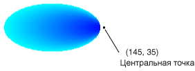

# Практическое руководство. Создание градиента вдоль контураHow to: Create a Path Gradient
<xref:System.Drawing.Drawing2D.PathGradientBrush> Позволяет настроить способ заливки фигуры плавно меняющимися цветами.The <xref:System.Drawing.Drawing2D.PathGradientBrush> class allows you to customize the way you fill a shape with gradually changing colors. Например можно указать один цвет для центра пути, а другой — для границы пути.For example, you can specify one color for the center of a path and another color for the boundary of a path. Можно также определить отдельные цвета для каждой из нескольких точек на границе пути.You can also specify separate colors for each of several points along the boundary of a path.  
  
> [!NOTE]
>  В [!INCLUDE[ndptecgdiplus](../../../../includes/ndptecgdiplus-md.md)], путь представляет собой последовательность линий и кривых, поддерживаемых <xref:System.Drawing.Drawing2D.GraphicsPath> объекта.In [!INCLUDE[ndptecgdiplus](../../../../includes/ndptecgdiplus-md.md)], a path is a sequence of lines and curves maintained by a <xref:System.Drawing.Drawing2D.GraphicsPath> object. Дополнительные сведения о [!INCLUDE[ndptecgdiplus](../../../../includes/ndptecgdiplus-md.md)] . в разделе пути, [контуры в GDI +](../../../../docs/framework/winforms/advanced/graphics-paths-in-gdi.md) и [Constructing и рисование контуров](../../../../docs/framework/winforms/advanced/constructing-and-drawing-paths.md).For more information about [!INCLUDE[ndptecgdiplus](../../../../includes/ndptecgdiplus-md.md)] paths, see [Graphics Paths in GDI+](../../../../docs/framework/winforms/advanced/graphics-paths-in-gdi.md) and [Constructing and Drawing Paths](../../../../docs/framework/winforms/advanced/constructing-and-drawing-paths.md).  
  
### Чтобы заполнить градиента вдоль контура эллипсаTo fill an ellipse with a path gradient  
  
-   В следующем примере заполняется эллипса с градиента вдоль пути.The following example fills an ellipse with a path gradient brush. Центра установлен синий и имеет значение голубой цвет границ.The center color is set to blue and the boundary color is set to aqua. На следующем рисунке закрашенный эллипс.The following illustration shows the filled ellipse.  
  
       
  
     По умолчанию кисти градиента вдоль пути не расширяет за пределами границы пути.By default, a path gradient brush does not extend outside the boundary of the path. При использовании пути градиентной кисти для заливки фигуры, который выходит за границы пути области экрана за пределами контура не заполняется.If you use the path gradient brush to fill a figure that extends beyond the boundary of the path, the area of the screen outside the path will not be filled.  
  
     На следующем рисунке показано, что происходит при изменении <xref:System.Drawing.Graphics.FillEllipse%2A> вызов в следующий код в `e.Graphics.FillRectangle(pthGrBrush, 0, 10, 200, 40)`.The following illustration shows what happens if you change the <xref:System.Drawing.Graphics.FillEllipse%2A> call in the following code to `e.Graphics.FillRectangle(pthGrBrush, 0, 10, 200, 40)`.  
  
       
  
     [!code-csharp[System.Drawing.UsingaGradientBrush#11](../../../../samples/snippets/csharp/VS_Snippets_Winforms/System.Drawing.UsingaGradientBrush/CS/Class1.cs#11)]
     [!code-vb[System.Drawing.UsingaGradientBrush#11](../../../../samples/snippets/visualbasic/VS_Snippets_Winforms/System.Drawing.UsingaGradientBrush/VB/Class1.vb#11)]  
  
     Предыдущий пример кода предназначен для работы с Windows Forms, и для него необходим <xref:System.Windows.Forms.PaintEventArgs> e, который является параметром для <xref:System.Windows.Forms.PaintEventHandler>.The preceding code example is designed for use with Windows Forms, and it requires the <xref:System.Windows.Forms.PaintEventArgs> e, which is a parameter of <xref:System.Windows.Forms.PaintEventHandler>.  
  
### Указание точек на границеTo specify points on the boundary  
  
-   В следующем примере создается Градиентная кисть путь из пути форме звезды.The following example constructs a path gradient brush from a star-shaped path. В коде устанавливается <xref:System.Drawing.Drawing2D.PathGradientBrush.CenterColor%2A> свойства, которое задает цвет в центре звезды как красный.The code sets the <xref:System.Drawing.Drawing2D.PathGradientBrush.CenterColor%2A> property, which sets the color at the centroid of the star to red. Затем устанавливается <xref:System.Drawing.Drawing2D.PathGradientBrush.SurroundColors%2A> свойство для задания различных цветов (хранятся в `colors` массива) для отдельных точек в `points` массива.Then the code sets the <xref:System.Drawing.Drawing2D.PathGradientBrush.SurroundColors%2A> property to specify various colors (stored in the `colors` array) at the individual points in the `points` array. Последняя инструкция кода заливку пути в форме звезды с градиента вдоль пути.The final code statement fills the star-shaped path with the path gradient brush.  
  
     [!code-csharp[System.Drawing.UsingaGradientBrush#12](../../../../samples/snippets/csharp/VS_Snippets_Winforms/System.Drawing.UsingaGradientBrush/CS/Class1.cs#12)]
     [!code-vb[System.Drawing.UsingaGradientBrush#12](../../../../samples/snippets/visualbasic/VS_Snippets_Winforms/System.Drawing.UsingaGradientBrush/VB/Class1.vb#12)]  
  
-   В следующем примере рисуется градиента вдоль контура без <xref:System.Drawing.Drawing2D.GraphicsPath> объекта в коде.The following example draws a path gradient without a <xref:System.Drawing.Drawing2D.GraphicsPath> object in the code. Конкретный <xref:System.Drawing.Drawing2D.PathGradientBrush.%23ctor%2A> конструктор в примере получает массив точек, но не требует <xref:System.Drawing.Drawing2D.GraphicsPath> объекта.The particular <xref:System.Drawing.Drawing2D.PathGradientBrush.%23ctor%2A> constructor in the example receives an array of points but does not require a <xref:System.Drawing.Drawing2D.GraphicsPath> object. Кроме того, обратите внимание, что <xref:System.Drawing.Drawing2D.PathGradientBrush> используется для заливки прямоугольника, а не путь.Also, note that the <xref:System.Drawing.Drawing2D.PathGradientBrush> is used to fill a rectangle, not a path. Прямоугольник больше, чем замкнутый путь, используемый для задания кисти, поэтому часть прямоугольника не закрашивается кисти.The rectangle is larger than the closed path used to define the brush, so some of the rectangle is not painted by the brush. На следующем рисунке прямоугольник (пунктирная линия) и часть прямоугольника, созданный при помощи кисти градиента вдоль пути.The following illustration shows the rectangle (dotted line) and the portion of the rectangle painted by the path gradient brush.  
  
       
  
     [!code-csharp[System.Drawing.UsingaGradientBrush#13](../../../../samples/snippets/csharp/VS_Snippets_Winforms/System.Drawing.UsingaGradientBrush/CS/Class1.cs#13)]
     [!code-vb[System.Drawing.UsingaGradientBrush#13](../../../../samples/snippets/visualbasic/VS_Snippets_Winforms/System.Drawing.UsingaGradientBrush/VB/Class1.vb#13)]  
  
### Чтобы настроить градиента вдоль контураTo customize a path gradient  
  
-   Один из способов настройки кисти градиента контура является установка его <xref:System.Drawing.Drawing2D.PathGradientBrush.FocusScales%2A> свойство.One way to customize a path gradient brush is to set its <xref:System.Drawing.Drawing2D.PathGradientBrush.FocusScales%2A> property. Это свойство определяет внутренний путь, находящаяся внутри основного пути.The focus scales specify an inner path that lies inside the main path. Для центра используется везде в пределах этого внутреннего пути, а не только в центральной точке.The center color is displayed everywhere inside that inner path rather than only at the center point.  
  
     В следующем примере создается градиентной кисти путь на основе эллиптических пути.The following example creates a path gradient brush based on an elliptical path. Код задает границу цвет на синий, задает голубой цвет центра и затем использует путь градиентной кисти для заливки голубой.The code sets the boundary color to blue, sets the center color to aqua, and then uses the path gradient brush to fill the elliptical path.  
  
     Далее в коде устанавливаются коэффициенты масштабирования кисти градиента вдоль пути.Next, the code sets the focus scales of the path gradient brush. Коэффициент масштабирования по x равно 0,3, а коэффициент масштабирования по y имеет значение 0,8.The x focus scale is set to 0.3, and the y focus scale is set to 0.8. Этот код вызывает <xref:System.Drawing.Graphics.TranslateTransform%2A> метод <xref:System.Drawing.Graphics> объекта, чтобы в последующий вызов для <xref:System.Drawing.Graphics.FillPath%2A> осуществляется заливка эллипса, который располагается справа от первого эллипса.The code calls the <xref:System.Drawing.Graphics.TranslateTransform%2A> method of a <xref:System.Drawing.Graphics> object so that the subsequent call to <xref:System.Drawing.Graphics.FillPath%2A> fills an ellipse that sits to the right of the first ellipse.  
  
     Чтобы увидеть эффект применения коэффициентов масштабирования, представьте небольшой эллипса, который совпадает с основной эллипс центром.To see the effect of the focus scales, imagine a small ellipse that shares its center with the main ellipse. Маленький (внутренний) эллипс представляет собой основной эллипс, горизонтально масштабировать (относительно своего центра) с коэффициентом 0,3 и по вертикали с коэффициентом 0,8.The small (inner) ellipse is the main ellipse scaled (about its center) horizontally by a factor of 0.3 and vertically by a factor of 0.8. При перемещении от границы внешнего эллипса к границе внутреннего эллипса цвет плавно меняется от синего голубой.As you move from the boundary of the outer ellipse to the boundary of the inner ellipse, the color changes gradually from blue to aqua. При перемещении от границы внутреннего эллипса к общему центру голубой цвет сохраняется.As you move from the boundary of the inner ellipse to the shared center, the color remains aqua.  
  
     На рисунке ниже показан результат выполнения следующего кода.The following illustration shows the output of the following code. Эллипс в левой части — голубой цвет только в центральной точки.The ellipse on the left is aqua only at the center point. Эллипс в правой — голубой цвет везде в пределах внутреннего пути.The ellipse on the right is aqua everywhere inside the inner path.  
  
   
  
 [!code-csharp[System.Drawing.UsingaGradientBrush#14](../../../../samples/snippets/csharp/VS_Snippets_Winforms/System.Drawing.UsingaGradientBrush/CS/Class1.cs#14)]
 [!code-vb[System.Drawing.UsingaGradientBrush#14](../../../../samples/snippets/visualbasic/VS_Snippets_Winforms/System.Drawing.UsingaGradientBrush/VB/Class1.vb#14)]  
  
### Настройка с интерполяциейTo customize with interpolation  
  
-   Другим способом настройки кисти градиента вдоль пути является указание массива цветов интерполяции и массива позиций интерполяции.Another way to customize a path gradient brush is to specify an array of interpolation colors and an array of interpolation positions.  
  
     В следующем примере создается на треугольник основе кисти градиента контура.The following example creates a path gradient brush based on a triangle. В коде устанавливается <xref:System.Drawing.Drawing2D.PathGradientBrush.InterpolationColors%2A> свойство кисти градиента контура для определения массива цветов интерполяции (темно-зеленый, голубой, синий) и массива позиций интерполяции (0, 0,25, 1).The code sets the <xref:System.Drawing.Drawing2D.PathGradientBrush.InterpolationColors%2A> property of the path gradient brush to specify an array of interpolation colors (dark green, aqua, blue) and an array of interpolation positions (0, 0.25, 1). При перемещении от границы треугольника к центральной точке цвет плавно меняется от темно-зеленый голубой цвет, а затем из голубой цвет на синий.As you move from the boundary of the triangle to the center point, the color changes gradually from dark green to aqua and then from aqua to blue. Изменение темно-зеленого цвета голубой происходит на 25 процентов расстояние от темно-зеленого на синий.The change from dark green to aqua happens in 25 percent of the distance from dark green to blue.  
  
     На следующем рисунке треугольник, заполненный с градиентной кисти пользовательский путь.The following illustration shows the triangle filled with the custom path gradient brush.  
  
       
  
     [!code-csharp[System.Drawing.UsingaGradientBrush#15](../../../../samples/snippets/csharp/VS_Snippets_Winforms/System.Drawing.UsingaGradientBrush/CS/Class1.cs#15)]
     [!code-vb[System.Drawing.UsingaGradientBrush#15](../../../../samples/snippets/visualbasic/VS_Snippets_Winforms/System.Drawing.UsingaGradientBrush/VB/Class1.vb#15)]  
  
### Чтобы задать центральную точкуTo set the center point  
  
-   По умолчанию центральной точки кисти градиента контура является центр контура, используемого для создания кисти.By default, the center point of a path gradient brush is at the centroid of the path used to construct the brush. Расположение центральной точки можно изменить, задав <xref:System.Drawing.Drawing2D.PathGradientBrush.CenterPoint%2A> свойство <xref:System.Drawing.Drawing2D.PathGradientBrush> класса.You can change the location of the center point by setting the <xref:System.Drawing.Drawing2D.PathGradientBrush.CenterPoint%2A> property of the <xref:System.Drawing.Drawing2D.PathGradientBrush> class.  
  
     В следующем примере создается на основе эллиптического кисти градиента контура.The following example creates a path gradient brush based on an ellipse. Центром эллипса является точка (70, 35), но центральной точки кисти градиента вдоль пути устанавливается (120, 40).The center of the ellipse is at (70, 35), but the center point of the path gradient brush is set to (120, 40).  
  
     [!code-csharp[System.Drawing.UsingaGradientBrush#16](../../../../samples/snippets/csharp/VS_Snippets_Winforms/System.Drawing.UsingaGradientBrush/CS/Class1.cs#16)]
     [!code-vb[System.Drawing.UsingaGradientBrush#16](../../../../samples/snippets/visualbasic/VS_Snippets_Winforms/System.Drawing.UsingaGradientBrush/VB/Class1.vb#16)]  
  
     На следующем рисунке закрашенный эллипс и центральная точка кисти градиента вдоль пути.The following illustration shows the filled ellipse and the center point of the path gradient brush.  
  
       
  
-   Центральная точка кисти градиента вдоль пути можно задать расположение за пределами пути, который использовался для создания кисти.You can set the center point of a path gradient brush to a location outside the path that was used to construct the brush. В следующем примере заменяется вызов для установки <xref:System.Drawing.Drawing2D.PathGradientBrush.CenterPoint%2A> свойство в предыдущем примере кода.The following example replaces the call to set the <xref:System.Drawing.Drawing2D.PathGradientBrush.CenterPoint%2A> property in the preceding code.  
  
     [!code-csharp[System.Drawing.UsingaGradientBrush#17](../../../../samples/snippets/csharp/VS_Snippets_Winforms/System.Drawing.UsingaGradientBrush/CS/Class1.cs#17)]
     [!code-vb[System.Drawing.UsingaGradientBrush#17](../../../../samples/snippets/visualbasic/VS_Snippets_Winforms/System.Drawing.UsingaGradientBrush/VB/Class1.vb#17)]  
  
     Ниже показан результат этого изменения.The following illustration shows the output with this change.  
  
       
  
     На предыдущем рисунке в крайней правой точки эллипса не являются чисто синими (хотя они очень близкие).In the preceding illustration, the points at the far right of the ellipse are not pure blue (although they are very close). Цвета в градиенте располагаются, как если бы заливки достиг точки (145, 35), где цвет является чисто синим (0, 0, 255).The colors in the gradient are positioned as if the fill reached the point (145, 35) where the color would be pure blue (0, 0, 255). Никогда не дойти до точки (145, 35) потому что градиентной кисти путь заливку только в пределах заданного пути.But the fill never reaches (145, 35) because a path gradient brush paints only inside its path.  
  
## Компиляция кодаCompiling the Code  
 Предыдущий пример предназначен для работы с Windows Forms, и требуют <xref:System.Windows.Forms.PaintEventArgs> `e`, который является параметром <xref:System.Windows.Forms.Control.Paint> обработчика событий.The preceding examples are designed for use with Windows Forms, and they require <xref:System.Windows.Forms.PaintEventArgs> `e`, which is a parameter of the <xref:System.Windows.Forms.Control.Paint> event handler.  
  
## См. такжеSee Also  
 [Заливка фигур с помощью градиентной кистиUsing a Gradient Brush to Fill Shapes](../../../../docs/framework/winforms/advanced/using-a-gradient-brush-to-fill-shapes.md)
