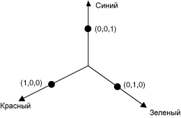
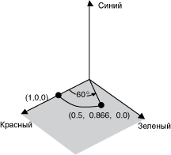
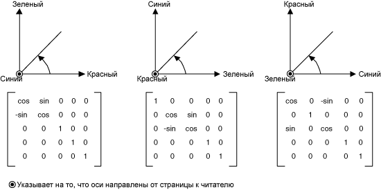
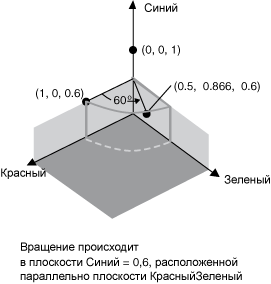

# Практическое руководство. Поворот цветов
Поворот в четырехмерном цветовом пространстве достаточно сложно визуализировать.  Эту задачу можно упростить, если договориться сохранять один из компонентов цвета неизменным.  Предположим, нам требуется сохранить альфа\-компонент неизменным и равным 1 \(полная непрозрачность\).  Тогда можно представить трехмерное цветовое пространство с координатными осями, соответствующими красному, зеленому и синему компонентам цвета, как это показано ниже на рисунке.  
  
   
  
 Цвет можно рассматривать как некоторую точку в этом трехмерном цветовом пространстве.  Например, точка \(1, 0, 0\) этого пространства соответствует красному цвету, а точка \(0, 1, 0\) — зеленому цвету.  
  
 На следующем рисунке демонстрируется поворот цвета \(1, 0, 0\) на 60 градусов в плоскости "красный\-зеленый".  Поворот в плоскости "красный\-зеленый" может рассматриваться как поворот относительно оси "синий".  
  
   
  
 На следующем рисунке показано, как создать матрицу цветов для выполнения поворотов относительно каждой из трех координатных осей \(красный, зеленый, синий\).  
  
   
  
## Пример  
 В следующем примере к изображению, содержащему только один цвет \(1; 0; 0,6\), применяется поворот на 60 градусов относительно оси, соответствующей синему компоненту цвета.  Угол поворота лежит в плоскости, параллельной плоскости "красный\-зеленый".  
  
 На следующем рисунке показаны как исходное изображение \(слева\), так и преобразованное изображение \(справа\).  
  
   
  
 Следующий рисунок иллюстрирует поворот цветов, выполняемый в приведенном ниже коде.  
  
   
  
 [!code-csharp[System.Drawing.RotateColors#1](../../../../samples/snippets/csharp/VS_Snippets_Winforms/System.Drawing.RotateColors/CS/Form1.cs#1)]
 [!code-vb[System.Drawing.RotateColors#1](../../../../samples/snippets/visualbasic/VS_Snippets_Winforms/System.Drawing.RotateColors/VB/Form1.vb#1)]  
  
## Компиляция кода  
 Предыдущий пример предназначен для работы с Windows Forms, для него необходим объект <xref:System.Windows.Forms.PaintEventArgs> `e`, передаваемый в качестве параметра обработчику события <xref:System.Windows.Forms.Control.Paint>.  Подставьте вместо `RotationInput.bmp` имя имеющегося на вашем компьютере файла изображения и путь к нему.  
  
## См. также  
 <xref:System.Drawing.Imaging.ColorMatrix>   
 <xref:System.Drawing.Imaging.ImageAttributes>   
 [Объекты Graphics и Drawing в Windows Forms](../../../../docs/framework/winforms/advanced/graphics-and-drawing-in-windows-forms.md)   
 [Перекрашивание изображений](../../../../docs/framework/winforms/advanced/recoloring-images.md)