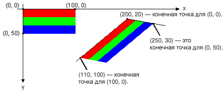

# Практическое руководство. Поворот, отражение и наклон изображенийHow to: Rotate, Reflect, and Skew Images
Поворот, отражать и наклонять изображения путем указания точек назначения для верхнего левого, правого верхнего и левого нижнего углов исходного изображения.You can rotate, reflect, and skew an image by specifying destination points for the upper-left, upper-right, and lower-left corners of the original image. Эти три точки назначения определяют аффинное преобразование, которое сопоставляет исходное прямоугольное изображение в параллелограмм.The three destination points determine an affine transformation that maps the original rectangular image to a parallelogram.  
  
## ПримерExample  
 Предположим, что исходное изображение представляет собой прямоугольник с левого верхнего угла в (0, 0), правого верхнего угла в (100, 0) и левого нижнего угла на (0, 50).For example, suppose the original image is a rectangle with upper-left corner at (0, 0), upper-right corner at (100, 0), and lower-left corner at (0, 50). Теперь допустим, эти три точки в конечные точки следующим образом.Now suppose you map those three points to destination points as follows.  
  
|Исходная точкаOriginal point|Конечная точкаDestination point|  
|--------------------|-----------------------|  
|Верхний левый угол (0, 0)Upper-left (0, 0)|(200, 20)(200, 20)|  
|Правый верхний угол (100, 0)Upper-right (100, 0)|(110, 100)(110, 100)|  
|Нижний левый угол (0, 50)Lower-left (0, 50)|(250, 30)(250, 30)|  
  
 Ниже показан исходный образ и образ в параллелограмм.The following illustration shows the original image and the image mapped to the parallelogram. Исходный образ была синхронизована, отражаются, поворачивать и преобразовать.The original image has been skewed, reflected, rotated, and translated. На строку, проходящую через сопоставлен горизонтальной оси вдоль верхнего края исходного изображения (200, 20) и (110, 100).The x-axis along the top edge of the original image is mapped to the line that runs through (200, 20) and (110, 100). Ось y — вдоль левого края исходного изображения сопоставляется строку, проходящую через (200, 20) и (250, 30).The y-axis along the left edge of the original image is mapped to the line that runs through (200, 20) and (250, 30).  
  
   
  
 Аналогичные преобразования, примененного к фотографии на следующем рисунке.The following illustration shows a similar transformation applied to a photographic image.  
  
   
  
 На следующем рисунке аналогичные преобразования, примененного в метафайл.The following illustration shows a similar transformation applied to a metafile.  
  
   
  
 В следующем примере создается изображения, показанные на первом рисунке.The following example produces the images shown in the first illustration.  
  
 [!code-csharp[System.Drawing.WorkingWithImages#61](../../../../samples/snippets/csharp/VS_Snippets_Winforms/System.Drawing.WorkingWithImages/CS/Class1.cs#61)]
 [!code-vb[System.Drawing.WorkingWithImages#61](../../../../samples/snippets/visualbasic/VS_Snippets_Winforms/System.Drawing.WorkingWithImages/VB/Class1.vb#61)]  
  
## Компиляция кодаCompiling the Code  
 Предыдущий пример предназначен для работы с Windows Forms, и для него необходим объект <xref:System.Windows.Forms.PaintEventArgs>`e`, передаваемый в качестве параметра обработчику событий <xref:System.Windows.Forms.Control.Paint>.The preceding example is designed for use with Windows Forms, and it requires <xref:System.Windows.Forms.PaintEventArgs>`e`, which is a parameter of the <xref:System.Windows.Forms.Control.Paint> event handler. Обязательно замените `Stripes.bmp` с путем к изображение, которое находится в вашей системе.Make sure to replace `Stripes.bmp` with the path to an image that is valid on your system.  
  
## См. такжеSee Also  
 [Работа с растровыми и векторными изображениями, значками и метафайламиWorking with Images, Bitmaps, Icons, and Metafiles](../../../../docs/framework/winforms/advanced/working-with-images-bitmaps-icons-and-metafiles.md)
