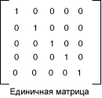

# Практическое руководство. Использование матрицы цветов для преобразования отдельного цвета
[!INCLUDE[ndptecgdiplus](../../../../includes/ndptecgdiplus-md.md)] предоставляет <xref:System.Drawing.Image> и <xref:System.Drawing.Bitmap> классы для хранения и управления изображениями. <xref:System.Drawing.Image> и <xref:System.Drawing.Bitmap> объекты хранят цвет каждого пикселя как 32-разрядное число: 8 бит на красный, зеленый, синий и альфа-канала. Каждый из четырех компонентов является число от 0 до 255, где 0 соответствует нулевой интенсивности, а 255 — наибольшей интенсивности. Альфа-компонент определяет прозрачность цвета: 0 является полностью прозрачным, а 255 — полностью непрозрачный.  
  
 Цветовой вектор является кортежем в форме (красный, зеленый, синий, альфа-версия). Например вектор цвет (0, 255, 0, 255) представляет непрозрачный цвет, который не имеет красный и синий, а зеленый полная насыщенность.  
  
 Другой способ представления цветов использует номер 1 для полной насыщенности. При использовании цвета, описанные в предыдущем абзаце будут представлены в вектор (0, 1, 0, 1). [!INCLUDE[ndptecgdiplus](../../../../includes/ndptecgdiplus-md.md)] использует соглашение 1 как полной насыщенности, при преобразовании цветов.  
  
 Линейные преобразования (поворот, масштабирование и т. п) можно применить в векторы цвета, умножив эти векторы матрицу 4 × 4. Тем не менее нельзя использовать матрицу 4 × 4, для выполнения преобразования (нелинейной). Если добавить фиктивную пятую координату (например, номер 1) к каждому из цветовых векторов, можно использовать матрицу 5 × 5 для применения любое сочетание линейными преобразованиями и переводы. Преобразование, состоящее из линейного преобразования, а затем перевод называется аффинные преобразования.  
  
 Например предположим, что вы хотите начать с цветом (0,2, 0,0, 0,4, 1,0) и применить следующие преобразования:  
  
1. Double красного компонента  
  
2. Добавить 0,2 к компонентам красного, зеленого и синего  
  
 Следующие Перемножение матриц выполнит эти два преобразования в указанном порядке.  
  
   
  
 Элементы матрицы цветов индексируются (начинающийся с нуля), строк и столбцов. Например запись в пятой строке и третьем столбце матрицы M обозначается M [4] [2].  
  
 5 × 5 единичной матрицей (показано на следующем рисунке) имеет единицы на диагонали и размерностью. При умножении вектора на единичную матрицу, цвет не изменяется. Начать с единичной матрицы и внесите небольшое изменение, которое формирует нужные преобразования — удобный способ создания матрицы преобразования цветов.  
  
   
  
 Более подробное описание матрицы и преобразований, см. в разделе [системы координат и преобразования](coordinate-systems-and-transformations.md).  
  
## Пример  
 В следующем примере выполняются образ, который был только один цвет (0,2, 0,0, 0,4, 1.0) и применяется преобразование, описанное выше.  
  
 Ниже показан исходное изображение в левой части и преобразованные изображения справа.  
  
   
  
 В следующем примере код выполняет указанные ниже действия для выполнения гамме:  
  
1. Инициализировать <xref:System.Drawing.Imaging.ColorMatrix> объекта.  
  
2. Создание <xref:System.Drawing.Imaging.ImageAttributes> и передать <xref:System.Drawing.Imaging.ColorMatrix> объект <xref:System.Drawing.Imaging.ImageAttributes.SetColorMatrix%2A> метод <xref:System.Drawing.Imaging.ImageAttributes> объекта.  
  
3. Передайте <xref:System.Drawing.Imaging.ImageAttributes> объект <xref:System.Drawing.Graphics.DrawImage%2A> метод <xref:System.Drawing.Graphics> объекта.  
  
 [!code-csharp[System.Drawing.RecoloringImages#21](~/samples/snippets/csharp/VS_Snippets_Winforms/System.Drawing.RecoloringImages/CS/Class1.cs#21)]
 [!code-vb[System.Drawing.RecoloringImages#21](~/samples/snippets/visualbasic/VS_Snippets_Winforms/System.Drawing.RecoloringImages/VB/Class1.vb#21)]  
  
## Компиляция кода  
 Предыдущий пример предназначен для работы с Windows Forms и требует <xref:System.Windows.Forms.PaintEventArgs> `e`, который является параметром <xref:System.Windows.Forms.Control.Paint> обработчик событий.  
  
## См. также

- [Перекрашивание изображений](recoloring-images.md)
- [Системы координат и преобразования](coordinate-systems-and-transformations.md)
