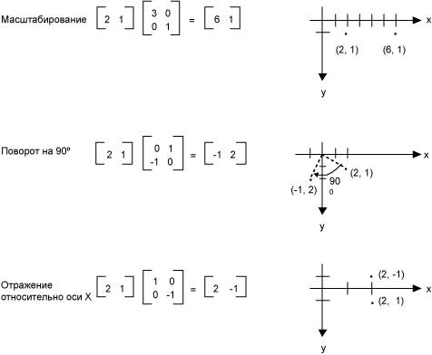
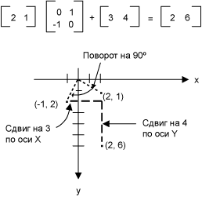
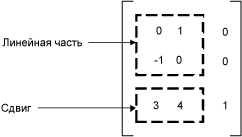

# Матричное представление преобразований
Матрица m n × — это набор чисел, расположенных в строках m и n столбцах. Ниже показано несколько матрицы.  
  
   
  
 Можно добавить двух матриц такого же размера, путем добавления отдельных элементов. Ниже показаны два примера сложения матриц.  
  
   
  
 Матрица m n × можно будет умножено на матрицу n × p, а результатом является матрица m × p. Число столбцов в первой матрице должен быть таким же, как количество строк в матрице второй. Например матрицу 4 × 2 умножается на 2 × 3 матрицу, чтобы создать матрицу 4 × 3.  
  
 Точки на плоскости и строки и столбцы матрицы могут рассматриваться как векторы. Например (2, 5) — это вектор с двумя компонентами и (3, 7, 1) представляет собой вектор с тремя компонентами. Скалярное произведение двух векторов определяется следующим образом:  
  
 (a, b) • (c, d) = ac + bd  
  
 (a, b, c) • (d, e, f) = ad + быть + cf  
  
 Например, скалярное произведение (2, 3) и (5, 4) — (2)(5) + (3)(4) = 22. Скалярное произведение (2, 5, 1) и (4, 3, 1) — (2)(4) + (5)(3) + (1)(1) = 24. Обратите внимание, что скалярное произведение двух векторов является числом, не вектор. Обратите внимание на то, что скалярное произведение можно вычислить только в том случае, если два вектора имеют одинаковый номер компонентов.  
  
 A(i, j) быть ввода матрицы A i-ой строки и столбца ый. Например, объект (3, 2) — запись в матрице, А в третьей строке и столбце 2-й. Предположим, что A, B и C, матрицы и AB = C. Операции C вычисляются следующим образом:  
  
 C (i, j) = (строки i A) • (столбец j B)  
  
 Ниже показано несколько примеров перемножения матриц.  
  
   
  
 Если вы считаете, что точки на плоскости как матрицу 1 × 2, можно преобразовать эту точку путем его умножения матрицу 2 × 2. Ниже показано несколько преобразования, примененные к точке (2, 1).  
  
   
  
 Все преобразования, показанные на рисунке выше, являются линейными преобразованиями. Некоторые другие преобразования, такие как трансляции, не являются линейными и не может быть выражен как умножение на матрицу размером 2 × 2. Предположим, что нужно для начала точка (2, 1), повернуть на 90 градусов, сдвинуть на 3 единицы по оси x и 4 единицы по оси y. Это можно сделать с помощью выполнения умножения и сложения матриц.  
  
   
  
 Линейное преобразование (умножение на матрицу 2 × 2) и сдвиг (Добавление матрицу 1 × 2) вызывается аффинные преобразования. Для хранения всего преобразования в матрицу 3 × 3 является альтернативой аффинные преобразования в пару матриц (одна для линейной) и один для перевода. Чтобы это работало в матрице 1 × 3 с фиктивной третьей координатой должны храниться точки на плоскости. Обычно является сделать все сторонние координаты, равным 1. Например точка (2, 1) будет представлен в матрице [1 1, 2]. На следующем рисунке показан пример аффинного преобразования (поворот на 90 градусов; сдвиг на 3 единицы по оси x и 4 единицы по оси y) выраженное как умножение на матрицу 3 × 3.  
  
   
  
 В предыдущем примере точка (2, 1) сопоставляется точка (2, 6). Обратите внимание, что третий столбец матрицы 3 × 3 содержит числа от 0, 0, 1. Это всегда будет в случае матрицы 3 × 3 аффинные преобразования. Важные числа — шесть столбцов 1 и 2. Часть 2 × 2 верхнего левого матрицы представляет линейную часть преобразования, а первые две записи в третьей строке представляют перевод.  
  
   
  
 В [!INCLUDE[ndptecgdiplus](../../../../includes/ndptecgdiplus-md.md)] можно хранить аффинные преобразования в <xref:System.Drawing.Drawing2D.Matrix> объекта. Так как третий столбец матрицы, задающей аффинное преобразование всегда является (0, 0, 1), укажите только шесть чисел в первых двух столбцах при создании <xref:System.Drawing.Drawing2D.Matrix> объекта. Инструкция `Matrix myMatrix = new Matrix(0, 1, -1, 0, 3, 4)` создает матрицу, изображенную на рисунке выше.  
  
## Составные преобразования  
 Составное преобразование — это последовательность преобразований, один за другим. Рассмотрим матрицы и преобразования в следующем списке:  
  
|||  
|-|-|  
|Матрицы A|Повернуть на 90 градусов|  
|Матрица B|Масштабирование с коэффициентом 2 по оси x|  
|Матрица C|Сдвиг на три единицы по оси y|  
  
 Начнем с точкой (2, 1), представленный в матрице [1 1, 2] — и умножьте, B и затем C, точка (2, 1) будут подвергнуты три преобразования в указанном порядке.  
  
 [1 1, 2] ABC = [1 ПО 5-2]  
  
 А не хранить три части составного преобразования в три отдельных матрицы, можно умножить A, B и C вместе для получения в единую матрицу 3 × 3, в которой хранятся все составное преобразование. Предположим, что ABC = D. Затем точка, умноженная D дает тот же результат, как точка, умноженное на A, B и C.  
  
 [2 1 1]D = [-2 5 1]  
  
 На следующем рисунке показан матрицы A, B, C и D.  
  
   
  
 Тот факт, что матрица составного преобразования может быть создана путем перемножения матриц отдельных преобразования означает, что любая последовательность аффинных преобразований могут храниться в одном <xref:System.Drawing.Drawing2D.Matrix> объекта.  
  
> [!CAUTION]
>  Важен порядок составного преобразования. Вообще говоря, повернуть, затем масштабирование, а затем перевести не соответствует как масштабирования, поворота, а затем перевести. Точно так же важен порядок умножения матриц. В общем случае ABC не равно BAC.  
  
 <xref:System.Drawing.Drawing2D.Matrix> Класс предоставляет несколько методов для составных преобразований: <xref:System.Drawing.Drawing2D.Matrix.Multiply%2A>, <xref:System.Drawing.Drawing2D.Matrix.Rotate%2A>, <xref:System.Drawing.Drawing2D.Matrix.RotateAt%2A>, <xref:System.Drawing.Drawing2D.Matrix.Scale%2A>, <xref:System.Drawing.Drawing2D.Matrix.Shear%2A>, и <xref:System.Drawing.Drawing2D.Matrix.Translate%2A>. В следующем примере создается матрица составного преобразования, сначала поворачивается на 30 градусов, а затем масштабируется с коэффициентом 2 по оси y и транслирует 5 единиц по оси x:  
  
 [!code-csharp[System.Drawing.CoordinateSystems#11](~/samples/snippets/csharp/VS_Snippets_Winforms/System.Drawing.CoordinateSystems/CS/Class1.cs#11)]
 [!code-vb[System.Drawing.CoordinateSystems#11](~/samples/snippets/visualbasic/VS_Snippets_Winforms/System.Drawing.CoordinateSystems/VB/Class1.vb#11)]  
  
 На следующем рисунке матрицы.  
  
   
  
## См. также

- [Системы координат и преобразования](coordinate-systems-and-transformations.md)
- [Использование преобразований в управляемом GDI+](using-transformations-in-managed-gdi.md)
