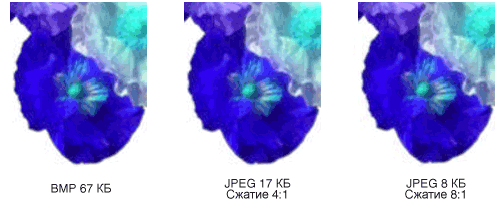

# Типы точечных рисунков
Битовая карта представляет собой массив битов, задающих цвет каждого пикселя в прямоугольный массив точек. Количество битов, задающих цвет одного пикселя определяет число цветов, которые могут быть назначены пикселя. Например, если каждый пиксел представляется 4 бита, затем произвольной точки можно задать один из 16 различных цветов (2 ^ 4 = 16). Ниже приведены несколько примеров число цветов, которые могут быть назначены пикселя, представляемого заданное число бит.  
  
|Бит на пиксель|Число цветов, которые могут быть назначены пиксель|  
|--------------------|------------------------------------------------------|  
|1|2^1 = 2|  
|2|2^2 = 4|  
|4|2^4 = 16|  
|8|2^8 = 256|  
|16|2^16 = 65,536|  
|24|2^24 = 16,777,216|  
  
 Файлы, которые служат для хранения растровых изображений, обычно содержат один или несколько блоков данных, в которых хранятся сведения, такие как число бит на пиксель, количество точек в каждой строке и количество строк в массиве. Этот файл также может содержать таблицу цветов (иногда называется цветовую палитру). Таблица цветов сопоставляет чисел в битовой карте цветов. Ниже показан увеличенное изображение вместе с соответствующей таблицей растрового изображения и цвет. Каждая точка представляется 4-разрядное число, поэтому существуют 2 ^ 4 = 16 цветов в таблице цветов. Каждый цвет в таблице представляется с 24-разрядное число: 8 бит для красного, 8 бит для зеленого и 8 бит для синего. Числа отображаются в форме шестнадцатеричным (основание 16): A = 10, B = 11, C = 12, D = 13, E = 14, F = 15.  
  
   
  
 Рассмотрим пикселя в строке 3, столбец 5 изображения. Соответствующий номер в битовой карте — 1. Таблица цветов сообщает о том, что 1 представляет красный цвет, поэтому пикселя отображается красным цветом. Все записи в верхней строке растрового изображения — 3. Таблица цветов сообщает о том, что 3 соответствует синему, поэтому все пиксели в верхней строке изображения — синим.  
  
> [!NOTE]
>  Некоторые битовые карты хранятся в формате снизу вверх. числа в первой строке растрового изображения соответствуют пиксели в нижней строке изображения.  
  
 Битовая карта, хранит индексы в таблице цветов называется индексированными растрового изображения. Некоторые точечные рисунки имеют устраняет потребность в цветовой таблице. Например если точечный рисунок 24 бита на пиксель, этот точечный рисунок можно хранить цвет, а не индексы в таблице цветов. Ниже показан точечный рисунок, который хранит цвета напрямую (24 бита на пиксель), вместо использования цветовой таблицы. На рисунке также увеличенное изображение. В битовой карте FFFFFF — белый, FF0000 обозначает красный, число 00FF00 обозначает зеленый и 0000FF соответствует синему.  
  
   
  
## Графические форматы файлов  
 Существует множество стандартных форматов сохранение растровых изображений в файлы на диске. [!INCLUDE[ndptecgdiplus](../../../../includes/ndptecgdiplus-md.md)] поддерживает форматы, описанные в следующих абзацах графических файлов.  
  
### BMP  
 BMP — это стандартный формат, используемый Windows для хранения образов аппаратно независимые и независимым от приложения. Количество битов на пиксель (1, 4, 8, 15, 24, 32 или 64) для заданного файла BMP указывается в заголовке файла. BMP-файлы с 24 бита на пиксель являются общими. BMP-файлы обычно не сжимаются и, следовательно, не очень хорошо подходят для передачи через Интернет.  
  
### Формат GIF (Graphics Interchange Format)  
 GIF-Это распространенный формат для изображения, которые появляются на веб-страницах. Изображения формата GIF хорошо подходят для рисунков, изображения с блоками сплошным цветом и рисунков с четкой границей между цветами. GIF-файлы будут сжаты, но не данные теряются в процессе сжатия; без сжатия изображения именно то, что и исходный. Один цвет в формате GIF, назначается как прозрачный, таким образом, чтобы изображение будет иметь цвет фона любой веб-страницы, на которой он отображается. Последовательность изображений GIF могут храниться в одном файле для формирования анимационный GIF:. GIF могут содержать не более 8 бит на пиксель, поэтому они не более 256 цветов.  
  
### Неподвижных изображений (JPEG)  
 JPEG является схемой сжатия, который хорошо подходит для естественных образов, таких как отсканированные фотографии. Некоторые данные теряются в процессе сжатия, но часто потеря долог для человеческого глаза. JPEG содержат 24 бита на пиксель, поэтому они поддерживают отображение более чем 16 миллионов цветов. JPEG не поддерживает прозрачность или анимации.  
  
 Степень сжатия изображений JPEG можно настраивать, но большая степень сжатия (небольшие файлы) к потере Дополнительные сведения. Коэффициент сжатия 20:1 часто создает образ, который человеческим глазом находит сложно отличить от оригинала. Ниже показано изображение из формата BMP и двух JPEG-рисунков, которые были сжаты на основе этого образа BMP. Первый JPEG имеет коэффициент сжатия 4:1, и второй ПОЛУЧЕН с использованием коэффициента сжатия 8:1.  
  
   
  
 Сжатие JPEG не подходит для рисунков, блоки сплошным цветом и четкие границы. Ниже показан BMP, два изображения JPEG и GIF. JPEG и GIF были сжатия BMP. Коэффициент сжатия — 4:1 для GIF, 4:1 для небольших JPEG и 8:3, для большего размера JPEG. Обратите внимание, что GIF сохраняет четкие границы вдоль линий, но JPEG, как правило, размываются.  
  
   
  
 JPEG является схемой сжатия, а не в формат файла. Формат обмена файл JPEG (JFIF) — это формат файла, обычно используется для хранения и передачи изображений, сжатые в соответствии со схемой JPEG. Файлы JFIF, отображаемые веб-обозревателями используют расширение .jpg.  
  
### Файл может использоваться для обмена изображения (EXIF)  
 EXIF — это формат файла, используемый для хранения фотографий, полученных с помощью цифровой камеры. Файл EXIF содержит изображение, сжимается в соответствии со спецификацией JPEG. Файл EXIF также содержит данные о фотографии (дата съемки, скорость затвора, ограниченное время и т. д.) и информацию о камеры (производитель, модель и т. д.).  
  
### Формат PNG (Portable Network Graphics)  
 Формат PNG сохраняет многие преимущества формата GIF, но также предоставляет возможности, недоступные в формате GIF. Подобно файлам GIF PNG-файлы будут сжаты без потери информации. PNG-файлы могут содержать цвета 8, 24 или 48 бит на пиксел и оттенках серого с 1, 2, 4, 8 или 16 бит на пиксель. Напротив GIF-файлы можно использовать только 1, 2, 4 или 8 бит на пиксель. PNG-файл также можно хранить альфа-значение для каждого пикселя, который определяет степень, в которую цвета точки смешивается с цветом фона.  
  
 Улучшает PNG предсказуемый последовательно выводит изображение GIF (то есть для отображения более и более подробное приближение изображения, так как он поступает через сетевое подключение). PNG-файлы могут содержать данные о гамма коррекции и о цветовой коррекции, что позволяет точно изображение на различных устройствах отображения.  
  
### Формат файла тег изображения (TIFF)  
 TIFF — это гибкий и расширяемый формат, поддерживаемый для разнообразных платформ и приложений для обработки изображений. TIFF-файлы можно хранить изображения с произвольное число бит на пиксель и использовать различные алгоритмы сжатия. Несколько образов могут храниться в одной, нескольких страниц TIFF-файл. Сведения, связанные с изображением (модель сканера, главного компьютера, тип сжатия, ориентация, примеры на пиксел и т. д.) можно хранить в файле и упорядочены с помощью тегов. Формат TIFF может быть расширена, при необходимости путем добавления новых тегов и утверждения.  
  
## См. также

- <xref:System.Drawing.Image?displayProperty=nameWithType>
- <xref:System.Drawing.Bitmap?displayProperty=nameWithType>
- <xref:System.Drawing.Imaging.PixelFormat?displayProperty=nameWithType>
- [Работа с растровыми и векторными изображениями с использованием классов Image, Bitmap и Metafile](images-bitmaps-and-metafiles.md)
- [Работа с растровыми и векторными изображениями](working-with-images-bitmaps-icons-and-metafiles.md)
