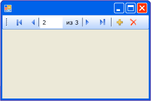

# Общие сведения об элементе управления BindingNavigator (Windows Forms)
Элемент управления <xref:System.Windows.Forms.BindingNavigator> можно использовать для создания стандартных средств поиска и изменения данных в форме Windows Forms. Элемент управления <xref:System.Windows.Forms.BindingNavigator> часто используется с компонентом <xref:System.Windows.Forms.BindingSource>, позволяя пользователям переходить по записям данных в форме и взаимодействовать с ними.  
  
## Как работает элемент управления BindingNavigator  
 Элемент управления <xref:System.Windows.Forms.BindingNavigator> состоит из элемента <xref:System.Windows.Forms.ToolStrip> с набором объектов <xref:System.Windows.Forms.ToolStripItem> для большинства обычных действий с данными: их добавления, удаления и перемещения по ним. По умолчанию элемент управления <xref:System.Windows.Forms.BindingNavigator> содержит эти стандартные кнопки. На снимке экрана ниже показан элемент управления <xref:System.Windows.Forms.BindingNavigator>, размещенный на форме.  
  
   
  
 В таблице ниже перечислены элементы управления и их функции.  
  
|Control|Функция|  
|-------------|--------------|  
|Кнопка <xref:System.Windows.Forms.BindingNavigator.AddNewItem%2A> |Вставляет новую строку в базовый источник данных.|  
|Кнопка <xref:System.Windows.Forms.BindingNavigator.DeleteItem%2A>|Удаляет текущую строку из базового источника данных.|  
|Кнопка <xref:System.Windows.Forms.BindingNavigator.MoveFirstItem%2A>|Переход к первому элементу базового источника данных.|  
|Кнопка <xref:System.Windows.Forms.BindingNavigator.MoveLastItem%2A> |Переход к последнему элементу базового источника данных.|  
|Кнопка <xref:System.Windows.Forms.BindingNavigator.MoveNextItem%2A>|Переход к следующему элементу базового источника данных.|  
|Кнопка <xref:System.Windows.Forms.BindingNavigator.MovePreviousItem%2A>|Переход к предыдущему элементу базового источника данных.|  
|Текстовое поле <xref:System.Windows.Forms.BindingNavigator.PositionItem%2A> |Возвращает текущую позицию в базовом источнике данных.|  
|Текстовое поле <xref:System.Windows.Forms.BindingNavigator.CountItem%2A>|Возвращает общее число элементов в базовом источнике данных.|  
  
 Каждому элементу управления этой коллекции соответствует член компонента <xref:System.Windows.Forms.BindingSource>, обеспечивающий ту же функциональность программным путем. Например, кнопка <xref:System.Windows.Forms.BindingNavigator.MoveFirstItem%2A> соответствует методу <xref:System.Windows.Forms.BindingSource.MoveFirst%2A> компонента <xref:System.Windows.Forms.BindingSource>, кнопка <xref:System.Windows.Forms.BindingNavigator.DeleteItem%2A> соответствует методу <xref:System.Windows.Forms.BindingSource.RemoveCurrent%2A> и т. д.  
  
 Если кнопки по умолчанию не удовлетворяют требованиям приложения или необходимо использовать дополнительные кнопки с иной функциональностью, можно создать собственные кнопки <xref:System.Windows.Forms.ToolStrip>. См. также [Практическое руководство. Добавление кнопок загрузки, сохранения и отмены в элемент управления BindingNavigator в формах Windows Forms](../../../../docs/framework/winforms/controls/load-save-and-cancel-bindingnavigator.md).  
  
## См. также  
 <xref:System.Windows.Forms.BindingNavigator>  
 <xref:System.Windows.Forms.BindingSource>  
 [Элемент управления BindingNavigator](../../../../docs/framework/winforms/controls/bindingnavigator-control-windows-forms.md)
