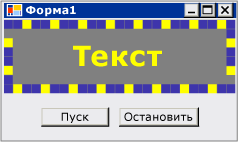

# <a name="walkthrough-creating-a-windows-forms-control-that-takes-advantage-of-visual-studio-design-time-features"></a>Пошаговое руководство. Создание элемента управления Windows Forms, используются преимущества функций Visual Studio во время разработки

Среда разработки для пользовательского элемента управления можно улучшить путем создания пользовательских сопоставленный конструктор.

В этом пошаговом руководстве описывается создание пользовательского конструктора для пользовательского элемента управления. Вы реализуете `MarqueeControl` тип и связанный класс конструктора, называется `MarqueeControlRootDesigner`.

`MarqueeControl` Тип реализует экран, подобный бегущую строку, с анимацией огней и мигающим текстом.

Конструктор для этого элемента управления взаимодействует со средой разработки для предоставления пользовательского интерфейса во время разработки. С помощью пользовательского конструктора можно создать пользовательскую `MarqueeControl` реализации с анимацией огней и мигающим текстом во многих сочетаниях. Можно использовать полученный элемент управления в форме, как любой другой элемент управления Windows Forms.

В данном пошаговом руководстве представлены следующие задачи.

- Создание проекта

- Создание проекта библиотеки элементов управления

- Ссылки на проект пользовательского элемента управления

- Определение пользовательского элемента управления и его конструктора

- Создание экземпляра пользовательского элемента управления

- Настройка проекта для отладки во время разработки

- Реализация пользовательского элемента управления

- Создание дочернего элемента управления для элемента управления

- Создание MarqueeBorder дочерний элемент управления

- Создание пользовательского конструктора тени и свойства фильтра

- Обработка изменений компонентов

- Добавление команд конструктора в пользовательский конструктор

- Создание пользовательского редактора UITypeEditor

- Тестирование элемента управления в конструкторе

Когда вы закончите, пользовательский элемент управления будет выглядеть примерно следующим образом:



Полный пример кода, см. в разделе [как: Создание элемента управления Windows Forms, используются преимущества функций разработки](https://docs.microsoft.com/previous-versions/visualstudio/visual-studio-2013/307hck25(v=vs.120)).

> [!NOTE]
> Отображаемые диалоговые окна и команды меню могут отличаться от описанных в справке в зависимости от текущих параметров или выпуска. Чтобы изменить параметры, выберите в меню **Сервис** пункт **Импорт и экспорт параметров** . Дополнительные сведения см. в разделе [Персонализация интегрированной среды разработки Visual Studio](/visualstudio/ide/personalizing-the-visual-studio-ide).

## <a name="prerequisites"></a>Предварительные требования

Для выполнения данного пошагового руководства требуется:

- Разрешения, необходимые для создания и выполнения проектов приложений Windows Forms на компьютере, на котором установлена Visual Studio.

## <a name="creating-the-project"></a>Создание проекта

Первым шагом является создание проекта приложения. Этот проект будет использован для построения приложения, на котором размещается пользовательский элемент управления.

### <a name="to-create-the-project"></a>Создание проекта

- Создайте проект приложения Windows Forms с именем «MarqueeControlTest» (**файл** > **New** > **проекта**  >   **Visual C#** или **Visual Basic** > **классический рабочий стол** > **Windows Forms Application**).

## <a name="creating-a-control-library-project"></a>Создание проекта библиотеки элементов управления

Следующим шагом является создание проекта библиотеки элементов управления. Вы создадите новый пользовательский элемент управления и его соответствующего конструктора.

### <a name="to-create-the-control-library-project"></a>Чтобы создать проект библиотеки элементов управления

1. Добавьте проект библиотеки элементов управления Windows Forms в решение. Назовите проект «MarqueeControlLibrary.»

2. С помощью **обозревателе решений**, удалите элемент управления проекта по умолчанию, удаляя исходный файл с именем «UserControl1.cs» или «UserControl1.vb» в зависимости от выбранного языка. Дополнительные сведения см. в разделе [Как Удалить, удаление и исключить элементы](https://docs.microsoft.com/previous-versions/visualstudio/visual-studio-2010/0ebzhwsk(v=vs.100)).

3. Добавьте новый <xref:System.Windows.Forms.UserControl> элемент `MarqueeControlLibrary` проекта. Предоставить новый исходный файл базовым именем «MarqueeControl.»

4. С помощью **обозревателе решений**, создайте новую папку в `MarqueeControlLibrary` проекта. Дополнительные сведения см. в разделе [Как Добавление новых элементов проекта](https://docs.microsoft.com/previous-versions/visualstudio/visual-studio-2010/w0572c5b(v=vs.100)). Назовите новую папку «Design».

5. Щелкните правой кнопкой мыши **разработки** папку и добавьте новый класс. Присвойте файлу источника, базовым именем «MarqueeControlRootDesigner.»

6. Необходимо использовать типы из сборки System.Design, поэтому добавьте этот справочник, чтобы `MarqueeControlLibrary` проекта.

    > [!NOTE]
    > Чтобы использовать сборки System.Design, ваш проект должен быть предназначен для полной версии платформы .NET Framework, а не клиентский профиль .NET Framework. Чтобы изменить целевую платформу, см. в разделе [как: определить целевую версию .NET Framework](/visualstudio/ide/how-to-target-a-version-of-the-dotnet-framework).

## <a name="referencing-the-custom-control-project"></a>Ссылки на проект пользовательского элемента управления

Вы воспользуетесь `MarqueeControlTest` проекта для тестирования пользовательского элемента управления. Тестовый проект узнает об пользовательского элемента управления при добавлении в проект ссылку на `MarqueeControlLibrary` сборки.

### <a name="to-reference-the-custom-control-project"></a>Для ссылки на проект пользовательского элемента управления

- В `MarqueeControlTest` , добавьте в проект ссылку на `MarqueeControlLibrary` сборки. Обязательно используйте **проекты** вкладке **добавить ссылку** диалоговое окно, вместо ссылки на `MarqueeControlLibrary` сборки напрямую.

## <a name="defining-a-custom-control-and-its-custom-designer"></a>Определение пользовательского элемента управления и его конструктора
 Пользовательский элемент управления, производной от <xref:System.Windows.Forms.UserControl> класса. Благодаря этому ваш элемент управления для размещения других элементов управления, и он предоставляет немало функций по умолчанию элемент управления.

 Пользовательский элемент управления будет иметь сопоставленный пользовательский конструктор. Это позволяет создать уникальный интерфейс разработки, предназначенная специально для пользовательского элемента управления.

 Связывание элемента управления с конструктором посредством <xref:System.ComponentModel.DesignerAttribute> класса. Поскольку вы разрабатываете всей поведение времени разработки пользовательского элемента управления, пользовательский конструктор будет реализовывать <xref:System.ComponentModel.Design.IRootDesigner> интерфейс.

### <a name="to-define-a-custom-control-and-its-custom-designer"></a>Для определения пользовательского элемента управления и его конструктора

1. Откройте `MarqueeControl` исходный файл в **редактор кода**. В верхней части файла импортируйте следующие пространства имен:

     [!code-csharp[System.Windows.Forms.Design.DocumentDesigner#220](~/samples/snippets/csharp/VS_Snippets_Winforms/System.Windows.Forms.Design.DocumentDesigner/CS/marqueecontrol.cs#220)]
     [!code-vb[System.Windows.Forms.Design.DocumentDesigner#220](~/samples/snippets/visualbasic/VS_Snippets_Winforms/System.Windows.Forms.Design.DocumentDesigner/VB/marqueecontrol.vb#220)]

2. Добавить <xref:System.ComponentModel.DesignerAttribute> для `MarqueeControl` объявление класса. Это связывает пользовательский элемент управления с помощью его конструктора.

     [!code-csharp[System.Windows.Forms.Design.DocumentDesigner#240](~/samples/snippets/csharp/VS_Snippets_Winforms/System.Windows.Forms.Design.DocumentDesigner/CS/marqueecontrol.cs#240)]
     [!code-vb[System.Windows.Forms.Design.DocumentDesigner#240](~/samples/snippets/visualbasic/VS_Snippets_Winforms/System.Windows.Forms.Design.DocumentDesigner/VB/marqueecontrol.vb#240)]

3. Откройте `MarqueeControlRootDesigner` исходный файл в **редактор кода**. В верхней части файла импортируйте следующие пространства имен:

     [!code-csharp[System.Windows.Forms.Design.DocumentDesigner#520](~/samples/snippets/csharp/VS_Snippets_Winforms/System.Windows.Forms.Design.DocumentDesigner/CS/marqueecontrolrootdesigner.cs#520)]
     [!code-vb[System.Windows.Forms.Design.DocumentDesigner#520](~/samples/snippets/visualbasic/VS_Snippets_Winforms/System.Windows.Forms.Design.DocumentDesigner/VB/marqueecontrolrootdesigner.vb#520)]

4. Измените объявление `MarqueeControlRootDesigner` наследование <xref:System.Windows.Forms.Design.DocumentDesigner> класса. Применить <xref:System.ComponentModel.ToolboxItemFilterAttribute> для указания взаимодействия конструктора с **элементов**.

     **Примечание** определение `MarqueeControlRootDesigner` класса заключается в пространство имен с именем «MarqueeControlLibrary.Design.» Это объявление помещает конструктор в специальном пространстве имен зарезервированы для типов, связанных с проектированием.

     [!code-csharp[System.Windows.Forms.Design.DocumentDesigner#530](~/samples/snippets/csharp/VS_Snippets_Winforms/System.Windows.Forms.Design.DocumentDesigner/CS/marqueecontrolrootdesigner.cs#530)]
     [!code-vb[System.Windows.Forms.Design.DocumentDesigner#530](~/samples/snippets/visualbasic/VS_Snippets_Winforms/System.Windows.Forms.Design.DocumentDesigner/VB/marqueecontrolrootdesigner.vb#530)]

5. Определение конструктора для `MarqueeControlRootDesigner` класса. Вставить <xref:System.Diagnostics.Trace.WriteLine%2A> инструкции в теле конструктора. Это будет полезно для отладки.

     [!code-csharp[System.Windows.Forms.Design.DocumentDesigner#540](~/samples/snippets/csharp/VS_Snippets_Winforms/System.Windows.Forms.Design.DocumentDesigner/CS/marqueecontrolrootdesigner.cs#540)]
     [!code-vb[System.Windows.Forms.Design.DocumentDesigner#540](~/samples/snippets/visualbasic/VS_Snippets_Winforms/System.Windows.Forms.Design.DocumentDesigner/VB/marqueecontrolrootdesigner.vb#540)]

## <a name="creating-an-instance-of-your-custom-control"></a>Создание экземпляра пользовательского элемента управления
 Чтобы посмотреть, пользовательское поведение времени разработки элемента управления, поместите экземпляр элемента управления в форме в `MarqueeControlTest` проекта.

### <a name="to-create-an-instance-of-your-custom-control"></a>Для создания экземпляра пользовательского элемента управления

1. Добавьте новый <xref:System.Windows.Forms.UserControl> элемент `MarqueeControlTest` проекта. Предоставить новый исходный файл базовым именем «DemoMarqueeControl.»

2. Откройте `DemoMarqueeControl` файл **редактор кода**. В верхней части файла, импортировать `MarqueeControlLibrary` пространство имен:

```vb
Imports MarqueeControlLibrary
```

```csharp
using MarqueeControlLibrary;
```

1. Измените объявление `DemoMarqueeControl` наследование `MarqueeControl` класса.

2. Выполните построение проекта.

3. Откройте `Form1` в конструкторе Windows Forms.

4. Найти **компоненты MarqueeControlTest** вкладке **элементов** и откройте его. Перетащите `DemoMarqueeControl` из **элементов** на форму.

5. Выполните построение проекта.

## <a name="setting-up-the-project-for-design-time-debugging"></a>Настройка проекта для отладки во время разработки

При разработке пользовательского взаимодействия во время разработки, его будет необходимо отлаживать элементы управления и компоненты. Есть простой способ настроить проект для отладки во время разработки. Дополнительные сведения см. в разделе [Пошаговое руководство: Отладка пользовательских Windows Forms элементы управления во время разработки](walkthrough-debugging-custom-windows-forms-controls-at-design-time.md).

### <a name="to-set-up-the-project-for-design-time-debugging"></a>Чтобы настроить проект для отладки во время разработки

1. Щелкните правой кнопкой мыши `MarqueeControlLibrary` проекта и выберите **свойства**.

2. В диалоговом окне «Страницы свойств MarqueeControlLibrary» выберите **Отладка** страницы.

3. В **действие при запуске** выберите **запуск внешней программы**. Вы будете отладка отдельного экземпляра Visual Studio, поэтому нажмите кнопку с многоточием () чтобы перейти в интегрированной среде разработки Visual Studio. Имя исполняемого файла — devenv.exe, и если вы установили в расположение по умолчанию, его путь — 9.0\Common7\IDE\devenv.exe %programfiles%\Microsoft Visual Studio.

4. Нажмите кнопку ОК, чтобы закрыть диалоговое окно.

5. Щелкните правой кнопкой мыши `MarqueeControlLibrary` проекта и выберите «Назначить запускаемым проектом», чтобы включить конфигурацию отладки.

## <a name="checkpoint"></a>Контрольная точка

Теперь вы готовы отладки поведения времени разработки пользовательского элемента управления. Выяснив, что среда отладки установлено правильно, вы проверите связь между пользовательского элемента управления и конструктором.

### <a name="to-test-the-debugging-environment-and-the-designer-association"></a>Для тестирования среды отладки и связи конструктора

1. Откройте `MarqueeControlRootDesigner` исходный файл в **редактор кода** и поместите точку останова на <xref:System.Diagnostics.Trace.WriteLine%2A> инструкции.

2. Нажмите клавишу F5, чтобы запустить сеанс отладки. Обратите внимание на то, что создается новый экземпляр Visual Studio.

3. В новом экземпляре Visual Studio откройте решение «MarqueeControlTest». Решение можно легко найти, выбрав **последние проекты** из **файл** меню. Файл решения «MarqueeControlTest.sln» отображаются как последних использовавшихся файлов.

4. Откройте `DemoMarqueeControl` в конструкторе. Обратите внимание, что отладочный экземпляр Visual Studio получает фокус, и выполнение остановится в точке останова. Нажмите клавишу F5, чтобы продолжить сеанс отладки.

На этом этапе все, что находится в месте, для разработки и отладки пользовательского элемента управления и его связанные конструктора. В оставшейся части этого пошагового руководства будет сосредоточиться на деталях реализации таких возможностей элемента управления и конструктора.

## <a name="implementing-your-custom-control"></a>Реализация пользовательского элемента управления

`MarqueeControl` Является <xref:System.Windows.Forms.UserControl> несложной настройки. Он предоставляет два метода: `Start`, которая запускает анимацию бегущей строки, и `Stop`, который останавливает анимацию. Так как `MarqueeControl` содержит дочерними элементами, реализующими `IMarqueeWidget` интерфейс, `Start` и `Stop` перечисление каждого дочернего элемента управления и вызов `StartMarquee` и `StopMarquee` методы, соответственно, на все дочерние элементы управления реализующий `IMarqueeWidget`.

Внешний вид `MarqueeBorder` и `MarqueeText` элементов управления в зависимости от структуры, поэтому `MarqueeControl` переопределяет <xref:System.Windows.Forms.Control.OnLayout%2A> метода и вызывает <xref:System.Windows.Forms.Control.PerformLayout%2A> на дочерние элементы управления этого типа.

Это объем `MarqueeControl` настроек. Во время выполнения функции обеспечиваются `MarqueeBorder` и `MarqueeText` элементы управления и функции разработки реализуются `MarqueeBorderDesigner` и `MarqueeControlRootDesigner` классы.

### <a name="to-implement-your-custom-control"></a>Для реализации пользовательского элемента управления

1. Откройте `MarqueeControl` исходный файл в **редактор кода**. Реализуйте `Start` и `Stop` методы.

    [!code-csharp[System.Windows.Forms.Design.DocumentDesigner#260](~/samples/snippets/csharp/VS_Snippets_Winforms/System.Windows.Forms.Design.DocumentDesigner/CS/marqueecontrol.cs#260)]
    [!code-vb[System.Windows.Forms.Design.DocumentDesigner#260](~/samples/snippets/visualbasic/VS_Snippets_Winforms/System.Windows.Forms.Design.DocumentDesigner/VB/marqueecontrol.vb#260)]

2. Переопределите метод <xref:System.Windows.Forms.Control.OnLayout%2A> .

    [!code-csharp[System.Windows.Forms.Design.DocumentDesigner#270](~/samples/snippets/csharp/VS_Snippets_Winforms/System.Windows.Forms.Design.DocumentDesigner/CS/marqueecontrol.cs#270)]
    [!code-vb[System.Windows.Forms.Design.DocumentDesigner#270](~/samples/snippets/visualbasic/VS_Snippets_Winforms/System.Windows.Forms.Design.DocumentDesigner/VB/marqueecontrol.vb#270)]

## <a name="creating-a-child-control-for-your-custom-control"></a>Создание дочернего элемента управления для элемента управления

`MarqueeControl` Будет размещаться два вида дочернего элемента управления: `MarqueeBorder` управления и `MarqueeText` элемента управления.

- `MarqueeBorder`: Этот элемент управления рисует «lights» вокруг его границ. Индикаторы flash в последовательности, чтобы они отображались движутся вокруг границы. Скорость, с которой свет flash управляется свойством `UpdatePeriod`. Несколько других пользовательских свойств определяют другие характеристики внешнего вида элемента управления. Два метода, `StartMarquee` и `StopMarquee`, контролировать, когда анимация начинается и останавливается.

- `MarqueeText`: Этот элемент управления рисует мигающую строку. Как и `MarqueeBorder` элемента управления, скорость мигания текст управляется `UpdatePeriod` свойство. `MarqueeText` Элемент управления также имеет `StartMarquee` и `StopMarquee` методы общих с `MarqueeBorder` элемента управления.

Во время разработки `MarqueeControlRootDesigner` позволяет эти типы двух элементов управления для добавления `MarqueeControl` в любом сочетании.

Общие возможности двух элементов управления представлены в интерфейсе `IMarqueeWidget`. Это позволяет `MarqueeControl` определять все дочерние элементы управления и обрабатывать их особым образом.

Для реализации анимации, будет использоваться <xref:System.ComponentModel.BackgroundWorker> объектов из <xref:System.ComponentModel?displayProperty=nameWithType> пространства имен. Можно использовать <xref:System.Windows.Forms.Timer> объектов, но когда множество `IMarqueeWidget` присутствуют объекты, возможно, единственный UI-поток может справиться с анимацией.

### <a name="to-create-a-child-control-for-your-custom-control"></a>Для создания дочернего элемента управления для элемента управления

1. Добавить новый элемент класса для `MarqueeControlLibrary` проекта. Предоставить новый исходный файл базовым именем «IMarqueeWidget.»

2. Откройте `IMarqueeWidget` исходный файл в **редактор кода** и замените объявление с `class` для `interface`:

    [!code-csharp[System.Windows.Forms.Design.DocumentDesigner#2](~/samples/snippets/csharp/VS_Snippets_Winforms/System.Windows.Forms.Design.DocumentDesigner/CS/imarqueewidget.cs#2)]
    [!code-vb[System.Windows.Forms.Design.DocumentDesigner#2](~/samples/snippets/visualbasic/VS_Snippets_Winforms/System.Windows.Forms.Design.DocumentDesigner/VB/imarqueewidget.vb#2)]

3. Добавьте следующий код, чтобы `IMarqueeWidget` интерфейс для предоставления двух методов и свойства, анимацией бегущей строки:

    [!code-csharp[System.Windows.Forms.Design.DocumentDesigner#3](~/samples/snippets/csharp/VS_Snippets_Winforms/System.Windows.Forms.Design.DocumentDesigner/CS/imarqueewidget.cs#3)]
    [!code-vb[System.Windows.Forms.Design.DocumentDesigner#3](~/samples/snippets/visualbasic/VS_Snippets_Winforms/System.Windows.Forms.Design.DocumentDesigner/VB/imarqueewidget.vb#3)]

4. Добавьте новый **пользовательский элемент управления** элемент `MarqueeControlLibrary` проекта. Предоставить новый исходный файл базовым именем «MarqueeText.»

5. Перетащите <xref:System.ComponentModel.BackgroundWorker> компонент из **элементов** на вашей `MarqueeText` элемента управления. Этот компонент позволит `MarqueeText` обновление асинхронно элемента управления.

6. В окне «Свойства» задайте <xref:System.ComponentModel.BackgroundWorker> компонента `WorkerReportsProgress` и <xref:System.ComponentModel.BackgroundWorker.WorkerSupportsCancellation%2A> свойства `true`. Эти параметры позволяют <xref:System.ComponentModel.BackgroundWorker> компонент периодически вызывать <xref:System.ComponentModel.BackgroundWorker.ProgressChanged> событий и отменить асинхронное обновление. Дополнительные сведения см. в разделе [компонента BackgroundWorker](backgroundworker-component.md).

7. Откройте `MarqueeText` исходный файл в **редактор кода**. В верхней части файла импортируйте следующие пространства имен:

    [!code-csharp[System.Windows.Forms.Design.DocumentDesigner#120](~/samples/snippets/csharp/VS_Snippets_Winforms/System.Windows.Forms.Design.DocumentDesigner/CS/marqueetext.cs#120)]
    [!code-vb[System.Windows.Forms.Design.DocumentDesigner#120](~/samples/snippets/visualbasic/VS_Snippets_Winforms/System.Windows.Forms.Design.DocumentDesigner/VB/marqueetext.vb#120)]

8. Измените объявление `MarqueeText` наследование <xref:System.Windows.Forms.Label> и реализовать `IMarqueeWidget` интерфейса:

    [!code-csharp[System.Windows.Forms.Design.DocumentDesigner#130](~/samples/snippets/csharp/VS_Snippets_Winforms/System.Windows.Forms.Design.DocumentDesigner/CS/marqueetext.cs#130)]
    [!code-vb[System.Windows.Forms.Design.DocumentDesigner#130](~/samples/snippets/visualbasic/VS_Snippets_Winforms/System.Windows.Forms.Design.DocumentDesigner/VB/marqueetext.vb#130)]

9. Объявите переменные экземпляра, соответствующие этим свойствам и инициализируйте их в конструкторе. `isLit` Поля определяет, является ли текст для рисования с помощью цвета `LightColor` свойство.

    [!code-csharp[System.Windows.Forms.Design.DocumentDesigner#140](~/samples/snippets/csharp/VS_Snippets_Winforms/System.Windows.Forms.Design.DocumentDesigner/CS/marqueetext.cs#140)]
    [!code-vb[System.Windows.Forms.Design.DocumentDesigner#140](~/samples/snippets/visualbasic/VS_Snippets_Winforms/System.Windows.Forms.Design.DocumentDesigner/VB/marqueetext.vb#140)]

10. Реализовать интерфейс `IMarqueeWidget`.

    `StartMarquee` И `StopMarquee` методы вызывают <xref:System.ComponentModel.BackgroundWorker> компонента <xref:System.ComponentModel.BackgroundWorker.RunWorkerAsync%2A> и <xref:System.ComponentModel.BackgroundWorker.CancelAsync%2A> методы для запуска и остановки анимации.

    <xref:System.ComponentModel.CategoryAttribute.Category%2A> И <xref:System.ComponentModel.BrowsableAttribute.Browsable%2A> атрибуты применяются к `UpdatePeriod` свойство, поэтому она отображается в пользовательском разделе окна свойств, под названием «Область».

    [!code-csharp[System.Windows.Forms.Design.DocumentDesigner#150](~/samples/snippets/csharp/VS_Snippets_Winforms/System.Windows.Forms.Design.DocumentDesigner/CS/marqueetext.cs#150)]
    [!code-vb[System.Windows.Forms.Design.DocumentDesigner#150](~/samples/snippets/visualbasic/VS_Snippets_Winforms/System.Windows.Forms.Design.DocumentDesigner/VB/marqueetext.vb#150)]

11. Реализация методов доступа свойства. Будет предоставлять два свойства для клиентов: `LightColor` и `DarkColor`. <xref:System.ComponentModel.CategoryAttribute.Category%2A> И <xref:System.ComponentModel.BrowsableAttribute.Browsable%2A> атрибуты применяются к этим свойствам, поэтому они отображаются в пользовательском разделе окна свойств, под названием «Область».

    [!code-csharp[System.Windows.Forms.Design.DocumentDesigner#160](~/samples/snippets/csharp/VS_Snippets_Winforms/System.Windows.Forms.Design.DocumentDesigner/CS/marqueetext.cs#160)]
    [!code-vb[System.Windows.Forms.Design.DocumentDesigner#160](~/samples/snippets/visualbasic/VS_Snippets_Winforms/System.Windows.Forms.Design.DocumentDesigner/VB/marqueetext.vb#160)]

12. Реализуйте обработчики для <xref:System.ComponentModel.BackgroundWorker> компонента <xref:System.ComponentModel.BackgroundWorker.DoWork> и <xref:System.ComponentModel.BackgroundWorker.ProgressChanged> события.

    <xref:System.ComponentModel.BackgroundWorker.DoWork> Обработчик событий бездействует в течение указанного числа миллисекунд `UpdatePeriod` затем вызывает <xref:System.ComponentModel.BackgroundWorker.ProgressChanged> до момента, когда код останавливает анимацию путем вызова <xref:System.ComponentModel.BackgroundWorker.CancelAsync%2A>.

    <xref:System.ComponentModel.BackgroundWorker.ProgressChanged> Обработчик событий Выбор текста состоянии светлые и темные, чтобы дать внешний вид мигать.

    [!code-csharp[System.Windows.Forms.Design.DocumentDesigner#180](~/samples/snippets/csharp/VS_Snippets_Winforms/System.Windows.Forms.Design.DocumentDesigner/CS/marqueetext.cs#180)]
    [!code-vb[System.Windows.Forms.Design.DocumentDesigner#180](~/samples/snippets/visualbasic/VS_Snippets_Winforms/System.Windows.Forms.Design.DocumentDesigner/VB/marqueetext.vb#180)]

13. Переопределить <xref:System.Windows.Forms.Control.OnPaint%2A> методу для включения анимации.

    [!code-csharp[System.Windows.Forms.Design.DocumentDesigner#170](~/samples/snippets/csharp/VS_Snippets_Winforms/System.Windows.Forms.Design.DocumentDesigner/CS/marqueetext.cs#170)]
    [!code-vb[System.Windows.Forms.Design.DocumentDesigner#170](~/samples/snippets/visualbasic/VS_Snippets_Winforms/System.Windows.Forms.Design.DocumentDesigner/VB/marqueetext.vb#170)]

14. Нажмите клавишу F6 для построения решения.

## <a name="create-the-marqueeborder-child-control"></a>Создание MarqueeBorder дочерний элемент управления

`MarqueeBorder` Элемент управления является немного более сложны, чем `MarqueeText` элемента управления. Он имеет дополнительные свойства и анимации в <xref:System.Windows.Forms.Control.OnPaint%2A> несколько сложнее. В принципе, это довольно похоже на `MarqueeText` элемента управления.

Так как `MarqueeBorder` элемент управления может иметь дочерние элементы управления, его необходимо учитывать <xref:System.Windows.Forms.Control.Layout> события.

### <a name="to-create-the-marqueeborder-control"></a>Создание элемента управления MarqueeBorder

1. Добавьте новый **пользовательский элемент управления** элемент `MarqueeControlLibrary` проекта. Предоставить новый исходный файл базовым именем «MarqueeBorder.»

2. Перетащите <xref:System.ComponentModel.BackgroundWorker> компонент из **элементов** на вашей `MarqueeBorder` элемента управления. Этот компонент позволит `MarqueeBorder` обновление асинхронно элемента управления.

3. В окне «Свойства» задайте <xref:System.ComponentModel.BackgroundWorker> компонента `WorkerReportsProgress` и <xref:System.ComponentModel.BackgroundWorker.WorkerSupportsCancellation%2A> свойства `true`. Эти параметры позволяют <xref:System.ComponentModel.BackgroundWorker> компонент периодически вызывать <xref:System.ComponentModel.BackgroundWorker.ProgressChanged> событий и отменить асинхронное обновление. Дополнительные сведения см. в разделе [компонента BackgroundWorker](backgroundworker-component.md).

4. В окне «Свойства» нажмите кнопку события. Присоединять обработчики для <xref:System.ComponentModel.BackgroundWorker.DoWork> и <xref:System.ComponentModel.BackgroundWorker.ProgressChanged> события.

5. Откройте `MarqueeBorder` исходный файл в **редактор кода**. В верхней части файла импортируйте следующие пространства имен:

    [!code-csharp[System.Windows.Forms.Design.DocumentDesigner#20](~/samples/snippets/csharp/VS_Snippets_Winforms/System.Windows.Forms.Design.DocumentDesigner/CS/marqueeborder.cs#20)]
    [!code-vb[System.Windows.Forms.Design.DocumentDesigner#20](~/samples/snippets/visualbasic/VS_Snippets_Winforms/System.Windows.Forms.Design.DocumentDesigner/VB/marqueeborder.vb#20)]

6. Измените объявление `MarqueeBorder` наследование <xref:System.Windows.Forms.Panel> и реализовать `IMarqueeWidget` интерфейс.

    [!code-csharp[System.Windows.Forms.Design.DocumentDesigner#30](~/samples/snippets/csharp/VS_Snippets_Winforms/System.Windows.Forms.Design.DocumentDesigner/CS/marqueeborder.cs#30)]
    [!code-vb[System.Windows.Forms.Design.DocumentDesigner#30](~/samples/snippets/visualbasic/VS_Snippets_Winforms/System.Windows.Forms.Design.DocumentDesigner/VB/marqueeborder.vb#30)]

7. Объявите два перечисления для управления `MarqueeBorder` состояние элемента управления: `MarqueeSpinDirection`, который определяет направление, в которой свет «вращение» границы, и `MarqueeLightShape`, который определяет форму индикаторы (квадратные или циклических). Поместите эти объявления до `MarqueeBorder` объявление класса.

    [!code-csharp[System.Windows.Forms.Design.DocumentDesigner#97](~/samples/snippets/csharp/VS_Snippets_Winforms/System.Windows.Forms.Design.DocumentDesigner/CS/marqueeborder.cs#97)]
    [!code-vb[System.Windows.Forms.Design.DocumentDesigner#97](~/samples/snippets/visualbasic/VS_Snippets_Winforms/System.Windows.Forms.Design.DocumentDesigner/VB/marqueeborder.vb#97)]

8. Объявите переменные экземпляра, соответствующие этим свойствам и инициализируйте их в конструкторе.

    [!code-csharp[System.Windows.Forms.Design.DocumentDesigner#40](~/samples/snippets/csharp/VS_Snippets_Winforms/System.Windows.Forms.Design.DocumentDesigner/CS/marqueeborder.cs#40)]
    [!code-vb[System.Windows.Forms.Design.DocumentDesigner#40](~/samples/snippets/visualbasic/VS_Snippets_Winforms/System.Windows.Forms.Design.DocumentDesigner/VB/marqueeborder.vb#40)]

9. Реализовать интерфейс `IMarqueeWidget`.

    `StartMarquee` И `StopMarquee` методы вызывают <xref:System.ComponentModel.BackgroundWorker> компонента <xref:System.ComponentModel.BackgroundWorker.RunWorkerAsync%2A> и <xref:System.ComponentModel.BackgroundWorker.CancelAsync%2A> методы для запуска и остановки анимации.

    Так как `MarqueeBorder` элемент управления может содержать дочерние элементы управления, `StartMarquee` метод перечисляет все дочерние элементы управления и вызовы `StartMarquee` на те, которые реализуют `IMarqueeWidget`. `StopMarquee` Метод имеется похожая реализация.

    [!code-csharp[System.Windows.Forms.Design.DocumentDesigner#50](~/samples/snippets/csharp/VS_Snippets_Winforms/System.Windows.Forms.Design.DocumentDesigner/CS/marqueeborder.cs#50)]
    [!code-vb[System.Windows.Forms.Design.DocumentDesigner#50](~/samples/snippets/visualbasic/VS_Snippets_Winforms/System.Windows.Forms.Design.DocumentDesigner/VB/marqueeborder.vb#50)]

10. Реализация методов доступа свойства. `MarqueeBorder` Элемент управления имеет несколько свойств, внешний вид.

    [!code-csharp[System.Windows.Forms.Design.DocumentDesigner#60](~/samples/snippets/csharp/VS_Snippets_Winforms/System.Windows.Forms.Design.DocumentDesigner/CS/marqueeborder.cs#60)]
    [!code-vb[System.Windows.Forms.Design.DocumentDesigner#60](~/samples/snippets/visualbasic/VS_Snippets_Winforms/System.Windows.Forms.Design.DocumentDesigner/VB/marqueeborder.vb#60)]

11. Реализуйте обработчики для <xref:System.ComponentModel.BackgroundWorker> компонента <xref:System.ComponentModel.BackgroundWorker.DoWork> и <xref:System.ComponentModel.BackgroundWorker.ProgressChanged> события.

    <xref:System.ComponentModel.BackgroundWorker.DoWork> Обработчик событий бездействует в течение указанного числа миллисекунд `UpdatePeriod` затем вызывает <xref:System.ComponentModel.BackgroundWorker.ProgressChanged> до момента, когда код останавливает анимацию путем вызова <xref:System.ComponentModel.BackgroundWorker.CancelAsync%2A>.

    <xref:System.ComponentModel.BackgroundWorker.ProgressChanged> Обработчик событий увеличивает позицию свет «базовый», из которого определяется состояние света и тени другие источники света, и вызовы <xref:System.Windows.Forms.Control.Refresh%2A> метод для перевода элемента управления окрашивание.

    [!code-csharp[System.Windows.Forms.Design.DocumentDesigner#90](~/samples/snippets/csharp/VS_Snippets_Winforms/System.Windows.Forms.Design.DocumentDesigner/CS/marqueeborder.cs#90)]
    [!code-vb[System.Windows.Forms.Design.DocumentDesigner#90](~/samples/snippets/visualbasic/VS_Snippets_Winforms/System.Windows.Forms.Design.DocumentDesigner/VB/marqueeborder.vb#90)]

12. Реализовать вспомогательные методы, `IsLit` и `DrawLight`.

    `IsLit` Метод определяет цвет источника света в заданной позиции. «Включен» огни рисуются с помощью цвета `LightColor` свойство и тех, которые находятся в «темной» рисуются с помощью цвета `DarkColor` свойство.

    `DrawLight` Метод рисует свет, используя соответствующий цвет, форму и положение.

    [!code-csharp[System.Windows.Forms.Design.DocumentDesigner#80](~/samples/snippets/csharp/VS_Snippets_Winforms/System.Windows.Forms.Design.DocumentDesigner/CS/marqueeborder.cs#80)]
    [!code-vb[System.Windows.Forms.Design.DocumentDesigner#80](~/samples/snippets/visualbasic/VS_Snippets_Winforms/System.Windows.Forms.Design.DocumentDesigner/VB/marqueeborder.vb#80)]

13. Переопределить <xref:System.Windows.Forms.Control.OnLayout%2A> и <xref:System.Windows.Forms.Control.OnPaint%2A> методы.

    <xref:System.Windows.Forms.Control.OnPaint%2A> Метод рисует огни вдоль края `MarqueeBorder` элемента управления.

    Так как <xref:System.Windows.Forms.Control.OnPaint%2A> метод зависит от размеров `MarqueeBorder` элемента управления, необходимо вызвать его при каждом изменении макета. Для этого в Переопределите <xref:System.Windows.Forms.Control.OnLayout%2A> и вызвать <xref:System.Windows.Forms.Control.Refresh%2A>.

    [!code-csharp[System.Windows.Forms.Design.DocumentDesigner#70](~/samples/snippets/csharp/VS_Snippets_Winforms/System.Windows.Forms.Design.DocumentDesigner/CS/marqueeborder.cs#70)]
    [!code-vb[System.Windows.Forms.Design.DocumentDesigner#70](~/samples/snippets/visualbasic/VS_Snippets_Winforms/System.Windows.Forms.Design.DocumentDesigner/VB/marqueeborder.vb#70)]

## <a name="creating-a-custom-designer-to-shadow-and-filter-properties"></a>Создание пользовательского конструктора тени и свойства фильтра

`MarqueeControlRootDesigner` Класс предоставляет реализацию для корневого конструктора. В дополнение к этому конструктору, работающему над `MarqueeControl`, вам потребуется пользовательский конструктор, связанный с `MarqueeBorder` элемента управления. Этот конструктор поддерживает пользовательское поведение, которое подходит в контексте пользовательского корневого конструктора.

В частности `MarqueeBorderDesigner` будет «затенять» и выполните фильтрацию по некоторые свойства `MarqueeBorder` элемента управления, изменив их взаимодействие со средой разработки.

Перехват вызовов к методу доступа свойства компонента называется «затемнения». Он позволяет конструктору для отслеживания значения, заданного пользователем и при необходимости передавать это значение в создаваемый компонент.

В этом примере <xref:System.Windows.Forms.Control.Visible%2A> и <xref:System.Windows.Forms.Control.Enabled%2A> будут затенены `MarqueeBorderDesigner`, что предотвращает создание пользователя `MarqueeBorder` управления скрытые и отключенные во время разработки.

Конструкторы можно также добавлять и удалять свойства. В этом примере <xref:System.Windows.Forms.Control.Padding%2A> свойство будет удалено во время разработки, так как `MarqueeBorder` управления программным образом задается заполнение на основе размера огней, указанных `LightSize` свойство.

Базовый класс для `MarqueeBorderDesigner` является <xref:System.ComponentModel.Design.ComponentDesigner>, который содержит методы, которые можно изменить атрибуты, свойства и события, предоставляемые элементом управления во время разработки:

- <xref:System.ComponentModel.Design.ComponentDesigner.PreFilterProperties%2A>

- <xref:System.ComponentModel.Design.ComponentDesigner.PostFilterProperties%2A>

- <xref:System.ComponentModel.Design.ComponentDesigner.PreFilterAttributes%2A>

- <xref:System.ComponentModel.Design.ComponentDesigner.PostFilterAttributes%2A>

- <xref:System.ComponentModel.Design.ComponentDesigner.PreFilterEvents%2A>

- <xref:System.ComponentModel.Design.ComponentDesigner.PostFilterEvents%2A>

При изменении общего интерфейса компонента с помощью этих методов, необходимо соблюдать эти правила:

- Добавление или удаление элементов в `PreFilter` только методы

- Изменение существующих элементов в `PostFilter` только методы

- Всегда следует сначала вызвать базовую реализацию `PreFilter` методы

- Всегда вызывайте базовую реализацию последней в `PostFilter` методы

Выполнение этих правил обеспечивает все конструкторы в среде разработки согласованное представление всех разрабатываемых компонентов.

<xref:System.ComponentModel.Design.ComponentDesigner> Класс предоставляет словарь для управления значения замещенных свойств, что снимает необходимость в создании переменных конкретного экземпляра.

### <a name="to-create-a-custom-designer-to-shadow-and-filter-properties"></a>Для создания пользовательского конструктора тени и фильтрацию свойств

1. Щелкните правой кнопкой мыши **разработки** папку и добавьте новый класс. Присвойте файлу источника, базовым именем «MarqueeBorderDesigner.»

2. Откройте `MarqueeBorderDesigner` исходный файл в **редактор кода**. В верхней части файла импортируйте следующие пространства имен:

    [!code-csharp[System.Windows.Forms.Design.DocumentDesigner#420](~/samples/snippets/csharp/VS_Snippets_Winforms/System.Windows.Forms.Design.DocumentDesigner/CS/marqueeborderdesigner.cs#420)]
    [!code-vb[System.Windows.Forms.Design.DocumentDesigner#420](~/samples/snippets/visualbasic/VS_Snippets_Winforms/System.Windows.Forms.Design.DocumentDesigner/VB/marqueeborderdesigner.vb#420)]

3. Измените объявление `MarqueeBorderDesigner` наследование <xref:System.Windows.Forms.Design.ParentControlDesigner>.

    Так как `MarqueeBorder` элемент управления может содержать дочерние элементы управления, `MarqueeBorderDesigner` наследует от <xref:System.Windows.Forms.Design.ParentControlDesigner>, который обрабатывает взаимодействие родители потомки.

    [!code-csharp[System.Windows.Forms.Design.DocumentDesigner#430](~/samples/snippets/csharp/VS_Snippets_Winforms/System.Windows.Forms.Design.DocumentDesigner/CS/marqueeborderdesigner.cs#430)]
    [!code-vb[System.Windows.Forms.Design.DocumentDesigner#430](~/samples/snippets/visualbasic/VS_Snippets_Winforms/System.Windows.Forms.Design.DocumentDesigner/VB/marqueeborderdesigner.vb#430)]

4. Переопределить базовую реализацию <xref:System.ComponentModel.Design.ComponentDesigner.PreFilterProperties%2A>.

    [!code-csharp[System.Windows.Forms.Design.DocumentDesigner#450](~/samples/snippets/csharp/VS_Snippets_Winforms/System.Windows.Forms.Design.DocumentDesigner/CS/marqueeborderdesigner.cs#450)]
    [!code-vb[System.Windows.Forms.Design.DocumentDesigner#450](~/samples/snippets/visualbasic/VS_Snippets_Winforms/System.Windows.Forms.Design.DocumentDesigner/VB/marqueeborderdesigner.vb#450)]

5. Реализуйте свойства <xref:System.Windows.Forms.Control.Enabled%2A> и <xref:System.Windows.Forms.Control.Visible%2A>. Эти реализации теневые свойства элемента управления.

    [!code-csharp[System.Windows.Forms.Design.DocumentDesigner#440](~/samples/snippets/csharp/VS_Snippets_Winforms/System.Windows.Forms.Design.DocumentDesigner/CS/marqueeborderdesigner.cs#440)]
    [!code-vb[System.Windows.Forms.Design.DocumentDesigner#440](~/samples/snippets/visualbasic/VS_Snippets_Winforms/System.Windows.Forms.Design.DocumentDesigner/VB/marqueeborderdesigner.vb#440)]

## <a name="handling-component-changes"></a>Обработка изменений компонентов
 `MarqueeControlRootDesigner` Класс предоставляет пользовательский интерфейс во время разработки для вашей `MarqueeControl` экземпляров. Большая часть функций разработки наследуется от <xref:System.Windows.Forms.Design.DocumentDesigner> класса; ваш код будет реализовать два изменения: обработки компонентов и добавление команд конструктора.

 Как пользователям при проектировании их `MarqueeControl` экземпляров, корневой конструктор будет отслеживать изменения `MarqueeControl` и его дочерним элементам. Среда разработки предлагает служба <xref:System.ComponentModel.Design.IComponentChangeService>для отслеживания изменений состояния компонентов.

 Получить ссылку на эту службу путем запроса среды с <xref:System.ComponentModel.Design.ComponentDesigner.GetService%2A> метод. Если запрос выполнен успешно, конструктор можно присоединить обработчик для <xref:System.ComponentModel.Design.IComponentChangeService.ComponentChanged> событий и выполнения всех задач, необходимых для поддержания согласованного состояния во время разработки.

 В случае использования `MarqueeControlRootDesigner` , будет вызывать <xref:System.Windows.Forms.Control.Refresh%2A> метод на каждом `IMarqueeWidget` объект, содержащийся в `MarqueeControl`. Это приведет к `IMarqueeWidget` объект окрашивание соответствующим образом при его родительского элемента, такие как свойства <xref:System.Windows.Forms.Control.Size%2A> изменяются.

### <a name="to-handle-component-changes"></a>Обработка изменений компонентов

1. Откройте `MarqueeControlRootDesigner` исходный файл в **редактор кода** и переопределить <xref:System.Windows.Forms.Design.DocumentDesigner.Initialize%2A> метод. Вызвать базовую реализацию <xref:System.Windows.Forms.Design.DocumentDesigner.Initialize%2A> и запрашивать <xref:System.ComponentModel.Design.IComponentChangeService>.

    [!code-csharp[System.Windows.Forms.Design.DocumentDesigner#580](~/samples/snippets/csharp/VS_Snippets_Winforms/System.Windows.Forms.Design.DocumentDesigner/CS/marqueecontrolrootdesigner.cs#580)]
    [!code-vb[System.Windows.Forms.Design.DocumentDesigner#580](~/samples/snippets/visualbasic/VS_Snippets_Winforms/System.Windows.Forms.Design.DocumentDesigner/VB/marqueecontrolrootdesigner.vb#580)]

2. Реализуйте <xref:System.ComponentModel.Design.IComponentChangeService.OnComponentChanged%2A> обработчик событий. Проверьте тип компонента отправки, и если это `IMarqueeWidget`, вызовите его <xref:System.Windows.Forms.Control.Refresh%2A> метод.

    [!code-csharp[System.Windows.Forms.Design.DocumentDesigner#560](~/samples/snippets/csharp/VS_Snippets_Winforms/System.Windows.Forms.Design.DocumentDesigner/CS/marqueecontrolrootdesigner.cs#560)]
    [!code-vb[System.Windows.Forms.Design.DocumentDesigner#560](~/samples/snippets/visualbasic/VS_Snippets_Winforms/System.Windows.Forms.Design.DocumentDesigner/VB/marqueecontrolrootdesigner.vb#560)]

## <a name="adding-designer-verbs-to-your-custom-designer"></a>Добавление команд конструктора в пользовательский конструктор

Команда конструктора является команды меню, связанная с обработчиком событий. Команды конструктора, добавляемые в контекстное меню компонента во время разработки. Дополнительные сведения см. в разделе <xref:System.ComponentModel.Design.DesignerVerb>.

Вы добавите две команды в конструкторы: **Запуск теста** и **остановить тестовый**. Эти команды можно просмотреть его поведение во время выполнения `MarqueeControl` во время разработки. Эти команды будут добавлены к `MarqueeControlRootDesigner`.

При **запуска теста** — вызывается, обработчик событий команды вызовет `StartMarquee` метод `MarqueeControl`. При **Остановить тест** будет вызван, будет вызывать обработчик событий команды `StopMarquee` метод `MarqueeControl`. Реализация `StartMarquee` и `StopMarquee` методы вызывать эти методы в элементах управления, которые реализуют `IMarqueeWidget`, поэтому любые содержащиеся `IMarqueeWidget` элементы управления также будет участвовать в тесте.

### <a name="to-add-designer-verbs-to-your-custom-designers"></a>Добавление команд конструктора в пользовательский конструктор

1. В `MarqueeControlRootDesigner` добавьте обработчики событий с именем `OnVerbRunTest` и `OnVerbStopTest`.

    [!code-csharp[System.Windows.Forms.Design.DocumentDesigner#570](~/samples/snippets/csharp/VS_Snippets_Winforms/System.Windows.Forms.Design.DocumentDesigner/CS/marqueecontrolrootdesigner.cs#570)]
    [!code-vb[System.Windows.Forms.Design.DocumentDesigner#570](~/samples/snippets/visualbasic/VS_Snippets_Winforms/System.Windows.Forms.Design.DocumentDesigner/VB/marqueecontrolrootdesigner.vb#570)]

2. Подключите эти обработчики событий с соответствующими командами конструктора. `MarqueeControlRootDesigner` наследует <xref:System.ComponentModel.Design.DesignerVerbCollection> от своего базового класса. Вы создадите два новых <xref:System.ComponentModel.Design.DesignerVerb> объектов и добавления их в эту коллекцию в <xref:System.Windows.Forms.Design.DocumentDesigner.Initialize%2A> метод.

    [!code-csharp[System.Windows.Forms.Design.DocumentDesigner#590](~/samples/snippets/csharp/VS_Snippets_Winforms/System.Windows.Forms.Design.DocumentDesigner/CS/marqueecontrolrootdesigner.cs#590)]
    [!code-vb[System.Windows.Forms.Design.DocumentDesigner#590](~/samples/snippets/visualbasic/VS_Snippets_Winforms/System.Windows.Forms.Design.DocumentDesigner/VB/marqueecontrolrootdesigner.vb#590)]

## <a name="creating-a-custom-uitypeeditor"></a>Создание пользовательского редактора UITypeEditor

При создании пользовательского взаимодействия во время разработки для пользователей, часто желательно изменить взаимодействие с окном свойств. Это можно сделать, создав <xref:System.Drawing.Design.UITypeEditor>. Дополнительные сведения см. в разделе [Как Создание редактора типов пользовательского интерфейса](https://docs.microsoft.com/previous-versions/visualstudio/visual-studio-2013/fd3kt7d5(v=vs.120)).

`MarqueeBorder` Элемент управления предоставляет несколько свойств в окне «Свойства». Два из этих свойств `MarqueeSpinDirection` и `MarqueeLightShape` , представлены перечислениями. Чтобы проиллюстрировать использование редактора типов пользовательского интерфейса, `MarqueeLightShape` свойство будет иметь сопоставленный <xref:System.Drawing.Design.UITypeEditor> класса.

### <a name="to-create-a-custom-ui-type-editor"></a>Создание редактора типов пользовательского интерфейса

1. Откройте `MarqueeBorder` исходный файл в **редактор кода**.

2. В определении `MarqueeBorder` класса, объявите класс с именем `LightShapeEditor` , наследуемый от класса <xref:System.Drawing.Design.UITypeEditor>.

    [!code-csharp[System.Windows.Forms.Design.DocumentDesigner#96](~/samples/snippets/csharp/VS_Snippets_Winforms/System.Windows.Forms.Design.DocumentDesigner/CS/marqueeborder.cs#96)]
    [!code-vb[System.Windows.Forms.Design.DocumentDesigner#96](~/samples/snippets/visualbasic/VS_Snippets_Winforms/System.Windows.Forms.Design.DocumentDesigner/VB/marqueeborder.vb#96)]

3. Объявите <xref:System.Windows.Forms.Design.IWindowsFormsEditorService> переменная экземпляра с именем `editorService`.

    [!code-csharp[System.Windows.Forms.Design.DocumentDesigner#92](~/samples/snippets/csharp/VS_Snippets_Winforms/System.Windows.Forms.Design.DocumentDesigner/CS/marqueeborder.cs#92)]
    [!code-vb[System.Windows.Forms.Design.DocumentDesigner#92](~/samples/snippets/visualbasic/VS_Snippets_Winforms/System.Windows.Forms.Design.DocumentDesigner/VB/marqueeborder.vb#92)]

4. Переопределите метод <xref:System.Drawing.Design.UITypeEditor.GetEditStyle%2A> . Эта реализация возвращает <xref:System.Drawing.Design.UITypeEditorEditStyle.DropDown>, который среда разработки способ отображения `LightShapeEditor`.

    [!code-csharp[System.Windows.Forms.Design.DocumentDesigner#93](~/samples/snippets/csharp/VS_Snippets_Winforms/System.Windows.Forms.Design.DocumentDesigner/CS/marqueeborder.cs#93)]
    [!code-vb[System.Windows.Forms.Design.DocumentDesigner#93](~/samples/snippets/visualbasic/VS_Snippets_Winforms/System.Windows.Forms.Design.DocumentDesigner/VB/marqueeborder.vb#93)]

5. Переопределите метод <xref:System.Drawing.Design.UITypeEditor.EditValue%2A> . Эта реализация запрашивает среду проектирования для <xref:System.Windows.Forms.Design.IWindowsFormsEditorService> объекта. Если успешно, он создает `LightShapeSelectionControl`. <xref:System.Windows.Forms.Design.IWindowsFormsEditorService.DropDownControl%2A> Метод вызывается для запуска `LightShapeEditor`. Возвращаемое значение из этого вызова возвращается в среду разработки.

    [!code-csharp[System.Windows.Forms.Design.DocumentDesigner#94](~/samples/snippets/csharp/VS_Snippets_Winforms/System.Windows.Forms.Design.DocumentDesigner/CS/marqueeborder.cs#94)]
    [!code-vb[System.Windows.Forms.Design.DocumentDesigner#94](~/samples/snippets/visualbasic/VS_Snippets_Winforms/System.Windows.Forms.Design.DocumentDesigner/VB/marqueeborder.vb#94)]

## <a name="creating-a-view-control-for-your-custom-uitypeeditor"></a>Создание элемента управления представления для пользовательского редактора UITypeEditor

1. `MarqueeLightShape` Свойство поддерживает два типа простых фигур: `Square` и `Circle`. Вы создадите пользовательский элемент управления, используемая исключительно для графическое отображение этих значений в окне «Свойства». Этот пользовательский элемент управления будет использоваться ваш <xref:System.Drawing.Design.UITypeEditor> для взаимодействия в окне "Свойства".

### <a name="to-create-a-view-control-for-your-custom-ui-type-editor"></a>Чтобы создать элемент управления для пользовательского редактора типов

1. Добавьте новый <xref:System.Windows.Forms.UserControl> элемент `MarqueeControlLibrary` проекта. Предоставить новый исходный файл базовым именем «LightShapeSelectionControl.»

2. Перетащите два <xref:System.Windows.Forms.Panel> управляет из **элементов** на `LightShapeSelectionControl`. Присвойте им названия `squarePanel` и `circlePanel`. Расположите их рядом друг с другом. Задайте <xref:System.Windows.Forms.Control.Size%2A> свойства обоих <xref:System.Windows.Forms.Panel> элементы управления (60, 60). Задайте <xref:System.Windows.Forms.Control.Location%2A> свойство `squarePanel` управления (8, 10). Задайте <xref:System.Windows.Forms.Control.Location%2A> свойство `circlePanel` управления (80, 10). Наконец, установите <xref:System.Windows.Forms.Control.Size%2A> свойство `LightShapeSelectionControl` для (150, 80).

3. Откройте `LightShapeSelectionControl` исходный файл в **редактор кода**. В верхней части файла, импортировать <xref:System.Windows.Forms.Design?displayProperty=nameWithType> пространство имен:

```vb
Imports System.Windows.Forms.Design
```

```csharp
using System.Windows.Forms.Design;
```

1. Реализуйте <xref:System.Windows.Forms.Control.Click> обработчики событий для `squarePanel` и `circlePanel` элементов управления. Эти методы вызывают <xref:System.Windows.Forms.Design.IWindowsFormsEditorService.CloseDropDown%2A> для окончания <xref:System.Drawing.Design.UITypeEditor> сеанса редактирования.

    [!code-csharp[System.Windows.Forms.Design.DocumentDesigner#390](~/samples/snippets/csharp/VS_Snippets_Winforms/System.Windows.Forms.Design.DocumentDesigner/CS/lightshapeselectioncontrol.cs#390)]
    [!code-vb[System.Windows.Forms.Design.DocumentDesigner#390](~/samples/snippets/visualbasic/VS_Snippets_Winforms/System.Windows.Forms.Design.DocumentDesigner/VB/lightshapeselectioncontrol.vb#390)]

2. Объявите <xref:System.Windows.Forms.Design.IWindowsFormsEditorService> переменная экземпляра с именем `editorService`.

```vb
Private editorService As IWindowsFormsEditorService
```

```csharp
private IWindowsFormsEditorService editorService;
```

1. Объявите `MarqueeLightShape` переменная экземпляра с именем `lightShapeValue`.

     [!code-csharp[System.Windows.Forms.Design.DocumentDesigner#330](~/samples/snippets/csharp/VS_Snippets_Winforms/System.Windows.Forms.Design.DocumentDesigner/CS/lightshapeselectioncontrol.cs#330)]
     [!code-vb[System.Windows.Forms.Design.DocumentDesigner#330](~/samples/snippets/visualbasic/VS_Snippets_Winforms/System.Windows.Forms.Design.DocumentDesigner/VB/lightshapeselectioncontrol.vb#330)]

2. В `LightShapeSelectionControl` конструктор, присоединение <xref:System.Windows.Forms.Control.Click> обработчики событий для `squarePanel` и `circlePanel` элементов управления <xref:System.Windows.Forms.Control.Click> события. Кроме того, задайте перегрузки конструктора, которая назначает `MarqueeLightShape` значение из среды разработки для `lightShapeValue` поля.

     [!code-csharp[System.Windows.Forms.Design.DocumentDesigner#340](~/samples/snippets/csharp/VS_Snippets_Winforms/System.Windows.Forms.Design.DocumentDesigner/CS/lightshapeselectioncontrol.cs#340)]
     [!code-vb[System.Windows.Forms.Design.DocumentDesigner#340](~/samples/snippets/visualbasic/VS_Snippets_Winforms/System.Windows.Forms.Design.DocumentDesigner/VB/lightshapeselectioncontrol.vb#340)]

3. В <xref:System.ComponentModel.Component.Dispose%2A> метода отсоединения <xref:System.Windows.Forms.Control.Click> обработчики событий.

     [!code-csharp[System.Windows.Forms.Design.DocumentDesigner#350](~/samples/snippets/csharp/VS_Snippets_Winforms/System.Windows.Forms.Design.DocumentDesigner/CS/lightshapeselectioncontrol.cs#350)]
     [!code-vb[System.Windows.Forms.Design.DocumentDesigner#350](~/samples/snippets/visualbasic/VS_Snippets_Winforms/System.Windows.Forms.Design.DocumentDesigner/VB/lightshapeselectioncontrol.vb#350)]

4. В **обозревателе решений** нажмите кнопку **Показать все файлы**. Откройте файл LightShapeSelectionControl.Designer.cs или LightShapeSelectionControl.Designer.vb и удалить определение по умолчанию <xref:System.ComponentModel.Component.Dispose%2A> метод.

5. Реализуйте свойство `LightShape`.

     [!code-csharp[System.Windows.Forms.Design.DocumentDesigner#360](~/samples/snippets/csharp/VS_Snippets_Winforms/System.Windows.Forms.Design.DocumentDesigner/CS/lightshapeselectioncontrol.cs#360)]
     [!code-vb[System.Windows.Forms.Design.DocumentDesigner#360](~/samples/snippets/visualbasic/VS_Snippets_Winforms/System.Windows.Forms.Design.DocumentDesigner/VB/lightshapeselectioncontrol.vb#360)]

6. Переопределите метод <xref:System.Windows.Forms.Control.OnPaint%2A> . Эта реализация будет рисовать квадрат с заливкой и круг. Он также выделяет выбранное значение путем рисования границы вокруг одной формы или другого.

     [!code-csharp[System.Windows.Forms.Design.DocumentDesigner#380](~/samples/snippets/csharp/VS_Snippets_Winforms/System.Windows.Forms.Design.DocumentDesigner/CS/lightshapeselectioncontrol.cs#380)]
     [!code-vb[System.Windows.Forms.Design.DocumentDesigner#380](~/samples/snippets/visualbasic/VS_Snippets_Winforms/System.Windows.Forms.Design.DocumentDesigner/VB/lightshapeselectioncontrol.vb#380)]

## <a name="testing-your-custom-control-in-the-designer"></a>Тестирование элемента управления в конструкторе

На этом этапе вы можете создавать `MarqueeControlLibrary` проекта. Проверьте реализацию, создав элемент управления, который наследует от `MarqueeControl` класс и использовать его в форме.

### <a name="to-create-a-custom-marqueecontrol-implementation"></a>Чтобы создать пользовательскую реализацию MarqueeControl

1. Откройте `DemoMarqueeControl` в конструкторе Windows Forms. Это создает экземпляр класса `DemoMarqueeControl` введите и отображает его в экземпляр `MarqueeControlRootDesigner` типа.

2. В **элементов**откройте **компоненты MarqueeControlLibrary** вкладки. Вы увидите `MarqueeBorder` и `MarqueeText` элементов управления, доступных для выбора.

3. Перетащите экземпляр `MarqueeBorder` управления `DemoMarqueeControl` область конструктора. Прикрепите `MarqueeBorder` управления родительскому элементу управления.

4. Перетащите экземпляр `MarqueeText` управления `DemoMarqueeControl` область конструктора.

5. Постройте решение.

6. Щелкните правой кнопкой мыши `DemoMarqueeControl` и в контекстном меню выберите **запуска теста** параметр для запуска анимации. Нажмите кнопку **Остановить тест** для остановки анимации.

7. Откройте форму **Form1** в конструкторе.

8. Разместите два <xref:System.Windows.Forms.Button> элементов управления формы. Присвойте им названия `startButton` и `stopButton`и измените <xref:System.Windows.Forms.Control.Text%2A> значения свойств **запустить** и **остановить**, соответственно.

9. Реализуйте <xref:System.Windows.Forms.Control.Click> обработчики событий для обоих <xref:System.Windows.Forms.Button> элементов управления.

10. В **элементов**откройте **компоненты MarqueeControlTest** вкладки. Вы увидите `DemoMarqueeControl` доступны для выбора.

11. Перетащите экземпляр `DemoMarqueeControl` на **Form1** область конструктора.

12. В <xref:System.Windows.Forms.Control.Click> вызывать обработчики событий, `Start` и `Stop` методы `DemoMarqueeControl`.

```vb
Private Sub startButton_Click(sender As Object, e As System.EventArgs)
    Me.demoMarqueeControl1.Start()
End Sub 'startButton_Click

Private Sub stopButton_Click(sender As Object, e As System.EventArgs)
Me.demoMarqueeControl1.Stop()
End Sub 'stopButton_Click
```

```csharp
private void startButton_Click(object sender, System.EventArgs e)
{
    this.demoMarqueeControl1.Start();
}

private void stopButton_Click(object sender, System.EventArgs e)
{
    this.demoMarqueeControl1.Stop();
}
```

1. Задайте `MarqueeControlTest` проект в качестве запускаемого проекта и запустите его. Отобразится форма вашей `DemoMarqueeControl`. Нажмите кнопку **запустить** кнопки для запуска анимации. Вы увидите текст мигающий и источники света, перемещение вокруг границы.

## <a name="next-steps"></a>Следующие шаги

`MarqueeControlLibrary` Показан пример простой реализации пользовательских элементов управления и связанные конструкторы. В этом примере можно делать более сложным несколькими способами:

- Изменить значения свойств для `DemoMarqueeControl` в конструкторе. Добавить дополнительные `MarqueBorder` управляет и прикрепите их к родительским экземплярам для создания эффекта вложенных. Эксперимент с различными параметрами для `UpdatePeriod` и свойств, связанных с свет.

- Создание собственных реализаций `IMarqueeWidget`. Можно, например, создать мигания «neon знак» или знак анимированных с несколькими образами.

- Дальнейшая настройка поведения во время разработки. Попробуйте затенить больше свойств, чем <xref:System.Windows.Forms.Control.Enabled%2A> и <xref:System.Windows.Forms.Control.Visible%2A>, и можно добавить новые свойства. Добавьте новые команды конструктора для упрощения общих задач, таких как закрепление дочерних элементов управления.

- Лицензии `MarqueeControl`. Дополнительные сведения см. в разделе [Как Лицензирование компонентов и элементов управления](https://docs.microsoft.com/previous-versions/visualstudio/visual-studio-2013/fe8b1eh9(v=vs.120)).

- Контролировать порядок сериализации элементов управления и способ создания кода для них. Дополнительные сведения см. в разделе [динамического кода Создание и компиляция исходного](../../reflection-and-codedom/dynamic-source-code-generation-and-compilation.md).

## <a name="see-also"></a>См. также

- <xref:System.Windows.Forms.UserControl>
- <xref:System.Windows.Forms.Design.ParentControlDesigner>
- <xref:System.Windows.Forms.Design.DocumentDesigner>
- <xref:System.ComponentModel.Design.IRootDesigner>
- <xref:System.ComponentModel.Design.DesignerVerb>
- <xref:System.Drawing.Design.UITypeEditor>
- <xref:System.ComponentModel.BackgroundWorker>
- [Практическое руководство. Создание элемента управления Windows Forms, используются преимущества функций времени разработки](https://docs.microsoft.com/previous-versions/visualstudio/visual-studio-2013/307hck25(v=vs.120))
- [Расширения поддержки времени разработки](https://docs.microsoft.com/previous-versions/visualstudio/visual-studio-2013/37899azc(v=vs.120))
- [Пользовательские конструкторы](https://docs.microsoft.com/previous-versions/visualstudio/visual-studio-2013/h51z5c0x(v=vs.120))
