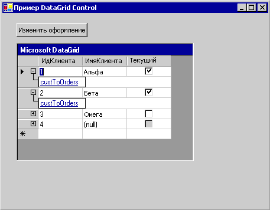

# Общие сведения об элементе управления DataGrid (Windows Forms)
> [!NOTE]
>  <xref:System.Windows.Forms.DataGridView> управления заменяет и расширяет его функциональные возможности <xref:System.Windows.Forms.DataGrid> управления; Однако <xref:System.Windows.Forms.DataGrid> элемент управления можно сохранить для обратной совместимости и использования в будущем, если выбрать. Дополнительные сведения см. в разделе [различия между DataGridView Windows Forms и элементах управления DataGrid](../../../../docs/framework/winforms/controls/differences-between-the-windows-forms-datagridview-and-datagrid-controls.md).  
  
 В Windows Forms <xref:System.Windows.Forms.DataGrid> элемент управления отображает данные в виде последовательности строк и столбцов. В самом простом случае сетка привязана к источнику данных с помощью единственной таблицы, не содержащей связей. В этом случае данные отображаются в виде простых строк и столбцов, как в электронной таблице. Дополнительные сведения о привязке данных к другим элементам управления см. в разделе [привязки данных и Windows Forms](../../../../docs/framework/winforms/data-binding-and-windows-forms.md).  
  
 Если <xref:System.Windows.Forms.DataGrid> привязан к данным с помощью нескольких связанных таблиц и в сетке включена навигация, в каждой строке сетки отображаться расширители. С помощью расширителя пользователь может переходить из родительской таблицы в дочернюю. При щелчке узла отображается дочерняя таблица, а при нажатии кнопки "Назад" — исходная родительская таблица. Таким образом в сетке отображаются иерархические связи между таблицами.  
  
 На следующем снимке экрана показан элемент управления DataGrid, привязанный к данным с помощью нескольких таблиц.  
  
   
Элемент управления DataGrid, привязанный к данным с помощью нескольких таблиц  
  
 <xref:System.Windows.Forms.DataGrid> предоставляет пользовательский интерфейс для набора данных, навигацию между связанными таблицами и широкие возможности форматирования и редактирования.  
  
 Отображение и обработка данных — это разные функции: элемент управления обрабатывает пользовательский интерфейс, тогда как как обновление данных обрабатывается архитектурой привязки данных Windows Forms и поставщиками данных [!INCLUDE[dnprdnshort](../../../../includes/dnprdnshort-md.md)]. Таким образом обеспечивается синхронизация элементов управления, привязанных к одному источнику данных.  
  
> [!NOTE]
>  Если вы знакомы с элементом управления DataGrid в Visual Basic 6.0, вы найдете некоторые существенные различия в Windows Forms <xref:System.Windows.Forms.DataGrid> элемента управления.  
  
 Если сетка привязана к <xref:System.Data.DataSet>, столбцы и строки автоматически созданы, в формате и заполнены. Дополнительные сведения см. в разделе [Data Binding and Windows Forms](../../../../docs/framework/winforms/data-binding-and-windows-forms.md). После создания элемента <xref:System.Windows.Forms.DataGrid> элемента управления, можно добавить, удалить, изменить порядок и форматировать столбцы и строки, в зависимости от потребностей.  
  
## Привязка данных к элементу управления  
 Для <xref:System.Windows.Forms.DataGrid> элемента управления, он должен быть привязан к источнику данных с помощью <xref:System.Windows.Forms.DataGrid.DataSource%2A> и <xref:System.Windows.Forms.DataGrid.DataMember%2A> свойств во время разработки или <xref:System.Windows.Forms.DataGrid.SetDataBinding%2A> метода во время выполнения. Эта привязка указывает <xref:System.Windows.Forms.DataGrid> объекта экземпляр источника данных, таких как <xref:System.Data.DataSet> или <xref:System.Data.DataTable>). <xref:System.Windows.Forms.DataGrid> управления показаны результаты действий, выполняемых с данными. Большинство операций с данными выполняются не через <xref:System.Windows.Forms.DataGrid> , а через источник данных.  
  
 Если данные в привязанном наборе обновляются каким-либо способом <xref:System.Windows.Forms.DataGrid> управления отражает изменения. Если сетка данных и его стили таблиц и столбцов `ReadOnly` свойству `false`, в наборе данных можно обновлять с помощью <xref:System.Windows.Forms.DataGrid> управления.  
  
 Только для одной таблицы могут быть отображены в <xref:System.Windows.Forms.DataGrid> одновременно. Если между таблицами определены отношения родитель потомок, пользователь может перемещаться между связанными таблицами для выбора таблицы, отображаемой в <xref:System.Windows.Forms.DataGrid> элемента управления. Сведения о привязке <xref:System.Windows.Forms.DataGrid> управления [!INCLUDE[vstecado](../../../../includes/vstecado-md.md)] источника данных во время разработки или во время выполнения в разделе [как: привязка к источнику данных элемента управления Windows Forms DataGrid](../../../../docs/framework/winforms/controls/how-to-bind-the-windows-forms-datagrid-control-to-a-data-source.md).  
  
 Источники данных, допустимые для <xref:System.Windows.Forms.DataGrid> включают:  
  
-   <xref:System.Data.DataTable> класса  
  
-   <xref:System.Data.DataView> класса  
  
-   <xref:System.Data.DataSet> класса  
  
-   <xref:System.Data.DataViewManager> класса  
  
 Если источником является набор данных, он может быть объектом в форме или объектом, переданным в форму веб-службой XML. Привязку можно выполнять к типизированным или нетипизированным наборам данных.  
  
 Можно также привязать <xref:System.Windows.Forms.DataGrid> управление дополнительным структурам, если объекты в структуре, например, элементы в массиве, предоставляют открытые свойства. В сетке будут отображаться все открытые свойства элементов в структуре. Например, если выполняется привязка <xref:System.Windows.Forms.DataGrid> объекты элементов управления в массив клиента, все открытые свойства этих объектов отобразятся в сетке. Иногда это означает, что хотя вы можете выполнить привязку к структуре, полученная связанная структура не всегда будет иметь практическое применение. Например, можно выполнить привязку к массиву целых чисел, но поскольку тип данных `Integer` не поддерживает открытое свойство, данные в сетке отображаться не будут.  
  
 Можно выполнить привязку к следующим структурам, если их элементы предоставляют открытые свойства:  
  
-   Любой компонент, реализующий <xref:System.Collections.IList> интерфейса. (сюда входят одномерные массивы);  
  
-   Любой компонент, реализующий <xref:System.ComponentModel.IListSource> интерфейса.  
  
-   Любой компонент, реализующий <xref:System.ComponentModel.IBindingList> интерфейса.  
  
 Дополнительные сведения о возможных источниках данных см. в разделе [данных источников, поддерживаемые Windows Forms](../../../../docs/framework/winforms/data-sources-supported-by-windows-forms.md).  
  
## Отображение сетки  
 Часто <xref:System.Windows.Forms.DataGrid> управления используется для отображения одной таблицы из набора данных. Однако этот элемент управления можно также использовать для отображения нескольких таблиц, включая связанные таблицы. Отображение сетки настраивается автоматически в зависимости от источника данных. В таблице ниже указано, что именно отображается в сетке в разных конфигурациях.  
  
|Содержимое набора данных|Что отображается|  
|--------------------------|-----------------------|  
|Одна таблица|Таблица отображается в сетке.|  
|Несколько таблиц|В сетке может отображаться иерархическое представление, с помощью которого пользователь может переходить к нужной таблице.|  
|Несколько связанных таблиц|В сетке может отображаться иерархическое представление, с помощью которого можно выбирать таблицы. Кроме того, можно задать отображение в сетке родительской таблицы. Записи в родительской таблице позволяют пользователям переходить к связанным строкам дочерних таблиц.|  
  
> [!NOTE]
>  Таблицы в наборе данных связаны с помощью <xref:System.Data.DataRelation>.  См. также [гиперссылка «http://msdn.microsoft.com/library/dbwcse3d (v=vs.110)» отношения в наборах данных](http://msdn.microsoft.com/library/dbwcse3d\(v=vs.110\)) или [отношения в наборах данных](http://msdn.microsoft.com/library/dbwcse3d\(v=vs.120\)).  
  
 Когда <xref:System.Windows.Forms.DataGrid> элемент управления отображает таблицу и <xref:System.Windows.Forms.DataGrid.AllowSorting%2A> свойству `true`, данные можно сортировать, щелкая заголовки столбцов. Пользователь также может добавлять строки и редактировать ячейки.  
  
 Связи между наборами таблиц отображаются для пользователей с помощью структуры навигации "родительская-дочерняя". Родительские таблицы представляют высший уровень данных, а дочерние таблицы — это таблицы данных, производные от отдельных листингов в родительских таблицах. В каждой родительской строке, содержащей дочернюю таблицу, отображаются расширители. При щелчке расширителя создается список гиперссылок на дочерние таблицы. Когда пользователь переходит по ссылке, отображается дочерняя таблица. Нажав кнопку Показать/скрыть значок родительских строк () будет скрывать сведения о родительской таблице или вызывает их повторное отображение, если пользователь скрыл их ранее. Пользователь может нажать кнопку "Назад", чтобы вернуться к предыдущей таблице.  
  
## Столбцы и строки  
 <xref:System.Windows.Forms.DataGrid> состоит из коллекции <xref:System.Windows.Forms.DataGridTableStyle> объектов, содержащихся в <xref:System.Windows.Forms.DataGrid> элемента управления <xref:System.Windows.Forms.DataGrid.TableStyles%2A> свойство. Стиль таблицы может содержать коллекцию <xref:System.Windows.Forms.DataGridColumnStyle> объектов, содержащихся в <xref:System.Windows.Forms.DataGridTableStyle.GridColumnStyles%2A> свойство <xref:System.Windows.Forms.DataGridTableStyle>... Можно изменить <xref:System.Windows.Forms.DataGrid.TableStyles%2A> и <xref:System.Windows.Forms.DataGridTableStyle.GridColumnStyles%2A> свойств с помощью редакторов коллекций, доступных через **свойства** окна.  
  
 Любой <xref:System.Windows.Forms.DataGridTableStyle> связанных с <xref:System.Windows.Forms.DataGrid> управления может осуществляться через <xref:System.Windows.Forms.GridTableStylesCollection>. <xref:System.Windows.Forms.GridTableStylesCollection> можно изменить в конструкторе с <xref:System.Windows.Forms.DataGridTableStyle> редактор коллекции или программным путем с помощью <xref:System.Windows.Forms.DataGrid> элемента управления <xref:System.Windows.Forms.DataGrid.TableStyles%2A> свойство.  
  
   
На рисунке показаны объекты, включенные в элемент управления DataGrid.  
  
 Стили таблиц и столбцов синхронизируются с <xref:System.Data.DataTable> объектов и <xref:System.Data.DataColumn> объектов, задав их `MappingName` соответствующих свойств <xref:System.Data.DataTable.TableName%2A> и <xref:System.Data.DataColumn.ColumnName%2A> свойства. При <xref:System.Windows.Forms.DataGridTableStyle> , не имеет столбца добавляемый стили <xref:System.Windows.Forms.DataGrid> управления, привязанный к допустимому источнику данных и <xref:System.Windows.Forms.DataGridTableStyle.MappingName%2A> этого стиля таблицы задано допустимое <xref:System.Data.DataTable.TableName%2A> свойства, набор <xref:System.Windows.Forms.DataGridColumnStyle> объекты, созданные для этого стиля таблицы. Для каждого <xref:System.Data.DataColumn> в <xref:System.Data.DataTable.Columns%2A> коллекцию <xref:System.Data.DataTable>, соответствующий <xref:System.Windows.Forms.DataGridColumnStyle> добавляется <xref:System.Windows.Forms.GridColumnStylesCollection>. <xref:System.Windows.Forms.GridColumnStylesCollection> осуществляется с помощью <xref:System.Windows.Forms.DataGridTableStyle.GridColumnStyles%2A> свойство <xref:System.Windows.Forms.DataGridTableStyle>. Столбцы можно добавить или удалить из сетки с помощью <xref:System.Windows.Forms.GridColumnStylesCollection.Add%2A> или <xref:System.Windows.Forms.GridColumnStylesCollection.Remove%2A> метод <xref:System.Windows.Forms.GridColumnStylesCollection>. Дополнительные сведения см. в разделе [Практическое руководство: Добавление таблиц и столбцов для элемента управления Windows Forms DataGrid](../../../../docs/framework/winforms/controls/how-to-add-tables-and-columns-to-the-windows-forms-datagrid-control.md) и [как: удаление или скрытие столбцов в элементе управления Windows Forms DataGrid](../../../../docs/framework/winforms/controls/how-to-delete-or-hide-columns-in-the-windows-forms-datagrid-control.md).  
  
 Коллекция типов столбцов расширяет <xref:System.Windows.Forms.DataGridColumnStyle> класса широкие возможности форматирования и редактирования. Все типы столбцов наследуют от <xref:System.Windows.Forms.DataGridColumnStyle> базового класса. Зависит от класса, который создан <xref:System.Data.DataColumn.DataType%2A> свойство <xref:System.Data.DataColumn> из которой <xref:System.Web.UI.WebControls.DataGridColumn> основана. Например <xref:System.Data.DataColumn> с его <xref:System.Data.DataColumn.DataType%2A> свойству <xref:System.Boolean> будет связан с <xref:System.Windows.Forms.DataGridBoolColumn>. В следующей таблице описан каждый из этих типов столбцов.  
  
|Тип столбца|Описание|  
|-----------------|-----------------|  
|<xref:System.Windows.Forms.DataGridTextBoxColumn>|Принимает и отображает данные в виде форматированных или неформатированных строк. Возможности редактирования такие же, как они используются для редактирования данных в простом <xref:System.Windows.Forms.TextBox>. Наследует от <xref:System.Windows.Forms.DataGridColumnStyle>.|  
|<xref:System.Windows.Forms.DataGridBoolColumn>|Принимает и отображает значения `true`, `false` и NULL. Наследует от <xref:System.Windows.Forms.DataGridColumnStyle>.|  
  
 Двойной щелчок правого края столбца изменяет размер столбца для отображения полной подписи и самой широкой записи.  
  
## Стили таблиц и столбцов  
 Сразу после установки формата по умолчанию для <xref:System.Windows.Forms.DataGrid> элемента управления, можно настроить цвета, которые будут использоваться при отображении определенных таблиц в сетке данных.  
  
 Это достигается путем создания экземпляров <xref:System.Windows.Forms.DataGridTableStyle> класса. Стили таблиц определяют форматирование отдельных таблиц, отличное от форматирования по умолчанию <xref:System.Windows.Forms.DataGrid> самого элемента управления. В определенный момент времени каждая таблица может иметь только один заданный для нее стиль.  
  
 В некоторых случаях требуется, чтобы определенный столбец отличался от остальных столбцов таблицы данных. Можно создать настраиваемый набор стилей столбцов с помощью <xref:System.Windows.Forms.DataGridTableStyle.GridColumnStyles%2A> свойство.  
  
 Стили столбцов связаны со столбцами в наборе данных так же, как стили таблиц связаны с таблицами данных. Так же как и таблица может иметь только один стиль на конкретный момент времени, каждому столбцу можно назначить только один стиль в рамках определенного стиля таблицы. Эта связь определяется в столбце <xref:System.Windows.Forms.DataGridColumnStyle.MappingName%2A> свойство.  
  
 Если вы создаете стиль таблицы, не добавляя в него стили столбцов, [!INCLUDE[vsprvs](../../../../includes/vsprvs-md.md)] добавляет стили столбцов по умолчанию при создании формы и сетки во время выполнения. Однако если добавить стили столбцов в созданный стиль таблицы, [!INCLUDE[vsprvs](../../../../includes/vsprvs-md.md)] не будет создавать стили столбцов. Кроме того, необходимо определить стили столбцов и назначить их с помощью имени сопоставления, чтобы нужные столбцы отображались в сетке.  
  
 Поскольку выбор столбцов для отображения в сетке данных выполняется путем назначения им стиля столбца, можно включить в набор данных столбцы данных, которые не отображаются в сетке, не назначая им стиль. При этом, поскольку столбец данных включен в набор данных, можно программным образом редактировать данные, которые не отображаются.  
  
> [!NOTE]
>  Как правило, создание стилей столбцов и добавление их в коллекцию стилей столбцов выполняется перед добавлением стилей таблиц в коллекцию стилей таблиц. При добавлении в коллекцию пустого стиля таблицы стили столбцов создаются автоматически. Следовательно, будет создано исключение при попытке добавить новые стили столбцов с повторяющимися <xref:System.Windows.Forms.DataGridColumnStyle.MappingName%2A> значения в коллекцию стилей столбцов.  
>   
>  Иногда может потребоваться изменить один столбец из нескольких (например, набор данных содержит 50 столбцов, а вам нужны только 49 из них). В этом случае проще импортировать все 50 столбцов и программно удалить один, а не добавлять все 49 столбцов по отдельности.  
  
## Форматирование  
 Форматирование, которое может применяться к <xref:System.Windows.Forms.DataGrid> управления включает стили границ, стили сетки, шрифты, свойства заголовка, выравнивание данных и чередующиеся фоновые цвета для строк. Дополнительные сведения см. в разделе [как: форматирование элемента управления Windows Forms DataGrid](../../../../docs/framework/winforms/controls/how-to-format-the-windows-forms-datagrid-control.md).  
  
## События  
 Помимо общих событий управления, таких как <xref:System.Windows.Forms.Control.MouseDown>, <xref:System.Windows.Forms.Control.Enter>, и <xref:System.Windows.Forms.DataGrid.Scroll>, <xref:System.Windows.Forms.DataGrid> управления поддерживает события, связанные с редактированием и навигацией в сетке. <xref:System.Windows.Forms.DataGrid.CurrentCell%2A> свойство определяет, какая ячейка выбрана. <xref:System.Windows.Forms.DataGrid.CurrentCellChanged> событие возникает, когда пользователь переходит к новой ячейке. При переходе к новой таблице через родительские и дочерние отношения, <xref:System.Windows.Forms.DataGrid.Navigate> события. <xref:System.Windows.Forms.DataGrid.BackButtonClick> событие возникает, когда пользователь нажимает кнопку "Назад" при просмотре дочерней таблицы и <xref:System.Windows.Forms.DataGrid.ShowParentDetailsButtonClick> событие возникает при щелчке Показать/скрыть значок родительских строк.  
  
## См. также  
 [Элемент управления DataGrid](../../../../docs/framework/winforms/controls/datagrid-control-windows-forms.md)   
 [Практическое руководство: привязка к источнику данных элемента управления Windows Forms DataGrid](../../../../docs/framework/winforms/controls/how-to-bind-the-windows-forms-datagrid-control-to-a-data-source.md)   
 [Практическое руководство: Добавление таблиц и столбцов в Windows Forms DataGrid-элемент управления](../../../../docs/framework/winforms/controls/how-to-add-tables-and-columns-to-the-windows-forms-datagrid-control.md)   
 [Практическое руководство: удаление или скрытие столбцов в Windows Forms DataGrid-элемент управления](../../../../docs/framework/winforms/controls/how-to-delete-or-hide-columns-in-the-windows-forms-datagrid-control.md)   
 [Практическое руководство: форматирование элемента управления Windows Forms DataGrid](../../../../docs/framework/winforms/controls/how-to-format-the-windows-forms-datagrid-control.md)