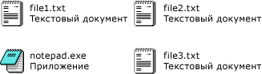

# <a name="how-to-enable-tile-view-in-a-windows-forms-listview-control"></a><span data-ttu-id="0091e-102">Практическое руководство. Отображение содержимого элемента управления ListView в Windows Forms в виде мозаичного представления</span><span class="sxs-lookup"><span data-stu-id="0091e-102">How to: Enable Tile View in a Windows Forms ListView Control</span></span>
<span data-ttu-id="0091e-103">Функция мозаичного представления элемента управления <xref:System.Windows.Forms.ListView> обеспечивает визуальный баланс между графическими и текстовыми представлениями информации.</span><span class="sxs-lookup"><span data-stu-id="0091e-103">With the tile view feature of the <xref:System.Windows.Forms.ListView> control, you can provide a visual balance between graphical and textual information.</span></span> <span data-ttu-id="0091e-104">Текстовые данные, отображаемые для мозаичного представления элемента совпадают с данными о столбцах, определенных для подробного представления.</span><span class="sxs-lookup"><span data-stu-id="0091e-104">The textual information displayed for an item in tile view is the same as the column information defined for details view.</span></span> <span data-ttu-id="0091e-105">Мозаичное представление работает в сочетании с возможностями группирования или вставки метки элемента управления <xref:System.Windows.Forms.ListView>.</span><span class="sxs-lookup"><span data-stu-id="0091e-105">Tile view works in combination with either the grouping or insertion mark features in the <xref:System.Windows.Forms.ListView> control.</span></span>  
  
 <span data-ttu-id="0091e-106">Мозаичное представление использует значок размером 32 x 32 пикселя и несколько строк текста, как показано на следующих рисунках.</span><span class="sxs-lookup"><span data-stu-id="0091e-106">The tile view uses a 32 x 32 pixel icon and several lines of text, as shown in the following images.</span></span>  
  
 <span data-ttu-id="0091e-107"></span><span class="sxs-lookup"><span data-stu-id="0091e-107"></span></span>  
<span data-ttu-id="0091e-108">Значки и текст мозаичного представления</span><span class="sxs-lookup"><span data-stu-id="0091e-108">Tile view icons and text</span></span>  
  
 <span data-ttu-id="0091e-109">Чтобы включить мозаичное представление, присвойте свойству <xref:System.Windows.Forms.ListView.View%2A> значение <xref:System.Windows.Forms.View.Tile>.</span><span class="sxs-lookup"><span data-stu-id="0091e-109">To enable tile view, set the <xref:System.Windows.Forms.ListView.View%2A> property to <xref:System.Windows.Forms.View.Tile>.</span></span> <span data-ttu-id="0091e-110">Размер элементов мозаики можно настроить, задав свойство <xref:System.Windows.Forms.ListView.TileSize%2A> и количество отображаемых строк текста в плитке путем настройки коллекции <xref:System.Windows.Forms.ListView.Columns%2A>.</span><span class="sxs-lookup"><span data-stu-id="0091e-110">You can adjust the size of the tiles by setting the <xref:System.Windows.Forms.ListView.TileSize%2A> property, and the number of text lines displayed in the tile by adjusting the <xref:System.Windows.Forms.ListView.Columns%2A> collection.</span></span>  
  
> [!NOTE]
>  <span data-ttu-id="0091e-111">Функция мозаичного представления доступна только в [!INCLUDE[WinXpFamily](../../../../includes/winxpfamily-md.md)], когда приложение вызывает метод <xref:System.Windows.Forms.Application.EnableVisualStyles%2A?displayProperty=nameWithType>.</span><span class="sxs-lookup"><span data-stu-id="0091e-111">The tile view is available only on [!INCLUDE[WinXpFamily](../../../../includes/winxpfamily-md.md)] when your application calls the <xref:System.Windows.Forms.Application.EnableVisualStyles%2A?displayProperty=nameWithType> method.</span></span> <span data-ttu-id="0091e-112">В предыдущих версиях операционных систем код, связанный с мозаичным представлением, не оказывает никакого влияния, элемент управления <xref:System.Windows.Forms.ListView> отображается в представлении крупных значков.</span><span class="sxs-lookup"><span data-stu-id="0091e-112">On earlier operating systems, any code related to the tile view has no effect, and the <xref:System.Windows.Forms.ListView> control displays in the large icon view.</span></span> <span data-ttu-id="0091e-113">Для получения дополнительной информации см. <xref:System.Windows.Forms.ListView.View%2A?displayProperty=nameWithType>.</span><span class="sxs-lookup"><span data-stu-id="0091e-113">For more information, see <xref:System.Windows.Forms.ListView.View%2A?displayProperty=nameWithType>.</span></span>  
  
### <a name="to-set-tile-view-programmatically"></a><span data-ttu-id="0091e-114">Выбор мозаичного представления программными средствами</span><span class="sxs-lookup"><span data-stu-id="0091e-114">To set tile view programmatically</span></span>  
  
1.  <span data-ttu-id="0091e-115">Используйте перечисление <xref:System.Windows.Forms.View> элемента управления <xref:System.Windows.Forms.ListView>.</span><span class="sxs-lookup"><span data-stu-id="0091e-115">Use the <xref:System.Windows.Forms.View> enumeration of the <xref:System.Windows.Forms.ListView> control.</span></span>  
  
    ```vb  
    ListView1.View = View.Tile  
    ```  
  
    ```csharp  
    listView1.View = View.Tile;  
    ```  
  
## <a name="example"></a><span data-ttu-id="0091e-116">Пример</span><span class="sxs-lookup"><span data-stu-id="0091e-116">Example</span></span>  
 <span data-ttu-id="0091e-117">В завершенном примере кода ниже показано мозаичное представление с плиткой, в которой отображаются три строки текста.</span><span class="sxs-lookup"><span data-stu-id="0091e-117">The following complete code example demonstrates Tile view with tiles modified to show three lines of text.</span></span> <span data-ttu-id="0091e-118">Размер мозаики был подобран для предотвращения переноса строк.</span><span class="sxs-lookup"><span data-stu-id="0091e-118">The tile size has been adjusted to prevent line-wrapping.</span></span>  
  
 [!code-cpp[System.Windows.Forms.ListView.Tiling#1](../../../../samples/snippets/cpp/VS_Snippets_Winforms/System.Windows.Forms.ListView.Tiling/CPP/listviewtilingexample.cpp#1)]
 [!code-csharp[System.Windows.Forms.ListView.Tiling#1](../../../../samples/snippets/csharp/VS_Snippets_Winforms/System.Windows.Forms.ListView.Tiling/CS/listviewtilingexample.cs#1)]
 [!code-vb[System.Windows.Forms.ListView.Tiling#1](../../../../samples/snippets/visualbasic/VS_Snippets_Winforms/System.Windows.Forms.ListView.Tiling/VB/listviewtilingexample.vb#1)]  
  
## <a name="compiling-the-code"></a><span data-ttu-id="0091e-119">Компиляция кода</span><span class="sxs-lookup"><span data-stu-id="0091e-119">Compiling the Code</span></span>  
 <span data-ttu-id="0091e-120">Для этого примера требуются:</span><span class="sxs-lookup"><span data-stu-id="0091e-120">This example requires:</span></span>  
  
-   <span data-ttu-id="0091e-121">ссылки на сборки System и System.Windows.Forms.</span><span class="sxs-lookup"><span data-stu-id="0091e-121">References to the System and System.Windows.Forms assemblies.</span></span>  
  
-   <span data-ttu-id="0091e-122">файл значка с именем book.ico в том же каталоге, что и исполняемый файл.</span><span class="sxs-lookup"><span data-stu-id="0091e-122">An icon file named book.ico in the same directory as the executable file.</span></span>  
  
 <span data-ttu-id="0091e-123">Информацию о выполнении сборки этого примера из командной строки для [!INCLUDE[vbprvb](../../../../includes/vbprvb-md.md)] или [!INCLUDE[csprcs](../../../../includes/csprcs-md.md)] можно найти в разделе [Построение из командной строки](~/docs/visual-basic/reference/command-line-compiler/building-from-the-command-line.md) или [Построение из командной строки с помощью файла csc.exe](~/docs/csharp/language-reference/compiler-options/command-line-building-with-csc-exe.md).</span><span class="sxs-lookup"><span data-stu-id="0091e-123">For information about building this example from the command line for [!INCLUDE[vbprvb](../../../../includes/vbprvb-md.md)] or [!INCLUDE[csprcs](../../../../includes/csprcs-md.md)], see [Building from the Command Line](~/docs/visual-basic/reference/command-line-compiler/building-from-the-command-line.md) or [Command-line Building With csc.exe](~/docs/csharp/language-reference/compiler-options/command-line-building-with-csc-exe.md).</span></span> <span data-ttu-id="0091e-124">Чтобы выполнить сборку этого примера в [!INCLUDE[vsprvs](../../../../includes/vsprvs-md.md)], можно также вставить код в новый проект.</span><span class="sxs-lookup"><span data-stu-id="0091e-124">You can also build this example in [!INCLUDE[vsprvs](../../../../includes/vsprvs-md.md)] by pasting the code into a new project.</span></span>  <span data-ttu-id="0091e-125">См. также [Практическое руководство. Компиляция и выполнение откомпилированного примера кода формы Windows Forms с помощью Visual Studio](http://msdn.microsoft.com/library/Bb129228\(v=vs.110\)).</span><span class="sxs-lookup"><span data-stu-id="0091e-125">Also see [How to: Compile and Run a Complete Windows Forms Code Example Using Visual Studio](http://msdn.microsoft.com/library/Bb129228\(v=vs.110\)).</span></span>  
  
## <a name="see-also"></a><span data-ttu-id="0091e-126">См. также</span><span class="sxs-lookup"><span data-stu-id="0091e-126">See Also</span></span>  
 <xref:System.Windows.Forms.ListView>  
 <xref:System.Windows.Forms.ListView.TileSize%2A>  
 [<span data-ttu-id="0091e-127">Элемент управления ListView</span><span class="sxs-lookup"><span data-stu-id="0091e-127">ListView Control</span></span>](../../../../docs/framework/winforms/controls/listview-control-windows-forms.md)  
 [<span data-ttu-id="0091e-128">Общие сведения об элементе управления ListView</span><span class="sxs-lookup"><span data-stu-id="0091e-128">ListView Control Overview</span></span>](../../../../docs/framework/winforms/controls/listview-control-overview-windows-forms.md)  
 [<span data-ttu-id="0091e-129">Возможности Windows XP и элементы управления Windows Forms</span><span class="sxs-lookup"><span data-stu-id="0091e-129">Windows XP Features and Windows Forms Controls</span></span>](http://msdn.microsoft.com/library/bc7fab94-fce9-4bf1-a8ad-a5837c91c3c0)
