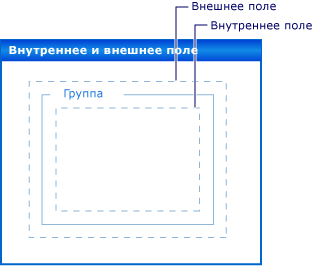

# Пошаговое руководство. размещение элементов управления с заполнением, полями и свойством AutoSizeWalkthrough: Lay out controls with padding, margins, and the AutoSize property

Точное расположение элементов управления на форме является важным для многих приложений.Precise placement of controls on your form is a high priority for many applications. **Конструктор Windows Forms** в Visual Studio предоставляет множество инструментов макета для решения этой задачи.The **Windows Forms Designer** in Visual Studio gives you many layout tools to accomplish this. Три из наиболее важных: свойства <xref:System.Windows.Forms.Control.Margin%2A>, <xref:System.Windows.Forms.Control.Padding%2A>и <xref:System.Windows.Forms.Control.AutoSize%2A>, которые имеются во всех элементах управления Windows Forms.Three of the most important are the <xref:System.Windows.Forms.Control.Margin%2A>, <xref:System.Windows.Forms.Control.Padding%2A>, and <xref:System.Windows.Forms.Control.AutoSize%2A> properties, which are present on all Windows Forms controls.

Свойство <xref:System.Windows.Forms.Control.Margin%2A> определяет поле вокруг элемента управления, благодаря которому обеспечивается определенное расстояние между границами этого элемента и другими элементами.The <xref:System.Windows.Forms.Control.Margin%2A> property defines the space around the control that keeps other controls a specified distance from the control's borders.

Свойство <xref:System.Windows.Forms.Control.Padding%2A> определяет поле внутри элемента управления, благодаря которому обеспечивается определенное расстояние между содержимым элемента управления (например, значением свойства <xref:System.Windows.Forms.Control.Text%2A>) и его границами.The <xref:System.Windows.Forms.Control.Padding%2A> property defines the space in the interior of a control that keeps the control's content (for example, the value of its <xref:System.Windows.Forms.Control.Text%2A> property) a specified distance from the control's borders.

На рисунке ниже демонстрируется значение свойств <xref:System.Windows.Forms.Control.Padding%2A> и <xref:System.Windows.Forms.Control.Margin%2A> элемента управления.The following illustration shows the <xref:System.Windows.Forms.Control.Padding%2A> and <xref:System.Windows.Forms.Control.Margin%2A> properties on a control.

Свойство <xref:System.Windows.Forms.Control.AutoSize%2A> указывает элементу управления на автоматическое изменение размера в соответствии с его содержимым.The <xref:System.Windows.Forms.Control.AutoSize%2A> property tells a control to automatically size itself to its contents. Размер не будет меньше, чем значение исходного свойства <xref:System.Windows.Forms.Control.Size%2A>, и оно будет учитывать значение его свойства <xref:System.Windows.Forms.Control.Padding%2A>.It will not resize itself to be smaller than the value of its original <xref:System.Windows.Forms.Control.Size%2A> property, and it will account for the value of its <xref:System.Windows.Forms.Control.Padding%2A> property.

## PrerequisitesPrerequisites

Для выполнения этого пошагового руководства потребуется Visual Studio.You'll need Visual Studio to complete this walkthrough.

## Создание проектаCreate the project

1. В Visual Studio создайте проект **приложения Windows** с именем `LayoutExample`.In Visual Studio, create a **Windows Application** project called `LayoutExample`.

2. Выберите форму в **конструктор Windows Forms**.Select the form in the **Windows Forms Designer**.

## Установка полей для элементов управленияSet margins for controls

Расстояние по умолчанию между элементами управления можно задать с помощью свойства <xref:System.Windows.Forms.Control.Margin%2A>.You can set the default distance between your controls using the <xref:System.Windows.Forms.Control.Margin%2A> property. При перемещении элемента управления, достаточно близкого к другому элементу управления, вы увидите линию привязки, показывающую поля для этих двух элементов управления.When you move a control close enough to another control, you will see a snapline that shows the margins for the two controls. Перемещаемый элемент управления также будет привязан к расстоянию, заданному полями.The control you are moving will also snap to the distance defined by the margins.

### Размещение элементов управления в форме с помощью свойства MarginArrange controls on your form using the Margin property

1. Перетащите два элемента управления <xref:System.Windows.Forms.Button> из **панели элементов** в форму.Drag two <xref:System.Windows.Forms.Button> controls from the **Toolbox** onto your form.

2. Выберите один из элементов управления <xref:System.Windows.Forms.Button> и переместите его ближе к другому, пока они не будут почти соприкасаются.Select one of the <xref:System.Windows.Forms.Button> controls and move it close to the other, until they are almost touching.

   Обратите внимание на линию привязки, которая появляется между ними.Observe the snapline that appears between them. Это расстояние является суммой значений двух элементов управления <xref:System.Windows.Forms.Control.Margin%2A>.This distance is the sum of the two controls' <xref:System.Windows.Forms.Control.Margin%2A> values. Перемещаемый элемент управления привязывается к этому расстоянию.The control you are moving snaps to this distance. Дополнительные сведения см. [в разделе Пошаговое руководство. Упорядочивание элементов управления в Windows Forms с помощью линий привязки](walkthrough-arranging-controls-on-windows-forms-using-snaplines.md).For details, see [Walkthrough: Arranging Controls on Windows Forms Using Snaplines](walkthrough-arranging-controls-on-windows-forms-using-snaplines.md).

3. Измените свойство <xref:System.Windows.Forms.Control.Margin%2A> одного из элементов управления, развернув запись <xref:System.Windows.Forms.Control.Margin%2A> в окне **Свойства** и установив для свойства <xref:System.Windows.Forms.Padding.All%2A> значение **20**.Change the <xref:System.Windows.Forms.Control.Margin%2A> property of one of the controls by expanding the <xref:System.Windows.Forms.Control.Margin%2A> entry in the **Properties** window and setting the <xref:System.Windows.Forms.Padding.All%2A> property to **20**.

4. Выберите один из элементов управления <xref:System.Windows.Forms.Button> и переместите его ближе к другому.Select one of the <xref:System.Windows.Forms.Button> controls and move it close to the other.

   Линия привязки, определяющая сумму значений полей, больше, и элемент управления привязывается к большему расстоянию от другого элемента управления.The snapline defining the sum of the margin values is longer and that the control snaps to a greater distance from the other control.

5. Измените свойство <xref:System.Windows.Forms.Control.Margin%2A> выбранного элемента управления, развернув запись <xref:System.Windows.Forms.Control.Margin%2A> в окне **Свойства** и установив для свойства <xref:System.Windows.Forms.Padding.Top%2A> значение **5**.Change the <xref:System.Windows.Forms.Control.Margin%2A> property of the selected control by expanding the <xref:System.Windows.Forms.Control.Margin%2A> entry in the **Properties** window and setting the <xref:System.Windows.Forms.Padding.Top%2A> property to **5**.

6. Переместите выбранный элемент управления под другим элементом управления и обратите внимание, что линия привязки короче.Move the selected control below the other control and observe that the snapline is shorter. Переместите выбранный элемент управления влево от другого элемента управления и обратите внимание, что линия привязки содержит значение, наблюдаемое на шаге 4.Move the selected control to the left of the other control and observe that the snapline retains the value observed in step 4.

7. Можно задать для каждого из аспектов свойства <xref:System.Windows.Forms.Control.Margin%2A>, <xref:System.Windows.Forms.Padding.Left%2A>, <xref:System.Windows.Forms.Padding.Top%2A>, <xref:System.Windows.Forms.Padding.Right%2A>, <xref:System.Windows.Forms.Padding.Bottom%2A>, различные значения, или же можно задать для них одно и то же значение с помощью свойства <xref:System.Windows.Forms.Padding.All%2A>.You can set each of the aspects of the <xref:System.Windows.Forms.Control.Margin%2A> property, <xref:System.Windows.Forms.Padding.Left%2A>, <xref:System.Windows.Forms.Padding.Top%2A>, <xref:System.Windows.Forms.Padding.Right%2A>, <xref:System.Windows.Forms.Padding.Bottom%2A>, to different values, or you can set them all to the same value with the <xref:System.Windows.Forms.Padding.All%2A> property.

## Задание заполнения для элементов управленияSet padding for controls

Чтобы обеспечить точный макет, необходимый для вашего приложения, элементы управления часто будут содержать дочерние элементы управления.To achieve the precise layout required for your application, your controls will often contain child controls. Если необходимо указать границу границы дочернего элемента управления для границы родительского элемента управления, используйте свойство <xref:System.Windows.Forms.Control.Padding%2A> родительского элемента в сочетании со свойством <xref:System.Windows.Forms.Control.Margin%2A> дочернего элемента управления.When you want to specify the proximity of the child control's border to the parent control's border, use the parent control's <xref:System.Windows.Forms.Control.Padding%2A> property in conjunction with the child control's <xref:System.Windows.Forms.Control.Margin%2A> property. Свойство <xref:System.Windows.Forms.Control.Padding%2A> также используется для управления сходством содержимого элемента управления (например, свойства <xref:System.Windows.Forms.Control.Text%2A> <xref:System.Windows.Forms.Button> элемента управления) с его границами.The <xref:System.Windows.Forms.Control.Padding%2A> property is also used to control the proximity of a control's content (for example, a <xref:System.Windows.Forms.Button> control's <xref:System.Windows.Forms.Control.Text%2A> property) to its borders.

### Размещение элементов управления в форме с помощью заполненияArrange controls on your form using padding

1. Перетащите элемент управления <xref:System.Windows.Forms.Button> из **панели элементов** в свою форму.Drag a <xref:System.Windows.Forms.Button> control from the **Toolbox** onto your form.

2. Измените значение свойства <xref:System.Windows.Forms.Control.AutoSize%2A> элемента управления <xref:System.Windows.Forms.Button> на **true**.Change the value of the <xref:System.Windows.Forms.Button> control's <xref:System.Windows.Forms.Control.AutoSize%2A> property to **true**.

3. Измените свойство <xref:System.Windows.Forms.Control.Padding%2A>, развернув запись <xref:System.Windows.Forms.Control.Padding%2A> в окне **Свойства** и установив для свойства <xref:System.Windows.Forms.Padding.All%2A> значение **5**.Change the <xref:System.Windows.Forms.Control.Padding%2A> property by expanding the <xref:System.Windows.Forms.Control.Padding%2A> entry in the **Properties** window and setting the <xref:System.Windows.Forms.Padding.All%2A> property to **5**.

   Элемент управления расширяется, чтобы предоставить место для нового заполнения.The control expands to provide room for the new padding.

4. Перетащите элемент управления <xref:System.Windows.Forms.GroupBox> из **панели элементов** в свою форму.Drag a <xref:System.Windows.Forms.GroupBox> control from the **Toolbox** onto your form. Перетащите элемент управления <xref:System.Windows.Forms.Button> из **панели элементов** в элемент управления <xref:System.Windows.Forms.GroupBox>.Drag a <xref:System.Windows.Forms.Button> control from the **Toolbox** into the <xref:System.Windows.Forms.GroupBox> control. Поместите элемент управления <xref:System.Windows.Forms.Button>, чтобы он был сброшен в правый нижний угол элемента управления <xref:System.Windows.Forms.GroupBox>.Position the <xref:System.Windows.Forms.Button> control so it is flush with the lower-right corner of the <xref:System.Windows.Forms.GroupBox> control.

   Обратите внимание на линии привязки, которые отображаются, так как элемент управления <xref:System.Windows.Forms.Button> приближает нижнюю и правую границы элемента управления <xref:System.Windows.Forms.GroupBox>.Observe the snaplines that appear as the <xref:System.Windows.Forms.Button> control approaches the bottom and right borders of the <xref:System.Windows.Forms.GroupBox> control. Эти линии привязки соответствуют свойству <xref:System.Windows.Forms.Control.Margin%2A> <xref:System.Windows.Forms.Button>.These snaplines correspond to the <xref:System.Windows.Forms.Control.Margin%2A> property of the <xref:System.Windows.Forms.Button>.

5. Измените свойство <xref:System.Windows.Forms.Control.Padding%2A> элемента управления <xref:System.Windows.Forms.GroupBox>, развернув запись <xref:System.Windows.Forms.Control.Padding%2A> в окне **Свойства** и установив для свойства <xref:System.Windows.Forms.Padding.All%2A> значение **20**.Change the <xref:System.Windows.Forms.GroupBox> control's <xref:System.Windows.Forms.Control.Padding%2A> property by expanding the <xref:System.Windows.Forms.Control.Padding%2A> entry in the **Properties** window and setting the <xref:System.Windows.Forms.Padding.All%2A> property to **20**.

6. Выберите элемент управления <xref:System.Windows.Forms.Button> в элементе управления <xref:System.Windows.Forms.GroupBox> и переместите его в центр <xref:System.Windows.Forms.GroupBox>.Select the <xref:System.Windows.Forms.Button> control within the <xref:System.Windows.Forms.GroupBox> control and move it toward the center of the <xref:System.Windows.Forms.GroupBox>.

   Линии привязки отображаются на большее расстояние от границ элемента управления <xref:System.Windows.Forms.GroupBox>.The snaplines appear at a greater distance from the borders of the <xref:System.Windows.Forms.GroupBox> control. Это расстояние является суммой свойства <xref:System.Windows.Forms.Control.Margin%2A> элемента управления <xref:System.Windows.Forms.Button> и свойства <xref:System.Windows.Forms.Control.Padding%2A> элемента управления <xref:System.Windows.Forms.GroupBox>.This distance is the sum of the <xref:System.Windows.Forms.Button> control's <xref:System.Windows.Forms.Control.Margin%2A> property and the <xref:System.Windows.Forms.GroupBox> control's <xref:System.Windows.Forms.Control.Padding%2A> property.

## Автоматическое изменение размера элементов управленияSize controls automatically

В некоторых приложениях размер элемента управления не будет одинаковым во время выполнения, так как он находился во время разработки.In some applications, the size of a control will not be the same at run time as it was at design time. Текст элемента управления <xref:System.Windows.Forms.Button>, например, может быть взят из базы данных и его длина не известна заранее.The text of a <xref:System.Windows.Forms.Button> control, for example, may be taken from a database, and its length are not known in advance.

Если свойство <xref:System.Windows.Forms.Control.AutoSize%2A> имеет значение `true`, размер элемента управления будет таким же, как и его содержимое.When the <xref:System.Windows.Forms.Control.AutoSize%2A> property is set to `true`, the control will size itself to its content. Дополнительные сведения см. в разделе [Общие сведения о свойстве AutoSize](autosize-property-overview.md).For more information, see [AutoSize Property Overview](autosize-property-overview.md).

### Размещение элементов управления в форме с помощью свойства AutoSizeArrange controls on your form using the AutoSize property

1. Перетащите элемент управления <xref:System.Windows.Forms.Button> из **панели элементов** в свою форму.Drag a <xref:System.Windows.Forms.Button> control from the **Toolbox** onto your form.

2. Измените значение свойства <xref:System.Windows.Forms.Control.AutoSize%2A> элемента управления <xref:System.Windows.Forms.Button> на **true**.Change the value of the <xref:System.Windows.Forms.Button> control's <xref:System.Windows.Forms.Control.AutoSize%2A> property to **true**.

3. Измените свойство <xref:System.Windows.Forms.Control.Text%2A> элемента управления <xref:System.Windows.Forms.Button> на эту кнопку, чтобы оно **было длинной строкой для свойства Text**.Change the <xref:System.Windows.Forms.Button> control's <xref:System.Windows.Forms.Control.Text%2A> property to **This button has a long string for its Text property**.

   При фиксации изменения размер элемента управления <xref:System.Windows.Forms.Button> изменяется в соответствии с новым текстом.When you commit the change, the <xref:System.Windows.Forms.Button> control resizes itself to fit the new text.

4. Перетащите еще один элемент управления <xref:System.Windows.Forms.Button> из **панели элементов** в форму.Drag another <xref:System.Windows.Forms.Button> control from the **Toolbox** onto your form.

5. Измените свойство <xref:System.Windows.Forms.Control.Text%2A> элемента управления <xref:System.Windows.Forms.Button> на "**Эта кнопка содержит длинную строку для своего свойства текста".**Change the <xref:System.Windows.Forms.Button> control's <xref:System.Windows.Forms.Control.Text%2A> property to "**This button has a long string for its Text property.**"

   При фиксации изменения размер элемента управления <xref:System.Windows.Forms.Button> не изменяется, а текст обрезается по правому краю элемента управления.When you commit the change, the <xref:System.Windows.Forms.Button> control does not resize itself, and the text is clipped by the right edge of the control.

6. Измените свойство <xref:System.Windows.Forms.Control.Padding%2A>, развернув запись <xref:System.Windows.Forms.Control.Padding%2A> в окне **Свойства** и установив для свойства <xref:System.Windows.Forms.Padding.All%2A> значение **5**.Change the <xref:System.Windows.Forms.Control.Padding%2A> property by expanding the <xref:System.Windows.Forms.Control.Padding%2A> entry in the **Properties** window and setting the <xref:System.Windows.Forms.Padding.All%2A> property to **5**.

   Текст во внутренней части элемента управления обрезается по всем четырем сторонам.The text in the control's interior is clipped on all four sides.

7. Измените свойство <xref:System.Windows.Forms.Control.AutoSize%2A> элемента управления <xref:System.Windows.Forms.Button> на **true**.Change the <xref:System.Windows.Forms.Button> control's <xref:System.Windows.Forms.Control.AutoSize%2A> property to **true**.

   Элемент управления <xref:System.Windows.Forms.Button> изменяет свой размер, чтобы охватывать всю строку.The <xref:System.Windows.Forms.Button> control resizes itself to encompass the entire string. Кроме того, вокруг текста добавляется заполнение, в результате чего элемент управления <xref:System.Windows.Forms.Button> разворачивается во всех четырех направлениях.Also, padding has been added around the text, causing the <xref:System.Windows.Forms.Button> control to expand in all four directions.

8. Перетащите элемент управления <xref:System.Windows.Forms.Button> из **панели элементов** в свою форму.Drag a <xref:System.Windows.Forms.Button> control from the **Toolbox** onto your form. Поместите его в правый нижний угол формы.Position it near the lower-right corner of the form.

9. Измените значение свойства <xref:System.Windows.Forms.Control.AutoSize%2A> элемента управления <xref:System.Windows.Forms.Button> на **true**.Change the value of the <xref:System.Windows.Forms.Button> control's <xref:System.Windows.Forms.Control.AutoSize%2A> property to **true**.

10. Задайте для свойства <xref:System.Windows.Forms.Control.Anchor%2A> элемента управления <xref:System.Windows.Forms.Button> значение <xref:System.Windows.Forms.AnchorStyles.Right>, <xref:System.Windows.Forms.AnchorStyles.Bottom>.Set the <xref:System.Windows.Forms.Button> control's <xref:System.Windows.Forms.Control.Anchor%2A> property to <xref:System.Windows.Forms.AnchorStyles.Right>, <xref:System.Windows.Forms.AnchorStyles.Bottom>.

11. Измените свойство <xref:System.Windows.Forms.Control.Text%2A> элемента управления <xref:System.Windows.Forms.Button> на "**Эта кнопка содержит длинную строку для своего свойства текста".**Change the <xref:System.Windows.Forms.Button> control's <xref:System.Windows.Forms.Control.Text%2A> property to "**This button has a long string for its Text property.**"

   При фиксации изменения размер элемента управления <xref:System.Windows.Forms.Button> изменяется в направлении влево.When you commit the change, the <xref:System.Windows.Forms.Button> control resizes itself toward the left. Как правило, автоматическое изменение размера приведет к увеличению размера элемента управления в направлении, противоположном значению свойства <xref:System.Windows.Forms.Control.Anchor%2A>.In general, automatic sizing will increase the size of a control in the direction opposite its <xref:System.Windows.Forms.Control.Anchor%2A> property setting.

## Свойства AutoSize и AutoSizeModeAutoSize and AutoSizeMode properties

 Некоторые элементы управления поддерживают свойство `AutoSizeMode`, которое обеспечивает более детализированный контроль над автоматическим изменением размеров элемента управления.Some controls support the `AutoSizeMode` property, which gives you more fine-grained control over the automatic sizing behavior of a control.

### Использование свойства AutoSizeModeUse the AutoSizeMode property

1. Перетащите элемент управления <xref:System.Windows.Forms.Panel> из **панели элементов** в свою форму.Drag a <xref:System.Windows.Forms.Panel> control from the **Toolbox** onto your form.

2. Присвойте свойству <xref:System.Windows.Forms.Control.AutoSize%2A> <xref:System.Windows.Forms.Panel> элемента управления значение **true**.Set the value of the <xref:System.Windows.Forms.Panel> control's <xref:System.Windows.Forms.Control.AutoSize%2A> property to **true**.

3. Перетащите элемент управления <xref:System.Windows.Forms.Button> из **панели элементов** в элемент управления <xref:System.Windows.Forms.Panel>.Drag a <xref:System.Windows.Forms.Button> control from the **Toolbox** into the <xref:System.Windows.Forms.Panel> control.

4. Поместите элемент управления <xref:System.Windows.Forms.Button> в правый нижний угол элемента управления <xref:System.Windows.Forms.Panel>.Place the <xref:System.Windows.Forms.Button> control near the lower-right corner of the <xref:System.Windows.Forms.Panel> control.

5. Выберите элемент управления <xref:System.Windows.Forms.Panel> и захватите правый нижний маркер изменения размера.Select the <xref:System.Windows.Forms.Panel> control and grab the lower-right sizing handle. Измените размер элемента управления <xref:System.Windows.Forms.Panel>, чтобы он был больше и меньше.Resize the <xref:System.Windows.Forms.Panel> control to be larger and smaller.

   > [!NOTE]
   > Можно свободно изменить размер элемента управления <xref:System.Windows.Forms.Panel>, но его размер меньше, чем расположение нижнего правого угла элемента управления <xref:System.Windows.Forms.Button>.You can freely resize the <xref:System.Windows.Forms.Panel> control, but you cannot size it smaller than the position of the <xref:System.Windows.Forms.Button> control's lower-right corner. Это поведение задается значением по умолчанию свойства `AutoSizeMode`, которое <xref:System.Windows.Forms.AutoSizeMode.GrowOnly>.This behavior is specified by the default value of the `AutoSizeMode` property, which is <xref:System.Windows.Forms.AutoSizeMode.GrowOnly>.

6. Установите для свойства `AutoSizeMode` элемента управления <xref:System.Windows.Forms.Panel> значение <xref:System.Windows.Forms.AutoSizeMode.GrowAndShrink>.Set the value of the <xref:System.Windows.Forms.Panel> control's `AutoSizeMode` property to <xref:System.Windows.Forms.AutoSizeMode.GrowAndShrink>.

   Размеры элемента управления <xref:System.Windows.Forms.Panel>, чтобы заключить <xref:System.Windows.Forms.Button> элемент управления.The <xref:System.Windows.Forms.Panel> control sizes itself to surround the <xref:System.Windows.Forms.Button> control. Изменить размер элемента управления <xref:System.Windows.Forms.Panel> нельзя.You cannot resize the <xref:System.Windows.Forms.Panel> control.

7. Перетащите элемент управления <xref:System.Windows.Forms.Button> в левый верхний угол элемента управления <xref:System.Windows.Forms.Panel>.Drag the <xref:System.Windows.Forms.Button> control toward the upper-left corner of the <xref:System.Windows.Forms.Panel> control.

   <xref:System.Windows.Forms.Panel> элемент управления изменяется на новое расположение элемента управления <xref:System.Windows.Forms.Button>.The <xref:System.Windows.Forms.Panel> control resizes to the <xref:System.Windows.Forms.Button> control's new position.

## Следующие шагиNext steps

Существует множество других функций макета для упорядочения элементов управления в Windows Forms приложениях.There are many other layout features for arranging controls in your Windows Forms applications. Ниже приведены некоторые сочетания, которые можно использовать.Here are some combinations you might try:

- Создание формы с помощью элемента управления <xref:System.Windows.Forms.TableLayoutPanel>.Build a form using a <xref:System.Windows.Forms.TableLayoutPanel> control. Дополнительные сведения см. [в разделе Пошаговое руководство. Упорядочивание элементов управления в Windows Forms с помощью TableLayoutPanel](walkthrough-arranging-controls-on-windows-forms-using-a-tablelayoutpanel.md).For details, see [Walkthrough: Arranging Controls on Windows Forms Using a TableLayoutPanel](walkthrough-arranging-controls-on-windows-forms-using-a-tablelayoutpanel.md). Попробуйте изменить значения свойства <xref:System.Windows.Forms.Control.Padding%2A> элемента управления <xref:System.Windows.Forms.TableLayoutPanel>, а также свойства <xref:System.Windows.Forms.Control.Margin%2A> дочерних элементов управления.Try changing the values of the <xref:System.Windows.Forms.TableLayoutPanel> control's <xref:System.Windows.Forms.Control.Padding%2A> property, as well as the <xref:System.Windows.Forms.Control.Margin%2A> property on its child controls.

- Попробуйте тот же эксперимент, используя элемент управления <xref:System.Windows.Forms.FlowLayoutPanel>.Try the same experiment using a <xref:System.Windows.Forms.FlowLayoutPanel> control. Дополнительные сведения см. [в разделе Пошаговое руководство. Упорядочивание элементов управления в Windows Forms с помощью элемента FlowLayoutPanel](walkthrough-arranging-controls-on-windows-forms-using-a-flowlayoutpanel.md).For details, see [Walkthrough: Arranging Controls on Windows Forms Using a FlowLayoutPanel](walkthrough-arranging-controls-on-windows-forms-using-a-flowlayoutpanel.md).

- Поэкспериментируйте с закреплением дочерних элементов управления в элементе управления <xref:System.Windows.Forms.Panel>.Experiment with docking child controls in a <xref:System.Windows.Forms.Panel> control. Свойство <xref:System.Windows.Forms.Control.Padding%2A> является более общим реализацией свойства <xref:System.Windows.Forms.ScrollableControl.DockPadding%2A>, и вы можете удовлетворить, что это так, поместив дочерний элемент управления в элемент управления <xref:System.Windows.Forms.Panel> и установив для свойства <xref:System.Windows.Forms.Control.Dock%2A> дочернего элемента управления значение <xref:System.Windows.Forms.DockStyle.Fill>.The <xref:System.Windows.Forms.Control.Padding%2A> property is a more general realization of the <xref:System.Windows.Forms.ScrollableControl.DockPadding%2A> property, and you can satisfy yourself that this is the case by putting a child control in a <xref:System.Windows.Forms.Panel> control and setting the child control's <xref:System.Windows.Forms.Control.Dock%2A> property to <xref:System.Windows.Forms.DockStyle.Fill>. Задайте для свойства <xref:System.Windows.Forms.Control.Padding%2A> элемента управления <xref:System.Windows.Forms.Panel> различные значения и обратите внимание на результат.Set the <xref:System.Windows.Forms.Panel> control's <xref:System.Windows.Forms.Control.Padding%2A> property to various values and note the effect.

## См. также:See also

- <xref:System.Windows.Forms.Control.AutoSize%2A>
- <xref:System.Windows.Forms.ScrollableControl.DockPadding%2A>
- <xref:System.Windows.Forms.Control.Margin%2A>
- <xref:System.Windows.Forms.Control.Padding%2A>
- [Свойство AutoSizeAutoSize Property Overview](autosize-property-overview.md)
- [Пошаговое руководство. Упорядочение элементов управления в формах Windows Forms с помощью элемента TableLayoutPanelWalkthrough: Arranging Controls on Windows Forms Using a TableLayoutPanel](walkthrough-arranging-controls-on-windows-forms-using-a-tablelayoutpanel.md)
- [Пошаговое руководство. Упорядочение элементов управления в формах Windows Forms с помощью элемента FlowLayoutPanelWalkthrough: Arranging Controls on Windows Forms Using a FlowLayoutPanel](walkthrough-arranging-controls-on-windows-forms-using-a-flowlayoutpanel.md)
- [Пример. Упорядочение элементов управления в формах Windows Forms с помощью линий привязкиWalkthrough: Arranging Controls on Windows Forms Using Snaplines](walkthrough-arranging-controls-on-windows-forms-using-snaplines.md)
