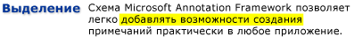

# Общие сведения о заметках
Добавление заметок или примечаний на печатные документы — это настолько обыденное действие, что мы воспринимаем его как должное. Такие примечания или комментарии являются "заметками", которые мы добавляем в документ для пометки информации или выделения интересующих элементов, к которым будем обращаться в дальнейшем. Хотя написание заметок на печатных документах является простым и обыденным, возможность добавлять личные примечания в электронные документы, как правило, очень ограниченна, если вообще доступна.  
  
 Эта тема рассматривает несколько распространенных типов аннотаций, в частности, липкие заметки и основные моменты, и иллюстрирует, как Microsoft Аннотации Framework облегчает эти типы аннотаций в приложениях через Windows Презентация Фонда (WPF ) элементы управления просмотром документов.  Контроль просмотра документов WPF, поддерживающий <xref:System.Windows.Controls.FlowDocumentReader> аннотации, включает <xref:System.Windows.Controls.Primitives.DocumentViewerBase> и, <xref:System.Windows.Controls.FlowDocumentPageViewer> <xref:System.Windows.Controls.FlowDocumentScrollViewer>а также элементы управления, полученные от таких, как <xref:System.Windows.Controls.DocumentViewer> и .  

## Записки  
 Обычная записка содержит информацию, написанную на маленьком листке цветной бумаги, который затем "приклеивается" к документу. Цифровые липкие заметки обеспечивают аналогичную функциональность для электронных документов, но с дополнительной гибкостью, чтобы включить многие другие типы контента, такие как печатаемый текст, рукописные заметки (например, планшетный ПК "чернила" штрихи), или веб-ссылки.  
  
 Ниже показаны некоторые примеры заметок: выделение, текстовая записка и рукописная записка.  
  
   
  
 В следующем примере показан метод, который можно использовать для включения поддержки заметок в приложении.  
  
 [!code-csharp[DocViewerAnnotationsXml#DocViewXmlStartAnnotations](~/samples/snippets/csharp/VS_Snippets_Wpf/DocViewerAnnotationsXml/CSharp/Window1.xaml.cs#docviewxmlstartannotations)]
 [!code-vb[DocViewerAnnotationsXml#DocViewXmlStartAnnotations](~/samples/snippets/visualbasic/VS_Snippets_Wpf/DocViewerAnnotationsXml/visualbasic/window1.xaml.vb#docviewxmlstartannotations)]  
  

## Особенности  
 Люди используют различные способы для привлечения внимания к интересующим элементам в бумажном документе, такие как подчеркивание, выделение, заключение слов в предложении в кружок или рисование пометок и примечаний на полях.  Выделение аннотаций в рамочной программе аннотаций Майкрософт предоставляет аналогичную функцию для разметки информации, отображаемые в элементах управления просмотром документов WPF.  
  
 На следующем рисунке показан пример заметки-выделения.  
  
   
  
 Пользователи обычно создают аннотации, сначала выбирая какой-либо текст или интересующий <xref:System.Windows.Controls.ContextMenu> вас элемент, а затем щелкая правой кнопкой мыши для отображения параметров аннотации.  Ниже приводится [!INCLUDE[TLA#tla_xaml](../../../../includes/tlasharptla-xaml-md.md)] приведение данных <xref:System.Windows.Controls.ContextMenu> о том, как можно объявить с помощью маршрутных команд, к которым пользователи могут получить доступ для создания и управления аннотациями.  
  
 [!code-xaml[DocViewerAnnotationsXps#CreateDeleteAnnotations](~/samples/snippets/csharp/VS_Snippets_Wpf/DocViewerAnnotationsXps/CSharp/Window1.xaml#createdeleteannotations)]  
  

## Привязка данных  
 Рамочная аннотации связывает аннотации к данным, которые выбирает пользователь, а не только к позиции в представлении дисплея. Таким образом, при изменении представления документа, например когда пользователь прокручивает его или изменяет размер окна отображения, заметка остается привязанной к выбранным данным. Например, на следующем графике показана заметка, которую пользователь задал для выделенного текста. При изменении представления документа (прокрутка, изменение размера, масштаба и т. д.) заметка-выделение перемещается вместе с исходным фрагментом данных.  
  
   
  

## Сопоставление заметок с объектами заметок  
 Можно сопоставить заметки с соответствующими объектами заметок. Например, рассмотрим простое приложение для чтения документа, имеющее панель комментариев. Панель комментариев может быть полем со списком, в котором отображается текст из списка заметок, привязанных к документу. Когда пользователь выбирает элемент в списке, приложение загружает в представление абзац в документе, к которому привязан соответствующий объект заметки.  
  
 Ниже приведен пример, демонстрирующий реализацию обработчика событий такого списка, который служит в качестве панели комментариев.  
  
 [!code-csharp[FlowDocumentAnnotatedViewer#Handler](~/samples/snippets/csharp/VS_Snippets_Wpf/FlowDocumentAnnotatedViewer/CSharp/Window1.xaml.cs#handler)]
 [!code-vb[FlowDocumentAnnotatedViewer#Handler](~/samples/snippets/visualbasic/VS_Snippets_Wpf/FlowDocumentAnnotatedViewer/visualbasic/window1.xaml.vb#handler)]  
  
 Другой пример сценария включает в себя приложения, которые позволяют обмениваться аннотациями и липкими примечаниями между читателями документов по электронной почте. Эта функция позволяет таким приложениям направлять пользователя на страницу, содержащую заметку для обмена.  
  
## См. также раздел

- <xref:System.Windows.Controls.Primitives.DocumentViewerBase>
- <xref:System.Windows.Controls.DocumentViewer>
- <xref:System.Windows.Controls.FlowDocumentPageViewer>
- <xref:System.Windows.Controls.FlowDocumentScrollViewer>
- <xref:System.Windows.Controls.FlowDocumentReader>
- <xref:System.Windows.Annotations.IAnchorInfo>
- [Схема примечаний](annotations-schema.md)
- [Общие сведения об элементе ContextMenu](../controls/contextmenu-overview.md)
- [Общие сведения о системе команд](commanding-overview.md)
- [Общие сведения о документах нефиксированного формата](flow-document-overview.md)
- [Практическое руководство. Добавление команды в объект MenuItem](https://docs.microsoft.com/previous-versions/dotnet/netframework-3.5/ms741839(v=vs.90))
