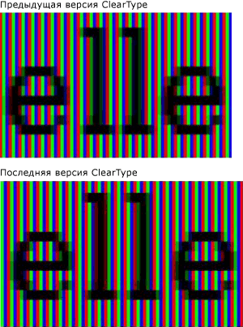
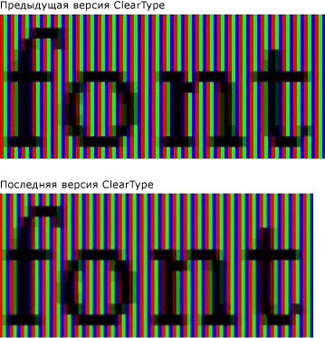

# Общие сведения о технологии ClearType
В этой теме содержится обзор технологии [!INCLUDE[TLA#tla_winclient](../../../../includes/tlasharptla-winclient-md.md)]Microsoft ClearType, найденной в .  

## Общие сведения о технологии  
 ClearType — это технология программного обеспечения, разработанная корпорацией Майкрософт, которая улучшает читаемость текста на существующих LCD (Liquid Crystal Displays), таких как экраны ноутбуков, карманные экраны ПК и плоские мониторы.  ClearType работает, доступ к отдельным вертикальным элементам полосы цвета в каждом пикселе LCD-экрана. До ClearType, наименьший уровень детализации, который компьютер мог отобразить, был одним пикселем, но с ClearType, работающим на LCD-мониторе, теперь мы можем отображать функции текста размером до малейшей доли пикселя в ширину. Дополнительное разрешение повышает четкость мелких деталей отображаемого текста, значительно облегчая его длительное чтение.  
  
 ClearType доступны [!INCLUDE[TLA#tla_winclient](../../../../includes/tlasharptla-winclient-md.md)] в это последнее поколение ClearType, который имеет несколько улучшений по сравнению с версией найти в Microsoft Windows Графический интерфейс устройства (GDI).  
  

## Субпиксельная отрисовка  
 Существенным улучшением по сравнению с предыдущей версией ClearType является использование субпиксельного позиционирования. В отличие от реализации ClearType, найденной [!INCLUDE[TLA#tla_winclient](../../../../includes/tlasharptla-winclient-md.md)] в GDI, ClearType, найденная в, позволяет глифов начинаться в пикселе, а не только в начальной границе пикселя. Благодаря дополнительному разрешению при отрисовке глифов интервалы и пропорции глифов становятся более точными и согласованными.  
  
 В следующих двух примерах показано, как глифы могут начинаться на любой субпиксельной границе при использовании субпиксельной отрисовки. Пример слева отображается с помощью более ранней версии рендерера ClearType, в которой не использовалось субпиксельное позиционирование. Пример справа отображается с помощью новой версии рендерера ClearType с использованием субпиксельного позиционирования. Обратите внимание на то, что каждая буква **e** и **l** на рисунке справа отображается немного по-разному, так разные глифы начинаются в разных субпикселях. При просмотре текста в обычном размере на экране это различие незаметно из-за высокой контрастности изображения глифа. Это возможно только из-за сложной цветовой фильтрации, которая включена в ClearType.  
  
   
Текст, отображаемый более ранней и более поздней версией ClearType  
  
 Следующие два примера сравнивают выход из предыдущего рендера ClearType с новой версией рендера ClearType. Субпиксельная отрисовка, показанная справа, значительно улучшает плотность знаков на экране, особенно при небольших размерах, когда разница между субпикселем и целым пикселем представляет значительную часть ширины глифа. Обратите внимание, что расстояние между буквами более однородно на втором изображении. Совокупное преимущество субпиксельного позиционирования для общего внешнего вида экрана текста значительно увеличивается и представляет собой значительную эволюцию технологии ClearType.  
  
   
Текст, отображаемый более ранней и более поздней версией ClearType  
  

## Сглаживание по оси Y  
 Еще одно улучшение [!INCLUDE[TLA#tla_winclient](../../../../includes/tlasharptla-winclient-md.md)] ClearType в это y-направление анти-алиазирования. ClearType в GDI без y-направление анти-ализаинг обеспечивает лучшее разрешение на x-оси, но не y-оси. В верхних и нижних границах мелких изгибов неровные края влияют на их удобочитаемость.  
  
 В следующем примере к тексту не применено сглаживание по оси Y. В этом случае неровные края верхней и нижней частей буквы сильно заметны.  
  
   
Текст с неровными краями у мелких изгибов  
  
 ClearType [!INCLUDE[TLA#tla_winclient](../../../../includes/tlasharptla-winclient-md.md)] в обеспечивает antialiasing на уровне y-направления, чтобы сгладить любые зубчатые края. Это особенно важно для повышения удобочитаемости восточно-азиатских языков, в которых иероглифы имеют почти равное количество горизонтальных и вертикальных мелких изгибов.  
  
 В следующем примере к тексту применено сглаживание по оси Y. В этом случае заметны гладкие изгибы верхней и нижней частей буквы.  
  
   
Текст со сглаживанием ClearType по оси Y  
  

## Аппаратное ускорение  
 ClearType [!INCLUDE[TLA#tla_winclient](../../../../includes/tlasharptla-winclient-md.md)] в может воспользоваться аппаратным ускорением для повышения производительности и снижения нагрузки процессора и требований к системной памяти. Используя пиксельные шейдеры и видеопамять видеокарты, ClearType обеспечивает более быструю визуализацию текста, особенно при использовании анимации.  
  
 ClearType [!INCLUDE[TLA#tla_winclient](../../../../includes/tlasharptla-winclient-md.md)] не изменяет общесистемные настройки ClearType. Отключение ClearType в [!INCLUDE[TLA#tla_winclient](../../../../includes/tlasharptla-winclient-md.md)] Windows устанавливает антиализанирование в режим едких. Кроме того, ClearType не [!INCLUDE[TLA#tla_winclient](../../../../includes/tlasharptla-winclient-md.md)] изменяет настройки [ClearType Tuner PowerToy.](https://www.microsoft.com/typography/ClearTypePowerToy.mspx)  
  
 Одно из архитектурных решений [!INCLUDE[TLA#tla_winclient](../../../../includes/tlasharptla-winclient-md.md)] предполагает наличие независимого от разрешения макета, который обеспечивает более эффективную поддержку мониторов с высоким разрешением, получающих все большее распространение. Вследствие этого [!INCLUDE[TLA#tla_winclient](../../../../includes/tlasharptla-winclient-md.md)] не поддерживает отрисовку сглаженного текста или точечных рисунков в некоторых восточно-азиатских шрифтах, поскольку они являются зависимыми от разрешения.  
  

## Дополнительные сведения  
 [Сведения о технологии ClearType](https://www.microsoft.com/typography/ClearTypeInfo.mspx)  
  
 [Средство настройки ClearType, PowerToy](https://www.microsoft.com/typography/ClearTypePowerToy.mspx)  
  
## См. также раздел

- [Параметры реестра ClearType](cleartype-registry-settings.md)
