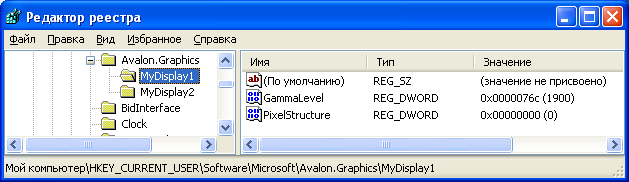

# Параметры реестра ClearType
В этом разделе дается обзор параметров реестра [!INCLUDE[TLA2#tla_winclient](../../../../includes/tla2sharptla-winclient-md.md)] [!INCLUDE[TLA#tla_ct](../../../../includes/tlasharptla-ct-md.md)], которые используются приложениями [!INCLUDE[TLA2#tla_winclient](../../../../includes/tla2sharptla-winclient-md.md)].  
  
   
  
   
## Общие сведения о технологии  
 Приложения [!INCLUDE[TLA2#tla_winclient](../../../../includes/tla2sharptla-winclient-md.md)], которые отображают текст на устройстве отображения, используют средства [!INCLUDE[TLA2#tla_ct](../../../../includes/tla2sharptla-ct-md.md)] для обеспечения расширенного отображения.  [!INCLUDE[TLA2#tla_ct](../../../../includes/tla2sharptla-ct-md.md)] — это программная технология, разработанная [!INCLUDE[TLA#tla_ms](../../../../includes/tlasharptla-ms-md.md)] для улучшения удобочитаемости текста на современных ЖК\-мониторах \(жидкокристаллических дисплеях\), например экранах ноутбуков, карманных ПК и плоскопанельных мониторах.  [!INCLUDE[TLA2#tla_ct](../../../../includes/tla2sharptla-ct-md.md)] работает путем обращения к отдельным вертикальным элементам цветных полос в каждом пикселе ЖК\-монитора.  Дополнительные сведения о [!INCLUDE[TLA2#tla_ct](../../../../includes/tla2sharptla-ct-md.md)] см. в разделе [Общие сведения о технологии ClearType](../../../../docs/framework/wpf/advanced/cleartype-overview.md).  
  
 Текст, отображаемый с [!INCLUDE[TLA2#tla_ct](../../../../includes/tla2sharptla-ct-md.md)], может существенно отличаться при просмотре на различных устройствах отображения.  Например, небольшое число мониторов реализуют элементы цветных полос по порядку "синий, зеленый, красный", в отличие от более распространенного порядка "красный, зеленый, синий" \([!INCLUDE[TLA#tla_rgb](../../../../includes/tlasharptla-rgb-md.md)]\).  
  
 Текст, отображаемый [!INCLUDE[TLA2#tla_ct](../../../../includes/tla2sharptla-ct-md.md)], также может существенно отличаться при просмотрах с различными уровнями цветочувствительности.  Некоторые пользователи могут замечать незначительные различия в цвете лучше, чем другие.  
  
 В каждом из этих случаев возможности [!INCLUDE[TLA2#tla_ct](../../../../includes/tla2sharptla-ct-md.md)] должны быть изменены, чтобы обеспечить лучшее изображение для каждого пользователя.  
  
   
## Параметры реестра  
 [!INCLUDE[TLA2#tla_winclient](../../../../includes/tla2sharptla-winclient-md.md)] указывает четыре параметра реестра для управления возможностями [!INCLUDE[TLA2#tla_ct](../../../../includes/tla2sharptla-ct-md.md)]:  
  
|Параметр|Описание|  
|--------------|--------------|  
|Уровень [!INCLUDE[TLA2#tla_ct](../../../../includes/tla2sharptla-ct-md.md)]|Описывает уровень прозрачности цвета [!INCLUDE[TLA2#tla_ct](../../../../includes/tla2sharptla-ct-md.md)].|  
|Гамма\-уровень|Описывает уровень компонента цвета пикселя для дисплея.|  
|Пиксельная структура|Описывает расположение пикселей для дисплея.|  
|Уровень контрастности текста|Описывает уровень контрастности отображаемого текста.|  
  
 Эти параметры могут быть доступными для программы внешней конфигурации, которая знает, как ссылаться на параметры реестра [!INCLUDE[TLA2#tla_winclient](../../../../includes/tla2sharptla-winclient-md.md)] [!INCLUDE[TLA2#tla_ct](../../../../includes/tla2sharptla-ct-md.md)].  Эти параметры могут также быть созданы или изменены посредством доступа к значениям напрямую с помощью редактора реестра [!INCLUDE[TLA#tla_mswin](../../../../includes/tlasharptla-mswin-md.md)].  
  
 Если параметры реестра [!INCLUDE[TLA2#tla_ct](../../../../includes/tla2sharptla-ct-md.md)] [!INCLUDE[TLA2#tla_winclient](../../../../includes/tla2sharptla-winclient-md.md)] не установлены \(т.е. находятся в состоянии по умолчанию\), то приложение [!INCLUDE[TLA2#tla_winclient](../../../../includes/tla2sharptla-winclient-md.md)] запрашивает информацию о системных параметрах [!INCLUDE[TLA#tla_mswin](../../../../includes/tlasharptla-mswin-md.md)] для параметров сглаживания шрифта.  
  
> [!NOTE]
>  Перечисление имен дисплеев см. в разделе `SystemParametersInfo` функции [!INCLUDE[TLA2#tla_win32](../../../../includes/tla2sharptla-win32-md.md)].  
  
   
## Уровень ClearType  
 Уровень технологии [!INCLUDE[TLA2#tla_ct](../../../../includes/tla2sharptla-ct-md.md)] позволяет настраивать отрисовку текста на основе цветочувствительности и восприятия пользователя. Для некоторых пользователей отрисовка текста, которая использует [!INCLUDE[TLA2#tla_ct](../../../../includes/tla2sharptla-ct-md.md)] на своем самом высоком уровне, не создает лучшие возможности для чтения.  
  
 Уровень [!INCLUDE[TLA2#tla_ct](../../../../includes/tla2sharptla-ct-md.md)] является целым значением в диапазоне от 0 до 100.  Уровень по умолчанию равен 100. Это означает, что [!INCLUDE[TLA2#tla_ct](../../../../includes/tla2sharptla-ct-md.md)] использует максимальные возможности элементов цветных полос монитора.  Однако уровень [!INCLUDE[TLA2#tla_ct](../../../../includes/tla2sharptla-ct-md.md)], равный 0, отображает текст в виде оттенков серого.  Установив уровень [!INCLUDE[TLA2#tla_ct](../../../../includes/tla2sharptla-ct-md.md)] где\-нибудь между 0 и 100, можно создать промежуточный уровень, подходящий для цветочувствительности пользователя.  
  
### Установка реестра  
 Положение установки реестра для уровня [!INCLUDE[TLA2#tla_ct](../../../../includes/tla2sharptla-ct-md.md)] ― это установка отдельного пользователя, соответствующая конкретному имени дисплея:  
  
 `HKEY_CURRENT_USER\SOFTWARE\Microsoft\Avalon.Graphics\<displayName>`  
  
 Для каждого названия дисплея для пользователя определяется значение `ClearTypeLevel` типа DWORD.  На следующем снимке экрана показана установка редактора реестра для уровня [!INCLUDE[TLA2#tla_ct](../../../../includes/tla2sharptla-ct-md.md)].  
  
   
  
> [!NOTE]
>  Приложения [!INCLUDE[TLA2#tla_winclient](../../../../includes/tla2sharptla-winclient-md.md)] отображают текст в одном из двух режимов, с или без [!INCLUDE[TLA2#tla_ct](../../../../includes/tla2sharptla-ct-md.md)].  Отображение текста без [!INCLUDE[TLA2#tla_ct](../../../../includes/tla2sharptla-ct-md.md)] относится к отрисовке в оттенках серого.  
  
   
## Гамма\-уровень  
 Гамма\-уровень относится к нелинейной связи между значением и яркостью пикселя.  Установка гамма\-уровня должна соответствовать физическим характеристикам дисплея; в противном случае могут возникнуть искажения отображаемого изображения.  Например, тест может оказаться слишком широким или слишком узким, или на краях вертикальных полос глифов могут появиться цветные полосы.  
  
 Гамма\-уровень является целым значением в диапазоне от 1000 до 2200.  Уровень по умолчанию равен 1900.  
  
### Установка реестра  
 Положение установки реестра для гамма\-уровня является установкой локального компьютера, соответствующей имени конкретного дисплея:  
  
 `HKEY_LOCAL_MACHINE\SOFTWARE\Microsoft\Avalon.Graphics\<displayName>`  
  
 Для каждого названия дисплея для пользователя определяется значение `GammaLevel` типа DWORD.  На следующем снимке экрана показана установка редактора реестра для гамма\-уровня.  
  
   
  
   
## Пиксельная структура  
 Пиксельная структура описывает тип пикселей, составляющих дисплей.  Пиксельная структура задается одного из трех типов:  
  
|Тип|Значение|Описание|  
|---------|--------------|--------------|  
|Плоский|0|Дисплей не имеет пиксельной структуры.  Это означает, что световые источники для каждого цвета распределены равномерно в области пикселя — это относится к отрисовке в оттенках серого.  Так работает стандартный монитор.  [!INCLUDE[TLA2#tla_ct](../../../../includes/tla2sharptla-ct-md.md)] никогда не применяется к отображаемому тексту.|  
|RGB|1|Монитор имеет пиксели, которые состоят из трех оттенков в следующем порядке: красный, зеленый, синий.  [!INCLUDE[TLA2#tla_ct](../../../../includes/tla2sharptla-ct-md.md)] применяется к отображаемому тексту.|  
|BGR|2|Монитор имеет пиксели, которые состоят из трех оттенков в следующем порядке: синий, зеленый, красный.  [!INCLUDE[TLA2#tla_ct](../../../../includes/tla2sharptla-ct-md.md)] применяется к отображаемому тексту.  Обратите внимание, что порядок инвертируется из типа RGB.|  
  
 Пиксельная структура соответствует целому значению в диапазоне от 0 до 2.  По умолчанию уровень равен 0, что означает плоскую пиксельную структуру.  
  
> [!NOTE]
>  Перечисление имен дисплеев см. в разделе `EnumDisplayDevices` функции [!INCLUDE[TLA2#tla_win32](../../../../includes/tla2sharptla-win32-md.md)].  
  
### Установка реестра  
 Положение установки реестра для пиксельной структуры является параметром локального компьютера, который соответствует определенному имени дисплея:  
  
 `HKEY_LOCAL_MACHINE\SOFTWARE\Microsoft\Avalon.Graphics\<displayName>`  
  
 Для каждого названия дисплея для пользователя определяется значение `PixelStructure` типа DWORD.  На следующем снимке экрана показана установка редактора реестра для пиксельной структуры.  
  
   
  
   
## Уровень контрастности текста  
 Уровень контрастности текста позволяет настроить отрисовку текста в зависимости от ширины полос глифов.  Уровень контрастности текста имеет тип integer и находится в диапазоне 0 до 6 — чем больше значение, тем шире полоса.  Уровень по умолчанию равен 1.  
  
### Установка реестра  
 Положение установки реестра для уровня контрастности текста является индивидуальным пользовательским параметром, который соответствует конкретному имени дисплея:  
  
 `HKEY_CURRENT_USER\Software\Microsoft\Avalon.Graphics\<displayName>`  
  
 Для каждого названия дисплея для пользователя определяется значение `TextContrastLevel` типа DWORD.  На следующем снимке экрана показана установка редактора реестра для уровня контрастности текста.  
  
   
  
## См. также  
 [Общие сведения о технологии ClearType](../../../../docs/framework/wpf/advanced/cleartype-overview.md)   
 [Сглаживание ClearType](_win32_ClearType_Antialiasing)