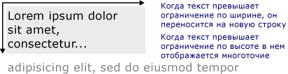

# Рисование форматированного текстаDrawing Formatted Text
В этом разделе содержится обзор возможностей <xref:System.Windows.Media.FormattedText> объекта.This topic provides an overview of the features of the <xref:System.Windows.Media.FormattedText> object. Этот объект предоставляет низкоуровневый элемент управления для рисования текста в приложениях [!INCLUDE[TLA#tla_winclient](../../../../includes/tlasharptla-winclient-md.md)].This object provides low-level control for drawing text in [!INCLUDE[TLA#tla_winclient](../../../../includes/tlasharptla-winclient-md.md)] applications.  
  
  
## Общие сведения о технологииTechnology Overview  
 <xref:System.Windows.Media.FormattedText> Позволяет рисовать многострочный текст, в котором каждый символ в тексте можно форматировать отдельно.The <xref:System.Windows.Media.FormattedText> object allows you to draw multi-line text, in which each character in the text can be individually formatted. В следующем примере показан текст, к которому применено несколько форматов.The following example shows text that has several formats applied to it.  
  
   
Отображенный текст с использованием метода FormattedTextDisplayed text using FormattedText method  
  
> [!NOTE]
>  Для разработчиков, осуществляющих переход с API [!INCLUDE[TLA#tla_win32](../../../../includes/tlasharptla-win32-md.md)], в таблице из раздела [Миграция Win32](#win32_migration) перечислены флаги DrawText [!INCLUDE[TLA#tla_win32](../../../../includes/tlasharptla-win32-md.md)] и примерный эквивалент в [!INCLUDE[TLA#tla_winclient](../../../../includes/tlasharptla-winclient-md.md)].For those developers migrating from the [!INCLUDE[TLA#tla_win32](../../../../includes/tlasharptla-win32-md.md)] API, the table in the [Win32 Migration](#win32_migration) section lists the [!INCLUDE[TLA#tla_win32](../../../../includes/tlasharptla-win32-md.md)] DrawText flags and the approximate equivalent in [!INCLUDE[TLA#tla_winclient](../../../../includes/tlasharptla-winclient-md.md)].  
  
### Причины использования форматированного текстаReasons for Using Formatted Text  
 В [!INCLUDE[TLA2#tla_winclient](../../../../includes/tla2sharptla-winclient-md.md)] имеется множество элементов управления для рисования текста на экране.[!INCLUDE[TLA2#tla_winclient](../../../../includes/tla2sharptla-winclient-md.md)] includes multiple controls for drawing text to the screen. Каждый элемент управления предназначен для своего сценария и имеет собственный список функций и ограничений.Each control is targeted to a different scenario and has its own list of features and limitations. Как правило <xref:System.Windows.Controls.TextBlock> элемент должен использоваться, если требуется ограниченная поддержка текста, например краткие предложения в [!INCLUDE[TLA#tla_ui](../../../../includes/tlasharptla-ui-md.md)].In general, the <xref:System.Windows.Controls.TextBlock> element should be used when limited text support is required, such as a brief sentence in a [!INCLUDE[TLA#tla_ui](../../../../includes/tlasharptla-ui-md.md)]. <xref:System.Windows.Controls.Label>можно использовать, когда требуется Минимальная поддержка текста.<xref:System.Windows.Controls.Label> can be used when minimal text support is required. Дополнительные сведения см. в разделе [Документы в WPF](../../../../docs/framework/wpf/advanced/documents-in-wpf.md).For more information, see [Documents in WPF](../../../../docs/framework/wpf/advanced/documents-in-wpf.md).  
  
 <xref:System.Windows.Media.FormattedText> Объект предоставляет больше возможностей, чем форматирования [!INCLUDE[TLA#tla_winclient](../../../../includes/tlasharptla-winclient-md.md)] текстовых элементов управления и может быть полезно в случаях, где вы хотите использовать текст как декоративный элемент.The <xref:System.Windows.Media.FormattedText> object provides greater text formatting features than [!INCLUDE[TLA#tla_winclient](../../../../includes/tlasharptla-winclient-md.md)] text controls, and can be useful in cases where you want to use text as a decorative element. Дополнительные сведения см. в следующем разделе: [Преобразование форматированного текста в геометрический объект](#converting_formatted_text).For more information, see the following section [Converting Formatted Text to a Geometry](#converting_formatted_text).  
  
 Кроме того <xref:System.Windows.Media.FormattedText> объектов может применяться для создания ориентированных на текст <xref:System.Windows.Media.DrawingVisual>-производных объектов.In addition, the <xref:System.Windows.Media.FormattedText> object is useful for creating text-oriented <xref:System.Windows.Media.DrawingVisual>-derived objects. <xref:System.Windows.Media.DrawingVisual>— Это упрощенный класс рисования, используемую для отрисовки фигур, изображений или текста.<xref:System.Windows.Media.DrawingVisual> is a lightweight drawing class that is used to render shapes, images, or text. Дополнительные сведения см. в разделе [Пример проверки нажатия с использованием DrawingVisuals](http://go.microsoft.com/fwlink/?LinkID=159994).For more information, see [Hit Test Using DrawingVisuals Sample](http://go.microsoft.com/fwlink/?LinkID=159994).  
  
## Использование объекта FormattedTextUsing the FormattedText Object  
 Чтобы создать форматированный текст, вызовите <xref:System.Windows.Media.FormattedText.%23ctor%2A> конструктор для создания <xref:System.Windows.Media.FormattedText> объекта.To create formatted text, call the <xref:System.Windows.Media.FormattedText.%23ctor%2A> constructor to create a <xref:System.Windows.Media.FormattedText> object. После создания исходной строки форматированного текста можно применить ряд стилей форматирования.Once you have created the initial formatted text string, you can apply a range of formatting styles.  
  
 Используйте <xref:System.Windows.Media.FormattedText.MaxTextWidth%2A> свойство, чтобы ограничить ширину текста.Use the <xref:System.Windows.Media.FormattedText.MaxTextWidth%2A> property to constrain the text to a specific width. Текст будет автоматически перенесен, чтобы заданная ширина не была нарушена.The text will automatically wrap to avoid exceeding the specified width. Используйте <xref:System.Windows.Media.FormattedText.MaxTextHeight%2A> свойство, чтобы ограничить текста с заданным значением.Use the <xref:System.Windows.Media.FormattedText.MaxTextHeight%2A> property to constrain the text to a specific height. Если текст выходит за указанные пределы по высоте, отображается многоточие (…).The text will display an ellipsis, "…" for the text that exceeds the specified height.  
  
   
Отображенный текст с переносом слов и многоточиемDisplayed text showing wordwrapping and ellipsis  
  
 К одному или более символам можно применить несколько стилей форматирования.You can apply multiple formatting styles to one or more characters. Например, можно вызвать как <xref:System.Windows.Media.FormattedText.SetFontSize%2A> и <xref:System.Windows.Media.FormattedText.SetForegroundBrush%2A> методов, чтобы изменить форматирование первые пять символов в тексте.For example, you could call both the <xref:System.Windows.Media.FormattedText.SetFontSize%2A> and <xref:System.Windows.Media.FormattedText.SetForegroundBrush%2A> methods to change the formatting of the first five characters in the text.  
  
 В следующем примере кода создается <xref:System.Windows.Media.FormattedText> объекта, а затем применяет несколько стилей форматирования к тексту.The following code example creates a <xref:System.Windows.Media.FormattedText> object and then applies several formatting styles to the text.  
  
 [!code-csharp[FormattedTextSnippets#FormattedTextSnippets1](../../../../samples/snippets/csharp/VS_Snippets_Wpf/FormattedTextSnippets/CSharp/Window1.xaml.cs#formattedtextsnippets1)]
 [!code-vb[FormattedTextSnippets#FormattedTextSnippets1](../../../../samples/snippets/visualbasic/VS_Snippets_Wpf/FormattedTextSnippets/visualbasic/window1.xaml.vb#formattedtextsnippets1)]  
  
### Единица измерения "Размер шрифта"Font Size Unit of Measure  
 Как и в других текстовых объектов в [!INCLUDE[TLA#tla_winclient](../../../../includes/tlasharptla-winclient-md.md)] приложений, <xref:System.Windows.Media.FormattedText> объект использует в качестве единицы измерения аппаратно независимых пикселях.As with other text objects in [!INCLUDE[TLA#tla_winclient](../../../../includes/tlasharptla-winclient-md.md)] applications, the <xref:System.Windows.Media.FormattedText> object uses device-independent pixels as the unit of measure. Однако большинство приложений [!INCLUDE[TLA#tla_win32](../../../../includes/tlasharptla-win32-md.md)] используют в качестве единицы измерения точки.However, most [!INCLUDE[TLA#tla_win32](../../../../includes/tlasharptla-win32-md.md)] applications use points as the unit of measure. Если требуется использовать отображаемый текст в приложениях [!INCLUDE[TLA#tla_winclient](../../../../includes/tlasharptla-winclient-md.md)] в единицах точек, необходимо преобразовать [!INCLUDE[TLA#tla_dipixel#plural](../../../../includes/tlasharptla-dipixelsharpplural-md.md)] в точки.If you want to use display text in units of points in [!INCLUDE[TLA#tla_winclient](../../../../includes/tlasharptla-winclient-md.md)] applications, you need to convert [!INCLUDE[TLA#tla_dipixel#plural](../../../../includes/tlasharptla-dipixelsharpplural-md.md)] to points. В следующем примере кода показано выполнение этого преобразования.The following code example shows how to perform this conversion.  
  
 [!code-csharp[FormattedTextSnippets#FormattedTextSnippets2](../../../../samples/snippets/csharp/VS_Snippets_Wpf/FormattedTextSnippets/CSharp/Window1.xaml.cs#formattedtextsnippets2)]
 [!code-vb[FormattedTextSnippets#FormattedTextSnippets2](../../../../samples/snippets/visualbasic/VS_Snippets_Wpf/FormattedTextSnippets/visualbasic/window1.xaml.vb#formattedtextsnippets2)]  
  
   
### Преобразование форматированного текста в геометрический объектConverting Formatted Text to a Geometry  
 Можно преобразовать форматированный текст в <xref:System.Windows.Media.Geometry> объекты, что позволяет создавать другие типы наглядного текста.You can convert formatted text into <xref:System.Windows.Media.Geometry> objects, allowing you to create other types of visually interesting text. Например, можно создать <xref:System.Windows.Media.Geometry> объекта, основанного на структуре текстовой строки.For example, you could create a <xref:System.Windows.Media.Geometry> object based on the outline of a text string.  
  
   
Оконтуривание текста с использованием кисти линейного градиентаText outline using a linear gradient brush  
  
 В следующих примерах показаны несколько способов создания визуальных эффектов посредством изменения штриха, заливки и выделения преобразованного текста.The following examples illustrate several ways of creating interesting visual effects by modifying the stroke, fill, and highlight of converted text.  
  
   
Пример установки разного цвета для штриха и заливкиExample of setting stroke and fill to different colors  
  
   
Пример применения кисти к штрихуExample of an image brush applied to the stroke  
  
   
Пример применения кисти к штриху и выделениюExample of an image brush applied to the stroke and highlight  
  
 Если текст преобразуется в <xref:System.Windows.Media.Geometry> объекта, он больше не является набором символов — изменение символов в текстовой строке невозможно.When text is converted to a <xref:System.Windows.Media.Geometry> object, it is no longer a collection of characters—you cannot modify the characters in the text string. Тем не менее можно повлиять на внешний вид преобразованного текст, изменив его свойства штриха и заливки.However, you can affect the appearance of the converted text by modifying its stroke and fill properties. Штрих — это контур преобразованного текста; заливка — это область внутри контура преобразованного текста.The stroke refers to the outline of the converted text; the fill refers to the area inside the outline of the converted text. Дополнительные сведения см. в разделе [Создание контурного текста](../../../../docs/framework/wpf/advanced/how-to-create-outlined-text.md).For more information, see [Create Outlined Text](../../../../docs/framework/wpf/advanced/how-to-create-outlined-text.md).  
  
 Можно также преобразовать форматированный текст в <xref:System.Windows.Media.PathGeometry> и использовать объект для выделения текста.You can also convert formatted text to a <xref:System.Windows.Media.PathGeometry> object, and use the object for highlighting the text. Например, можно применить анимацию для <xref:System.Windows.Media.PathGeometry> таким образом, анимация будет следовать за контуром форматированного текста.For example, you could apply an animation to the <xref:System.Windows.Media.PathGeometry> object so that the animation follows the outline of the formatted text.  
  
 В следующем примере показано форматированный текст, который был преобразован в <xref:System.Windows.Media.PathGeometry> объекта.The following example shows formatted text that has been converted to a <xref:System.Windows.Media.PathGeometry> object. Анимированное многоточие повторяет путь штрихов отрисованного текста.An animated ellipse follows the path of the strokes of the rendered text.  
  
   
Сфера, следующая по геометрическому пути текстаSphere following the path geometry of text  
  
 Дополнительные сведения см. в разделе [Практическое руководство. Создание анимации PathGeometry для текста](http://msdn.microsoft.com/en-us/29f8051e-798a-463f-a926-a099a99e9c67).For more information, see [How to: Create a PathGeometry Animation for Text](http://msdn.microsoft.com/en-us/29f8051e-798a-463f-a926-a099a99e9c67).  
  
 Можно создать другие интересные применения форматированного текста после преобразования для <xref:System.Windows.Media.PathGeometry> объекта.You can create other interesting uses for formatted text once it has been converted to a <xref:System.Windows.Media.PathGeometry> object. Например, можно обрезать видео для отображения внутри текста.For example, you can clip video to display inside it.  
  
   
Отображение видео по геометрическому пути текстаVideo displaying in the path geometry of text  
  
   
## Миграция Win32Win32 Migration  
 Возможности <xref:System.Windows.Media.FormattedText> для рисования текста похожи на возможности [!INCLUDE[TLA#tla_win32](../../../../includes/tlasharptla-win32-md.md)] DrawText функции.The features of <xref:System.Windows.Media.FormattedText> for drawing text are similar to the features of the [!INCLUDE[TLA#tla_win32](../../../../includes/tlasharptla-win32-md.md)] DrawText function. Для разработчиков, осуществляющих переход с API [!INCLUDE[TLA#tla_win32](../../../../includes/tlasharptla-win32-md.md)], в таблице перечислены флаги DrawText [!INCLUDE[TLA#tla_win32](../../../../includes/tlasharptla-win32-md.md)] и примерный эквивалент в [!INCLUDE[TLA#tla_winclient](../../../../includes/tlasharptla-winclient-md.md)].For those developers migrating from the [!INCLUDE[TLA#tla_win32](../../../../includes/tlasharptla-win32-md.md)] API, the following table lists the [!INCLUDE[TLA#tla_win32](../../../../includes/tlasharptla-win32-md.md)] DrawText flags and the approximate equivalent in [!INCLUDE[TLA#tla_winclient](../../../../includes/tlasharptla-winclient-md.md)].  
  
|Флаг DrawTextDrawText flag|Эквивалент WPFWPF equivalent|ПримечанияNotes|  
|-------------------|--------------------|-----------|  
|DT_BOTTOMDT_BOTTOM|<xref:System.Windows.Media.FormattedText.Height%2A>|Используйте <xref:System.Windows.Media.FormattedText.Height%2A> свойства для вычисления соответствующей [!INCLUDE[TLA#tla_win32](../../../../includes/tlasharptla-win32-md.md)] позиции DrawText 'y'.Use the <xref:System.Windows.Media.FormattedText.Height%2A> property to compute an appropriate [!INCLUDE[TLA#tla_win32](../../../../includes/tlasharptla-win32-md.md)] DrawText 'y' position.|  
|DT_CALCRECTDT_CALCRECT|<xref:System.Windows.Media.FormattedText.Height%2A>, <xref:System.Windows.Media.FormattedText.Width%2A><xref:System.Windows.Media.FormattedText.Height%2A>, <xref:System.Windows.Media.FormattedText.Width%2A>|Используйте <xref:System.Windows.Media.FormattedText.Height%2A> и <xref:System.Windows.Media.FormattedText.Width%2A> для вычисления выходного прямоугольника.Use the <xref:System.Windows.Media.FormattedText.Height%2A> and <xref:System.Windows.Media.FormattedText.Width%2A> properties to calculate the output rectangle.|  
|DT_CENTERDT_CENTER|<xref:System.Windows.Media.FormattedText.TextAlignment%2A>|Используйте <xref:System.Windows.Media.FormattedText.TextAlignment%2A> свойство со значением, равным <xref:System.Windows.TextAlignment.Center>.Use the <xref:System.Windows.Media.FormattedText.TextAlignment%2A> property with the value set to <xref:System.Windows.TextAlignment.Center>.|  
|DT_EDITCONTROLDT_EDITCONTROL|НетNone|Не требуется.Not required. Ширина пробелов и отрисовка последней строки соответствуют этим параметрам в элементе управления редактированием среды.Space width and last line rendering are the same as in the framework edit control.|  
|DT_END_ELLIPSISDT_END_ELLIPSIS|<xref:System.Windows.Media.FormattedText.Trimming%2A>|Используйте <xref:System.Windows.Media.FormattedText.Trimming%2A> свойство со значением <xref:System.Windows.TextTrimming.CharacterEllipsis>.Use the <xref:System.Windows.Media.FormattedText.Trimming%2A> property with the value <xref:System.Windows.TextTrimming.CharacterEllipsis>.   Используйте <xref:System.Windows.TextTrimming.WordEllipsis> для получения [!INCLUDE[TLA#tla_win32](../../../../includes/tlasharptla-win32-md.md)] DT_END_ELLIPSIS с DT_WORD_ELIPSIS завершить многоточие — в этом случае знак многоточия возникает только на слова, которые не помещаются в одну строку.Use <xref:System.Windows.TextTrimming.WordEllipsis> to get [!INCLUDE[TLA#tla_win32](../../../../includes/tlasharptla-win32-md.md)] DT_END_ELLIPSIS with DT_WORD_ELIPSIS end ellipsis—in this case, character ellipsis only occurs on words that do not fit on a single line.|  
|DT_EXPAND_TABSDT_EXPAND_TABS|НетNone|Не требуется.Not required. Символы табуляции автоматически расширяются до точек каждые 4 размера максимального пробела (это примерно соответствует ширине 8 независимых от языка символов).Tabs are automatically expanded to stops every 4 ems, which is approximately the width of 8 language-independent characters.|  
|DT_EXTERNALLEADINGDT_EXTERNALLEADING|НетNone|Не требуется.Not required. Внешнее ведение всегда включается в междустрочный интервал.External leading is always included in line spacing. Используйте <xref:System.Windows.Media.FormattedText.LineHeight%2A> свойство для создания определяемых пользователем межстрочный интервал.Use the <xref:System.Windows.Media.FormattedText.LineHeight%2A> property to create user-defined line spacing.|  
|DT_HIDEPREFIXDT_HIDEPREFIX|НетNone|Не поддерживается.Not supported. Удалите знак «&» из строки перед созданием <xref:System.Windows.Media.FormattedText> объекта.Remove the '&' from the string before constructing the <xref:System.Windows.Media.FormattedText> object.|  
|DT_LEFTDT_LEFT|<xref:System.Windows.Media.FormattedText.TextAlignment%2A>|Это выравнивание текста по умолчанию.This is the default text alignment. Используйте <xref:System.Windows.Media.FormattedText.TextAlignment%2A> свойство со значением, равным <xref:System.Windows.TextAlignment.Left>.Use the <xref:System.Windows.Media.FormattedText.TextAlignment%2A> property with the value set to <xref:System.Windows.TextAlignment.Left>. (только WPF)(WPF only)|  
|DT_MODIFYSTRINGDT_MODIFYSTRING|НетNone|Не поддерживается.Not supported.|  
|DT_NOCLIPDT_NOCLIP|<xref:System.Windows.Media.Visual.VisualClip%2A>|Отсечение не происходит автоматически.Clipping does not happen automatically. Если вы хотите вырезать текст, используйте <xref:System.Windows.Media.Visual.VisualClip%2A> свойство.If you want to clip text, use the <xref:System.Windows.Media.Visual.VisualClip%2A> property.|  
|DT_NOFULLWIDTHCHARBREAKDT_NOFULLWIDTHCHARBREAK|НетNone|Не поддерживается.Not supported.|  
|DT_NOPREFIXDT_NOPREFIX|НетNone|Не требуется.Not required. Символ & в строке всегда рассматривается как обычный символ.The '&' character in strings is always treated as a normal character.|  
|DT_PATHELLIPSISDT_PATHELLIPSIS|НетNone|Используйте <xref:System.Windows.Media.FormattedText.Trimming%2A> свойство со значением <xref:System.Windows.TextTrimming.WordEllipsis>.Use the <xref:System.Windows.Media.FormattedText.Trimming%2A> property with the value <xref:System.Windows.TextTrimming.WordEllipsis>.|  
|DT_PREFIXDT_PREFIX|НетNone|Не поддерживается.Not supported. Если вы хотите использовать знаки подчеркивания для текста, например сочетание клавиш или ссылки, используйте <xref:System.Windows.Media.FormattedText.SetTextDecorations%2A> метод.If you want to use underscores for text, such as an accelerator key or link, use the <xref:System.Windows.Media.FormattedText.SetTextDecorations%2A> method.|  
|DT_PREFIXONLYDT_PREFIXONLY|НетNone|Не поддерживается.Not supported.|  
|DT_RIGHTDT_RIGHT|<xref:System.Windows.Media.FormattedText.TextAlignment%2A>|Используйте <xref:System.Windows.Media.FormattedText.TextAlignment%2A> свойство со значением, равным <xref:System.Windows.TextAlignment.Right>.Use the <xref:System.Windows.Media.FormattedText.TextAlignment%2A> property with the value set to <xref:System.Windows.TextAlignment.Right>. (только WPF)(WPF only)|  
|DT_RTLREADINGDT_RTLREADING|<xref:System.Windows.Media.FormattedText.FlowDirection%2A>|Задайте для свойства <xref:System.Windows.Media.FormattedText.FlowDirection%2A> значение <xref:System.Windows.FlowDirection.RightToLeft>.Set the <xref:System.Windows.Media.FormattedText.FlowDirection%2A> property to <xref:System.Windows.FlowDirection.RightToLeft>.|  
|DT_SINGLELINEDT_SINGLELINE|НетNone|Не требуется.Not required. <xref:System.Windows.Media.FormattedText>объекты ведут себя как Однострочные элементы управления, если не либо <xref:System.Windows.Media.FormattedText.MaxTextWidth%2A> задано или содержит текст, возврат каретки и перевод строки (CR/LF).<xref:System.Windows.Media.FormattedText> objects behave as a single line control, unless either the <xref:System.Windows.Media.FormattedText.MaxTextWidth%2A> property is set or the text contains a carriage return/line feed (CR/LF).|  
|DT_TABSTOPDT_TABSTOP|НетNone|Отсутствует поддержка пользовательских позиций табуляции.No support for user-defined tab stop positions.|  
|DT_TOPDT_TOP|<xref:System.Windows.Media.FormattedText.Height%2A>|Не требуется.Not required. По умолчанию используется выравнивание по верхнему краю.Top justification is the default. Другие значения вертикального расположения могут быть определены с помощью <xref:System.Windows.Media.FormattedText.Height%2A> свойства для вычисления соответствующей [!INCLUDE[TLA#tla_win32](../../../../includes/tlasharptla-win32-md.md)] позиции DrawText 'y'.Other vertical positioning values can be defined by using the <xref:System.Windows.Media.FormattedText.Height%2A> property to compute an appropriate [!INCLUDE[TLA#tla_win32](../../../../includes/tlasharptla-win32-md.md)] DrawText 'y' position.|  
|DT_VCENTERDT_VCENTER|<xref:System.Windows.Media.FormattedText.Height%2A>|Используйте <xref:System.Windows.Media.FormattedText.Height%2A> свойства для вычисления соответствующей [!INCLUDE[TLA#tla_win32](../../../../includes/tlasharptla-win32-md.md)] позиции DrawText 'y'.Use the <xref:System.Windows.Media.FormattedText.Height%2A> property to compute an appropriate [!INCLUDE[TLA#tla_win32](../../../../includes/tlasharptla-win32-md.md)] DrawText 'y' position.|  
|DT_WORDBREAKDT_WORDBREAK|НетNone|Не требуется.Not required. Перенос слов выполняется автоматически с <xref:System.Windows.Media.FormattedText> объектов.Word breaking happens automatically with <xref:System.Windows.Media.FormattedText> objects. Его нельзя отключить.You cannot disable it.|  
|DT_WORD_ELLIPSISDT_WORD_ELLIPSIS|<xref:System.Windows.Media.FormattedText.Trimming%2A>|Используйте <xref:System.Windows.Media.FormattedText.Trimming%2A> свойство со значением <xref:System.Windows.TextTrimming.WordEllipsis>.Use the <xref:System.Windows.Media.FormattedText.Trimming%2A> property with the value <xref:System.Windows.TextTrimming.WordEllipsis>.|  
  
## См. такжеSee Also  
 <xref:System.Windows.Media.FormattedText>  
 [Документы в WPFDocuments in WPF](../../../../docs/framework/wpf/advanced/documents-in-wpf.md)  
 [Оформление в WPFTypography in WPF](../../../../docs/framework/wpf/advanced/typography-in-wpf.md)  
 [Создание контурного текстаCreate Outlined Text](../../../../docs/framework/wpf/advanced/how-to-create-outlined-text.md)  
 [Практическое руководство. Создание анимации PathGeometry для текстаHow to: Create a PathGeometry Animation for Text](http://msdn.microsoft.com/en-us/29f8051e-798a-463f-a926-a099a99e9c67)
