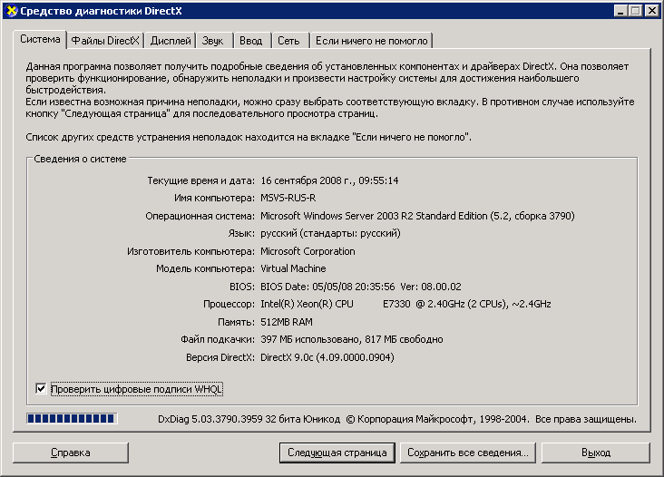

# Уровни графической отрисовки
Уровень отрисовки определяет уровень возможностей графического оборудования и производительность для устройства, на котором выполняется приложение [!INCLUDE[TLA2#tla_winclient](../../../../includes/tla2sharptla-winclient-md.md)].  

   
## Графическое оборудование  
 Ниже перечислены возможности графического оборудования, которые сильнее всего влияют на уровни отрисовки.  
  
- **Видеопамять**. Объем видеопамяти графического оборудования определяет размер и число буферов, которые можно использовать для компоновки графики.  
  
- **Построитель текстуры**. Построитель текстуры — это функция обработки графики, вычисляющая эффекты на уровне пикселей. В зависимости от разрешения отображаемой графики может быть несколько миллионов пикселей, которые необходимо обработать для каждого отображаемого кадра.  
  
- **Вершинный построитель текстуры**. Вершинный построитель текстуры — это функция обработки графики для выполнения математических операций над данными вершин объекта.  
  
- **Поддержка мультитекстурирования**. Поддержка мультитекстурирования относится к возможности применить две и более разных текстур во время операции смешения на объекте трехмерной графики. Степень многотекстурной поддержки определяется числом мультитекстурных модулей на графическом оборудовании.  
  
   
## Определения уровней отрисовки  
 Возможности графического оборудования определяют возможности отрисовки приложения [!INCLUDE[TLA2#tla_winclient](../../../../includes/tla2sharptla-winclient-md.md)]. Система [!INCLUDE[TLA2#tla_winclient](../../../../includes/tla2sharptla-winclient-md.md)] определяет три уровня отрисовки.  
  
- **Уровень отрисовки 0**. Аппаратное ускорение графики отсутствует. Все графические возможности реализуются с использованием программного ускорения. Версия DirectX версии ниже версии 9,0.  
  
- **Уровень отрисовки 1**. Некоторые графические функции используют аппаратное ускорение графики. Версия DirectX больше или равна версии 9,0.  
  
- **Уровень отрисовки 2**. Большинство графических функций используют аппаратное ускорение графики. Версия DirectX больше или равна версии 9,0.  
  
 Свойство <xref:System.Windows.Media.RenderCapability.Tier%2A?displayProperty=nameWithType> позволяет извлекать уровень отрисовки во время выполнения приложения. Уровень отрисовки используется, чтобы определить, поддерживает ли устройство те или иные функции графики аппаратного ускорения. Затем приложение может принимать разные пути кода во время выполнения в зависимости от поддерживаемого устройством уровня отрисовки.  
  
### Уровень отрисовки 0  
 Значение 0 для уровня отрисовки означает, что аппаратное ускорение графики недоступно для приложения на устройстве. На этом уровне нужно исходить из того, что вся графика будет отрисовываться программным обеспечением без аппаратного ускорения. Функциональные возможности этого уровня соответствуют версии DirectX менее 9,0.  
  
### Уровень отрисовки 1 и уровень отрисовки 2  
  
> [!NOTE]
> Начиная с .NET Framework 4, уровень отрисовки 1 был переопределен для включения только графического оборудования, поддерживающего DirectX 9,0 или более поздней версии. Графическое оборудование, поддерживающее DirectX 7 или 8, теперь определяется как уровень отрисовки 0.  
  
 Отрисовка уровня 1 или 2 означает, что большая часть графических возможностей [!INCLUDE[TLA2#tla_winclient](../../../../includes/tla2sharptla-winclient-md.md)] будет использовать аппаратное ускорение, если необходимые системные ресурсы доступны и не исчерпаны. Соответствует версии DirectX, которая больше или равна 9,0.  
  
 В таблице ниже приводятся различия в требованиях к графическому оборудованию для уровней отрисовки 1 и 2:  
  
|Возможность|Уровень 1|Уровень 2|  
|-------------|------------|------------|  
|Версия DirectX|Должно быть больше или равно 9.0.|Должно быть больше или равно 9.0.|  
|Видеопамять|Должно быть больше или равно 60 МБ.|Должно быть больше или равно 120 МБ.|  
|Построитель текстуры|Уровень версии должен быть больше или равен версии 2.0.|Уровень версии должен быть больше или равен версии 2.0.|  
|Вершинный построитель текстуры|Без требований.|Уровень версии должен быть больше или равен версии 2.0.|  
|Модули мультитекстурирования|Без требований.|Число модулей должно быть больше или равно 4.|  
  
 Следующие функции и возможности обеспечиваются аппаратным ускорением для уровней отрисовки 1 и 2.  
  
|Возможность|Примечания|  
|-------------|-----------|  
|Двухмерная отрисовка|Поддерживается большинство двухмерных отрисовок.|  
|Растеризация 3D|Поддерживается большинство трехмерных растеризаций.|  
|Трехмерная анизотропная фильтрация|[!INCLUDE[TLA2#tla_winclient](../../../../includes/tla2sharptla-winclient-md.md)] пытается использовать анизотропную фильтрацию при отрисовке трехмерного содержимого. Анизотропная фильтрация используется для повышения качества изображения текстур на удаленных поверхностях, которые находятся под большим углом по отношению к камере.|  
|Трехмерное MIP-сопоставление|[!INCLUDE[TLA2#tla_winclient](../../../../includes/tla2sharptla-winclient-md.md)] пытается использовать MIP-сопоставление при отрисовке трехмерного содержимого. Сопоставление MIP улучшает качество рендеринга текстур, когда текстура занимает меньшее поле представления в <xref:System.Windows.Controls.Viewport3D>.|  
|Радиальные градиенты|Хотя это и поддерживается, Избегайте использования <xref:System.Windows.Media.RadialGradientBrush> для больших объектов.|  
|Вычисления трехмерного освещения|[!INCLUDE[TLA2#tla_winclient](../../../../includes/tla2sharptla-winclient-md.md)] выполняет освещение на уровне вершин, т. е. интенсивность света вычисляется на каждой вершине для каждого материала, применяемого к сетке.|  
|Отрисовка текста|В отрисовке шрифта на субпиксельном уровне используются доступные построители текстур на графическом оборудовании.|  
  
 Следующие функции и возможности обеспечиваются аппаратным ускорением для уровня отрисовки 2.  
  
|Возможность|Примечания|  
|-------------|-----------|  
|Трехмерное сглаживание|Трехмерное сглаживание поддерживается только в операционных системах, поддерживающих модель WDDM, например Windows Vista и Windows 7.|  
  
 Следующие функции и возможности **не** обеспечиваются аппаратным ускорением.  
  
|Возможность|Примечания|  
|-------------|-----------|  
|Содержимое вывода|Все содержимое вывода отображается с помощью программного конвейера [!INCLUDE[TLA2#tla_winclient](../../../../includes/tla2sharptla-winclient-md.md)].|  
|Растровое содержимое, использующее <xref:System.Windows.Media.Imaging.RenderTargetBitmap>|Любое содержимое, отображаемое с помощью метода <xref:System.Windows.Media.Imaging.RenderTargetBitmap.Render%2A> <xref:System.Windows.Media.Imaging.RenderTargetBitmap>.|  
|Мозаичное содержимое, использующее <xref:System.Windows.Media.TileBrush>|Любое мозаичное содержимое, в котором для свойства <xref:System.Windows.Media.TileBrush.TileMode%2A> <xref:System.Windows.Media.TileBrush> задано значение <xref:System.Windows.Media.TileMode.Tile>.|  
|Поверхности, которые превышают максимальный размер текстуры графического оборудования|Для большинства графических устройств большие поверхности имеют размер 2048 x 2048 или 4096 x 4096 пикселей.|  
|Любая операция, требования к видеопамяти которой превышают объем памяти графического оборудования|Можно отслеживать использование видеопамяти приложения, используя средство Perforator, включенное в [WPF Performance Suite](https://docs.microsoft.com/previous-versions/dotnet/netframework-4.0/aa969767(v=vs.100)) в комплекте SDK Windows.|  
|Многослойные окна|Многослойные окна позволяют приложениям [!INCLUDE[TLA2#tla_winclient](../../../../includes/tla2sharptla-winclient-md.md)] отображать содержимое на экране в непрямоугольных окнах. В операционных системах, поддерживающих модель WDDM, например Windows Vista и Windows 7, многоуровневые окна работают с аппаратным ускорением. В других системах, таких как [!INCLUDE[winxp](../../../../includes/winxp-md.md)], многоуровневые окна отрисовываются программным обеспечением без аппаратного ускорения.   Многослойные окна можно включить в [!INCLUDE[TLA2#tla_winclient](../../../../includes/tla2sharptla-winclient-md.md)], задав следующие свойства <xref:System.Windows.Window>.   -   <xref:System.Windows.Window.WindowStyle%2A> = <xref:System.Windows.WindowStyle.None> -   <xref:System.Windows.Window.AllowsTransparency%2A> = `true` -   <xref:System.Windows.Controls.Control.Background%2A> = <xref:System.Windows.Media.Brushes.Transparent%2A>|  
  
   
## Другие ресурсы  
 Следующие ресурсы могут помочь проанализировать характеристики производительности вашего приложения [!INCLUDE[TLA2#tla_winclient](../../../../includes/tla2sharptla-winclient-md.md)].  
  
### Настройки реестра графической отрисовки  
 [!INCLUDE[TLA2#tla_winclient](../../../../includes/tla2sharptla-winclient-md.md)] включает четыре параметра реестра для управления функциями отрисовки [!INCLUDE[TLA2#tla_winclient](../../../../includes/tla2sharptla-winclient-md.md)].  
  
|Параметр|Описание|  
|-------------|-----------------|  
|**Отключить аппаратное ускорение**|Указывает, следует ли включить аппаратное ускорение.|  
|**Максимальное значение мультисэмплинга**|Указывает степень множественной выборки для сглаживания трехмерного содержимого.|  
|**Требуемая дата видеодрайвера**|Указывает, отключает ли система аппаратное ускорение для драйверов, выпущенных до ноября 2004 г.|  
|**Использовать средство программной прорисовки**|Указывает, следует ли [!INCLUDE[TLA2#tla_winclient](../../../../includes/tla2sharptla-winclient-md.md)] использовать средство программной прорисовки.|  
  
 Эти параметры доступны любой внешней служебной программе настройки, которая знает, как ссылаться на параметры реестра [!INCLUDE[TLA2#tla_winclient](../../../../includes/tla2sharptla-winclient-md.md)]. Эти параметры также можно создавать или изменять, обращаясь к значениям напрямую с помощью редактора реестра Windows. Более подробную информацию см. в разделе [Настройки реестра графической отрисовки](../graphics-multimedia/graphics-rendering-registry-settings.md).  
  
### Средства профилирования производительности WPF  
 В состав [!INCLUDE[TLA2#tla_winclient](../../../../includes/tla2sharptla-winclient-md.md)] входит пакет инструментов для профилирования производительности, с помощью которых можно проанализировать поведение приложения во время выполнения и определить, каким образом можно повысить производительность. В следующей таблице перечислены средства профилирования производительности, которые включены в средство Windows SDK, WPF Performance Suite:  
  
|Средство|Описание|  
|----------|-----------------|  
|Perforator|Используется для анализа поведения отрисовки.|  
|Visual Profiler|Служит для профилирования использования служб [!INCLUDE[TLA2#tla_winclient](../../../../includes/tla2sharptla-winclient-md.md)], например обработки макета и событий, по элементам в визуальном дереве.|  
  
 WPF Performance Suite обеспечивает многофункциональное графическое представление данных производительности. Дополнительные сведения о средствах производительности WPF см. в разделе [WPF Performance Suite](https://docs.microsoft.com/previous-versions/dotnet/netframework-4.0/aa969767(v=vs.100)).  
  
### средство диагностики DirectX  
 Средство диагностики DirectX (dxdiag. exe) призвано помочь в устранении неполадок, связанных с DirectX. Папка установки по умолчанию для средства диагностики DirectX:  
  
 `~\Windows\System32`  
  
 При запуске средства диагностики DirectX в главном окне содержится набор вкладок, позволяющих отображать и диагностировать сведения, относящиеся к DirectX. Например, на вкладке **система** содержатся системные сведения о компьютере и указывается версия DirectX, установленная на компьютере.  
  
   
Главное окно инструмента диагностики DirectX  
  
## См. также:

- <xref:System.Windows.Media.RenderCapability>
- <xref:System.Windows.Media.RenderOptions>
- [Улучшение производительности приложений WPF](optimizing-wpf-application-performance.md)
- [WPF Performance Suite](https://docs.microsoft.com/previous-versions/dotnet/netframework-4.0/aa969767(v=vs.100))
- [Настройки реестра графической отрисовки](../graphics-multimedia/graphics-rendering-registry-settings.md)
- [Советы и рекомендации по анимации](../graphics-multimedia/animation-tips-and-tricks.md)
