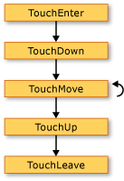
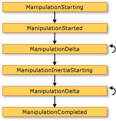

# Общие сведения о входных данных
Подсистема [!INCLUDE[TLA#tla_winclient](../../../../includes/tlasharptla-winclient-md.md)] предоставляет мощный API для получения входных данных с различных устройств, включая мышь, клавиатуру, касание и перо. В этом разделе описываются службы, предоставляемые [!INCLUDE[TLA2#tla_winclient](../../../../includes/tla2sharptla-winclient-md.md)], и объясняется архитектура систем ввода.

## API ввода
 Основной интерфейс ввода API находится в классах базовых элементов: <xref:System.Windows.UIElement>, <xref:System.Windows.ContentElement>, <xref:System.Windows.FrameworkElement>и <xref:System.Windows.FrameworkContentElement>.  Дополнительные сведения о базовых элементах см. в разделе [Обзор базовых элементов](base-elements-overview.md).  Эти классы предоставляют функциональность для входных событий, связанных, например, с нажатием клавиш, кнопками мыши, колесиком мыши, движением мыши, управлением фокусом и захватом мыши. Поместив входной API в базовые элементы, вместо того чтобы обрабатывать все входные события как службу, архитектура ввода позволяет источнику входных событий в пользовательском интерфейсе и поддерживать схему маршрутизации событий, в которой несколько элементов имеют ОПП. ортунити для управления входным событием. Многие события ввода имеют пару связанных с ними событий.  Например, событие нажатия клавиши связано с событиями <xref:System.Windows.Input.Keyboard.KeyDown> и <xref:System.Windows.Input.Keyboard.PreviewKeyDown>.  Различие этих событий заключается в способе их маршрутизации в целевой элемент.  События предварительного просмотра проходят вниз по дереву элементов от корневого элемента в целевой элемент.  События восходящей маршрутизации поднимаются от целевого элемента в корневой элемент.  Маршрутизация событий в [!INCLUDE[TLA2#tla_winclient](../../../../includes/tla2sharptla-winclient-md.md)] рассматривается более подробно далее в этом обзоре и в разделе [Общие сведения о перенаправленных событиях](routed-events-overview.md).

### Классы Keyboard и Mouse
 Помимо входного API для классов базовых элементов, класс <xref:System.Windows.Input.Keyboard> и классы <xref:System.Windows.Input.Mouse> предоставляют дополнительный API для работы с вводом с клавиатуры и мыши.

 Примерами входного API для класса <xref:System.Windows.Input.Keyboard> являются свойства <xref:System.Windows.Input.Keyboard.Modifiers%2A>, которые возвращают <xref:System.Windows.Input.ModifierKeys> нажатой в данный момент, и метод <xref:System.Windows.Input.Keyboard.IsKeyDown%2A>, который определяет, нажата ли заданная клавиша.

 В следующем примере используется метод <xref:System.Windows.Input.Keyboard.GetKeyStates%2A>, чтобы определить, находится ли <xref:System.Windows.Input.Key> в некотором состоянии.

 [!code-csharp[keyargssnippetsample#KeyEventArgsKeyBoardGetKeyStates](~/samples/snippets/csharp/VS_Snippets_Wpf/KeyArgsSnippetSample/CSharp/Window1.xaml.cs#keyeventargskeyboardgetkeystates)]
 [!code-vb[keyargssnippetsample#KeyEventArgsKeyBoardGetKeyStates](~/samples/snippets/visualbasic/VS_Snippets_Wpf/KeyArgsSnippetSample/visualbasic/window1.xaml.vb#keyeventargskeyboardgetkeystates)]

 Примерами входного API для класса <xref:System.Windows.Input.Mouse> являются <xref:System.Windows.Input.Mouse.MiddleButton%2A>, который получает состояние средней кнопки мыши и <xref:System.Windows.Input.Mouse.DirectlyOver%2A>, который получает элемент, на который в данный момент наведен указатель мыши.

 В следующем примере определяется, находится ли <xref:System.Windows.Input.Mouse.LeftButton%2A> мыши в <xref:System.Windows.Input.MouseButtonState.Pressed>ном состоянии.

 [!code-csharp[mouserelatedsnippets#MouseRelatedSnippetsGetLeftButtonMouse](~/samples/snippets/csharp/VS_Snippets_Wpf/MouseRelatedSnippets/CSharp/Window1.xaml.cs#mouserelatedsnippetsgetleftbuttonmouse)]
 [!code-vb[mouserelatedsnippets#MouseRelatedSnippetsGetLeftButtonMouse](~/samples/snippets/visualbasic/VS_Snippets_Wpf/MouseRelatedSnippets/visualbasic/window1.xaml.vb#mouserelatedsnippetsgetleftbuttonmouse)]

 Классы <xref:System.Windows.Input.Mouse> и <xref:System.Windows.Input.Keyboard> более подробно рассматриваются в этом обзоре.

### Ввод с помощью пера
 [!INCLUDE[TLA2#tla_winclient](../../../../includes/tla2sharptla-winclient-md.md)] поддерживает интегрированную поддержку <xref:System.Windows.Input.Stylus>.  <xref:System.Windows.Input.Stylus> — это ввод с помощью пера, который представляет собой популярное на планшетном ПК.  [!INCLUDE[TLA2#tla_winclient](../../../../includes/tla2sharptla-winclient-md.md)] приложения могут рассматривать перо как мышь с помощью API мыши, но [!INCLUDE[TLA2#tla_winclient](../../../../includes/tla2sharptla-winclient-md.md)] также предоставляет абстракцию устройства пера, использующую модель, похожую на клавиатуру и мышь.  Все API-интерфейсы, связанные с пером, содержат слово «перо».

 Поскольку перо может действовать как мышь, приложения, поддерживающие только ввод с помощью мыши, по-прежнему могут автоматически получать определенный уровень поддержки пера. При использовании пера таким образом приложение получает возможность обработать соответствующее событие пера, а затем обрабатывает соответствующее событие мыши. Кроме того, через абстрактное устройство «перо» доступны также службы более высокого уровня, например рукописный ввод.  Дополнительные сведения о рукописном вводе см. в разделе [Начало работы с рукописным вводом](getting-started-with-ink.md).

## Маршрутизация событий
 <xref:System.Windows.FrameworkElement> может содержать другие элементы в качестве дочерних элементов в своей модели содержимого, формируя дерево элементов.  В [!INCLUDE[TLA2#tla_winclient](../../../../includes/tla2sharptla-winclient-md.md)] родительский элемент может участвовать во вводе, направленном в его дочерние элементы или другие потомки, путем обработки событий. Это особенно полезно для построения элементов управления из меньших элементов управления; этот процесс называется «составление элемента управления» или «компоновка». Дополнительные сведения о деревьях элементов и их связи с маршрутами событий см. в разделе [Деревья в WPF](trees-in-wpf.md).

 Маршрутизация событий — это процесс направления событий в несколько элементов, так что конкретный объект или элемент в маршруте может выбрать предоставление значительного отклика (посредством обработки) на событие, которое могло быть получено от другого элемента.  Перенаправленные события используют один из трех механизмов маршрутизации: прямую маршрутизацию, восходящую маршрутизацию и туннелирование.  При прямой маршрутизации уведомляется только исходный элемент и событие не перенаправляется ни в какие другие элементы. Однако прямое перенаправленное событие по-прежнему предоставляет некоторые дополнительные возможности, которые имеются только для перенаправленных событий, в отличие от стандартных событий CLR. Восходящая маршрутизация работает вверх по дереву элементов, уведомляя элемент, который является источником события, затем его родительский элемент и т. д.  Туннелирование начинается в корне дерева элементов и работает вниз, заканчивая элементом, который является источником.  Дополнительные сведения о перенаправленных событиях см. в разделе [Общие сведения о перенаправленных событиях](routed-events-overview.md).

 События ввода [!INCLUDE[TLA2#tla_winclient](../../../../includes/tla2sharptla-winclient-md.md)] обычно представлены парами, состоящими из событий нисходящей и восходящей маршрутизации.  События нисходящей маршрутизации отличаются от событий восходящей маршрутизации префиксом Preview.  Например, <xref:System.Windows.Input.Mouse.PreviewMouseMove> является версией туннелирования события перемещения мыши, а <xref:System.Windows.Input.Mouse.MouseMove> является восходящей версией этого события. Такое связывание событий представляет собой соглашение, которое реализуется на уровне элемента и не является неотъемлемой характеристикой системы событий [!INCLUDE[TLA2#tla_winclient](../../../../includes/tla2sharptla-winclient-md.md)]. Дополнительные сведения см. в разделе «События ввода WPF» статьи [Общие сведения о перенаправленных событиях](routed-events-overview.md).

## Обработка событий ввода
 Для получения входных данных в элементе обработчик событий должен быть связан с данным конкретным событием.  В [!INCLUDE[TLA2#tla_xaml](../../../../includes/tla2sharptla-xaml-md.md)] это осуществляется напрямую: вы указываете имя события в качестве атрибута элемента, который будет перехватывать это событие.  Затем в качестве значения этого атрибута вы задаете имя обработчика событий, который можно определить на основе делегата.  Обработчик событий должен быть написан в коде, например C# , и может быть помещен в файл кода программной части.

 События клавиатуры возникают, когда операционная система сообщает о действиях клавиш, которые происходят, когда фокус клавиатуры находится в элементе. События мыши и пера делятся на две категории: события, сообщающие об изменениях положения указателя относительно элемента, и события, сообщающие об изменениях состояния кнопок устройства.

### Пример события ввода с клавиатуры
 В следующем примере перехватывается событие нажатия клавиши со стрелкой влево.  Создается <xref:System.Windows.Controls.StackPanel> с <xref:System.Windows.Controls.Button>.  Обработчик событий для прослушивания нажатия клавиши со стрелкой влево прикрепляется к экземпляру <xref:System.Windows.Controls.Button>.

 В первом разделе примера создается <xref:System.Windows.Controls.StackPanel> и <xref:System.Windows.Controls.Button> и присоединяется обработчик событий для <xref:System.Windows.UIElement.KeyDown>.

 [!code-xaml[InputOvw#Input_OvwKeyboardExampleXAML](~/samples/snippets/csharp/VS_Snippets_Wpf/InputOvw/CSharp/Page1.xaml#input_ovwkeyboardexamplexaml)]

 [!code-csharp[InputOvw#Input_OvwKeyboardExampleUICodeBehind](~/samples/snippets/csharp/VS_Snippets_Wpf/InputOvw/CSharp/Page1.xaml.cs#input_ovwkeyboardexampleuicodebehind)]
 [!code-vb[InputOvw#Input_OvwKeyboardExampleUICodeBehind](~/samples/snippets/visualbasic/VS_Snippets_Wpf/InputOvw/VisualBasic/Page1.xaml.vb#input_ovwkeyboardexampleuicodebehind)]

 Второй раздел прописывается в коде, и в нем определяется обработчик событий.  Если нажата клавиша со стрелкой влево и <xref:System.Windows.Controls.Button> имеет фокус клавиатуры, выполняется обработчик и изменяется цвет <xref:System.Windows.Controls.Control.Background%2A> <xref:System.Windows.Controls.Button>.  Если клавиша нажата, но не является клавишей со стрелкой влево, <xref:System.Windows.Controls.Control.Background%2A> цвет <xref:System.Windows.Controls.Button> меняется на начальный цвет.

 [!code-csharp[InputOvw#Input_OvwKeyboardExampleHandlerCodeBehind](~/samples/snippets/csharp/VS_Snippets_Wpf/InputOvw/CSharp/Page1.xaml.cs#input_ovwkeyboardexamplehandlercodebehind)]
 [!code-vb[InputOvw#Input_OvwKeyboardExampleHandlerCodeBehind](~/samples/snippets/visualbasic/VS_Snippets_Wpf/InputOvw/VisualBasic/Page1.xaml.vb#input_ovwkeyboardexamplehandlercodebehind)]

### Пример события ввода с помощью мыши
 В следующем примере цвет <xref:System.Windows.Controls.Control.Background%2A> <xref:System.Windows.Controls.Button> изменяется, когда указатель мыши попадает на <xref:System.Windows.Controls.Button>.  Цвет <xref:System.Windows.Controls.Control.Background%2A> восстанавливается, когда указатель мыши покидает <xref:System.Windows.Controls.Button>.

 В первом разделе примера создается <xref:System.Windows.Controls.StackPanel> и элемент управления <xref:System.Windows.Controls.Button> и присоединяются обработчики событий для <xref:System.Windows.UIElement.MouseEnter> и <xref:System.Windows.UIElement.MouseLeave> событий к <xref:System.Windows.Controls.Button>.

 [!code-xaml[InputOvw#Input_OvwMouseExampleXAML](~/samples/snippets/csharp/VS_Snippets_Wpf/InputOvw/CSharp/Page1.xaml#input_ovwmouseexamplexaml)]

 [!code-csharp[InputOvw#Input_OvwMouseExampleUICodeBehind](~/samples/snippets/csharp/VS_Snippets_Wpf/InputOvw/CSharp/Page1.xaml.cs#input_ovwmouseexampleuicodebehind)]
 [!code-vb[InputOvw#Input_OvwMouseExampleUICodeBehind](~/samples/snippets/visualbasic/VS_Snippets_Wpf/InputOvw/VisualBasic/Page1.xaml.vb#input_ovwmouseexampleuicodebehind)]

 Второй раздел примера прописывается в коде, и в нем определяются обработчики событий.  Когда указатель мыши попадает в <xref:System.Windows.Controls.Button>, цвет <xref:System.Windows.Controls.Control.Background%2A> <xref:System.Windows.Controls.Button> меняется на <xref:System.Windows.Media.Brushes.SlateGray%2A>.  Когда указатель мыши покидает <xref:System.Windows.Controls.Button>, цвет <xref:System.Windows.Controls.Control.Background%2A> <xref:System.Windows.Controls.Button> меняется обратно на <xref:System.Windows.Media.Brushes.AliceBlue%2A>.

 [!code-csharp[InputOvw#Input_OvwMouseExampleEneterHandler](~/samples/snippets/csharp/VS_Snippets_Wpf/InputOvw/CSharp/Page1.xaml.cs#input_ovwmouseexampleeneterhandler)]
 [!code-vb[InputOvw#Input_OvwMouseExampleEneterHandler](~/samples/snippets/visualbasic/VS_Snippets_Wpf/InputOvw/VisualBasic/Page1.xaml.vb#input_ovwmouseexampleeneterhandler)]

 [!code-csharp[InputOvw#Input_OvwMouseExampleLeaveHandler](~/samples/snippets/csharp/VS_Snippets_Wpf/InputOvw/CSharp/Page1.xaml.cs#input_ovwmouseexampleleavehandler)]
 [!code-vb[InputOvw#Input_OvwMouseExampleLeaveHandler](~/samples/snippets/visualbasic/VS_Snippets_Wpf/InputOvw/VisualBasic/Page1.xaml.vb#input_ovwmouseexampleleavehandler)]

## Текстовый ввод
 Событие <xref:System.Windows.ContentElement.TextInput> позволяет ожидать ввода текста независимым от устройства образом. Клавиатура является основным средством ввода текста, но текст также можно вводить и с помощью речи, рукописного ввода и других устройств.

 Для ввода с клавиатуры [!INCLUDE[TLA2#tla_winclient](../../../../includes/tla2sharptla-winclient-md.md)] сначала отправляет соответствующие события <xref:System.Windows.ContentElement.KeyDown>/<xref:System.Windows.ContentElement.KeyUp>. Если эти события не обрабатываются и ключ является текстовым (а не управляющим ключом, например стрелками направления или функциональными клавишами), то возникает событие <xref:System.Windows.ContentElement.TextInput>.  Не всегда существует простое однозначное сопоставление между <xref:System.Windows.ContentElement.KeyDown>/<xref:System.Windows.ContentElement.KeyUp> и <xref:System.Windows.ContentElement.TextInput> событиями, так как несколько нажатий клавиш могут создавать один символ текстового ввода, а при нажатии одной клавиши можно создавать многосимвольные строки.  Это особенно справедливо для таких языков, как китайский, японский и корейский, которые используют редакторы методов ввода (IME) для создания тысяч возможных символов в соответствующих алфавитах.

 Когда [!INCLUDE[TLA2#tla_winclient](../../../../includes/tla2sharptla-winclient-md.md)] отправляет событие <xref:System.Windows.ContentElement.KeyUp>/<xref:System.Windows.ContentElement.KeyDown>, <xref:System.Windows.Input.KeyEventArgs.Key%2A> устанавливается в <xref:System.Windows.Input.Key.System?displayProperty=nameWithType>, если нажатия клавиш могут стать частью события <xref:System.Windows.ContentElement.TextInput> (например, если нажата клавиша ALT + S). Это позволяет коду в обработчике событий <xref:System.Windows.ContentElement.KeyDown> проверять наличие <xref:System.Windows.Input.Key.System?displayProperty=nameWithType> и, если он найден, оставить обработку обработчика последующего события <xref:System.Windows.ContentElement.TextInput>. В таких случаях для определения исходного нажатия клавиш можно использовать различные свойства аргумента <xref:System.Windows.Input.TextCompositionEventArgs>. Аналогично, если редактор IME активен, <xref:System.Windows.Input.Key> имеет значение <xref:System.Windows.Input.Key.ImeProcessed?displayProperty=nameWithType>, а <xref:System.Windows.Input.KeyEventArgs.ImeProcessedKey%2A> возвращает исходное нажатие клавиши или нажатия клавиш.

 В следующем примере определяется обработчик для события <xref:System.Windows.Controls.Primitives.ButtonBase.Click> и обработчика события <xref:System.Windows.UIElement.KeyDown>.

 Первый сегмент кода или разметки создает пользовательский интерфейс.

 [!code-xaml[InputOvw#Input_OvwTextInputXAML](~/samples/snippets/csharp/VS_Snippets_Wpf/InputOvw/CSharp/Page1.xaml#input_ovwtextinputxaml)]

 [!code-csharp[InputOvw#Input_OvwTextInputUICodeBehind](~/samples/snippets/csharp/VS_Snippets_Wpf/InputOvw/CSharp/Page1.xaml.cs#input_ovwtextinputuicodebehind)]
 [!code-vb[InputOvw#Input_OvwTextInputUICodeBehind](~/samples/snippets/visualbasic/VS_Snippets_Wpf/InputOvw/VisualBasic/Page1.xaml.vb#input_ovwtextinputuicodebehind)]

 Второй сегмент кода содержит обработчики событий.

 [!code-csharp[InputOvw#Input_OvwTextInputHandlersCodeBehind](~/samples/snippets/csharp/VS_Snippets_Wpf/InputOvw/CSharp/Page1.xaml.cs#input_ovwtextinputhandlerscodebehind)]
 [!code-vb[InputOvw#Input_OvwTextInputHandlersCodeBehind](~/samples/snippets/visualbasic/VS_Snippets_Wpf/InputOvw/VisualBasic/Page1.xaml.vb#input_ovwtextinputhandlerscodebehind)]

 Так как события ввода поднимаются вверх по маршруту события, <xref:System.Windows.Controls.StackPanel> получает входные данные независимо от того, какой элемент имеет фокус клавиатуры. Первым уведомлен элемент управления <xref:System.Windows.Controls.TextBox>, а обработчик `OnTextInputKeyDown` вызывается только в том случае, если <xref:System.Windows.Controls.TextBox> не обрабатывает входные данные. Если вместо события <xref:System.Windows.UIElement.KeyDown> используется <xref:System.Windows.UIElement.PreviewKeyDown> событие, сначала вызывается обработчик `OnTextInputKeyDown`.

 В этом примере логика обработки пишется два раза — один раз для CTRL+O и еще один раз для события нажатия кнопки. Это можно упростить, если вместо прямой обработки событий ввода использовать команды.  Команды описываются в этом обзоре и в разделе [Общие сведения о системе команд](commanding-overview.md).

## Касание и манипуляция
 Новое оборудование и API в операционной системе Windows 7 дают приложениям возможность получать входные данные от нескольких касаний одновременно. [!INCLUDE[TLA2#tla_winclient](../../../../includes/tla2sharptla-winclient-md.md)] позволяет приложениям обнаруживать сенсорный ввод и реагировать на него так же, как на другой ввод, например с помощью мыши или клавиатуры, путем создания событий при возникновении сенсорного ввода.

 [!INCLUDE[TLA2#tla_winclient](../../../../includes/tla2sharptla-winclient-md.md)] предоставляет два типа событий для сенсорного ввода: события касания и события манипуляции. События касания предоставляют необработанные данные о каждом пальце на сенсорном экране и его перемещениях. События манипуляции интерпретируют ввод как определенные действия. В этом разделе рассматриваются оба типа событий.

### Предварительные требования
 Для разработки приложений, реагирующих на сенсорный ввод, необходимы следующие компоненты.

- Visual Studio 2010.

- Windows 7.

- Устройство, которое поддерживает Windows Touch, например сенсорный экран.

### Терминология
 При обсуждении сенсорного ввода используются следующие термины.

- **Касание** — это тип ввода пользователя, распознаваемый Windows 7. Обычно касание инициируется, когда пользователь прикасается пальцами к сенсорному экрану. Обратите внимание, что такие устройства, как сенсорная панель, обычно используемая в ноутбуках, не поддерживают касание, если подобное устройство просто преобразует положение и движение пальца как ввод с помощью мыши.

- **Мультикасание** — это касание, которое происходит одновременно в нескольких точках. Windows 7 и [!INCLUDE[TLA2#tla_winclient](../../../../includes/tla2sharptla-winclient-md.md)] поддерживают мультикасание. Всякий раз, когда в документации для [!INCLUDE[TLA2#tla_winclient](../../../../includes/tla2sharptla-winclient-md.md)] идет речь о касании, это относится и мультикасанию.

- **Манипуляция** происходит, когда касание интерпретируется как физическое действие, которое применяется к объекту. В [!INCLUDE[TLA2#tla_winclient](../../../../includes/tla2sharptla-winclient-md.md)], события манипуляции интерпретируют ввод как сдвиг, расширение или поворот.

- `touch device` — это устройство для сенсорного ввода, например одним пальцем на сенсорном экране.

### Элементы управления, реагирующие на касания
 Следующие элементы управления можно прокручивать, проводя пальцем по элементу управления, если имеется содержимое, которое находится вне области просмотра.

- <xref:System.Windows.Controls.ComboBox>

- <xref:System.Windows.Controls.ContextMenu>

- <xref:System.Windows.Controls.DataGrid>

- <xref:System.Windows.Controls.ListBox>

- <xref:System.Windows.Controls.ListView>

- <xref:System.Windows.Controls.MenuItem>

- <xref:System.Windows.Controls.TextBox>

- <xref:System.Windows.Controls.ToolBar>

- <xref:System.Windows.Controls.TreeView>

 <xref:System.Windows.Controls.ScrollViewer> определяет присоединенное <xref:System.Windows.Controls.ScrollViewer.PanningMode%2A?displayProperty=nameWithType> свойство, которое позволяет указать, включено ли сенсорное панорамирование по горизонтали, вертикали, обоим или ни одному. Свойство <xref:System.Windows.Controls.ScrollViewer.PanningDeceleration%2A?displayProperty=nameWithType> указывает скорость, с которой замедляется прокрутка, когда пользователь отрывает палец от сенсорного экрана. Присоединенное свойство <xref:System.Windows.Controls.ScrollViewer.PanningRatio%2A?displayProperty=nameWithType> указывает отношение смещения прокрутки к смещению манипуляции.

### События касания
 Базовые классы, <xref:System.Windows.UIElement>, <xref:System.Windows.UIElement3D>и <xref:System.Windows.ContentElement>определяют события, на которые можно подписываться, чтобы приложение отвечало на сенсорный ввод. События касания полезны в тех случаях, когда приложение интерпретирует касание не как действие с объектом. Например, приложение, в котором пользователь может рисовать одним или несколькими пальцами, будет подписываться на события касания.

 Все эти три класса определяют следующие события, которые ведут себя одинаково независимо от определяющего класса.

- <xref:System.Windows.UIElement.TouchDown>

- <xref:System.Windows.UIElement.TouchMove>

- <xref:System.Windows.UIElement.TouchUp>

- <xref:System.Windows.UIElement.TouchEnter>

- <xref:System.Windows.UIElement.TouchLeave>

- <xref:System.Windows.UIElement.PreviewTouchDown>

- <xref:System.Windows.UIElement.PreviewTouchMove>

- <xref:System.Windows.UIElement.PreviewTouchUp>

- <xref:System.Windows.UIElement.GotTouchCapture>

- <xref:System.Windows.UIElement.LostTouchCapture>

 Как и события клавиатуры и мыши, события сенсорного ввода являются перенаправленными событиями. События нисходящей маршрутизации начинаются с `Preview`, а события восходящей маршрутизации — с `Touch`. Дополнительные сведения о перенаправленных событиях см. в разделе [Общие сведения о перенаправленных событиях](routed-events-overview.md). При обработке этих событий можно получить расположение входных данных относительно любого элемента, вызвав метод <xref:System.Windows.Input.TouchEventArgs.GetTouchPoint%2A> или <xref:System.Windows.Input.TouchEventArgs.GetIntermediateTouchPoints%2A>.

 Чтобы лучше объяснить взаимодействие между событиями касания, рассмотрим ситуацию, когда пользователь помещает один палец в элемент, а затем убирает палец из этого элемента. На следующем рисунке показано выполнение событий восходящей маршрутизации (для простоты события нисходящей маршрутизации не указаны).

  События касания

 Последовательность событий на предыдущем рисунке приведена в следующем списке.

1. Событие <xref:System.Windows.UIElement.TouchEnter> возникает один раз, когда пользователь помещает палец на элемент.

2. Событие <xref:System.Windows.UIElement.TouchDown> возникает один раз.

3. Событие <xref:System.Windows.UIElement.TouchMove> возникает несколько раз, когда пользователь перемещает палец внутри элемента.

4. Событие <xref:System.Windows.UIElement.TouchUp> возникает один раз, когда пользователь отрывает палец от элемента.

5. Событие <xref:System.Windows.UIElement.TouchLeave> возникает один раз.

 При использовании более двух пальцев, события возникают для каждого пальца.

### События манипуляции
 В случаях, когда приложение позволяет пользователю манипулировать объектом, класс <xref:System.Windows.UIElement> определяет события манипуляции. В отличие от событий касания, которые сообщают только положение точки касания, события манипуляции сообщают, как можно интерпретировать ввод. Существует три типа манипуляции: сдвиг, расширение и поворот. В следующем списке показывается, как вызываются эти три типа манипуляции.

- Поместите палец на объект и переместите палец по сенсорному экрану, чтобы выполнить сдвиг. Обычно такое действие перемещает объект.

- Поместите два пальца на объект и сведите или разведите их, чтобы выполнить расширение. Обычно такое действие изменяет размеры объекта.

- Поместите два пальца на объект и поворачивайте их вокруг друг друга, чтобы выполнить действие поворота. Обычно такое действие выполняет циклический сдвиг объекта.

 Можно одновременно выполнять несколько типов манипуляций.

 Реализуя реагирование объектов на манипуляции, можно создать видимость инерции объекта. Тогда объекты смогут имитировать физический мир. Например, если вы достаточно сильно толкнете книгу по столу, то после того как вы ее отпустите, она продолжит движение. [!INCLUDE[TLA2#tla_winclient](../../../../includes/tla2sharptla-winclient-md.md)] позволяет имитировать это поведение путем вызова событий манипуляции после того, как пальцы пользователя отпускают объект.

 Сведения о том, как создать приложение, которое дает пользователю возможность перемещать, масштабировать и поворачивать объект, см. в статье [Пошаговое руководство. Создание первого приложения для обработки касаний](walkthrough-creating-your-first-touch-application.md).

 <xref:System.Windows.UIElement> определяет следующие события манипуляции.

- <xref:System.Windows.UIElement.ManipulationStarting>

- <xref:System.Windows.UIElement.ManipulationStarted>

- <xref:System.Windows.UIElement.ManipulationDelta>

- <xref:System.Windows.UIElement.ManipulationInertiaStarting>

- <xref:System.Windows.UIElement.ManipulationCompleted>

- <xref:System.Windows.UIElement.ManipulationBoundaryFeedback>

 По умолчанию <xref:System.Windows.UIElement> не получает эти события манипуляции. Чтобы получить события манипуляции в <xref:System.Windows.UIElement>, задайте для <xref:System.Windows.UIElement.IsManipulationEnabled%2A?displayProperty=nameWithType> значение `true`.

#### Путь выполнения событий манипуляции
 Рассмотрим сценарий, когда пользователь «бросает» объект. Пользователь ставит палец на объект, перемещает палец по сенсорному экрану на короткое расстояние, а затем поднимает палец, когда тот еще движется. В результате объект будет перемещаться под пальцем пользователя и продолжит движение после того, как пользователь поднимет палец.

 На следующем рисунке показан путь выполнения событий манипуляции и важные сведения о каждом событии.

  События манипуляции

 Последовательность событий на предыдущем рисунке приведена в следующем списке.

1. Событие <xref:System.Windows.UIElement.ManipulationStarting> возникает, когда пользователь помещает палец на объект. Помимо прочего, это событие позволяет задать свойство <xref:System.Windows.Input.ManipulationStartingEventArgs.ManipulationContainer%2A>. В последующих событиях расположение манипуляции будет относиться к <xref:System.Windows.Input.ManipulationStartingEventArgs.ManipulationContainer%2A>. В событиях, отличных от <xref:System.Windows.UIElement.ManipulationStarting>, это свойство доступно только для чтения, поэтому событием <xref:System.Windows.UIElement.ManipulationStarting> является единственный момент, когда можно задать это свойство.

2. Событие <xref:System.Windows.UIElement.ManipulationStarted> возникает далее. Это событие сообщает исходную точку манипуляции.

3. Событие <xref:System.Windows.UIElement.ManipulationDelta> возникает несколько раз, когда пальцы пользователя перемещаются на сенсорный экран. Свойство <xref:System.Windows.Input.ManipulationDeltaEventArgs.DeltaManipulation%2A> класса <xref:System.Windows.Input.ManipulationDeltaEventArgs> сообщает, интерпретируется ли манипуляция как перемещение, расширение или перевод. Здесь вы выполняете большую часть манипуляций с объектом.

4. Событие <xref:System.Windows.UIElement.ManipulationInertiaStarting> возникает, когда пальцы пользователя теряют контакт с объектом. Это событие позволяет указать замедление манипуляции во время инерции. Так объект может имитировать разные физические расстояния или атрибуты при вашем желании. Например, предположим, что в приложении имеются два объекта, представляющие элементы в физическом мире, один из которых тяжелее другого. Можно сделать так, чтобы более тяжелый объект замедлялся быстрее, чем более легкий.

5. Событие <xref:System.Windows.UIElement.ManipulationDelta> возникает несколько раз, когда происходит инерция. Обратите внимание, что это событие возникает, и когда пальцы пользователя двигаются по сенсорному экрану, и когда [!INCLUDE[TLA2#tla_winclient](../../../../includes/tla2sharptla-winclient-md.md)] имитирует инерцию. Иными словами, <xref:System.Windows.UIElement.ManipulationDelta> происходит до и после события <xref:System.Windows.UIElement.ManipulationInertiaStarting>. Свойство <xref:System.Windows.Input.ManipulationDeltaEventArgs.IsInertial%2A?displayProperty=nameWithType> сообщает, возникает ли событие <xref:System.Windows.UIElement.ManipulationDelta> во время инерции, поэтому можно проверить это свойство и выполнить различные действия в зависимости от его значения.

6. Событие <xref:System.Windows.UIElement.ManipulationCompleted> возникает при каждом завершении манипуляции и инерции. То есть после возникновения всех событий <xref:System.Windows.UIElement.ManipulationDelta> возникает событие <xref:System.Windows.UIElement.ManipulationCompleted>, сообщающее о завершении манипуляции.

 <xref:System.Windows.UIElement> также определяет событие <xref:System.Windows.UIElement.ManipulationBoundaryFeedback>. Это событие возникает при вызове метода <xref:System.Windows.Input.ManipulationDeltaEventArgs.ReportBoundaryFeedback%2A> в событии <xref:System.Windows.UIElement.ManipulationDelta>. Событие <xref:System.Windows.UIElement.ManipulationBoundaryFeedback> позволяет приложениям или компонентам предоставлять визуальную обратную связь, когда объект достигает границы. Например, класс <xref:System.Windows.Window> обрабатывает событие <xref:System.Windows.UIElement.ManipulationBoundaryFeedback>, чтобы окно было слегка перемещено при обнаружении его границы.

 Вы можете отменить манипуляцию, вызвав метод <xref:System.Windows.Input.ManipulationStartingEventArgs.Cancel%2A> для аргументов события в любом событии манипуляции, кроме события <xref:System.Windows.UIElement.ManipulationBoundaryFeedback>. При вызове <xref:System.Windows.Input.ManipulationStartingEventArgs.Cancel%2A>события манипуляции больше не вызываются, а для сенсорного ввода возникают события мыши. В следующей таблице описывается связь между моментом отмены манипуляции и событиями мыши, которые происходят.

|Событие, вызываемое отменой|События мыши, возникающие для ввода, который уже произошел|
|----------------------------------------|-----------------------------------------------------------------|
|<xref:System.Windows.UIElement.ManipulationStarting> и <xref:System.Windows.UIElement.ManipulationStarted>|События нажатия кнопки мыши.|
|<xref:System.Windows.UIElement.ManipulationDelta>|События нажатия кнопки мыши и перемещения мыши.|
|<xref:System.Windows.UIElement.ManipulationInertiaStarting> и <xref:System.Windows.UIElement.ManipulationCompleted>|События нажатия кнопки мыши, перемещения мыши и отпускания кнопки мыши.|

 Обратите внимание, что при вызове <xref:System.Windows.Input.ManipulationStartingEventArgs.Cancel%2A>, когда манипуляция находится в инерции, метод возвращает `false` и входные данные не вызывают события мыши.

### Связь между событиями касания и событиями манипуляции
 <xref:System.Windows.UIElement> всегда может получить события касания. Если свойство <xref:System.Windows.UIElement.IsManipulationEnabled%2A> имеет значение `true`, <xref:System.Windows.UIElement> может принимать как события касания, так и манипуляции.  Если событие <xref:System.Windows.UIElement.TouchDown> не обрабатывается (т. е. свойство <xref:System.Windows.RoutedEventArgs.Handled%2A> имеет значение `false`), логика манипуляции захватывает касание элемента и создает события манипуляции. Если свойство <xref:System.Windows.RoutedEventArgs.Handled%2A> имеет значение `true` в событии <xref:System.Windows.UIElement.TouchDown>, логика манипуляции не создает события манипуляции. На следующем рисунке показана связь между событиями касания и событиями манипуляции.

  событиями касания и манипуляции

 Следующий список описывает связь между событиями касания и манипуляции, показанными на предыдущем рисунке.

- Когда первое устройство сенсорного ввода создает событие <xref:System.Windows.UIElement.TouchDown> в <xref:System.Windows.UIElement>, логика манипуляции вызывает метод <xref:System.Windows.UIElement.CaptureTouch%2A>, который создает событие <xref:System.Windows.UIElement.GotTouchCapture>.

- Когда происходит <xref:System.Windows.UIElement.GotTouchCapture>, логика манипуляции вызывает метод <xref:System.Windows.Input.Manipulation.AddManipulator%2A?displayProperty=nameWithType>, который создает событие <xref:System.Windows.UIElement.ManipulationStarting>.

- При возникновении событий <xref:System.Windows.UIElement.TouchMove> логика операций создает события <xref:System.Windows.UIElement.ManipulationDelta>, происходящие перед событием <xref:System.Windows.UIElement.ManipulationInertiaStarting>.

- Когда Последнее устройство сенсорного ввода в элементе вызывает событие <xref:System.Windows.UIElement.TouchUp>, логика манипуляции создает событие <xref:System.Windows.UIElement.ManipulationInertiaStarting>.

## Фокус
 Существует два основных понятия, относящихся к фокусу в [!INCLUDE[TLA2#tla_winclient](../../../../includes/tla2sharptla-winclient-md.md)]: фокус клавиатуры и логический фокус.

### Фокус клавиатуры
 Фокус клавиатуры относится к элементу, получающему ввод с клавиатуры.  На всем рабочем столе может быть только один элемент, в котором находится фокус клавиатуры.  В [!INCLUDE[TLA2#tla_winclient](../../../../includes/tla2sharptla-winclient-md.md)]элемент с фокусом клавиатуры будет иметь <xref:System.Windows.IInputElement.IsKeyboardFocused%2A> установлен в значение `true`.  Статический метод <xref:System.Windows.Input.Keyboard> <xref:System.Windows.Input.Keyboard.FocusedElement%2A> Возвращает элемент, который в данный момент имеет фокус клавиатуры.

 Фокус клавиатуры можно получить, перейдя к элементу или щелкнув мышью определенные элементы, например <xref:System.Windows.Controls.TextBox>.  Фокус клавиатуры можно также получить программно с помощью метода <xref:System.Windows.Input.Keyboard.Focus%2A> в классе <xref:System.Windows.Input.Keyboard>.  <xref:System.Windows.Input.Keyboard.Focus%2A> пытается присвоить заданному элементу фокус клавиатуры.  Элемент, возвращаемый <xref:System.Windows.Input.Keyboard.Focus%2A>, является элементом, который в данный момент имеет фокус клавиатуры.

 Чтобы элемент мог получить фокус клавиатуры, свойство <xref:System.Windows.UIElement.Focusable%2A> и свойства <xref:System.Windows.UIElement.IsVisible%2A> должны иметь значение **true**.  В некоторых классах, например <xref:System.Windows.Controls.Panel>, по умолчанию <xref:System.Windows.UIElement.Focusable%2A> задано значение `false`; Поэтому может потребоваться задать для этого свойства значение `true`, если требуется, чтобы элемент мог получить фокус.

 В следующем примере для установки фокуса клавиатуры на <xref:System.Windows.Controls.Button>используется <xref:System.Windows.Input.Keyboard.Focus%2A>.  Рекомендуемое место для установки начального фокуса в приложении находится в обработчике событий <xref:System.Windows.FrameworkElement.Loaded>.

 [!code-csharp[focussample#FocusSampleSetFocus](~/samples/snippets/csharp/VS_Snippets_Wpf/FocusSample/CSharp/Window1.xaml.cs#focussamplesetfocus)]
 [!code-vb[focussample#FocusSampleSetFocus](~/samples/snippets/visualbasic/VS_Snippets_Wpf/FocusSample/visualbasic/window1.xaml.vb#focussamplesetfocus)]

 Дополнительные сведения о фокусе клавиатуры см. в разделе [Общие сведения о фокусе](focus-overview.md).

### Логический фокус
 Логический фокус относится к <xref:System.Windows.Input.FocusManager.FocusedElement%2A?displayProperty=nameWithType> в области фокуса.  В приложении может быть несколько элементов, имеющих логический фокус, но в отдельной области фокуса может быть только один элемент, имеющий логический фокус.

 Область фокуса — это элемент-контейнер, который отслеживает <xref:System.Windows.Input.FocusManager.FocusedElement%2A> в его области.  Когда фокус покидает область фокуса, элемент с фокусом теряет фокус клавиатуры, но сохраняет логический фокус.  При возвращении фокуса в область фокуса элемент с логическим фокусом получит фокус клавиатуры.  Это позволяет переносить фокус клавиатуры между несколькими областями фокуса, но гарантирует, что элемент с фокусом в области фокуса останется элементом с фокусом, когда фокус вернется в эту область.

 Элемент можно превратить в область фокуса в [!INCLUDE[TLA#tla_xaml](../../../../includes/tlasharptla-xaml-md.md)], установив <xref:System.Windows.Input.FocusManager> присоединенного свойства <xref:System.Windows.Input.FocusManager.IsFocusScope%2A> `true`или в коде путем установки присоединенного свойства с помощью метода <xref:System.Windows.Input.FocusManager.SetIsFocusScope%2A>.

 В следующем примере <xref:System.Windows.Controls.StackPanel>ся в область фокуса путем задания присоединенного свойства <xref:System.Windows.Input.FocusManager.IsFocusScope%2A>.

 [!code-xaml[MarkupSnippets#MarkupIsFocusScopeXAML](~/samples/snippets/csharp/VS_Snippets_Wpf/MarkupSnippets/CSharp/Window1.xaml#markupisfocusscopexaml)]

 [!code-csharp[FocusSnippets#FocusSetIsFocusScope](~/samples/snippets/csharp/VS_Snippets_Wpf/FocusSnippets/CSharp/Window1.xaml.cs#focussetisfocusscope)]
 [!code-vb[FocusSnippets#FocusSetIsFocusScope](~/samples/snippets/visualbasic/VS_Snippets_Wpf/FocusSnippets/visualbasic/window1.xaml.vb#focussetisfocusscope)]

 К классам в [!INCLUDE[TLA2#tla_winclient](../../../../includes/tla2sharptla-winclient-md.md)], которые являются областями фокуса по умолчанию, относятся <xref:System.Windows.Window>, <xref:System.Windows.Controls.Menu>, <xref:System.Windows.Controls.ToolBar>и <xref:System.Windows.Controls.ContextMenu>.

 Элемент, имеющий фокус клавиатуры, также будет иметь логический фокус для области фокуса, к которой он принадлежит. Поэтому установка фокуса на элемент с помощью метода <xref:System.Windows.Input.Keyboard.Focus%2A> в классе <xref:System.Windows.Input.Keyboard> или классах базового элемента попытается предоставить фокус клавиатуры элемента и логический фокус.

 Чтобы определить элемент с фокусом в области фокуса, используйте <xref:System.Windows.Input.FocusManager.GetFocusedElement%2A>. Чтобы изменить элемент с фокусом для области фокусировки, используйте <xref:System.Windows.Input.FocusManager.SetFocusedElement%2A>.

 Дополнительные сведения о логическом фокусе см. в разделе [Общие сведения о фокусе](focus-overview.md).

## Положение мыши
 [!INCLUDE[TLA2#tla_winclient](../../../../includes/tla2sharptla-winclient-md.md)] входной API предоставляет полезную информацию относительно координатных пространств.  Например, координата `(0,0)` является верхней левой координатой, но какого элемента в дереве? Элемента, который является целевым объектом ввода? Элемента, к которому присоединен обработчик событий? Или какого-нибудь другого элемента? Чтобы избежать путаницы, при работе с координатами, полученными с помощью мыши, необходимо указать рамку ссылки в [!INCLUDE[TLA2#tla_winclient](../../../../includes/tla2sharptla-winclient-md.md)] API ввода. Метод <xref:System.Windows.Input.Mouse.GetPosition%2A> Возвращает координату указателя мыши относительно указанного элемента.

## Захват мыши
 Устройства мыши специально поддерживают модальную характеристику, которая называется захватом мыши. Захват мыши используется для поддержания промежуточного состояния ввода при запуске операции перетаскивания, так что другие операции, связанные с номинальным положением указателя мыши на экране указателя мыши, не всегда происходят. Во время перетаскивания пользователь не может щелкнуть мышью без прерывания операции перетаскивания, что делает большинство указаний мыши нецелесообразными, пока захват мыши удерживается источником перетаскивания. Входная система предоставляет интерфейсы API, которые могут определять состояние захвата мыши, а также интерфейсы API, которые могут принудительно захватывать мышь для определенного элемента или очищать состояние захвата мыши. Дополнительные сведения об операциях перетаскивания см. в разделе [Общие сведения о перетаскивании](drag-and-drop-overview.md).

## Команды
 Команды позволяют обрабатывать входные данные на более семантическом уровне по сравнению с устройствами ввода.  Команды — это простые директивы, такие как `Cut`, `Copy`, `Paste` или `Open`.  Команды удобно использовать для централизации командной логики.  Эту же команду можно получить из <xref:System.Windows.Controls.Menu>, на <xref:System.Windows.Controls.ToolBar>или с помощью сочетания клавиш. Команды также предоставляют механизм для отключения элементов управления, когда команда становится недоступной.

 <xref:System.Windows.Input.RoutedCommand> — это [!INCLUDE[TLA2#tla_winclient](../../../../includes/tla2sharptla-winclient-md.md)] реализация <xref:System.Windows.Input.ICommand>.  При выполнении <xref:System.Windows.Input.RoutedCommand> на целевом объекте команды вызывается <xref:System.Windows.Input.CommandManager.PreviewExecuted> и событие <xref:System.Windows.Input.CommandManager.Executed>, которые проходят и пузырьковые по дереву элементов, как и другие входные данные.  Если целевой объект команды не задан, в качестве целевого объекта будет использоваться элемент с фокусом клавиатуры.  Логика, которая выполняет команду, присоединяется к <xref:System.Windows.Input.CommandBinding>.  Когда <xref:System.Windows.Input.CommandManager.Executed> событие достигает <xref:System.Windows.Input.CommandBinding> для данной команды, вызывается <xref:System.Windows.Input.ExecutedRoutedEventHandler> <xref:System.Windows.Input.CommandBinding>.  Этот обработчик выполняет действие команды.

 Дополнительные сведения о системе команд см. в разделе [Общие сведения о системе команд](commanding-overview.md).

 [!INCLUDE[TLA2#tla_winclient](../../../../includes/tla2sharptla-winclient-md.md)] предоставляет библиотеку общих команд, которая состоит из <xref:System.Windows.Input.ApplicationCommands>, <xref:System.Windows.Input.MediaCommands>, <xref:System.Windows.Input.ComponentCommands>, <xref:System.Windows.Input.NavigationCommands>и <xref:System.Windows.Documents.EditingCommands>или можно определить самостоятельно.

 В следующем примере показано, как настроить <xref:System.Windows.Controls.MenuItem> таким образом, что при нажатии он вызовет команду <xref:System.Windows.Input.ApplicationCommands.Paste%2A> на <xref:System.Windows.Controls.TextBox>, предполагая, что <xref:System.Windows.Controls.TextBox> имеет фокус клавиатуры.

 [!code-xaml[CommandingOverviewSnippets#CommandingOverviewSimpleCommand](~/samples/snippets/csharp/VS_Snippets_Wpf/CommandingOverviewSnippets/CSharp/Window1.xaml#commandingoverviewsimplecommand)]

 [!code-csharp[CommandingOverviewSnippets#CommandingOverviewCommandTargetCodeBehind](~/samples/snippets/csharp/VS_Snippets_Wpf/CommandingOverviewSnippets/CSharp/Window1.xaml.cs#commandingoverviewcommandtargetcodebehind)]
 [!code-vb[CommandingOverviewSnippets#CommandingOverviewCommandTargetCodeBehind](~/samples/snippets/visualbasic/VS_Snippets_Wpf/CommandingOverviewSnippets/visualbasic/window1.xaml.vb#commandingoverviewcommandtargetcodebehind)]

 Дополнительные сведения о командах в [!INCLUDE[TLA2#tla_winclient](../../../../includes/tla2sharptla-winclient-md.md)] см. в разделе [Общие сведения о системе команд](commanding-overview.md).

## Система ввода и базовые элементы
 Входные события, такие как вложенные события, определенные классами <xref:System.Windows.Input.Mouse>, <xref:System.Windows.Input.Keyboard>и <xref:System.Windows.Input.Stylus>, вызываются входной системой и вставляются в определенную точку объектной модели на основе проверки попадания визуального дерева во время выполнения.

 Каждое из событий, которые <xref:System.Windows.Input.Mouse>, <xref:System.Windows.Input.Keyboard>и <xref:System.Windows.Input.Stylus> определяются как вложенные события, также повторно предоставляются классами базовых элементов <xref:System.Windows.UIElement> и <xref:System.Windows.ContentElement> в качестве нового перенаправленного события. Перенаправленные события базовых элементов создаются классами, обрабатывающими исходное присоединенное событие и повторно использующими данные события.

 Когда событие ввода становится связанным с определенным исходным элементом через реализацию события ввода его базового элемента, оно может перенаправляться через оставшуюся часть маршрута события, основанного на комбинации объектов логического и визуального дерева, и обрабатываться кодом приложения.  Как правило, удобнее обрабатывайте эти события ввода, связанные с устройствами, с помощью перенаправленных событий <xref:System.Windows.UIElement> и <xref:System.Windows.ContentElement>, так как в [!INCLUDE[TLA2#tla_xaml](../../../../includes/tla2sharptla-xaml-md.md)] и в коде можно использовать более интуитивно понятный синтаксис обработчика событий. Вместо этого можно обрабатывать присоединенное событие, инициированное процессом, но это сопряжено с некоторыми проблемами: присоединенное событие может быть отмечено как обработанное обработчиком класса базовых элементов класса и придется использовать методы доступа вместо действительного синтаксиса событий, чтобы подключить обработчики для присоединенных событий.

## Дальнейшая работа
 Теперь вам известно несколько методов обработки ввода в [!INCLUDE[TLA2#tla_winclient](../../../../includes/tla2sharptla-winclient-md.md)].  Вы также должны лучше понимать разные типы событий ввода и механизмы перенаправленных событий, используемые в [!INCLUDE[TLA2#tla_winclient](../../../../includes/tla2sharptla-winclient-md.md)].

 Доступны дополнительные ресурсы, в которых более подробно разъясняются элементы инфраструктуры [!INCLUDE[TLA2#tla_winclient](../../../../includes/tla2sharptla-winclient-md.md)] и маршрутизация событий. Дополнительные сведения см. в следующих обзорах: [Общие сведения о командах](commanding-overview.md), [Общие сведения о фокусе](focus-overview.md), [Общие сведения о базовых элементах](base-elements-overview.md), [Деревья в WPF](trees-in-wpf.md) и [Общие сведения о перенаправленных событиях](routed-events-overview.md).

## См. также:

- [Общие сведения о фокусе](focus-overview.md)
- [Общие сведения о системе команд](commanding-overview.md)
- [Общие сведения о перенаправленных событиях](routed-events-overview.md)
- [Общие сведения о базовых элементах](base-elements-overview.md)
- [Свойства](properties-wpf.md)
