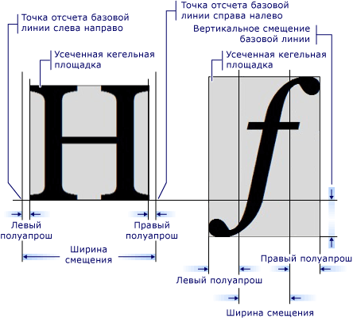

# Знакомство с объектом GlyphRun и элементом Glyphs
Эта тема <xref:System.Windows.Media.GlyphRun> описывает объект <xref:System.Windows.Documents.Glyphs> и элемент.  

## Общие сведения о GlyphRun  
 [!INCLUDE[TLA#tla_winclient](../../../../includes/tlasharptla-winclient-md.md)]обеспечивает расширенную поддержку текста, включая разметку на уровне глифов с прямым доступом для <xref:System.Windows.Documents.Glyphs> клиентов, которые хотят перехватить и упорствовать текст после форматирования. Эти функции обеспечивают критически важную поддержку различных требований к отрисовке текста в каждом из следующих сценариев.  
  
1. Отображение на экране документов фиксированного формата.  
  
2. Сценарии печати.  
  
    - [!INCLUDE[TLA#tla_xaml](../../../../includes/tlasharptla-xaml-md.md)] как язык принтера.  
  
    - Автор документов Microsoft XPS.  
  
    - Предыдущие драйверы принтера, выход из приложений Win32 в фиксированный формат.  
  
    - Формат очереди печати.  
  
3. Представление документов с фиксированным форматом, включая клиентов для предыдущих версий Windows и других вычислительных устройств.  
  
> [!NOTE]
> <xref:System.Windows.Documents.Glyphs>и <xref:System.Windows.Media.GlyphRun> предназначены для сценариев представления документов с фиксированным форматом и печати. [!INCLUDE[TLA#tla_winclient](../../../../includes/tlasharptla-winclient-md.md)]предоставляет несколько элементов [!INCLUDE[TLA#tla_ui](../../../../includes/tlasharptla-ui-md.md)] для общего <xref:System.Windows.Controls.Label> <xref:System.Windows.Controls.TextBlock>макета и сценариев, таких как и . Для получения дополнительной информации о [Typography in WPF](typography-in-wpf.md)макете и [!INCLUDE[TLA2#tla_ui](../../../../includes/tla2sharptla-ui-md.md)] сценариях см.  
  

## Объект GlyphRun  
 Объект <xref:System.Windows.Media.GlyphRun> представляет собой последовательность глифов из одного лица одного шрифта в одном размере и с единым стилем визуализации.  
  
 <xref:System.Windows.Media.GlyphRun>включает в себя как детали <xref:System.Windows.Documents.Glyphs.Indices%2A> шрифта, такие как глиф и отдельные позиции глифов. Он также включает в себя исходные точки кода Unicode, которые был сгенерирован из запуска, офсетную информацию от отображения буфера от персонажа от символов и одного символа.  
  
 <xref:System.Windows.Media.GlyphRun>имеет соответствующий высокий уровень <xref:System.Windows.FrameworkElement>, <xref:System.Windows.Documents.Glyphs>. <xref:System.Windows.Documents.Glyphs>может быть использован в дереве элементов и в [!INCLUDE[TLA2#tla_xaml](../../../../includes/tla2sharptla-xaml-md.md)] разметке для представления <xref:System.Windows.Media.GlyphRun> вывода.  
  

## Элемент Glyphs  
 Элемент <xref:System.Windows.Documents.Glyphs> представляет выход дюйма <xref:System.Windows.Media.GlyphRun> [!INCLUDE[TLA2#tla_xaml](../../../../includes/tla2sharptla-xaml-md.md)] Для описания элемента используется следующий <xref:System.Windows.Documents.Glyphs> синтаксис разметки.  
  
 [!code-xaml[GlyphsOvwSample1#1](~/samples/snippets/csharp/VS_Snippets_Wpf/GlyphsOvwSample1/CS/default.xaml#1)]  
  
 Следующие определения свойств соответствуют первым четырем атрибутам в примере разметки.  
  
|Свойство|Описание|  
|--------------|-----------------|  
|<xref:System.Windows.Documents.Glyphs.FontUri%2A>|Определяети идентификатор ресурса: имя файла, идентификатор web-единого ресурса (URI) или ссылку на ресурсы в приложении .exe или контейнере.|  
|<xref:System.Windows.Documents.Glyphs.FontRenderingEmSize%2A>|Указывает размер шрифта в единицах графической поверхности (по умолчанию — 0,96 дюйма).|  
|<xref:System.Windows.Documents.Glyphs.StyleSimulations%2A>|Задает флаги для полужирного шрифта и курсива.|  
|<xref:System.Windows.Documents.Glyphs.BidiLevel%2A>|Задает уровень двунаправленного макета. Четные и нулевые значения подразумевают макет слева направо; нечетные значения подразумевают макет справа налево.|  
  

### Свойство Indices  
 Свойство <xref:System.Windows.Documents.Glyphs.Indices%2A> представляет собой строку спецификаций глифа. Если последовательность глифов образует единый кластер, спецификации первого глифа в кластере предшествует спецификация того, сколько глифов и сколько кодовых точек объединяются для формирования кластера. Свойство <xref:System.Windows.Documents.Glyphs.Indices%2A> собирает в одной строке следующие свойства.  
  
- Индексы глифов  
  
- Дополнительная ширина глифа  
  
- Объединение векторов присоединения глифа  
  
- Сопоставление кластера от кодовых точек к глифам  
  
- Флаги глифов  
  
 Спецификация глифа имеет следующий вид.  
  
 `[GlyphIndex][,[Advance][,[uOffset][,[vOffset][,[Flags]]]]]`  
  

## Метрики глифа  
 Каждый глиф определяет метрики, определяющие, как он выравнивается с другими. <xref:System.Windows.Documents.Glyphs> На следующем рисунке определяются различные типографические качества двух разных символов глифа.  
  
   
  

## Разметка глифа  
 Следующий пример кода показывает, как <xref:System.Windows.Documents.Glyphs> использовать [!INCLUDE[TLA2#tla_xaml](../../../../includes/tla2sharptla-xaml-md.md)]различные свойства элемента в.  
  
 [!code-xaml[GlyphsOvwSamp2#1](~/samples/snippets/csharp/VS_Snippets_Wpf/GlyphsOvwSamp2/CS/default.xaml#1)]  
  
## См. также раздел

- [Оформление в WPF](typography-in-wpf.md)
- [Документы в WPF](documents-in-wpf.md)
- [Текст](optimizing-performance-text.md)
