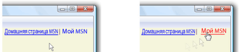

# Оптимизация производительности: отображение текстаOptimizing Performance: Text
[!INCLUDE[TLA2#tla_winclient](../../../../includes/tla2sharptla-winclient-md.md)]включает поддержку представления текстового контента с помощью многофункциональных элементов управления [!INCLUDE[TLA#tla_ui](../../../../includes/tlasharptla-ui-md.md)]. includes support for the presentation of text content through the use of feature-rich [!INCLUDE[TLA#tla_ui](../../../../includes/tlasharptla-ui-md.md)] controls. В целом можно разделить отрисовку текста на три уровня.In general you can divide text rendering in three layers:  
  
1.  С помощью <xref:System.Windows.Documents.Glyphs> и <xref:System.Windows.Media.GlyphRun> объекты непосредственно.Using the <xref:System.Windows.Documents.Glyphs> and <xref:System.Windows.Media.GlyphRun> objects directly.  
  
2.  С помощью <xref:System.Windows.Media.FormattedText> объекта.Using the <xref:System.Windows.Media.FormattedText> object.  
  
3.  С помощью элементов управления верхнего уровня, таких как <xref:System.Windows.Controls.TextBlock> и <xref:System.Windows.Documents.FlowDocument> объектов.Using high-level controls, such as the <xref:System.Windows.Controls.TextBlock> and <xref:System.Windows.Documents.FlowDocument> objects.  
  
 В этом разделе даются рекомендации по повышению производительности отрисовки текста.This topic provides text rendering performance recommendations.  
  
  
   
## Отрисовка текста на уровне глифаRendering Text at the Glyph Level  
 [!INCLUDE[TLA#tla_winclient](../../../../includes/tlasharptla-winclient-md.md)]предоставляет поддержку дополнительных текста, включая разметку на уровне глифа с прямым доступом к <xref:System.Windows.Documents.Glyphs> для клиентов, которые требуется перехватывать и сохранять текст после форматирования. provides advanced text support including glyph-level markup with direct access to <xref:System.Windows.Documents.Glyphs> for customers who want to intercept and persist text after formatting. Эти функции обеспечивают критически важную поддержку различных требований к отрисовке текста в каждом из следующих сценариев.These features provide critical support for the different text rendering requirements in each of the following scenarios.  
  
-   Отображение на экране документов фиксированного формата.Screen display of fixed-format documents.  
  
-   Сценарии печати.Print scenarios.  
  
    -   [!INCLUDE[TLA#tla_xaml](../../../../includes/tlasharptla-xaml-md.md)] как язык принтера. as a device printer language.  
  
    -   [!INCLUDE[TLA#tla_mxdw](../../../../includes/tlasharptla-mxdw-md.md)]..  
  
    -   Предыдущие драйверы принтера, вывод из приложений [!INCLUDE[TLA#tla_win32](../../../../includes/tlasharptla-win32-md.md)] в фиксированный формат.Previous printer drivers, output from [!INCLUDE[TLA#tla_win32](../../../../includes/tlasharptla-win32-md.md)] applications to the fixed format.  
  
    -   Формат очереди печати.Print spool format.  
  
-   Представление документов фиксированного формата, включая клиенты предыдущих версий [!INCLUDE[TLA#tla_mswin](../../../../includes/tlasharptla-mswin-md.md)] и другие вычислительные устройства.Fixed-format document representation, including clients for previous versions of [!INCLUDE[TLA#tla_mswin](../../../../includes/tlasharptla-mswin-md.md)] and other computing devices.  
  
> [!NOTE]
>  <xref:System.Windows.Documents.Glyphs>и <xref:System.Windows.Media.GlyphRun> предназначены для представления документа фиксированного формата и сценариев печати.<xref:System.Windows.Documents.Glyphs> and <xref:System.Windows.Media.GlyphRun> are designed for fixed-format document presentation and print scenarios. [!INCLUDE[TLA#tla_winclient](../../../../includes/tlasharptla-winclient-md.md)]предоставляет несколько элементов для общего макета и [!INCLUDE[TLA#tla_ui](../../../../includes/tlasharptla-ui-md.md)] сценариях, например <xref:System.Windows.Controls.Label> и <xref:System.Windows.Controls.TextBlock>. provides several elements for general layout and [!INCLUDE[TLA#tla_ui](../../../../includes/tlasharptla-ui-md.md)] scenarios such as <xref:System.Windows.Controls.Label> and <xref:System.Windows.Controls.TextBlock>. Дополнительные сведения о макете и сценариях [!INCLUDE[TLA2#tla_ui](../../../../includes/tla2sharptla-ui-md.md)] см. в статье [Оформление в WPF](../../../../docs/framework/wpf/advanced/typography-in-wpf.md).For more information on layout and [!INCLUDE[TLA2#tla_ui](../../../../includes/tla2sharptla-ui-md.md)] scenarios, see the [Typography in WPF](../../../../docs/framework/wpf/advanced/typography-in-wpf.md).  
  
 Следующие примеры показывают, как можно задать свойства для <xref:System.Windows.Documents.Glyphs> объекта в [!INCLUDE[TLA#tla_xaml](../../../../includes/tlasharptla-xaml-md.md)].The following examples show how to define properties for a <xref:System.Windows.Documents.Glyphs> object in [!INCLUDE[TLA#tla_xaml](../../../../includes/tlasharptla-xaml-md.md)]. <xref:System.Windows.Documents.Glyphs> Объект представляет выходные данные <xref:System.Windows.Media.GlyphRun> в [!INCLUDE[TLA2#tla_xaml](../../../../includes/tla2sharptla-xaml-md.md)].The <xref:System.Windows.Documents.Glyphs> object represents the output of a <xref:System.Windows.Media.GlyphRun> in [!INCLUDE[TLA2#tla_xaml](../../../../includes/tla2sharptla-xaml-md.md)]. В примерах предполагается, что шрифты Arial, Courier New и Times New Roman устанавливаются в папку **C:\WINDOWS\Fonts** на локальном компьютере.The examples assume that the Arial, Courier New, and Times New Roman fonts are installed in the **C:\WINDOWS\Fonts** folder on the local computer.  
  
 [!code-xaml[GlyphsOvwSample1#1](../../../../samples/snippets/csharp/VS_Snippets_Wpf/GlyphsOvwSample1/CS/default.xaml#1)]  
  
### Использование DrawGlyphRunUsing DrawGlyphRun  
 Если имеется пользовательский элемент управления, и вы хотите отобразить глифы, используйте <xref:System.Windows.Media.DrawingContext.DrawGlyphRun%2A> метод.If you have custom control and you want to render glyphs, use the <xref:System.Windows.Media.DrawingContext.DrawGlyphRun%2A> method.  
  
 [!INCLUDE[TLA2#tla_winclient](../../../../includes/tla2sharptla-winclient-md.md)]также предоставляет службы более низкого уровня для пользовательского форматирования с помощью объекта текста <xref:System.Windows.Media.FormattedText> объекта. also provides lower-level services for custom text formatting through the use of the <xref:System.Windows.Media.FormattedText> object. Наиболее эффективный способ отображения текста в [!INCLUDE[TLA#tla_winclient](../../../../includes/tlasharptla-winclient-md.md)] является создание содержимого текста на уровне глифа с помощью <xref:System.Windows.Documents.Glyphs> и <xref:System.Windows.Media.GlyphRun>.The most efficient way of rendering text in [!INCLUDE[TLA#tla_winclient](../../../../includes/tlasharptla-winclient-md.md)] is by generating text content at the glyph level using <xref:System.Windows.Documents.Glyphs> and <xref:System.Windows.Media.GlyphRun>. Однако ценой этой эффективности означает потерю удобные форматированный текст, который встроенными функциональными возможностями для [!INCLUDE[TLA#tla_winclient](../../../../includes/tlasharptla-winclient-md.md)] элементы управления, такие как <xref:System.Windows.Controls.TextBlock> и <xref:System.Windows.Documents.FlowDocument>.However, the cost of this efficiency is the loss of easy to use rich text formatting, which are built-in features of [!INCLUDE[TLA#tla_winclient](../../../../includes/tlasharptla-winclient-md.md)] controls, such as <xref:System.Windows.Controls.TextBlock> and <xref:System.Windows.Documents.FlowDocument>.  
  
   
## Объект FormattedTextFormattedText Object  
 <xref:System.Windows.Media.FormattedText> Позволяет рисовать многострочный текст, в котором каждый символ в тексте можно форматировать отдельно.The <xref:System.Windows.Media.FormattedText> object allows you to draw multi-line text, in which each character in the text can be individually formatted. Дополнительные сведения см. в разделе [Рисование форматированного текста](../../../../docs/framework/wpf/advanced/drawing-formatted-text.md).For more information, see [Drawing Formatted Text](../../../../docs/framework/wpf/advanced/drawing-formatted-text.md).  
  
 Чтобы создать форматированный текст, вызовите <xref:System.Windows.Media.FormattedText.%23ctor%2A> конструктор для создания <xref:System.Windows.Media.FormattedText> объекта.To create formatted text, call the <xref:System.Windows.Media.FormattedText.%23ctor%2A> constructor to create a <xref:System.Windows.Media.FormattedText> object. После создания исходной строки форматированного текста можно применить ряд стилей форматирования.Once you have created the initial formatted text string, you can apply a range of formatting styles. Если в приложении требуется реализовать собственный макет, то <xref:System.Windows.Media.FormattedText> объект является более предпочтительной, чем с помощью элемента управления, такие как <xref:System.Windows.Controls.TextBlock>.If your application wants to implement its own layout, then the <xref:System.Windows.Media.FormattedText> object is better choice than using a control, such as <xref:System.Windows.Controls.TextBlock>. Дополнительные сведения о <xref:System.Windows.Media.FormattedText> см. в разделе [Рисование текста в формате](../../../../docs/framework/wpf/advanced/drawing-formatted-text.md) .For more information on the <xref:System.Windows.Media.FormattedText> object, see [Drawing Formatted Text](../../../../docs/framework/wpf/advanced/drawing-formatted-text.md) .  
  
 <xref:System.Windows.Media.FormattedText> Объект предоставляет возможность низкоуровневого форматирования текста.The <xref:System.Windows.Media.FormattedText> object provides low-level text formatting capability. К одному или более символам можно применить несколько стилей форматирования.You can apply multiple formatting styles to one or more characters. Например, можно вызвать как <xref:System.Windows.Media.FormattedText.SetFontSize%2A> и <xref:System.Windows.Media.FormattedText.SetForegroundBrush%2A> методов, чтобы изменить форматирование первые пять символов в тексте.For example, you could call both the <xref:System.Windows.Media.FormattedText.SetFontSize%2A> and <xref:System.Windows.Media.FormattedText.SetForegroundBrush%2A> methods to change the formatting of the first five characters in the text.  
  
 В следующем примере кода создается <xref:System.Windows.Media.FormattedText> объекта и отображает его.The following code example creates a <xref:System.Windows.Media.FormattedText> object and renders it.  
  
 [!code-csharp[formattedtextsnippets#FormattedTextSnippets1](../../../../samples/snippets/csharp/VS_Snippets_Wpf/FormattedTextSnippets/CSharp/Window1.xaml.cs#formattedtextsnippets1)]
 [!code-vb[formattedtextsnippets#FormattedTextSnippets1](../../../../samples/snippets/visualbasic/VS_Snippets_Wpf/FormattedTextSnippets/visualbasic/window1.xaml.vb#formattedtextsnippets1)]  
  
   
## Элементы управления FlowDocument, TextBlock и LabelFlowDocument, TextBlock, and Label Controls  
 В [!INCLUDE[TLA2#tla_winclient](../../../../includes/tla2sharptla-winclient-md.md)] имеется множество элементов управления для рисования текста на экране.[!INCLUDE[TLA2#tla_winclient](../../../../includes/tla2sharptla-winclient-md.md)] includes multiple controls for drawing text to the screen. Каждый элемент управления предназначен для различных сценариев и имеет свой собственный список функций и ограничений.Each control is targeted to a different scenario and has its own list of features and limitations.  
  
### FlowDocument влияет на производительность больше, чем TextBlock и LabelFlowDocument Impacts Performance More than TextBlock or Label  
 Как правило <xref:System.Windows.Controls.TextBlock> элемент должен использоваться, если требуется ограниченная поддержка текста, например краткие предложения в [!INCLUDE[TLA#tla_ui](../../../../includes/tlasharptla-ui-md.md)].In general, the <xref:System.Windows.Controls.TextBlock> element should be used when limited text support is required, such as a brief sentence in a [!INCLUDE[TLA#tla_ui](../../../../includes/tlasharptla-ui-md.md)]. <xref:System.Windows.Controls.Label>можно использовать, когда требуется Минимальная поддержка текста.<xref:System.Windows.Controls.Label> can be used when minimal text support is required. <xref:System.Windows.Documents.FlowDocument> Элемент является контейнером для повторно форматируемых документов, которые поддерживают форматированного представления содержимого и таким образом, может повлиять на производительность больше, чем при использовании <xref:System.Windows.Controls.TextBlock> или <xref:System.Windows.Controls.Label> элементов управления.The <xref:System.Windows.Documents.FlowDocument> element is a container for re-flowable documents that support rich presentation of content, and therefore, has a greater performance impact than using the <xref:System.Windows.Controls.TextBlock> or <xref:System.Windows.Controls.Label> controls.  
  
 Дополнительные сведения о <xref:System.Windows.Documents.FlowDocument>, в разделе [Общие сведения о документа нефиксированного формата](../../../../docs/framework/wpf/advanced/flow-document-overview.md).For more information on <xref:System.Windows.Documents.FlowDocument>, see [Flow Document Overview](../../../../docs/framework/wpf/advanced/flow-document-overview.md).  
  
### Избегайте использования TextBlock в FlowDocumentAvoid Using TextBlock in FlowDocument  
 <xref:System.Windows.Controls.TextBlock> Элемент является производным от <xref:System.Windows.UIElement>.The <xref:System.Windows.Controls.TextBlock> element is derived from <xref:System.Windows.UIElement>. <xref:System.Windows.Documents.Run> Элемент является производным от <xref:System.Windows.Documents.TextElement>, который является менее затратным по сравнению с <xref:System.Windows.UIElement>-производного объекта.The <xref:System.Windows.Documents.Run> element is derived from <xref:System.Windows.Documents.TextElement>, which is less costly to use than a <xref:System.Windows.UIElement>-derived object. По возможности используйте <xref:System.Windows.Documents.Run> вместо <xref:System.Windows.Controls.TextBlock> для отображения текстового содержимого в <xref:System.Windows.Documents.FlowDocument>.When possible, use <xref:System.Windows.Documents.Run> rather than <xref:System.Windows.Controls.TextBlock> for displaying text content in a <xref:System.Windows.Documents.FlowDocument>.  
  
 В следующем примере разметки показано два способа настройки текстового содержимого в <xref:System.Windows.Documents.FlowDocument>:The following markup sample illustrates two ways of setting text content within a <xref:System.Windows.Documents.FlowDocument>:  
  
 [!code-xaml[Performance#PerformanceSnippet13](../../../../samples/snippets/csharp/VS_Snippets_Wpf/Performance/CSharp/FlowDocument.xaml#performancesnippet13)]  
  
### Избегайте использования Run для задания свойств текстаAvoid Using Run to Set Text Properties  
 В целом, использование <xref:System.Windows.Documents.Run> в <xref:System.Windows.Controls.TextBlock> является более производительным, чем неиспользование явных <xref:System.Windows.Documents.Run> объекта вообще.In general, using a <xref:System.Windows.Documents.Run> within a <xref:System.Windows.Controls.TextBlock> is more performance intensive than not using an explicit <xref:System.Windows.Documents.Run> object at all. Если вы используете <xref:System.Windows.Documents.Run> для установки свойств текста, задайте эти свойства непосредственно в <xref:System.Windows.Controls.TextBlock> вместо него.If you are using a <xref:System.Windows.Documents.Run> in order to set text properties, set those properties directly on the <xref:System.Windows.Controls.TextBlock> instead.  
  
 В следующем примере разметки показаны два способа задания свойства текста, в этом случае <xref:System.Windows.Controls.TextBlock.FontWeight%2A> свойство:The following markup sample illustrates these two ways of setting a text property, in this case, the <xref:System.Windows.Controls.TextBlock.FontWeight%2A> property:  
  
 [!code-xaml[Performance#PerformanceSnippet12](../../../../samples/snippets/csharp/VS_Snippets_Wpf/Performance/CSharp/Window1.xaml#performancesnippet12)]  
  
 В следующей таблице показаны производительность отображения 1000 <xref:System.Windows.Controls.TextBlock> объектов с и без явного <xref:System.Windows.Documents.Run>.The following table shows the cost of displaying 1000 <xref:System.Windows.Controls.TextBlock> objects with and without an explicit <xref:System.Windows.Documents.Run>.  
  
|**Тип TextBlock****TextBlock type**|**Время создания (мс)****Creation time (ms)**|**Время отрисовки (мс)****Render time (ms)**|  
|------------------------|------------------------------|----------------------------|  
|Установка свойств текста с помощью RunRun setting text properties|146146|540540|  
|Установка свойств текста с помощью TextBlockTextBlock setting text properties|4343|453453|  
  
### Избегайте привязки данных к свойству Label.ContentAvoid Databinding to the Label.Content Property  
 Представьте себе ситуацию, когда имеется <xref:System.Windows.Controls.Label> объект, который часто обновляется из <xref:System.String> источника.Imagine a scenario where you have a <xref:System.Windows.Controls.Label> object that is updated frequently from a <xref:System.String> source. При привязке данных <xref:System.Windows.Controls.Label> элемента <xref:System.Windows.Controls.ContentControl.Content%2A> свойства <xref:System.String> исходный объект, может наблюдаться низкая производительность.When data binding the <xref:System.Windows.Controls.Label> element's <xref:System.Windows.Controls.ContentControl.Content%2A> property to the <xref:System.String> source object, you may experience poor performance. Источник при каждом запуске <xref:System.String> обновляется, старый <xref:System.String> объект удаляется, а новый <xref:System.String> создается заново, так как <xref:System.String> является неизменяемым, его невозможно изменить.Each time the source <xref:System.String> is updated, the old <xref:System.String> object is discarded and a new <xref:System.String> is recreated—because a <xref:System.String> object is immutable, it cannot be modified. Это, в свою очередь, вызовет переход <xref:System.Windows.Controls.ContentPresenter> из <xref:System.Windows.Controls.Label> объект удаляет устаревшее содержимое и создает новое содержимое для отображения нового <xref:System.String>.This, in turn, causes the <xref:System.Windows.Controls.ContentPresenter> of the <xref:System.Windows.Controls.Label> object to discard its old content and regenerate the new content to display the new <xref:System.String>.  
  
 Решение этой проблемы довольно простое.The solution to this problem is simple. Если <xref:System.Windows.Controls.Label> не установлено пользовательское <xref:System.Windows.Controls.ContentControl.ContentTemplate%2A> значений, замените <xref:System.Windows.Controls.Label> с <xref:System.Windows.Controls.TextBlock> и выполните привязку данных его <xref:System.Windows.Controls.TextBlock.Text%2A> свойство исходную строку.If the <xref:System.Windows.Controls.Label> is not set to a custom <xref:System.Windows.Controls.ContentControl.ContentTemplate%2A> value, replace the <xref:System.Windows.Controls.Label> with a <xref:System.Windows.Controls.TextBlock> and data bind its <xref:System.Windows.Controls.TextBlock.Text%2A> property to the source string.  
  
|**Свойство с привязкой данных****Data bound property**|**Время обновления (мс)****Update time (ms)**|  
|-----------------------------|----------------------------|  
|Label.ContentLabel.Content|835835|  
|TextBlock.TextTextBlock.Text|242242|  
  
   
## ГиперссылкаHyperlink  
 <xref:System.Windows.Documents.Hyperlink> Объект является элемент содержимого потока встроенного уровня, позволяющий размещать гиперссылки в содержимом потока.The <xref:System.Windows.Documents.Hyperlink> object is an inline-level flow content element that allows you to host hyperlinks within the flow content.  
  
### Объединение гиперссылок в одном объекте TextBlockCombine Hyperlinks in One TextBlock Object  
 Можно оптимизировать использование нескольких <xref:System.Windows.Documents.Hyperlink> элементов, группируя их вместе в одном <xref:System.Windows.Controls.TextBlock>.You can optimize the use of multiple <xref:System.Windows.Documents.Hyperlink> elements by grouping them together within the same <xref:System.Windows.Controls.TextBlock>. Это позволяет минимизировать число объектов, создаваемых в приложении.This helps to minimize the number of objects you create in your application. Например, может потребоваться отобразить несколько гиперссылок, как показано ниже.For example, you may want to display multiple hyperlinks, such as the following:  
  
 Домашняя страница MSN | Мой MSNMSN Home &#124; My MSN  
  
 В следующем примере разметки показано несколько <xref:System.Windows.Controls.TextBlock> элементы, используемые для отображения гиперссылок:The following markup example shows multiple <xref:System.Windows.Controls.TextBlock> elements used to display the hyperlinks:  
  
 [!code-xaml[Performance#PerformanceSnippet9](../../../../samples/snippets/csharp/VS_Snippets_Wpf/Performance/CSharp/Hyperlink.xaml#performancesnippet9)]  
  
 В следующем примере разметки показан более эффективный способ отображения гиперссылок, на этот раз с помощью одного <xref:System.Windows.Controls.TextBlock>:The following markup example shows a more efficient way of displaying the hyperlinks, this time, using a single <xref:System.Windows.Controls.TextBlock>:  
  
 [!code-xaml[Performance#PerformanceSnippet10](../../../../samples/snippets/csharp/VS_Snippets_Wpf/Performance/CSharp/Hyperlink.xaml#performancesnippet10)]  
  
### Отображение подчеркивания гиперссылок только при возникновении события MouseEnterShowing Underlines on Hyperlinks Only on MouseEnter Events  
 Объект <xref:System.Windows.TextDecoration> объект — это визуальное украшение, можно добавить в текст, однако он может быть производительность при создании.A <xref:System.Windows.TextDecoration> object is a visual ornamentation that you can add to text; however, it can be performance intensive to instantiate. Если предусматривают широкое использование <xref:System.Windows.Documents.Hyperlink> элементов, рассмотрите возможность отображать подчеркивание только при возникновении события, такие как <xref:System.Windows.ContentElement.MouseEnter> событий.If you make extensive use of <xref:System.Windows.Documents.Hyperlink> elements, consider showing an underline only when triggering an event, such as the <xref:System.Windows.ContentElement.MouseEnter> event. Дополнительные сведения см. в разделе [Определение того, подчеркнута ли ссылка](../../../../docs/framework/wpf/advanced/how-to-specify-whether-a-hyperlink-is-underlined.md).For more information, see [Specify Whether a Hyperlink is Underlined](../../../../docs/framework/wpf/advanced/how-to-specify-whether-a-hyperlink-is-underlined.md).  
  
   
Гиперссылка, появляющаяся при возникновении события MouseEnterHyperlink appearing on MouseEnter  
  
 В следующем примере демонстрируется разметки <xref:System.Windows.Documents.Hyperlink> определен с подчеркиванием и без него:The following markup sample shows a <xref:System.Windows.Documents.Hyperlink> defined with and without an underline:  
  
 [!code-xaml[Performance#PerformanceSnippet11](../../../../samples/snippets/csharp/VS_Snippets_Wpf/Performance/CSharp/Hyperlink.xaml#performancesnippet11)]  
  
 В следующей таблице показаны снижение производительности при отображении 1000 <xref:System.Windows.Documents.Hyperlink> элементы с подчеркиванием и без него.The following table shows the performance cost of displaying 1000 <xref:System.Windows.Documents.Hyperlink> elements with and without an underline.  
  
|**Гиперссылка****Hyperlink**|**Время создания (мс)****Creation time (ms)**|**Время отрисовки (мс)****Render time (ms)**|  
|-------------------|------------------------------|----------------------------|  
|С подчеркиваниемWith underline|289289|11301130|  
|Без подчеркиванияWithout underline|299299|776776|  
  
   
## Возможности форматирования текстаText Formatting Features  
 [!INCLUDE[TLA2#tla_winclient](../../../../includes/tla2sharptla-winclient-md.md)] предоставляет службы форматирования RTF, такие как автоматическая расстановка переносов. provides rich text formatting services, such as automatic hyphenations. Эти службы могут влиять на производительность приложения и должны использоваться только при необходимости.These services may impact application performance and should only be used when needed.  
  
### Избегайте излишнего использования расстановки переносовAvoid Unnecessary Use of Hyphenation  
 Автоматическая расстановка переносов находит дефис точки останова для строк текста и разрешает дополнительные позиции разрыва строк в <xref:System.Windows.Controls.TextBlock> и <xref:System.Windows.Documents.FlowDocument> объектов.Automatic hyphenation finds hyphen breakpoints for lines of text, and allows additional break positions for lines in <xref:System.Windows.Controls.TextBlock> and <xref:System.Windows.Documents.FlowDocument> objects. По умолчанию возможность автоматического переноса в этих объектах отключена.By default, the automatic hyphenation feature is disabled in these objects. Эту функцию можно включить, установив свойство IsHyphenationEnabled объекта в значение `true`.You can enable this feature by setting the object's IsHyphenationEnabled property to `true`. Однако включение этой функции заставляет [!INCLUDE[TLA2#tla_winclient](../../../../includes/tla2sharptla-winclient-md.md)] инициировать взаимодействие [!INCLUDE[TLA#tla_com](../../../../includes/tlasharptla-com-md.md)], которое может повлиять на производительность приложения.However, enabling this feature causes [!INCLUDE[TLA2#tla_winclient](../../../../includes/tla2sharptla-winclient-md.md)] to initiate [!INCLUDE[TLA#tla_com](../../../../includes/tlasharptla-com-md.md)] interoperability, which can impact application performance. Рекомендуется не использовать автоматическую расстановку переносов, если это не является обязательным.It is recommended that you do not use automatic hyphenation unless you need it.  
  
### Внимательно используйте рисункиUse Figures Carefully  
 Объект <xref:System.Windows.Documents.Figure> элемент представляет часть растягиваемого содержимого, которое может быть абсолютно позиционировано внутри страницы содержимого.A <xref:System.Windows.Documents.Figure> element represents a portion of flow content that can be absolutely-positioned within a page of content. В некоторых случаях <xref:System.Windows.Documents.Figure> может вызвать автоматическое переформатирование, если ее положение конфликтует с уже размещенным содержимым всей страницы. Можно свести к минимуму вероятность ненужного переформатирования либо путем группировки <xref:System.Windows.Documents.Figure> элементов рядом с друг с другом, либо объявлением их в верхней части содержимого в сценарии фиксированного размера страницы.In some cases, a <xref:System.Windows.Documents.Figure> may cause an entire page to automatically reformat if its position collides with content that has already been laid-out. You can minimize the possibility of unnecessary reformatting by either grouping <xref:System.Windows.Documents.Figure> elements next to each other, or declaring them near the top of content in a fixed page size scenario.  
  
### Оптимальный абзацOptimal Paragraph  
 Средство оптимального абзаца из <xref:System.Windows.Documents.FlowDocument> размещает абзацы, чтобы максимально равномерно распределяется пробелы.The optimal paragraph feature of the <xref:System.Windows.Documents.FlowDocument> object lays out paragraphs so that white space is distributed as evenly as possible. По умолчанию средство оптимального абзаца отключено.By default, the optimal paragraph feature is disabled. Эту функцию можно включить, задав объекта <xref:System.Windows.Documents.FlowDocument.IsOptimalParagraphEnabled%2A> свойства `true`.You can enable this feature by setting the object's <xref:System.Windows.Documents.FlowDocument.IsOptimalParagraphEnabled%2A> property to `true`. Однако включение этой функции влияет на производительность приложения.However, enabling this feature impacts application performance. Рекомендуется не использовать средство оптимального абзаца без необходимости.It is recommended that you do not use the optimal paragraph feature unless you need it.  
  
## См. такжеSee Also  
 [Улучшение производительности приложений WPFOptimizing WPF Application Performance](../../../../docs/framework/wpf/advanced/optimizing-wpf-application-performance.md)  
 [Планирование производительности приложенияPlanning for Application Performance](../../../../docs/framework/wpf/advanced/planning-for-application-performance.md)  
 [Использование преимуществ оборудованияTaking Advantage of Hardware](../../../../docs/framework/wpf/advanced/optimizing-performance-taking-advantage-of-hardware.md)  
 [Разметка и разработкаLayout and Design](../../../../docs/framework/wpf/advanced/optimizing-performance-layout-and-design.md)  
 [Двумерная графика и изображения2D Graphics and Imaging](../../../../docs/framework/wpf/advanced/optimizing-performance-2d-graphics-and-imaging.md)  
 [Поведение объектаObject Behavior](../../../../docs/framework/wpf/advanced/optimizing-performance-object-behavior.md)  
 [Ресурсы приложенийApplication Resources](../../../../docs/framework/wpf/advanced/optimizing-performance-application-resources.md)  
 [Привязка данныхData Binding](../../../../docs/framework/wpf/advanced/optimizing-performance-data-binding.md)  
 [Дополнительные рекомендации по повышению производительностиOther Performance Recommendations](../../../../docs/framework/wpf/advanced/optimizing-performance-other-recommendations.md)
