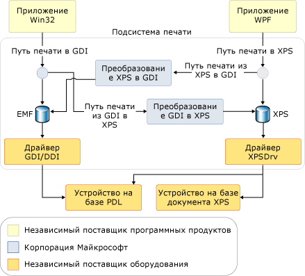

# Общие сведения о печати
В Microsoft .NET Framework, разработчики приложений с помощью Windows Presentation Foundation (WPF) предоставляют широкий набор новых печати и системы управления [!INCLUDE[TLA#tla_api#plural](../../../../includes/tlasharptla-apisharpplural-md.md)]. В [!INCLUDE[TLA#tla_winvista](../../../../includes/tlasharptla-winvista-md.md)] некоторые из усовершенствований управления печатью также доступны для разработчиков, создающих приложения [!INCLUDE[TLA#tla_winforms](../../../../includes/tlasharptla-winforms-md.md)], и разработчиков, использующих неуправляемый код. В основе этой новой функциональности лежит новый формат файла [!INCLUDE[TLA#tla_xps](../../../../includes/tlasharptla-xps-md.md)] и способ печати [!INCLUDE[TLA2#tla_xps](../../../../includes/tla2sharptla-xps-md.md)].  
  
 В этом разделе содержатся следующие подразделы.  
  
   
## О формате XPS  
 [!INCLUDE[TLA2#tla_metro](../../../../includes/tla2sharptla-metro-md.md)] — это формат электронного документа, формат файла очереди и язык описания страницы. Это формат открытого документа, который использует [!INCLUDE[TLA#tla_xml](../../../../includes/tlasharptla-xml-md.md)], [!INCLUDE[TLA#tla_opc](../../../../includes/tlasharptla-opc-md.md)] и другие отраслевые стандарты для создания кроссплатформенных документов. [!INCLUDE[TLA2#tla_metro](../../../../includes/tla2sharptla-metro-md.md)] упрощает процесс создания, совместного использования, печати, просмотра и архивирования цифровых документов. Дополнительные сведения по [!INCLUDE[TLA2#tla_metro](../../../../includes/tla2sharptla-metro-md.md)] см. на [веб-сайте XPS](http://www.microsoft.com/xps).  
  
 Несколько методов печати содержимого на основе [!INCLUDE[TLA2#tla_metro](../../../../includes/tla2sharptla-metro-md.md)] с помощью [!INCLUDE[TLA2#tla_wpf](../../../../includes/tla2sharptla-wpf-md.md)] демонстрируются в разделе [Печать XPS-файлов программным способом](../../../../docs/framework/wpf/advanced/how-to-programmatically-print-xps-files.md). Ссылки на эти примеры могут оказаться полезными при просмотре содержимого этого раздела. (Разработчикам неуправляемого кода обратитесь к документации для [MXDC_ESCAPE функция](https://msdn.microsoft.com/library/windows/desktop/dd162739.aspx). Windows Forms разработчики должны использовать [!INCLUDE[TLA2#tla_api](../../../../includes/tla2sharptla-api-md.md)] в <xref:System.Drawing.Printing> пространства имен, которая не поддерживает полную [!INCLUDE[TLA2#tla_xps](../../../../includes/tla2sharptla-xps-md.md)] способ печати, но поддерживает путь печати гибридного GDI в XPS. См. раздел **Архитектура способа печати** ниже.)  
  
   
## Способ печати XPS  
 [!INCLUDE[TLA#tla_metro](../../../../includes/tlasharptla-metro-md.md)] Печати пути — это новая [!INCLUDE[TLA#tla_mswin](../../../../includes/tlasharptla-mswin-md.md)] компонент, который переопределяет как печать обрабатывается в приложениях Windows. Поскольку [!INCLUDE[TLA2#tla_xps](../../../../includes/tla2sharptla-xps-md.md)] может заменить язык представления документов (например, RTF), формат очереди печати (например, WMF) и язык описания страницы (например, PCL или Postscript), новый способ печати поддерживает формат [!INCLUDE[TLA2#tla_metro](../../../../includes/tla2sharptla-metro-md.md)] от публикации приложения до последней обработки в драйвере печати или устройстве печати.  
  
 Способ печати [!INCLUDE[TLA2#tla_metro](../../../../includes/tla2sharptla-metro-md.md)] построен на основе модели драйвера печати [!INCLUDE[TLA2#tla_metro](../../../../includes/tla2sharptla-metro-md.md)] (XPSDrv), которая предоставляет разработчикам различные преимущества, такие как печать [!INCLUDE[TLA#tla_wys](../../../../includes/tlasharptla-wys-md.md)], улучшенная поддержка цвета и значительно повышенная производительность печати. (Дополнительные сведения о XPSDrv см в [пакете разработки драйверов Windows ](https://msdn.microsoft.com/library/windows/hardware/ff557573.aspx).)  
  
 Операция диспетчера очереди печати для [!INCLUDE[TLA2#tla_metro](../../../../includes/tla2sharptla-metro-md.md)] документы по существу одинакова как в предыдущих версиях Windows. Однако она была усовершенствована для поддержки способа печати [!INCLUDE[TLA2#tla_metro](../../../../includes/tla2sharptla-metro-md.md)] в дополнение к существующему способу печати [!INCLUDE[TLA2#tla_gdi](../../../../includes/tla2sharptla-gdi-md.md)]. Новый способ печати использует файл очереди [!INCLUDE[TLA2#tla_metro](../../../../includes/tla2sharptla-metro-md.md)]. Хотя драйверы принтеров пользовательского режима, написанные для предыдущих версий [!INCLUDE[TLA#tla_mswin](../../../../includes/tlasharptla-mswin-md.md)], будут продолжать работать, [!INCLUDE[TLA2#tla_metro](../../../../includes/tla2sharptla-metro-md.md)] для использования способа печати [!INCLUDE[TLA2#tla_metro](../../../../includes/tla2sharptla-metro-md.md)] необходим драйвер принтера (XPSDrv).  
  
 Преимущества способа печати [!INCLUDE[TLA2#tla_metro](../../../../includes/tla2sharptla-metro-md.md)] являются существенными и включают следующее.  
  
-   Поддержка печати [!INCLUDE[TLA2#tla_wys](../../../../includes/tla2sharptla-wys-md.md)]  
  
-   Встроенная поддержка дополнительных цветовых профилей, включая 32 бита на канал (bpc), CMYK, именованные цвета, n-краски и встроенную поддержку прозрачности и градиентов.  
  
-   Улучшенная производительность печати для обоих .NET Framework и [!INCLUDE[TLA#tla_win32](../../../../includes/tlasharptla-win32-md.md)] приложений на основе.  
  
-   Формат [!INCLUDE[TLA2#tla_metro](../../../../includes/tla2sharptla-metro-md.md)] отраслевого стандарта  
  
 Для базовых сценариев печати доступен простой и понятный [!INCLUDE[TLA2#tla_api](../../../../includes/tla2sharptla-api-md.md)] с одной точкой входа для пользовательского интерфейса, конфигурации и отправкой задания. Для расширенных сценариев добавлена дополнительная поддержка настройки [!INCLUDE[TLA#tla_ui](../../../../includes/tlasharptla-ui-md.md)] (или не [!INCLUDE[TLA2#tla_ui](../../../../includes/tla2sharptla-ui-md.md)] вообще), синхронной или асинхронной печати и возможностей пакетной печати. Оба параметра обеспечивают поддержку печати в режиме полного или частичного доверия.  
  
 [!INCLUDE[TLA2#tla_metro](../../../../includes/tla2sharptla-metro-md.md)] был разработан с учетом возможности расширения. С помощью инфраструктуры расширяемости функции и возможности можно добавлять в [!INCLUDE[TLA2#tla_metro](../../../../includes/tla2sharptla-metro-md.md)] модульным способом. Функции расширяемости включают следующее.  
  
-   Схема печати. Общая схема обновляется регулярно и позволяет быстро расширять возможности устройства. (См. **PrintTicket и PrintCapabilities** ниже.)  
  
-   Расширяемый конвейер фильтра. Конвейер фильтра драйвера принтера [!INCLUDE[TLA2#tla_metro](../../../../includes/tla2sharptla-metro-md.md)] (XPSDrv) был разработан для включения как прямой, так и масштабируемой печати документов [!INCLUDE[TLA2#tla_metro](../../../../includes/tla2sharptla-metro-md.md)]. (Уточняющий запрос» XPSDrv» в [Windows Driver Kit](https://msdn.microsoft.com/library/windows/hardware/ff557573.aspx).)  
  
### Архитектура способа печати  
 Хотя оба [!INCLUDE[TLA2#tla_win32](../../../../includes/tla2sharptla-win32-md.md)] и приложениями .NET Framework поддерживают [!INCLUDE[TLA2#tla_metro](../../../../includes/tla2sharptla-metro-md.md)], [!INCLUDE[TLA2#tla_win32](../../../../includes/tla2sharptla-win32-md.md)] и использовать в приложениях Windows Forms [!INCLUDE[TLA2#tla_gdi](../../../../includes/tla2sharptla-gdi-md.md)] для [!INCLUDE[TLA2#tla_metro](../../../../includes/tla2sharptla-metro-md.md)] преобразования для создания [!INCLUDE[TLA2#tla_metro](../../../../includes/tla2sharptla-metro-md.md)] форматированное содержимое для [!INCLUDE[TLA2#tla_metro](../../../../includes/tla2sharptla-metro-md.md)]драйвер принтера (XPSDrv). Эти приложения не обязаны использовать способ печати [!INCLUDE[TLA2#tla_metro](../../../../includes/tla2sharptla-metro-md.md)], и можно продолжать использовать печать на основе [!INCLUDE[TLA#tla_emf](../../../../includes/tlasharptla-emf-md.md)]. Однако большинство функций и усовершенствований [!INCLUDE[TLA2#tla_metro](../../../../includes/tla2sharptla-metro-md.md)] доступно только приложениям, предназначенным для способа печати [!INCLUDE[TLA2#tla_metro](../../../../includes/tla2sharptla-metro-md.md)].  
  
 Чтобы включить использование принтеров на основе XPSDrv [!INCLUDE[TLA2#tla_win32](../../../../includes/tla2sharptla-win32-md.md)] приложения Windows Forms и [!INCLUDE[TLA2#tla_metro](../../../../includes/tla2sharptla-metro-md.md)] драйвер принтера (XPSDrv) поддерживает преобразование [!INCLUDE[TLA2#tla_gdi](../../../../includes/tla2sharptla-gdi-md.md)] для [!INCLUDE[TLA2#tla_metro](../../../../includes/tla2sharptla-metro-md.md)] формат. Модель XPSDrv также предоставляет преобразователь для [!INCLUDE[TLA2#tla_metro](../../../../includes/tla2sharptla-metro-md.md)] в формат [!INCLUDE[TLA2#tla_gdi](../../../../includes/tla2sharptla-gdi-md.md)], чтобы приложения [!INCLUDE[TLA2#tla_win32](../../../../includes/tla2sharptla-win32-md.md)] могли печатать документы [!INCLUDE[TLA2#tla_xps](../../../../includes/tla2sharptla-xps-md.md)]. Для [!INCLUDE[TLA2#tla_wpf](../../../../includes/tla2sharptla-wpf-md.md)] приложений, преобразование [!INCLUDE[TLA2#tla_metro](../../../../includes/tla2sharptla-metro-md.md)] для [!INCLUDE[TLA2#tla_gdi](../../../../includes/tla2sharptla-gdi-md.md)] формата выполняется автоматически <xref:System.Windows.Xps.XpsDocumentWriter.Write%2A> и <xref:System.Windows.Xps.XpsDocumentWriter.WriteAsync%2A> методы <xref:System.Windows.Xps.XpsDocumentWriter> каждый раз, когда целевой очереди печати операции записи не имеет драйвер XPSDrv. (Не удается выполнить печать в приложениях Windows Forms [!INCLUDE[TLA2#tla_xps](../../../../includes/tla2sharptla-xps-md.md)] документы.)  
  
 На следующем рисунке изображена подсистема печати, а также определены части, предоставляемые [!INCLUDE[TLA#tla_ms](../../../../includes/tlasharptla-ms-md.md)], и части, определенные поставщиками программного обеспечения и оборудования.  
  
   
  
### Базовая печать XPS  
 [!INCLUDE[TLA2#tla_wpf](../../../../includes/tla2sharptla-wpf-md.md)] определяет как базовый, так и расширенный [!INCLUDE[TLA#tla_api](../../../../includes/tlasharptla-api-md.md)]. Для приложений, которым не требуется настройка расширенной печати или доступ к полному набору функций [!INCLUDE[TLA2#tla_metro](../../../../includes/tla2sharptla-metro-md.md)], доступна базовая поддержка печати. Базовая поддержка печати предоставляется с помощью элемента управления диалогового окна печати, который требует минимальной конфигурации и представляет знакомый [!INCLUDE[TLA2#tla_ui](../../../../includes/tla2sharptla-ui-md.md)]. С помощью этой упрощенной модели печати доступны многие функции [!INCLUDE[TLA2#tla_metro](../../../../includes/tla2sharptla-metro-md.md)].  
  
#### PrintDialog  
 Элемент управления <xref:System.Windows.Controls.PrintDialog?displayProperty=nameWithType> предоставляет единую точку входа для [!INCLUDE[TLA2#tla_ui](../../../../includes/tla2sharptla-ui-md.md)], конфигурации и отправки задания [!INCLUDE[TLA2#tla_metro](../../../../includes/tla2sharptla-metro-md.md)]. Сведения о том, как создать и использовать элемент управления, см. в разделе [Вызов диалогового окна печати](../../../../docs/framework/wpf/advanced/how-to-invoke-a-print-dialog.md).  
  
### Расширенная печать XPS  
 Для доступа к полному набору функций [!INCLUDE[TLA2#tla_metro](../../../../includes/tla2sharptla-metro-md.md)] необходимо использовать [!INCLUDE[TLA2#tla_api](../../../../includes/tla2sharptla-api-md.md)] расширенной печати. Некоторые соответствующие [!INCLUDE[TLA2#tla_api](../../../../includes/tla2sharptla-api-md.md)] более подробно описываются ниже. Полный список [!INCLUDE[TLA2#tla_metro](../../../../includes/tla2sharptla-metro-md.md)] путь печати [!INCLUDE[TLA2#tla_api#plural](../../../../includes/tla2sharptla-apisharpplural-md.md)], в разделе <xref:System.Windows.Xps> и <xref:System.Printing> ссылки на пространства имен.  
  
#### PrintTicket и PrintCapabilities  
 <xref:System.Printing.PrintTicket> И <xref:System.Printing.PrintCapabilities> классы являются основой дополнительных [!INCLUDE[TLA2#tla_metro](../../../../includes/tla2sharptla-metro-md.md)] функции. Оба типа объектов представляют собой форматированные структуры [!INCLUDE[TLA#tla_xml](../../../../includes/tlasharptla-xml-md.md)] возможностей печати, таких как сортировка, двусторонняя печать, сшивание и т. д. Эти структуры определяются схемой печати. Объект <xref:System.Printing.PrintTicket> указывает принтеру, как обрабатывать задание печати. Класс <xref:System.Printing.PrintCapabilities> определяет возможности принтера. Запрашивая возможности принтера, можно создать <xref:System.Printing.PrintTicket>, который использует все преимущества поддерживаемых возможностей принтера. Аналогичным образом можно избежать неподдерживаемых функций.  
  
 В следующем примере демонстрируется, как запрашивать <xref:System.Printing.PrintCapabilities> принтера и создавать <xref:System.Printing.PrintTicket> с помощью кода.  
  
 [!code-cpp[xpscreate#PrinterCapabilities](../../../../samples/snippets/cpp/VS_Snippets_Wpf/XpsCreate/CPP/XpsCreate.cpp#printercapabilities)]
 [!code-csharp[xpscreate#PrinterCapabilities](../../../../samples/snippets/csharp/VS_Snippets_Wpf/XpsCreate/CSharp/XpsCreate.cs#printercapabilities)]
 [!code-vb[xpscreate#PrinterCapabilities](../../../../samples/snippets/visualbasic/VS_Snippets_Wpf/XpsCreate/visualbasic/xpscreate.vb#printercapabilities)]  
  
#### PrintServer и PrintQueue  
 Класс <xref:System.Printing.PrintServer> представляет сетевой сервер печати, а класс <xref:System.Printing.PrintQueue> представляет принтер и связанную с ним очередь выходных заданий. Вместе эти [!INCLUDE[TLA2#tla_api#plural](../../../../includes/tla2sharptla-apisharpplural-md.md)] обеспечивают возможность расширенного управления заданиями печати сервера. Объект <xref:System.Printing.PrintServer> или один из его производных классов используется для управления <xref:System.Printing.PrintQueue>. Метод <xref:System.Printing.PrintQueue.AddJob%2A> используется для вставки нового задания печати в очередь.  
  
 В следующем примере демонстрируется создание <xref:System.Printing.LocalPrintServer> и доступ к его <xref:System.Printing.PrintQueue> по умолчанию с помощью кода.  
  
 [!code-csharp[xpsprint#PrintQueueSnip](../../../../samples/snippets/csharp/VS_Snippets_Wpf/XpsPrint/CSharp/XpsPrintHelper.cs#printqueuesnip)]
 [!code-vb[xpsprint#PrintQueueSnip](../../../../samples/snippets/visualbasic/VS_Snippets_Wpf/XpsPrint/visualbasic/xpsprinthelper.vb#printqueuesnip)]  
  
#### XpsDocumentWriter  
 Объект <xref:System.Windows.Xps.XpsDocumentWriter> и множество его методов <xref:System.Windows.Xps.XpsDocumentWriter.Write%2A> и <xref:System.Windows.Xps.XpsDocumentWriter.WriteAsync%2A> используются для записи документов [!INCLUDE[TLA2#tla_metro](../../../../includes/tla2sharptla-metro-md.md)] в <xref:System.Printing.PrintQueue>. Например, метод <xref:System.Windows.Xps.XpsDocumentWriter.Write%28System.Windows.Documents.FixedPage%2CSystem.Printing.PrintTicket%29> используется для синхронного вывода документа [!INCLUDE[TLA2#tla_metro](../../../../includes/tla2sharptla-metro-md.md)] и <xref:System.Printing.PrintTicket>. Метод <xref:System.Windows.Xps.XpsDocumentWriter.WriteAsync%28System.Windows.Documents.FixedDocument%2CSystem.Printing.PrintTicket%29> используется для асинхронного вывода документа [!INCLUDE[TLA2#tla_metro](../../../../includes/tla2sharptla-metro-md.md)] и <xref:System.Printing.PrintTicket>.  
  
 В следующем примере показывается, как создать <xref:System.Windows.Xps.XpsDocumentWriter> с помощью кода.  
  
 [!code-csharp[XpsPrint#PrintQueueSnip](../../../../samples/snippets/csharp/VS_Snippets_Wpf/XpsPrint/CSharp/XpsPrintHelper.cs#printqueuesnip)]
 [!code-vb[XpsPrint#PrintQueueSnip](../../../../samples/snippets/visualbasic/VS_Snippets_Wpf/XpsPrint/visualbasic/xpsprinthelper.vb#printqueuesnip)]  
  
 Методы <xref:System.Printing.PrintQueue.AddJob%2A> также предоставляют способы печати. Дополнительные сведения см. в разделе [Печать XPS-файлов программным способом](../../../../docs/framework/wpf/advanced/how-to-programmatically-print-xps-files.md). .  
  
   
## Способ печати GDI  
 Хотя [!INCLUDE[TLA2#tla_wpf](../../../../includes/tla2sharptla-wpf-md.md)] приложения поддерживают [!INCLUDE[TLA2#tla_metro](../../../../includes/tla2sharptla-metro-md.md)] путь печати [!INCLUDE[TLA2#tla_win32](../../../../includes/tla2sharptla-win32-md.md)] и приложениях Windows Forms можно также воспользоваться некоторые [!INCLUDE[TLA2#tla_metro](../../../../includes/tla2sharptla-metro-md.md)] функции. Драйвер принтера [!INCLUDE[TLA2#tla_metro](../../../../includes/tla2sharptla-metro-md.md)] (XPSDrv) может преобразовать [!INCLUDE[TLA2#tla_gdi](../../../../includes/tla2sharptla-gdi-md.md)] на основе выходных данных в формат [!INCLUDE[TLA2#tla_metro](../../../../includes/tla2sharptla-metro-md.md)]. Для более сложных сценариев поддерживается настраиваемое преобразование содержимого с помощью [конвертера документов Microsoft XPS (MXDC)](https://msdn.microsoft.com/library/windows/desktop/ff686803.aspx). Аналогичным образом [!INCLUDE[TLA2#tla_wpf](../../../../includes/tla2sharptla-wpf-md.md)] приложений можно также выполнить вывод [!INCLUDE[TLA2#tla_gdi](../../../../includes/tla2sharptla-gdi-md.md)] печати путем вызова одного из <xref:System.Windows.Xps.XpsDocumentWriter.Write%2A> или <xref:System.Windows.Xps.XpsDocumentWriter.WriteAsync%2A> методы <xref:System.Windows.Xps.XpsDocumentWriter> и назначения не XpsDrv принтера как целевой очереди печати.  

Для приложений, которым не требуется функциональность или поддержка [!INCLUDE[TLA2#tla_metro](../../../../includes/tla2sharptla-metro-md.md)], текущий способ печати [!INCLUDE[TLA2#tla_gdi](../../../../includes/tla2sharptla-gdi-md.md)] остается неизменным.  
  
-   Дополнительные справочные материалы о [!INCLUDE[TLA2#tla_gdi](../../../../includes/tla2sharptla-gdi-md.md)] печать пути и различных [!INCLUDE[TLA2#tla_metro](../../../../includes/tla2sharptla-metro-md.md)] . в разделе параметров преобразования [конвертера документов Microsoft XPS (MXDC)](https://msdn.microsoft.com/library/windows/desktop/ff686803.aspx) и «XPSDrv» в [Windows Driver Kit](https://msdn.microsoft.com/library/windows/hardware/ff557573.aspx).  
  
   
## Модель драйвера XPSDrv  
 Способ печати [!INCLUDE[TLA2#tla_metro](../../../../includes/tla2sharptla-metro-md.md)] повышает эффективность очереди печати путем использования [!INCLUDE[TLA2#tla_metro](../../../../includes/tla2sharptla-metro-md.md)] в качестве собственного формата очереди печати при печати в принтер или драйвер с поддержкой [!INCLUDE[TLA2#tla_metro](../../../../includes/tla2sharptla-metro-md.md)]. Упрощенный процесс постановки в очередь избавляет от необходимости создания промежуточных файлов очередей, таких как файл данных [!INCLUDE[TLA2#tla_emf](../../../../includes/tla2sharptla-emf-md.md)], до помещения документа в очередь. Благодаря меньшим размерам файлов очереди способ печати [!INCLUDE[TLA2#tla_metro](../../../../includes/tla2sharptla-metro-md.md)] может сократить сетевой трафик и повысить производительность печати.  
  
 [!INCLUDE[TLA2#tla_emf](../../../../includes/tla2sharptla-emf-md.md)] является закрытым форматом, представляющим вывод приложения как последовательность вызовов [!INCLUDE[TLA2#tla_gdi](../../../../includes/tla2sharptla-gdi-md.md)] для служб обработки. В отличие от [!INCLUDE[TLA2#tla_emf](../../../../includes/tla2sharptla-emf-md.md)],  формат очереди [!INCLUDE[TLA2#tla_metro](../../../../includes/tla2sharptla-metro-md.md)] представляет фактический документ без необходимости дальнейшей интерпретации при выводе в драйвер принтера на основе [!INCLUDE[TLA2#tla_metro](../../../../includes/tla2sharptla-metro-md.md)] (XPSDrv). Драйверы могут работать непосредственно с данными в этом формате. Эта возможность позволяет избежать преобразования данных и цветового пространства, необходимого при использовании файлов [!INCLUDE[TLA2#tla_emf](../../../../includes/tla2sharptla-emf-md.md)] и драйверов печати на основе [!INCLUDE[TLA2#tla_gdi](../../../../includes/tla2sharptla-gdi-md.md)].  
  
 Размеры файлов очереди обычно уменьшаются при использовании документов [!INCLUDE[TLA2#tla_metro](../../../../includes/tla2sharptla-metro-md.md)], предназначенных для драйвера принтера [!INCLUDE[TLA2#tla_metro](../../../../includes/tla2sharptla-metro-md.md)] (XPSDrv), по сравнению с их эквивалентами [!INCLUDE[TLA2#tla_emf](../../../../includes/tla2sharptla-emf-md.md)]; однако бывают следующие исключения.  
  
-   Очень сложная, многоуровневая или неэффективно созданная векторная графика может быть больше, чем растровая версия того же графического объекта.  
  
-   Для отображения экрана XPS-файлы внедряют шрифты устройства, а также шрифты на компьютере; тогда как файлы очереди GDI не внедряют шрифты устройства. Но оба типа шрифтов имеют поднаборы (см. ниже), и драйверы принтера могут удалить шрифты устройства до передачи файла на принтер.  
  
 Уменьшение размера очереди выполняется посредством нескольких механизмов.  
  
-   **Поднабор шрифта**. В файле [!INCLUDE[TLA2#tla_metro](../../../../includes/tla2sharptla-metro-md.md)] хранятся только символы, используемые в документе.  
  
-   **Поддержка расширенной графики**. Встроенная поддержка прозрачности и примитивов градиента позволяет избежать растризации содержимого в документе [!INCLUDE[TLA2#tla_xps](../../../../includes/tla2sharptla-xps-md.md)].  
  
-   **Идентификация общих ресурсов**. Ресурсы, которые используются несколько раз (например, изображение, представляющее эмблему организации), рассматриваются как общие ресурсы и загружаются только один раз.  
  
-   **Сжатие ZIP**. Все документы [!INCLUDE[TLA2#tla_metro](../../../../includes/tla2sharptla-metro-md.md)] используют сжатие ZIP.  
  
## См. также  
 <xref:System.Windows.Controls.PrintDialog>  
 <xref:System.Windows.Xps.XpsDocumentWriter>  
 <xref:System.Windows.Xps.Packaging.XpsDocument>  
 <xref:System.Printing.PrintTicket>  
 <xref:System.Printing.PrintCapabilities>  
 <xref:System.Printing.PrintServer>  
 <xref:System.Printing.PrintQueue>  
 [Разделы практического руководства](../../../../docs/framework/wpf/advanced/printing-how-to-topics.md)  
 [Документы в WPF](../../../../docs/framework/wpf/advanced/documents-in-wpf.md)  
 [XPS](http://www.microsoft.com/xps)  
 [Сериализация и хранение документов](../../../../docs/framework/wpf/advanced/document-serialization-and-storage.md)  
 [Microsoft XPS-документов преобразователь (MXDC)](https://msdn.microsoft.com/library/windows/desktop/ff686803.aspx)
