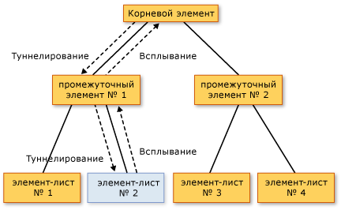

# Общие сведения о перенаправленных событиях
В этом разделе описывается понятие перенаправленных событий в [!INCLUDE[TLA#tla_winclient](../../../../includes/tlasharptla-winclient-md.md)]. Здесь определяется терминология перенаправленных событий, описывается, как перенаправленные события маршрутизируются через дерево элементов, кратко описываются способы обработки перенаправленных событий, а также способы создания пользовательских перенаправленных событий.
  
   
## Предварительные требования  
 Этот раздел предполагает наличие базовых знаний о [!INCLUDE[TLA#tla_clr](../../../../includes/tlasharptla-clr-md.md)] и объектно-ориентированном программировании,а также представление о связях между элементами [!INCLUDE[TLA2#tla_winclient](../../../../includes/tla2sharptla-winclient-md.md)] в виде дерева. Чтобы выполнить примеры в этом разделе, следует также понимать [!INCLUDE[TLA#tla_xaml](../../../../includes/tlasharptla-xaml-md.md)] и знать, как писать простые приложения или страницы [!INCLUDE[TLA2#tla_winclient](../../../../includes/tla2sharptla-winclient-md.md)]. Дополнительные сведения см. в разделе [Пошаговое руководство: Создание первого классического приложения WPF](../getting-started/walkthrough-my-first-wpf-desktop-application.md) и [Обзор XAML (WPF)](xaml-overview-wpf.md).  
  
   
## Что такое перенаправленное событие?  
 Перенаправленные события можно рассматривать с точки зрения функциональности или реализации. Здесь приводятся оба определения, чтобы пользователи могли выбрать наиболее подходящее для себя.  
  
 Функциональное определение: Перенаправленное событие — это тип события, которое может вызывать обработчики нескольких слушателей в дереве элементов, а не только объект, который вызвал событие.  
  
 Определение реализации: Перенаправленное событие — [!INCLUDE[TLA2#tla_clr](../../../../includes/tla2sharptla-clr-md.md)] событий, поддерживаемый экземпляр <xref:System.Windows.RoutedEvent> класса и обрабатывается [!INCLUDE[TLA#tla_winclient](../../../../includes/tlasharptla-winclient-md.md)] системой событий.  
  
 Обычно в приложении [!INCLUDE[TLA2#tla_winclient](../../../../includes/tla2sharptla-winclient-md.md)] содержится много элементов. В зависимости от того, созданы элементы в коде или объявлены в [!INCLUDE[TLA2#tla_xaml](../../../../includes/tla2sharptla-xaml-md.md)], они связаны в дереве элементов друг с другом. Маршрут события может проходить в одном из двух направлений в зависимости от определения события, но обычно маршрут проходит от исходного элемента и затем "всплывает" вверх по дереву элементов до тех пор, пока не достигнет корневого элемента дерева (как правило, страница или окно). Концепция всплывания может быть знакома, если имеется опыт работы с моделью DHTML-объектов.  
  
 Рассмотрим следующее простое дерево элементов.  
  
 [!code-xaml[EventOvwSupport#GroupButton](~/samples/snippets/csharp/VS_Snippets_Wpf/EventOvwSupport/CSharp/default.xaml#groupbutton)]  
  
 Это дерево элементов выглядит примерно следующим образом.  
  
   
  
 В этом упрощенном дереве элементов источником <xref:System.Windows.Controls.Primitives.ButtonBase.Click> событий является одним из <xref:System.Windows.Controls.Button> элементов и какое <xref:System.Windows.Controls.Button> была нажата — первый элемент, который имеет возможность обработать событие. Но если обработчик не присоединен к <xref:System.Windows.Controls.Button> действует на событие, а затем будет всплывать вверх до <xref:System.Windows.Controls.Button> родительского элемента в дереве элементов, который является <xref:System.Windows.Controls.StackPanel>. Потенциально событие может передаваться к <xref:System.Windows.Controls.Border>, а затем за пределы границы к корневой странице дерева элементов (не показано).  
  
 Другими словами, маршрутом события для данного <xref:System.Windows.Controls.Primitives.ButtonBase.Click> событие:  
  
 Button-->StackPanel-->Border-->...  
  
### Сценарии верхнего уровня для перенаправленных событий  
 Ниже приведен краткий обзор сценариев, определяющих концепцию перенаправления событий и то, почему обычного события [!INCLUDE[TLA2#tla_clr](../../../../includes/tla2sharptla-clr-md.md)] не было достаточно для осуществления этих сценариев.  
  
 **Составление элемента управления и инкапсуляция.** Различные элементы управления в [!INCLUDE[TLA2#tla_winclient](../../../../includes/tla2sharptla-winclient-md.md)] имеют расширенную модель содержимого. Например, можно поместить изображение внутри <xref:System.Windows.Controls.Button>, что эффективно расширит визуальное дерево кнопки. Тем не менее добавленное изображение не должно отключать проверку нажатия, которая позволяет кнопке реагировать на <xref:System.Windows.Controls.Primitives.ButtonBase.Click> ее содержимого, даже если пользователь нажимает пиксели, которые технически являются частью изображения.  
  
 **Точки присоединения обработчика:** В [!INCLUDE[TLA#tla_winforms](../../../../includes/tlasharptla-winforms-md.md)], придется присоединить один обработчик несколько раз для обработки событий, которые могут возникнуть из нескольких элементов. Перенаправленные события позволяют присоединить обработчик только один раз, как было показано в предыдущем примере, и при необходимости использовать логику обработки для определения места возникновения события. Например, это может быть обработчиком для ранее показанного [!INCLUDE[TLA2#tla_xaml](../../../../includes/tla2sharptla-xaml-md.md)].  
  
 [!code-csharp[EventOvwSupport#GroupButtonCodeBehind](~/samples/snippets/csharp/VS_Snippets_Wpf/EventOvwSupport/CSharp/default.xaml.cs#groupbuttoncodebehind)]
 [!code-vb[EventOvwSupport#GroupButtonCodeBehind](~/samples/snippets/visualbasic/VS_Snippets_Wpf/EventOvwSupport/visualbasic/default.xaml.vb#groupbuttoncodebehind)]  
  
 **Обработка классов:** Перенаправленные события разрешают использовать статический обработчик, который определен в классе. Этот обработчик классов может обрабатывать событие раньше любого вложенного обработчика экземпляров.  
  
 **Ссылка на событие без отражения:** Определенных методов кода и исправлений требуется Идентификация определенного события. Перенаправленное событие создает <xref:System.Windows.RoutedEvent> поле идентификатора, который обеспечивает надежный метод идентификации события, не требует статического отражения или выполнения отражения.  
  
### Реализация перенаправленных событий  
 Перенаправленное событие — [!INCLUDE[TLA2#tla_clr](../../../../includes/tla2sharptla-clr-md.md)] событий, поддерживаемый экземпляр <xref:System.Windows.RoutedEvent> класса и зарегистрирована [!INCLUDE[TLA2#tla_winclient](../../../../includes/tla2sharptla-winclient-md.md)] системой событий. <xref:System.Windows.RoutedEvent> Экземпляр, полученный из регистрации обычно сохраняется в качестве `public` `static` `readonly` члена класса, который регистрирует и таким образом «владеет» перенаправленным поля. Соединение с событием [!INCLUDE[TLA2#tla_clr](../../../../includes/tla2sharptla-clr-md.md)] с таким же именем (которое иногда называется событием программы-оболочки) выполняется путем переопределения реализаций `add` и `remove` для события [!INCLUDE[TLA2#tla_clr](../../../../includes/tla2sharptla-clr-md.md)]. Как правило, `add` и `remove` остаются неявными по умолчанию и используют соответствующий синтаксис события определенного языка для добавления и удаления обработчиков события. Механизм подключения и резервирования перенаправленного события похож как свойство зависимостей является [!INCLUDE[TLA2#tla_clr](../../../../includes/tla2sharptla-clr-md.md)] свойство, поддерживаемый <xref:System.Windows.DependencyProperty> класса и зарегистрирована [!INCLUDE[TLA2#tla_winclient](../../../../includes/tla2sharptla-winclient-md.md)] системы свойств.  
  
 В следующем примере показано объявление пользовательского `Tap` перенаправленного события, включая регистрацию и использование <xref:System.Windows.RoutedEvent> поле идентификатора и `add` и `remove` реализации для `Tap` [!INCLUDE[TLA2#tla_clr](../../../../includes/tla2sharptla-clr-md.md)] событий.  
  
 [!code-csharp[RoutedEventCustom#AddRemoveHandler](~/samples/snippets/csharp/VS_Snippets_Wpf/RoutedEventCustom/CSharp/SDKSampleLibrary/class1.cs#addremovehandler)]
 [!code-vb[RoutedEventCustom#AddRemoveHandler](~/samples/snippets/visualbasic/VS_Snippets_Wpf/RoutedEventCustom/VB/SDKSampleLibrary/Class1.vb#addremovehandler)]  
  
### Обработчики перенаправленных событий и XAML  
 Чтобы добавить обработчик для события с помощью [!INCLUDE[TLA2#tla_xaml](../../../../includes/tla2sharptla-xaml-md.md)], следует объявить имя события как атрибут для элемента, который является прослушивателем событий. Значением атрибута является имя метода реализуемого обработчика, который должен существовать в разделяемом классе файла кода программной части.  
  
 [!code-xaml[EventOvwSupport#SimplestSyntax](~/samples/snippets/csharp/VS_Snippets_Wpf/EventOvwSupport/CSharp/default.xaml#simplestsyntax)]  
  
 Синтаксис языка [!INCLUDE[TLA2#tla_xaml](../../../../includes/tla2sharptla-xaml-md.md)] для добавления стандартных обработчиков событий [!INCLUDE[TLA2#tla_clr](../../../../includes/tla2sharptla-clr-md.md)] одинаков для добавления обработчиков перенаправленных событий, так как на самом деле обработчики добавляются к программе-оболочке события [!INCLUDE[TLA2#tla_clr](../../../../includes/tla2sharptla-clr-md.md)], которая содержит реализацию перенаправленного события. Дополнительные сведения о добавлении обработчиков событий в [!INCLUDE[TLA2#tla_xaml](../../../../includes/tla2sharptla-xaml-md.md)] см. в разделе [Общие сведения о языке XAML (WPF)](xaml-overview-wpf.md).  
  
   
## Стратегии маршрутизации  
 Перенаправленные события используют одну из трех стратегий маршрутизации.  
  
-   **Восходящая маршрутизация:** Вызываются обработчики событий в источник событий. Перенаправленное событие затем следует к родительским элементам до достижения корневого элемента дерева. Большинство перенаправленных событий используют стратегию восходящей маршрутизации. События восходящей маршрутизации обычно используются для получения отчета об изменении входных данных или состояния от различных элементов управления или других элементов пользовательского интерфейса.  
  
-   **Direct:** Только элемент-источник события имеет возможность вызывать обработчики в ответ. Это является аналогом "маршрутизации", которая используется [!INCLUDE[TLA#tla_winforms](../../../../includes/tlasharptla-winforms-md.md)] для события. Тем не менее, в отличие от стандартного [!INCLUDE[TLA2#tla_clr](../../../../includes/tla2sharptla-clr-md.md)] событий, прямые перенаправленные события поддерживают обработку классов (обработка классов объясняется в следующем разделе) и может использоваться <xref:System.Windows.EventSetter> и <xref:System.Windows.EventTrigger>.  
  
-   **Туннелирование:** Изначально вызываются обработчики событий в корневого элемента дерева. Перенаправленное событие затем передается по маршруту через последовательные дочерние элементы к узловому элементу, который является источником перенаправленного события (элементом, вызвавшим перенаправленное событие). Нисходящая маршрутизация событий часто используется или обрабатывается как часть композиции для элемента управления таким образом, что события из составных частей композиции могут намеренно подавляться или заменяться событиями, которые определены для полного контроля. Входные события, которые содержатся в [!INCLUDE[TLA2#tla_winclient](../../../../includes/tla2sharptla-winclient-md.md)], часто реализуются в виде пары нисходящей и восходящей маршрутизации. События нисходящей маршрутизации также иногда называют событиями предварительного просмотра по причине используемого для пар соглашения об именах.  
  
   
## Зачем использовать перенаправленные события?  
 Разработчикам приложений не всегда необходимо знать, реализуется ли обрабатываемое событие как перенаправленное. Перенаправленные события имеют особое поведение, но такое событие остается невидимым, если обрабатывается в элементе, где оно возникает.  
  
 Перенаправленные события являются мощным инструментом при использовании их в одном из предлагаемых сценариев: при определении общих обработчиков для общего корня, при композиции собственного элемента управления или при определении собственного класса пользовательского элемента управления.  
  
 Прослушиватели перенаправленных событий и источники перенаправленных событий не требуются для совместного использования общего события в их иерархии. Любой <xref:System.Windows.UIElement> или <xref:System.Windows.ContentElement> может быть прослушивателем перенаправленных событий. Таким образом, можно использовать полный набор перенаправленных событий, доступных во всем рабочем [!INCLUDE[TLA2#tla_api](../../../../includes/tla2sharptla-api-md.md)] как концептуальный "интерфейс", посредством чего разнородные элементы в приложении могут обмениваться данными о событиях. Эта концепция "интерфейса" для перенаправленных событий особенно применима для событий ввода.  
  
 Перенаправленные события могут также использоваться для связи элементов дерева, так как данные событий сохраняются для каждого элемента в маршруте. Один элемент может изменить что-либо в данных события, и это изменение будет доступно для следующего элемента в маршруте.  
  
 Помимо маршрутизации, существуют еще две причины реализации события [!INCLUDE[TLA2#tla_winclient](../../../../includes/tla2sharptla-winclient-md.md)] в качестве перенаправленного события вместо стандартного события [!INCLUDE[TLA2#tla_clr](../../../../includes/tla2sharptla-clr-md.md)]. При реализации собственных событий рекомендуется учитывать приведенные далее принципы.  
  
-   Определенные [!INCLUDE[TLA2#tla_winclient](../../../../includes/tla2sharptla-winclient-md.md)] Стилизация и использование шаблонов функции, такие как <xref:System.Windows.EventSetter> и <xref:System.Windows.EventTrigger> требуется указанное событие было перенаправленным. Это сценарий идентификатора события, упомянутого выше.  
  
-   Перенаправленные события поддерживают механизм обработки классов, в силу чего класс может указывать статические методы, имеющие возможность обрабатывать перенаправленные события до того, как любой зарегистрированный обработчик экземпляров сможет получить к ним доступ. Это очень полезно при разработке элемента управления, поскольку класс может управляться с помощью событий, что не может быть случайно подавлено обработкой события в экземпляре.  
  
 Каждое из описанных выше рассуждений рассматривается в отдельной части этого раздела.  
  
   
## Добавление и реализация обработчика событий для перенаправленного события  
 Чтобы добавить обработчик событий в [!INCLUDE[TLA2#tla_xaml](../../../../includes/tla2sharptla-xaml-md.md)], просто добавьте имя события в элемент как атрибут и установите значение атрибута в качестве имени обработчика событий, который реализует соответствующий делегат, как показано в следующем примере.  
  
 [!code-xaml[EventOvwSupport#SimplestSyntax](~/samples/snippets/csharp/VS_Snippets_Wpf/EventOvwSupport/CSharp/default.xaml#simplestsyntax)]  
  
 `b1SetColor` — имя реализуемого обработчика, который содержит код, который обрабатывает <xref:System.Windows.Controls.Primitives.ButtonBase.Click> событий. `b1SetColor` должен иметь ту же сигнатуру, что <xref:System.Windows.RoutedEventHandler> делегат, который является делегатом обработчика событий для <xref:System.Windows.Controls.Primitives.ButtonBase.Click> событий. Первый параметр всех делегатов обработчиков перенаправленных событий указывает элемент, к которому добавляется обработчик событий, а второй параметр указывает данные для события.  
  
[!code-csharp[EventOvwSupport#SimpleHandlerA](~/samples/snippets/csharp/VS_Snippets_Wpf/EventOvwSupport/CSharp/default.xaml.cs#simplehandlera)]
[!code-vb[EventOvwSupport#SimpleHandlerA](~/samples/snippets/visualbasic/VS_Snippets_Wpf/EventOvwSupport/visualbasic/default.xaml.vb#simplehandlera)]  
  
 <xref:System.Windows.RoutedEventHandler> является делегатом обработчика перенаправленных событий basic. Для перенаправленных событий, которые являются специализированными для определенных элементов управления или скриптов, делегаты, которые используются для обработчиков перенаправленных событий, также могут быть более специализированными, чтобы они могли передавать определенные данные события. Например, в общем сценарии ввода можно обработать <xref:System.Windows.UIElement.DragEnter> перенаправленного события. Обработчик должен реализовывать <xref:System.Windows.DragEventHandler> делегировать. С помощью наиболее конкретного делегата, можно обработать <xref:System.Windows.DragEventArgs> в обработчике событий и прочитать <xref:System.Windows.DragEventArgs.Data%2A> свойство, которое содержит полезные данные буфера обмена операции перетаскивания.  
  
 Полный пример добавления обработчика событий к элементу с помощью [!INCLUDE[TLA2#tla_xaml](../../../../includes/tla2sharptla-xaml-md.md)] см. в разделе [Обработка перенаправленных событий](how-to-handle-a-routed-event.md).  
  
 Добавить обработчик для перенаправленного события в приложении, созданном в коде, достаточно просто. Обработчики перенаправленных событий всегда можно добавлять с помощью вспомогательного метода <xref:System.Windows.UIElement.AddHandler%2A> (который является тот же метод, который вызывает резервной копией для `add`.) Однако существующие перенаправленные события  [!INCLUDE[TLA2#tla_winclient](../../../../includes/tla2sharptla-winclient-md.md)] обычно имеют резервную реализацию `add` и логику `remove`, позволяющую добавлять обработчики перенаправленных событий с помощью синтаксиса событий для определенного языка, являющегося более понятным, чем вспомогательный метод. Ниже приведен пример использования вспомогательного метода.  
  
 [!code-csharp[EventOvwSupport#AddHandlerCode](~/samples/snippets/csharp/VS_Snippets_Wpf/EventOvwSupport/CSharp/default.xaml.cs#addhandlercode)]
 [!code-vb[EventOvwSupport#AddHandlerCode](~/samples/snippets/visualbasic/VS_Snippets_Wpf/EventOvwSupport/visualbasic/default.xaml.vb#addhandlercode)]  
  
 В следующем примере показан C# синтаксис оператора (Visual Basic имеет немного другой синтаксис оператора из-за обработки разыменовывания):  
  
 [!code-csharp[EventOvwSupport#AddHandlerPlusEquals](~/samples/snippets/csharp/VS_Snippets_Wpf/EventOvwSupport/CSharp/default.xaml.cs#addhandlerplusequals)]
 [!code-vb[EventOvwSupport#AddHandlerPlusEquals](~/samples/snippets/visualbasic/VS_Snippets_Wpf/EventOvwSupport/visualbasic/default.xaml.vb#addhandlerplusequals)]  
  
 Пример добавления обработчика событий в коде см. в разделе [Добавление обработчика событий с помощью кода](how-to-add-an-event-handler-using-code.md).  
  
 Если вы используете Visual Basic, можно также использовать `Handles` ключевое слово, чтобы добавить обработчик как часть объявлений обработчика. Дополнительные сведения см. в разделе [Обработка событий в Visual Basic и WPF](visual-basic-and-wpf-event-handling.md).  
  
   
### Концепция обработанных событий  
 Все перенаправленные события совместно используют общий базовый класс данных события, <xref:System.Windows.RoutedEventArgs>. <xref:System.Windows.RoutedEventArgs> Определяет <xref:System.Windows.RoutedEventArgs.Handled%2A> свойство, которое принимает логическое значение. Цель <xref:System.Windows.RoutedEventArgs.Handled%2A> свойство является включение любой обработчик событий в маршруте мог отметить перенаправленное событие как *обрабатываются*, его значение <xref:System.Windows.RoutedEventArgs.Handled%2A> для `true`. После обработки обработчиком в одном элементе в маршруте совместно используемые данные события снова предоставляются каждому прослушивателю в маршруте.  
  
 Значение <xref:System.Windows.RoutedEventArgs.Handled%2A> влияет на перенаправленное событие сообщил или обрабатываются во время их передачи дальнейшего в маршруте. Если <xref:System.Windows.RoutedEventArgs.Handled%2A> является `true` событий данные для перенаправленного события, а затем обработчики, которые прослушивают перенаправляемые события на другие элементы, обычно больше не вызываются для этого конкретного экземпляра события. Это справедливо как для обработчиков, присоединенных к [!INCLUDE[TLA2#tla_xaml](../../../../includes/tla2sharptla-xaml-md.md)], так и для обработчиков, добавленных с помощью синтаксиса присоединения обработчика событий конкретного языка, например `+=` или `Handles`. Для наиболее общих сценариев обработки Пометка события как обработанного путем присвоения <xref:System.Windows.RoutedEventArgs.Handled%2A> для `true` будет «stop» нисходящую или восходящую маршрутизацию событий, а также для любого события, которое обрабатывается в точке маршрута обработчиком классов маршрутизацию.  
  
 Тем не менее, отсутствует «handledEventsToo» механизм, посредством которого прослушиватели могут по-прежнему запускать обработчики в ответ на перенаправляемые события где <xref:System.Windows.RoutedEventArgs.Handled%2A> является `true` в данных события. Другими словами, маршрут события в действительности не останавливается при пометке события в данных события как обработанного. Механизм handledEventsToo можно использовать только в коде или в <xref:System.Windows.EventSetter>:  
  
-   В коде, вместо того чтобы использовать синтаксис события определенного языка, который работает для общих [!INCLUDE[TLA2#tla_clr](../../../../includes/tla2sharptla-clr-md.md)] события, вызывать [!INCLUDE[TLA2#tla_winclient](../../../../includes/tla2sharptla-winclient-md.md)] метод <xref:System.Windows.UIElement.AddHandler%28System.Windows.RoutedEvent%2CSystem.Delegate%2CSystem.Boolean%29> для добавления обработчика. Задайте для `handledEventsToo` значение `true`.  
  
-   В <xref:System.Windows.EventSetter>, задайте <xref:System.Windows.EventSetter.HandledEventsToo%2A> атрибут, который будет `true`.  
  
 Помимо поведения, <xref:System.Windows.RoutedEventArgs.Handled%2A> создает состояние в маршрутизированных событиях, концепция <xref:System.Windows.RoutedEventArgs.Handled%2A> влияет на том, как должны разрабатываться приложение и написать код обработчика событий. Можно представить <xref:System.Windows.RoutedEventArgs.Handled%2A> как простой протокол, предоставляемый перенаправленными событиями. Способы использования этого протокола является, однако концептуальное проектирование как значение <xref:System.Windows.RoutedEventArgs.Handled%2A> предназначен для использования выглядит следующим образом:  
  
-   Если перенаправленное событие помечено как обработанное, то затем его не требуется снова обрабатывать другими элементами в маршруте.  
  
-   Если перенаправленное событие не помечено как обработанное, то либо не регистрировал обработчик или обработчики, которые были зарегистрированных разрешили использовать данные события и установили отказались другой прослушиватель, более ранний в маршруте <xref:System.Windows.RoutedEventArgs.Handled%2A> для `true`. (Или, возможно, текущий прослушиватель является первой точкой в маршруте.) Обработчики на текущем прослушивателе имеют три возможных варианта действий.  
  
    -   Не выполнять никаких действий. Событие остается необработанным и переходит к следующему прослушивателю.  
  
    -   Выполнить код в ответ на событие, при этом убедиться, что выполненное действие не было достаточно существенным, чтобы пометить событие как обработанное. Событие перенаправляется к следующему прослушивателю.  
  
    -   Выполнить кода в ответ на событие. Пометить событие как обработанное в данных события, передаваемых обработчику, потому что предпринятое действие считается достаточно существенным, чтобы пометить событие как обработанное. Событие перенаправляется к следующему прослушивателю, но с <xref:System.Windows.RoutedEventArgs.Handled%2A> = `true` в его данных события, поэтому только `handledEventsToo` прослушиватели имеют возможность вызвать следующие обработчики.  
  
 Этот концептуальный проект подкреплен описанным ранее поведением при маршрутизации: более сложным (хотя и возможным для кода и стилей) является присоединение обработчиков для перенаправленных событий, которые вызываются, даже если предыдущий обработчик маршрута уже установил <xref:System.Windows.RoutedEventArgs.Handled%2A>для `true`.  
  
 Дополнительные сведения о <xref:System.Windows.RoutedEventArgs.Handled%2A>, обработка класса перенаправленных событий и рекомендации о том, когда необходимо помечать перенаправленное событие как <xref:System.Windows.RoutedEventArgs.Handled%2A>, см. в разделе [маркировка перенаправленных событий как обработанных и обработка классов](marking-routed-events-as-handled-and-class-handling.md).  
  
 В приложениях весьма распространена обработка только перенаправляемого по восходящей события в объекте, который вызывал его, независимо от характеристик маршрутизации события. Однако все же рекомендуется помечать перенаправленное событие как обработанное в данных события, чтобы избежать непредвиденных побочных эффектов на случай, если элемент, который далее следует в дереве элементов, имеет вложенный обработчик для этого же перенаправленного события.  
  
   
## Обработчики классов  
 При определении класса, производного каким-либо образом из <xref:System.Windows.DependencyObject>, можно также определить и присоединить обработчик класса для перенаправленного события, который является объявленным или унаследованным элементом события класса. Обработчики классов вызываются ранее любого обработчика прослушивателей экземпляров, присоединенного к экземпляру этого класса, всякий раз, когда перенаправленное событие встречает экземпляр элемента в своем маршруте.  
  
 Некоторые элементы управления [!INCLUDE[TLA2#tla_winclient](../../../../includes/tla2sharptla-winclient-md.md)] имеют внутреннюю обработку классов для некоторых перенаправленных событий. Может показаться, что перенаправленное событие не возникает никогда, но на самом деле оно обрабатывается классом и перенаправленное событие по-прежнему может потенциально обрабатываться с помощью обработчиков экземпляров при использовании определенных методов. Кроме того, многие базовые классы и элементы управления предоставляют виртуальные методы, которые могут быть использованы для переопределения поведения при обработке классов. Дополнительные сведения о том, как обрабатывать нежелательные классы и как определить обработку собственного класса в пользовательском классе, см. в разделе [Маркировка перенаправленных событий как обработанных и обработка классов](marking-routed-events-as-handled-and-class-handling.md).  
  
   
## Вложенные события в WPF  
 [!INCLUDE[TLA2#tla_xaml](../../../../includes/tla2sharptla-xaml-md.md)] также определяет специальный тип события, называемого *вложенным событием*. Вложенное событие позволяет добавлять обработчик для конкретного события в произвольный элемент. Элементу, обрабатывающему событие, не требуется определять или наследовать вложенное событие, и ни объект, который потенциально может вызвать событие, ни экземпляр обработки места назначения не должны определять или каким-либо иным способом владеть этим событием в качестве элемента класса.  
  
 Система ввода [!INCLUDE[TLA2#tla_winclient](../../../../includes/tla2sharptla-winclient-md.md)] широко использует вложенные события. Однако практически все эти вложенные события перенаправляются через базовые элементы. События ввода затем отображаются как эквивалент невложенных перенаправленных событий, которые являются членами класса базового элемента. К примеру, присоединенное событие основной <xref:System.Windows.Input.Mouse.MouseDown?displayProperty=nameWithType> может намного легче обрабатываться на любой заданной <xref:System.Windows.UIElement> с помощью <xref:System.Windows.UIElement.MouseDown> об этом <xref:System.Windows.UIElement> вместо работы с синтаксисом присоединенных событий, либо в [!INCLUDE[TLA2#tla_xaml](../../../../includes/tla2sharptla-xaml-md.md)] или кода.  
  
 Дополнительные сведения о вложенных событиях в [!INCLUDE[TLA2#tla_winclient](../../../../includes/tla2sharptla-winclient-md.md)] см. в разделе [Общие сведения о вложенных событиях](attached-events-overview.md).  
  
   
## Полные имена событий в XAML  
 Другой синтаксис напоминает синаксис *typename*. *EventName* вложенного события, но он не является синтаксисом вложенного события при присоединении обработчиков для перенаправленных событий, вызываемых дочерними элементами. Обработчики присоединяются в общем родительском элементе, чтобы воспользоваться преимуществами маршрутизации событий, несмотря на то что общий родительский элемент может не иметь соответствующего перенаправленного события в качестве члена. Рассмотрим этот пример еще раз.  
  
 [!code-xaml[EventOvwSupport#GroupButton](~/samples/snippets/csharp/VS_Snippets_Wpf/EventOvwSupport/CSharp/default.xaml#groupbutton)]  
  
 Здесь является прослушивателем родительского элемента, где добавляется обработчик <xref:System.Windows.Controls.StackPanel>. Тем не менее, она добавляет обработчик для перенаправленного события, который был объявлен и будет вызываться <xref:System.Windows.Controls.Button> класс (<xref:System.Windows.Controls.Primitives.ButtonBase> на самом деле, но доступен для <xref:System.Windows.Controls.Button> через наследование). <xref:System.Windows.Controls.Button> «владеет» событием, но система перенаправленных событий позволяет обработчикам любого перенаправленного события быть присоединенными к любому <xref:System.Windows.UIElement> или <xref:System.Windows.ContentElement> прослушиватель экземпляра, в противном случае может присоединить прослушиватели для [!INCLUDE[TLA#tla_clr](../../../../includes/tlasharptla-clr-md.md)] событий. Пространством имен xmlns по умолчанию для этих полных имен атрибутов событий обычно является пространство имен xmlns [!INCLUDE[TLA2#tla_winclient](../../../../includes/tla2sharptla-winclient-md.md)] по умолчанию, но можно также указать префиксные пространства имен для пользовательских перенаправленных событий. Дополнительные сведения о xmlns см. в разделе [Пространства имен XAML и сопоставление пространств имен для WPF XAML](xaml-namespaces-and-namespace-mapping-for-wpf-xaml.md).  
  
   
## События ввода WPF  
 Перенаправленные события в платформе [!INCLUDE[TLA2#tla_winclient](../../../../includes/tla2sharptla-winclient-md.md)] часто применяются для событий ввода. В [!INCLUDE[TLA2#tla_winclient](../../../../includes/tla2sharptla-winclient-md.md)] имена перенаправляемых по нисходящей событий по соглашению указываются с префиксом Preview. События ввода часто возникают попарно, одно маршрутизируется по восходящей, другое — по нисходящей. Например <xref:System.Windows.ContentElement.KeyDown> событий и <xref:System.Windows.ContentElement.PreviewKeyDown> событий имеют одинаковую сигнатуру, при этом первое является событием восходящей маршрутизации ввода, а второе — по нисходящей событий ввода. Иногда события ввода имеют только восходящую или, возможно, только прямую маршрутизацию. В документации в разделах, посвященных перенаправленным событиям, содержатся перекрестные ссылки на аналогичные перенаправленные события с альтернативной стратегией маршрутизации, если такие перенаправленные события существуют, и ссылки на разделы документации для уточнения стратегии маршрутизации каждого перенаправленного события.  
  
 [!INCLUDE[TLA2#tla_winclient](../../../../includes/tla2sharptla-winclient-md.md)] входные события, возникающие попарно, реализуются так, что одно действие пользователя из входных данных, таких как нажатие кнопки мыши, последовательно вызовет оба перенаправленные события пары. Сначала вызывается событие, которое маршрутизируется по нисходящей. Затем вызывается событие, которое маршрутизируется по восходящей. Два события буквально совместно используют тот же экземпляр данных события, так как <xref:System.Windows.UIElement.RaiseEvent%2A> вызов метода в реализующем классе восходящей маршрутизации событие, которое ожидает передачи данных для данных события, события и повторно использует его для новых вызываемых событий. Прослушиватели с обработчиками для события, маршрутизирующегося по нисходящей, могут первыми пометить перенаправленное событие как обработанное (сначала обработчики классов, затем обработчики экземпляров). Если элемент при нисходящей маршрутизации отметил перенаправленное событие как обработанное, уже обработанные данные события отправляются для события, маршрутизирующегося по восходящей, и типичные обработчики, вложенные для эквивалентных маршрутизируемых по восходящей событий, не будут вызываться. Внешне это будет выглядеть так, как будто обработанное маршрутизируемое по восходящей событие и не вызывалось. Поведение при обработке полезно использовать при композиции элементов управления, где требуется, чтобы конечный элемент управления (а не его составные части) создавал отчеты о событиях проверки нажатия при вводе или событиях ввода на основе фокуса. Конечный элемент управления находится ближе к корневому элементу в композиции и поэтому имеет возможность обработать событие, передаваемое по нисходящей, первым и, возможно, "заменить" это перенаправленное событие более подходящим для данного элемента управления как часть кода, которая резервирует класс элемента управления.  
  
 В качестве иллюстрации того, как обрабатываются события ввода, рассмотрим следующий пример. На следующем рисунке дерева `leaf element #2` является источником событий `PreviewMouseDown` и `MouseDown`.  
  
   
Восходящая и нисходящая маршрутизация событий ввода  
  
 Порядок обработки событий выглядит следующим образом.  
  
1. `PreviewMouseDown` (нисходящее) на корневом элементе.  
  
2. `PreviewMouseDown` (нисходящее) на промежуточном элементе #1.  
  
3. `PreviewMouseDown` (нисходящее) на исходном элементе #2.  
  
4. `MouseDown` (всплывающее) на исходном элементе #2.  
  
5. `MouseDown` (всплывающее) на промежуточном элементе #1.  
  
6. `MouseDown` (всплывающее) на корневом элементе.  
  
 Делегат обработчика перенаправленных событий содержит ссылки на два объекта: объект, который вызвал событие, и объект, в котором был вызван обработчик. Объект, в котором был вызван обработчик, указывается с помощью параметра `sender`. Объект, где было вызвано событие сообщает <xref:System.Windows.RoutedEventArgs.Source%2A> свойство в данных события. Перенаправленное событие может по-прежнему возникает и обрабатывается один и тот же объект, в этом случае `sender` и <xref:System.Windows.RoutedEventArgs.Source%2A> идентичны (это происходит на этапах 3 и 4, в примере обработки).  
  
 Из-за нисходящей и восходящей маршрутизации родительские элементы получают события ввода, где <xref:System.Windows.RoutedEventArgs.Source%2A> является одним из их дочерних элементов. При очень важно знать, что такое исходного элемента, можно определить исходный элемент, обратившись к <xref:System.Windows.RoutedEventArgs.Source%2A> свойство.  
  
 Как правило когда событие ввода помечено <xref:System.Windows.RoutedEventArgs.Handled%2A>, дополнительные обработчики не вызываются. Обычно события ввода помечаются как обработанные сразу же после вызова обработчика, который при обработке события ввода опирается на логику приложения.  
  
 Исключением из общего правила о <xref:System.Windows.RoutedEventArgs.Handled%2A> обработчики событий, зарегистрированные для намеренного игнорирования ввода находится в состоянии <xref:System.Windows.RoutedEventArgs.Handled%2A> состояние данных событий будет по-прежнему вызываться в маршруте. Дополнительные сведения см. в разделах [События предварительного просмотра](preview-events.md) или [Маркировка перенаправленных событий как обработанных и обработка классов](marking-routed-events-as-handled-and-class-handling.md).  
  
 Модель общего использования данных события при нисходящей и восходящей маршрутизации и последовательный вызов сначала нисходящих, а потом всплывающих событий не обязательно выполняются для всех перенаправленных событий. Такое поведение реализуется в зависимости от того, как устройства ввода [!INCLUDE[TLA2#tla_winclient](../../../../includes/tla2sharptla-winclient-md.md)] вызывают или соединяют пары событий ввода. Дополнительным сценарием является реализация собственных событий ввода, но эту модель также можно реализовывать для собственных событий ввода.  
  
 В определенных классах обработка классов используется для определенных событий ввода, как правило, с целью переопределения значения событий ввода, вызываемых пользователем, и вызова новых событий. Дополнительные сведения см. в разделе [Маркировка перенаправленных событий как обработанных и обработка классов](marking-routed-events-as-handled-and-class-handling.md).  
  
 Дополнительные сведения о вводе данных и о том, как ввод данных и события взаимодействуют в обычных сценариях приложения, см. в разделе [Общие сведения о входных данных](input-overview.md).  
  
   
## EventSetters и EventTriggers  
 В стилях, можно включить какой-либо предопределенный [!INCLUDE[TLA2#tla_xaml](../../../../includes/tla2sharptla-xaml-md.md)] обработки синтаксис в разметке с помощью событий <xref:System.Windows.EventSetter>. При применении стиля указанный обработчик добавляется в экземпляр стиля. Можно объявить <xref:System.Windows.EventSetter> только для перенаправленного события. Пример. Обратите внимание, что указанный метод `b1SetColor` находится в файле кода программной части.  
  
 [!code-xaml[EventOvwSupport#XAML2](~/samples/snippets/csharp/VS_Snippets_Wpf/EventOvwSupport/CSharp/page2.xaml#xaml2)]  
  
 — Это преимущество, что стиль является скорее всего, содержать много другой информации, которая могла бы применяться к любой кнопке в приложении, и необходимости <xref:System.Windows.EventSetter> быть частью этого стиля способствует повторному использованию кода даже на уровне разметки. Кроме того <xref:System.Windows.EventSetter> отделяет имена методов для обработчиков один шаг вперед от Общие приложения и страницы разметки.  
  
 Другим особым синтаксисом, который сочетает перенаправленных событий и анимации возможности [!INCLUDE[TLA2#tla_winclient](../../../../includes/tla2sharptla-winclient-md.md)] является <xref:System.Windows.EventTrigger>. Как и в <xref:System.Windows.EventSetter>, только перенаправленные события могут использоваться для <xref:System.Windows.EventTrigger>. Как правило <xref:System.Windows.EventTrigger> объявляется как часть стиля, но <xref:System.Windows.EventTrigger> также могут быть объявлены на уровне элементов страницы как часть <xref:System.Windows.FrameworkElement.Triggers%2A> коллекции, или в <xref:System.Windows.Controls.ControlTemplate>. <xref:System.Windows.EventTrigger> Позволяет указать <xref:System.Windows.Media.Animation.Storyboard> что запускается каждый раз, когда перенаправленное событие встречает на своем маршруте элемент, который объявляет <xref:System.Windows.EventTrigger> для этого события. Преимущество <xref:System.Windows.EventTrigger> просто обработав событие, и для запуска существующей раскадровки том, что <xref:System.Windows.EventTrigger> обеспечивает лучший контроль над раскадровкой и его поведение во время выполнения. Дополнительные сведения см. в разделе [Использование триггеров событий для управления раскадровкой после ее запуска](../graphics-multimedia/how-to-use-event-triggers-to-control-a-storyboard-after-it-starts.md).  
  
   
## Дополнительные сведения о перенаправленных событиях  
 В этом разделе перенаправленные события рассматриваются, главным образом, с точки зрения описания основных понятий. Также приводится руководство по тому, как и когда следует отвечать на перенаправляемые события, которые уже существуют в различных базовых элементах и элементах управления. Однако можно создать собственное перенаправленное событие на пользовательском классе вместе со всей необходимой поддержкой, такой как особые для этого события классы данных и делегаты. Владельцем перенаправленного события может быть любой класс, но перенаправленные события должны вызываться и обрабатываться <xref:System.Windows.UIElement> или <xref:System.Windows.ContentElement> производные классы для практического. Дополнительные сведения о пользовательских событиях см. в разделе [Создание пользовательских событий маршрутизации](how-to-create-a-custom-routed-event.md).  
  
## См. также

- <xref:System.Windows.EventManager>
- <xref:System.Windows.RoutedEvent>
- <xref:System.Windows.RoutedEventArgs>
- [Маркировка перенаправленных событий как обработанных и обработка классов](marking-routed-events-as-handled-and-class-handling.md)
- [Общие сведения о входных данных](input-overview.md)
- [Общие сведения о системе команд](commanding-overview.md)
- [Пользовательские свойства зависимостей](custom-dependency-properties.md)
- [Деревья в WPF](trees-in-wpf.md)
- [Шаблоны слабых событий](weak-event-patterns.md)
