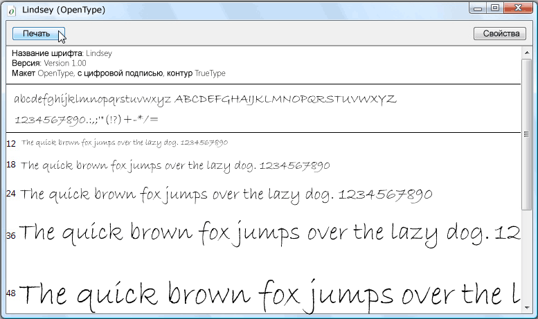

# Образец пакета шрифтов OpenTypeSample OpenType Font Pack
В этой теме представлен обзор образца шрифтов OpenType, которые распространяются с помощью Windows SDK.This topic provides an overview of the sample OpenType fonts that are distributed with the Windows SDK. Образец шрифтов поддерживает расширенные функции [!INCLUDE[TLA#tla_winclient](../../../../includes/tlasharptla-winclient-md.md)] OpenType, которые могут быть использованы приложениями.The sample fonts support extended OpenType features that can be used by [!INCLUDE[TLA#tla_winclient](../../../../includes/tlasharptla-winclient-md.md)] applications.  

## Шрифты в пакете шрифтов OpenTypeFonts in the OpenType Font Pack  
 SDK Windows предоставляет набор примеров шрифтов OpenType, [!INCLUDE[TLA#tla_winclient](../../../../includes/tlasharptla-winclient-md.md)] которые можно использовать при создании приложений.The Windows SDK provides a set of sample OpenType fonts that you can use in creating [!INCLUDE[TLA#tla_winclient](../../../../includes/tlasharptla-winclient-md.md)] applications. Образцы шрифтов предоставляются по лицензии от Ascender Corporation.The sample fonts are supplied under license from Ascender Corporation. Эти шрифты реализуют только подмножество общих функций, определенных форматом OpenType.These fonts implement only a subset of the total features defined by the OpenType format. В следующей таблице перечислены имена шрифтов OpenType.The following table lists the names of the sample OpenType fonts.  
  
|**Название****Name**|**Файл****File**|  
|--------------|--------------|  
|KootenayKootenay|Kooten.ttfKooten.ttf|  
|LindseyLindsey|Linds.ttfLinds.ttf|  
|MiramonteMiramonte|Miramo.ttfMiramo.ttf|  
|Miramonte BoldMiramonte Bold|Miramob.ttfMiramob.ttf|  
|PericlesPericles|Peric.ttfPeric.ttf|  
|Pericles LightPericles Light|Pericl.ttfPericl.ttf|  
|PescaderoPescadero|Pesca.ttfPesca.ttf|  
|Pescadero BoldPescadero Bold|Pescab.ttfPescab.ttf|  
  
 На следующей иллюстрации показано, как выглядят образцы шрифтов OpenType.The following illustration shows what the sample OpenType fonts look like.  
  
   
  
 Образцы шрифтов предоставляются по лицензии от Ascender Corporation.The sample fonts are supplied under license from Ascender Corporation. Ascender является поставщиком передовых решений для шрифтов.Ascender is a provider of advanced font products. Для лицензирования расширенных или настраиваемых версий образцов шрифтов см. [веб-сайт корпорации Ascender](https://www.monotype.com/).To license extended or custom versions of the sample fonts, see [Ascender Corporation's Web site](https://www.monotype.com/).  
  
> [!NOTE]
> Являясь разработчиком, вы несете ответственность за наличие у вас необходимых лицензионных прав на любой шрифт, который вы включаете в приложение или распространяете иным образом.As a developer it is your responsibility to ensure that you have the required license rights for any font you embed within an application or otherwise redistribute.  
  

## Установка шрифтовInstalling the Fonts  
 У вас есть возможность установки образца шрифтов OpenType в каталог шрифтов Windows по умолчанию, **sWINDOWS-Fonts.**You have the option of installing the sample OpenType fonts to the default Windows Fonts directory, **\WINDOWS\Fonts**. Для установки шрифтов используйте панель управления Fonts.Use the Fonts control panel to install the fonts. После того, как эти шрифты находятся на вашем компьютере, они доступны для всех приложений, которые ссылаются на шрифты Windows по умолчанию.Once these fonts are on your computer, they are accessible to all applications that reference default Windows fonts. Можно отобразить характерный набор символов в нескольких размерах шрифта, дважды нажав файл шрифта.You can display a representative set of characters in several font sizes by doubling-clicking the font file. На следующем снимке экрана показан файл шрифта Lindsey, Linds.ttf.The following screenshot shows the Lindsey font file, Linds.ttf.  
  
   
Отображение шрифта LindseyDisplaying the Lindsey font  
  

## Использование шрифтовUsing the Fonts  
 Есть два способа использования шрифтов в вашем приложении.There are two ways that you can use fonts in your application. Можно добавить шрифты в приложение в виде элементов содержимого проекта, которые не внедряются в качестве ресурсов в сборку.You can add fonts to your application as project content items that are not embedded as resources within an assembly. Кроме того, можно добавить шрифты в приложение в виде элементов ресурсов проекта, которые внедряются в файлы сборки приложения.Alternatively, you can add fonts to your application as project resource items that are embedded within the application's assembly files. Дополнительные сведения см. в разделе [Упаковка шрифтов с приложениями](packaging-fonts-with-applications.md).For more information, see [Packaging Fonts with Applications](packaging-fonts-with-applications.md).  
  
## См. также разделSee also

- <xref:System.Windows.Documents.Typography>
- [Возможности шрифта OpenTypeOpenType Font Features](opentype-font-features.md)
- [Упаковка шрифтов с приложениямиPackaging Fonts with Applications](packaging-fonts-with-applications.md)
