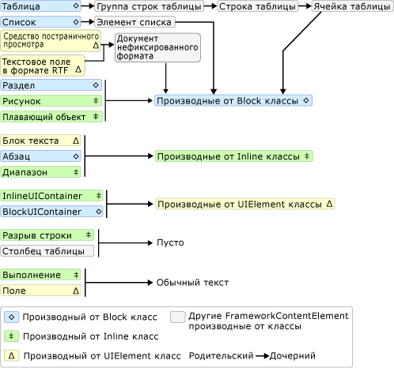
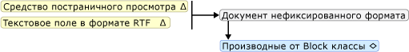
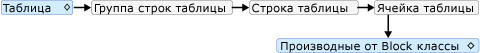
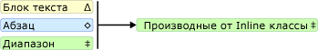

# Общие сведения о модели содержимого TextElementTextElement Content Model Overview
В этом обзоре модели содержимого описывается поддерживаемое содержимое для <xref:System.Windows.Documents.TextElement>.This content model overview describes the supported content for a <xref:System.Windows.Documents.TextElement>. Класс <xref:System.Windows.Documents.Paragraph> является типом <xref:System.Windows.Documents.TextElement>.The <xref:System.Windows.Documents.Paragraph> class is a type of <xref:System.Windows.Documents.TextElement>. Модель содержимого описывает объекты/элементы, которые могут содержаться в других объектах.A content model describes what objects/elements can be contained in others. В этом обзоре представлена модель содержимого, используемая для объектов, производных от <xref:System.Windows.Documents.TextElement>.This overview summarizes the content model used for objects derived from <xref:System.Windows.Documents.TextElement>. Дополнительные сведения см. в разделе [Общие сведения о потоковых документах](flow-document-overview.md).For more information, see [Flow Document Overview](flow-document-overview.md).  

   
## Схема модели содержимогоContent Model Diagram  
 На следующей схеме представлена модель содержимого для классов, производных от <xref:System.Windows.Documents.TextElement>, а также сведения о том, как другие классы, не относящиеся к `TextElement`, помещаются в эту модель.The following diagram summarizes the content model for classes derived from <xref:System.Windows.Documents.TextElement> as well as how other non- `TextElement` classes fit into this model.  
  
   
  
 Как видно из предыдущей диаграммы, дочерние элементы, разрешенные для элемента, не обязательно определяются тем, является ли класс производным от класса <xref:System.Windows.Documents.Block> или класса <xref:System.Windows.Documents.Inline>.As can be seen from the preceding diagram, the children allowed for an element are not necessarily determined by whether a class is derived from the <xref:System.Windows.Documents.Block> class or an <xref:System.Windows.Documents.Inline> class. Например, <xref:System.Windows.Documents.Span> (производный от <xref:System.Windows.Documents.Inline>класс) может иметь только <xref:System.Windows.Documents.Inline> дочерние элементы, но <xref:System.Windows.Documents.Figure> (также производный от <xref:System.Windows.Documents.Inline>класс) может иметь только <xref:System.Windows.Documents.Block> дочерние элементы.For example, a <xref:System.Windows.Documents.Span> (an <xref:System.Windows.Documents.Inline>-derived class) can only have <xref:System.Windows.Documents.Inline> child elements, but a <xref:System.Windows.Documents.Figure> (also an <xref:System.Windows.Documents.Inline>-derived class) can only have <xref:System.Windows.Documents.Block> child elements. Таким образом, схему можно использовать для быстрого определения элемента, который может содержаться в другом элементе.Therefore, a diagram is useful for quickly determining what element can be contained in another. В качестве примера рассмотрим схему, чтобы определить, как создать содержимое нефиксированного формата <xref:System.Windows.Controls.RichTextBox>.As an example, let's use the diagram to determine how to construct the flow content of a <xref:System.Windows.Controls.RichTextBox>.  
  
1. <xref:System.Windows.Controls.RichTextBox> должен содержать <xref:System.Windows.Documents.FlowDocument>, который, в свою очередь, должен содержать объект, производный от <xref:System.Windows.Documents.Block>.A <xref:System.Windows.Controls.RichTextBox> must contain a <xref:System.Windows.Documents.FlowDocument> which in turn must contain a <xref:System.Windows.Documents.Block>-derived object. Ниже приведен соответствующий сегмент из предыдущей диаграммы.The following is the corresponding segment from the preceding diagram.  
  
       
  
     Разметка может выглядеть следующим образом.Thus far, this is what the markup might look like.  
  
     [!code-xaml[FlowOvwSnippets_snip#SchemaWalkThrough1](~/samples/snippets/csharp/VS_Snippets_Wpf/FlowOvwSnippets_snip/CS/MiscSnippets.xaml#schemawalkthrough1)]  
  
2. В соответствии с схемой можно выбрать несколько <xref:System.Windows.Documents.Block> элементов, включая <xref:System.Windows.Documents.Paragraph>, <xref:System.Windows.Documents.Section>, <xref:System.Windows.Documents.Table>, <xref:System.Windows.Documents.List>и <xref:System.Windows.Documents.BlockUIContainer> (см. раздел классы, производные от блока на предыдущей схеме).According to the diagram, there are several <xref:System.Windows.Documents.Block> elements to choose from including <xref:System.Windows.Documents.Paragraph>, <xref:System.Windows.Documents.Section>, <xref:System.Windows.Documents.Table>, <xref:System.Windows.Documents.List>, and <xref:System.Windows.Documents.BlockUIContainer> (see Block-derived classes in the preceding diagram). Предположим, нам нужен <xref:System.Windows.Documents.Table>.Let's say we want a <xref:System.Windows.Documents.Table>. В соответствии с предыдущей схемой <xref:System.Windows.Documents.Table> содержит <xref:System.Windows.Documents.TableRowGroup>, содержащий элементы <xref:System.Windows.Documents.TableRow>, которые содержат элементы <xref:System.Windows.Documents.TableCell>, содержащие объект, производный от <xref:System.Windows.Documents.Block>.According to the preceding diagram, a <xref:System.Windows.Documents.Table> contains a <xref:System.Windows.Documents.TableRowGroup> containing <xref:System.Windows.Documents.TableRow> elements, which contain <xref:System.Windows.Documents.TableCell> elements which contain a <xref:System.Windows.Documents.Block>-derived object. Ниже приведен соответствующий сегмент для <xref:System.Windows.Documents.Table>, взятых из предыдущей диаграммы.The following is the corresponding segment for <xref:System.Windows.Documents.Table> taken from the preceding diagram.  
  
       
  
     Ниже приведена соответствующая разметка.The following is the corresponding markup.  
  
     [!code-xaml[FlowOvwSnippets_snip#SchemaWalkThrough2](~/samples/snippets/csharp/VS_Snippets_Wpf/FlowOvwSnippets_snip/CS/MiscSnippets.xaml#schemawalkthrough2)]  
  
3. Опять же, в <xref:System.Windows.Documents.TableCell>требуется один или несколько элементов <xref:System.Windows.Documents.Block>.Again, one or more <xref:System.Windows.Documents.Block> elements are required underneath a <xref:System.Windows.Documents.TableCell>. Для удобства поместим часть текста в ячейку.To make it simple, let's place some text inside the cell. Это можно сделать с помощью <xref:System.Windows.Documents.Paragraph> с элементом <xref:System.Windows.Documents.Run>.We can do this using a <xref:System.Windows.Documents.Paragraph> with a <xref:System.Windows.Documents.Run> element. Ниже приведены соответствующие сегменты из схемы, показывающие, что <xref:System.Windows.Documents.Paragraph> может взять <xref:System.Windows.Documents.Inline> элемент, а <xref:System.Windows.Documents.Run> (элемент <xref:System.Windows.Documents.Inline>) может принимать только обычный текст.The following is the corresponding segments from the diagram showing that a <xref:System.Windows.Documents.Paragraph> can take an <xref:System.Windows.Documents.Inline> element and that a <xref:System.Windows.Documents.Run> (an <xref:System.Windows.Documents.Inline> element) can only take plain text.  
  
       
  
       
  
 Ниже приведен полный пример в виде разметки.The following is the entire example in markup.  
  
 [!code-xaml[FlowOvwSnippets_snip#SchemaExampleWholePage](~/samples/snippets/csharp/VS_Snippets_Wpf/FlowOvwSnippets_snip/CS/SchemaExample.xaml#schemaexamplewholepage)]  
  
   
## Работа с содержимым TextElement с помощью программных средствWorking with TextElement Content Programmatically  
 Содержимое <xref:System.Windows.Documents.TextElement> состоит из коллекций, поэтому программное управление содержимым <xref:System.Windows.Documents.TextElement> объектов выполняется путем работы с этими коллекциями.The contents of a <xref:System.Windows.Documents.TextElement> is made up by collections and so programmatically manipulating the contents of <xref:System.Windows.Documents.TextElement> objects is done by working with these collections. Существуют три различные коллекции, используемые классами, производными от <xref:System.Windows.Documents.TextElement>:There are three different collections used by <xref:System.Windows.Documents.TextElement> -derived classes:  
  
- <xref:System.Windows.Documents.InlineCollection>: представляет коллекцию элементов <xref:System.Windows.Documents.Inline>.<xref:System.Windows.Documents.InlineCollection>: Represents a collection of <xref:System.Windows.Documents.Inline> elements. <xref:System.Windows.Documents.InlineCollection> определяет допустимое дочернее содержимое элементов <xref:System.Windows.Documents.Paragraph>, <xref:System.Windows.Documents.Span> и <xref:System.Windows.Controls.TextBlock>.<xref:System.Windows.Documents.InlineCollection> defines the allowable child content of the <xref:System.Windows.Documents.Paragraph>, <xref:System.Windows.Documents.Span>, and <xref:System.Windows.Controls.TextBlock> elements.  
  
- <xref:System.Windows.Documents.BlockCollection>: представляет коллекцию элементов <xref:System.Windows.Documents.Block>.<xref:System.Windows.Documents.BlockCollection>: Represents a collection of <xref:System.Windows.Documents.Block> elements. <xref:System.Windows.Documents.BlockCollection> определяет допустимое дочернее содержимое элементов <xref:System.Windows.Documents.FlowDocument>, <xref:System.Windows.Documents.Section>, <xref:System.Windows.Documents.ListItem>, <xref:System.Windows.Documents.TableCell>, <xref:System.Windows.Documents.Floater> и <xref:System.Windows.Documents.Figure>.<xref:System.Windows.Documents.BlockCollection> defines the allowable child content of the <xref:System.Windows.Documents.FlowDocument>, <xref:System.Windows.Documents.Section>, <xref:System.Windows.Documents.ListItem>, <xref:System.Windows.Documents.TableCell>, <xref:System.Windows.Documents.Floater>, and <xref:System.Windows.Documents.Figure> elements.  
  
- <xref:System.Windows.Documents.ListItemCollection>: элемент содержимого нефиксированного формата, представляющий определенный элемент содержимого в упорядоченном или неупорядоченном <xref:System.Windows.Documents.List>.<xref:System.Windows.Documents.ListItemCollection>: A flow content element that represents a particular content item in an ordered or unordered <xref:System.Windows.Documents.List>.  
  
 Вы можете управлять (добавлять или удалять элементы) из этих коллекций, используя соответствующие свойства **встроенных**элементов, **блоков**и элементов **ListItem**.You can manipulate (add or remove items) from these collections using the respective properties of **Inlines**, **Blocks**, and **ListItems**. В следующих примерах показано, как управлять содержимым span с помощью свойства **Inlines** .The following examples show how to manipulate the contents of a Span using the **Inlines** property.  
  
> [!NOTE]
> В таблице используется несколько коллекций для управления содержимым, но они не рассматриваются в данном руководстве.Table uses several collections to manipulate its contents, but they are not covered here. Дополнительные сведения см. в разделе [Общие сведения о таблице](table-overview.md).For more information, see [Table Overview](table-overview.md).  
  
 В следующем примере создается новый объект <xref:System.Windows.Documents.Span>, а затем используется метод `Add` для добавления двух текстовых запусков в качестве дочерних элементов содержимого <xref:System.Windows.Documents.Span>.The following example creates a new <xref:System.Windows.Documents.Span> object, and then uses the `Add` method to add two text runs as content children of the <xref:System.Windows.Documents.Span>.  
  
 [!code-csharp[SpanSnippets#_SpanInlinesAdd](~/samples/snippets/csharp/VS_Snippets_Wpf/SpanSnippets/CSharp/Window1.xaml.cs#_spaninlinesadd)]
 [!code-vb[SpanSnippets#_SpanInlinesAdd](~/samples/snippets/visualbasic/VS_Snippets_Wpf/SpanSnippets/visualbasic/window1.xaml.vb#_spaninlinesadd)]  
  
 В следующем примере создается новый элемент <xref:System.Windows.Documents.Run> и вставляется в начало <xref:System.Windows.Documents.Span>.The following example creates a new <xref:System.Windows.Documents.Run> element and inserts it at the beginning of the <xref:System.Windows.Documents.Span>.  
  
 [!code-csharp[SpanSnippets#_SpanInlinesInsert](~/samples/snippets/csharp/VS_Snippets_Wpf/SpanSnippets/CSharp/Window1.xaml.cs#_spaninlinesinsert)]
 [!code-vb[SpanSnippets#_SpanInlinesInsert](~/samples/snippets/visualbasic/VS_Snippets_Wpf/SpanSnippets/visualbasic/window1.xaml.vb#_spaninlinesinsert)]  
  
 В следующем примере удаляется последний элемент <xref:System.Windows.Documents.Inline> в <xref:System.Windows.Documents.Span>.The following example deletes the last <xref:System.Windows.Documents.Inline> element in the <xref:System.Windows.Documents.Span>.  
  
 [!code-csharp[SpanSnippets#_SpanInlinesRemoveLast](~/samples/snippets/csharp/VS_Snippets_Wpf/SpanSnippets/CSharp/Window1.xaml.cs#_spaninlinesremovelast)]
 [!code-vb[SpanSnippets#_SpanInlinesRemoveLast](~/samples/snippets/visualbasic/VS_Snippets_Wpf/SpanSnippets/visualbasic/window1.xaml.vb#_spaninlinesremovelast)]  
  
 В следующем примере из <xref:System.Windows.Documents.Span>удаляется все содержимое (<xref:System.Windows.Documents.Inline> элементы).The following example clears all of the contents (<xref:System.Windows.Documents.Inline> elements) from the <xref:System.Windows.Documents.Span>.  
  
 [!code-csharp[SpanSnippets#_SpanInlinesClear](~/samples/snippets/csharp/VS_Snippets_Wpf/SpanSnippets/CSharp/Window1.xaml.cs#_spaninlinesclear)]
 [!code-vb[SpanSnippets#_SpanInlinesClear](~/samples/snippets/visualbasic/VS_Snippets_Wpf/SpanSnippets/visualbasic/window1.xaml.vb#_spaninlinesclear)]  
  
   
## Типы, совместно использующие модель содержимогоTypes That Share This Content Model  
 Следующие типы наследуют от класса <xref:System.Windows.Documents.TextElement> и могут использоваться для вывода содержимого, описанного в этом обзоре.The following types inherit from the <xref:System.Windows.Documents.TextElement> class and may be used to display the content described in this overview.  
  
 <xref:System.Windows.Documents.Bold>, <xref:System.Windows.Documents.Figure>, <xref:System.Windows.Documents.Floater>, <xref:System.Windows.Documents.Hyperlink>, <xref:System.Windows.Documents.InlineUIContainer>, <xref:System.Windows.Documents.Italic>, <xref:System.Windows.Documents.LineBreak>, <xref:System.Windows.Documents.List>, <xref:System.Windows.Documents.ListItem>, <xref:System.Windows.Documents.Paragraph>, <xref:System.Windows.Documents.Run>, <xref:System.Windows.Documents.Section>, <xref:System.Windows.Documents.Span>, <xref:System.Windows.Documents.Table>, <xref:System.Windows.Documents.Underline>.<xref:System.Windows.Documents.Bold>, <xref:System.Windows.Documents.Figure>, <xref:System.Windows.Documents.Floater>, <xref:System.Windows.Documents.Hyperlink>, <xref:System.Windows.Documents.InlineUIContainer>, <xref:System.Windows.Documents.Italic>, <xref:System.Windows.Documents.LineBreak>, <xref:System.Windows.Documents.List>, <xref:System.Windows.Documents.ListItem>, <xref:System.Windows.Documents.Paragraph>, <xref:System.Windows.Documents.Run>, <xref:System.Windows.Documents.Section>, <xref:System.Windows.Documents.Span>, <xref:System.Windows.Documents.Table>, <xref:System.Windows.Documents.Underline>.  
  
 Обратите внимание, что этот список включает только неабстрактные типы, распространяемые с Windows SDK.Note that this list only includes nonabstract types distributed with the Windows SDK. Вы можете использовать другие типы, которые наследуются от <xref:System.Windows.Documents.TextElement>.You may use other types that inherit from <xref:System.Windows.Documents.TextElement>.  
  
   
## Типы, которые могут содержать объекты TextElementTypes That Can Contain TextElement Objects  
 См. раздел [модель содержимого WPF](../controls/wpf-content-model.md).See [WPF Content Model](../controls/wpf-content-model.md).  
  
## См. такжеSee also

- [Управление FlowDocument с помощью свойства BlocksManipulate a FlowDocument through the Blocks Property](how-to-manipulate-a-flowdocument-through-the-blocks-property.md)
- [Управление элементами потокового содержимого с помощью свойства BlocksManipulate Flow Content Elements through the Blocks Property](how-to-manipulate-flow-content-elements-through-the-blocks-property.md)
- [Управление FlowDocument с помощью свойства BlocksManipulate a FlowDocument through the Blocks Property](how-to-manipulate-a-flowdocument-through-the-blocks-property.md)
- [Управление столбцами таблицы с помощью свойства ColumnsManipulate a Table's Columns through the Columns Property](how-to-manipulate-table-columns-through-the-columns-property.md)
- [Управление группами строк таблицы пользователя с помощью свойства RowGroupsManipulate a Table's Row Groups through the RowGroups Property](how-to-manipulate-table-row-groups-through-the-rowgroups-property.md)
