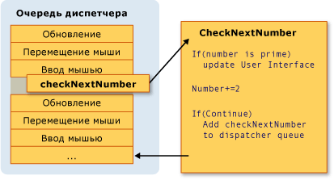
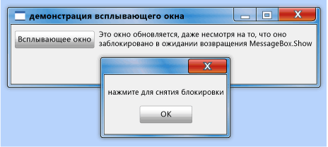
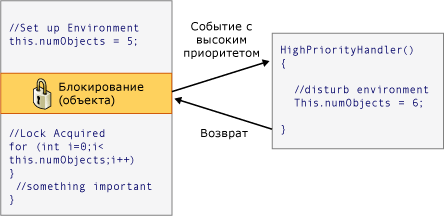

# Модель потоков
[!INCLUDE[TLA#tla_winclient](../../../../includes/tlasharptla-winclient-md.md)] призвана помочь разработчикам избежать трудностей при разработке потоков. Таким образом, большинство [!INCLUDE[TLA2#tla_winclient](../../../../includes/tla2sharptla-winclient-md.md)] разработчикам не требуется писать интерфейс, использующий более одного потока. Поскольку многопотоковые программы являются сложными и трудно отлаживаемыми, их следует избегать, если существуют однопоточные решения.  
  
 Независимо от того, насколько хорошо разработана, однако нет [!INCLUDE[TLA2#tla_ui](../../../../includes/tla2sharptla-ui-md.md)] framework никогда не сможете предоставить однопоточное решение для каждого типа задач. [!INCLUDE[TLA2#tla_winclient](../../../../includes/tla2sharptla-winclient-md.md)] поставляется закрыть, но по-прежнему существуют ситуации, когда несколько потоков улучшают [!INCLUDE[TLA#tla_ui](../../../../includes/tlasharptla-ui-md.md)] скорость реагирования или производительность приложения. После рассмотрения некоторых основных материалов в данном документе рассматриваются подобные ситуации и в завершение обсуждаются некоторые более подробные сведения.  
  

  
> [!NOTE]
>  В этом разделе обсуждаются потоки с помощью <xref:System.Windows.Threading.Dispatcher.BeginInvoke%2A> метод асинхронных вызовов. Вы также можете асинхронных вызовов, вызвав <xref:System.Windows.Threading.Dispatcher.InvokeAsync%2A> метод, который будет принимать <xref:System.Action> или <xref:System.Func%601> как параметр.  <xref:System.Windows.Threading.Dispatcher.InvokeAsync%2A> Возвращает <xref:System.Windows.Threading.DispatcherOperation> или <xref:System.Windows.Threading.DispatcherOperation%601>, который имеет <xref:System.Windows.Threading.DispatcherOperation.Task%2A> свойства. Можно использовать `await` ключевого слова with либо <xref:System.Windows.Threading.DispatcherOperation> или связанного <xref:System.Threading.Tasks.Task>. Если необходимо подождать синхронно <xref:System.Threading.Tasks.Task> , возвращаемый <xref:System.Windows.Threading.DispatcherOperation> или <xref:System.Windows.Threading.DispatcherOperation%601>, вызовите <xref:System.Windows.Threading.TaskExtensions.DispatcherOperationWait%2A> метода расширения.  Вызов <xref:System.Threading.Tasks.Task.Wait%2A?displayProperty=nameWithType> приведет к взаимоблокировке. Дополнительные сведения об использовании <xref:System.Threading.Tasks.Task> для выполнения асинхронных операций, в разделе параллелизм задач.  <xref:System.Windows.Threading.Dispatcher.Invoke%2A> Метод также имеет перегрузки, использующие <xref:System.Action> или <xref:System.Func%601> как параметр.  Можно использовать <xref:System.Windows.Threading.Dispatcher.Invoke%2A> вызывает метод, чтобы сделать синхронный путем передачи делегата, <xref:System.Action> или <xref:System.Func%601>.  
  
   
## Общие сведения и Dispatcher  
 Как правило [!INCLUDE[TLA2#tla_winclient](../../../../includes/tla2sharptla-winclient-md.md)] приложения запускаются с двумя потоками: один для обработки отрисовки и другой — для управления [!INCLUDE[TLA2#tla_ui](../../../../includes/tla2sharptla-ui-md.md)]. Поток отрисовки эффективно выполняется скрыто в фоновом режиме при [!INCLUDE[TLA2#tla_ui](../../../../includes/tla2sharptla-ui-md.md)] поток получает входные данные, обрабатывает события, выводит изображение на экран и выполняет код приложения. Большинство приложений используют один [!INCLUDE[TLA2#tla_ui](../../../../includes/tla2sharptla-ui-md.md)] поток, несмотря на то, что в некоторых ситуациях лучше использовать несколько. Позже это будет рассмотрено на примере.  
  
 [!INCLUDE[TLA2#tla_ui](../../../../includes/tla2sharptla-ui-md.md)] Поток очереди рабочих элементов внутри объекта, называемого <xref:System.Windows.Threading.Dispatcher>. Объект <xref:System.Windows.Threading.Dispatcher> выбирает рабочие элементы на основе приоритетов и выполняет каждый из них до завершения.  Каждый [!INCLUDE[TLA2#tla_ui](../../../../includes/tla2sharptla-ui-md.md)] поток должен иметь по крайней мере один <xref:System.Windows.Threading.Dispatcher>и каждая <xref:System.Windows.Threading.Dispatcher> может выполнять рабочие элементы только в одном потоке.  
  
 Условием для построения быстро реагирующих, понятных приложений является максимальное повышение <xref:System.Windows.Threading.Dispatcher> пропускную способность за счет небольших рабочих элементов. Этот способ элементы никогда не устаревают <xref:System.Windows.Threading.Dispatcher> очереди, ожидающих обработки. Любая задержка между входными данными и ответами может разочаровать пользователя.  
  
 Как в таком случае [!INCLUDE[TLA2#tla_winclient](../../../../includes/tla2sharptla-winclient-md.md)] приложения должны обрабатывать большие операции? Что если код включает большие вычисления или требуется запрос к базе данных на удаленном сервере? Как правило, ответ-большие операции в отдельном потоке, оставляя [!INCLUDE[TLA2#tla_ui](../../../../includes/tla2sharptla-ui-md.md)] поток для обслуживания элементов в <xref:System.Windows.Threading.Dispatcher> очереди. После завершения большой операции, она может передать результат обратно [!INCLUDE[TLA2#tla_ui](../../../../includes/tla2sharptla-ui-md.md)] поток для отображения.  
  
 Исторически [!INCLUDE[TLA#tla_mswin](../../../../includes/tlasharptla-mswin-md.md)] позволяет [!INCLUDE[TLA2#tla_ui](../../../../includes/tla2sharptla-ui-md.md)] элементов, доступная только для потока, который создал их. Это означает, что фоновый поток, отвечающий за некоторую длительную задачу, не может обновить текстовое поле при своем завершении. [!INCLUDE[TLA#tla_mswin](../../../../includes/tlasharptla-mswin-md.md)] Это делается, чтобы обеспечить целостность [!INCLUDE[TLA2#tla_ui](../../../../includes/tla2sharptla-ui-md.md)] компонентов. Список может выглядеть странно, если его содержимое обновляется фоновым потоком в процессе отображения.  
  
 [!INCLUDE[TLA2#tla_winclient](../../../../includes/tla2sharptla-winclient-md.md)] имеет встроенный механизм взаимного исключения, который осуществляет эту координацию. Большинство классов в [!INCLUDE[TLA2#tla_winclient](../../../../includes/tla2sharptla-winclient-md.md)] являются производными от <xref:System.Windows.Threading.DispatcherObject>. При создании <xref:System.Windows.Threading.DispatcherObject> хранит ссылку на <xref:System.Windows.Threading.Dispatcher> связанный с текущим выполняемым потоком. В результате <xref:System.Windows.Threading.DispatcherObject> связывается с потоком, который его создал. Во время выполнения программы <xref:System.Windows.Threading.DispatcherObject> может вызвать свой открытый <xref:System.Windows.Threading.DispatcherObject.VerifyAccess%2A> метод. <xref:System.Windows.Threading.DispatcherObject.VerifyAccess%2A> проверяет <xref:System.Windows.Threading.Dispatcher> связанный с текущим потоком и сравнивает его <xref:System.Windows.Threading.Dispatcher> сохраняется во время создания ссылки. Если они не совпадают, <xref:System.Windows.Threading.DispatcherObject.VerifyAccess%2A> приводит к возникновению исключения. <xref:System.Windows.Threading.DispatcherObject.VerifyAccess%2A> предназначен для вызова в начале каждого метода, принадлежащего к <xref:System.Windows.Threading.DispatcherObject>.  
  
 Если только один поток может изменить [!INCLUDE[TLA2#tla_ui](../../../../includes/tla2sharptla-ui-md.md)], как фоновые потоки взаимодействуют с пользователем? Фоновый поток может запросить [!INCLUDE[TLA2#tla_ui](../../../../includes/tla2sharptla-ui-md.md)] поток, чтобы выполнять операции от его имени. Это делается путем регистрации рабочего элемента с <xref:System.Windows.Threading.Dispatcher> из [!INCLUDE[TLA2#tla_ui](../../../../includes/tla2sharptla-ui-md.md)] потока. <xref:System.Windows.Threading.Dispatcher> Класс предоставляет два метода для регистрации рабочих элементов: <xref:System.Windows.Threading.Dispatcher.Invoke%2A> и <xref:System.Windows.Threading.Dispatcher.BeginInvoke%2A>. Оба метода назначают делегат для выполнения. <xref:System.Windows.Threading.Dispatcher.Invoke%2A> синхронный вызов — то есть, он не возвращает до [!INCLUDE[TLA2#tla_ui](../../../../includes/tla2sharptla-ui-md.md)] потока не закончит выполнение делегата. <xref:System.Windows.Threading.Dispatcher.BeginInvoke%2A> является асинхронным и немедленно возвращается.  
  
 <xref:System.Windows.Threading.Dispatcher> Упорядочивает элементы в своей очереди по приоритету. Существуют десять уровней, которые могут быть указаны при добавлении элемента к <xref:System.Windows.Threading.Dispatcher> очереди. Эти приоритеты сохраняются в <xref:System.Windows.Threading.DispatcherPriority> перечисления. Подробные сведения о <xref:System.Windows.Threading.DispatcherPriority> уровней можно найти в [!INCLUDE[TLA2#tla_winfxsdk](../../../../includes/tla2sharptla-winfxsdk-md.md)] документации.  
  
   
## Потоки в действии: примеры  
  
   
### Пример однопоточного приложения с длительным выполнением вычислений  
 Большинство [!INCLUDE[TLA#tla_gui#plural](../../../../includes/tlasharptla-guisharpplural-md.md)] проводят большую часть своего времени простоя при ожидании события, создаваемые в ответ на взаимодействие с пользователем. С помощью тщательного программирования это время простоя можно использовать конструктивно, не влияя на время отклика [!INCLUDE[TLA2#tla_ui](../../../../includes/tla2sharptla-ui-md.md)]. [!INCLUDE[TLA2#tla_winclient](../../../../includes/tla2sharptla-winclient-md.md)] Потоковая модель не допускает входные данные прервать операцию, которая происходит в [!INCLUDE[TLA2#tla_ui](../../../../includes/tla2sharptla-ui-md.md)] потока. Это означает, что необходимо убедиться, чтобы вернуться к <xref:System.Windows.Threading.Dispatcher> периодически к процессу отложенные события ввода, прежде чем они станут устаревшими.  
  
 Рассмотрим следующий пример.  
  
   
  
 Это простое приложение ищет простые числа, начиная от трех и далее. Когда пользователь щелкает **запустить** кнопки, поиск начинается. Когда программа находит простое число, она обновляет пользовательский интерфейс. В любой момент пользователь может остановить поиск.  
  
 При всей простоте операции поиск простых чисел может происходить бесконечно, что представляет некоторые трудности.  Если бы обработка всего поиска внутри обработчик события нажатия кнопки, никогда бы не получил [!INCLUDE[TLA2#tla_ui](../../../../includes/tla2sharptla-ui-md.md)] потоков возможность для обработки других событий. [!INCLUDE[TLA2#tla_ui](../../../../includes/tla2sharptla-ui-md.md)] Сможет отвечать на входные данные или обработать сообщения. Он бы никогда не обновил отображение и не ответил бы на нажатие кнопки.  
  
 Можно провести поиск простого числа в отдельном потоке, но тогда пришлось бы иметь дело с проблемами синхронизации. С помощью однопотокового подхода можно непосредственно обновить подпись, в которой перечислено наибольшее простое число.  
  
 Если разбить задачу вычисления на управляемые фрагменты, можно периодически возвращаться к <xref:System.Windows.Threading.Dispatcher> и обработки событий. Можно дать [!INCLUDE[TLA2#tla_winclient](../../../../includes/tla2sharptla-winclient-md.md)] возможность обновлять и обрабатывать входные данные.  
  
 Лучшим способом разбиения времени обработки между вычислением и обработкой события является управление вычислением из <xref:System.Windows.Threading.Dispatcher>. С помощью <xref:System.Windows.Threading.Dispatcher.BeginInvoke%2A> метод, можно запланировать проверку простого числа в той же очереди, [!INCLUDE[TLA2#tla_ui](../../../../includes/tla2sharptla-ui-md.md)] , являются производными от события. В приведенном примере запланирована проверка только одного простого числа в каждый момент времени. После завершения проверки простого числа немедленно планируется следующая проверка. Эта проверка выполняется только после ожидающих [!INCLUDE[TLA2#tla_ui](../../../../includes/tla2sharptla-ui-md.md)] обработки событий.  
  
   
  
 С помощью этого механизма приложение [!INCLUDE[TLA#tla_word](../../../../includes/tlasharptla-word-md.md)] выполняет проверку орфографии. Проверка орфографии выполняется в фоновом режиме, используя время простоя [!INCLUDE[TLA2#tla_ui](../../../../includes/tla2sharptla-ui-md.md)] потока. Давайте посмотрим на код.  
  
 В следующем примере показан код XAML, который создает пользовательский интерфейс.  
  
 [!code-xaml[ThreadingPrimeNumbers#ThreadingPrimeNumberXAML](../../../../samples/snippets/csharp/VS_Snippets_Wpf/ThreadingPrimeNumbers/CSharp/Window1.xaml#threadingprimenumberxaml)]  
  
 В следующем примере показан код программной части.  
  
 [!code-csharp[ThreadingPrimeNumbers#ThreadingPrimeNumberCodeBehind](../../../../samples/snippets/csharp/VS_Snippets_Wpf/ThreadingPrimeNumbers/CSharp/Window1.xaml.cs#threadingprimenumbercodebehind)]
 [!code-vb[ThreadingPrimeNumbers#ThreadingPrimeNumberCodeBehind](../../../../samples/snippets/visualbasic/VS_Snippets_Wpf/ThreadingPrimeNumbers/visualbasic/mainwindow.xaml.vb#threadingprimenumbercodebehind)]  
  
 В примере показан обработчик событий для <xref:System.Windows.Controls.Button>.  
  
 [!code-csharp[ThreadingPrimeNumbers#ThreadingPrimeNumberStartOrStop](../../../../samples/snippets/csharp/VS_Snippets_Wpf/ThreadingPrimeNumbers/CSharp/Window1.xaml.cs#threadingprimenumberstartorstop)]
 [!code-vb[ThreadingPrimeNumbers#ThreadingPrimeNumberStartOrStop](../../../../samples/snippets/visualbasic/VS_Snippets_Wpf/ThreadingPrimeNumbers/visualbasic/mainwindow.xaml.vb#threadingprimenumberstartorstop)]  
  
 Помимо обновления текста на <xref:System.Windows.Controls.Button>, этот обработчик отвечает за планирование проверки первого простого числа путем добавления делегата <xref:System.Windows.Threading.Dispatcher> очереди. Иногда после завершения работы, этот обработчик событий <xref:System.Windows.Threading.Dispatcher> выберет этот делегат для выполнения.  
  
 Как упоминалось ранее, <xref:System.Windows.Threading.Dispatcher.BeginInvoke%2A> — <xref:System.Windows.Threading.Dispatcher> члена, используемые для планирования делегат для выполнения. В этом случае мы выбираем <xref:System.Windows.Threading.DispatcherPriority.SystemIdle> приоритет. <xref:System.Windows.Threading.Dispatcher> Этот делегат будет выполняться, только в том случае, если нет важных событий для обработки. Быстродействие [!INCLUDE[TLA2#tla_ui](../../../../includes/tla2sharptla-ui-md.md)] представляет большую важность, чем проверка числа. Также передается новый делегат, представляющий подпрограмму проверки числа.  
  
 [!code-csharp[ThreadingPrimeNumbers#ThreadingPrimeNumberCheckNextNumber](../../../../samples/snippets/csharp/VS_Snippets_Wpf/ThreadingPrimeNumbers/CSharp/Window1.xaml.cs#threadingprimenumberchecknextnumber)]
 [!code-vb[ThreadingPrimeNumbers#ThreadingPrimeNumberCheckNextNumber](../../../../samples/snippets/visualbasic/VS_Snippets_Wpf/ThreadingPrimeNumbers/visualbasic/mainwindow.xaml.vb#threadingprimenumberchecknextnumber)]  
  
 Этот метод проверяет, является ли следующее нечетное число простым. Если оно простое, метод непосредственно обновляет `bigPrime` <xref:System.Windows.Controls.TextBlock> в соответствии с его обнаружения. Мы можем сделать так потому, что вычисление происходит в том же потоке, который был использован для создания компонента. Бы мы решили использовать отдельный поток для вычислений, нам пришлось бы использовать более сложный механизм синхронизации и выполнять обновления в [!INCLUDE[TLA2#tla_ui](../../../../includes/tla2sharptla-ui-md.md)] потока. Эта ситуация будет продемонстрирована далее.  
  
 Полный исходный код для этого примера см. в разделе [однопотокового приложения с образцом длительных вычислений](http://go.microsoft.com/fwlink/?LinkID=160038)  
  
   
### Обработка блокирующей операции с фоновым потоком  
 Обработка блокировки операций в графическом приложении может оказаться трудной задачей. Мы не будем вызывать методы блокировки из обработчиков событий, так как приложение будет остановлено. Можно использовать отдельный поток для обработки этих операций, но Готово, нам нужно синхронизировать с [!INCLUDE[TLA2#tla_ui](../../../../includes/tla2sharptla-ui-md.md)] потоков, поскольку нельзя изменить непосредственно [!INCLUDE[TLA2#tla_gui](../../../../includes/tla2sharptla-gui-md.md)] из рабочего потока. Мы используем <xref:System.Windows.Threading.Dispatcher.Invoke%2A> или <xref:System.Windows.Threading.Dispatcher.BeginInvoke%2A> вставку делегатов в <xref:System.Windows.Threading.Dispatcher> из [!INCLUDE[TLA2#tla_ui](../../../../includes/tla2sharptla-ui-md.md)] потока. Со временем эти делегаты будут выполнены с разрешением на изменение [!INCLUDE[TLA2#tla_ui](../../../../includes/tla2sharptla-ui-md.md)] элементов.  
  
 В этом примере мы имитируем вызов удаленной процедуры, который получает прогноз погоды. Мы используем отдельный рабочий поток для выполнения этого вызова и планируем метод обновления в <xref:System.Windows.Threading.Dispatcher> из [!INCLUDE[TLA2#tla_ui](../../../../includes/tla2sharptla-ui-md.md)] потоков при завершении.  
  
   
  
 [!code-csharp[ThreadingWeatherForecast#ThreadingWeatherCodeBehind](../../../../samples/snippets/csharp/VS_Snippets_Wpf/ThreadingWeatherForecast/CSharp/Window1.xaml.cs#threadingweathercodebehind)]
 [!code-vb[ThreadingWeatherForecast#ThreadingWeatherCodeBehind](../../../../samples/snippets/visualbasic/VS_Snippets_Wpf/ThreadingWeatherForecast/visualbasic/window1.xaml.vb#threadingweathercodebehind)]  
  
 Ниже приведены некоторые подробности, на которые следует обратить внимание.  
  
-   Создание обработчика кнопки  
  
     [!code-csharp[ThreadingWeatherForecast#ThreadingWeatherButtonHandler](../../../../samples/snippets/csharp/VS_Snippets_Wpf/ThreadingWeatherForecast/CSharp/Window1.xaml.cs#threadingweatherbuttonhandler)]
     [!code-vb[ThreadingWeatherForecast#ThreadingWeatherButtonHandler](../../../../samples/snippets/visualbasic/VS_Snippets_Wpf/ThreadingWeatherForecast/visualbasic/window1.xaml.vb#threadingweatherbuttonhandler)]  
  
 При нажатии кнопки мы отображаем рисунок часов и запускаем анимацию. Мы отключаем кнопку. Мы вызвать `FetchWeatherFromServer` метод в новом потоке, а затем мы возвращаем, позволяя <xref:System.Windows.Threading.Dispatcher> для обработки событий во время ожидания сбора прогноза погоды.  
  
-   Выборка погоды  
  
     [!code-csharp[ThreadingWeatherForecast#ThreadingWeatherFetchWeather](../../../../samples/snippets/csharp/VS_Snippets_Wpf/ThreadingWeatherForecast/CSharp/Window1.xaml.cs#threadingweatherfetchweather)]
     [!code-vb[ThreadingWeatherForecast#ThreadingWeatherFetchWeather](../../../../samples/snippets/visualbasic/VS_Snippets_Wpf/ThreadingWeatherForecast/visualbasic/window1.xaml.vb#threadingweatherfetchweather)]  
  
 Для простоты мы фактически не используем никакого сетевого кода в данном примере. Вместо этого мы моделируем задержку доступа к сети, задав для нашего нового потока спящий режим в течение четырех секунд. В настоящее время исходного [!INCLUDE[TLA2#tla_ui](../../../../includes/tla2sharptla-ui-md.md)] потоков по-прежнему работает и реагирование на события. Чтобы показать это, была оставлена запущенная анимация, и кнопки свертывания и развертывания также продолжают работать.  
  
 После завершения задержки и случайного выбора прогноза погоды, пора обращаться к [!INCLUDE[TLA2#tla_ui](../../../../includes/tla2sharptla-ui-md.md)] потока. Это делается путем создания расписания вызов `UpdateUserInterface` в [!INCLUDE[TLA2#tla_ui](../../../../includes/tla2sharptla-ui-md.md)] потока с помощью этого потока <xref:System.Windows.Threading.Dispatcher>. В запланированный вызов этого метода передается строка, описывающая погоду.  
  
-   Обновление [!INCLUDE[TLA2#tla_ui](../../../../includes/tla2sharptla-ui-md.md)]  
  
     [!code-csharp[ThreadingWeatherForecast#ThreadingWeatherUpdateUI](../../../../samples/snippets/csharp/VS_Snippets_Wpf/ThreadingWeatherForecast/CSharp/Window1.xaml.cs#threadingweatherupdateui)]
     [!code-vb[ThreadingWeatherForecast#ThreadingWeatherUpdateUI](../../../../samples/snippets/visualbasic/VS_Snippets_Wpf/ThreadingWeatherForecast/visualbasic/window1.xaml.vb#threadingweatherupdateui)]  
  
 Когда <xref:System.Windows.Threading.Dispatcher> в [!INCLUDE[TLA2#tla_ui](../../../../includes/tla2sharptla-ui-md.md)] поток имеет время, он выполняет запланированный вызов метода `UpdateUserInterface`. Этот метод останавливает анимацию часов и выбирает изображение для описания погоды. Он отображает это изображение и восстанавливает кнопку "Получить прогноз погоды".  
  
   
### Несколько окон, несколько потоков  
 Некоторые [!INCLUDE[TLA2#tla_winclient](../../../../includes/tla2sharptla-winclient-md.md)] приложения требуют нескольких окон верхнего уровня. Это полностью допустимо для одного потока и<xref:System.Windows.Threading.Dispatcher> комбинации для управления несколькими окнами, но иногда несколько потоков лучше всего выполняют. Это особенно верно, когда существует возможность, что одно из окон будет монополизировать поток.  
  
 Проводник [!INCLUDE[TLA#tla_mswin](../../../../includes/tlasharptla-mswin-md.md)] работает таким образом. Каждое новое окно проводника принадлежит исходному процессу, однако оно создается под управлением независимого потока.  
  
 С помощью [!INCLUDE[TLA2#tla_winclient](../../../../includes/tla2sharptla-winclient-md.md)] <xref:System.Windows.Controls.Frame> управления, можно отобразить веб-страниц. Можно легко создать простую [!INCLUDE[TLA2#tla_ie](../../../../includes/tla2sharptla-ie-md.md)] заменить. Начнем с важной функции: возможности открыть новое окно браузера. Когда пользователь нажимает кнопку "Новое окно", запускается копия окна в отдельном потоке. Таким образом, долго выполняющиеся или блокирующие операции в одном из окон не блокируют все остальные окна.  
  
 На самом деле у браузера имеется своя собственная сложная поточная модель. Мы выбрали его, поскольку он знаком большинству читателей.  
  
 В следующем примере показан код.  
  
 [!code-xaml[ThreadingMultipleBrowsers#ThreadingMultiBrowserXAML](../../../../samples/snippets/csharp/VS_Snippets_Wpf/ThreadingMultipleBrowsers/CSharp/Window1.xaml#threadingmultibrowserxaml)]  
  
 [!code-csharp[ThreadingMultipleBrowsers#ThreadingMultiBrowserCodeBehind](../../../../samples/snippets/csharp/VS_Snippets_Wpf/ThreadingMultipleBrowsers/CSharp/Window1.xaml.cs#threadingmultibrowsercodebehind)]
 [!code-vb[ThreadingMultipleBrowsers#ThreadingMultiBrowserCodeBehind](../../../../samples/snippets/visualbasic/VS_Snippets_Wpf/ThreadingMultipleBrowsers/VisualBasic/Window1.xaml.vb#threadingmultibrowsercodebehind)]  
  
 В данном контексте наиболее интересными являются следующие сегменты потоков этого кода:  
  
 [!code-csharp[ThreadingMultipleBrowsers#ThreadingMultiBrowserNewWindow](../../../../samples/snippets/csharp/VS_Snippets_Wpf/ThreadingMultipleBrowsers/CSharp/Window1.xaml.cs#threadingmultibrowsernewwindow)]
 [!code-vb[ThreadingMultipleBrowsers#ThreadingMultiBrowserNewWindow](../../../../samples/snippets/visualbasic/VS_Snippets_Wpf/ThreadingMultipleBrowsers/VisualBasic/Window1.xaml.vb#threadingmultibrowsernewwindow)]  
  
 Этот метод вызывается при нажатии кнопки "Новое окно". Она создает новый поток и запускает его в асинхронном режиме.  
  
 [!code-csharp[ThreadingMultipleBrowsers#ThreadingMultiBrowserThreadStart](../../../../samples/snippets/csharp/VS_Snippets_Wpf/ThreadingMultipleBrowsers/CSharp/Window1.xaml.cs#threadingmultibrowserthreadstart)]
 [!code-vb[ThreadingMultipleBrowsers#ThreadingMultiBrowserThreadStart](../../../../samples/snippets/visualbasic/VS_Snippets_Wpf/ThreadingMultipleBrowsers/VisualBasic/Window1.xaml.vb#threadingmultibrowserthreadstart)]  
  
 Этот метод является начальной точкой для нового потока. Мы создаем новое окно под элементом управления этого потока. [!INCLUDE[TLA2#tla_winclient](../../../../includes/tla2sharptla-winclient-md.md)] автоматически создает новую <xref:System.Windows.Threading.Dispatcher> для нового потока управления. Все что нужно сделать для обеспечения функциональности окна — Запуск <xref:System.Windows.Threading.Dispatcher>.  
  
   
## Технические подробности и важные моменты  
  
### Написание компонентов, использующих поток  
 Руководство разработчика Microsoft .NET Framework описывает образец того, как компонент может предоставлять асинхронное поведение для своих клиентов (см. [Обзор асинхронной модели на основе событий](../../../../docs/standard/asynchronous-programming-patterns/event-based-asynchronous-pattern-overview.md)). Например, предположим, что нужно упаковать `FetchWeatherFromServer` метод в неграфический компонент многократного использования. Следующий шаблон Стандартная Microsoft .NET Framework это будет выглядеть примерно следующим образом.  
  
 [!code-csharp[CommandingOverviewSnippets#ThreadingArticleWeatherComponent1](../../../../samples/snippets/csharp/VS_Snippets_Wpf/CommandingOverviewSnippets/CSharp/Window1.xaml.cs#threadingarticleweathercomponent1)]
 [!code-vb[CommandingOverviewSnippets#ThreadingArticleWeatherComponent1](../../../../samples/snippets/visualbasic/VS_Snippets_Wpf/CommandingOverviewSnippets/visualbasic/window1.xaml.vb#threadingarticleweathercomponent1)]  
  
 `GetWeatherAsync` использовал бы один из методов, описанных выше, таких как создание фонового потока, для работы в асинхронном режиме, не блокируя вызов потока.  
  
 Одна из наиболее важных частей этого шаблона вызывает *имя_метода* `Completed` метод в том же потоке, который вызвал *имя_метода* `Async` метода начинается с. Это можно сделать с помощью [!INCLUDE[TLA2#tla_winclient](../../../../includes/tla2sharptla-winclient-md.md)] довольно просто, размещая <xref:System.Windows.Threading.Dispatcher.CurrentDispatcher%2A>— но затем неграфический компонент может использоваться только в [!INCLUDE[TLA2#tla_winclient](../../../../includes/tla2sharptla-winclient-md.md)] приложений, не в [!INCLUDE[TLA#tla_winforms](../../../../includes/tlasharptla-winforms-md.md)] или [!INCLUDE[TLA#tla_aspnet](../../../../includes/tlasharptla-aspnet-md.md)] программы.  
  
 <xref:System.Windows.Threading.DispatcherSynchronizationContext> Класс адреса этой задачи — представляйте его упрощенную версию <xref:System.Windows.Threading.Dispatcher> , работает с другими [!INCLUDE[TLA2#tla_ui](../../../../includes/tla2sharptla-ui-md.md)] также платформ.  
  
 [!code-csharp[CommandingOverviewSnippets#ThreadingArticleWeatherComponent2](../../../../samples/snippets/csharp/VS_Snippets_Wpf/CommandingOverviewSnippets/CSharp/Window1.xaml.cs#threadingarticleweathercomponent2)]
 [!code-vb[CommandingOverviewSnippets#ThreadingArticleWeatherComponent2](../../../../samples/snippets/visualbasic/VS_Snippets_Wpf/CommandingOverviewSnippets/visualbasic/window1.xaml.vb#threadingarticleweathercomponent2)]  
  
### Вложенная накачка  
 Иногда не выполнима полная блокировка [!INCLUDE[TLA2#tla_ui](../../../../includes/tla2sharptla-ui-md.md)] потока. Давайте рассмотрим <xref:System.Windows.MessageBox.Show%2A> метод <xref:System.Windows.MessageBox> класса. <xref:System.Windows.MessageBox.Show%2A> не возвращает, пока пользователь не щелкнет «ОК». Однако он создает окно, которое должно иметь цикл обработки сообщений, чтобы быть интерактивным. Ожидая, когда пользователь нажмет кнопку "ОК", исходное окно приложения не отвечает на ввод данных пользователем. Тем не менее оно продолжает обрабатывать сообщения отображения. Исходное окно перерисовывается при его перекрытии и выведении.  
  
   
  
 Данное окно сообщения должно подчиняться какому-либо потоку. Приложение [!INCLUDE[TLA2#tla_winclient](../../../../includes/tla2sharptla-winclient-md.md)] могло бы создать новый поток специально для данного окна сообщения, но этот поток не смог бы отображать отключенные элементы в исходном окне (вспомните предыдущее обсуждение взаимного исключения). Вместо этого [!INCLUDE[TLA2#tla_winclient](../../../../includes/tla2sharptla-winclient-md.md)] использует систему обработки вложенных сообщений. <xref:System.Windows.Threading.Dispatcher> Класс содержит специальный метод <xref:System.Windows.Threading.Dispatcher.PushFrame%2A>, который затем сохраняет текущую точку выполнения приложения начинается новый цикл обработки сообщений. После завершения цикла обработки вложенных сообщений выполнение возобновляется после исходного <xref:System.Windows.Threading.Dispatcher.PushFrame%2A> вызова.  
  
 В этом случае <xref:System.Windows.Threading.Dispatcher.PushFrame%2A> поддерживает программный контекст при вызове <xref:System.Windows.MessageBox>.<xref:System.Windows.MessageBox.Show%2A>, и он начинается новый цикл обработки сообщений для перерисовки фона окна и обработки входных данных для окна сообщения. Когда пользователь нажимает кнопку OK и очищает всплывающее окно, вложенные циклы завершаются и управление возобновляется после вызова <xref:System.Windows.MessageBox.Show%2A>.  
  
### Устаревшие перенаправленные события  
 Маршрутизация системы обработки событий в [!INCLUDE[TLA2#tla_winclient](../../../../includes/tla2sharptla-winclient-md.md)] уведомляет все деревья, когда вызываются события.  
  
 [!code-xaml[InputOvw#ThreadingArticleStaticRoutedEvent](../../../../samples/snippets/csharp/VS_Snippets_Wpf/InputOvw/CSharp/Page1.xaml#threadingarticlestaticroutedevent)]  
  
 При нажатии левой кнопки мыши над эллипсом, `handler2` выполняется. После `handler2` окончания события передается вдоль <xref:System.Windows.Controls.Canvas> объекта, который использует `handler1` для его обработки. Это происходит только в том случае, если `handler2` не задает явно пометить объект событие как обработанное.  
  
 Возможно, `handler2` займет немало времени для обработки этого события. `handler2` может использовать <xref:System.Windows.Threading.Dispatcher.PushFrame%2A> начинается цикл вложенных сообщений, который не возвращает часов. Если `handler2` не помечает событие как обработанное после цикла обработки сообщений завершения, событие передается вверх по дереву, даже если оно является очень старым.  
  
### Повторный вход и блокировка  
 Механизм блокировки [!INCLUDE[TLA#tla_clr](../../../../includes/tlasharptla-clr-md.md)] не работает точно так, как это можно представить; можно предположить, что поток завершит операцию полностью, запрашивая блокировку. В действительности поток продолжает получать и обрабатывать сообщения с высоким приоритетом. Это помогает избежать взаимоблокировок и максимально повышает скорость отклика интерфейсов, но может приводить к незначительным ошибкам.  Большая часть времени, не нужно что-либо знать об этом, но в редких случаях (как правило, включающих [!INCLUDE[TLA2#tla_win32](../../../../includes/tla2sharptla-win32-md.md)] сообщений окна или компоненты COM STA) это может быть знания.  
  
 Большинство интерфейсов не были собраны с учета безопасности потока, так как разработчики работают в предположении, что [!INCLUDE[TLA2#tla_ui](../../../../includes/tla2sharptla-ui-md.md)] никогда не осуществляется более чем одним потоком. В этом случае что однопоточное вносимые изменения среды в непредвиденное время неблагоприятные последствия, <xref:System.Windows.Threading.DispatcherObject> предполагается механизм взаимного исключения. Рассмотрим следующий псевдокод:  
  
   
  
 В большинстве случаев все работает правильно, но иногда в [!INCLUDE[TLA2#tla_winclient](../../../../includes/tla2sharptla-winclient-md.md)] где такой непредвиденный повторный вход может действительно вызвать проблемы. Да, в определенные ключевые моменты [!INCLUDE[TLA2#tla_winclient](../../../../includes/tla2sharptla-winclient-md.md)] вызовы <xref:System.Windows.Threading.Dispatcher.DisableProcessing%2A>, который меняет инструкцию блокировки для этого потока использовать [!INCLUDE[TLA2#tla_winclient](../../../../includes/tla2sharptla-winclient-md.md)] повторный вход освободить блокировку вместо обычного [!INCLUDE[TLA2#tla_clr](../../../../includes/tla2sharptla-clr-md.md)] блокировки.  
  
 Так почему было [!INCLUDE[TLA2#tla_clr](../../../../includes/tla2sharptla-clr-md.md)] команды выбрала такое поведение? Это было связано с объектами COM STA и завершением потока. Если объект является сборщиком мусора, его `Finalize` метод не выполняется в выделенном потоке завершения, [!INCLUDE[TLA2#tla_ui](../../../../includes/tla2sharptla-ui-md.md)] потока. Именно здесь лежит проблема, поскольку объект COM STA, созданный на [!INCLUDE[TLA2#tla_ui](../../../../includes/tla2sharptla-ui-md.md)] поток может быть удален только в [!INCLUDE[TLA2#tla_ui](../../../../includes/tla2sharptla-ui-md.md)] потока. [!INCLUDE[TLA2#tla_clr](../../../../includes/tla2sharptla-clr-md.md)] Делает то же самое для <xref:System.Windows.Threading.Dispatcher.BeginInvoke%2A> (в этом случае с помощью Win32 `SendMessage`). Но если [!INCLUDE[TLA2#tla_ui](../../../../includes/tla2sharptla-ui-md.md)] поток занят, поток завершения останавливается, и объект COM STA не удается завершить, что приводит к серьезной утечке памяти. Поэтому [!INCLUDE[TLA2#tla_clr](../../../../includes/tla2sharptla-clr-md.md)] создала сложный вызов для создания блокировки работают надлежащим образом, они делают.  
  
 Задача для [!INCLUDE[TLA2#tla_winclient](../../../../includes/tla2sharptla-winclient-md.md)] — избежать непредвиденного повторного входа без внесения утечку памяти, поэтому мы не блокируют everywhere повторный вход.  
  
## См. также  
 [Пример однопоточного приложения с длительным выполнением вычислений](http://go.microsoft.com/fwlink/?LinkID=160038)
