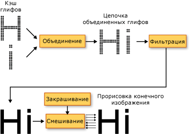

# Оформление в WPF
В этом разделе содержатся вводные сведения об основных типографических возможностях [!INCLUDE[TLA2#tla_winclient](../../../../includes/tla2sharptla-winclient-md.md)]. Эти возможности включают в себя повышение качества и производительности отрисовки текста, типографическую поддержку [!INCLUDE[TLA#tla_opentype](../../../../includes/tlasharptla-opentype-md.md)], расширенный международный текст, улучшенную поддержку шрифтов и новые текстовые API.  
  
   
## Улучшенное качество и производительность работы с текстом  
 Текст в [!INCLUDE[TLA2#tla_winclient](../../../../includes/tla2sharptla-winclient-md.md)] отрисовывается с помощью [!INCLUDE[TLA#tla_ct](../../../../includes/tlasharptla-ct-md.md)], что улучшает четкость и читаемость текста. [!INCLUDE[TLA2#tla_ct](../../../../includes/tla2sharptla-ct-md.md)] — это программная технология, разработанная [!INCLUDE[TLA#tla_ms](../../../../includes/tlasharptla-ms-md.md)] для улучшения удобочитаемости текста на современных ЖК-мониторах (жидкокристаллических дисплеях), например экранах ноутбуков, карманных ПК и плоскопанельных мониторах. [!INCLUDE[TLA2#tla_ct](../../../../includes/tla2sharptla-ct-md.md)] применяет отрисовку на субпиксельном уровне, которая позволяет отображать текст с повышенной точностью формы, выравнивая символы до дробной части пикселя. Дополнительное разрешение повышает четкость мелких деталей отображаемого текста, значительно облегчая его длительное чтение. Другим улучшением [!INCLUDE[TLA2#tla_ct](../../../../includes/tla2sharptla-ct-md.md)] в [!INCLUDE[TLA2#tla_winclient](../../../../includes/tla2sharptla-winclient-md.md)] является применение устранения контурных неровностей по направлению оси Y, которое сглаживает неровные края на верхних и нижних частях в текстовых знаках. Дополнительные сведения о возможностях [!INCLUDE[TLA2#tla_ct](../../../../includes/tla2sharptla-ct-md.md)] см. в разделе [Общие сведения о технологии ClearType](cleartype-overview.md).  
  
   
Текст со сглаживанием ClearType по оси Y  
  
 Весь конвейер отрисовки текста может поддерживать аппаратное ускорение в [!INCLUDE[TLA2#tla_winclient](../../../../includes/tla2sharptla-winclient-md.md)], позволяя применять компьютер с минимальными требованиями к оборудованию. Отрисовка, которая не может быть выполнена на аппаратном уровне, использует программный рендеринг. Аппаратное ускорение влияет на все этапы конвейера отрисовки текста — от сохранения отдельных глифов, их компоновки в глифы для выполнения, применения эффектов и до применения алгоритма смешивания [!INCLUDE[TLA2#tla_ct](../../../../includes/tla2sharptla-ct-md.md)] для окончательной отрисовки. Дополнительные сведения об аппаратном ускорении см. в разделе [Уровни графической отрисовки](graphics-rendering-tiers.md).  
  
   
Диаграмма конвейера отрисовки текста  
  
 Кроме того, анимированный текст, независимо от того, состоит он их знаков или глифов, использует все преимущества возможностей графического оборудования, работающего под управлением [!INCLUDE[TLA2#tla_winclient](../../../../includes/tla2sharptla-winclient-md.md)]. Это приводит к сглаживанию текстовой анимации.  
  
   
## Типография с широкими возможностями  
 Формат шрифта [!INCLUDE[TLA2#tla_opentype](../../../../includes/tla2sharptla-opentype-md.md)] является расширением формата [!INCLUDE[TLA#tla_truetype](../../../../includes/tlasharptla-truetype-md.md)]. Формат шрифта [!INCLUDE[TLA2#tla_opentype](../../../../includes/tla2sharptla-opentype-md.md)] был разработан совместно корпорацией [!INCLUDE[TLA#tla_ms](../../../../includes/tlasharptla-ms-md.md)] и Adobe и предоставляет широкий набор дополнительных типографических возможностей. <xref:System.Windows.Documents.Typography> Объект предоставляет многие расширенные возможности [!INCLUDE[TLA2#tla_opentype](../../../../includes/tla2sharptla-opentype-md.md)] шрифтов, таких как изменение стилей и swash. [!INCLUDE[TLA2#tla_lhsdk](../../../../includes/tla2sharptla-lhsdk-md.md)] предоставляет набор образцов шрифтов [!INCLUDE[TLA2#tla_opentype](../../../../includes/tla2sharptla-opentype-md.md)], разработанных с широкими возможностями, такие как шрифты Pericles и Pescadero. Дополнительные сведения см. в разделе [Пакет образцов шрифтов OpenType](sample-opentype-font-pack.md).  
  
 Шрифт [!INCLUDE[TLA2#tla_opentype](../../../../includes/tla2sharptla-opentype-md.md)] Pericles содержит дополнительные глифы, поддерживающие изменение стилей для стандартных наборов глифов. Приведенный ниже текст отображает глифы с изменением стиля.  
  
   
  
 Swash-глифы являются декоративными глифами, которые используют сложную орнаментацию, часто связанную с каллиграфией. Следующий текст отображает стандартные и swash-глифы для шрифта Pescadero.  
  
   
  
 Дополнительные сведения о возможностях [!INCLUDE[TLA2#tla_opentype](../../../../includes/tla2sharptla-opentype-md.md)] см. в разделе [Возможности шрифта OpenType](opentype-font-features.md).  
  
   
## Расширенная многоязыковая поддержка текста  
 [!INCLUDE[TLA2#tla_winclient](../../../../includes/tla2sharptla-winclient-md.md)] поддерживает расширение международного текста, предоставляя следующие возможности.  
  
-   Автоматическая расстановка пробелов во всех системах письма с использованием адаптивного измерения.  
  
-   Широкая поддержка международного текста. Дополнительные сведения см. в разделе [Глобализация для WPF](globalization-for-wpf.md).  
  
-   Управляемый языком разрыв строки, расстановка переносов и выравнивание.  
  
   
## Расширенная поддержка шрифтов  
 [!INCLUDE[TLA2#tla_winclient](../../../../includes/tla2sharptla-winclient-md.md)] предоставляет расширенную поддержку шрифта с помощью следующих возможностей.  
  
-   Юникод для всех текстов. Поведение шрифта и выбор, больше не требующий набора символов или кодовой страницы.  
  
-   Поведение шрифта зависит от глобальных настроек, таких как язык системы.  
  
-   Отдельные <xref:System.Windows.FontWeight>, <xref:System.Windows.FontStretch>, и <xref:System.Windows.FontStyle> типов для определения <xref:System.Windows.Media.FontFamily>. Это обеспечивает большую гибкость, чем в программировании [!INCLUDE[TLA#tla_win32](../../../../includes/tlasharptla-win32-md.md)], в котором логические сочетания курсивного и полужирного шрифта используются для определения семейства шрифтов.  
  
-   Направление письма (горизонтальное или вертикальное) обрабатывается в зависимости от имени шрифта.  
  
-   Связывание и восстановление шрифта в переносимом файле [!INCLUDE[TLA#tla_xml](../../../../includes/tlasharptla-xml-md.md)] с использованием технологии составного шрифта. Составные шрифты позволяют конструировать все шрифты многоязычного диапазона. Составные шрифты также предоставляют механизм, который позволяет избежать отображения отсутствующих глифов. Дополнительные сведения см. в разделе "Примечания" в <xref:System.Windows.Media.FontFamily> класса.  
  
-   Международные шрифты, созданные из составных шрифтов с использованием группы одноязыковых шрифтов. Это позволяет избежать затрат ресурсов при разработке шрифтов для нескольких языков.  
  
-   Составные шрифты внедряются в документ, тем самым обеспечивая его совместимость. Дополнительные сведения см. в разделе "Примечания" в <xref:System.Windows.Media.FontFamily> класса.  
  
   
## Новые API  
 [!INCLUDE[TLA2#tla_winclient](../../../../includes/tla2sharptla-winclient-md.md)] предоставляет для разработчиков несколько текстовых [!INCLUDE[TLA2#tla_api#plural](../../../../includes/tla2sharptla-apisharpplural-md.md)], которые используются при включении текста в приложения. Эти [!INCLUDE[TLA2#tla_api#plural](../../../../includes/tla2sharptla-apisharpplural-md.md)] сгруппированы в три указанные далее категории.  
  
-   **Макет и пользовательский интерфейс**. Общие элементы управления текстом для [!INCLUDE[TLA#tla_gui](../../../../includes/tlasharptla-gui-md.md)].  
  
-   **Облегченное рисование текста**. Позволяет рисовать текст непосредственно в объектах.  
  
-   **Дополнительное форматирование текста**. Позволяет реализовать пользовательский обработчик текста.  
  
### Макет и пользовательский интерфейс  
 На высшем уровне функциональности текстовые [!INCLUDE[TLA2#tla_api#plural](../../../../includes/tla2sharptla-apisharpplural-md.md)] предоставляют Общие [!INCLUDE[TLA#tla_ui](../../../../includes/tlasharptla-ui-md.md)] элементы управления, например <xref:System.Windows.Controls.Label>, <xref:System.Windows.Controls.TextBlock>, и <xref:System.Windows.Controls.TextBox>. Эти элементы управления предоставляют основные элементы [!INCLUDE[TLA2#tla_ui](../../../../includes/tla2sharptla-ui-md.md)] в приложении и способ представления текста и взаимодействия с ним. Элементы управления, например <xref:System.Windows.Controls.RichTextBox> и <xref:System.Windows.Controls.PasswordBox> включить более сложных или специализированные обработки текста. И классы, такие как <xref:System.Windows.Documents.TextRange>, <xref:System.Windows.Documents.TextSelection>, и <xref:System.Windows.Documents.TextPointer> предоставляют удобное управление текстом. Эти [!INCLUDE[TLA2#tla_ui](../../../../includes/tla2sharptla-ui-md.md)] элементы управления предоставляют свойства, такие как <xref:System.Windows.Controls.Control.FontFamily%2A>, <xref:System.Windows.Controls.Control.FontSize%2A>, и <xref:System.Windows.Controls.Control.FontStyle%2A>, позволяющие управлять шрифтами, используемый для отрисовки текста.  
  
#### Использование эффектов точечных рисунков и текстовых эффектов  
 [!INCLUDE[TLA2#tla_winclient](../../../../includes/tla2sharptla-winclient-md.md)] позволяет создавать визуально интересные применения текста, используя такие возможности, как эффекты точечных рисунков, преобразования и текстовые эффекты. В следующем примере показан типичный эффект тени, примененный к тексту.  
  
   
Текст с тенью  
  
 В следующем примере показан эффект тени и шума, примененный к тексту.  
  
   
Текст с тенью и шумом  
  
 В следующем примере показан эффект внешнего свечения, примененный к тексту.  
  
   
Текст с эффектом свечения  
  
 В следующем примере показан эффект размытия, примененный к тексту.  
  
   
Текст с эффектом размытия  
  
 В следующем примере показаны вторая строка текста, масштабированная на 150 % вдоль оси X, и третья строка текста, масштабированная на 150 % вдоль оси Y.  
  
   
Текст, масштабируемый с использованием ScaleTransform  
  
 В следующем примере показан текст, наклоненный вдоль оси X.  
  
   
Текст с использованием SkewTransform  
  
 Объект <xref:System.Windows.Media.TextEffect> объект — это вспомогательный объект, который позволяет обрабатывать текст как одну или несколько групп символов в текстовой строке. В следующем примере показан поворот отдельных символов. Поворот каждого символа осуществляется независимо от других с интервалом в 1 секунду.  
  
   
Пример анимации текстового эффекта "Вращение"  
  
#### Использование документов нефиксированного формата  
 Помимо общих [!INCLUDE[TLA2#tla_ui](../../../../includes/tla2sharptla-ui-md.md)] элементов управления, [!INCLUDE[TLA2#tla_winclient](../../../../includes/tla2sharptla-winclient-md.md)] предлагает элемент управления макетом для презентации текста — <xref:System.Windows.Documents.FlowDocument> элемент. <xref:System.Windows.Documents.FlowDocument> Элемент, в сочетании с <xref:System.Windows.Controls.DocumentViewer> элемент предоставляет элемент управления для больших объемов текста с различными требованиями к макету. Элементы управления макета обеспечивают доступ к дополнительным возможностям оформления посредством <xref:System.Windows.Documents.Typography> объекта и свойств, относящихся к шрифту, других [!INCLUDE[TLA2#tla_ui](../../../../includes/tla2sharptla-ui-md.md)] элементов управления.  
  
 В следующем примере показано текстовое содержимое, размещенное в <xref:System.Windows.Controls.FlowDocumentReader>, который предоставляет поиска, переходов, разбиения на страницы и масштабирования содержимого.  
  
   
Текст, размещенный в элементе управления FlowDocumentReader  
  
 Дополнительные сведения см. в разделе [Документы в WPF](documents-in-wpf.md).  
  
### Облегченное рисование текста  
 Можно рисовать текст непосредственно в [!INCLUDE[TLA2#tla_winclient](../../../../includes/tla2sharptla-winclient-md.md)] объектов с помощью <xref:System.Windows.Media.DrawingContext.DrawText%2A> метод <xref:System.Windows.Media.DrawingContext> объекта. Чтобы использовать этот метод, создайте <xref:System.Windows.Media.FormattedText> объекта. Этот объект позволяет рисовать многострочный текст, в котором каждый символ в текст можно форматировать отдельно. Функциональные возможности <xref:System.Windows.Media.FormattedText> объект содержит множество функциональных возможностей флагов DrawText в Win32 API. Кроме того <xref:System.Windows.Media.FormattedText> содержит функциональные возможности, такие как поддержка многоточия, в котором многоточие отображается, когда текст выходит за границы. В следующем примере показан текст, имеющий несколько примененных к нему форматов, в том числе линейный градиент на втором и третьем словах.  
  
   
Отображенный текст с использованием объекта FormattedText  
  
 Можно преобразовать форматированный текст в <xref:System.Windows.Media.Geometry> объектов, что позволяет создавать другие типы наглядного текста. Например, можно создать <xref:System.Windows.Media.Geometry> объект, основанный на контуре строки текста.  
  
   
Оконтуривание текста с использованием кисти линейного градиента  
  
 В следующих примерах показаны несколько способов создания визуальных эффектов посредством изменения штриха, заливки и выделения преобразованного текста.  
  
   
Пример установки разного цвета для штриха и заливки  
  
   
Пример применения кисти к штриху  
  
   
Пример применения кисти к штриху и выделению  
  
 Дополнительные сведения о <xref:System.Windows.Media.FormattedText> объекта, см. в разделе [Рисование форматированного текста](drawing-formatted-text.md).  
  
### Дополнительное форматирование текста  
 На наиболее продвинутом уровне текста [!INCLUDE[TLA2#tla_api#plural](../../../../includes/tla2sharptla-apisharpplural-md.md)], [!INCLUDE[TLA2#tla_winclient](../../../../includes/tla2sharptla-winclient-md.md)] предлагает возможность создания пользовательской разметки текста с помощью <xref:System.Windows.Media.TextFormatting.TextFormatter> объектов и других типов в <xref:System.Windows.Media.TextFormatting> пространства имен. <xref:System.Windows.Media.TextFormatting.TextFormatter> И связанные классы позволяют реализовать макет пользовательского текста, который поддерживает пользовательское определение формата символов, стили абзаца, правила разрыва строки и другие возможности разметки для международного текста. Существует несколько случаев, когда нужно переопределить реализацию по умолчанию поддержки макета текста [!INCLUDE[TLA2#tla_winclient](../../../../includes/tla2sharptla-winclient-md.md)]. Однако если был создан элемент управления или приложение редактирования текста, может потребоваться реализация, отличная от реализации [!INCLUDE[TLA2#tla_winclient](../../../../includes/tla2sharptla-winclient-md.md)] по умолчанию.  
  
 В отличие от традиционного текстового [!INCLUDE[TLA#tla_api](../../../../includes/tlasharptla-api-md.md)], <xref:System.Windows.Media.TextFormatting.TextFormatter> взаимодействует с клиентом макета текста через набор методов обратного вызова. Требуется клиент для предоставления этих методов в реализации <xref:System.Windows.Media.TextFormatting.TextSource> класса. Следующая диаграмма иллюстрирует взаимодействие макета текста между клиентским приложением и <xref:System.Windows.Media.TextFormatting.TextFormatter>.  
  
   
Взаимодействие между приложением и TextFormatter  
  
 Дополнительные сведения о создании пользовательского макета текста см. в разделе [Дополнительное форматирование текста](advanced-text-formatting.md).  
  
## См. также
- <xref:System.Windows.Media.FormattedText>
- <xref:System.Windows.Media.TextFormatting.TextFormatter>
- [Общие сведения о технологии ClearType](cleartype-overview.md)
- [Возможности шрифта OpenType](opentype-font-features.md)
- [Рисование форматированного текста](drawing-formatted-text.md)
- [Дополнительное форматирование текста](advanced-text-formatting.md)
- [Text](optimizing-performance-text.md)
- [Типография Майкрософт](https://docs.microsoft.com/typography/)