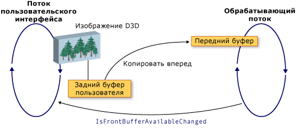

# Взаимодействие WPF и Direct3D9WPF and Direct3D9 Interoperation
Содержимое Direct3D9 можно включить в приложение Windows Presentation Foundation (WPF).You can include Direct3D9 content in a Windows Presentation Foundation (WPF) application. В этом разделе описывается создание содержимого Direct3D9 для эффективного взаимодействия с WPF.This topic describes how to create Direct3D9 content so that it efficiently interoperates with WPF.  
  
> [!NOTE]
> При использовании содержимого Direct3D9 в WPF также необходимо подумать о производительности.When using Direct3D9 content in WPF, you also need to think about performance. Дополнительные сведения о том, как оптимизировать производительность, см. в статье вопросы производительности, связанные с [взаимодействием Direct3D9 и WPF](performance-considerations-for-direct3d9-and-wpf-interoperability.md).For more information about how to optimize for performance, see [Performance Considerations for Direct3D9 and WPF Interoperability](performance-considerations-for-direct3d9-and-wpf-interoperability.md).  
  
## Отобразить буферыDisplay Buffers  
 Класс <xref:System.Windows.Interop.D3DImage> управляет двумя буферами вывода, которые называются *задним* и *передним*буфером.The <xref:System.Windows.Interop.D3DImage> class manages two display buffers, which are called the *back buffer* and the *front buffer*. Задний буфер — это поверхность Direct3D9.The back buffer is your Direct3D9 surface. Изменения заднего буфера копируются прямо в передний буфер при вызове метода <xref:System.Windows.Interop.D3DImage.Unlock%2A>.Changes to the back buffer are copied forward to the front buffer when you call the <xref:System.Windows.Interop.D3DImage.Unlock%2A> method.  
  
 На следующем рисунке показана связь между задним буфером и передним буфером.The following illustration shows the relationship between the back buffer and the front buffer.  
  
   
  
## Создание устройства Direct3D9Direct3D9 Device Creation  
 Для отображения содержимого Direct3D9 необходимо создать устройство Direct3D9.To render Direct3D9 content, you must create a Direct3D9 device. Существует два объекта Direct3D9, которые можно использовать для создания устройства, `IDirect3D9` и `IDirect3D9Ex`.There are two Direct3D9 objects that you can use to create a device, `IDirect3D9` and `IDirect3D9Ex`. Используйте эти объекты для создания `IDirect3DDevice9` и `IDirect3DDevice9Ex` устройств соответственно.Use these objects to create `IDirect3DDevice9` and `IDirect3DDevice9Ex` devices, respectively.  
  
 Создайте устройство, вызвав один из следующих методов.Create a device by calling one of the following methods.  
  
- `IDirect3D9 * Direct3DCreate9(UINT SDKVersion);`  
  
- `HRESULT Direct3DCreate9Ex(UINT SDKVersion, IDirect3D9Ex **ppD3D);`  
  
 В операционной системе Windows Vista или более поздней версии используйте метод `Direct3DCreate9Ex` с отображением, настроенным для использования модели Windows дисплея (WDDM).On Windows Vista or later operating system, use the `Direct3DCreate9Ex` method with a display that is configured to use the Windows Display Driver Model (WDDM). Используйте метод `Direct3DCreate9` на любой другой платформе.Use the `Direct3DCreate9` method on any other platform.  
  
### Доступность метода Direct3DCreate9ExAvailability of the Direct3DCreate9Ex method  
 D3d9. dll содержит метод `Direct3DCreate9Ex` только в Windows Vista или более поздней версии операционной системы.The d3d9.dll has the `Direct3DCreate9Ex` method only on Windows Vista or later operating system. Если вы напрямую свяжете функцию в Windows XP, приложение не сможет загрузиться.If you directly link the function on Windows XP, your application fails to load. Чтобы определить, поддерживается ли метод `Direct3DCreate9Ex`, загрузите библиотеку DLL и найдите адрес процедуры.To determine whether the `Direct3DCreate9Ex` method is supported, load the DLL and look for the proc address. В следующем коде показано, как проверить метод `Direct3DCreate9Ex`.The following code shows how to test for the `Direct3DCreate9Ex` method. Полный пример кода см. в разделе [Пошаговое руководство. Создание содержимого Direct3D9 для размещения в WPF](walkthrough-creating-direct3d9-content-for-hosting-in-wpf.md).For a full code example, see [Walkthrough: Creating Direct3D9 Content for Hosting in WPF](walkthrough-creating-direct3d9-content-for-hosting-in-wpf.md).  
  
 [!code-cpp[System.Windows.Interop.D3DImage#RendererManager_EnsureD3DObjects](~/samples/snippets/cpp/VS_Snippets_Wpf/System.Windows.Interop.D3DImage/cpp/renderermanager.cpp#renderermanager_ensured3dobjects)]  
  
### Создание HWNDHWND Creation  
 Для создания устройства требуется HWND.Creating a device requires an HWND. Как правило, для использования Direct3D9 создается фиктивный HWND.In general, you create a dummy HWND for Direct3D9 to use. В следующем примере кода показано, как создать фиктивный HWND.The following code example shows how to create a dummy HWND.  
  
 [!code-cpp[System.Windows.Interop.D3DImage#RendererManager_EnsureHWND](~/samples/snippets/cpp/VS_Snippets_Wpf/System.Windows.Interop.D3DImage/cpp/renderermanager.cpp#renderermanager_ensurehwnd)]  
  
### Существующие параметрыPresent Parameters  
 Для создания устройства также требуется структура `D3DPRESENT_PARAMETERS`, но важны только несколько параметров.Creating a device also requires a `D3DPRESENT_PARAMETERS` struct, but only a few parameters are important. Эти параметры выбраны для минимального объема памяти.These parameters are chosen to minimize the memory footprint.  
  
 Задайте для полей `BackBufferHeight` и `BackBufferWidth` значение 1.Set the `BackBufferHeight` and `BackBufferWidth` fields to 1. Если задать для них значение 0, то для них будут заданы размеры HWND.Setting them to 0 causes them to be set to the dimensions of the HWND.  
  
 Всегда устанавливайте флаги `D3DCREATE_MULTITHREADED` и `D3DCREATE_FPU_PRESERVE`, чтобы избежать повреждения памяти, используемой Direct3D9, и предотвращения изменения параметров FPU в Direct3D9.Always set the `D3DCREATE_MULTITHREADED` and `D3DCREATE_FPU_PRESERVE` flags to prevent corrupting memory used by Direct3D9 and to prevent Direct3D9 from changing FPU settings.  
  
 В следующем коде показано, как инициализировать структуру `D3DPRESENT_PARAMETERS`.The following code shows how to initialize the `D3DPRESENT_PARAMETERS` struct.  
  
 [!code-cpp[System.Windows.Interop.D3DImage#Renderer_Init](~/samples/snippets/cpp/VS_Snippets_Wpf/System.Windows.Interop.D3DImage/cpp/renderer.cpp#renderer_init)]  
  
## Создание целевого объекта рендеринга заднего буфераCreating the Back Buffer Render Target  
 Чтобы отобразить содержимое Direct3D9 в <xref:System.Windows.Interop.D3DImage>, создайте поверхность Direct3D9 и назначьте ее, вызвав метод <xref:System.Windows.Interop.D3DImage.SetBackBuffer%2A>.To display Direct3D9 content in a <xref:System.Windows.Interop.D3DImage>, you create a Direct3D9 surface and assign it by calling the <xref:System.Windows.Interop.D3DImage.SetBackBuffer%2A> method.  
  
### Проверка поддержки адаптераVerifying Adapter Support  
 Перед созданием поверхности убедитесь, что все адаптеры поддерживают требуемые свойства поверхности.Before creating a surface, verify that all adapters support the surface properties you require. Даже если вы отрисовываете только один адаптер, окно WPF может отображаться на любом адаптере в системе.Even if you render to only one adapter, the WPF window may be displayed on any adapter in the system. Всегда следует писать код Direct3D9, который обрабатывает конфигурации с несколькими адаптерами, и следует проверять поддержку всех адаптеров, так как WPF может перемещать поверхность между доступными адаптерами.You should always write Direct3D9 code that handles multi-adapter configurations, and you should check all adapters for support, because WPF might move the surface among the available adapters.  
  
 В следующем примере кода показано, как проверить все адаптеры в системе для поддержки Direct3D9.The following code example shows how to check all adapters on the system for Direct3D9 support.  
  
 [!code-cpp[System.Windows.Interop.D3DImage#RendererManager_TestSurfaceSettings](~/samples/snippets/cpp/VS_Snippets_Wpf/System.Windows.Interop.D3DImage/cpp/renderermanager.cpp#renderermanager_testsurfacesettings)]  
  
### Создание поверхностиCreating the Surface  
 Перед созданием поверхности убедитесь, что возможности устройства поддерживают хорошую производительность в целевой операционной системе.Before creating a surface, verify that the device capabilities support good performance on the target operating system. Дополнительные сведения см. в разделе [вопросы производительности для совместимости с Direct3D9 и WPF](performance-considerations-for-direct3d9-and-wpf-interoperability.md).For more information, see [Performance Considerations for Direct3D9 and WPF Interoperability](performance-considerations-for-direct3d9-and-wpf-interoperability.md).  
  
 После проверки возможностей устройства можно создать поверхность.When you have verified device capabilities, you can create the surface. В следующем примере кода показано, как создать целевой объект отрисовки.The following code example shows how to create the render target.  
  
 [!code-cpp[System.Windows.Interop.D3DImage#Renderer_CreateSurface](~/samples/snippets/cpp/VS_Snippets_Wpf/System.Windows.Interop.D3DImage/cpp/renderer.cpp#renderer_createsurface)]  
  
### ДРАЙВЕРWDDM  
 В Windows Vista и более поздних операционных системах, настроенных для использования WDDM, можно создать текстуру целевого объекта рендеринга и передать поверхность уровня 0 в метод <xref:System.Windows.Interop.D3DImage.SetBackBuffer%2A>.On Windows Vista and later operating systems, which are configured to use the WDDM, you can create a render target texture and pass the level 0 surface to the <xref:System.Windows.Interop.D3DImage.SetBackBuffer%2A> method. Этот подход не рекомендуется в Windows XP, так как нельзя создать блокируемую текстуру целевого объекта рендеринга, и производительность будет снижена.This approach is not recommended on Windows XP, because you cannot create a lockable render target texture and performance will be reduced.  
  
## Обработка состояния устройстваHandling Device State  
 Класс <xref:System.Windows.Interop.D3DImage> управляет двумя буферами вывода, которые называются *задним* и *передним*буфером.The <xref:System.Windows.Interop.D3DImage> class manages two display buffers, which are called the *back buffer* and the *front buffer*. Задний буфер — это поверхность Direct3D.The back buffer is your Direct3D surface.  Изменения заднего буфера копируются прямо в передний буфер при вызове метода <xref:System.Windows.Interop.D3DImage.Unlock%2A>, где он отображается на оборудовании.Changes to the back buffer are copied forward to the front buffer when you call the <xref:System.Windows.Interop.D3DImage.Unlock%2A> method, where it is displayed on the hardware. Иногда передний буфер становится недоступным.Occasionally, the front buffer becomes unavailable. Отсутствие доступности может быть вызвано блокировкой экрана, полноэкранным эксклюзивным приложением Direct3D, переключением пользователей или другими системными действиями.This lack of availability can be caused by screen locking, full-screen exclusive Direct3D applications, user-switching, or other system activities. В этом случае приложение WPF будет уведомлено, обрабатывая событие <xref:System.Windows.Interop.D3DImage.IsFrontBufferAvailableChanged>.When this occurs, your WPF application is notified by handling the <xref:System.Windows.Interop.D3DImage.IsFrontBufferAvailableChanged> event.  То, как приложение реагирует на передний план, становится недоступным, зависит от того, включена ли платформа WPF для возврата к отрисовке программного обеспечения.How your application responds to the front buffer becoming unavailable depends on whether WPF is enabled to fall back to software rendering. Метод <xref:System.Windows.Interop.D3DImage.SetBackBuffer%2A> имеет перегрузку, которая принимает параметр, указывающий, возвращается ли WPF к отрисовке программного обеспечения.The <xref:System.Windows.Interop.D3DImage.SetBackBuffer%2A> method has an overload that takes a parameter that specifies whether WPF falls back to software rendering.  
  
 При вызове перегрузки <xref:System.Windows.Interop.D3DImage.SetBackBuffer%28System.Windows.Interop.D3DResourceType%2CSystem.IntPtr%29> или вызове перегрузки <xref:System.Windows.Interop.D3DImage.SetBackBuffer%28System.Windows.Interop.D3DResourceType%2CSystem.IntPtr%2CSystem.Boolean%29> с параметром `enableSoftwareFallback`, для которого задано значение `false`, система отрисовки освобождает ссылку на задний буфер, когда передний буфер становится недоступным и ничего не отображается.When you call the <xref:System.Windows.Interop.D3DImage.SetBackBuffer%28System.Windows.Interop.D3DResourceType%2CSystem.IntPtr%29> overload or call the <xref:System.Windows.Interop.D3DImage.SetBackBuffer%28System.Windows.Interop.D3DResourceType%2CSystem.IntPtr%2CSystem.Boolean%29> overload with the `enableSoftwareFallback` parameter set to `false`, the rendering system releases its reference to the back buffer when the front buffer becomes unavailable and nothing is displayed. Когда передний буфер снова становится доступным, система визуализации создает событие <xref:System.Windows.Interop.D3DImage.IsFrontBufferAvailableChanged> для уведомления приложения WPF.When the front buffer is available again, the rendering system raises the <xref:System.Windows.Interop.D3DImage.IsFrontBufferAvailableChanged> event to notify your WPF application.  Для события <xref:System.Windows.Interop.D3DImage.IsFrontBufferAvailableChanged> можно создать обработчик событий, чтобы снова перезапустить визуализацию с допустимой поверхностью Direct3D.You can create an event handler for the <xref:System.Windows.Interop.D3DImage.IsFrontBufferAvailableChanged> event to restart rendering again with a valid Direct3D surface. Чтобы перезапустить подготовку к просмотру, необходимо вызвать <xref:System.Windows.Interop.D3DImage.SetBackBuffer%2A>.To restart rendering, you must call <xref:System.Windows.Interop.D3DImage.SetBackBuffer%2A>.  
  
 При вызове перегрузки <xref:System.Windows.Interop.D3DImage.SetBackBuffer%28System.Windows.Interop.D3DResourceType%2CSystem.IntPtr%2CSystem.Boolean%29> с параметром `enableSoftwareFallback`, для которого задано значение `true`, система визуализации оставляет ссылку на задний буфер, когда передний буфер становится недоступным, поэтому нет необходимости вызывать <xref:System.Windows.Interop.D3DImage.SetBackBuffer%2A> при повторном доступе переднего буфера.When you call the <xref:System.Windows.Interop.D3DImage.SetBackBuffer%28System.Windows.Interop.D3DResourceType%2CSystem.IntPtr%2CSystem.Boolean%29> overload with the `enableSoftwareFallback` parameter set to `true`, the rendering system retains its reference to the back buffer when the front buffer becomes unavailable, so there is no need to call <xref:System.Windows.Interop.D3DImage.SetBackBuffer%2A> when the front buffer is available again.  
  
 При включенной отрисовке программного обеспечения могут возникнуть ситуации, когда устройство пользователя становится недоступным, но система визуализации оставляет ссылку на поверхность Direct3D.When software rendering is enabled, there may be situations where the user’s device becomes unavailable, but the rendering system retains a reference to the Direct3D surface. Чтобы проверить, недоступно ли устройство Direct3D9, вызовите метод `TestCooperativeLevel`.To check whether a Direct3D9 device is unavailable, call the `TestCooperativeLevel` method. Чтобы проверить устройства Direct3D9Ex, вызовите метод `CheckDeviceState`, так как метод `TestCooperativeLevel` является устаревшим и всегда возвращает значение Success.To check a Direct3D9Ex devices call the `CheckDeviceState` method, because the `TestCooperativeLevel` method is deprecated and always returns success. Если пользовательское устройство становится недоступным, вызовите <xref:System.Windows.Interop.D3DImage.SetBackBuffer%2A>, чтобы освободить ссылку WPF на задний буфер.If the user device has become unavailable, call <xref:System.Windows.Interop.D3DImage.SetBackBuffer%2A> to release WPF’s reference to the back buffer.  Если необходимо сбросить устройство, вызовите <xref:System.Windows.Interop.D3DImage.SetBackBuffer%2A> с параметром `backBuffer`, для которого задано значение `null`, а затем снова вызовите <xref:System.Windows.Interop.D3DImage.SetBackBuffer%2A>, указав для `backBuffer` значение допустимой поверхности Direct3D.If you need to reset your device, call <xref:System.Windows.Interop.D3DImage.SetBackBuffer%2A> with the `backBuffer` parameter set to `null`, and then call <xref:System.Windows.Interop.D3DImage.SetBackBuffer%2A> again with `backBuffer` set to a valid Direct3D surface.  
  
 Вызовите метод `Reset` для восстановления из недопустимого устройства только в том случае, если вы реализуете поддержку нескольких адаптеров.Call the `Reset` method to recover from an invalid device only if you implement multi-adapter support. В противном случае освободите все интерфейсы Direct3D9 и создайте их заново.Otherwise, release all Direct3D9 interfaces and re-create them completely. Если макет адаптера изменился, объекты Direct3D9, созданные до изменения, не будут обновлены.If the adapter layout has changed, Direct3D9 objects created before the change are not updated.  
  
## Обработка изменения размераHandling Resizing  
 Если <xref:System.Windows.Interop.D3DImage> отображается с разрешением, отличным от его собственного размера, оно масштабируется в соответствии с текущей <xref:System.Windows.Media.RenderOptions.BitmapScalingMode%2A>, за исключением того, что <xref:System.Windows.Media.Effects.SamplingMode.Bilinear> подставляется для <xref:System.Windows.Media.BitmapScalingMode.Fant>.If a <xref:System.Windows.Interop.D3DImage> is displayed at a resolution other than its native size, it is scaled according to the current <xref:System.Windows.Media.RenderOptions.BitmapScalingMode%2A>, except that <xref:System.Windows.Media.Effects.SamplingMode.Bilinear> is substituted for <xref:System.Windows.Media.BitmapScalingMode.Fant>.  
  
 Если требуется более высокая точность, необходимо создать новую поверхность, когда контейнер <xref:System.Windows.Interop.D3DImage> изменит размер.If you require higher fidelity, you must create a new surface when the container of the <xref:System.Windows.Interop.D3DImage> changes size.  
  
 Существует три возможных подхода к изменению размера.There are three possible approaches to handle resizing.  
  
- Примите участие в системе макета и создайте новую поверхность при изменении размера.Participate in the layout system and create a new surface when the size changes. Не создавайте слишком много поверхностей, так как вы можете израсходованиь или фрагментировать видеопамять.Do not create too many surfaces, because you may exhaust or fragment video memory.  
  
- Дождитесь возникновения события изменения размера в течение фиксированного периода времени, чтобы создать новую поверхность.Wait until a resize event has not occurred for a fixed period of time to create the new surface.  
  
- Создайте <xref:System.Windows.Threading.DispatcherTimer>, который будет проверять размеры контейнера несколько раз в секунду.Create a <xref:System.Windows.Threading.DispatcherTimer> that checks the container dimensions several times per second.  
  
## Оптимизация нескольких мониторовMulti-monitor Optimization  
 Если система отрисовки перемещает <xref:System.Windows.Interop.D3DImage> на другой монитор, может возникнуть существенно сниженная производительность.Significantly reduced performance can result when the rendering system moves a <xref:System.Windows.Interop.D3DImage> to another monitor.  
  
 В WDDM при условии, что мониторы находятся на одном видеоадаптере и вы используете `Direct3DCreate9Ex`, снижение производительности не уменьшается.On WDDM, as long as the monitors are on the same video card and you use `Direct3DCreate9Ex`, there is no reduction in performance. Если мониторы находятся на разных видеоадаптерах, производительность снижается.If the monitors are on separate video cards, performance is reduced. В Windows XP производительность всегда снижается.On Windows XP, performance is always reduced.  
  
 Когда <xref:System.Windows.Interop.D3DImage> перемещается на другой монитор, можно создать новую поверхность на соответствующем адаптере, чтобы восстановить хорошую производительность.When the <xref:System.Windows.Interop.D3DImage> moves to another monitor, you can create a new surface on the corresponding adapter to restore good performance.  
  
 Чтобы избежать снижения производительности, напишите код специально для случая с несколькими мониторами.To avoid the performance penalty, write code specifically for the multi-monitor case. В следующем списке показан один из способов написания кода для нескольких мониторов.The following list shows one way to write multi-monitor code.  
  
1. Найдите точку <xref:System.Windows.Interop.D3DImage> в пространстве экрана с помощью метода `Visual.ProjectToScreen`.Find a point of the <xref:System.Windows.Interop.D3DImage> in screen space with the `Visual.ProjectToScreen` method.  
  
2. Используйте `MonitorFromPoint`ный метод GDI для поиска монитора, который отображает точку.Use the `MonitorFromPoint` GDI method to find the monitor that is displaying the point.  
  
3. Используйте метод `IDirect3D9::GetAdapterMonitor`, чтобы найти адаптер Direct3D9, на котором находится монитор.Use the `IDirect3D9::GetAdapterMonitor` method to find which Direct3D9 adapter the monitor is on.  
  
4. Если адаптер не совпадает с адаптером с задним буфером, создайте новый задний буфер на новом мониторе и назначьте его буферу <xref:System.Windows.Interop.D3DImage>.If the adapter is not the same as the adapter with the back buffer, create a new back buffer on the new monitor and assign it to the <xref:System.Windows.Interop.D3DImage> back buffer.  
  
> [!NOTE]
> Если <xref:System.Windows.Interop.D3DImage> повлечет за собой мониторы, производительность будет снижена, за исключением случаев WDDM и `IDirect3D9Ex` на одном адаптере.If the <xref:System.Windows.Interop.D3DImage> straddles monitors, performance will be slow, except in the case of WDDM and `IDirect3D9Ex` on the same adapter. В этой ситуации невозможно повысить производительность.There is no way to improve performance in this situation.  
  
 В следующем примере кода показано, как найти текущий монитор.The following code example shows how to find the current monitor.  
  
 [!code-cpp[System.Windows.Interop.D3DImage#RendererManager_SetAdapter](~/samples/snippets/cpp/VS_Snippets_Wpf/System.Windows.Interop.D3DImage/cpp/renderermanager.cpp#renderermanager_setadapter)]  
  
 Обновляйте монитор при изменении размера или расположения контейнера <xref:System.Windows.Interop.D3DImage> или при обновлении монитора с помощью `DispatcherTimer`, который обновляется несколько раз в секунду.Update the monitor when the <xref:System.Windows.Interop.D3DImage> container's size or position changes, or update the monitor by using a `DispatcherTimer` that updates a few times per second.  
  
## Программная отрисовка WPFWPF Software Rendering  
 WPF выполняет визуализацию синхронно в потоке пользовательского интерфейса в программном обеспечении в следующих ситуациях.WPF renders synchronously on the UI thread in software in the following situations.  
  
- ПечатьPrinting  
  
- <xref:System.Windows.Media.Effects.BitmapEffect>  
  
- <xref:System.Windows.Media.Imaging.RenderTargetBitmap>  
  
 Когда происходит одна из этих ситуаций, система визуализации вызывает метод <xref:System.Windows.Interop.D3DImage.CopyBackBuffer%2A> для копирования аппаратного буфера в программное обеспечение.When one of these situations occurs, the rendering system calls the <xref:System.Windows.Interop.D3DImage.CopyBackBuffer%2A> method to copy the hardware buffer to software. Реализация по умолчанию вызывает метод `GetRenderTargetData` с вашей поверхностью.The default implementation calls the `GetRenderTargetData` method with your surface. Так как этот вызов происходит вне шаблона блокировки или блокирования, он может завершиться ошибкой.Because this call occurs outside of the Lock/Unlock pattern, it may fail. В этом случае метод `CopyBackBuffer` возвращает `null` и изображение не отображается.In this case, the `CopyBackBuffer` method returns `null` and no image is displayed.  
  
 Можно переопределить метод <xref:System.Windows.Interop.D3DImage.CopyBackBuffer%2A>, вызвать базовую реализацию и, если она возвращает `null`, можно вернуть заполнитель <xref:System.Windows.Media.Imaging.BitmapSource>.You can override the <xref:System.Windows.Interop.D3DImage.CopyBackBuffer%2A> method, call the base implementation, and if it returns `null`, you can return a placeholder <xref:System.Windows.Media.Imaging.BitmapSource>.  
  
 Можно также реализовать собственную отрисовку программного обеспечения вместо вызова базовой реализации.You can also implement your own software rendering instead of calling the base implementation.  
  
> [!NOTE]
> Если WPF полностью готовится к просмотру в программном обеспечении, <xref:System.Windows.Interop.D3DImage> не отображается, поскольку в WPF отсутствует интерфейсный буфер.If WPF is rendering completely in software, <xref:System.Windows.Interop.D3DImage> is not shown because WPF does not have a front buffer.  
  
## См. также разделSee also

- <xref:System.Windows.Interop.D3DImage>
- [Вопросы производительности, связанные с взаимодействием Direct3D9 и WPFPerformance Considerations for Direct3D9 and WPF Interoperability](performance-considerations-for-direct3d9-and-wpf-interoperability.md)
- [Пошаговое руководство. Создание содержимого Direct3D9 для размещения в WPFWalkthrough: Creating Direct3D9 Content for Hosting in WPF](walkthrough-creating-direct3d9-content-for-hosting-in-wpf.md)
- [Пошаговое руководство. Размещение содержимого Direct3D9 в WPFWalkthrough: Hosting Direct3D9 Content in WPF](walkthrough-hosting-direct3d9-content-in-wpf.md)
