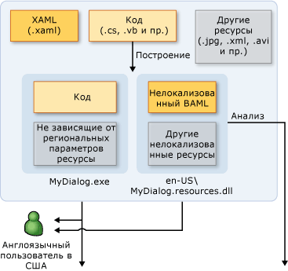
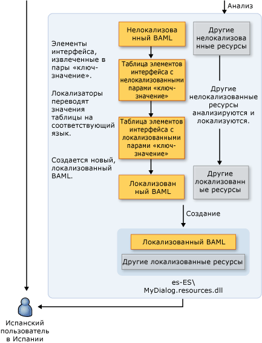

# Общие сведения о глобализации и локализации WPF
Если доступность продукта ограничена только одним языком, то таким образом ограничивается потенциальная база клиентов до некоторой части всего 6,5-миллиардного мирового населения. Чтобы созданные приложения были доступны мировой аудитории, одним из лучших и наиболее экономичных способов охватить большее количество клиентов является экономически эффективная локализация продукта.  
  
 В этом обзоре представлены глобализации и локализации в [!INCLUDE[TLA#tla_winclient](../../../../includes/tlasharptla-winclient-md.md)]. Глобализация — это проектирование и разработка приложений, которые выполняются в нескольких расположениях. Например, глобализация поддерживает локализованные пользовательские интерфейсы и региональные данные для пользователей на различных языках. [!INCLUDE[TLA2#tla_winclient](../../../../includes/tla2sharptla-winclient-md.md)]предоставляет глобализованные функциональные возможности проектирования, включая автоматический макет, вспомогательные сборки и локализованные атрибуты и комментарии.
  
 Локализация — это перевод ресурсов приложения в локализованные версии для конкретных языков и региональных параметров, которые поддерживает приложение. При локализации в [!INCLUDE[TLA2#tla_winclient](../../../../includes/tla2sharptla-winclient-md.md)], используйте API-интерфейсы в <xref:System.Windows.Markup.Localizer> пространства имен. Эти API-интерфейсы power [LocBaml Tool Sample](http://go.microsoft.com/fwlink/?LinkID=160016) средство командной строки. Сведения о создании и использовании LocBaml см. в разделе [локализации приложения](../../../../docs/framework/wpf/advanced/how-to-localize-an-application.md).    
  
## Рекомендации по глобализации и локализации в WPF  
 Можно максимально эффективно использовать возможности функциональные возможности глобализации и локализации, встроенных в [!INCLUDE[TLA2#tla_winclient](../../../../includes/tla2sharptla-winclient-md.md)] , выполнив разработки пользовательского интерфейса, а также локализации советов, которые содержатся в этом разделе.  
  
### Оптимальные методы разработки пользовательского интерфейса WPF  
 При разработке [!INCLUDE[TLA2#tla_winclient](../../../../includes/tla2sharptla-winclient-md.md)]— на основе [!INCLUDE[TLA2#tla_ui](../../../../includes/tla2sharptla-ui-md.md)], рассмотрите возможность реализации этих рекомендаций:  
  
-   Запись вашего [!INCLUDE[TLA2#tla_ui](../../../../includes/tla2sharptla-ui-md.md)] в [!INCLUDE[TLA2#tla_xaml](../../../../includes/tla2sharptla-xaml-md.md)]; не следует создавать [!INCLUDE[TLA2#tla_ui](../../../../includes/tla2sharptla-ui-md.md)] в коде. При создании вашего [!INCLUDE[TLA2#tla_ui](../../../../includes/tla2sharptla-ui-md.md)] с помощью [!INCLUDE[TLA2#tla_xaml](../../../../includes/tla2sharptla-xaml-md.md)], предоставляется через встроенные API-интерфейсы локализации.  
  
-   Избегайте использования абсолютного позиционирования и фиксированных размеров для размещения содержимого; Вместо этого используйте относительное или автоматическое изменение размеров.
  
    -   Используйте <xref:System.Windows.Window.SizeToContent%2A>; и устанавливайте для ширины и высоты значение `Auto`.  
  
    -   Избегайте использования <xref:System.Windows.Controls.Canvas> для размещения [!INCLUDE[TLA2#tla_ui](../../../../includes/tla2sharptla-ui-md.md)]s.  
  
    -   Используйте <xref:System.Windows.Controls.Grid> и его компонентов, общий размер.  
  
-   Необходимо предусмотреть дополнительное пространство в полях, так как локализованный текст часто занимает больше места. Дополнительное пространство позволит использовать выступающие символы, возможно, присутствующие в конкретном языке.  
  
-   Включить <xref:System.Windows.Controls.TextBlock.TextWrapping%2A> на <xref:System.Windows.Controls.TextBlock> во избежание обрезки.
  
-   Задать **XML: lang** атрибута. Этот атрибут описывает язык и региональные параметры конкретного элемента и его дочерние элементы. Значение этого свойства изменяет поведение некоторых функциональных возможностей в [!INCLUDE[TLA2#tla_winclient](../../../../includes/tla2sharptla-winclient-md.md)]. Например, изменяется процесс переноса по слогам, проверки орфографии, подстановки чисел, формирования сложных скриптов и подмены шрифта. В разделе [Глобализация для WPF](../../../../docs/framework/wpf/advanced/globalization-for-wpf.md) Дополнительные сведения о параметре [XML: lang в XAML](../../../../docs/framework/xaml-services/xml-lang-handling-in-xaml.md).  
  
-   Создайте настраиваемый составной шрифт, чтобы получить лучшее управление шрифты, используемые для различных языков. По умолчанию [!INCLUDE[TLA2#tla_winclient](../../../../includes/tla2sharptla-winclient-md.md)] используется шрифт GlobalUserInterface.composite в папке Windows\Fonts.  
  
-   При создании приложений навигации, которые могут быть локализованы в языке, использующем представление текста в формате справа налево, необходимо явно установить <xref:System.Windows.FlowDirection> части каждой страницы, чтобы обеспечить страницы не наследует <xref:System.Windows.FlowDirection> из <xref:System.Windows.Navigation.NavigationWindow>.  
  
-   При создании автономных приложений навигации, размещенных вне браузера <xref:System.Windows.Application.StartupUri%2A> для начального приложения <xref:System.Windows.Navigation.NavigationWindow> вместо на страницу (например, `<Application StartupUri="NavigationWindow.xaml">`). Такой подход позволяет изменять <xref:System.Windows.FlowDirection> окна и панели навигации. Дополнительные сведения и пример см. в разделе [пример домашней страницы глобализации](http://go.microsoft.com/fwlink/?LinkID=159990).  
  
### Оптимальные методы локализации приложений WPF  
 При локализации [!INCLUDE[TLA2#tla_winclient](../../../../includes/tla2sharptla-winclient-md.md)]— приложений на основе рассмотрите следующие рекомендации по реализации:  
  
-   Используйте комментарии локализации для обеспечения дополнительного контекста для локализации.  
  
-   Используйте атрибуты локализации для управления локализацией вместо выборочного пропуска <xref:System.Windows.Markup.Localizer.BamlLocalizableResourceKey.Uid%2A> свойства элементов. В разделе [атрибуты и комментарии локализации](../../../../docs/framework/wpf/advanced/localization-attributes-and-comments.md) для получения дополнительной информации.  
  
-   Используйте **msbuild /t:updateuid** и **/t:checkuid** для добавления и возвращения <xref:System.Windows.Markup.Localizer.BamlLocalizableResourceKey.Uid%2A> свойства в вашей [!INCLUDE[TLA2#tla_xaml](../../../../includes/tla2sharptla-xaml-md.md)]. Используйте <xref:System.Windows.Markup.Localizer.BamlLocalizableResourceKey.Uid%2A> свойства для отслеживания изменений между разработкой и локализации. <xref:System.Windows.Markup.Localizer.BamlLocalizableResourceKey.Uid%2A>свойства помогают локализовать новые изменения в разработке. Если вручную добавить <xref:System.Windows.Markup.Localizer.BamlLocalizableResourceKey.Uid%2A> свойства [!INCLUDE[TLA2#tla_ui](../../../../includes/tla2sharptla-ui-md.md)], задачи, обычно занимает много времени и менее точным.  
  
    -   Не изменять или <xref:System.Windows.Markup.Localizer.BamlLocalizableResourceKey.Uid%2A> свойства после начала локализации.  
  
    -   Не используйте повторяющиеся <xref:System.Windows.Markup.Localizer.BamlLocalizableResourceKey.Uid%2A> свойства (не забудьте этот совет, при использовании команды копирования и вставки).  
  
    -   Задать `UltimateResourceFallback` расположение в AssemblyInfo.* для указания на соответствующем языке для резервного входа (например, `[assembly: NeutralResourcesLanguage("en-US",   UltimateResourceFallbackLocation.Satellite)]`).  
  
         Если вы решили включить базовый язык в основную сборку путем пропуска `<UICulture>` тег в файле проекта, установите `UltimateResourceFallback` расположение главной сборки вместо вспомогательной (например, `[assembly: NeutralResourcesLanguage("en-US", UltimateResourceFallbackLocation.MainAssembly)]`).  
  
   
## Локализация приложения WPF  
 При локализации [!INCLUDE[TLA2#tla_winclient](../../../../includes/tla2sharptla-winclient-md.md)] приложения есть несколько вариантов. Например, можно привязать локализуемые ресурсы в приложении [!INCLUDE[TLA2#tla_xml](../../../../includes/tla2sharptla-xml-md.md)] файл, хранить локализуемый текст в resx-таблицах или указать локализатору использовать [!INCLUDE[TLA#tla_xaml](../../../../includes/tlasharptla-xaml-md.md)] файлов. В этом разделе описывается рабочий процесс локализации, используется форма BAML кода XAML, который предоставляет несколько преимуществ:  
  
-   Локализация может осуществляться после сборки.  
  
-   Можно выполнить обновление до более новой версии BAML-формы XAML с локализациями из старой версии BAML-формы XAML, чтобы обеспечить возможность локализации в процессе разработки.  
  
-   Можно проверить исходные исходные элементы и семантику во время компиляции, так как форма BAML кода XAML — это скомпилированные форма [!INCLUDE[TLA2#tla_xaml](../../../../includes/tla2sharptla-xaml-md.md)].  
  
### Процесс построения локализации  
 При разработке [!INCLUDE[TLA2#tla_winclient](../../../../includes/tla2sharptla-winclient-md.md)] — процесс построения локализации приложения, следующим образом:  
  
-   Разработчик создает и глобализующим [!INCLUDE[TLA2#tla_winclient](../../../../includes/tla2sharptla-winclient-md.md)] приложения. В файле проекта разработчик задает `<UICulture>en-US</UICulture>` , чтобы при компиляции приложения, зависящего от языка основная сборка. Эта сборка имеет вспомогательный файл .resources.dll, содержащий все локализуемые ресурсы. При необходимости позволяет исключить исходного языка в основной сборке, поскольку локализация [!INCLUDE[TLA2#tla_api#plural](../../../../includes/tla2sharptla-apisharpplural-md.md)] поддерживает извлечение из основной сборки.  
  
-   Если файл компилируется в сборку, [!INCLUDE[TLA2#tla_xaml](../../../../includes/tla2sharptla-xaml-md.md)] преобразуется в форма BAML кода XAML. Независимый от языка `MyDialog.exe` и зависимым языка и региональных параметров (на английском языке) `MyDialog.resources.dll` файлы, которые должны предоставляться клиенту-английски.  
  
### Рабочий процесс локализации  
 Процесс локализации начинается после нелокализованный `MyDialog.resources.dll` созданного файла. [!INCLUDE[TLA2#tla_ui](../../../../includes/tla2sharptla-ui-md.md)] Элементы и свойства в исходном [!INCLUDE[TLA2#tla_xaml](../../../../includes/tla2sharptla-xaml-md.md)] извлекается из форма BAML кода XAML в пары "ключ значение" с помощью [!INCLUDE[TLA2#tla_api#plural](../../../../includes/tla2sharptla-apisharpplural-md.md)] под <xref:System.Windows.Markup.Localizer>. Локализаторы используют пары "ключ —значение" для локализации приложения. После завершения локализации можно создать файл .resource.dll на основе новых значений.  
  
 Ключи пар «ключ значение» являются `x:Uid` значения, которые помещаются разработчиком в исходной коллекции [!INCLUDE[TLA2#tla_xaml](../../../../includes/tla2sharptla-xaml-md.md)]. Эти `x:Uid` значения дают [!INCLUDE[TLA2#tla_api](../../../../includes/tla2sharptla-api-md.md)] для отслеживания и слияние изменений, внесенных разработчиком и локализатора во время локализации. Например, если разработчик изменяет [!INCLUDE[TLA2#tla_ui](../../../../includes/tla2sharptla-ui-md.md)] после начала локализации, можно объединить эти изменения с уже выполненной работой по локализации, так что теряется минимум работы по переводу.  
  
 На приведенном ниже рисунке показан типичный рабочий процесс локализации на основе BAML-формы XAML. На этой диаграмме предполагается, что разработчик пишет приложение на английском языке. Разработчик создает и глобализует приложение WPF. В файле проекта разработчик задает `<UICulture>en-US</UICulture>` , чтобы при построении от основного языка сборка получает созданный вспомогательной. resources.dll, содержащий все локализуемые ресурсы. Кроме того, можно сохранить исходный язык в основной сборке, так как интерфейсы API локализации WPF поддерживают извлечение из основной сборки. По завершении процесса сборки XAML компилируется в BAML. Независимый от языка и региональных параметров файл MyDialog.exe.resources.dll поставляется англоязычному пользователю.  
  
   
  
   
  
   
## Примеры локализации WPF  
 Этот раздел содержит примеры локализованных приложений помогут вам понять, как построение и локализация [!INCLUDE[TLA2#tla_winclient](../../../../includes/tla2sharptla-winclient-md.md)] приложений.  
  
#### Пример диалогового окна "Выполнить"  
 На следующем рисунке показан вывод **запуска** пример диалогового окна.  
  
 **Английский.**  
  
   
  
 **Немецкий.**  
  
   
  
 **Разработка глобального диалогового окна "Выполнить"**  
  
 В этом примере выводятся **запуска** диалоговое окно с помощью [!INCLUDE[TLA2#tla_winclient](../../../../includes/tla2sharptla-winclient-md.md)] и [!INCLUDE[TLA2#tla_xaml](../../../../includes/tla2sharptla-xaml-md.md)]. Это диалоговое окно предназначено эквивалентно **запуска** диалоговым окном, которое доступно из [!INCLUDE[TLA#tla_win](../../../../includes/tlasharptla-win-md.md)] меню "Пуск".  
  
 Некоторые замечания по созданию глобальных диалоговых окон  
  
 **Автоматический макет**  
  
 *В файле Window1.xaml*  
  
 `<Window SizeToContent="WidthAndHeight">`  
  
 Предыдущее свойство Window автоматически изменяет размер окна в соответствии с размером содержимого. Это свойство предотвращает обрезание содержимого окна, которое увеличивается в размере после локализации. Кроме того, оно также удаляет лишнее пространство, если содержимое уменьшается в размерах после локализации.  
  
 `<Grid x:Uid="Grid_1">`  
  
 <xref:System.Windows.Markup.Localizer.BamlLocalizableResourceKey.Uid%2A>для того, требуются свойства [!INCLUDE[TLA2#tla_winclient](../../../../includes/tla2sharptla-winclient-md.md)] локализации [!INCLUDE[TLA2#tla_api#plural](../../../../includes/tla2sharptla-apisharpplural-md.md)] для правильной работы.  
  
 Они используются [!INCLUDE[TLA2#tla_winclient](../../../../includes/tla2sharptla-winclient-md.md)] локализации [!INCLUDE[TLA2#tla_api#plural](../../../../includes/tla2sharptla-apisharpplural-md.md)] для отслеживания изменений между разработкой и локализацией [!INCLUDE[TLA#tla_ui](../../../../includes/tlasharptla-ui-md.md)]. <xref:System.Windows.Markup.Localizer.BamlLocalizableResourceKey.Uid%2A>свойства позволяют выполнить слияние более новой версии [!INCLUDE[TLA2#tla_ui](../../../../includes/tla2sharptla-ui-md.md)] со старой локализацией [!INCLUDE[TLA2#tla_ui](../../../../includes/tla2sharptla-ui-md.md)]. Добавить <xref:System.Windows.Markup.Localizer.BamlLocalizableResourceKey.Uid%2A> свойства, выполнив **msbuild /t:updateuid RunDialog.csproj** в командной оболочке. Это рекомендуемый способ добавления <xref:System.Windows.Markup.Localizer.BamlLocalizableResourceKey.Uid%2A> свойства так, как вручную добавлять их обычно требует много времени и менее точным. Можно убедиться, что <xref:System.Windows.Markup.Localizer.BamlLocalizableResourceKey.Uid%2A> свойства заданы правильно, запустив **msbuild /t:checkuid RunDialog.csproj**.  
  
 [!INCLUDE[TLA2#tla_ui](../../../../includes/tla2sharptla-ui-md.md)] Структурирован при помощи <xref:System.Windows.Controls.Grid> управления, который является полезным элемента управления для использования преимуществ автоматический макет в [!INCLUDE[TLA2#tla_winclient](../../../../includes/tla2sharptla-winclient-md.md)]. Обратите внимание, что диалоговое окно разделено на три строки и пять столбцов. Ни один из определения строк и столбцов имеет фиксированный размер. Таким образом [!INCLUDE[TLA2#tla_ui](../../../../includes/tla2sharptla-ui-md.md)] элементы, которые расположены в каждой ячейке можно приспособить к увеличивается и уменьшается в размерах при локализации.  
  
 [!code-xaml[GlobalizationRunDialog#GridColumnDef](../../../../samples/snippets/csharp/VS_Snippets_Wpf/GlobalizationRunDialog/CS/Window1.xaml#gridcolumndef)]  
  
 Первые два столбца где **откройте:** метки и <xref:System.Windows.Controls.ComboBox> помещаются использовать 10 процентов [!INCLUDE[TLA2#tla_ui](../../../../includes/tla2sharptla-ui-md.md)] всей ширины.  
  
 [!code-xaml[GlobalizationRunDialog#GridColumnDef2](../../../../samples/snippets/csharp/VS_Snippets_Wpf/GlobalizationRunDialog/CS/Window1.xaml#gridcolumndef2)]  
  
 Обратите внимание, что в примере используется функция общего изменения размера <xref:System.Windows.Controls.Grid>. Последние три столбца используют это преимущество, размещаясь в том же <xref:System.Windows.Controls.DefinitionBase.SharedSizeGroup%2A>. Как следует из имени свойства, это позволяет столбцам использовать один и тот же размер. Поэтому когда "Browse…" локализуется в более длинную строку "Durchsuchen…", ширина всех кнопок увеличивается и не возникает ситуация с маленькой кнопкой ОК и непропорционально большой кнопкой "Durchsuchen…". .  
  
 **Xml:lang**  
  
 `Xml:lang="en-US"`  
  
 Обратите внимание [XML: lang в XAML](../../../../docs/framework/xaml-services/xml-lang-handling-in-xaml.md) помещается в корневом элементе [!INCLUDE[TLA2#tla_ui](../../../../includes/tla2sharptla-ui-md.md)]. Это свойство описывает язык и региональные параметры конкретного элемента и его потомков. Это значение используется несколько функций в [!INCLUDE[TLA2#tla_winclient](../../../../includes/tla2sharptla-winclient-md.md)] и должны быть соответствующим образом изменено во время локализации. Это значение изменяется в зависимости от того, какой языковой словарь используется для расстановки переносов и проверки орфографии слов. Оно также влияет на отображение цифр и на то, как система подмены шрифтов выбирает шрифт для использования. Наконец, это свойство влияет на способ отображения чисел и на способ написания текста в сложных скриптах. По умолчанию используется значение en-US.  
  
 **Создание вспомогательной сборки ресурсов**  
  
 *В файле .csproj*  
  
 `<UICulture>en-US</UICulture>`  
  
 Обратите внимание на добавленную `UICulture` значение. Если это задано допустимое <xref:System.Globalization.CultureInfo> значение, например en US, построение проекта создаст вспомогательную сборку со все локализуемые ресурсы в ней.  
  
 `<Resource Include="RunIcon.JPG">`  
  
 `<Localizable>False</Localizable>`  
  
 `</Resource>`  
  
 `RunIcon.JPG` Необходимо локализовать, потому что он должен быть одинаков для всех языков и региональных параметров. `Localizable`имеет значение `false` , чтобы он остается в независимой от языка основной сборке, вместо вспомогательной сборки. Значение по умолчанию для всех некомпилируемых ресурсов — `Localizable` значение `true`.  
  
 **Локализация диалогового окна "Выполнить"**  
  
 **Анализ**  
  
 После сборки приложения первым шагом в локализации является анализ локализуемых ресурсов из вспомогательной сборки. Для целей этого раздела, используйте средство LocBaml образца, которую можно найти в [LocBaml Tool Sample](http://go.microsoft.com/fwlink/?LinkID=160016). Обратите внимание, что LocBaml ― только демонстрационное средство, предназначенное помочь начать работу по созданию средства локализации, встраиваемого в процесс локализации. С помощью LocBaml выполните следующую команду для синтаксического анализа: **LocBaml/проанализировать RunDialog.resources.dll/out:** создать файл «Команду».  
  
 **Локализация**  
  
 Для редактирования этого файла можно воспользоваться любым редактором CSV, поддерживающим Юникод. Исключите все записи с категорией локализации "Нет". Должны остаться следующие записи.  
  
|Ключ ресурса|Категория локализации|Значение|  
|-|-|-| 
|Button_1:System.Windows.Controls.Button.$Content|Кнопка|ОК|  
|Button_2:System.Windows.Controls.Button.$Content|Кнопка|Отмена|  
|Button_3:System.Windows.Controls.Button.$Content|Кнопка|Обзор...|  
|ComboBox_1:System.Windows.Controls.ComboBox.$Content|ComboBox||  
|TextBlock_1:System.Windows.Controls.TextBlock.$Content|Text|Введите имя программы, папки, документа или ресурса Интернета, и Windows откроет их.|  
|TextBlock_2:System.Windows.Controls.TextBlock.$Content|Text|Открыть:|  
|Window_1:System.Windows.Window.Title|Заголовок|Выполнить|  
  
 Для локализации приложений в немецком языке потребуются следующие переводы.  
  
|Ключ ресурса|Категория локализации|Значение|  
|-|-|-| 
|Button_1:System.Windows.Controls.Button.$Content|Кнопка|ОК|  
|Button_2:System.Windows.Controls.Button.$Content|Кнопка|Abbrechen|  
|Button_3:System.Windows.Controls.Button.$Content|Кнопка|Durchsuchen…|  
|ComboBox_1:System.Windows.Controls.ComboBox.$Content|ComboBox||  
|TextBlock_1:System.Windows.Controls.TextBlock.$Content|Text|Geben Sie den Namen eines Programms, Ordners, Dokuments oder einer Internetresource an.|  
|TextBlock_2:System.Windows.Controls.TextBlock.$Content|Text|Öffnen:|  
|Window_1:System.Windows.Window.Title|Заголовок|Выполнить|  
  
 **Создание**  
  
 Последний шаг локализации включает создание только что локализованной вспомогательной сборки. Эту задачу можно решить с помощью следующей команды LocBaml.  
  
 **LocBaml.exe /generate RunDialog.resources.dll /trans:RunDialog.resources.dll.CSV /out: . /cul:de-DE**  
  
 В немецком [!INCLUDE[TLA#tla_mswin](../../../../includes/tlasharptla-mswin-md.md)], если файл resources.dll размещен в папке de-DE главной сборки, этот ресурс будет автоматически загружаться вместо того, в папке «en US». Если у вас используется немецкая версия [!INCLUDE[TLA#tla_mswin](../../../../includes/tlasharptla-mswin-md.md)] Чтобы проверить это, необходимо указать региональные параметры региональные [!INCLUDE[TLA#tla_mswin](../../../../includes/tlasharptla-mswin-md.md)] используется (т. е. en US) и замените исходный resources.dll.  
  
 **Загрузка вспомогательных ресурсов**  
  
|MyDialog.exe|en-US\MyDialog.resources.dll|de-DE\MyDialog.resources.dll|  
|------------------|------------------------------------|------------------------------------|  
|Код|Исходный английский BAML|Локализованный BAML|  
|Ресурсы, не зависящие от языка и региональных параметров|Другие ресурсы на английском языке|Другие ресурсы, локализованные для немецкого языка|  
  
 Платформа .NET framework автоматически выбирает вспомогательную сборку ресурсов для загрузки приложения `Thread.CurrentThread.CurrentUICulture`. По умолчанию используется язык и региональные параметры вашего [!INCLUDE[TLA#tla_mswin](../../../../includes/tlasharptla-mswin-md.md)] ОС. Таким образом, если вы используете немецкий [!INCLUDE[TLA#tla_mswin](../../../../includes/tlasharptla-mswin-md.md)], загружает de-DE\MyDialog.resources.dll, если вы используете Английский [!INCLUDE[TLA#tla_mswin](../../../../includes/tlasharptla-mswin-md.md)], загружает en-US\MyDialog.resources.dll. Можно задать для приложения резервный ресурс, указав NeutralResourcesLanguage в AssemblyInfo.* проекта. Например, если будет указано:  
  
 `[assembly: NeutralResourcesLanguage("en-US", UltimateResourceFallbackLocation.Satellite)]`  
  
 то в случае недоступности de-DE\MyDialog.resources.dll и de\MyDialog.resources.dll немецкой версией Windows будет использоваться en-US\MyDialog.resources.dll.  
  
### Домашняя страница сайта Майкрософт для Саудовской Аравии  
 На рисунке ниже показаны английская и арабская домашние страницы. Полный пример создания этих рисунков в разделе [пример домашней страницы глобализации](http://go.microsoft.com/fwlink/?LinkID=159990).  
  
 **Английский.**  
  
   
  
 **Арабский:**  
  
   
  
### Проектирование глобальной домашней страницы Майкрософт  
 Этот макет веб-сайта Майкрософт для Саудовской Аравии показывает функциональные возможности глобализации, предоставляемые для языков с порядком чтения справа налево (RightToLeft). Языках, таких как иврит и арабский имеют порядок чтения справа налево, поэтому макет [!INCLUDE[TLA2#tla_ui](../../../../includes/tla2sharptla-ui-md.md)] часто должны быть упорядочены по-другому, чем было бы на языках справа налево, например английского языка. Локализация с языка с направлением письма слева направо на язык с направлением письма справа налево или наоборот может быть достаточно сложной. [!INCLUDE[TLA2#tla_winclient](../../../../includes/tla2sharptla-winclient-md.md)] разработан так, чтобы значительно упростить подобные локализации.  
  
 **FlowDirection**  
  
 *Homepage.xaml:*  
  
 [!code-xaml[GlobalizationHomepage#Homepage](../../../../samples/snippets/csharp/VS_Snippets_Wpf/GlobalizationHomepage/CS/Homepage.xaml#homepage)]  
  
 Обратите внимание <xref:System.Windows.FrameworkElement.FlowDirection%2A> свойство <xref:System.Windows.Controls.Page>. Изменение этого свойства на <xref:System.Windows.FlowDirection.RightToLeft> приведет к изменению <xref:System.Windows.FrameworkElement.FlowDirection%2A> из <xref:System.Windows.Controls.Page> и ее дочерних элементов, чтобы макет этого [!INCLUDE[TLA2#tla_ui](../../../../includes/tla2sharptla-ui-md.md)] Перевернутая станут справа налево, как и ожидалось Арабский пользователь. Можно переопределить поведение наследования явно указав <xref:System.Windows.FrameworkElement.FlowDirection%2A> для любого элемента. <xref:System.Windows.FrameworkElement.FlowDirection%2A> Свойство доступно для любого <xref:System.Windows.FrameworkElement> или документов связанный элемент, и имеет неявное значение <xref:System.Windows.FlowDirection.LeftToRight>.  
  
 Обратите внимание, что даже градиентные кисти фона соответствующим образом при корневой <xref:System.Windows.FrameworkElement.FlowDirection%2A> изменяется:  
  
 **FlowDirection="LeftToRight"**  
  
   
  
 **FlowDirection="RightToLeft"**  
  
   
  
 **Избегайте использования фиксированных размеров для панелей и элементов управления**  
  
 Ознакомьтесь со всеми Homepage.xaml, обратите внимание, что помимо фиксированную ширину и высоту, указанный для всего [!INCLUDE[TLA2#tla_ui](../../../../includes/tla2sharptla-ui-md.md)] в верхней части страницы <xref:System.Windows.Controls.DockPanel>, существуют другие фиксированные аналитики. Не следует использовать фиксированные размеры, чтобы предотвратить отсечение локализованного текста, который может быть больше, чем исходный текст. Панели и элементы управления [!INCLUDE[TLA2#tla_winclient](../../../../includes/tla2sharptla-winclient-md.md)] будут автоматически изменяться в размерах в зависимости от находящегося в них содержимого. Большинство элементов управления также имеют минимальные и максимальные размеры, которые можно задать для большего контроля (например, MinWidth="20"). С <xref:System.Windows.Controls.Grid>, можно также задать относительную ширину и высоту с помощью "*" (т. е. ширина = «0,25\*») или использовать его размер ячейки, компонент совместного использования.  
  
 **Комментарии о локализации**  
  
 Во многих случаях содержимое может быть неоднозначным и трудным для перевода. Разработчик и проектировщик имеют возможность предоставить локализаторам дополнительный контекст и примечания в комментариях локализации. Например, в приведенных ниже комментариях локализации уточняется использование символа "&#124;".  
  
 [!code-xaml[GlobalizationHomepage#LocalizationComment](../../../../samples/snippets/csharp/VS_Snippets_Wpf/GlobalizationHomepage/CS/Homepage.xaml#localizationcomment)]  
  
 Этот комментарий становится связанным с содержимым элемента TextBlock_1 и средство LocBaml (см. [локализации приложения](../../../../docs/framework/wpf/advanced/how-to-localize-an-application.md)), можно увидеть в столбце 6-й строки TextBlock_1 в выходной CSV-файл:  
  
|Ключ ресурса|Категория|Доступен для чтения|Изменяемый|Комментарий|Значение|  
|-|-|-|-|-|-|  
|TextBlock_1:System.Windows.Controls.TextBlock.$Content|Text|true|true|Этот символ используется в качестве декоративного правила.|&#124;|  
  
 Комментарии могут быть помещены в содержимое или в свойство любого элемента посредством следующего синтаксиса.  
  
 [!code-xaml[GlobalizationHomepage#LocalizationCommentsProp](../../../../samples/snippets/csharp/VS_Snippets_Wpf/GlobalizationHomepage/CS/Homepage.xaml#localizationcommentsprop)]  
  
 **Атрибуты локализации**  
  
 Разработчику или менеджеру локализации часто бывает необходимо управлять тем, что локализаторы могут читать и изменять. Например, может быть нежелательно, чтобы локализатор переводил название компании или юридическую формулировку. В [!INCLUDE[TLA2#tla_winclient](../../../../includes/tla2sharptla-winclient-md.md)] имеются атрибуты, позволяющие задать возможность чтения, возможность изменения, а также категорию содержимого или свойства элемента. Эти атрибуты можно использовать в средстве локализации для блокировки, скрытия или сортировки элементов. Дополнительные сведения см. в разделе <xref:System.Windows.Localization.Attributes%2A>. В этом примере средство LocBaml только выводит значения этих атрибутов. Во всех элементах управления [!INCLUDE[TLA2#tla_winclient](../../../../includes/tla2sharptla-winclient-md.md)] эти атрибуты имеют значения по умолчанию, но их можно переопределять. Например, в следующем примере переопределяются атрибуты локализации по умолчанию для `TextBlock_1` и задает содержимое для чтения, но неизменяемым для локализации.  
  
 [!code-xaml[LocalizationComAtt#LocalizationAttributes](../../../../samples/snippets/csharp/VS_Snippets_Wpf/LocalizationComAtt/CSharp/Attributes.xaml#localizationattributes)]  
  
 Помимо повышения удобочитаемости и атрибуты Изменяемость [!INCLUDE[TLA2#tla_winclient](../../../../includes/tla2sharptla-winclient-md.md)] предоставляет перечисление общих категорий пользовательского интерфейса (<xref:System.Windows.LocalizationCategory>), можно использовать для предоставления локализаторам дополнительного контекста. [!INCLUDE[TLA2#tla_winclient](../../../../includes/tla2sharptla-winclient-md.md)] Категории по умолчанию для элементов управления платформы могут переопределяться в [!INCLUDE[TLA2#tla_xaml](../../../../includes/tla2sharptla-xaml-md.md)] также:  
  
 [!code-xaml[LocalizationComAtt#LocalizationAttributesOverridden](../../../../samples/snippets/csharp/VS_Snippets_Wpf/LocalizationComAtt/CSharp/Attributes.xaml#localizationattributesoverridden)]  
  
 Атрибуты локализации по умолчанию, который [!INCLUDE[TLA2#tla_winclient](../../../../includes/tla2sharptla-winclient-md.md)] предоставляет также могут быть переопределены в коде, так что можно корректно установить правильные значения по умолчанию для пользовательских элементов управления. Пример:  
  
 `[Localizability(Readability = Readability.Readable, Modifiability=Modifiability.Unmodifiable, LocalizationCategory.None)]`  
  
 `public class CorporateLogo: TextBlock`  
  
 `{`  
  
 `…`  
  
 `..`  
  
 `.`  
  
 `}`  
  
 На экземпляре атрибуты, заданные [!INCLUDE[TLA2#tla_xaml](../../../../includes/tla2sharptla-xaml-md.md)] будет иметь приоритет над значениями, заданными в коде в пользовательских элементах управления. Дополнительные сведения об атрибутах и комментариях см. в разделе [атрибуты локализации и примечания](../../../../docs/framework/wpf/advanced/localization-attributes-and-comments.md).  
  
 **Подмена шрифтов и составные шрифты**  
  
 Если задан шрифт, который не поддерживает данный диапазон кодовых точек, [!INCLUDE[TLA2#tla_winclient](../../../../includes/tla2sharptla-winclient-md.md)] будет автоматически с помощью шрифта Global User Interface.compositefont, расположенного в папке Windows\Fonts. Составные шрифты работают так же, как и любой другой шрифт, и могут использоваться явно путем задания параметра FontFamily элемента (например, FontFamily="Global User Interface"). Вы можете задавать собственные предпочтения для подмены шрифта путем создания собственного составного шрифта и указания его использования для конкретных языков и диапазонов кодовых точек.  
  
 Дополнительные сведения о составных шрифтах см <xref:System.Windows.Media.FontFamily>.  
  
 **Локализация домашней страницы Майкрософт**  
  
 Для локализации этого приложения можно выполнить те же действия, что и в примере локализации диалогового окна "Выполнить". Локализованные CSV-файл для арабского языка доступно для в [пример домашней страницы глобализации](http://go.microsoft.com/fwlink/?LinkID=159990).
