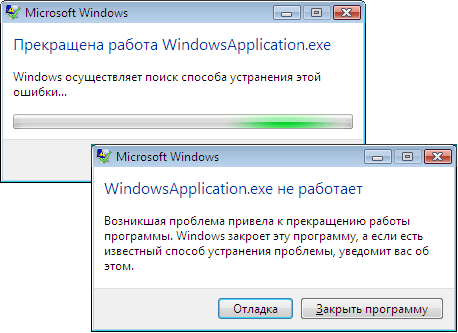

# <a name="application-management-overview"></a><span data-ttu-id="88bbc-102">Общие сведения об управлении приложением</span><span class="sxs-lookup"><span data-stu-id="88bbc-102">Application Management Overview</span></span>
<span data-ttu-id="88bbc-103">Все приложения имеют тенденцию совместно использовать общий набор функциональных возможностей, который применяется к реализации приложения и управлению им.</span><span class="sxs-lookup"><span data-stu-id="88bbc-103">All applications tend to share a common set of functionality that applies to application implementation and management.</span></span> <span data-ttu-id="88bbc-104">Этот раздел содержит обзор функций в <xref:System.Windows.Application> класс для создания и управления приложениями.</span><span class="sxs-lookup"><span data-stu-id="88bbc-104">This topic provides an overview of the functionality in the <xref:System.Windows.Application> class for creating and managing applications.</span></span>  
   
  
## <a name="the-application-class"></a><span data-ttu-id="88bbc-105">Класс Application</span><span class="sxs-lookup"><span data-stu-id="88bbc-105">The Application Class</span></span>  
 <span data-ttu-id="88bbc-106">В [!INCLUDE[TLA2#tla_wpf](../../../../includes/tla2sharptla-wpf-md.md)], общие функциональные возможности области приложения, содержащийся в <xref:System.Windows.Application> класса.</span><span class="sxs-lookup"><span data-stu-id="88bbc-106">In [!INCLUDE[TLA2#tla_wpf](../../../../includes/tla2sharptla-wpf-md.md)], common application-scoped functionality is encapsulated in the <xref:System.Windows.Application> class.</span></span> <span data-ttu-id="88bbc-107"><xref:System.Windows.Application> Класс включает в себя следующие функциональные возможности:</span><span class="sxs-lookup"><span data-stu-id="88bbc-107">The <xref:System.Windows.Application> class includes the following functionality:</span></span>  
  
-   <span data-ttu-id="88bbc-108">отслеживание и взаимодействие со временем существования приложения;</span><span class="sxs-lookup"><span data-stu-id="88bbc-108">Tracking and interacting with application lifetime.</span></span>  
  
-   <span data-ttu-id="88bbc-109">извлечение и обработка параметров командной строки;</span><span class="sxs-lookup"><span data-stu-id="88bbc-109">Retrieving and processing command-line parameters.</span></span>  
  
-   <span data-ttu-id="88bbc-110">обнаружение необработанных исключений и реагирование на них;</span><span class="sxs-lookup"><span data-stu-id="88bbc-110">Detecting and responding to unhandled exceptions.</span></span>  
  
-   <span data-ttu-id="88bbc-111">совместное использование свойств области определения приложения и ресурсов;</span><span class="sxs-lookup"><span data-stu-id="88bbc-111">Sharing application-scope properties and resources.</span></span>  
  
-   <span data-ttu-id="88bbc-112">управление окнами в автономных приложениях;</span><span class="sxs-lookup"><span data-stu-id="88bbc-112">Managing windows in standalone applications.</span></span>  
  
-   <span data-ttu-id="88bbc-113">отслеживание навигации и управление ею.</span><span class="sxs-lookup"><span data-stu-id="88bbc-113">Tracking and managing navigation.</span></span>  
  
<a name="The_Application_Class"></a>   
## <a name="how-to-perform-common-tasks-using-the-application-class"></a><span data-ttu-id="88bbc-114">Выполнение стандартных задач с помощью класса приложения</span><span class="sxs-lookup"><span data-stu-id="88bbc-114">How to Perform Common Tasks Using the Application Class</span></span>  
 <span data-ttu-id="88bbc-115">Если вы не интересуют все детали <xref:System.Windows.Application> класса, в следующей таблице перечислены некоторые распространенные задачи по <xref:System.Windows.Application> и порядок их выполнения.</span><span class="sxs-lookup"><span data-stu-id="88bbc-115">If you are not interested in all of the details of the <xref:System.Windows.Application> class, the following table lists some of the common tasks for <xref:System.Windows.Application> and how to accomplish them.</span></span> <span data-ttu-id="88bbc-116">Чтобы получить дополнительные сведения и образец кода, просмотрите связанные API и разделы.</span><span class="sxs-lookup"><span data-stu-id="88bbc-116">By viewing the related API and topics, you can find more information and sample code.</span></span>  
  
|<span data-ttu-id="88bbc-117">Задача</span><span class="sxs-lookup"><span data-stu-id="88bbc-117">Task</span></span>|<span data-ttu-id="88bbc-118">Подход</span><span class="sxs-lookup"><span data-stu-id="88bbc-118">Approach</span></span>|  
|----------|--------------|  
|<span data-ttu-id="88bbc-119">Получение объекта, представляющего текущее приложение</span><span class="sxs-lookup"><span data-stu-id="88bbc-119">Get an object that represents the current application</span></span>|<span data-ttu-id="88bbc-120">Используйте свойство <xref:System.Windows.Application.Current%2A?displayProperty=nameWithType>.</span><span class="sxs-lookup"><span data-stu-id="88bbc-120">Use the <xref:System.Windows.Application.Current%2A?displayProperty=nameWithType> property.</span></span>|  
|<span data-ttu-id="88bbc-121">Добавление заставки в приложение</span><span class="sxs-lookup"><span data-stu-id="88bbc-121">Add a startup screen to an application</span></span>|<span data-ttu-id="88bbc-122">В разделе [добавить экран-заставку для приложения WPF](../../../../docs/framework/wpf/app-development/how-to-add-a-splash-screen-to-a-wpf-application.md).</span><span class="sxs-lookup"><span data-stu-id="88bbc-122">See [Add a Splash Screen to a WPF Application](../../../../docs/framework/wpf/app-development/how-to-add-a-splash-screen-to-a-wpf-application.md).</span></span>|  
|<span data-ttu-id="88bbc-123">Запуск приложения</span><span class="sxs-lookup"><span data-stu-id="88bbc-123">Start an application</span></span>|<span data-ttu-id="88bbc-124">Воспользуйтесь методом <xref:System.Windows.Application.Run%2A?displayProperty=nameWithType>.</span><span class="sxs-lookup"><span data-stu-id="88bbc-124">Use the <xref:System.Windows.Application.Run%2A?displayProperty=nameWithType> method.</span></span>|  
|<span data-ttu-id="88bbc-125">Остановка приложения</span><span class="sxs-lookup"><span data-stu-id="88bbc-125">Stop an application</span></span>|<span data-ttu-id="88bbc-126">Используйте <xref:System.Windows.Application.Shutdown%2A> метод <xref:System.Windows.Application.Current%2A?displayProperty=nameWithType> объекта.</span><span class="sxs-lookup"><span data-stu-id="88bbc-126">Use the <xref:System.Windows.Application.Shutdown%2A> method of the <xref:System.Windows.Application.Current%2A?displayProperty=nameWithType> object.</span></span>|  
|<span data-ttu-id="88bbc-127">Получение аргументов из командной строки</span><span class="sxs-lookup"><span data-stu-id="88bbc-127">Get arguments from the command line</span></span>|<span data-ttu-id="88bbc-128">Обрабатывать <xref:System.Windows.Application.Startup?displayProperty=nameWithType> событий и использование <xref:System.Windows.StartupEventArgs.Args%2A?displayProperty=nameWithType> свойство.</span><span class="sxs-lookup"><span data-stu-id="88bbc-128">Handle the <xref:System.Windows.Application.Startup?displayProperty=nameWithType> event and use the <xref:System.Windows.StartupEventArgs.Args%2A?displayProperty=nameWithType> property.</span></span> <span data-ttu-id="88bbc-129">Пример см. в разделе <xref:System.Windows.Application.Startup?displayProperty=nameWithType> событий.</span><span class="sxs-lookup"><span data-stu-id="88bbc-129">For an example, see the <xref:System.Windows.Application.Startup?displayProperty=nameWithType> event.</span></span>|  
|<span data-ttu-id="88bbc-130">Получение и задание кода завершения приложения</span><span class="sxs-lookup"><span data-stu-id="88bbc-130">Get and set the application exit code</span></span>|<span data-ttu-id="88bbc-131">Задать <xref:System.Windows.ExitEventArgs.ApplicationExitCode%2A?displayProperty=nameWithType> свойство в <xref:System.Windows.Application.Exit?displayProperty=nameWithType> обработчик событий, или вызов <xref:System.Windows.Application.Shutdown%2A> метод и передайте его в целое число.</span><span class="sxs-lookup"><span data-stu-id="88bbc-131">Set the <xref:System.Windows.ExitEventArgs.ApplicationExitCode%2A?displayProperty=nameWithType> property in the <xref:System.Windows.Application.Exit?displayProperty=nameWithType> event handler or call the <xref:System.Windows.Application.Shutdown%2A> method and pass in an integer.</span></span>|  
|<span data-ttu-id="88bbc-132">Обнаружение необработанных исключений и реагирование на них</span><span class="sxs-lookup"><span data-stu-id="88bbc-132">Detect and respond to unhandled exceptions</span></span>|<span data-ttu-id="88bbc-133">Обрабатывать <xref:System.Windows.Application.DispatcherUnhandledException> событий.</span><span class="sxs-lookup"><span data-stu-id="88bbc-133">Handle the <xref:System.Windows.Application.DispatcherUnhandledException> event.</span></span>|  
|<span data-ttu-id="88bbc-134">Получение и задание ресурсов области определения приложения</span><span class="sxs-lookup"><span data-stu-id="88bbc-134">Get and set application-scoped resources</span></span>|<span data-ttu-id="88bbc-135">Используйте свойство <xref:System.Windows.Application.Resources%2A?displayProperty=nameWithType>.</span><span class="sxs-lookup"><span data-stu-id="88bbc-135">Use the <xref:System.Windows.Application.Resources%2A?displayProperty=nameWithType> property.</span></span>|  
|<span data-ttu-id="88bbc-136">Использование словаря ресурсов области определения приложения</span><span class="sxs-lookup"><span data-stu-id="88bbc-136">Use an application-scope resource dictionary</span></span>|<span data-ttu-id="88bbc-137">В разделе [использование словаря ресурсов области приложения](../../../../docs/framework/wpf/app-development/how-to-use-an-application-scope-resource-dictionary.md).</span><span class="sxs-lookup"><span data-stu-id="88bbc-137">See [Use an Application-Scope Resource Dictionary](../../../../docs/framework/wpf/app-development/how-to-use-an-application-scope-resource-dictionary.md).</span></span>|  
|<span data-ttu-id="88bbc-138">Получение и задание свойств области определения приложения</span><span class="sxs-lookup"><span data-stu-id="88bbc-138">Get and set application-scoped properties</span></span>|<span data-ttu-id="88bbc-139">Используйте свойство <xref:System.Windows.Application.Properties%2A?displayProperty=nameWithType>.</span><span class="sxs-lookup"><span data-stu-id="88bbc-139">Use the <xref:System.Windows.Application.Properties%2A?displayProperty=nameWithType> property.</span></span>|  
|<span data-ttu-id="88bbc-140">Получение и сохранение состояния приложения</span><span class="sxs-lookup"><span data-stu-id="88bbc-140">Get and save an application's state</span></span>|<span data-ttu-id="88bbc-141">В разделе [сохранение и восстановление свойств области приложения между сеансами приложения](../../../../docs/framework/wpf/app-development/persist-and-restore-application-scope-properties.md).</span><span class="sxs-lookup"><span data-stu-id="88bbc-141">See [Persist and Restore Application-Scope Properties Across Application Sessions](../../../../docs/framework/wpf/app-development/persist-and-restore-application-scope-properties.md).</span></span>|  
|<span data-ttu-id="88bbc-142">Управление файлами данных без кода, включая файлы ресурсов, файлы содержимого и файлы исходного сайта.</span><span class="sxs-lookup"><span data-stu-id="88bbc-142">Manage non-code data files, including resource files, content files, and site-of-origin files.</span></span>|<span data-ttu-id="88bbc-143">В разделе [ресурса приложения WPF, содержимое и файлы данных](../../../../docs/framework/wpf/app-development/wpf-application-resource-content-and-data-files.md).</span><span class="sxs-lookup"><span data-stu-id="88bbc-143">See [WPF Application Resource, Content, and Data Files](../../../../docs/framework/wpf/app-development/wpf-application-resource-content-and-data-files.md).</span></span>|  
|<span data-ttu-id="88bbc-144">Управление окнами в автономных приложениях</span><span class="sxs-lookup"><span data-stu-id="88bbc-144">Manage windows in standalone applications</span></span>|<span data-ttu-id="88bbc-145">В разделе [Обзор Windows WPF](../../../../docs/framework/wpf/app-development/wpf-windows-overview.md).</span><span class="sxs-lookup"><span data-stu-id="88bbc-145">See [WPF Windows Overview](../../../../docs/framework/wpf/app-development/wpf-windows-overview.md).</span></span>|  
|<span data-ttu-id="88bbc-146">Отслеживание навигации и управление ею</span><span class="sxs-lookup"><span data-stu-id="88bbc-146">Track and manage navigation</span></span>|<span data-ttu-id="88bbc-147">В разделе [Общие сведения о навигации](../../../../docs/framework/wpf/app-development/navigation-overview.md).</span><span class="sxs-lookup"><span data-stu-id="88bbc-147">See [Navigation Overview](../../../../docs/framework/wpf/app-development/navigation-overview.md).</span></span>|  
  
<a name="The_Application_Definition"></a>   
## <a name="the-application-definition"></a><span data-ttu-id="88bbc-148">Определение приложения</span><span class="sxs-lookup"><span data-stu-id="88bbc-148">The Application Definition</span></span>  
 <span data-ttu-id="88bbc-149">Чтобы использовать функциональные возможности <xref:System.Windows.Application> класса, необходимо реализовать определение приложения.</span><span class="sxs-lookup"><span data-stu-id="88bbc-149">To utilize the functionality of the <xref:System.Windows.Application> class, you must implement an application definition.</span></span> <span data-ttu-id="88bbc-150">Объект [!INCLUDE[TLA2#tla_wpf](../../../../includes/tla2sharptla-wpf-md.md)] определение приложения — это класс, производный от <xref:System.Windows.Application> и настроен со специальным [!INCLUDE[TLA#tla_msbuild](../../../../includes/tlasharptla-msbuild-md.md)] параметр.</span><span class="sxs-lookup"><span data-stu-id="88bbc-150">A [!INCLUDE[TLA2#tla_wpf](../../../../includes/tla2sharptla-wpf-md.md)] application definition is a class that derives from <xref:System.Windows.Application> and is configured with a special [!INCLUDE[TLA#tla_msbuild](../../../../includes/tlasharptla-msbuild-md.md)] setting.</span></span>  
  
### <a name="implementing-an-application-definition"></a><span data-ttu-id="88bbc-151">Реализация определения приложения</span><span class="sxs-lookup"><span data-stu-id="88bbc-151">Implementing an Application Definition</span></span>  
 <span data-ttu-id="88bbc-152">Типичный [!INCLUDE[TLA2#tla_wpf](../../../../includes/tla2sharptla-wpf-md.md)] определение приложения реализуется с помощью разметки и кода.</span><span class="sxs-lookup"><span data-stu-id="88bbc-152">A typical [!INCLUDE[TLA2#tla_wpf](../../../../includes/tla2sharptla-wpf-md.md)] application definition is implemented using both markup and code-behind.</span></span> <span data-ttu-id="88bbc-153">Это позволяет использовать разметку для декларативного задания свойств и ресурсов приложения и регистрации событий, а обработку событий и поведение приложения реализовывать в коде программной части.</span><span class="sxs-lookup"><span data-stu-id="88bbc-153">This allows you to use markup to declaratively set application properties, resources, and register events, while handling events and implementing application-specific behavior in code-behind.</span></span>  
  
 <span data-ttu-id="88bbc-154">В следующем примере показано, как реализовать определение приложения с помощью разметки и кода программной части:</span><span class="sxs-lookup"><span data-stu-id="88bbc-154">The following example shows how to implement an application definition using both markup and code-behind:</span></span>  
  
 [!code-xaml[ApplicationSnippets#ApplicationXAML](../../../../samples/snippets/csharp/VS_Snippets_Wpf/ApplicationSnippets/CSharp/App.xaml#applicationxaml)]  
  
 [!code-csharp[ApplicationSnippets#ApplicationCODEBEHIND](../../../../samples/snippets/csharp/VS_Snippets_Wpf/ApplicationSnippets/CSharp/App.xaml.cs#applicationcodebehind)]
 [!code-vb[ApplicationSnippets#ApplicationCODEBEHIND](../../../../samples/snippets/visualbasic/VS_Snippets_Wpf/ApplicationSnippets/visualbasic/application.xaml.vb#applicationcodebehind)]  
  
 <span data-ttu-id="88bbc-155">Для совместной работы файла разметки и файла кода программной части должны выполняться указанные ниже условия.</span><span class="sxs-lookup"><span data-stu-id="88bbc-155">To allow a markup file and code-behind file to work together, the following needs to happen:</span></span>  
  
-   <span data-ttu-id="88bbc-156">В разметке `Application` элемент должен включать `x:Class` атрибута.</span><span class="sxs-lookup"><span data-stu-id="88bbc-156">In markup, the `Application` element must include the `x:Class` attribute.</span></span> <span data-ttu-id="88bbc-157">При построении приложения существование `x:Class` в разметке вызывает файл [!INCLUDE[TLA2#tla_msbuild](../../../../includes/tla2sharptla-msbuild-md.md)] для создания `partial` класс, производный от <xref:System.Windows.Application> и имеет имя, которое определяется `x:Class` атрибута.</span><span class="sxs-lookup"><span data-stu-id="88bbc-157">When the application is built, the existence of `x:Class` in the markup file causes [!INCLUDE[TLA2#tla_msbuild](../../../../includes/tla2sharptla-msbuild-md.md)] to create a `partial` class that derives from <xref:System.Windows.Application> and has the name that is specified by the `x:Class` attribute.</span></span> <span data-ttu-id="88bbc-158">Для этого необходимо добавление [!INCLUDE[TLA2#tla_xml](../../../../includes/tla2sharptla-xml-md.md)] объявление пространства имен для [!INCLUDE[TLA2#tla_xaml](../../../../includes/tla2sharptla-xaml-md.md)] схемы ( `xmlns:x="http://schemas.microsoft.com/winfx/2006/xaml"` ).</span><span class="sxs-lookup"><span data-stu-id="88bbc-158">This requires the addition of an [!INCLUDE[TLA2#tla_xml](../../../../includes/tla2sharptla-xml-md.md)] namespace declaration for the [!INCLUDE[TLA2#tla_xaml](../../../../includes/tla2sharptla-xaml-md.md)] schema ( `xmlns:x="http://schemas.microsoft.com/winfx/2006/xaml"` ).</span></span>  
  
-   <span data-ttu-id="88bbc-159">В коде программной части, класс должен быть `partial` класс с тем же именем, который задается параметром `x:Class` атрибута в разметке и должен быть производным от <xref:System.Windows.Application>.</span><span class="sxs-lookup"><span data-stu-id="88bbc-159">In code-behind, the class must be a `partial` class with the same name that is specified by the `x:Class` attribute in markup and must derive from <xref:System.Windows.Application>.</span></span> <span data-ttu-id="88bbc-160">Это позволяет файл кода должны быть связаны с `partial` класс, который будет создан для файла разметки при построении приложения (см. [построение приложения WPF](../../../../docs/framework/wpf/app-development/building-a-wpf-application-wpf.md)).</span><span class="sxs-lookup"><span data-stu-id="88bbc-160">This allows the code-behind file to be associated with the `partial` class that is generated for the markup file when the application is built (see [Building a WPF Application](../../../../docs/framework/wpf/app-development/building-a-wpf-application-wpf.md)).</span></span>  
  
> [!NOTE]
>  <span data-ttu-id="88bbc-161">При создании нового проекта приложения WPF или проекта приложения браузера WPF с помощью [!INCLUDE[TLA#tla_visualstu](../../../../includes/tlasharptla-visualstu-md.md)], определение приложения включается по умолчанию и определяется с помощью разметки и кода.</span><span class="sxs-lookup"><span data-stu-id="88bbc-161">When you create a new WPF Application project or WPF Browser Application project using [!INCLUDE[TLA#tla_visualstu](../../../../includes/tlasharptla-visualstu-md.md)], an application definition is included by default and is defined using both markup and code-behind.</span></span>  
  
 <span data-ttu-id="88bbc-162">Этот код является минимумом, необходимым для реализации определения приложения.</span><span class="sxs-lookup"><span data-stu-id="88bbc-162">This code is the minimum that is required to implement an application definition.</span></span> <span data-ttu-id="88bbc-163">Тем не менее дополнительный [!INCLUDE[TLA2#tla_msbuild](../../../../includes/tla2sharptla-msbuild-md.md)] конфигурации должна использоваться только в определении приложения до построения и запуска приложения.</span><span class="sxs-lookup"><span data-stu-id="88bbc-163">However, an additional [!INCLUDE[TLA2#tla_msbuild](../../../../includes/tla2sharptla-msbuild-md.md)] configuration needs to be made to the application definition before building and running the application.</span></span>  
  
### <a name="configuring-the-application-definition-for-msbuild"></a><span data-ttu-id="88bbc-164">Настройка определения приложения для MSBuild</span><span class="sxs-lookup"><span data-stu-id="88bbc-164">Configuring the Application Definition for MSBuild</span></span>  
 <span data-ttu-id="88bbc-165">Автономные приложения и [!INCLUDE[TLA#tla_xbap#plural](../../../../includes/tlasharptla-xbapsharpplural-md.md)] требуют реализацию инфраструктуры определенного уровня, до их выполнения.</span><span class="sxs-lookup"><span data-stu-id="88bbc-165">Standalone applications and [!INCLUDE[TLA#tla_xbap#plural](../../../../includes/tlasharptla-xbapsharpplural-md.md)] require the implementation of a certain level of infrastructure before they can run.</span></span> <span data-ttu-id="88bbc-166">Наиболее важной частью этой инфраструктуры является точка входа.</span><span class="sxs-lookup"><span data-stu-id="88bbc-166">The most important part of this infrastructure is the entry point.</span></span> <span data-ttu-id="88bbc-167">При запуске приложения пользователем операционная система вызывает точку входа, которая является известной функцией для запуска приложений.</span><span class="sxs-lookup"><span data-stu-id="88bbc-167">When an application is launched by a user, the operating system calls the entry point, which is a well-known function for starting applications.</span></span>  
  
 <span data-ttu-id="88bbc-168">Обычно разработчикам требовалось писать весь этот код или его часть самостоятельно в зависимости от технологии.</span><span class="sxs-lookup"><span data-stu-id="88bbc-168">Traditionally, developers have needed to write some or all of this code for themselves, depending on the technology.</span></span> <span data-ttu-id="88bbc-169">Тем не менее [!INCLUDE[TLA2#tla_wpf](../../../../includes/tla2sharptla-wpf-md.md)] создается этот код при настройке файла разметки определения приложения в качестве [!INCLUDE[TLA2#tla_msbuild](../../../../includes/tla2sharptla-msbuild-md.md)] `ApplicationDefinition` элемента, как показано в следующем [!INCLUDE[TLA2#tla_msbuild](../../../../includes/tla2sharptla-msbuild-md.md)] файл проекта:</span><span class="sxs-lookup"><span data-stu-id="88bbc-169">However, [!INCLUDE[TLA2#tla_wpf](../../../../includes/tla2sharptla-wpf-md.md)] generates this code for you when the markup file of your application definition is configured as an [!INCLUDE[TLA2#tla_msbuild](../../../../includes/tla2sharptla-msbuild-md.md)]`ApplicationDefinition` item, as shown in the following [!INCLUDE[TLA2#tla_msbuild](../../../../includes/tla2sharptla-msbuild-md.md)] project file:</span></span>  
  
```xml  
<Project   
  DefaultTargets="Build"  
                        xmlns="http://schemas.microsoft.com/developer/msbuild/2003">  
  ...  
  <ApplicationDefinition Include="App.xaml" />  
  <Compile Include="App.xaml.cs" />  
  ...  
</Project>  
```  
  
 <span data-ttu-id="88bbc-170">Так как файл кода содержит код, он помечается как [!INCLUDE[TLA2#tla_msbuild](../../../../includes/tla2sharptla-msbuild-md.md)] `Compile` элемента, как и в случае является нормальным.</span><span class="sxs-lookup"><span data-stu-id="88bbc-170">Because the code-behind file contains code, it is marked as an [!INCLUDE[TLA2#tla_msbuild](../../../../includes/tla2sharptla-msbuild-md.md)]`Compile` item, as is normal.</span></span>  
  
 <span data-ttu-id="88bbc-171">Применение этих [!INCLUDE[TLA2#tla_msbuild](../../../../includes/tla2sharptla-msbuild-md.md)] конфигурации к файлам разметки и кода программной части определения приложения вызывает [!INCLUDE[TLA2#tla_msbuild](../../../../includes/tla2sharptla-msbuild-md.md)] для создания кода, как показано ниже:</span><span class="sxs-lookup"><span data-stu-id="88bbc-171">The application of these [!INCLUDE[TLA2#tla_msbuild](../../../../includes/tla2sharptla-msbuild-md.md)] configurations to the markup and code-behind files of an application definition causes [!INCLUDE[TLA2#tla_msbuild](../../../../includes/tla2sharptla-msbuild-md.md)] to generate code like the following:</span></span>  
  
 [!code-csharp[AppDefAugSnippets#AppDefAugCODE1](../../../../samples/snippets/csharp/VS_Snippets_Wpf/AppDefAugSnippets/CSharp/App.cs#appdefaugcode1)]
 [!code-vb[AppDefAugSnippets#AppDefAugCODE1](../../../../samples/snippets/visualbasic/VS_Snippets_Wpf/AppDefAugSnippets/VisualBasic/App.vb#appdefaugcode1)]  
[!code-csharp[AppDefAugSnippets#AppDefAugCODE2](../../../../samples/snippets/csharp/VS_Snippets_Wpf/AppDefAugSnippets/CSharp/App.cs#appdefaugcode2)]
[!code-vb[AppDefAugSnippets#AppDefAugCODE2](../../../../samples/snippets/visualbasic/VS_Snippets_Wpf/AppDefAugSnippets/VisualBasic/App.vb#appdefaugcode2)]  
  
 <span data-ttu-id="88bbc-172">Результирующий код дополняет ваше определение приложения дополнительным кодом инфраструктуры, которая включает метод точки входа `Main`.</span><span class="sxs-lookup"><span data-stu-id="88bbc-172">The resulting code augments your application definition with additional infrastructure code, which includes the entry-point method `Main`.</span></span> <span data-ttu-id="88bbc-173"><xref:System.STAThreadAttribute> Атрибут `Main` метод, чтобы указать, что главный [!INCLUDE[TLA2#tla_ui](../../../../includes/tla2sharptla-ui-md.md)] потоков для [!INCLUDE[TLA2#tla_wpf](../../../../includes/tla2sharptla-wpf-md.md)] приложения является поток однопотокового Подразделения, которая требуется для [!INCLUDE[TLA2#tla_wpf](../../../../includes/tla2sharptla-wpf-md.md)] приложений.</span><span class="sxs-lookup"><span data-stu-id="88bbc-173">The <xref:System.STAThreadAttribute> attribute is applied to the `Main` method to indicate that the main [!INCLUDE[TLA2#tla_ui](../../../../includes/tla2sharptla-ui-md.md)] thread for the [!INCLUDE[TLA2#tla_wpf](../../../../includes/tla2sharptla-wpf-md.md)] application is an STA thread, which is required for [!INCLUDE[TLA2#tla_wpf](../../../../includes/tla2sharptla-wpf-md.md)] applications.</span></span> <span data-ttu-id="88bbc-174">При вызове `Main` создает новый экземпляр `App` перед вызовом `InitializeComponent` метод для регистрации событий и задания свойств, реализованных в разметке.</span><span class="sxs-lookup"><span data-stu-id="88bbc-174">When called, `Main` creates a new instance of `App` before calling the `InitializeComponent` method to register the events and set the properties that are implemented in markup.</span></span> <span data-ttu-id="88bbc-175">Поскольку `InitializeComponent` создается автоматически, не требуется явно вызывать `InitializeComponent` из определения приложения как для <xref:System.Windows.Controls.Page> и <xref:System.Windows.Window> реализации.</span><span class="sxs-lookup"><span data-stu-id="88bbc-175">Because `InitializeComponent` is generated for you, you don't need to explicitly call `InitializeComponent` from an application definition like you do for <xref:System.Windows.Controls.Page> and <xref:System.Windows.Window> implementations.</span></span> <span data-ttu-id="88bbc-176">Наконец <xref:System.Windows.Application.Run%2A> метод вызывается для запуска приложения.</span><span class="sxs-lookup"><span data-stu-id="88bbc-176">Finally, the <xref:System.Windows.Application.Run%2A> method is called to start the application.</span></span>  
  
<a name="Getting_the_Current_Application"></a>   
## <a name="getting-the-current-application"></a><span data-ttu-id="88bbc-177">Получение текущего приложения</span><span class="sxs-lookup"><span data-stu-id="88bbc-177">Getting the Current Application</span></span>  
 <span data-ttu-id="88bbc-178">Поскольку функциональные возможности <xref:System.Windows.Application> являются общими для всего приложения, может существовать только один экземпляр <xref:System.Windows.Application> класса на <xref:System.AppDomain>.</span><span class="sxs-lookup"><span data-stu-id="88bbc-178">Because the functionality of the <xref:System.Windows.Application> class are shared across an application, there can be only one instance of the <xref:System.Windows.Application> class per <xref:System.AppDomain>.</span></span> <span data-ttu-id="88bbc-179">Для применения этого, <xref:System.Windows.Application> реализован класс как singleton-класса (в разделе [Реализация Singleton в C#](http://go.microsoft.com/fwlink/?LinkId=100567)), который создает один экземпляр самого себя и предоставляет общий доступ к нему с `static` <xref:System.Windows.Application.Current%2A> свойство.</span><span class="sxs-lookup"><span data-stu-id="88bbc-179">To enforce this, the <xref:System.Windows.Application> class is implemented as a singleton class (see [Implementing Singleton in C#](http://go.microsoft.com/fwlink/?LinkId=100567)), which creates a single instance of itself and provides shared access to it with the `static`<xref:System.Windows.Application.Current%2A> property.</span></span>  
  
 <span data-ttu-id="88bbc-180">В следующем коде показано, как получить ссылку на <xref:System.Windows.Application> для текущего <xref:System.AppDomain>.</span><span class="sxs-lookup"><span data-stu-id="88bbc-180">The following code shows how to acquire a reference to the <xref:System.Windows.Application> object for the current <xref:System.AppDomain>.</span></span>  
  
 [!code-csharp[ApplicationManagementOverviewSnippets#GetCurrentAppCODE](../../../../samples/snippets/csharp/VS_Snippets_Wpf/ApplicationManagementOverviewSnippets/CSharp/MainWindow.xaml.cs#getcurrentappcode)]
 [!code-vb[ApplicationManagementOverviewSnippets#GetCurrentAppCODE](../../../../samples/snippets/visualbasic/VS_Snippets_Wpf/ApplicationManagementOverviewSnippets/VisualBasic/MainWindow.xaml.vb#getcurrentappcode)]  
  
 <span data-ttu-id="88bbc-181"><xref:System.Windows.Application.Current%2A>Возвращает ссылку на экземпляр <xref:System.Windows.Application> класса.</span><span class="sxs-lookup"><span data-stu-id="88bbc-181"><xref:System.Windows.Application.Current%2A> returns a reference to an instance of the <xref:System.Windows.Application> class.</span></span> <span data-ttu-id="88bbc-182">Если требуется ссылку на ваш <xref:System.Windows.Application> производного класса, необходимо привести значение <xref:System.Windows.Application.Current%2A> свойства, как показано в следующем примере.</span><span class="sxs-lookup"><span data-stu-id="88bbc-182">If you want a reference to your <xref:System.Windows.Application> derived class you must cast the value of the <xref:System.Windows.Application.Current%2A> property, as shown in the following example.</span></span>  
  
 [!code-csharp[ApplicationManagementOverviewSnippets#GetSTCurrentAppCODE](../../../../samples/snippets/csharp/VS_Snippets_Wpf/ApplicationManagementOverviewSnippets/CSharp/MainWindow.xaml.cs#getstcurrentappcode)]
 [!code-vb[ApplicationManagementOverviewSnippets#GetSTCurrentAppCODE](../../../../samples/snippets/visualbasic/VS_Snippets_Wpf/ApplicationManagementOverviewSnippets/VisualBasic/MainWindow.xaml.vb#getstcurrentappcode)]  
  
 <span data-ttu-id="88bbc-183">Вы можете проверить значение <xref:System.Windows.Application.Current%2A> в любой момент времени существования <xref:System.Windows.Application> объекта.</span><span class="sxs-lookup"><span data-stu-id="88bbc-183">You can inspect the value of <xref:System.Windows.Application.Current%2A> at any point in the lifetime of an <xref:System.Windows.Application> object.</span></span> <span data-ttu-id="88bbc-184">Однако следует соблюдать осторожность.</span><span class="sxs-lookup"><span data-stu-id="88bbc-184">However, you should be careful.</span></span> <span data-ttu-id="88bbc-185">После <xref:System.Windows.Application> создается экземпляр класса, то период, в течение которого состояние <xref:System.Windows.Application> непредсказуемо.</span><span class="sxs-lookup"><span data-stu-id="88bbc-185">After the <xref:System.Windows.Application> class is instantiated, there is a period during which the state of the <xref:System.Windows.Application> object is inconsistent.</span></span> <span data-ttu-id="88bbc-186">В течение этого периода <xref:System.Windows.Application> выполняет различные задачи инициализации, необходимые для кода для выполнения, включая установку инфраструктуры приложений, настройку свойств и регистрацию событий.</span><span class="sxs-lookup"><span data-stu-id="88bbc-186">During this period, <xref:System.Windows.Application> is performing the various initialization tasks that are required by your code to run, including establishing application infrastructure, setting properties, and registering events.</span></span> <span data-ttu-id="88bbc-187">При попытке использовать <xref:System.Windows.Application> объекта в течение этого периода, возможно, ваш код непредвиденные результаты, особенно в том случае, если он зависит от различных <xref:System.Windows.Application> свойства задаются.</span><span class="sxs-lookup"><span data-stu-id="88bbc-187">If you try to use the <xref:System.Windows.Application> object during this period, your code may have unexpected results, particularly if it depends on the various <xref:System.Windows.Application> properties being set.</span></span>  
  
 <span data-ttu-id="88bbc-188">Когда <xref:System.Windows.Application> завершает свою работу инициализации начинается времени его существования.</span><span class="sxs-lookup"><span data-stu-id="88bbc-188">When <xref:System.Windows.Application> completes its initialization work, its lifetime truly begins.</span></span>  
  
<a name="Application_Lifetime"></a>   
## <a name="application-lifetime"></a><span data-ttu-id="88bbc-189">Время существования приложения</span><span class="sxs-lookup"><span data-stu-id="88bbc-189">Application Lifetime</span></span>  
 <span data-ttu-id="88bbc-190">Время существования [!INCLUDE[TLA2#tla_wpf](../../../../includes/tla2sharptla-wpf-md.md)] приложение помечено несколькими событиями, которые вызываются <xref:System.Windows.Application> чтобы знать, что был начат приложения активировано, деактивации и завершил работу.</span><span class="sxs-lookup"><span data-stu-id="88bbc-190">The lifetime of a [!INCLUDE[TLA2#tla_wpf](../../../../includes/tla2sharptla-wpf-md.md)] application is marked by several events that are raised by <xref:System.Windows.Application> to let you know when your application has started, has been activated and deactivated, and has been shut down.</span></span>  
  
  
<a name="Splash_Screen"></a>   
### <a name="splash-screen"></a><span data-ttu-id="88bbc-191">Заставка</span><span class="sxs-lookup"><span data-stu-id="88bbc-191">Splash Screen</span></span>  
 <span data-ttu-id="88bbc-192">Начиная с версии [!INCLUDE[net_v35SP1_short](../../../../includes/net-v35sp1-short-md.md)], можно задать изображение для использования в окне запуска, или *экран-заставка*.</span><span class="sxs-lookup"><span data-stu-id="88bbc-192">Starting in the [!INCLUDE[net_v35SP1_short](../../../../includes/net-v35sp1-short-md.md)], you can specify an image to be used in a startup window, or *splash screen*.</span></span> <span data-ttu-id="88bbc-193"><xref:System.Windows.SplashScreen> Класс позволяет легко отобразить окно запуска во время загрузки приложения.</span><span class="sxs-lookup"><span data-stu-id="88bbc-193">The <xref:System.Windows.SplashScreen> class makes it easy to display a startup window while your application is loading.</span></span> <span data-ttu-id="88bbc-194"><xref:System.Windows.SplashScreen> Окне создается и отображается перед <xref:System.Windows.Application.Run%2A> вызывается.</span><span class="sxs-lookup"><span data-stu-id="88bbc-194">The <xref:System.Windows.SplashScreen> window is created and shown before <xref:System.Windows.Application.Run%2A> is called.</span></span> <span data-ttu-id="88bbc-195">Дополнительные сведения см. в разделе [время запуска приложения](../../../../docs/framework/wpf/advanced/application-startup-time.md) и [добавить экран-заставку для приложения WPF](../../../../docs/framework/wpf/app-development/how-to-add-a-splash-screen-to-a-wpf-application.md).</span><span class="sxs-lookup"><span data-stu-id="88bbc-195">For more information, see [Application Startup Time](../../../../docs/framework/wpf/advanced/application-startup-time.md) and [Add a Splash Screen to a WPF Application](../../../../docs/framework/wpf/app-development/how-to-add-a-splash-screen-to-a-wpf-application.md).</span></span>  
  
<a name="Starting_an_Application"></a>   
### <a name="starting-an-application"></a><span data-ttu-id="88bbc-196">Запуск приложения</span><span class="sxs-lookup"><span data-stu-id="88bbc-196">Starting an Application</span></span>  
 <span data-ttu-id="88bbc-197">После <xref:System.Windows.Application.Run%2A> вызывается и инициализации приложения, приложение готово к запуску.</span><span class="sxs-lookup"><span data-stu-id="88bbc-197">After <xref:System.Windows.Application.Run%2A> is called and the application is initialized, the application is ready to run.</span></span> <span data-ttu-id="88bbc-198">Этим моментом принимается при <xref:System.Windows.Application.Startup> события:</span><span class="sxs-lookup"><span data-stu-id="88bbc-198">This moment is signified when the <xref:System.Windows.Application.Startup> event is raised:</span></span>  
  
 [!code-csharp[ApplicationStartupSnippets#StartupCODEBEHIND1](../../../../samples/snippets/csharp/VS_Snippets_Wpf/ApplicationStartupSnippets/CSharp/App.xaml.cs#startupcodebehind1)]
 [!code-vb[ApplicationStartupSnippets#StartupCODEBEHIND1](../../../../samples/snippets/visualbasic/VS_Snippets_Wpf/ApplicationStartupSnippets/visualbasic/application.xaml.vb#startupcodebehind1)]  
[!code-csharp[ApplicationStartupSnippets#StartupCODEBEHIND2](../../../../samples/snippets/csharp/VS_Snippets_Wpf/ApplicationStartupSnippets/CSharp/App.xaml.cs#startupcodebehind2)]
[!code-vb[ApplicationStartupSnippets#StartupCODEBEHIND2](../../../../samples/snippets/visualbasic/VS_Snippets_Wpf/ApplicationStartupSnippets/visualbasic/application.xaml.vb#startupcodebehind2)]  
  
 <span data-ttu-id="88bbc-199">На этом этапе в жизни приложения наиболее распространенный способ — показать [!INCLUDE[TLA2#tla_ui](../../../../includes/tla2sharptla-ui-md.md)].</span><span class="sxs-lookup"><span data-stu-id="88bbc-199">At this point in an application's lifetime, the most common thing to do is to show a [!INCLUDE[TLA2#tla_ui](../../../../includes/tla2sharptla-ui-md.md)].</span></span>  
  
<a name="Showing_a_User_Interface"></a>   
### <a name="showing-a-user-interface"></a><span data-ttu-id="88bbc-200">Отображение пользовательского интерфейса</span><span class="sxs-lookup"><span data-stu-id="88bbc-200">Showing a User Interface</span></span>  
 <span data-ttu-id="88bbc-201">Большинство автономных [!INCLUDE[TLA2#tla_mswin](../../../../includes/tla2sharptla-mswin-md.md)] приложений откройте <xref:System.Windows.Window> когда начинается выполнение.</span><span class="sxs-lookup"><span data-stu-id="88bbc-201">Most standalone [!INCLUDE[TLA2#tla_mswin](../../../../includes/tla2sharptla-mswin-md.md)] applications open a <xref:System.Windows.Window> when they begin running.</span></span> <span data-ttu-id="88bbc-202"><xref:System.Windows.Application.Startup> Обработчик событий — одно расположение, из которого можно сделать это, как показано в следующем примере кода.</span><span class="sxs-lookup"><span data-stu-id="88bbc-202">The <xref:System.Windows.Application.Startup> event handler is one location from which you can do this, as demonstrated by the following code.</span></span>  
  
 [!code-xaml[AppShowWindowHardSnippets#StartupEventMARKUP](../../../../samples/snippets/csharp/VS_Snippets_Wpf/AppShowWindowHardSnippets/CSharp/App.xaml#startupeventmarkup)]  
  
 [!code-csharp[AppShowWindowHardSnippets#StartupEventCODEBEHIND](../../../../samples/snippets/csharp/VS_Snippets_Wpf/AppShowWindowHardSnippets/CSharp/App.xaml.cs#startupeventcodebehind)]
 [!code-vb[AppShowWindowHardSnippets#StartupEventCODEBEHIND](../../../../samples/snippets/visualbasic/VS_Snippets_Wpf/AppShowWindowHardSnippets/VisualBasic/Application.xaml.vb#startupeventcodebehind)]  
  
> [!NOTE]
>  <span data-ttu-id="88bbc-203">Первый <xref:System.Windows.Window> создающееся в автономное приложение становится главного окна приложения по умолчанию.</span><span class="sxs-lookup"><span data-stu-id="88bbc-203">The first <xref:System.Windows.Window> to be instantiated in a standalone application becomes the main application window by default.</span></span> <span data-ttu-id="88bbc-204">Это <xref:System.Windows.Window> ссылается объект <xref:System.Windows.Application.MainWindow%2A?displayProperty=nameWithType> свойство.</span><span class="sxs-lookup"><span data-stu-id="88bbc-204">This <xref:System.Windows.Window> object is referenced by the <xref:System.Windows.Application.MainWindow%2A?displayProperty=nameWithType> property.</span></span> <span data-ttu-id="88bbc-205">Значение <xref:System.Windows.Application.MainWindow%2A> свойство может быть изменено программными средствами, если другое окно первый экземпляр <xref:System.Windows.Window> должно быть главного окна.</span><span class="sxs-lookup"><span data-stu-id="88bbc-205">The value of the <xref:System.Windows.Application.MainWindow%2A> property can be changed programmatically if a different window than the first instantiated <xref:System.Windows.Window> should be the main window.</span></span>  
  
 <span data-ttu-id="88bbc-206">Когда [!INCLUDE[TLA2#tla_xbap](../../../../includes/tla2sharptla-xbap-md.md)] первого запуска, он скорее, чтобы перейти <xref:System.Windows.Controls.Page>.</span><span class="sxs-lookup"><span data-stu-id="88bbc-206">When an [!INCLUDE[TLA2#tla_xbap](../../../../includes/tla2sharptla-xbap-md.md)] first starts, it will most likely navigate to a <xref:System.Windows.Controls.Page>.</span></span> <span data-ttu-id="88bbc-207">Это показано в приведенном ниже коде.</span><span class="sxs-lookup"><span data-stu-id="88bbc-207">This is shown in the following code.</span></span>  
  
 [!code-xaml[XBAPAppStartupSnippets#StartupXBAPMARKUP](../../../../samples/snippets/csharp/VS_Snippets_Wpf/XBAPAppStartupSnippets/CSharp/App.xaml#startupxbapmarkup)]  
  
 [!code-csharp[XBAPAppStartupSnippets#StartupXBAPCODEBEHIND](../../../../samples/snippets/csharp/VS_Snippets_Wpf/XBAPAppStartupSnippets/CSharp/App.xaml.cs#startupxbapcodebehind)]
 [!code-vb[XBAPAppStartupSnippets#StartupXBAPCODEBEHIND](../../../../samples/snippets/visualbasic/VS_Snippets_Wpf/XBAPAppStartupSnippets/VisualBasic/Application.xaml.vb#startupxbapcodebehind)]  
  
 <span data-ttu-id="88bbc-208">При обработке <xref:System.Windows.Application.Startup> открывать только <xref:System.Windows.Window> или перейдите к <xref:System.Windows.Controls.Page>, можно задать `StartupUri` атрибутом в разметке.</span><span class="sxs-lookup"><span data-stu-id="88bbc-208">If you handle <xref:System.Windows.Application.Startup> to only open a <xref:System.Windows.Window> or navigate to a <xref:System.Windows.Controls.Page>, you can set the `StartupUri` attribute in markup instead.</span></span>  
  
 <span data-ttu-id="88bbc-209">В следующем примере показано, как использовать <xref:System.Windows.Application.StartupUri%2A> из отдельного приложения, чтобы открыть <xref:System.Windows.Window>.</span><span class="sxs-lookup"><span data-stu-id="88bbc-209">The following example shows how to use the <xref:System.Windows.Application.StartupUri%2A> from a standalone application to open a <xref:System.Windows.Window>.</span></span>  
  
 [!code-xaml[ApplicationManagementOverviewSnippets#OverviewStartupUriMARKUP](../../../../samples/snippets/csharp/VS_Snippets_Wpf/ApplicationManagementOverviewSnippets/CSharp/App.xaml#overviewstartupurimarkup)]  
  
 <span data-ttu-id="88bbc-210">В следующем примере показано, как использовать <xref:System.Windows.Application.StartupUri%2A> из [!INCLUDE[TLA2#tla_xbap](../../../../includes/tla2sharptla-xbap-md.md)] для перехода к <xref:System.Windows.Controls.Page>.</span><span class="sxs-lookup"><span data-stu-id="88bbc-210">The following example shows how to use <xref:System.Windows.Application.StartupUri%2A> from an [!INCLUDE[TLA2#tla_xbap](../../../../includes/tla2sharptla-xbap-md.md)] to navigate to a <xref:System.Windows.Controls.Page>.</span></span>  
  
 [!code-xaml[PageSnippets#XBAPStartupUriMARKUP](../../../../samples/snippets/csharp/VS_Snippets_Wpf/PageSnippets/CSharp/App.xaml#xbapstartupurimarkup)]  
  
 <span data-ttu-id="88bbc-211">Эта разметка действует так же, как и предыдущий код для открытия окна.</span><span class="sxs-lookup"><span data-stu-id="88bbc-211">This markup has the same effect as the previous code for opening a window.</span></span>  
  
> [!NOTE]
>  <span data-ttu-id="88bbc-212">Дополнительные сведения о навигации в разделе [Общие сведения о навигации](../../../../docs/framework/wpf/app-development/navigation-overview.md).</span><span class="sxs-lookup"><span data-stu-id="88bbc-212">For more information on navigation, see [Navigation Overview](../../../../docs/framework/wpf/app-development/navigation-overview.md).</span></span>  
  
 <span data-ttu-id="88bbc-213">При необходимости обработки <xref:System.Windows.Application.Startup> события, чтобы открыть <xref:System.Windows.Window> необходимо создать экземпляр с помощью конструктора не по умолчанию, или необходимо задать его свойства или подписаться на его события перед его отображением необходимо полностью обработать все аргументы командной строки, были заданы при запуске приложения.</span><span class="sxs-lookup"><span data-stu-id="88bbc-213">You need to handle the <xref:System.Windows.Application.Startup> event to open a <xref:System.Windows.Window> if you need to instantiate it using a non-default constructor, or you need to set its properties or subscribe to its events before showing it, or you need to process any command-line arguments that were supplied when the application was launched.</span></span>  
  
<a name="Processing_Command_Line_Arguments"></a>   
### <a name="processing-command-line-arguments"></a><span data-ttu-id="88bbc-214">Обработка аргументов командной строки</span><span class="sxs-lookup"><span data-stu-id="88bbc-214">Processing Command-Line Arguments</span></span>  
 <span data-ttu-id="88bbc-215">В [!INCLUDE[TLA2#tla_mswin](../../../../includes/tla2sharptla-mswin-md.md)], автономные приложения можно запустить из командной строки или с рабочего стола.</span><span class="sxs-lookup"><span data-stu-id="88bbc-215">In [!INCLUDE[TLA2#tla_mswin](../../../../includes/tla2sharptla-mswin-md.md)], standalone applications can be launched from either a command prompt or the desktop.</span></span> <span data-ttu-id="88bbc-216">В обоих случаях аргументы командной строки могут быть переданы приложению.</span><span class="sxs-lookup"><span data-stu-id="88bbc-216">In both cases, command-line arguments can be passed to the application.</span></span> <span data-ttu-id="88bbc-217">В приведенном ниже примере показано приложение, которое запускается с одним аргументом командной строки /StartMinimized:</span><span class="sxs-lookup"><span data-stu-id="88bbc-217">The following example shows an application that is launched with a single command-line argument, "/StartMinimized":</span></span>  
  
 `wpfapplication.exe /StartMinimized`  
  
 <span data-ttu-id="88bbc-218">Во время инициализации приложения [!INCLUDE[TLA2#tla_wpf](../../../../includes/tla2sharptla-wpf-md.md)] извлекает аргументы командной строки от операционной системы и передает их <xref:System.Windows.Application.Startup> обработчиком событий с помощью <xref:System.Windows.StartupEventArgs.Args%2A> свойство <xref:System.Windows.StartupEventArgs> параметр.</span><span class="sxs-lookup"><span data-stu-id="88bbc-218">During application initialization, [!INCLUDE[TLA2#tla_wpf](../../../../includes/tla2sharptla-wpf-md.md)] retrieves the command-line arguments from the operating system and passes them to the <xref:System.Windows.Application.Startup> event handler via the <xref:System.Windows.StartupEventArgs.Args%2A> property of the <xref:System.Windows.StartupEventArgs> parameter.</span></span> <span data-ttu-id="88bbc-219">Аргументы командной строки можно извлечь и сохранить с помощью приведенного ниже кода.</span><span class="sxs-lookup"><span data-stu-id="88bbc-219">You can retrieve and store the command-line arguments using code like the following.</span></span>  
  
 [!code-xaml[ApplicationStartupSnippets#HandleStartupXAML](../../../../samples/snippets/csharp/VS_Snippets_Wpf/ApplicationStartupSnippets/CSharp/App.xaml#handlestartupxaml)]  
  
 [!code-csharp[ApplicationStartupSnippets#HandleStartupCODEBEHIND](../../../../samples/snippets/csharp/VS_Snippets_Wpf/ApplicationStartupSnippets/CSharp/App.xaml.cs#handlestartupcodebehind)]
 [!code-vb[ApplicationStartupSnippets#HandleStartupCODEBEHIND](../../../../samples/snippets/visualbasic/VS_Snippets_Wpf/ApplicationStartupSnippets/visualbasic/application.xaml.vb#handlestartupcodebehind)]  
  
 <span data-ttu-id="88bbc-220">Код обрабатывает <xref:System.Windows.Application.Startup> для проверки ли **/StartMinimized** предоставленный аргумент командной строки, в этом случае он открывает главное окно с <xref:System.Windows.WindowState> из <xref:System.Windows.WindowState.Minimized>.</span><span class="sxs-lookup"><span data-stu-id="88bbc-220">The code handles <xref:System.Windows.Application.Startup> to check whether the **/StartMinimized** command-line argument was provided; if so, it opens the main window with a <xref:System.Windows.WindowState> of <xref:System.Windows.WindowState.Minimized>.</span></span> <span data-ttu-id="88bbc-221">Обратите внимание, что поскольку <xref:System.Windows.Window.WindowState%2A> свойство должно быть задано программным путем, главный <xref:System.Windows.Window> должен открываться явно в коде.</span><span class="sxs-lookup"><span data-stu-id="88bbc-221">Note that because the <xref:System.Windows.Window.WindowState%2A> property must be set programmatically, the main <xref:System.Windows.Window> must be opened explicitly in code.</span></span>  
  
 [!INCLUDE[TLA2#tla_xbap#plural](../../../../includes/tla2sharptla-xbapsharpplural-md.md)]<span data-ttu-id="88bbc-222">не удается получить и обработать аргументы командной строки, так как они запускаются с помощью [!INCLUDE[TLA#tla_clickonce](../../../../includes/tlasharptla-clickonce-md.md)] развертывания (см. [развертывания приложения WPF](../../../../docs/framework/wpf/app-development/deploying-a-wpf-application-wpf.md)).</span><span class="sxs-lookup"><span data-stu-id="88bbc-222"> cannot retrieve and process command-line arguments because they are launched using [!INCLUDE[TLA#tla_clickonce](../../../../includes/tlasharptla-clickonce-md.md)] deployment (see [Deploying a WPF Application](../../../../docs/framework/wpf/app-development/deploying-a-wpf-application-wpf.md)).</span></span> <span data-ttu-id="88bbc-223">Однако они могут извлекать и обрабатывать строковые параметры запроса из URL-адресов, которые используются для их запуска.</span><span class="sxs-lookup"><span data-stu-id="88bbc-223">However, they can retrieve and process query string parameters from the URLs that are used to launch them.</span></span>  
  
<a name="Application_Activation_and_Deactivation"></a>   
### <a name="application-activation-and-deactivation"></a><span data-ttu-id="88bbc-224">Активация и отключение приложения</span><span class="sxs-lookup"><span data-stu-id="88bbc-224">Application Activation and Deactivation</span></span>  
 [!INCLUDE[TLA2#tla_mswin](../../../../includes/tla2sharptla-mswin-md.md)]<span data-ttu-id="88bbc-225"> позволяет пользователям переключаться между приложениями.</span><span class="sxs-lookup"><span data-stu-id="88bbc-225"> allows users to switch between applications.</span></span> <span data-ttu-id="88bbc-226">Наиболее простой способ — использовать клавиши ALT+TAB.</span><span class="sxs-lookup"><span data-stu-id="88bbc-226">The most common way is to use the ALT+TAB key combination.</span></span> <span data-ttu-id="88bbc-227">Приложение может быть переключено, только если оно содержит видимое <xref:System.Windows.Window> , может выбрать пользователь.</span><span class="sxs-lookup"><span data-stu-id="88bbc-227">An application can only be switched to if it has a visible <xref:System.Windows.Window> that a user can select.</span></span> <span data-ttu-id="88bbc-228">Выбранный в данный момент <xref:System.Windows.Window> — *активного окна* (также известный как *окно переднего плана*) и <xref:System.Windows.Window> , получающий ввод данных пользователем.</span><span class="sxs-lookup"><span data-stu-id="88bbc-228">The currently selected <xref:System.Windows.Window> is the *active window* (also known as the *foreground window*) and is the <xref:System.Windows.Window> that receives user input.</span></span> <span data-ttu-id="88bbc-229">Приложение с активным окном *активного приложения* (или *активным*).</span><span class="sxs-lookup"><span data-stu-id="88bbc-229">The application with the active window is the *active application* (or *foreground application*).</span></span> <span data-ttu-id="88bbc-230">Приложение становится активным в указанных ниже случаях.</span><span class="sxs-lookup"><span data-stu-id="88bbc-230">An application becomes the active application in the following circumstances:</span></span>  
  
-   <span data-ttu-id="88bbc-231">Он запускается и показывает <xref:System.Windows.Window>.</span><span class="sxs-lookup"><span data-stu-id="88bbc-231">It is launched and shows a <xref:System.Windows.Window>.</span></span>  
  
-   <span data-ttu-id="88bbc-232">Пользователь переключается из другого приложения, выбрав <xref:System.Windows.Window> в приложении.</span><span class="sxs-lookup"><span data-stu-id="88bbc-232">A user switches from another application by selecting a <xref:System.Windows.Window> in the application.</span></span>  
  
 <span data-ttu-id="88bbc-233">Можно обнаружить, когда приложение активируется при обработке <xref:System.Windows.Application.Activated?displayProperty=nameWithType> событий.</span><span class="sxs-lookup"><span data-stu-id="88bbc-233">You can detect when an application becomes active by handling the <xref:System.Windows.Application.Activated?displayProperty=nameWithType> event.</span></span>  
  
 <span data-ttu-id="88bbc-234">Аналогичным образом приложение может стать неактивным в указанных ниже случаях.</span><span class="sxs-lookup"><span data-stu-id="88bbc-234">Likewise, an application can become inactive in the following circumstances:</span></span>  
  
-   <span data-ttu-id="88bbc-235">Пользователь переключается на другое приложение из текущего.</span><span class="sxs-lookup"><span data-stu-id="88bbc-235">A user switches to another application from the current one.</span></span>  
  
-   <span data-ttu-id="88bbc-236">Приложение завершает работу.</span><span class="sxs-lookup"><span data-stu-id="88bbc-236">When the application shuts down.</span></span>  
  
 <span data-ttu-id="88bbc-237">Можно обнаружить, когда приложение становится неактивным, обрабатывая <xref:System.Windows.Application.Deactivated?displayProperty=nameWithType> событий.</span><span class="sxs-lookup"><span data-stu-id="88bbc-237">You can detect when an application becomes inactive by handling the <xref:System.Windows.Application.Deactivated?displayProperty=nameWithType> event.</span></span>  
  
 <span data-ttu-id="88bbc-238">Следующий код иллюстрирует обработку <xref:System.Windows.Application.Activated> и <xref:System.Windows.Application.Deactivated> событий, чтобы определить, активен ли приложение.</span><span class="sxs-lookup"><span data-stu-id="88bbc-238">The following code shows how to handle the <xref:System.Windows.Application.Activated> and <xref:System.Windows.Application.Deactivated> events to determine whether an application is active.</span></span>  
  
 [!code-xaml[ApplicationActivationSnippets#DetectActivationStateXAML](../../../../samples/snippets/csharp/VS_Snippets_Wpf/ApplicationActivationSnippets/CSharp/App.xaml#detectactivationstatexaml)]  
  
 [!code-csharp[ApplicationActivationSnippets#DetectActivationStateCODEBEHIND](../../../../samples/snippets/csharp/VS_Snippets_Wpf/ApplicationActivationSnippets/CSharp/App.xaml.cs#detectactivationstatecodebehind)]
 [!code-vb[ApplicationActivationSnippets#DetectActivationStateCODEBEHIND](../../../../samples/snippets/visualbasic/VS_Snippets_Wpf/ApplicationActivationSnippets/visualbasic/application.xaml.vb#detectactivationstatecodebehind)]  
  
 <span data-ttu-id="88bbc-239">Объект <xref:System.Windows.Window> также можно активировать и деактивировать.</span><span class="sxs-lookup"><span data-stu-id="88bbc-239">A <xref:System.Windows.Window> can also be activated and deactivated.</span></span> <span data-ttu-id="88bbc-240">Дополнительные сведения см. в разделах <xref:System.Windows.Window.Activated?displayProperty=nameWithType> и <xref:System.Windows.Window.Deactivated?displayProperty=nameWithType>.</span><span class="sxs-lookup"><span data-stu-id="88bbc-240">See <xref:System.Windows.Window.Activated?displayProperty=nameWithType> and <xref:System.Windows.Window.Deactivated?displayProperty=nameWithType> for more information.</span></span>  
  
> [!NOTE]
>  <span data-ttu-id="88bbc-241">Ни <xref:System.Windows.Application.Activated?displayProperty=nameWithType> , ни <xref:System.Windows.Application.Deactivated?displayProperty=nameWithType> возникает для [!INCLUDE[TLA2#tla_xbap#plural](../../../../includes/tla2sharptla-xbapsharpplural-md.md)].</span><span class="sxs-lookup"><span data-stu-id="88bbc-241">Neither <xref:System.Windows.Application.Activated?displayProperty=nameWithType> nor <xref:System.Windows.Application.Deactivated?displayProperty=nameWithType> is raised for [!INCLUDE[TLA2#tla_xbap#plural](../../../../includes/tla2sharptla-xbapsharpplural-md.md)].</span></span>  
  
<a name="Application_Shutdown"></a>   
### <a name="application-shutdown"></a><span data-ttu-id="88bbc-242">Завершение работы приложения</span><span class="sxs-lookup"><span data-stu-id="88bbc-242">Application Shutdown</span></span>  
 <span data-ttu-id="88bbc-243">Время существования приложения заканчивается, когда оно завершает работу, что может возникнуть по указанным ниже причинам.</span><span class="sxs-lookup"><span data-stu-id="88bbc-243">The life of an application ends when it is shut down, which can occur for the following reasons:</span></span>  
  
-   <span data-ttu-id="88bbc-244">Пользователь закрывает каждый <xref:System.Windows.Window>.</span><span class="sxs-lookup"><span data-stu-id="88bbc-244">A user closes every <xref:System.Windows.Window>.</span></span>  
  
-   <span data-ttu-id="88bbc-245">Пользователь закрывает главный <xref:System.Windows.Window>.</span><span class="sxs-lookup"><span data-stu-id="88bbc-245">A user closes the main <xref:System.Windows.Window>.</span></span>  
  
-   <span data-ttu-id="88bbc-246">Пользователь завершает [!INCLUDE[TLA2#tla_mswin](../../../../includes/tla2sharptla-mswin-md.md)] сеанс выходом или завершает работу.</span><span class="sxs-lookup"><span data-stu-id="88bbc-246">A user ends the [!INCLUDE[TLA2#tla_mswin](../../../../includes/tla2sharptla-mswin-md.md)] session by logging off or shutting down.</span></span>  
  
-   <span data-ttu-id="88bbc-247">Выполнено специальное условие для приложения.</span><span class="sxs-lookup"><span data-stu-id="88bbc-247">An application-specific condition has been met.</span></span>  
  
 <span data-ttu-id="88bbc-248">Для управления завершением работы приложения, <xref:System.Windows.Application> предоставляет <xref:System.Windows.Application.Shutdown%2A> метода <xref:System.Windows.Application.ShutdownMode%2A> свойство и <xref:System.Windows.Application.SessionEnding> и <xref:System.Windows.Application.Exit> события.</span><span class="sxs-lookup"><span data-stu-id="88bbc-248">To help you manage application shutdown, <xref:System.Windows.Application> provides the <xref:System.Windows.Application.Shutdown%2A> method, the <xref:System.Windows.Application.ShutdownMode%2A> property, and the <xref:System.Windows.Application.SessionEnding> and <xref:System.Windows.Application.Exit> events.</span></span>  
  
> [!NOTE]
>  <span data-ttu-id="88bbc-249"><xref:System.Windows.Application.Shutdown%2A>может вызываться только из приложений, имеющих <xref:System.Security.Permissions.UIPermission>.</span><span class="sxs-lookup"><span data-stu-id="88bbc-249"><xref:System.Windows.Application.Shutdown%2A> can only be called from applications that have <xref:System.Security.Permissions.UIPermission>.</span></span> <span data-ttu-id="88bbc-250">Автономный [!INCLUDE[TLA2#tla_wpf](../../../../includes/tla2sharptla-wpf-md.md)] приложения всегда имеют такое разрешение.</span><span class="sxs-lookup"><span data-stu-id="88bbc-250">Standalone [!INCLUDE[TLA2#tla_wpf](../../../../includes/tla2sharptla-wpf-md.md)] applications always have this permission.</span></span> <span data-ttu-id="88bbc-251">Однако [!INCLUDE[TLA2#tla_xbap#plural](../../../../includes/tla2sharptla-xbapsharpplural-md.md)] не работает в изолированной среде безопасности частичного доверия зоны Интернета.</span><span class="sxs-lookup"><span data-stu-id="88bbc-251">However, [!INCLUDE[TLA2#tla_xbap#plural](../../../../includes/tla2sharptla-xbapsharpplural-md.md)] running in the Internet zone partial-trust security sandbox do not.</span></span>  
  
#### <a name="shutdown-mode"></a><span data-ttu-id="88bbc-252">Режим завершения работы</span><span class="sxs-lookup"><span data-stu-id="88bbc-252">Shutdown Mode</span></span>  
 <span data-ttu-id="88bbc-253">Большинство приложений завершают работу при закрытии главного окна или всех окон.</span><span class="sxs-lookup"><span data-stu-id="88bbc-253">Most applications shut down either when all the windows are closed or when the main window is closed.</span></span> <span data-ttu-id="88bbc-254">Иногда, однако, другие условия конкретного приложения могут определить, когда приложение завершает работу.</span><span class="sxs-lookup"><span data-stu-id="88bbc-254">Sometimes, however, other application-specific conditions may determine when an application shuts down.</span></span> <span data-ttu-id="88bbc-255">Можно указать условия, при которых приложение завершит работу, задав <xref:System.Windows.Application.ShutdownMode%2A> с одним из следующих <xref:System.Windows.ShutdownMode> значения перечисления:</span><span class="sxs-lookup"><span data-stu-id="88bbc-255">You can specify the conditions under which your application will shut down by setting <xref:System.Windows.Application.ShutdownMode%2A> with one of the following <xref:System.Windows.ShutdownMode> enumeration values:</span></span>  
  
-   <xref:System.Windows.ShutdownMode.OnLastWindowClose>  
  
-   <xref:System.Windows.ShutdownMode.OnMainWindowClose>  
  
-   <xref:System.Windows.ShutdownMode.OnExplicitShutdown>  
  
 <span data-ttu-id="88bbc-256">Значение по умолчанию <xref:System.Windows.Application.ShutdownMode%2A> — <xref:System.Windows.ShutdownMode.OnLastWindowClose>, что означает, что приложение автоматически завершает работу при закрытии последнего окна в приложении пользователь.</span><span class="sxs-lookup"><span data-stu-id="88bbc-256">The default value of <xref:System.Windows.Application.ShutdownMode%2A> is <xref:System.Windows.ShutdownMode.OnLastWindowClose>, which means that an application automatically shuts down when the last window in the application is closed by the user.</span></span> <span data-ttu-id="88bbc-257">Тем не менее, если приложение необходимо завершить работу при закрытии главного окна, [!INCLUDE[TLA2#tla_wpf](../../../../includes/tla2sharptla-wpf-md.md)] автоматически, если не задать <xref:System.Windows.Application.ShutdownMode%2A> для <xref:System.Windows.ShutdownMode.OnMainWindowClose>.</span><span class="sxs-lookup"><span data-stu-id="88bbc-257">However, if your application should be shut down when the main window is closed, [!INCLUDE[TLA2#tla_wpf](../../../../includes/tla2sharptla-wpf-md.md)] automatically does that if you set <xref:System.Windows.Application.ShutdownMode%2A> to <xref:System.Windows.ShutdownMode.OnMainWindowClose>.</span></span> <span data-ttu-id="88bbc-258">Эти действия показаны в следующем примере.</span><span class="sxs-lookup"><span data-stu-id="88bbc-258">This is shown in the following example.</span></span>  
  
 [!code-xaml[ApplicationShutdownModeSnippets#OnMainWindowCloseMARKUP](../../../../samples/snippets/csharp/VS_Snippets_Wpf/ApplicationShutdownModeSnippets/CS/Page1.xaml#onmainwindowclosemarkup)]  
  
 <span data-ttu-id="88bbc-259">При наличии условия завершения работы приложения, следует установить <xref:System.Windows.Application.ShutdownMode%2A> для <xref:System.Windows.ShutdownMode.OnExplicitShutdown>.</span><span class="sxs-lookup"><span data-stu-id="88bbc-259">When you have application-specific shutdown conditions, you set <xref:System.Windows.Application.ShutdownMode%2A> to <xref:System.Windows.ShutdownMode.OnExplicitShutdown>.</span></span> <span data-ttu-id="88bbc-260">В этом случае он будет необходимо завершить работу приложения путем явного вызова <xref:System.Windows.Application.Shutdown%2A> метода; в противном случае приложение будет продолжать работать даже в случае закрытия всех окон.</span><span class="sxs-lookup"><span data-stu-id="88bbc-260">In this case, it is your responsibility to shut an application down by explicitly calling the <xref:System.Windows.Application.Shutdown%2A> method; otherwise, your application will continue running even if all the windows are closed.</span></span> <span data-ttu-id="88bbc-261">Обратите внимание, что <xref:System.Windows.Application.Shutdown%2A> вызывается неявно при <xref:System.Windows.Application.ShutdownMode%2A> либо <xref:System.Windows.ShutdownMode.OnLastWindowClose> или <xref:System.Windows.ShutdownMode.OnMainWindowClose>.</span><span class="sxs-lookup"><span data-stu-id="88bbc-261">Note that <xref:System.Windows.Application.Shutdown%2A> is called implicitly when the <xref:System.Windows.Application.ShutdownMode%2A> is either <xref:System.Windows.ShutdownMode.OnLastWindowClose> or <xref:System.Windows.ShutdownMode.OnMainWindowClose>.</span></span>  
  
> [!NOTE]
>  <span data-ttu-id="88bbc-262"><xref:System.Windows.Application.ShutdownMode%2A>может принимать значения от [!INCLUDE[TLA2#tla_xbap](../../../../includes/tla2sharptla-xbap-md.md)], но учитывается; [!INCLUDE[TLA2#tla_xbap](../../../../includes/tla2sharptla-xbap-md.md)] всегда завершает работу при его переходе в браузере или в случаях, когда браузер, в котором размещается [!INCLUDE[TLA2#tla_xbap](../../../../includes/tla2sharptla-xbap-md.md)] закрыт.</span><span class="sxs-lookup"><span data-stu-id="88bbc-262"><xref:System.Windows.Application.ShutdownMode%2A> can be set from an [!INCLUDE[TLA2#tla_xbap](../../../../includes/tla2sharptla-xbap-md.md)], but it is ignored; an [!INCLUDE[TLA2#tla_xbap](../../../../includes/tla2sharptla-xbap-md.md)] is always shut down when it is navigated away from in a browser or when the browser that hosts the [!INCLUDE[TLA2#tla_xbap](../../../../includes/tla2sharptla-xbap-md.md)] is closed.</span></span> <span data-ttu-id="88bbc-263">Дополнительные сведения см. в разделе [Общие сведения о переходах](../../../../docs/framework/wpf/app-development/navigation-overview.md).</span><span class="sxs-lookup"><span data-stu-id="88bbc-263">For more information, see [Navigation Overview](../../../../docs/framework/wpf/app-development/navigation-overview.md).</span></span>  
  
#### <a name="session-ending"></a><span data-ttu-id="88bbc-264">Завершение сеанса</span><span class="sxs-lookup"><span data-stu-id="88bbc-264">Session Ending</span></span>  
 <span data-ttu-id="88bbc-265">Завершение работы условия, которые описаны в документах <xref:System.Windows.Application.ShutdownMode%2A> свойства конкретного приложения.</span><span class="sxs-lookup"><span data-stu-id="88bbc-265">The shutdown conditions that are described by the <xref:System.Windows.Application.ShutdownMode%2A> property are specific to an application.</span></span> <span data-ttu-id="88bbc-266">Однако в некоторых случаях приложение может завершить работу в результате выполнения внешнего условия.</span><span class="sxs-lookup"><span data-stu-id="88bbc-266">In some cases, though, an application may shut down as a result of an external condition.</span></span> <span data-ttu-id="88bbc-267">Наиболее распространенные внешнее условие возникает, когда пользователь завершает [!INCLUDE[TLA2#tla_mswin](../../../../includes/tla2sharptla-mswin-md.md)] сеанса с помощью следующих действий:</span><span class="sxs-lookup"><span data-stu-id="88bbc-267">The most common external condition occurs when a user ends the [!INCLUDE[TLA2#tla_mswin](../../../../includes/tla2sharptla-mswin-md.md)] session by the following actions:</span></span>  
  
-   <span data-ttu-id="88bbc-268">выход из системы;</span><span class="sxs-lookup"><span data-stu-id="88bbc-268">Logging off</span></span>  
  
-   <span data-ttu-id="88bbc-269">завершение работы;</span><span class="sxs-lookup"><span data-stu-id="88bbc-269">Shutting down</span></span>  
  
-   <span data-ttu-id="88bbc-270">перезапуск;</span><span class="sxs-lookup"><span data-stu-id="88bbc-270">Restarting</span></span>  
  
-   <span data-ttu-id="88bbc-271">спящий режим.</span><span class="sxs-lookup"><span data-stu-id="88bbc-271">Hibernating</span></span>  
  
 <span data-ttu-id="88bbc-272">Чтобы определить, когда [!INCLUDE[TLA2#tla_mswin](../../../../includes/tla2sharptla-mswin-md.md)] окончания сеанса может обрабатывать <xref:System.Windows.Application.SessionEnding> события, как показано в следующем примере.</span><span class="sxs-lookup"><span data-stu-id="88bbc-272">To detect when a [!INCLUDE[TLA2#tla_mswin](../../../../includes/tla2sharptla-mswin-md.md)] session ends, you can handle the <xref:System.Windows.Application.SessionEnding> event, as illustrated in the following example.</span></span>  
  
 [!code-xaml[ApplicationSessionEndingSnippets#HandlingSessionEndingXAML](../../../../samples/snippets/csharp/VS_Snippets_Wpf/ApplicationSessionEndingSnippets/CSharp/App.xaml#handlingsessionendingxaml)]  
  
 [!code-csharp[ApplicationSessionEndingSnippets#HandlingSessionEndingCODEBEHIND](../../../../samples/snippets/csharp/VS_Snippets_Wpf/ApplicationSessionEndingSnippets/CSharp/App.xaml.cs#handlingsessionendingcodebehind)]
 [!code-vb[ApplicationSessionEndingSnippets#HandlingSessionEndingCODEBEHIND](../../../../samples/snippets/visualbasic/VS_Snippets_Wpf/ApplicationSessionEndingSnippets/visualbasic/application.xaml.vb#handlingsessionendingcodebehind)]  
  
 <span data-ttu-id="88bbc-273">В этом примере код проверяет <xref:System.Windows.SessionEndingCancelEventArgs.ReasonSessionEnding%2A> свойство, чтобы определить, как [!INCLUDE[TLA2#tla_mswin](../../../../includes/tla2sharptla-mswin-md.md)] сессии.</span><span class="sxs-lookup"><span data-stu-id="88bbc-273">In this example, the code inspects the <xref:System.Windows.SessionEndingCancelEventArgs.ReasonSessionEnding%2A> property to determine how the [!INCLUDE[TLA2#tla_mswin](../../../../includes/tla2sharptla-mswin-md.md)] session is ending.</span></span> <span data-ttu-id="88bbc-274">Он использует это значение, чтобы отобразить сообщение подтверждения для пользователя.</span><span class="sxs-lookup"><span data-stu-id="88bbc-274">It uses this value to display a confirmation message to the user.</span></span> <span data-ttu-id="88bbc-275">Если пользователь не требуется завершать сеанс, код задает <xref:System.ComponentModel.CancelEventArgs.Cancel%2A> для `true` для предотвращения [!INCLUDE[TLA2#tla_mswin](../../../../includes/tla2sharptla-mswin-md.md)] завершение сеанса.</span><span class="sxs-lookup"><span data-stu-id="88bbc-275">If the user does not want the session to end, the code sets <xref:System.ComponentModel.CancelEventArgs.Cancel%2A> to `true` to prevent the [!INCLUDE[TLA2#tla_mswin](../../../../includes/tla2sharptla-mswin-md.md)] session from ending.</span></span>  
  
> [!NOTE]
>  <span data-ttu-id="88bbc-276"><xref:System.Windows.Application.SessionEnding>вызывается для [!INCLUDE[TLA2#tla_xbap#plural](../../../../includes/tla2sharptla-xbapsharpplural-md.md)].</span><span class="sxs-lookup"><span data-stu-id="88bbc-276"><xref:System.Windows.Application.SessionEnding> is not raised for [!INCLUDE[TLA2#tla_xbap#plural](../../../../includes/tla2sharptla-xbapsharpplural-md.md)].</span></span>  
  
#### <a name="exit"></a><span data-ttu-id="88bbc-277">Exit</span><span class="sxs-lookup"><span data-stu-id="88bbc-277">Exit</span></span>  
 <span data-ttu-id="88bbc-278">При завершении работы приложения может возникнуть необходимость выполнить окончательную обработку, например сохранение состояния приложения.</span><span class="sxs-lookup"><span data-stu-id="88bbc-278">When an application shuts down, it may need to perform some final processing, such as persisting application state.</span></span> <span data-ttu-id="88bbc-279">В подобных случаях можно обрабатывать <xref:System.Windows.Application.Exit> событий.</span><span class="sxs-lookup"><span data-stu-id="88bbc-279">For these situations, you can handle the <xref:System.Windows.Application.Exit> event.</span></span>  
  
 [!code-xaml[HOWTOApplicationModelSnippets#PersistRestoreAppScopePropertiesXAML1](../../../../samples/snippets/csharp/VS_Snippets_Wpf/HOWTOApplicationModelSnippets/CSharp/App.xaml#persistrestoreappscopepropertiesxaml1)]  
[!code-xaml[HOWTOApplicationModelSnippets#PersistRestoreAppScopePropertiesXAML2](../../../../samples/snippets/csharp/VS_Snippets_Wpf/HOWTOApplicationModelSnippets/CSharp/App.xaml#persistrestoreappscopepropertiesxaml2)]  
  
 [!code-csharp[HOWTOApplicationModelSnippets#PersistAppScopePropertiesCODEBEHIND1](../../../../samples/snippets/csharp/VS_Snippets_Wpf/HOWTOApplicationModelSnippets/CSharp/App.xaml.cs#persistappscopepropertiescodebehind1)]
 [!code-vb[HOWTOApplicationModelSnippets#PersistAppScopePropertiesCODEBEHIND1](../../../../samples/snippets/visualbasic/VS_Snippets_Wpf/HOWTOApplicationModelSnippets/visualbasic/application.xaml.vb#persistappscopepropertiescodebehind1)]  
[!code-csharp[HOWTOApplicationModelSnippets#PersistAppScopePropertiesCODEBEHIND2](../../../../samples/snippets/csharp/VS_Snippets_Wpf/HOWTOApplicationModelSnippets/CSharp/App.xaml.cs#persistappscopepropertiescodebehind2)]
[!code-vb[HOWTOApplicationModelSnippets#PersistAppScopePropertiesCODEBEHIND2](../../../../samples/snippets/visualbasic/VS_Snippets_Wpf/HOWTOApplicationModelSnippets/visualbasic/application.xaml.vb#persistappscopepropertiescodebehind2)]  
  
 <span data-ttu-id="88bbc-280">Полный пример см. в разделе [сохранения и восстановления свойства через области приложения сеансов приложения](../../../../docs/framework/wpf/app-development/persist-and-restore-application-scope-properties.md).</span><span class="sxs-lookup"><span data-stu-id="88bbc-280">For the complete example, see [Persist and Restore Application-Scope Properties Across Application Sessions](../../../../docs/framework/wpf/app-development/persist-and-restore-application-scope-properties.md).</span></span>  
  
 <span data-ttu-id="88bbc-281"><xref:System.Windows.Application.Exit>могут быть обработаны как для автономных приложений и [!INCLUDE[TLA2#tla_xbap#plural](../../../../includes/tla2sharptla-xbapsharpplural-md.md)].</span><span class="sxs-lookup"><span data-stu-id="88bbc-281"><xref:System.Windows.Application.Exit> can be handled by both standalone applications and [!INCLUDE[TLA2#tla_xbap#plural](../../../../includes/tla2sharptla-xbapsharpplural-md.md)].</span></span> <span data-ttu-id="88bbc-282">Для [!INCLUDE[TLA2#tla_xbap#plural](../../../../includes/tla2sharptla-xbapsharpplural-md.md)], <xref:System.Windows.Application.Exit> вызывается в следующих случаях:</span><span class="sxs-lookup"><span data-stu-id="88bbc-282">For [!INCLUDE[TLA2#tla_xbap#plural](../../../../includes/tla2sharptla-xbapsharpplural-md.md)], <xref:System.Windows.Application.Exit> is raised when in the following circumstances:</span></span>  
  
-   <span data-ttu-id="88bbc-283">[!INCLUDE[TLA2#tla_xbap](../../../../includes/tla2sharptla-xbap-md.md)] Перехода на другую.</span><span class="sxs-lookup"><span data-stu-id="88bbc-283">An [!INCLUDE[TLA2#tla_xbap](../../../../includes/tla2sharptla-xbap-md.md)] is navigated away from.</span></span>  
  
-   <span data-ttu-id="88bbc-284">В [!INCLUDE[TLA2#tla_ie7](../../../../includes/tla2sharptla-ie7-md.md)], когда вкладке, на котором размещается [!INCLUDE[TLA2#tla_xbap](../../../../includes/tla2sharptla-xbap-md.md)] закрыт.</span><span class="sxs-lookup"><span data-stu-id="88bbc-284">In [!INCLUDE[TLA2#tla_ie7](../../../../includes/tla2sharptla-ie7-md.md)], when the tab that is hosting the [!INCLUDE[TLA2#tla_xbap](../../../../includes/tla2sharptla-xbap-md.md)] is closed.</span></span>  
  
-   <span data-ttu-id="88bbc-285">Закрывается браузер.</span><span class="sxs-lookup"><span data-stu-id="88bbc-285">When the browser is closed.</span></span>  
  
#### <a name="exit-code"></a><span data-ttu-id="88bbc-286">Код выхода</span><span class="sxs-lookup"><span data-stu-id="88bbc-286">Exit Code</span></span>  
 <span data-ttu-id="88bbc-287">Приложения, как правило, запускаются операционной системой в ответ на запрос пользователя.</span><span class="sxs-lookup"><span data-stu-id="88bbc-287">Applications are mostly launched by the operating system in response to a user request.</span></span> <span data-ttu-id="88bbc-288">Однако приложение может быть запущено другим приложением для выполнения определенной задачи.</span><span class="sxs-lookup"><span data-stu-id="88bbc-288">However, an application can be launched by another application to perform some specific task.</span></span> <span data-ttu-id="88bbc-289">При завершении работы запущенного приложения приложению, которое его запустило, может понадобиться выяснить условие, при котором запущенное приложение завершает работу.</span><span class="sxs-lookup"><span data-stu-id="88bbc-289">When the launched application shuts down, the launching application may want to know the condition under which the launched application shut down.</span></span> <span data-ttu-id="88bbc-290">В таких ситуациях [!INCLUDE[TLA2#tla_mswin](../../../../includes/tla2sharptla-mswin-md.md)] позволяет приложениям вернуть код выхода приложения при завершении работы.</span><span class="sxs-lookup"><span data-stu-id="88bbc-290">In these situations, [!INCLUDE[TLA2#tla_mswin](../../../../includes/tla2sharptla-mswin-md.md)] allows applications to return an application exit code on shutdown.</span></span> <span data-ttu-id="88bbc-291">По умолчанию [!INCLUDE[TLA2#tla_wpf](../../../../includes/tla2sharptla-wpf-md.md)] приложения возвращать значение кода выхода 0.</span><span class="sxs-lookup"><span data-stu-id="88bbc-291">By default, [!INCLUDE[TLA2#tla_wpf](../../../../includes/tla2sharptla-wpf-md.md)] applications return an exit code value of 0.</span></span>  
  
> [!NOTE]
>  <span data-ttu-id="88bbc-292">При отладке из [!INCLUDE[TLA2#tla_visualstu](../../../../includes/tla2sharptla-visualstu-md.md)], код завершения приложения отображается в **вывода** окна, когда приложение завершает работу, в сообщении, выглядит следующим образом:</span><span class="sxs-lookup"><span data-stu-id="88bbc-292">When you debug from [!INCLUDE[TLA2#tla_visualstu](../../../../includes/tla2sharptla-visualstu-md.md)], the application exit code is displayed in the     **Output** window when the application shuts down, in a message that looks like the following:</span></span>  
>   
>  `The program '[5340] AWPFApp.vshost.exe: Managed' has exited with code 0 (0x0).`  
>   
>  <span data-ttu-id="88bbc-293">При открытии **выходные данные** окно, выбрав **вывода** на **представление** меню.</span><span class="sxs-lookup"><span data-stu-id="88bbc-293">You open the     **Output** window by clicking     **Output** on the     **View** menu.</span></span>  
  
 <span data-ttu-id="88bbc-294">Чтобы изменить код выхода, можно вызвать <xref:System.Windows.Application.Shutdown%28System.Int32%29> перегрузку, которая принимает целочисленный аргумент для кода выхода:</span><span class="sxs-lookup"><span data-stu-id="88bbc-294">To change the exit code, you can call the <xref:System.Windows.Application.Shutdown%28System.Int32%29> overload, which accepts an integer argument to be the exit code:</span></span>  
  
 [!code-csharp[ApplicationExitSnippets#AppExitCODE](../../../../samples/snippets/csharp/VS_Snippets_Wpf/ApplicationExitSnippets/CSharp/MainWindow.xaml.cs#appexitcode)]
 [!code-vb[ApplicationExitSnippets#AppExitCODE](../../../../samples/snippets/visualbasic/VS_Snippets_Wpf/ApplicationExitSnippets/visualbasic/mainwindow.xaml.vb#appexitcode)]  
  
 <span data-ttu-id="88bbc-295">Можно определить значение кода выхода и изменить его, обработав <xref:System.Windows.Application.Exit> событий.</span><span class="sxs-lookup"><span data-stu-id="88bbc-295">You can detect the value of the exit code, and change it, by handling the <xref:System.Windows.Application.Exit> event.</span></span> <span data-ttu-id="88bbc-296"><xref:System.Windows.Application.Exit> Обработчик событий передается <xref:System.Windows.ExitEventArgs> , которые предоставляют доступ к коду выхода с <xref:System.Windows.ExitEventArgs.ApplicationExitCode%2A> свойство.</span><span class="sxs-lookup"><span data-stu-id="88bbc-296">The <xref:System.Windows.Application.Exit> event handler is passed an <xref:System.Windows.ExitEventArgs> which provides access to the exit code with the <xref:System.Windows.ExitEventArgs.ApplicationExitCode%2A> property.</span></span> <span data-ttu-id="88bbc-297">Для получения дополнительной информации см. <xref:System.Windows.Application.Exit>.</span><span class="sxs-lookup"><span data-stu-id="88bbc-297">For more information, see <xref:System.Windows.Application.Exit>.</span></span>  
  
> [!NOTE]
>  <span data-ttu-id="88bbc-298">Можно задать код выхода в автономных приложениях и [!INCLUDE[TLA2#tla_xbap#plural](../../../../includes/tla2sharptla-xbapsharpplural-md.md)].</span><span class="sxs-lookup"><span data-stu-id="88bbc-298">You can set the exit code in both standalone applications and [!INCLUDE[TLA2#tla_xbap#plural](../../../../includes/tla2sharptla-xbapsharpplural-md.md)].</span></span> <span data-ttu-id="88bbc-299">Однако значение кода выхода игнорируется для [!INCLUDE[TLA2#tla_xbap#plural](../../../../includes/tla2sharptla-xbapsharpplural-md.md)].</span><span class="sxs-lookup"><span data-stu-id="88bbc-299">However, the exit code value is ignored for [!INCLUDE[TLA2#tla_xbap#plural](../../../../includes/tla2sharptla-xbapsharpplural-md.md)].</span></span>  
  
<a name="Unhandled_Exceptions"></a>   
### <a name="unhandled-exceptions"></a><span data-ttu-id="88bbc-300">Необработанные исключения</span><span class="sxs-lookup"><span data-stu-id="88bbc-300">Unhandled Exceptions</span></span>  
 <span data-ttu-id="88bbc-301">Иногда приложение может завершить работу из-за неправильного состояния, например когда создается непредвиденное исключение.</span><span class="sxs-lookup"><span data-stu-id="88bbc-301">Sometimes an application may shut down under abnormal conditions, such as when an unanticipated exception is thrown.</span></span> <span data-ttu-id="88bbc-302">В этом случае в приложении может не быть кода для обнаружения и обработки исключения.</span><span class="sxs-lookup"><span data-stu-id="88bbc-302">In this case, the application may not have the code to detect and process the exception.</span></span> <span data-ttu-id="88bbc-303">Исключение такого типа является необработанным. Перед закрытием приложения выводится уведомление, похожее на показанное на рисунке ниже.</span><span class="sxs-lookup"><span data-stu-id="88bbc-303">This type of exception is an unhandled exception; a notification similar to that shown in the following figure is displayed before the application is closed.</span></span>  
  
 <span data-ttu-id="88bbc-304"></span><span class="sxs-lookup"><span data-stu-id="88bbc-304"></span></span>  
  
 <span data-ttu-id="88bbc-305">С точки зрения работы пользователя такое поведение приложения по умолчанию лучше переопределить, выполнив некоторые или все следующие действия:</span><span class="sxs-lookup"><span data-stu-id="88bbc-305">From the user experience perspective, it is better for an application to avoid this default behavior by doing some or all of the following:</span></span>  
  
-   <span data-ttu-id="88bbc-306">отображение понятных для пользователя сведений;</span><span class="sxs-lookup"><span data-stu-id="88bbc-306">Displaying user-friendly information.</span></span>  
  
-   <span data-ttu-id="88bbc-307">попытка продолжить выполнение приложения;</span><span class="sxs-lookup"><span data-stu-id="88bbc-307">Attempting to keep an application running.</span></span>  
  
-   <span data-ttu-id="88bbc-308">Запись подробных, понятных разработчику особых сведений в [!INCLUDE[TLA2#tla_mswin](../../../../includes/tla2sharptla-mswin-md.md)] журнала событий.</span><span class="sxs-lookup"><span data-stu-id="88bbc-308">Recording detailed, developer-friendly, exception information in the [!INCLUDE[TLA2#tla_mswin](../../../../includes/tla2sharptla-mswin-md.md)] event log.</span></span>  
  
 <span data-ttu-id="88bbc-309">Реализация этой поддержки зависит от возможности обнаружить необработанные исключения, который является то, что <xref:System.Windows.Application.DispatcherUnhandledException> для события.</span><span class="sxs-lookup"><span data-stu-id="88bbc-309">Implementing this support depends on being able to detect unhandled exceptions, which is what the <xref:System.Windows.Application.DispatcherUnhandledException> event is raised for.</span></span>  
  
 [!code-xaml[ApplicationDispatcherUnhandledExceptionSnippets#HandleDispatcherUnhandledExceptionXAML](../../../../samples/snippets/csharp/VS_Snippets_Wpf/ApplicationDispatcherUnhandledExceptionSnippets/CSharp/App.xaml#handledispatcherunhandledexceptionxaml)]  
  
 [!code-csharp[ApplicationDispatcherUnhandledExceptionSnippets#HandleDispatcherUnhandledExceptionCODEBEHIND1](../../../../samples/snippets/csharp/VS_Snippets_Wpf/ApplicationDispatcherUnhandledExceptionSnippets/CSharp/App.xaml.cs#handledispatcherunhandledexceptioncodebehind1)]
 [!code-vb[ApplicationDispatcherUnhandledExceptionSnippets#HandleDispatcherUnhandledExceptionCODEBEHIND1](../../../../samples/snippets/visualbasic/VS_Snippets_Wpf/ApplicationDispatcherUnhandledExceptionSnippets/visualbasic/application.xaml.vb#handledispatcherunhandledexceptioncodebehind1)]  
[!code-csharp[ApplicationDispatcherUnhandledExceptionSnippets#HandleDispatcherUnhandledExceptionCODEBEHIND2](../../../../samples/snippets/csharp/VS_Snippets_Wpf/ApplicationDispatcherUnhandledExceptionSnippets/CSharp/App.xaml.cs#handledispatcherunhandledexceptioncodebehind2)]
[!code-vb[ApplicationDispatcherUnhandledExceptionSnippets#HandleDispatcherUnhandledExceptionCODEBEHIND2](../../../../samples/snippets/visualbasic/VS_Snippets_Wpf/ApplicationDispatcherUnhandledExceptionSnippets/visualbasic/application.xaml.vb#handledispatcherunhandledexceptioncodebehind2)]  
  
 <span data-ttu-id="88bbc-310"><xref:System.Windows.Application.DispatcherUnhandledException> Обработчик событий передается <xref:System.Windows.Threading.DispatcherUnhandledExceptionEventArgs> параметр, содержащий контекстные сведения, касающиеся необработанного исключения, включая исключение самого себя (<xref:System.Windows.Threading.DispatcherUnhandledExceptionEventArgs.Exception%2A?displayProperty=nameWithType>).</span><span class="sxs-lookup"><span data-stu-id="88bbc-310">The <xref:System.Windows.Application.DispatcherUnhandledException> event handler is passed a <xref:System.Windows.Threading.DispatcherUnhandledExceptionEventArgs> parameter that contains contextual information regarding the unhandled exception, including the exception itself (<xref:System.Windows.Threading.DispatcherUnhandledExceptionEventArgs.Exception%2A?displayProperty=nameWithType>).</span></span> <span data-ttu-id="88bbc-311">Эту информацию можно использовать для определения способа обработки исключений.</span><span class="sxs-lookup"><span data-stu-id="88bbc-311">You can use this information to determine how to handle the exception.</span></span>  
  
 <span data-ttu-id="88bbc-312">При обработке <xref:System.Windows.Application.DispatcherUnhandledException>, следует задать <xref:System.Windows.Threading.DispatcherUnhandledExceptionEventArgs.Handled%2A?displayProperty=nameWithType> свойства `true`; в противном случае [!INCLUDE[TLA2#tla_wpf](../../../../includes/tla2sharptla-wpf-md.md)] по-прежнему рассматривает необработанное исключение и возвращается к поведению по умолчанию, описанному выше.</span><span class="sxs-lookup"><span data-stu-id="88bbc-312">When you handle <xref:System.Windows.Application.DispatcherUnhandledException>, you should set the <xref:System.Windows.Threading.DispatcherUnhandledExceptionEventArgs.Handled%2A?displayProperty=nameWithType> property to `true`; otherwise, [!INCLUDE[TLA2#tla_wpf](../../../../includes/tla2sharptla-wpf-md.md)] still considers the exception to be unhandled and reverts to the default behavior described earlier.</span></span> <span data-ttu-id="88bbc-313">Если возникает необработанное исключение и либо <xref:System.Windows.Application.DispatcherUnhandledException> не обработано событие или событие обрабатывается и <xref:System.Windows.Threading.DispatcherUnhandledExceptionEventArgs.Handled%2A> имеет значение `false`, приложение немедленно завершает работу.</span><span class="sxs-lookup"><span data-stu-id="88bbc-313">If an unhandled exception is raised and either the <xref:System.Windows.Application.DispatcherUnhandledException> event is not handled, or the event is handled and <xref:System.Windows.Threading.DispatcherUnhandledExceptionEventArgs.Handled%2A> is set to `false`, the application shuts down immediately.</span></span> <span data-ttu-id="88bbc-314">Кроме того никакие другие <xref:System.Windows.Application> событий.</span><span class="sxs-lookup"><span data-stu-id="88bbc-314">Furthermore, no other <xref:System.Windows.Application> events are raised.</span></span> <span data-ttu-id="88bbc-315">Следовательно, необходимо обработать <xref:System.Windows.Application.DispatcherUnhandledException> Если приложение имеет код, который необходимо выполнить, прежде чем приложение завершает работу.</span><span class="sxs-lookup"><span data-stu-id="88bbc-315">Consequently, you need to handle <xref:System.Windows.Application.DispatcherUnhandledException> if your application has code that must run before the application shuts down.</span></span>  
  
 <span data-ttu-id="88bbc-316">Хотя приложение может завершить работу в результате возникновения необработанного исключения, приложение обычно завершает работу в ответ на запрос пользователя, как описано в следующем разделе.</span><span class="sxs-lookup"><span data-stu-id="88bbc-316">Although an application may shut down as a result of an unhandled exception, an application usually shuts down in response to a user request, as discussed in the next section.</span></span>  
  
<a name="Application_Lifetime_Events"></a>   
### <a name="application-lifetime-events"></a><span data-ttu-id="88bbc-317">Событий приложения</span><span class="sxs-lookup"><span data-stu-id="88bbc-317">Application Lifetime Events</span></span>  
 <span data-ttu-id="88bbc-318">Автономные приложения и [!INCLUDE[TLA2#tla_xbap#plural](../../../../includes/tla2sharptla-xbapsharpplural-md.md)] не имеют точно одинакового времени жизни.</span><span class="sxs-lookup"><span data-stu-id="88bbc-318">Standalone applications and [!INCLUDE[TLA2#tla_xbap#plural](../../../../includes/tla2sharptla-xbapsharpplural-md.md)] don't have exactly the same lifetimes.</span></span> <span data-ttu-id="88bbc-319">На приведенном ниже рисунке продемонстрированы ключевые события времени существования автономного приложения и показана последовательность, в которой они создаются.</span><span class="sxs-lookup"><span data-stu-id="88bbc-319">The following figure illustrates the key events in the lifetime of a standalone application and shows the sequence in which they are raised.</span></span>  
  
 <span data-ttu-id="88bbc-320"></span><span class="sxs-lookup"><span data-stu-id="88bbc-320"></span></span>  
  
 <span data-ttu-id="88bbc-321">Аналогично, на следующем рисунке показана ключевые события времени жизни [!INCLUDE[TLA2#tla_xbap](../../../../includes/tla2sharptla-xbap-md.md)]и отображает последовательность, в которой они создаются.</span><span class="sxs-lookup"><span data-stu-id="88bbc-321">Likewise, the following figure illustrates the key events in the lifetime of an [!INCLUDE[TLA2#tla_xbap](../../../../includes/tla2sharptla-xbap-md.md)], and shows the sequence in which they are raised.</span></span>  
  
 <span data-ttu-id="88bbc-322"></span><span class="sxs-lookup"><span data-stu-id="88bbc-322"></span></span>  
  
## <a name="see-also"></a><span data-ttu-id="88bbc-323">См. также</span><span class="sxs-lookup"><span data-stu-id="88bbc-323">See Also</span></span>  
 <xref:System.Windows.Application>  
 [<span data-ttu-id="88bbc-324">Общие сведения об окнах WPF</span><span class="sxs-lookup"><span data-stu-id="88bbc-324">WPF Windows Overview</span></span>](../../../../docs/framework/wpf/app-development/wpf-windows-overview.md)  
 [<span data-ttu-id="88bbc-325">Общие сведения о переходах</span><span class="sxs-lookup"><span data-stu-id="88bbc-325">Navigation Overview</span></span>](../../../../docs/framework/wpf/app-development/navigation-overview.md)  
 [<span data-ttu-id="88bbc-326">Файлы ресурсов, содержимого и данных WPF-приложения</span><span class="sxs-lookup"><span data-stu-id="88bbc-326">WPF Application Resource, Content, and Data Files</span></span>](../../../../docs/framework/wpf/app-development/wpf-application-resource-content-and-data-files.md)  
 [<span data-ttu-id="88bbc-327">URI типа "pack" в WPF</span><span class="sxs-lookup"><span data-stu-id="88bbc-327">Pack URIs in WPF</span></span>](../../../../docs/framework/wpf/app-development/pack-uris-in-wpf.md)  
 [<span data-ttu-id="88bbc-328">Модели приложения: Разделы руководства по</span><span class="sxs-lookup"><span data-stu-id="88bbc-328">Application Model: How-to Topics</span></span>](http://msdn.microsoft.com/en-us/76771b09-3688-4d1c-8818-9b3f4cf39a30)  
 [<span data-ttu-id="88bbc-329">Разработка приложений</span><span class="sxs-lookup"><span data-stu-id="88bbc-329">Application Development</span></span>](../../../../docs/framework/wpf/app-development/index.md)
