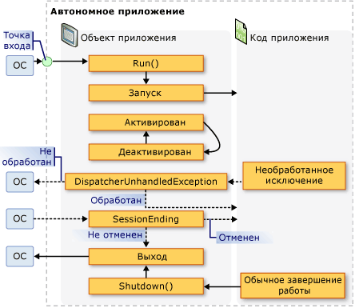
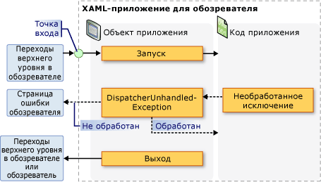

# <a name="application-management-overview"></a>Общие сведения об управлении приложением
Все приложения имеют тенденцию совместно использовать общий набор функциональных возможностей, который применяется к реализации приложения и управлению им. В этом разделе представлен обзор функциональных возможностей в <xref:System.Windows.Application> класс для создания и управления приложениями.  

## <a name="the-application-class"></a>Класс Application  
 В WPF, функциональные возможности области определения приложения инкапсулируются в <xref:System.Windows.Application> класса. <xref:System.Windows.Application> Класс включает в себя следующие функциональные возможности:  
  
-   отслеживание и взаимодействие со временем существования приложения;  
  
-   извлечение и обработка параметров командной строки;  
  
-   обнаружение необработанных исключений и реагирование на них;  
  
-   совместное использование свойств области определения приложения и ресурсов;  
  
-   управление окнами в автономных приложениях;  
  
-   отслеживание навигации и управление ею.  
  
<a name="The_Application_Class"></a>   
## <a name="how-to-perform-common-tasks-using-the-application-class"></a>Выполнение стандартных задач с помощью класса приложения  
 Если вы не интересуют все аспекты <xref:System.Windows.Application> класса, в следующей таблице перечислены некоторые из наиболее распространенных задач <xref:System.Windows.Application> и способах их выполнения. Чтобы получить дополнительные сведения и образец кода, просмотрите связанные API и разделы.  
  
|Задача|Подход|  
|----------|--------------|  
|Получение объекта, представляющего текущее приложение|Используйте свойство <xref:System.Windows.Application.Current%2A?displayProperty=nameWithType>.|  
|Добавление заставки в приложение|См. в разделе [Добавление в WPF-приложение экрана-заставки](how-to-add-a-splash-screen-to-a-wpf-application.md).|  
|Запуск приложения|Воспользуйтесь методом <xref:System.Windows.Application.Run%2A?displayProperty=nameWithType>.|  
|Остановка приложения|Используйте <xref:System.Windows.Application.Shutdown%2A> метод <xref:System.Windows.Application.Current%2A?displayProperty=nameWithType> объекта.|  
|Получение аргументов из командной строки|Обрабатывать <xref:System.Windows.Application.Startup?displayProperty=nameWithType> и использовать <xref:System.Windows.StartupEventArgs.Args%2A?displayProperty=nameWithType> свойство. Например, см. в разделе <xref:System.Windows.Application.Startup?displayProperty=nameWithType> событий.|  
|Получение и задание кода завершения приложения|Задайте <xref:System.Windows.ExitEventArgs.ApplicationExitCode%2A?displayProperty=nameWithType> свойство в <xref:System.Windows.Application.Exit?displayProperty=nameWithType> обработчик событий или вызова <xref:System.Windows.Application.Shutdown%2A> метод и передайте целое число.|  
|Обнаружение необработанных исключений и реагирование на них|Обрабатывать <xref:System.Windows.Application.DispatcherUnhandledException> событий.|  
|Получение и задание ресурсов области определения приложения|Используйте свойство <xref:System.Windows.Application.Resources%2A?displayProperty=nameWithType>.|  
|Использование словаря ресурсов области определения приложения|См. в разделе [использование словаря ресурсов области определения приложения](how-to-use-an-application-scope-resource-dictionary.md).|  
|Получение и задание свойств области определения приложения|Используйте свойство <xref:System.Windows.Application.Properties%2A?displayProperty=nameWithType>.|  
|Получение и сохранение состояния приложения|См. в разделе [сохранение и восстановление свойств области определения приложения в сеансах приложения](persist-and-restore-application-scope-properties.md).|  
|Управление файлами данных без кода, включая файлы ресурсов, файлы содержимого и файлы исходного сайта.|См. в разделе [ресурса приложения WPF, содержимое и файлы данных](wpf-application-resource-content-and-data-files.md).|  
|Управление окнами в автономных приложениях|См. раздел [Общие сведения об окнах WPF](wpf-windows-overview.md).|  
|Отслеживание навигации и управление ею|См. в разделе [Общие сведения о переходах](navigation-overview.md).|  
  
<a name="The_Application_Definition"></a>   
## <a name="the-application-definition"></a>Определение приложения  
 Чтобы использовать функциональные возможности <xref:System.Windows.Application> класса, необходимо реализовать определение приложения. Определение приложения WPF — это класс, производный от <xref:System.Windows.Application> и настраивается с помощью специальная настройка MSBuild.  

### <a name="implementing-an-application-definition"></a>Реализация определения приложения  
 Типичное определение приложения WPF реализуется с помощью разметки и кода. Это позволяет использовать разметку для декларативного задания свойств и ресурсов приложения и регистрации событий, а обработку событий и поведение приложения реализовывать в коде программной части.  
  
 В следующем примере показано, как реализовать определение приложения с помощью разметки и кода программной части:  
  
 [!code-xaml[ApplicationSnippets#ApplicationXAML](~/samples/snippets/csharp/VS_Snippets_Wpf/ApplicationSnippets/CSharp/App.xaml#applicationxaml)]  
  
 [!code-csharp[ApplicationSnippets#ApplicationCODEBEHIND](~/samples/snippets/csharp/VS_Snippets_Wpf/ApplicationSnippets/CSharp/App.xaml.cs#applicationcodebehind)]
 [!code-vb[ApplicationSnippets#ApplicationCODEBEHIND](~/samples/snippets/visualbasic/VS_Snippets_Wpf/ApplicationSnippets/visualbasic/application.xaml.vb#applicationcodebehind)]  
  
 Для совместной работы файла разметки и файла кода программной части должны выполняться указанные ниже условия.  
  
- В разметке `Application` элемент должен включать `x:Class` атрибута. При построении приложения существование `x:Class` в разметке файл вызывает MSBuild для создания `partial` класс, производный от <xref:System.Windows.Application> и имеет имя, которое задается параметром `x:Class` атрибута. Это требуется добавить объявление пространства имен XML для схемы XAML (`xmlns:x="http://schemas.microsoft.com/winfx/2006/xaml"`).
  
-   В коде программной части класс должен быть `partial` класс с тем же именем, который задается параметром `x:Class` атрибут в разметке и должен быть производным от <xref:System.Windows.Application>. Это позволяет файл кода должно быть связано с `partial` класса, созданного для файла разметки при построении приложения (см. в разделе [построение приложения WPF](building-a-wpf-application-wpf.md)).  
  
> [!NOTE]
>  При создании нового проекта приложения WPF или проекта приложения браузера WPF с помощью Visual Studio, определение приложения включается по умолчанию и определяется с помощью разметки и кода.  
  
 Этот код является минимумом, необходимым для реализации определения приложения. Однако на дополнительную конфигурацию MSBuild должен выполняться в определении приложения перед построением и запуском приложения.  
  
### <a name="configuring-the-application-definition-for-msbuild"></a>Настройка определения приложения для MSBuild  
 Автономные приложения и приложения браузера XAML (XBAP) требуют реализации инфраструктуры определенного уровня перед своим запуском. Наиболее важной частью этой инфраструктуры является точка входа. При запуске приложения пользователем операционная система вызывает точку входа, которая является известной функцией для запуска приложений.  
  
 Обычно разработчикам требовалось писать весь этот код или его часть самостоятельно в зависимости от технологии. Тем не менее, WPF создает этот код автоматически, при настройке файла разметки для определения приложения в качестве MSBuild `ApplicationDefinition` элемента, как показано в следующем файле проекта MSBuild:  
  
```xml  
<Project   
  DefaultTargets="Build"  
                        xmlns="http://schemas.microsoft.com/developer/msbuild/2003">  
  ...  
  <ApplicationDefinition Include="App.xaml" />  
  <Compile Include="App.xaml.cs" />  
  ...  
</Project>  
```  
  
 Так как файл кода содержит код, он помечается как MSBuild `Compile` элементов, что является нормальным.  
  
 Применение этих конфигураций MSBuild к файлам разметки и кода программной части определения приложения заставляет MSBuild для создания кода следующим образом:  
  
 [!code-csharp[auto-generated-code](~/samples/snippets/csharp/VS_Snippets_Wpf/AppDefAugSnippets/CSharp/App.cs)]
 [!code-vb[auto-generated-code](~/samples/snippets/visualbasic/VS_Snippets_Wpf/AppDefAugSnippets/VisualBasic/App.vb)]  
  
 Результирующий код дополняет ваше определение приложения кодом инфраструктуры, которая включает в себя метод точки входа `Main`. <xref:System.STAThreadAttribute> Атрибут применяется к `Main` метод, чтобы указать, что основной поток пользовательского интерфейса для приложения WPF является потоком STA, который необходим для приложений WPF. При вызове `Main` создает новый экземпляр класса `App` перед вызовом `InitializeComponent` метод для регистрации событий и задания свойств, реализованных в разметке. Так как `InitializeComponent` создается автоматически, не нужно явно вызывать `InitializeComponent` из определения приложения как для <xref:System.Windows.Controls.Page> и <xref:System.Windows.Window> реализаций. Наконец <xref:System.Windows.Application.Run%2A> метод вызывается для запуска приложения.  
  
<a name="Getting_the_Current_Application"></a>   
## <a name="getting-the-current-application"></a>Получение текущего приложения  
 Так как функциональные возможности <xref:System.Windows.Application> являются общими для всего приложения, может существовать только один экземпляр <xref:System.Windows.Application> класса на <xref:System.AppDomain>. Для применения этого, <xref:System.Windows.Application> класс реализован в виде singleton-класса (см. в разделе [Реализация Singleton в C# ](https://go.microsoft.com/fwlink/?LinkId=100567)), который создает один экземпляр себя и предоставляет общий доступ к нему с помощью `static`<xref:System.Windows.Application.Current%2A> свойство.  
  
 Ниже показано, как получить ссылку на <xref:System.Windows.Application> объект для текущего <xref:System.AppDomain>.  
  
 [!code-csharp[ApplicationManagementOverviewSnippets#GetCurrentAppCODE](~/samples/snippets/csharp/VS_Snippets_Wpf/ApplicationManagementOverviewSnippets/CSharp/MainWindow.xaml.cs#getcurrentappcode)]
 [!code-vb[ApplicationManagementOverviewSnippets#GetCurrentAppCODE](~/samples/snippets/visualbasic/VS_Snippets_Wpf/ApplicationManagementOverviewSnippets/VisualBasic/MainWindow.xaml.vb#getcurrentappcode)]  
  
 <xref:System.Windows.Application.Current%2A> Возвращает ссылку на экземпляр <xref:System.Windows.Application> класса. Если требуется ссылка на вашей <xref:System.Windows.Application> производного класса, необходимо привести значение <xref:System.Windows.Application.Current%2A> свойства, как показано в следующем примере.  
  
 [!code-csharp[ApplicationManagementOverviewSnippets#GetSTCurrentAppCODE](~/samples/snippets/csharp/VS_Snippets_Wpf/ApplicationManagementOverviewSnippets/CSharp/MainWindow.xaml.cs#getstcurrentappcode)]
 [!code-vb[ApplicationManagementOverviewSnippets#GetSTCurrentAppCODE](~/samples/snippets/visualbasic/VS_Snippets_Wpf/ApplicationManagementOverviewSnippets/VisualBasic/MainWindow.xaml.vb#getstcurrentappcode)]  
  
 Вы можете проверить значение <xref:System.Windows.Application.Current%2A> в любой момент времени существования <xref:System.Windows.Application> объекта. Однако следует соблюдать осторожность. После <xref:System.Windows.Application> создается экземпляр класса, в течение во время которого состояние <xref:System.Windows.Application> непредсказуемо. В течение этого периода <xref:System.Windows.Application> выполняет различные задачи инициализации, необходимые в коде для выполнения, включая установку инфраструктуры приложения, настройку свойств и регистрацию событий. Если вы попытаетесь использовать <xref:System.Windows.Application> объекта в течение этого периода, код может иметь непредвиденные результаты, особенно в том случае, если он зависит от различных <xref:System.Windows.Application> задаваемые свойства.  
  
 Когда <xref:System.Windows.Application> завершает свою работу инициализации, начинается его время существования.  
  
<a name="Application_Lifetime"></a>   
## <a name="application-lifetime"></a>Время существования приложения  
 Время существования приложения WPF отмечается несколько событий, вызываемых <xref:System.Windows.Application> сообщить вам о был начат приложения, активировано, деактивации и завершает работу.  

<a name="Splash_Screen"></a>   
### <a name="splash-screen"></a>Заставка  
 Начиная с версии [!INCLUDE[net_v35SP1_short](../../../../includes/net-v35sp1-short-md.md)], можно указать изображение, которое может использоваться в заставке или *экран-заставка*. <xref:System.Windows.SplashScreen> Класс позволяет легко отобразить заставку во время загрузки приложения. <xref:System.Windows.SplashScreen> Окно создается и отображается перед <xref:System.Windows.Application.Run%2A> вызывается. Дополнительные сведения см. в разделе [время запуска приложения](../advanced/application-startup-time.md) и [Добавление в WPF-приложение экрана-заставки](how-to-add-a-splash-screen-to-a-wpf-application.md).  
  
<a name="Starting_an_Application"></a>   
### <a name="starting-an-application"></a>Запуск приложения  
 После <xref:System.Windows.Application.Run%2A> вызывается и инициализации приложения, оно будет готово к запуску. Этот момент обозначается при <xref:System.Windows.Application.Startup> события:  
  
[!code-csharp[Startup-event](~/samples/snippets/csharp/VS_Snippets_Wpf/ApplicationStartupSnippets/CSharp/App.xaml.cs?range=3-11,31-33)]
[!code-vb[Startup-event](~/samples/snippets/visualbasic/VS_Snippets_Wpf/ApplicationStartupSnippets/visualbasic/application.xaml.vb?range=5-11,30-32)]
  
 На этом этапе в жизни приложения, наиболее распространенный способ — показать пользовательский Интерфейс.  
  
<a name="Showing_a_User_Interface"></a>
### <a name="showing-a-user-interface"></a>Отображение пользовательского интерфейса  
 Большинство автономных приложений Windows откройте <xref:System.Windows.Window> когда начинается выполнение. <xref:System.Windows.Application.Startup> Обработчик событий — в одном месте, откуда это можно сделать, как показано в следующем примере кода.  
  
 [!code-xaml[AppShowWindowHardSnippets#StartupEventMARKUP](~/samples/snippets/csharp/VS_Snippets_Wpf/AppShowWindowHardSnippets/CSharp/App.xaml#startupeventmarkup)]  
  
 [!code-csharp[AppShowWindowHardSnippets#StartupEventCODEBEHIND](~/samples/snippets/csharp/VS_Snippets_Wpf/AppShowWindowHardSnippets/CSharp/App.xaml.cs#startupeventcodebehind)]
 [!code-vb[AppShowWindowHardSnippets#StartupEventCODEBEHIND](~/samples/snippets/visualbasic/VS_Snippets_Wpf/AppShowWindowHardSnippets/VisualBasic/Application.xaml.vb#startupeventcodebehind)]  
  
> [!NOTE]
>  Первый <xref:System.Windows.Window> для реализации в автономное приложение становится главного окна приложения по умолчанию. Это <xref:System.Windows.Window> объект ссылается <xref:System.Windows.Application.MainWindow%2A?displayProperty=nameWithType> свойство. Значение <xref:System.Windows.Application.MainWindow%2A> свойство может быть изменено программными средствами, если другое окно первый экземпляр <xref:System.Windows.Window> должно быть главного окна.  
  
 При первом запуске приложение XBAP, он скорее всего, чтобы перейти <xref:System.Windows.Controls.Page>. Это показано в приведенном ниже коде.  
  
 [!code-xaml[XBAPAppStartupSnippets#StartupXBAPMARKUP](~/samples/snippets/csharp/VS_Snippets_Wpf/XBAPAppStartupSnippets/CSharp/App.xaml#startupxbapmarkup)]  
  
 [!code-csharp[XBAPAppStartupSnippets#StartupXBAPCODEBEHIND](~/samples/snippets/csharp/VS_Snippets_Wpf/XBAPAppStartupSnippets/CSharp/App.xaml.cs#startupxbapcodebehind)]
 [!code-vb[XBAPAppStartupSnippets#StartupXBAPCODEBEHIND](~/samples/snippets/visualbasic/VS_Snippets_Wpf/XBAPAppStartupSnippets/VisualBasic/Application.xaml.vb#startupxbapcodebehind)]  
  
 Если вы обрабатываете <xref:System.Windows.Application.Startup> открывать только <xref:System.Windows.Window> или перейдите к <xref:System.Windows.Controls.Page>, можно задать `StartupUri` атрибут в разметке.  
  
 В следующем примере показано, как использовать <xref:System.Windows.Application.StartupUri%2A> из отдельного приложения, чтобы открыть <xref:System.Windows.Window>.  
  
 [!code-xaml[ApplicationManagementOverviewSnippets#OverviewStartupUriMARKUP](~/samples/snippets/csharp/VS_Snippets_Wpf/ApplicationManagementOverviewSnippets/CSharp/App.xaml#overviewstartupurimarkup)]  
  
 В следующем примере показано, как использовать <xref:System.Windows.Application.StartupUri%2A> из XBAP, чтобы перейти к <xref:System.Windows.Controls.Page>.  
  
 [!code-xaml[PageSnippets#XBAPStartupUriMARKUP](~/samples/snippets/csharp/VS_Snippets_Wpf/PageSnippets/CSharp/App.xaml#xbapstartupurimarkup)]  
  
 Эта разметка действует так же, как и предыдущий код для открытия окна.  
  
> [!NOTE]
>  Дополнительные сведения о навигации, см. в разделе [Общие сведения о переходах](navigation-overview.md).  
  
 Вам нужно обрабатывать <xref:System.Windows.Application.Startup> событие, чтобы открыть <xref:System.Windows.Window> необходимо создать его с помощью конструктора не по умолчанию, необходимо задать его свойства либо подписаться на его события перед его отображением или вам необходимо обработать любые аргументы командной строки, были заданы при запуске приложения.  
  
<a name="Processing_Command_Line_Arguments"></a>   
### <a name="processing-command-line-arguments"></a>Обработка аргументов командной строки  
 В Windows автономные приложения можно запустить из командной строки или с рабочего стола. В обоих случаях аргументы командной строки могут быть переданы приложению. В приведенном ниже примере показано приложение, которое запускается с одним аргументом командной строки /StartMinimized:  
  
 `wpfapplication.exe /StartMinimized`  
  
 Во время инициализации приложения WPF, Получает аргументы командной строки из операционной системы и передает их <xref:System.Windows.Application.Startup> обработчик событий через <xref:System.Windows.StartupEventArgs.Args%2A> свойство <xref:System.Windows.StartupEventArgs> параметр. Аргументы командной строки можно извлечь и сохранить с помощью приведенного ниже кода.  
  
 [!code-xaml[ApplicationStartupSnippets#HandleStartupXAML](~/samples/snippets/csharp/VS_Snippets_Wpf/ApplicationStartupSnippets/CSharp/App.xaml#handlestartupxaml)]  
  
 [!code-csharp[ApplicationStartupSnippets#HandleStartupCODEBEHIND](~/samples/snippets/csharp/VS_Snippets_Wpf/ApplicationStartupSnippets/CSharp/App.xaml.cs#handlestartupcodebehind)]
 [!code-vb[ApplicationStartupSnippets#HandleStartupCODEBEHIND](~/samples/snippets/visualbasic/VS_Snippets_Wpf/ApplicationStartupSnippets/visualbasic/application.xaml.vb#handlestartupcodebehind)]  
  
 Код обрабатывает <xref:System.Windows.Application.Startup> проверяемый ли **/StartMinimized** аргумент командной строки; Если Да, он открывает главное окно с <xref:System.Windows.WindowState> из <xref:System.Windows.WindowState.Minimized>. Обратите внимание, что поскольку <xref:System.Windows.Window.WindowState%2A> свойства необходимо задать значение программно, основной <xref:System.Windows.Window> должен быть явным образом открыто в коде.  
  
 XBAP-приложения не может получить и обработать аргументы командной строки, так как они запускаются с помощью развертывания ClickOnce (см. в разделе [развертывание приложений WPF](deploying-a-wpf-application-wpf.md)). Однако они могут извлекать и обрабатывать строковые параметры запроса из URL-адресов, которые используются для их запуска.  
  
<a name="Application_Activation_and_Deactivation"></a>   
### <a name="application-activation-and-deactivation"></a>Активация и отключение приложения  
 Windows позволяет пользователям переключаться между приложениями. Наиболее простой способ — использовать клавиши ALT+TAB. Приложения можно переключить только в том случае, если оно содержит видимое <xref:System.Windows.Window> , пользователь может выбрать. Выбранного в данный момент <xref:System.Windows.Window> — *активного окна* (также известный как *окно переднего плана*) и является <xref:System.Windows.Window> , получающий ввод данных пользователем. Приложение с активным окном является *активное приложение* (или *приложения переднего плана*). Приложение становится активным в указанных ниже случаях.  
  
-   Оно запускается и отображает <xref:System.Windows.Window>.  
  
-   Пользователь переключается из другого приложения, выбрав <xref:System.Windows.Window> в приложении.  
  
 Вы может определить, когда приложение активируется при обработке <xref:System.Windows.Application.Activated?displayProperty=nameWithType> событий.  
  
 Аналогичным образом приложение может стать неактивным в указанных ниже случаях.  
  
-   Пользователь переключается на другое приложение из текущего.  
  
-   Приложение завершает работу.  
  
 Можно обнаружить, когда приложение становится неактивным, обрабатывая <xref:System.Windows.Application.Deactivated?displayProperty=nameWithType> событий.  
  
 Ниже показано, как обрабатывать <xref:System.Windows.Application.Activated> и <xref:System.Windows.Application.Deactivated> событий, чтобы определить, активно ли приложение.  
  
 [!code-xaml[ApplicationActivationSnippets#DetectActivationStateXAML](~/samples/snippets/csharp/VS_Snippets_Wpf/ApplicationActivationSnippets/CSharp/App.xaml#detectactivationstatexaml)]  
  
 [!code-csharp[ApplicationActivationSnippets#DetectActivationStateCODEBEHIND](~/samples/snippets/csharp/VS_Snippets_Wpf/ApplicationActivationSnippets/CSharp/App.xaml.cs#detectactivationstatecodebehind)]
 [!code-vb[ApplicationActivationSnippets#DetectActivationStateCODEBEHIND](~/samples/snippets/visualbasic/VS_Snippets_Wpf/ApplicationActivationSnippets/visualbasic/application.xaml.vb#detectactivationstatecodebehind)]  
  
 Объект <xref:System.Windows.Window> также можно активировать и деактивировать. Дополнительные сведения см. в разделах <xref:System.Windows.Window.Activated?displayProperty=nameWithType> и <xref:System.Windows.Window.Deactivated?displayProperty=nameWithType>.  
  
> [!NOTE]
>  Ни <xref:System.Windows.Application.Activated?displayProperty=nameWithType> , ни <xref:System.Windows.Application.Deactivated?displayProperty=nameWithType> вызывается для XBAP.  
  
<a name="Application_Shutdown"></a>   
### <a name="application-shutdown"></a>Завершение работы приложения  
 Время существования приложения заканчивается, когда оно завершает работу, что может возникнуть по указанным ниже причинам.  
  
-   Пользователь закрывает каждый <xref:System.Windows.Window>.  
  
-   Пользователь закрывает главное <xref:System.Windows.Window>.  
  
-   Пользователь завершает сеанс Windows, системы или завершая.  
  
-   Выполнено специальное условие для приложения.  
  
 Чтобы помочь в управлении завершением работы приложения, <xref:System.Windows.Application> предоставляет <xref:System.Windows.Application.Shutdown%2A> метод, <xref:System.Windows.Application.ShutdownMode%2A> свойство и <xref:System.Windows.Application.SessionEnding> и <xref:System.Windows.Application.Exit> события.  
  
> [!NOTE]
>  <xref:System.Windows.Application.Shutdown%2A> может вызываться только из приложений, имеющих <xref:System.Security.Permissions.UIPermission>. WPF автономных приложений всегда есть это разрешение. Тем не менее XBAP-приложения в песочнице с частичным доверием безопасности зоны Интернета не завершает работу.  
  
#### <a name="shutdown-mode"></a>Режим завершения работы  
 Большинство приложений завершают работу при закрытии главного окна или всех окон. Иногда, однако, другие условия конкретного приложения могут определить, когда приложение завершает работу. Можно указать условия, при которых приложение завершит работу, задав <xref:System.Windows.Application.ShutdownMode%2A> с одним из следующих <xref:System.Windows.ShutdownMode> значений перечисления:  
  
-   <xref:System.Windows.ShutdownMode.OnLastWindowClose>  
  
-   <xref:System.Windows.ShutdownMode.OnMainWindowClose>  
  
-   <xref:System.Windows.ShutdownMode.OnExplicitShutdown>  
  
 Значение по умолчанию <xref:System.Windows.Application.ShutdownMode%2A> является <xref:System.Windows.ShutdownMode.OnLastWindowClose>, что означает, что приложение автоматически завершает работу при закрытии пользователем последнего окна в приложении. Тем не менее, если приложение должно завершить работу при закрытии главного окна, WPF автоматически делает это, если задать <xref:System.Windows.Application.ShutdownMode%2A> для <xref:System.Windows.ShutdownMode.OnMainWindowClose>. Эти действия показаны в следующем примере.  
  
 [!code-xaml[ApplicationShutdownModeSnippets#OnMainWindowCloseMARKUP](~/samples/snippets/csharp/VS_Snippets_Wpf/ApplicationShutdownModeSnippets/CS/Page1.xaml#onmainwindowclosemarkup)]  
  
 При наличии условия завершения работы приложения, следует установить <xref:System.Windows.Application.ShutdownMode%2A> для <xref:System.Windows.ShutdownMode.OnExplicitShutdown>. В данном случае это необходимо завершить работу приложения путем явного вызова <xref:System.Windows.Application.Shutdown%2A> метода; в противном случае приложение будет продолжать, даже если закрыты все окна. Обратите внимание, что <xref:System.Windows.Application.Shutdown%2A> вызывается неявно при <xref:System.Windows.Application.ShutdownMode%2A> либо <xref:System.Windows.ShutdownMode.OnLastWindowClose> или <xref:System.Windows.ShutdownMode.OnMainWindowClose>.  
  
> [!NOTE]
>  <xref:System.Windows.Application.ShutdownMode%2A> можно задать из XBAP, но он учитывается; приложение XBAP всегда завершает работу при его переходе в браузере или при закрытии браузера, на котором размещается приложение XBAP. Дополнительные сведения см. в разделе [Общие сведения о переходах](navigation-overview.md).  
  
#### <a name="session-ending"></a>Завершение сеанса  
 Условия завершения работы, описываемым <xref:System.Windows.Application.ShutdownMode%2A> свойства зависят от конкретного приложения. Однако в некоторых случаях приложение может завершить работу в результате выполнения внешнего условия. Наиболее обычное внешнее условие возникает, когда пользователь завершает сеанс Windows при выполнении следующих действий:  
  
-   выход из системы;  
  
-   завершение работы;  
  
-   перезапуск;  
  
-   спящий режим.  
  
 Чтобы обнаружить при завершении сеанса Windows, можно обрабатывать <xref:System.Windows.Application.SessionEnding> событий, как показано в следующем примере.  
  
 [!code-xaml[ApplicationSessionEndingSnippets#HandlingSessionEndingXAML](~/samples/snippets/csharp/VS_Snippets_Wpf/ApplicationSessionEndingSnippets/CSharp/App.xaml#handlingsessionendingxaml)]  
  
 [!code-csharp[ApplicationSessionEndingSnippets#HandlingSessionEndingCODEBEHIND](~/samples/snippets/csharp/VS_Snippets_Wpf/ApplicationSessionEndingSnippets/CSharp/App.xaml.cs#handlingsessionendingcodebehind)]
 [!code-vb[ApplicationSessionEndingSnippets#HandlingSessionEndingCODEBEHIND](~/samples/snippets/visualbasic/VS_Snippets_Wpf/ApplicationSessionEndingSnippets/visualbasic/application.xaml.vb#handlingsessionendingcodebehind)]  
  
 В этом примере код проверяет <xref:System.Windows.SessionEndingCancelEventArgs.ReasonSessionEnding%2A> свойства, чтобы определить способ окончания сеанса Windows. Он использует это значение, чтобы отобразить сообщение подтверждения для пользователя. Если пользователю не нужно завершать сеанс, код задает <xref:System.ComponentModel.CancelEventArgs.Cancel%2A> для `true` чтобы запретить завершение сеанса Windows.  
  
> [!NOTE]
>  <xref:System.Windows.Application.SessionEnding> вызывается для XBAP.

#### <a name="exit"></a>Exit  
 При завершении работы приложения может возникнуть необходимость выполнить окончательную обработку, например сохранение состояния приложения. В подобных случаях можно обрабатывать <xref:System.Windows.Application.Exit> событий, как `App_Exit` обработчик события выполняет в следующем примере. Он определен в качестве обработчика событий в *App.xaml* файл. Его реализация выделяется в *App.xaml.cs* и *Application.xaml.vb* файлов.
  
[!code-xaml[Defining-the-Exit-event-handler](~/samples/snippets/csharp/VS_Snippets_Wpf/HOWTOApplicationModelSnippets/CSharp/App.xaml?highlight=1-7)]  
  
 [!code-csharp[Handling-the-Exit-event](~/samples/snippets/csharp/VS_Snippets_Wpf/HOWTOApplicationModelSnippets/CSharp/App.xaml.cs?highlight=42-55)]
 [!code-vb[Handling-the-Exit-event](~/samples/snippets/visualbasic/VS_Snippets_Wpf/HOWTOApplicationModelSnippets/visualbasic/application.xaml.vb?highlight=34-45)]  
  
 Полный пример см. в разделе [сохранение и восстановление области определения приложения свойства в сеансах приложения](persist-and-restore-application-scope-properties.md).  
  
 <xref:System.Windows.Application.Exit> может обрабатываться автономными приложениями и XBAP-приложения. Для приложения XBAP <xref:System.Windows.Application.Exit> вызывается в следующих случаях:  
  
-   Приложение XBAP будет выполнен переход от.  
  
-   В [!INCLUDE[TLA2#tla_ie7](../../../../includes/tla2sharptla-ie7-md.md)], при закрытии вкладки, на котором размещается приложение XBAP.  
  
-   Закрывается браузер.  
  
#### <a name="exit-code"></a>Код выхода  
 Приложения, как правило, запускаются операционной системой в ответ на запрос пользователя. Однако приложение может быть запущено другим приложением для выполнения определенной задачи. При завершении работы запущенного приложения приложению, которое его запустило, может понадобиться выяснить условие, при котором запущенное приложение завершает работу. В таких ситуациях Windows позволяет приложениям вернуть код выхода приложения при завершении работы. По умолчанию для приложений WPF возвращают значение кода выхода 0.  
  
> [!NOTE]
>  При отладке из Visual Studio, код выхода приложения отображается в **вывода** окно, когда приложение завершает работу, в сообщении, выглядит следующим образом:  
>   
>  `The program '[5340] AWPFApp.vshost.exe: Managed' has exited with code 0 (0x0).`  
>   
>  При открытии **вывода** окно, нажав кнопку **выходные данные** на **представление** меню.  
  
 Чтобы изменить код выхода, вы можете вызвать <xref:System.Windows.Application.Shutdown%28System.Int32%29> перегрузки, который принимает целочисленный аргумент для кода выхода:  
  
 [!code-csharp[ApplicationExitSnippets#AppExitCODE](~/samples/snippets/csharp/VS_Snippets_Wpf/ApplicationExitSnippets/CSharp/MainWindow.xaml.cs#appexitcode)]
 [!code-vb[ApplicationExitSnippets#AppExitCODE](~/samples/snippets/visualbasic/VS_Snippets_Wpf/ApplicationExitSnippets/visualbasic/mainwindow.xaml.vb#appexitcode)]  
  
 Можно определить значение кода выхода и изменить его, обработав <xref:System.Windows.Application.Exit> событий. <xref:System.Windows.Application.Exit> Обработчику события передаются <xref:System.Windows.ExitEventArgs> который обеспечивает доступ к коду выхода с <xref:System.Windows.ExitEventArgs.ApplicationExitCode%2A> свойство. Дополнительные сведения см. в разделе <xref:System.Windows.Application.Exit>.  
  
> [!NOTE]
>  Можно задать код выхода в автономных приложениях и XBAP-приложения. Однако значение кода выхода игнорируется для XBAP.  
  
<a name="Unhandled_Exceptions"></a>   
### <a name="unhandled-exceptions"></a>Необработанные исключения  
 Иногда приложение может завершить работу из-за неправильного состояния, например когда создается непредвиденное исключение. В этом случае в приложении может не быть кода для обнаружения и обработки исключения. Исключение такого типа является необработанным. Перед закрытием приложения выводится уведомление, похожее на показанное на рисунке ниже.  
  
   
  
 С точки зрения работы пользователя такое поведение приложения по умолчанию лучше переопределить, выполнив некоторые или все следующие действия:  
  
-   отображение понятных для пользователя сведений;  
  
-   попытка продолжить выполнение приложения;  
  
-   Запись подробных, понятных разработчику особых сведений в журнале событий Windows.  
  
 Реализация этой поддержки зависит от возможности обнаружить необработанные исключения, который является то, что <xref:System.Windows.Application.DispatcherUnhandledException> для события.  
  
[!code-xaml[detecting-unhandled-exceptions](~/samples/snippets/csharp/VS_Snippets_Wpf/ApplicationDispatcherUnhandledExceptionSnippets/CSharp/App.xaml#handledispatcherunhandledexceptionxaml)]  
  
[!code-csharp[code-to-detect-unhandled-exceptions](~/samples/snippets/csharp/VS_Snippets_Wpf/ApplicationDispatcherUnhandledExceptionSnippets/CSharp/App.xaml.cs)]
[!code-vb[code-to-detect-unhandled-exceptions](~/samples/snippets/visualbasic/VS_Snippets_Wpf/ApplicationDispatcherUnhandledExceptionSnippets/visualbasic/application.xaml.vb)]  
  
 <xref:System.Windows.Application.DispatcherUnhandledException> Обработчику события передаются <xref:System.Windows.Threading.DispatcherUnhandledExceptionEventArgs> параметр, содержащий контекстные сведения, касающиеся необработанного исключения, включая само исключение (<xref:System.Windows.Threading.DispatcherUnhandledExceptionEventArgs.Exception%2A?displayProperty=nameWithType>). Эту информацию можно использовать для определения способа обработки исключений.  
  
 При обработке <xref:System.Windows.Application.DispatcherUnhandledException>, следует задать <xref:System.Windows.Threading.DispatcherUnhandledExceptionEventArgs.Handled%2A?displayProperty=nameWithType> свойства `true`; в противном случае WPF по-прежнему рассматривает исключение как необработанное и возвращается к поведению по умолчанию, описанные ранее. Если возникает необработанное исключение и либо <xref:System.Windows.Application.DispatcherUnhandledException> событие не обрабатывается или событие обрабатывается и <xref:System.Windows.Threading.DispatcherUnhandledExceptionEventArgs.Handled%2A> присваивается `false`, приложение немедленно завершает работу. Кроме того никакие другие <xref:System.Windows.Application> событий. Следовательно, вам нужно обрабатывать <xref:System.Windows.Application.DispatcherUnhandledException> Если ваше приложение имеет код, который должен выполняться до завершения работы приложения.  
  
 Хотя приложение может завершить работу в результате возникновения необработанного исключения, приложение обычно завершает работу в ответ на запрос пользователя, как описано в следующем разделе.  
  
<a name="Application_Lifetime_Events"></a>   
### <a name="application-lifetime-events"></a>Событий приложения  
 Автономные приложения и приложения XBAP, не имеют точно одинакового времени жизни. На приведенном ниже рисунке продемонстрированы ключевые события времени существования автономного приложения и показана последовательность, в которой они создаются.  
  
   
  
 Аналогичным образом приведенном ниже рисунке продемонстрированы ключевые события времени существования XBAP и показана последовательность, в котором они вызываются.  
  
   
  
## <a name="see-also"></a>См. также

- <xref:System.Windows.Application>
- [Общие сведения об окнах WPF](wpf-windows-overview.md)
- [Общие сведения о переходах](navigation-overview.md)
- [Ресурсы, Содержимое и Файлы данных WPF-приложения](wpf-application-resource-content-and-data-files.md)
- [URI типа "pack" в WPF](pack-uris-in-wpf.md)
- [Модель приложения: Практические руководства](https://docs.microsoft.com/previous-versions/dotnet/netframework-4.0/ms749013(v=vs.100))
- [Разработка приложений](index.md)
