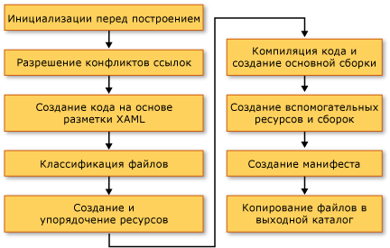

# <a name="building-a-wpf-application-wpf"></a>Построение приложения WPF

Приложения Windows Presentation Foundation (WPF) могут быть построены как .NET Framework исполняемые файлы (exe), библиотеки (. dll) или сочетание обоих типов сборок. В этом разделе даются вводные сведения для построения приложений [!INCLUDE[TLA2#tla_wpf](../../../../includes/tla2sharptla-wpf-md.md)] и описываются основные шаги процесса построения.

<a name="Building_a_WPF_Application_using_Command_Line"></a>

## <a name="building-a-wpf-application"></a>Построение приложения WPF

Приложения WPF можно компилировать следующими способами.

- Из командной строки. Приложение должно содержать только код (без XAML) и файл определения приложения. Дополнительные сведения см. в разделе [Построение из командной строки с помощью csc.exe](../../../csharp/language-reference/compiler-options/command-line-building-with-csc-exe.md) или [Построение из командной строки (Visual Basic)](../../../visual-basic/reference/command-line-compiler/building-from-the-command-line.md).

- С помощью Microsoft Build Engine (MSBuild). Помимо кода и файлов XAML приложение должно содержать файл проекта MSBuild. Дополнительные сведения см. в разделе "MSBuild".

- Visual Studio. Visual Studio — это интегрированная среда разработки, которая компилирует приложения WPF с помощью MSBuild и включает визуальный конструктор для создания пользовательского интерфейса. Дополнительные сведения см. в статьях [Создание кода и управление им с помощью Visual Studio](/visualstudio/ide/index-writing-code) и [Разработка XAML в Visual Studio](/visualstudio/xaml-tools/designing-xaml-in-visual-studio).

<a name="The_Windows_Presentation_Foundation_Build_Pipeline"></a>

## <a name="wpf-build-pipeline"></a>Конвейер сборки WPF

Когда выполняется сборка проекта [!INCLUDE[TLA2#tla_wpf](../../../../includes/tla2sharptla-wpf-md.md)], вызывается сочетание целевых объектов, специфичных для языка и [!INCLUDE[TLA2#tla_wpf](../../../../includes/tla2sharptla-wpf-md.md)]. Процесс выполнения этих целевых объектов называется конвейером сборки, и его ключевые шаги показаны на следующем рисунке.



<a name="Pre_Build_Initializations"></a>

### <a name="pre-build-initializations"></a>Инициализации перед сборкой

Перед сборкой MSBuild определяет расположение важных средств и библиотек, включая следующие:

- .NET Framework.

- Каталоги Windows SDK.

- Расположение ссылочных сборок [!INCLUDE[TLA2#tla_wpf](../../../../includes/tla2sharptla-wpf-md.md)].

- Свойство для путей поиска сборки.

Первое расположение, где MSBuild ищет сборки, — это каталог ссылочной сборки (%ProgramFiles%\Reference Assemblies\microsoft\framework\v3.0.\\). На этом шаге процесс сборки также инициализирует различные свойства и группы элементов и выполняет все необходимые действия по очистке.

<a name="Resolving_references"></a>

### <a name="resolving-references"></a>Разрешение ссылок

Процесс сборки находит и привязывает сборки, которые требуются для выполнения сборки проекта приложения. Эта логика содержится в задаче `ResolveAssemblyReference`. Все сборки, объявленные как `Reference` в файле проекта, предоставляются в задачу вместе с информацией о путях поиска и метаданными в сборках, уже установленных в системе. Задача ищет сборки и использует метаданные установленной сборки для фильтрации этих основных сборок [!INCLUDE[TLA2#tla_wpf](../../../../includes/tla2sharptla-wpf-md.md)], которые не должны отображаться в манифестах выходных данных. Это позволяет избежать избыточных сведений в манифесте ClickOnce. Например, поскольку PresentationFramework. dll может считаться репрезентативным для приложения, построенного на, и для [!INCLUDE[TLA2#tla_wpf](../../../../includes/tla2sharptla-wpf-md.md)] и более, так как все сборки [!INCLUDE[TLA2#tla_wpf](../../../../includes/tla2sharptla-wpf-md.md)] находятся в одном расположении на каждом компьютере с установленным .NET Framework, не нужно включать все сведения обо всех .NET Framework ссылок на сборки в манифестах.

<a name="Markup_Compilation___Pass_1"></a>

### <a name="markup-compilationpass-1"></a>Компиляция разметки — шаг 1

На этом шаге [!INCLUDE[TLA2#tla_xaml](../../../../includes/tla2sharptla-xaml-md.md)] файлы анализируются и компилируются, чтобы среда выполнения не тратила время на анализ XML и проверку значений свойств. Скомпилированный файл [!INCLUDE[TLA2#tla_xaml](../../../../includes/tla2sharptla-xaml-md.md)] заранее размечен, так что во время выполнения его загрузка происходит гораздо быстрее, чем загрузка файла [!INCLUDE[TLA2#tla_xaml](../../../../includes/tla2sharptla-xaml-md.md)].

На этом шаге для каждого файла [!INCLUDE[TLA2#tla_xaml](../../../../includes/tla2sharptla-xaml-md.md)], который является элементом сборки `Page`, выполняются следующие действия.

1. Файл [!INCLUDE[TLA2#tla_xaml](../../../../includes/tla2sharptla-xaml-md.md)] анализируется компилятором разметки.

2. Для этого [!INCLUDE[TLA2#tla_xaml](../../../../includes/tla2sharptla-xaml-md.md)] создается скомпилированное представление и копируется в папку obj\Release.

3. Создается представление CodeDOM нового разделяемого класса и копируется в папку obj\Release.

Кроме того, создается отдельный языковой файл кода для каждого файла [!INCLUDE[TLA2#tla_xaml](../../../../includes/tla2sharptla-xaml-md.md)]. Например, для страницы «страница кода. XAML» в проекте Visual Basic создается элемент «a. g. vb». для страницы "страница с. XAML" C# в проекте создается Page1.g.cs. ".g" в имени файла указывает, что это файл созданного кода, который имеет объявление разделяемого класса для элемента верхнего уровня файла разметки (например, `Page` или `Window`). Класс объявлен с модификатором `partial` в C# (`Extends` в Visual Basic), чтобы указать еще одно объявление для класса в другом расположении, обычно в файле кода программной части Page1.XAML.cs.

Разделяемый класс расширяется из соответствующего базового класса (например, <xref:System.Windows.Controls.Page> для страницы) и реализует интерфейс <xref:System.Windows.Markup.IComponentConnector?displayProperty=nameWithType>. Интерфейс <xref:System.Windows.Markup.IComponentConnector> имеет методы для инициализации компонента и подключения имен и событий к элементам в его содержимом. Следовательно, в созданном файле кода имеется реализация метода, подобная следующей:

```csharp
public void InitializeComponent() {
    if (_contentLoaded) {
        return;
    }
    _contentLoaded = true;
    System.Uri resourceLocater =
        new System.Uri(
            "window1.xaml",
            System.UriKind.RelativeOrAbsolute);
    System.Windows.Application.LoadComponent(this, resourceLocater);
}
```

```vb
Public Sub InitializeComponent() _

    If _contentLoaded Then
        Return
    End If

    _contentLoaded = True
    Dim resourceLocater As System.Uri = _
        New System.Uri("mainwindow.xaml", System.UriKind.Relative)

    System.Windows.Application.LoadComponent(Me, resourceLocater)

End Sub
```

По умолчанию компиляция разметки выполняется в том же <xref:System.AppDomain>, что и модуль MSBuild. Это обеспечивает значительный выигрыш в производительности. Это поведение можно переключать с помощью свойства `AlwaysCompileMarkupFilesInSeparateDomain`. Это имеет преимущество выгрузки всех ссылочных сборок путем выгрузки отдельных <xref:System.AppDomain>.

<a name="Pass_2_of_Markup_Compilation"></a>

### <a name="markup-compilationpass-2"></a>Компиляция разметки — шаг 2

Не все страницы [!INCLUDE[TLA2#tla_xaml](../../../../includes/tla2sharptla-xaml-md.md)] компилируются на шаге 1 компиляции разметки. Файлы [!INCLUDE[TLA2#tla_xaml](../../../../includes/tla2sharptla-xaml-md.md)], имеющие локально определенные ссылки на типы (ссылки на типы, определенные где-либо в коде того же проекта), исключаются из компиляции на этом шаге. Причина заключается в том, что эти локально определенные типы существуют только в источнике и еще не скомпилированы. Чтобы определить это, синтаксический анализатор использует эвристику, которая включает поиск элементов, таких как `x:Name`, в файле разметки. При обнаружении такого экземпляра компиляция этого файла разметки откладывается, пока не будут скомпилированы файлы кода, после чего второй этап компиляции разметки обрабатывает эти файлы.

<a name="File_Classification"></a>

### <a name="file-classification"></a>Классификация файлов

Процесс сборки помещает выходные файлы в различные группы ресурсов на основе того, в какую сборку приложения они будут помещены. В обычном нелокализованном приложении все файлы данных, отмеченные как `Resource`, помещаются в главную сборку (исполняемый файл или библиотеку). Когда в проекте задается `UICulture`, все скомпилированные файлы [!INCLUDE[TLA2#tla_xaml](../../../../includes/tla2sharptla-xaml-md.md)] и ресурсы, специально отмеченные как языковые, помещаются во вспомогательную сборку ресурсов. Кроме того, все независящие от языка ресурсы помещаются в главную сборку. На этом шаге процесса сборки принимается это решение.

Действия сборки `ApplicationDefinition`, `Page` и `Resource` в файле проекта могут быть дополнены метаданными `Localizable` (допустимые значения — `true` и `false`), которые определяют, зависит ли этот файл от языка.

<a name="Core_Compilation"></a>

### <a name="core-compilation"></a>Основная компиляция

На этапе основной компиляции выполняется компиляция файлов кода. Это управляется логикой в языковых файлах целей сборки Microsoft.CSharp.targets и Microsoft.VisualBasic.targets. Если эвристика определила, что первого этапа компилятора разметки достаточно, то создается главная сборка. Однако если один или несколько файлов [!INCLUDE[TLA2#tla_xaml](../../../../includes/tla2sharptla-xaml-md.md)] в проекте имеют ссылки на локально определенные типы, то создается временный DLL-файл, чтобы могли быть созданы окончательные сборки приложения по завершении второго этапа компиляции разметки.

<a name="Manifest_generation"></a>

### <a name="manifest-generation"></a>Создание манифеста

После завершения процесса сборки, после того как все сборки приложения и файлы содержимого будут готовы, создаются манифесты ClickOnce для приложения.

Файл манифеста развертывания описывает модель развертывания: текущую версию, поведение обновления и идентификатор издателя вместе с цифровой подписью. Этот манифест должен создаваться администраторами, управляющими развертыванием. Расширение файла —. XBAP (для приложений браузера XAML (XBAP)) и приложения для установленных приложений. Первое диктуется свойством проекта `HostInBrowser`, и в результате манифест идентифицирует приложение как браузерное.

Манифест приложения (файл .exe.manifest) описывает сборки приложения и зависимые библиотеки, а также перечисляет разрешения, необходимые для приложения. Этот файл должен быть создан разработчиком приложения. Чтобы запустить приложение ClickOnce, пользователь открывает файл манифеста развертывания приложения.

Эти файлы манифеста всегда создаются для XBAP. Для установленных приложений они не создаются, если в файле проекта не будет задано свойство `GenerateManifests` со значением `true`.

XBAP получают два дополнительных разрешения в отношении и выше этих разрешений, назначенных типичным приложениям зоны Интернета: <xref:System.Security.Permissions.WebBrowserPermission> и <xref:System.Security.Permissions.MediaPermission>. Система сборки [!INCLUDE[TLA2#tla_wpf](../../../../includes/tla2sharptla-wpf-md.md)] объявляет эти разрешения в манифесте приложения.

<a name="Incremental_Build_Support"></a>

## <a name="incremental-build-support"></a>Добавочная сборка

Система сборки [!INCLUDE[TLA2#tla_wpf](../../../../includes/tla2sharptla-wpf-md.md)] обеспечивает поддержку добавочных сборок. Она достаточно интеллектуально обнаруживает изменения, внесенные в разметку или код, и компилирует только те артефакты, на которые повлияло изменение. Механизм добавочной сборки использует следующие файлы.

- Файл $(*AssemblyName*)_MarkupCompiler.Cache для сохранения текущего состояния компилятора.

- Файл $(*AssemblyName*)_MarkupCompiler.lref для кэширования файлов [!INCLUDE[TLA2#tla_xaml](../../../../includes/tla2sharptla-xaml-md.md)] со ссылками на локально определенные типы.

Ниже приведен набор правил, управляющих добавочной сборкой.

- Файл — это наименьшая единица, в которой система сборки обнаруживает изменения. Таким образом, для файла кода система сборки не может узнать, был ли изменен тип или добавлен код. То же самое относится и к файлам проекта.

- Механизм добавочной сборки должен знать, что страница [!INCLUDE[TLA2#tla_xaml](../../../../includes/tla2sharptla-xaml-md.md)] либо определяет класс, либо использует другие классы.

- Если изменены записи `Reference`, то перекомпилируются все страницы.

- При изменении файла кода перекомпилируются все страницы с локально определенными ссылками типа.

- Если изменяется файл [!INCLUDE[TLA2#tla_xaml](../../../../includes/tla2sharptla-xaml-md.md)]:

  - [!INCLUDE[TLA2#tla_xaml](../../../../includes/tla2sharptla-xaml-md.md)] объявляется как `Page` в проекте: если [!INCLUDE[TLA2#tla_xaml](../../../../includes/tla2sharptla-xaml-md.md)] не имеет локально определенных ссылок на типы, перекомпилируется этот [!INCLUDE[TLA2#tla_xaml](../../../../includes/tla2sharptla-xaml-md.md)] плюс все страницы [!INCLUDE[TLA2#tla_xaml](../../../../includes/tla2sharptla-xaml-md.md)] с локальными ссылками; если [!INCLUDE[TLA2#tla_xaml](../../../../includes/tla2sharptla-xaml-md.md)] имеет локальные ссылки, перекомпилируются все страницы [!INCLUDE[TLA2#tla_xaml](../../../../includes/tla2sharptla-xaml-md.md)] с локальными ссылками.

  - Если [!INCLUDE[TLA2#tla_xaml](../../../../includes/tla2sharptla-xaml-md.md)] объявляется как `ApplicationDefinition` в проекте: перекомпилируются все [!INCLUDE[TLA2#tla_xaml](../../../../includes/tla2sharptla-xaml-md.md)] страницы (причина: каждый [!INCLUDE[TLA2#tla_xaml](../../../../includes/tla2sharptla-xaml-md.md)] имеет ссылку на тип <xref:System.Windows.Application>, который мог быть изменен).

- Если файл проекта объявляет файл кода как определение приложения вместо файла [!INCLUDE[TLA2#tla_xaml](../../../../includes/tla2sharptla-xaml-md.md)]:

  - Проверьте, изменилось ли значение `ApplicationClassName` в файле проекта (появился ли новый тип приложения). Если да, перекомпилируйте все приложение.

  - В противном случае перекомпилируйте все страницы [!INCLUDE[TLA2#tla_xaml](../../../../includes/tla2sharptla-xaml-md.md)] с локальными ссылками.

- При изменении файла проекта: примените все вышеперечисленные правила и посмотрите, что нужно перекомпилировать. Изменения следующих свойств приводят к полной перекомпиляции: `AssemblyName`, `IntermediateOutputPath`, `RootNamespace` и `HostInBrowser`.

Возможны следующие сценарии перекомпиляции.

- Перекомпилируется все приложение.

- Перекомпилируются только те файлы [!INCLUDE[TLA2#tla_xaml](../../../../includes/tla2sharptla-xaml-md.md)], в которых есть локально определенные ссылки типа.

- Ничего не перекомпилируется (если в проекте ничего не изменялось).

## <a name="see-also"></a>См. также

- [Развертывание приложений WPF](deploying-a-wpf-application-wpf.md)
- [Справочные сведения о WPF для MSBuild](/visualstudio/msbuild/wpf-msbuild-reference)
- [URI типа "pack" в WPF](pack-uris-in-wpf.md)
- [Файлы ресурсов, контента и данных WPF-приложения](wpf-application-resource-content-and-data-files.md)
