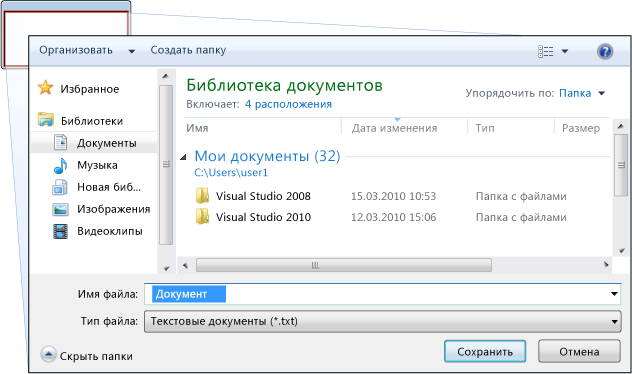
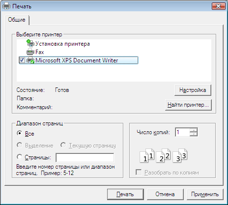
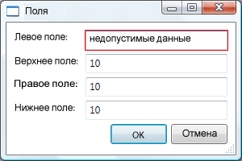
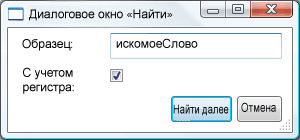

# Общие сведения о диалоговых окнахDialog Boxes Overview
Автономные приложения обычно имеют главного окна, что оба отображает основных данных, по которому приложение работает и предоставляет функциональные возможности для обработки этих данных через [!INCLUDE[TLA#tla_ui](../../../../includes/tlasharptla-ui-md.md)] механизмы, такие как строки меню, панелей инструментов и строки состояния.Standalone applications typically have a main window that both displays the main data over which the application operates and exposes the functionality to process that data through [!INCLUDE[TLA#tla_ui](../../../../includes/tlasharptla-ui-md.md)] mechanisms like menu bars, tool bars, and status bars. Нетривиальное приложение может также отображать дополнительные окна для следующих целей:A non-trivial application may also display additional windows to do the following:  
  
-   отображения определенных сведений для пользователей;Display specific information to users.  
  
-   сбора сведений от пользователей;Gather information from users.  
  
-   сбора и отображения сведений.Both display and gather information.  
  
 Эти типы windows называются *диалоговым окнам*, существует два типа: модальные и немодальные.These types of windows are known as *dialog boxes*, and there are two types: modal and modeless.  
  
 Объект *модального* диалоговое окно отображается функцией, когда она требует дополнительные данные от пользователя для продолжения.A *modal* dialog box is displayed by a function when the function needs additional data from a user to continue. Поскольку функция зависит от модального диалогового окна для сбора данных, это окно также не разрешает пользователю активизировать другие окна в приложении, пока остается открытым.Because the function depends on the modal dialog box to gather data, the modal dialog box also prevents a user from activating other windows in the application while it remains open. В большинстве случаев модального диалогового окна разрешает пользователю оповещать о завершении работы с помощью модального диалогового окна, либо нажав **ОК** или **отменить** кнопки.In most cases, a modal dialog box allows a user to signal when they have finished with the modal dialog box by pressing either an **OK** or **Cancel** button. Нажав клавишу **ОК** кнопка показывает, что пользователь ввел данные и желает, чтобы функция продолжить обработку данных.Pressing the **OK** button indicates that a user has entered data and wants the function to continue processing with that data. Нажав клавишу **отменить** кнопка показывает, что пользователь хочет остановить выполнение функции.Pressing the **Cancel** button indicates that a user wants to stop the function from executing altogether. Наиболее распространенными примерами модальных диалоговых окон являются окна, которые отображаются для открытия, сохранения и печати данных.The most common examples of modal dialog boxes are shown to open, save, and print data.  
  
 Объект *немодальное* диалоговое окно, с другой стороны, не запрещает пользователю активацию других окон, когда он открыт.A *modeless* dialog box, on the other hand, does not prevent a user from activating other windows while it is open. Например, если пользователь хочет найти вхождения конкретного слова в документе, главное окно часто открывает диалоговое окно с запросом слова для поиска.For example, if a user wants to find occurrences of a particular word in a document, a main window will often open a dialog box to ask a user what word they are looking for. Так как поиск слова не мешает пользователю редактировать документ, диалоговое окно не обязательно должно быть модальным.Since finding a word doesn't prevent a user from editing the document, however, the dialog box doesn't need to be modal. По крайней мере предоставляет немодального диалогового окна **закрыть** кнопку, чтобы закрыть диалоговое окно, а также может предоставлять дополнительные кнопки для выполнения отдельных функций, таких как **Найти далее** кнопку, чтобы найти Далее, word соответствует критерию поиска.A modeless dialog box at least provides a **Close** button to close the dialog box, and may provide additional buttons to execute specific functions, such as a **Find Next** button to find the next word that matches the find criteria of a word search.  
  
 Windows Presentation Foundation (WPF) позволяет создавать несколько типов диалоговых окон, включая окна сообщений, общие диалоговые окна и пользовательским диалоговым окнам.Windows Presentation Foundation (WPF) allows you to create several types of dialog boxes, including message boxes, common dialog boxes, and custom dialog boxes. В этом разделе обсуждаются каждой из них и [пример диалогового окна](http://go.microsoft.com/fwlink/?LinkID=159984) содержатся соответствующие примеры.This topic discusses each, and the [Dialog Box Sample](http://go.microsoft.com/fwlink/?LinkID=159984) provides matching examples.  
  
 
  
   
## Окна сообщенийMessage Boxes  
 Объект *окно сообщения* является диалоговым окном, которое можно использовать для отображения текстовых данных и разрешить пользователям принимать решения с помощью кнопок.A *message box* is a dialog box that can be used to display textual information and to allow users to make decisions with buttons. На следующем рисунке показано окно сообщения, в котором отображается текстовая информация, задается вопрос и предоставляются три кнопки для ответа на этот вопрос.The following figure shows a message box that displays textual information, asks a question, and provides the user with three buttons to answer the question.  
  
   
  
 Для создания окна сообщения, используйте <xref:System.Windows.MessageBox> класса.To create a message box, you use the <xref:System.Windows.MessageBox> class. <xref:System.Windows.MessageBox> позволяет настраивать текста окна сообщения, заголовок, значок и кнопки, с помощью следующего кода.<xref:System.Windows.MessageBox> lets you configure the message box text, title, icon, and buttons, using code like the following.  
  
 [!code-csharp[DialogBoxesOverviewSnippets#MsgBoxConfigureCODEBEHIND](../../../../samples/snippets/csharp/VS_Snippets_Wpf/DialogBoxesOverviewSnippets/CSharp/Window1.xaml.cs#msgboxconfigurecodebehind)]
 [!code-vb[DialogBoxesOverviewSnippets#MsgBoxConfigureCODEBEHIND](../../../../samples/snippets/visualbasic/VS_Snippets_Wpf/DialogBoxesOverviewSnippets/VisualBasic/window1.xaml.vb#msgboxconfigurecodebehind)]  
  
 Чтобы вывести на экран окно сообщения, вызовите `static` <xref:System.Windows.MessageBox.Show%2A> метода, как показано в следующем коде.To show a message box, you call the `static`<xref:System.Windows.MessageBox.Show%2A> method, as demonstrated in the following code.  
  
 [!code-csharp[DialogBoxesOverviewSnippets#MsgBoxShowCODEBEHIND](../../../../samples/snippets/csharp/VS_Snippets_Wpf/DialogBoxesOverviewSnippets/CSharp/Window1.xaml.cs#msgboxshowcodebehind)]
 [!code-vb[DialogBoxesOverviewSnippets#MsgBoxShowCODEBEHIND](../../../../samples/snippets/visualbasic/VS_Snippets_Wpf/DialogBoxesOverviewSnippets/VisualBasic/window1.xaml.vb#msgboxshowcodebehind)]  
  
 Когда коду, который показывает окно сообщения, нужно определить и обработать решение пользователя (какая кнопка была нажата), он может проверить результат окна сообщения, как показано в следующем коде.When code that shows a message box needs to detect and process the user's decision (which button was pressed), the code can inspect the message box result, as shown in the following code.  
  
 [!code-csharp[DialogBoxesOverviewSnippets#MsgBoxShowAndResultCODEBEHIND1](../../../../samples/snippets/csharp/VS_Snippets_Wpf/DialogBoxesOverviewSnippets/CSharp/Window1.xaml.cs#msgboxshowandresultcodebehind1)]
 [!code-vb[DialogBoxesOverviewSnippets#MsgBoxShowAndResultCODEBEHIND1](../../../../samples/snippets/visualbasic/VS_Snippets_Wpf/DialogBoxesOverviewSnippets/VisualBasic/window1.xaml.vb#msgboxshowandresultcodebehind1)]  
  
 Дополнительные сведения об использовании окон сообщений см. в разделе <xref:System.Windows.MessageBox>, [MessageBox образец](http://go.microsoft.com/fwlink/?LinkID=160023), и [пример диалогового окна](http://go.microsoft.com/fwlink/?LinkID=159984).For more information on using message boxes, see <xref:System.Windows.MessageBox>, [MessageBox Sample](http://go.microsoft.com/fwlink/?LinkID=160023), and [Dialog Box Sample](http://go.microsoft.com/fwlink/?LinkID=159984).  
  
 Несмотря на то что <xref:System.Windows.MessageBox> может предложить простого диалогового окна поле взаимодействия с пользователями, преимущество использования <xref:System.Windows.MessageBox> , является единственным типом окна, которое может быть отображено приложениями, выполняемыми в песочнице с частичным доверием (в разделе [безопасности](../../../../docs/framework/wpf/security-wpf.md)), такие как [!INCLUDE[TLA#tla_xbap#plural](../../../../includes/tlasharptla-xbapsharpplural-md.md)].Although <xref:System.Windows.MessageBox> may offer a simple dialog box user experience, the advantage of using <xref:System.Windows.MessageBox> is that is the only type of window that can be shown by applications that run within a partial trust security sandbox (see [Security](../../../../docs/framework/wpf/security-wpf.md)), such as [!INCLUDE[TLA#tla_xbap#plural](../../../../includes/tlasharptla-xbapsharpplural-md.md)].  
  
 Большинство диалоговых окон отображают и собирают более сложные данные, чем результат окна сообщения, в том числе текст, выбранные варианты (флажки), взаимоисключающий выбор (переключатели) и списки выбора (списки, поля со списком, поля с раскрывающимся списком).Most dialog boxes display and gather more complex data than the result of a message box, including text, selection (check boxes), mutually exclusive selection (radio buttons), and list selection (list boxes, combo boxes, drop-down list boxes). В этом случае Windows Presentation Foundation (WPF) предоставляет несколько общих диалоговых окон и позволяет создавать пользовательские диалоговые окна, хотя их использование ограничено приложениям, работающим с полным доверием.For these, Windows Presentation Foundation (WPF) provides several common dialog boxes and allows you to create your own dialog boxes, although the use of either is limited to applications running with full trust.  
  
   
## Общие диалоговые окнаCommon Dialog Boxes  
 [!INCLUDE[TLA#tla_mswin](../../../../includes/tlasharptla-mswin-md.md)] реализует различные, многократно используемые диалоговые окна, которые являются общими для всех приложений, включая диалоговые окна для открытия файлов, сохранения файлов и печати. implements a variety of reusable dialog boxes that are common to all applications, including dialog boxes for opening files, saving files, and printing. Поскольку эти диалоговые окна реализованы операционной системой, они могут совместно использоваться всеми приложениями, работающими в операционной системе, что помогает поддерживать единообразие пользовательского интерфейса; если пользователи знакомы с диалоговым окном, предоставляемым операционной системой в одном приложении, им не нужно учиться пользоваться этим диалоговым окном в других приложениях.Since these dialog boxes are implemented by the operating system, they can be shared among all the applications that run on the operating system, which helps user experience consistency; when users are familiar with the use of an operating system-provided dialog box in one application, they don't need to learn how to use that dialog box in other applications. Так как этим диалоговым окнам, доступны для всех приложений и обеспечивают целостное взаимодействие с пользователем, они называются *общие диалоговые окна*.Because these dialog boxes are available to all applications and because they help provide a consistent user experience, they are known as *common dialog boxes*.  
  
 Windows Presentation Foundation (WPF) инкапсулирует открыть файл, сохраните файл, печать общие диалоговые окна и предоставляет их как управляемые классы для использования в автономных приложений.Windows Presentation Foundation (WPF) encapsulates the open file, save file, and print common dialog boxes and exposes them as managed classes for you to use in standalone applications. В этом разделе приводится краткий обзор каждого типа диалоговых окон.This topic provides a brief overview of each.  
  
   
### Диалоговое окно открытия файловOpen File Dialog  
 Диалоговое окно открытия файлов, показанное на следующем рисунке, используется функциональностью открытия файла для получения имени открываемого файла.The open file dialog box, shown in the following figure, is used by file opening functionality to retrieve the name of a file to open.  
  
   
  
 Стандартным диалоговым окном открытия реализуется в виде <xref:Microsoft.Win32.OpenFileDialog> класса и находится в папке <xref:Microsoft.Win32> пространства имен.The common open file dialog box is implemented as the <xref:Microsoft.Win32.OpenFileDialog> class and is located in the <xref:Microsoft.Win32> namespace. Следующий код показывает, как создавать, настраивать и отображать такое окно, а также как обрабатывать результат.The following code shows how to create, configure, and show one, and how to process the result.  
  
 [!code-csharp[DialogBoxesOverviewSnippets#OpenFileDialogBoxCODEBEHIND](../../../../samples/snippets/csharp/VS_Snippets_Wpf/DialogBoxesOverviewSnippets/CSharp/Window1.xaml.cs#openfiledialogboxcodebehind)]
 [!code-vb[DialogBoxesOverviewSnippets#OpenFileDialogBoxCODEBEHIND](../../../../samples/snippets/visualbasic/VS_Snippets_Wpf/DialogBoxesOverviewSnippets/VisualBasic/window1.xaml.vb#openfiledialogboxcodebehind)]  
  
 Дополнительные сведения о диалоговом окне Открытие файла см. в разделе <xref:Microsoft.Win32.OpenFileDialog?displayProperty=nameWithType>.For more information on the open file dialog box, see <xref:Microsoft.Win32.OpenFileDialog?displayProperty=nameWithType>.  
  
> [!NOTE]
>  <xref:Microsoft.Win32.OpenFileDialog> может использоваться для безопасного извлечения имен файлов приложениями, выполняемыми с частичным доверием (в разделе [безопасности](../../../../docs/framework/wpf/security-wpf.md)).<xref:Microsoft.Win32.OpenFileDialog> can be used to safely retrieve file names by applications running with partial trust (see [Security](../../../../docs/framework/wpf/security-wpf.md)).  
  
   
### Диалоговое окно сохранения файловSave File Dialog Box  
 Диалоговое окно сохранения файлов, показанное на следующем рисунке, используется функциональностью сохранения файла для получения имени сохраняемого файла.The save file dialog box, shown in the following figure, is used by file saving functionality to retrieve the name of a file to save.  
  
   
  
 Общий файл-диалоговое окно сохранения реализуется в виде <xref:Microsoft.Win32.SaveFileDialog> класса и находится в папке <xref:Microsoft.Win32> пространства имен.The common save file dialog box is implemented as the <xref:Microsoft.Win32.SaveFileDialog> class, and is located in the <xref:Microsoft.Win32> namespace. Следующий код показывает, как создавать, настраивать и отображать такое окно, а также как обрабатывать результат.The following code shows how to create, configure, and show one, and how to process the result.  
  
 [!code-csharp[DialogBoxesOverviewSnippets#SaveFileDialogBoxCODEBEHIND](../../../../samples/snippets/csharp/VS_Snippets_Wpf/DialogBoxesOverviewSnippets/CSharp/Window1.xaml.cs#savefiledialogboxcodebehind)]
 [!code-vb[DialogBoxesOverviewSnippets#SaveFileDialogBoxCODEBEHIND](../../../../samples/snippets/visualbasic/VS_Snippets_Wpf/DialogBoxesOverviewSnippets/VisualBasic/window1.xaml.vb#savefiledialogboxcodebehind)]  
  
 Дополнительные сведения о сохранении диалоговое окно файла см. в разделе <xref:Microsoft.Win32.SaveFileDialog?displayProperty=nameWithType>.For more information on the save file dialog box, see <xref:Microsoft.Win32.SaveFileDialog?displayProperty=nameWithType>.  
  
   
### Диалоговое окно печатиPrint Dialog Box  
 Диалоговое окно печати, показанное на следующем рисунке, используется функциональными возможностями печати для выбора и настройки принтера, на котором пользователь хочет печатать данные.The print dialog box, shown in the following figure, is used by printing functionality to choose and configure the printer that a user would like to print data to.  
  
   
  
 Общее диалоговое окно печати реализуется как <xref:System.Windows.Controls.PrintDialog> класса и находится в папке <xref:System.Windows.Controls> пространства имен.The common print dialog box is implemented as the <xref:System.Windows.Controls.PrintDialog> class, and is located in the <xref:System.Windows.Controls> namespace. Следующий код показывает, как создавать, настраивать и отображать такое окно.The following code shows how to create, configure, and show one.  
  
 [!code-csharp[DialogBoxesOverviewSnippets#PrintDialogBoxCODEBEHIND](../../../../samples/snippets/csharp/VS_Snippets_Wpf/DialogBoxesOverviewSnippets/CSharp/Window1.xaml.cs#printdialogboxcodebehind)]
 [!code-vb[DialogBoxesOverviewSnippets#PrintDialogBoxCODEBEHIND](../../../../samples/snippets/visualbasic/VS_Snippets_Wpf/DialogBoxesOverviewSnippets/VisualBasic/window1.xaml.vb#printdialogboxcodebehind)]  
  
 Дополнительные сведения о диалоговом окне печати см. в разделе <xref:System.Windows.Controls.PrintDialog?displayProperty=nameWithType>.For more information on the print dialog box, see <xref:System.Windows.Controls.PrintDialog?displayProperty=nameWithType>. Подробное описание печати в [!INCLUDE[TLA2#tla_wpf](../../../../includes/tla2sharptla-wpf-md.md)], в разделе [Обзор печати](../../../../docs/framework/wpf/advanced/printing-overview.md).For detailed discussion of printing in [!INCLUDE[TLA2#tla_wpf](../../../../includes/tla2sharptla-wpf-md.md)], see [Printing Overview](../../../../docs/framework/wpf/advanced/printing-overview.md).  
  
   
## Пользовательские диалоговые окнаCustom Dialog Boxes  
 Хотя общие диалоговые окна полезны и должны использоваться, когда это возможно, они не поддерживают требований диалоговых окон отдельного домена.While common dialog boxes are useful, and should be used when possible, they do not support the requirements of domain-specific dialog boxes. В этих случаях необходимо создавать собственные диалоговые окна.In these cases, you need to create your own dialog boxes. Как мы увидим, диалоговое окно является окном со специальным поведением.As we'll see, a dialog box is a window with special behaviors. <xref:System.Windows.Window> Это поведение реализуется и, следовательно, можно использовать <xref:System.Windows.Window> для создания пользовательских модальные и немодальные диалоговые окна.<xref:System.Windows.Window> implements those behaviors and, consequently, you use <xref:System.Windows.Window> to create custom modal and modeless dialog boxes.  
  
   
### Создание модального пользовательского диалогового окнаCreating a Modal Custom Dialog Box  
 В этом разделе показано, как использовать <xref:System.Windows.Window> для создания реализации типичного модального диалогового окна поле, с помощью `Margins` диалоговое окно «» в качестве примера (см. [пример диалогового окна](http://go.microsoft.com/fwlink/?LinkID=159984)).This topic shows how to use <xref:System.Windows.Window> to create a typical modal dialog box implementation, using the `Margins` dialog box as an example (see [Dialog Box Sample](http://go.microsoft.com/fwlink/?LinkID=159984)). `Margins` На следующем рисунке показано диалоговое окно.The `Margins` dialog box is shown in the following figure.  
  
   
  
#### Настройка модального диалогового окнаConfiguring a Modal Dialog Box  
 Пользовательский интерфейс для типичного диалогового окна включает следующее.The user interface for a typical dialog box includes the following:  
  
-   Различные элементы управления, которые необходимы для сбора нужных данных.The various controls that are required to gather the desired data.  
  
-   Отображение **ОК** кнопку, пользователи щелкните, чтобы закрыть диалоговое окно, возвращаемого в функцию и продолжить обработку.Showing an **OK** button that users click to close the dialog box, return to the function, and continue processing.  
  
-   Отображение **отменить** кнопку, пользователи щелкните, чтобы закрыть диалоговое окно и остановить дальнейшую обработку функции.Showing a **Cancel** button that users click to close the dialog box and stop the function from further processing.  
  
-   Отображение **закрыть** кнопки в заголовке окна.Showing a **Close** button in the title bar.  
  
-   Отображение значка.Showing an icon.  
  
-   Отображение **свернуть**, **развернуть**, и **восстановить** кнопки.Showing **Minimize**, **Maximize**, and **Restore** buttons.  
  
-   Отображение **системы** меню, чтобы свести к минимуму, максимизировать, восстановление и закрыть диалоговое окно.Showing a **System** menu to minimize, maximize, restore, and close the dialog box.  
  
-   Открытие выше и в центре окна, которое открывает диалоговое окно.Opening above and in the center of the window that opened the dialog box.  
  
-   Диалоговые окна должны быть регулируемого размера, где это возможно, и чтобы предотвратить появление окна слишком малого размера, а также предоставить пользователю удобный размер по умолчанию, необходимо установить минимальные размеры окна и размеры по умолчанию.Dialog boxes should be resizable where possible so, to prevent the dialog box from being too small, and to provide the user with a useful default size, you need to set both default and a minimum dimensions respectively.  
  
-   Нажатие клавиши ESC следует настроить как сочетание клавиш, которое вызывает **отменить** нажатие кнопки.Pressing the ESC key should be configured as a keyboard shortcut that causes the **Cancel** button to be pressed. Это достигается путем установки <xref:System.Windows.Controls.Button.IsCancel%2A> свойство **отменить** кнопки `true`.This is achieved by setting the <xref:System.Windows.Controls.Button.IsCancel%2A> property of the **Cancel** button to `true`.  
  
-   Нажатие клавиши ВВОД (или возврата) настраивается, как сочетание клавиш, которое вызывает **ОК** нажатие кнопки.Pressing the ENTER (or RETURN) key should be configured as a keyboard shortcut that causes the **OK** button to be pressed. Это достигается путем установки <xref:System.Windows.Controls.Button.IsDefault%2A> свойство **ОК** кнопку `true`.This is achieved by setting the <xref:System.Windows.Controls.Button.IsDefault%2A> property of the **OK** button `true`.  
  
 Следующий код демонстрирует такую конфигурацию.The following code demonstrates this configuration.  
  
 [!code-xaml[DialogBoxSample#MarginsDialogBoxMainBitsMARKUP1](../../../../samples/snippets/csharp/VS_Snippets_Wpf/DialogBoxSample/CSharp/MarginsDialogBox.xaml#marginsdialogboxmainbitsmarkup1)]  
[!code-xaml[DialogBoxSample#MarginsDialogBoxMainBitsMARKUP2](../../../../samples/snippets/csharp/VS_Snippets_Wpf/DialogBoxSample/CSharp/MarginsDialogBox.xaml#marginsdialogboxmainbitsmarkup2)]  
  
 [!code-csharp[DialogBoxSample#MarginsDialogBoxMainBitsCODEBEHIND1](../../../../samples/snippets/csharp/VS_Snippets_Wpf/DialogBoxSample/CSharp/MarginsDialogBox.xaml.cs#marginsdialogboxmainbitscodebehind1)]
 [!code-vb[DialogBoxSample#MarginsDialogBoxMainBitsCODEBEHIND1](../../../../samples/snippets/visualbasic/VS_Snippets_Wpf/DialogBoxSample/VisualBasic/MarginsDialogBox.xaml.vb#marginsdialogboxmainbitscodebehind1)]  
[!code-csharp[DialogBoxSample#MarginsDialogBoxMainBitsCODEBEHIND2](../../../../samples/snippets/csharp/VS_Snippets_Wpf/DialogBoxSample/CSharp/MarginsDialogBox.xaml.cs#marginsdialogboxmainbitscodebehind2)]
[!code-vb[DialogBoxSample#MarginsDialogBoxMainBitsCODEBEHIND2](../../../../samples/snippets/visualbasic/VS_Snippets_Wpf/DialogBoxSample/VisualBasic/MarginsDialogBox.xaml.vb#marginsdialogboxmainbitscodebehind2)]  
  
 Пользовательский интерфейс для диалогового окна также распространяется в строку меню окна, открывающего диалоговое окно.The user experience for a dialog box also extends into the menu bar of the window that opens the dialog box. Если пункт меню вызывает функцию, которая перед продолжением выполнения требует взаимодействия с пользователем посредством диалогового окна, то в названии этого пункта меню будет многоточие в заголовке, как показано ниже.When a menu item runs a function that requires user interaction through a dialog box before the function can continue, the menu item for the function will have an ellipsis in its header, as shown here.  
  
 [!code-xaml[DialogBoxSample#MainWindowMarginsDialogBoxMenuItemMARKUP1](../../../../samples/snippets/csharp/VS_Snippets_Wpf/DialogBoxSample/CSharp/MainWindow.xaml#mainwindowmarginsdialogboxmenuitemmarkup1)]  
[!code-xaml[DialogBoxSample#MainWindowMarginsDialogBoxMenuItemMARKUP2](../../../../samples/snippets/csharp/VS_Snippets_Wpf/DialogBoxSample/CSharp/MainWindow.xaml#mainwindowmarginsdialogboxmenuitemmarkup2)]  
  
 Если пункт меню вызывает функцию, которая отображает диалоговое окно, не требующее взаимодействия с пользователем, например диалоговое окно "О программе", многоточие не требуется.When a menu item runs a function that displays a dialog box which does not require user interaction, such as an About dialog box, an ellipsis is not required.  
  
#### Открытие модального диалогового окнаOpening a Modal Dialog Box  
 Диалоговое окно обычно отображается в результате выбора пользователем пункта меню для выполнения доменной функции, такой как установка полей документа в текстовом процессоре.A dialog box is typically shown as a result of a user selecting a menu item to perform a domain-specific function, such as setting the margins of a document in a word processor. Отображение диалогового окна похоже на отображение обычного окна, хотя требуется дополнительная настройка для диалогового окна.Showing a window as a dialog box is similar to showing a normal window, although it requires additional dialog box-specific configuration. Весь процесс создания, настройки и открытия диалогового окна показан в следующем коде.The entire process of instantiating, configuring, and opening a dialog box is shown in the following code.  
  
 [!code-csharp[DialogBoxSample#OpenMarginsDialogCODEBEHIND1](../../../../samples/snippets/csharp/VS_Snippets_Wpf/DialogBoxSample/CSharp/MainWindow.xaml.cs#openmarginsdialogcodebehind1)]
 [!code-vb[DialogBoxSample#OpenMarginsDialogCODEBEHIND1](../../../../samples/snippets/visualbasic/VS_Snippets_Wpf/DialogBoxSample/VisualBasic/MainWindow.xaml.vb#openmarginsdialogcodebehind1)]  
[!code-csharp[DialogBoxSample#OpenMarginsDialogCODEBEHIND2](../../../../samples/snippets/csharp/VS_Snippets_Wpf/DialogBoxSample/CSharp/MainWindow.xaml.cs#openmarginsdialogcodebehind2)]
[!code-vb[DialogBoxSample#OpenMarginsDialogCODEBEHIND2](../../../../samples/snippets/visualbasic/VS_Snippets_Wpf/DialogBoxSample/VisualBasic/MainWindow.xaml.vb#openmarginsdialogcodebehind2)]  
[!code-csharp[DialogBoxSample#OpenMarginsDialogCODEBEHIND3](../../../../samples/snippets/csharp/VS_Snippets_Wpf/DialogBoxSample/CSharp/MainWindow.xaml.cs#openmarginsdialogcodebehind3)]
[!code-vb[DialogBoxSample#OpenMarginsDialogCODEBEHIND3](../../../../samples/snippets/visualbasic/VS_Snippets_Wpf/DialogBoxSample/VisualBasic/MainWindow.xaml.vb#openmarginsdialogcodebehind3)]  
[!code-csharp[DialogBoxSample#OpenMarginsDialogCODEBEHIND4](../../../../samples/snippets/csharp/VS_Snippets_Wpf/DialogBoxSample/CSharp/MainWindow.xaml.cs#openmarginsdialogcodebehind4)]
[!code-vb[DialogBoxSample#OpenMarginsDialogCODEBEHIND4](../../../../samples/snippets/visualbasic/VS_Snippets_Wpf/DialogBoxSample/VisualBasic/MainWindow.xaml.vb#openmarginsdialogcodebehind4)]  
  
 Здесь код передает в диалоговое окно сведения по умолчанию (о текущих полях).Here, the code is passing default information (the current margins) to the dialog box. Он также задает <xref:System.Windows.Window.Owner%2A?displayProperty=nameWithType> свойства со ссылкой на окно, которое отображает диалоговое окно.It is also setting the <xref:System.Windows.Window.Owner%2A?displayProperty=nameWithType> property with a reference to the window that is showing the dialog box. Как правило, следует всегда устанавливать владельца для диалогового окна, чтобы задать поведения, связанные с состоянием окна, общие для всех диалоговых окнах (см. [Обзор Windows WPF](../../../../docs/framework/wpf/app-development/wpf-windows-overview.md) для получения дополнительной информации).In general, you should always set the owner for a dialog box to provide window state-related behaviors that are common to all dialog boxes (see [WPF Windows Overview](../../../../docs/framework/wpf/app-development/wpf-windows-overview.md) for more information).  
  
> [!NOTE]
>  Необходимо задать владельца для поддержки [!INCLUDE[TLA#tla_ui](../../../../includes/tlasharptla-ui-md.md)] автоматизации для диалоговых окон (см. [Обзор модели автоматизации пользовательского интерфейса](../../../../docs/framework/ui-automation/ui-automation-overview.md)).You must provide an owner to support [!INCLUDE[TLA#tla_ui](../../../../includes/tlasharptla-ui-md.md)] automation for dialog boxes (see [UI Automation Overview](../../../../docs/framework/ui-automation/ui-automation-overview.md)).  
  
 После настройки диалогового она отображается как модальная путем вызова <xref:System.Windows.Window.ShowDialog%2A> метод.After the dialog box is configured, it is shown modally by calling the <xref:System.Windows.Window.ShowDialog%2A> method.  
  
#### Проверка пользовательских данныхValidating User-Provided Data  
 Если открывается диалоговое окно и пользователь предоставляет требуемые данные, диалоговое окно отвечает за проверку допустимости предоставленных данных по следующим причинам.When a dialog box is opened and the user provides the required data, a dialog box is responsible for ensuring that the provided data is valid for the following reasons:  
  
-   С точки зрения безопасности следует проверять все входные данные.From a security perspective, all input should be validated.  
  
-   С точки зрения конкретного домена проверка данных предотвращает обработку в коде ошибочных данных, которые могут вызывать исключения.From a domain-specific perspective, data validation prevents erroneous data from being processed by the code, which could potentially throw exceptions.  
  
-   С точки зрения взаимодействия с пользователем диалоговое окно может помочь пользователям, показывая, какие введенные ими данные являются недопустимыми.From a user-experience perspective, a dialog box can help users by showing them which data they have entered is invalid.  
  
-   С точки зрения производительности проверка данных в многоуровневом приложении может уменьшить количество циклов обработки между уровнями клиента и приложения, особенно в том случае, если в приложение входят веб-службы или серверные базы данных.From a performance perspective, data validation in a multi-tier application can reduce the number of round trips between the client and the application tiers, particularly when the application is composed of Web services or server-based databases.  
  
 Чтобы проверить связанный элемент управления в [!INCLUDE[TLA2#tla_wpf](../../../../includes/tla2sharptla-wpf-md.md)], необходимо определить правило проверки и связать его с привязкой.To validate a bound control in [!INCLUDE[TLA2#tla_wpf](../../../../includes/tla2sharptla-wpf-md.md)], you need to define a validation rule and associate it with the binding. Правило проверки — пользовательский класс, производный от <xref:System.Windows.Controls.ValidationRule>.A validation rule is a custom class that derives from <xref:System.Windows.Controls.ValidationRule>. В следующем примере показано правило проверки, `MarginValidationRule`, которое проверяет, что связанным значением является <xref:System.Double> и находится в пределах указанного диапазона.The following example shows a validation rule, `MarginValidationRule`, which checks that a bound value is a <xref:System.Double> and is within a specified range.  
  
 [!code-csharp[DialogBoxSample#MarginValidationRuleCODE](../../../../samples/snippets/csharp/VS_Snippets_Wpf/DialogBoxSample/CSharp/MarginValidationRule.cs#marginvalidationrulecode)]
 [!code-vb[DialogBoxSample#MarginValidationRuleCODE](../../../../samples/snippets/visualbasic/VS_Snippets_Wpf/DialogBoxSample/VisualBasic/MarginValidationRule.vb#marginvalidationrulecode)]  
  
 В этом коде логики проверки правила проверки реализована путем переопределения <xref:System.Windows.Controls.ValidationRule.Validate%2A> метод, который проверяет данные и возвращает соответствующий <xref:System.Windows.Controls.ValidationResult>.In this code, the validation logic of a validation rule is implemented by overriding the <xref:System.Windows.Controls.ValidationRule.Validate%2A> method, which validates the data and returns an appropriate <xref:System.Windows.Controls.ValidationResult>.  
  
 Чтобы сопоставить это правило проверки со связанным элементом управления, используется следующая разметка.To associate the validation rule with the bound control, you use the following markup.  
  
 [!code-xaml[DialogBoxSample#MarginsValidationMARKUP1](../../../../samples/snippets/csharp/VS_Snippets_Wpf/DialogBoxSample/CSharp/MarginsDialogBox.xaml#marginsvalidationmarkup1)]  
[!code-xaml[DialogBoxSample#MarginsValidationMARKUP2](../../../../samples/snippets/csharp/VS_Snippets_Wpf/DialogBoxSample/CSharp/MarginsDialogBox.xaml#marginsvalidationmarkup2)]  
[!code-xaml[DialogBoxSample#MarginsValidationMARKUP3](../../../../samples/snippets/csharp/VS_Snippets_Wpf/DialogBoxSample/CSharp/MarginsDialogBox.xaml#marginsvalidationmarkup3)]  
  
 После связывания, правила проверки [!INCLUDE[TLA2#tla_wpf](../../../../includes/tla2sharptla-wpf-md.md)] автоматически применяет его при вводе данных в связанном элементе управления.Once the validation rule is associated, [!INCLUDE[TLA2#tla_wpf](../../../../includes/tla2sharptla-wpf-md.md)] will automatically apply it when data is entered into the bound control. Если элемент управления содержит недопустимые данные [!INCLUDE[TLA2#tla_wpf](../../../../includes/tla2sharptla-wpf-md.md)] отображаются красные границы вокруг недопустимого элемента, как показано на следующем рисунке.When a control contains invalid data, [!INCLUDE[TLA2#tla_wpf](../../../../includes/tla2sharptla-wpf-md.md)] will display a red border around the invalid control, as shown in the following figure.  
  
   
  
 [!INCLUDE[TLA2#tla_wpf](../../../../includes/tla2sharptla-wpf-md.md)] не препятствует выходу пользователя из недопустимого элемента управления до ввода правильных данных. does not restrict a user to the invalid control until they have entered valid data. Это правильное поведение диалогового окна; пользователь должен иметь возможность свободно перемещаться по элементам управления в диалоговом окне, независимо от того, правильны ли введенные данные.This is good behavior for a dialog box; a user should be able to freely navigate the controls in a dialog box whether or not data is valid. Тем не менее, это означает, пользователь может ввести недопустимые данные и нажмите клавишу **ОК** кнопки.However, this means a user can enter invalid data and press the **OK** button. По этой причине код также должен проверить все элементы управления в диалоговом окне когда **ОК** нажата кнопка путем обработки <xref:System.Windows.Controls.Primitives.ButtonBase.Click> событий.For this reason, your code also needs to validate all controls in a dialog box when the **OK** button is pressed by handling the <xref:System.Windows.Controls.Primitives.ButtonBase.Click> event.  
  
 [!code-csharp[DialogBoxSample#MarginsDialogBoxValidationCODEBEHIND1](../../../../samples/snippets/csharp/VS_Snippets_Wpf/DialogBoxSample/CSharp/MarginsDialogBox.xaml.cs#marginsdialogboxvalidationcodebehind1)]
 [!code-vb[DialogBoxSample#MarginsDialogBoxValidationCODEBEHIND1](../../../../samples/snippets/visualbasic/VS_Snippets_Wpf/DialogBoxSample/VisualBasic/MarginsDialogBox.xaml.vb#marginsdialogboxvalidationcodebehind1)]  
[!code-csharp[DialogBoxSample#MarginsDialogBoxValidationCODEBEHIND2](../../../../samples/snippets/csharp/VS_Snippets_Wpf/DialogBoxSample/CSharp/MarginsDialogBox.xaml.cs#marginsdialogboxvalidationcodebehind2)]
[!code-vb[DialogBoxSample#MarginsDialogBoxValidationCODEBEHIND2](../../../../samples/snippets/visualbasic/VS_Snippets_Wpf/DialogBoxSample/VisualBasic/MarginsDialogBox.xaml.vb#marginsdialogboxvalidationcodebehind2)]  
[!code-csharp[DialogBoxSample#MarginsDialogBoxValidationCODEBEHIND3](../../../../samples/snippets/csharp/VS_Snippets_Wpf/DialogBoxSample/CSharp/MarginsDialogBox.xaml.cs#marginsdialogboxvalidationcodebehind3)]
[!code-vb[DialogBoxSample#MarginsDialogBoxValidationCODEBEHIND3](../../../../samples/snippets/visualbasic/VS_Snippets_Wpf/DialogBoxSample/VisualBasic/MarginsDialogBox.xaml.vb#marginsdialogboxvalidationcodebehind3)]  
  
 Этот код перечисляет все зависимые объекты в окне и, если какой-либо недопустимые (возвращенные <xref:System.Windows.Controls.Validation.GetHasError%2A>, недопустимый элемент управления получает фокус, `IsValid` возвращает `false`, и окно считается недопустимым.This code enumerates all dependency objects on a window and, if any are invalid (as returned by <xref:System.Windows.Controls.Validation.GetHasError%2A>, the invalid control gets the focus, the `IsValid` method returns `false`, and the window is considered invalid.  
  
 Если диалоговое окно является допустимым, оно может быть безопасно закрыто и выполнен возврат.Once a dialog box is valid, it can safely close and return. В рамках процесса возврата необходимо возвращать результат в вызывающую функцию.As part of the return process, it needs to return a result to the calling function.  
  
#### Установка результата модального диалогового окнаSetting the Modal Dialog Result  
 Открытие диалогового окна при помощи <xref:System.Windows.Window.ShowDialog%2A> — это по сути, как вызов метода: код, который открывается диалоговое окно с помощью <xref:System.Windows.Window.ShowDialog%2A> ждет, пока <xref:System.Windows.Window.ShowDialog%2A> возвращает.Opening a dialog box using <xref:System.Windows.Window.ShowDialog%2A> is fundamentally like calling a method: the code that opened the dialog box using <xref:System.Windows.Window.ShowDialog%2A> waits until <xref:System.Windows.Window.ShowDialog%2A> returns. При <xref:System.Windows.Window.ShowDialog%2A> возвращает, код, который вызвал его нужно решить, следует ли продолжить или прекратить обработку, на основе ли пользователь нажал **ОК** кнопку или **отменить** кнопки.When <xref:System.Windows.Window.ShowDialog%2A> returns, the code that called it needs to decide whether to continue processing or stop processing, based on whether the user pressed the **OK** button or the **Cancel** button. Для упрощения этого решения, диалоговое окно должно возвращать выбора пользователя как <xref:System.Boolean> значение, которое возвращается из <xref:System.Windows.Window.ShowDialog%2A> метод.To facilitate this decision, the dialog box needs to return the user's choice as a <xref:System.Boolean> value that is returned from the <xref:System.Windows.Window.ShowDialog%2A> method.  
  
 Когда **ОК** по нажатию кнопки <xref:System.Windows.Window.ShowDialog%2A> должен возвращать `true`.When the **OK** button is clicked, <xref:System.Windows.Window.ShowDialog%2A> should return `true`. Это достигается путем установки <xref:System.Windows.Window.DialogResult%2A> свойства диалогового окна поле, когда **ОК** кнопки.This is achieved by setting the <xref:System.Windows.Window.DialogResult%2A> property of the dialog box when the **OK** button is clicked.  
  
 [!code-csharp[DialogBoxSample#MarginsDialogBoxOKResultSetCODEBEHIND1](../../../../samples/snippets/csharp/VS_Snippets_Wpf/DialogBoxSample/CSharp/MarginsDialogBox.xaml.cs#marginsdialogboxokresultsetcodebehind1)]
 [!code-vb[DialogBoxSample#MarginsDialogBoxOKResultSetCODEBEHIND1](../../../../samples/snippets/visualbasic/VS_Snippets_Wpf/DialogBoxSample/VisualBasic/MarginsDialogBox.xaml.vb#marginsdialogboxokresultsetcodebehind1)]  
[!code-csharp[DialogBoxSample#MarginsDialogBoxOKResultSetCODEBEHIND2](../../../../samples/snippets/csharp/VS_Snippets_Wpf/DialogBoxSample/CSharp/MarginsDialogBox.xaml.cs#marginsdialogboxokresultsetcodebehind2)]
[!code-vb[DialogBoxSample#MarginsDialogBoxOKResultSetCODEBEHIND2](../../../../samples/snippets/visualbasic/VS_Snippets_Wpf/DialogBoxSample/VisualBasic/MarginsDialogBox.xaml.vb#marginsdialogboxokresultsetcodebehind2)]  
[!code-csharp[DialogBoxSample#MarginsDialogBoxOKResultSetCODEBEHIND3](../../../../samples/snippets/csharp/VS_Snippets_Wpf/DialogBoxSample/CSharp/MarginsDialogBox.xaml.cs#marginsdialogboxokresultsetcodebehind3)]
[!code-vb[DialogBoxSample#MarginsDialogBoxOKResultSetCODEBEHIND3](../../../../samples/snippets/visualbasic/VS_Snippets_Wpf/DialogBoxSample/VisualBasic/MarginsDialogBox.xaml.vb#marginsdialogboxokresultsetcodebehind3)]  
[!code-csharp[DialogBoxSample#MarginsDialogBoxOKResultSetCODEBEHIND4](../../../../samples/snippets/csharp/VS_Snippets_Wpf/DialogBoxSample/CSharp/MarginsDialogBox.xaml.cs#marginsdialogboxokresultsetcodebehind4)]
[!code-vb[DialogBoxSample#MarginsDialogBoxOKResultSetCODEBEHIND4](../../../../samples/snippets/visualbasic/VS_Snippets_Wpf/DialogBoxSample/VisualBasic/MarginsDialogBox.xaml.vb#marginsdialogboxokresultsetcodebehind4)]  
  
 Обратите внимание, что <xref:System.Windows.Window.DialogResult%2A> свойства также вызывает автоматическое закрытие окна, который устраняет необходимость явно вызывать <xref:System.Windows.Window.Close%2A>.Note that setting the <xref:System.Windows.Window.DialogResult%2A> property also causes the window to close automatically, which alleviates the need to explicitly call <xref:System.Windows.Window.Close%2A>.  
  
 Когда **отменить** по нажатию кнопки <xref:System.Windows.Window.ShowDialog%2A> должен возвращать `false`, что также требует настройки <xref:System.Windows.Window.DialogResult%2A> свойство.When the **Cancel** button is clicked, <xref:System.Windows.Window.ShowDialog%2A> should return `false`, which also requires setting the <xref:System.Windows.Window.DialogResult%2A> property.  
  
 [!code-csharp[DialogBoxSample#MarginsDialogBoxCancelResultSetCODEBEHIND1](../../../../samples/snippets/csharp/VS_Snippets_Wpf/DialogBoxSample/CSharp/MarginsDialogBox.xaml.cs#marginsdialogboxcancelresultsetcodebehind1)]
 [!code-vb[DialogBoxSample#MarginsDialogBoxCancelResultSetCODEBEHIND1](../../../../samples/snippets/visualbasic/VS_Snippets_Wpf/DialogBoxSample/VisualBasic/MarginsDialogBox.xaml.vb#marginsdialogboxcancelresultsetcodebehind1)]  
[!code-csharp[DialogBoxSample#MarginsDialogBoxCancelResultSetCODEBEHIND2](../../../../samples/snippets/csharp/VS_Snippets_Wpf/DialogBoxSample/CSharp/MarginsDialogBox.xaml.cs#marginsdialogboxcancelresultsetcodebehind2)]
[!code-vb[DialogBoxSample#MarginsDialogBoxCancelResultSetCODEBEHIND2](../../../../samples/snippets/visualbasic/VS_Snippets_Wpf/DialogBoxSample/VisualBasic/MarginsDialogBox.xaml.vb#marginsdialogboxcancelresultsetcodebehind2)]  
[!code-csharp[DialogBoxSample#MarginsDialogBoxCancelResultSetCODEBEHIND3](../../../../samples/snippets/csharp/VS_Snippets_Wpf/DialogBoxSample/CSharp/MarginsDialogBox.xaml.cs#marginsdialogboxcancelresultsetcodebehind3)]
[!code-vb[DialogBoxSample#MarginsDialogBoxCancelResultSetCODEBEHIND3](../../../../samples/snippets/visualbasic/VS_Snippets_Wpf/DialogBoxSample/VisualBasic/MarginsDialogBox.xaml.vb#marginsdialogboxcancelresultsetcodebehind3)]  
  
 Когда кнопка <xref:System.Windows.Controls.Button.IsCancel%2A> свойству `true` и пользователь нажимает клавишу **отменить** кнопку или клавишу ESC, <xref:System.Windows.Window.DialogResult%2A> автоматически устанавливается значение `false`.When a button's <xref:System.Windows.Controls.Button.IsCancel%2A> property is set to `true` and the user presses either the **Cancel** button or the ESC key, <xref:System.Windows.Window.DialogResult%2A> is automatically set to `false`. Приведенная ниже разметка действует так же, как предыдущий код, без необходимости обрабатывать <xref:System.Windows.Controls.Primitives.ButtonBase.Click> событий.The following markup has the same effect as the preceding code, without the need to handle the <xref:System.Windows.Controls.Primitives.ButtonBase.Click> event.  
  
 [!code-xaml[DialogBoxSample#MarginsDialogDefaultCancelMARKUP](../../../../samples/snippets/csharp/VS_Snippets_Wpf/DialogBoxSample/CSharp/MarginsDialogBox.xaml#marginsdialogdefaultcancelmarkup)]  
  
 Диалоговое окно автоматически возвращает `false` при нажатии клавиши **закрыть** кнопку в строке заголовка или выбирает **закрыть** элемент меню из **системы** меню.A dialog box automatically returns `false` when a user presses the **Close** button in the title bar or chooses the **Close** menu item from the **System** menu.  
  
#### Обработка данных, возвращенных из модального диалогового окнаProcessing Data Returned from a Modal Dialog Box  
 Когда <xref:System.Windows.Window.DialogResult%2A> задано диалоговым окном, функция, открывший его можно получить результат диалогового окна путем проверки <xref:System.Windows.Window.DialogResult%2A> свойство при <xref:System.Windows.Window.ShowDialog%2A> возвращает.When <xref:System.Windows.Window.DialogResult%2A> is set by a dialog box, the function that opened it can get the dialog box result by inspecting the <xref:System.Windows.Window.DialogResult%2A> property when <xref:System.Windows.Window.ShowDialog%2A> returns.  
  
 [!code-csharp[DialogBoxSample#OpenMarginsDialogProcessReturnCODEBEHIND1](../../../../samples/snippets/csharp/VS_Snippets_Wpf/DialogBoxSample/CSharp/MainWindow.xaml.cs#openmarginsdialogprocessreturncodebehind1)]
 [!code-vb[DialogBoxSample#OpenMarginsDialogProcessReturnCODEBEHIND1](../../../../samples/snippets/visualbasic/VS_Snippets_Wpf/DialogBoxSample/VisualBasic/MainWindow.xaml.vb#openmarginsdialogprocessreturncodebehind1)]  
[!code-csharp[DialogBoxSample#OpenMarginsDialogProcessReturnCODEBEHIND2](../../../../samples/snippets/csharp/VS_Snippets_Wpf/DialogBoxSample/CSharp/MainWindow.xaml.cs#openmarginsdialogprocessreturncodebehind2)]
[!code-vb[DialogBoxSample#OpenMarginsDialogProcessReturnCODEBEHIND2](../../../../samples/snippets/visualbasic/VS_Snippets_Wpf/DialogBoxSample/VisualBasic/MainWindow.xaml.vb#openmarginsdialogprocessreturncodebehind2)]  
[!code-csharp[DialogBoxSample#OpenMarginsDialogProcessReturnCODEBEHIND3](../../../../samples/snippets/csharp/VS_Snippets_Wpf/DialogBoxSample/CSharp/MainWindow.xaml.cs#openmarginsdialogprocessreturncodebehind3)]
[!code-vb[DialogBoxSample#OpenMarginsDialogProcessReturnCODEBEHIND3](../../../../samples/snippets/visualbasic/VS_Snippets_Wpf/DialogBoxSample/VisualBasic/MainWindow.xaml.vb#openmarginsdialogprocessreturncodebehind3)]  
[!code-csharp[DialogBoxSample#OpenMarginsDialogProcessReturnCODEBEHIND4](../../../../samples/snippets/csharp/VS_Snippets_Wpf/DialogBoxSample/CSharp/MainWindow.xaml.cs#openmarginsdialogprocessreturncodebehind4)]
[!code-vb[DialogBoxSample#OpenMarginsDialogProcessReturnCODEBEHIND4](../../../../samples/snippets/visualbasic/VS_Snippets_Wpf/DialogBoxSample/VisualBasic/MainWindow.xaml.vb#openmarginsdialogprocessreturncodebehind4)]  
  
 Если результатом диалогового окна является `true`, функция использует его в качестве подсказки для получения и обработки данных, предоставленных пользователем.If the dialog result is `true`, the function uses that as a cue to retrieve and process the data provided by the user.  
  
> [!NOTE]
>  После <xref:System.Windows.Window.ShowDialog%2A> вернул, нельзя снова открыть диалоговое окно.After <xref:System.Windows.Window.ShowDialog%2A> has returned, a dialog box cannot be reopened. Вместо этого придется создать новый экземпляр.Instead, you need to create a new instance.  
  
 Если результатом диалогового окна является `false`, функция должна соответствующим образом закончить обработку.If the dialog result is `false`, the function should end processing appropriately.  
  
   
### Создание немодального пользовательского диалогового окнаCreating a Modeless Custom Dialog Box  
 Немодальное диалоговое окно, например диалоговое окно поиска, показанное на следующем рисунке, в основном имеет такой же внешний вид, как и модальное диалоговое окно.A modeless dialog box, such as the Find Dialog Box shown in the following figure, has the same fundamental appearance as the modal dialog box.  
  
   
  
 Однако поведение несколько отличается, как показано в следующих разделах.However, the behavior is slightly different, as described in the following sections.  
  
#### Открытие немодального диалогового окнаOpening a Modeless Dialog Box  
 Немодальное диалоговое окно открывается вызовом <xref:System.Windows.Window.Show%2A> метод.A modeless dialog box is opened by calling the <xref:System.Windows.Window.Show%2A> method.  
  
 [!code-xaml[DialogBoxSample#OpenFindDialogMARKUP1](../../../../samples/snippets/csharp/VS_Snippets_Wpf/DialogBoxSample/CSharp/MainWindow.xaml#openfinddialogmarkup1)]  
  
 [!code-csharp[DialogBoxSample#OpenFindDialogCODEBEHIND1](../../../../samples/snippets/csharp/VS_Snippets_Wpf/DialogBoxSample/CSharp/MainWindow.xaml.cs#openfinddialogcodebehind1)]
 [!code-vb[DialogBoxSample#OpenFindDialogCODEBEHIND1](../../../../samples/snippets/visualbasic/VS_Snippets_Wpf/DialogBoxSample/VisualBasic/MainWindow.xaml.vb#openfinddialogcodebehind1)]  
[!code-csharp[DialogBoxSample#OpenFindDialogCODEBEHIND2](../../../../samples/snippets/csharp/VS_Snippets_Wpf/DialogBoxSample/CSharp/MainWindow.xaml.cs#openfinddialogcodebehind2)]
[!code-vb[DialogBoxSample#OpenFindDialogCODEBEHIND2](../../../../samples/snippets/visualbasic/VS_Snippets_Wpf/DialogBoxSample/VisualBasic/MainWindow.xaml.vb#openfinddialogcodebehind2)]  
[!code-csharp[DialogBoxSample#OpenFindDialogCODEBEHIND3](../../../../samples/snippets/csharp/VS_Snippets_Wpf/DialogBoxSample/CSharp/MainWindow.xaml.cs#openfinddialogcodebehind3)]
[!code-vb[DialogBoxSample#OpenFindDialogCODEBEHIND3](../../../../samples/snippets/visualbasic/VS_Snippets_Wpf/DialogBoxSample/VisualBasic/MainWindow.xaml.vb#openfinddialogcodebehind3)]  
  
 В отличие от <xref:System.Windows.Window.ShowDialog%2A>, <xref:System.Windows.Window.Show%2A> возвращается немедленно.Unlike <xref:System.Windows.Window.ShowDialog%2A>, <xref:System.Windows.Window.Show%2A> returns immediately. Следовательно, вызывающее окно не может определить, когда немодальное диалоговое окно закрывается, и поэтому не знает, когда следует проверить результат диалогового окна или получить данные из диалогового окна для дальнейшей обработки.Consequently, the calling window cannot tell when the modeless dialog box is closed and, therefore, does not know when to check for a dialog box result or get data from the dialog box for further processing. Поэтому диалоговому окну необходимо создать альтернативный способ возврата данных в вызывающее окно для обработки.Instead, the dialog box needs to create an alternative way to return data to the calling window for processing.  
  
#### Обработка данных, возвращенных из немодального диалогового окнаProcessing Data Returned from a Modeless Dialog Box  
 В этом примере `FindDialogBox` может возвращать один или несколько результатов главного окна, в зависимости от текста, поиск которого выполняется без определенного интервала времени поиска.In this example, the `FindDialogBox` may return one or more find results to the main window, depending on the text being searched for without any specific frequency. Как и в случае с модальным диалоговым окном, немодальное диалоговое окно может возвращать результаты с помощью свойств.As with a modal dialog box, a modeless dialog box can return results using properties. Однако окну, которому принадлежит данное диалоговое окно, нужно знать, когда следует проверять эти свойства.However, the window that owns the dialog box needs to know when to check those properties. Один из способов сделать это — реализовать для диалогового окна событие, которое возникает всякий раз, когда текст найден.One way to enable this is for the dialog box to implement an event that is raised whenever text is found. `FindDialogBox` реализует `TextFoundEvent` для этой цели, который сначала требуется делегат.`FindDialogBox` implements the `TextFoundEvent` for this purpose, which first requires a delegate.  
  
 [!code-csharp[DialogBoxSample#TextFoundEventHandlerCODE](../../../../samples/snippets/csharp/VS_Snippets_Wpf/DialogBoxSample/CSharp/TextFoundEventHandler.cs#textfoundeventhandlercode)]
 [!code-vb[DialogBoxSample#TextFoundEventHandlerCODE](../../../../samples/snippets/visualbasic/VS_Snippets_Wpf/DialogBoxSample/VisualBasic/TextFoundEventHandler.vb#textfoundeventhandlercode)]  
  
 С помощью `TextFoundEventHandler` делегировать, `FindDialogBox` реализует `TextFoundEvent`.Using the `TextFoundEventHandler` delegate, `FindDialogBox` implements the `TextFoundEvent`.  
  
 [!code-csharp[DialogBoxSample#TextFoundEventCODEBEHIND1](../../../../samples/snippets/csharp/VS_Snippets_Wpf/DialogBoxSample/CSharp/FindDialogBox.xaml.cs#textfoundeventcodebehind1)]
 [!code-vb[DialogBoxSample#TextFoundEventCODEBEHIND1](../../../../samples/snippets/visualbasic/VS_Snippets_Wpf/DialogBoxSample/VisualBasic/FindDialogBox.xaml.vb#textfoundeventcodebehind1)]  
[!code-csharp[DialogBoxSample#TextFoundEventCODEBEHIND2](../../../../samples/snippets/csharp/VS_Snippets_Wpf/DialogBoxSample/CSharp/FindDialogBox.xaml.cs#textfoundeventcodebehind2)]
[!code-vb[DialogBoxSample#TextFoundEventCODEBEHIND2](../../../../samples/snippets/visualbasic/VS_Snippets_Wpf/DialogBoxSample/VisualBasic/FindDialogBox.xaml.vb#textfoundeventcodebehind2)]  
  
 Следовательно `Find` может вызывать событие, когда найден результат поиска.Consequently, `Find` can raise the event when a search result is found.  
  
 [!code-csharp[DialogBoxSample#TextFoundEventRaiseCODEBEHIND1](../../../../samples/snippets/csharp/VS_Snippets_Wpf/DialogBoxSample/CSharp/FindDialogBox.xaml.cs#textfoundeventraisecodebehind1)]
 [!code-vb[DialogBoxSample#TextFoundEventRaiseCODEBEHIND1](../../../../samples/snippets/visualbasic/VS_Snippets_Wpf/DialogBoxSample/VisualBasic/FindDialogBox.xaml.vb#textfoundeventraisecodebehind1)]  
[!code-csharp[DialogBoxSample#TextFoundEventRaiseCODEBEHIND2](../../../../samples/snippets/csharp/VS_Snippets_Wpf/DialogBoxSample/CSharp/FindDialogBox.xaml.cs#textfoundeventraisecodebehind2)]
[!code-vb[DialogBoxSample#TextFoundEventRaiseCODEBEHIND2](../../../../samples/snippets/visualbasic/VS_Snippets_Wpf/DialogBoxSample/VisualBasic/FindDialogBox.xaml.vb#textfoundeventraisecodebehind2)]  
[!code-csharp[DialogBoxSample#TextFoundEventRaiseCODEBEHIND3](../../../../samples/snippets/csharp/VS_Snippets_Wpf/DialogBoxSample/CSharp/FindDialogBox.xaml.cs#textfoundeventraisecodebehind3)]
[!code-vb[DialogBoxSample#TextFoundEventRaiseCODEBEHIND3](../../../../samples/snippets/visualbasic/VS_Snippets_Wpf/DialogBoxSample/VisualBasic/FindDialogBox.xaml.vb#textfoundeventraisecodebehind3)]  
[!code-csharp[DialogBoxSample#TextFoundEventRaiseCODEBEHIND4](../../../../samples/snippets/csharp/VS_Snippets_Wpf/DialogBoxSample/CSharp/FindDialogBox.xaml.cs#textfoundeventraisecodebehind4)]
[!code-vb[DialogBoxSample#TextFoundEventRaiseCODEBEHIND4](../../../../samples/snippets/visualbasic/VS_Snippets_Wpf/DialogBoxSample/VisualBasic/FindDialogBox.xaml.vb#textfoundeventraisecodebehind4)]  
[!code-csharp[DialogBoxSample#TextFoundEventRaiseCODEBEHIND5](../../../../samples/snippets/csharp/VS_Snippets_Wpf/DialogBoxSample/CSharp/FindDialogBox.xaml.cs#textfoundeventraisecodebehind5)]
[!code-vb[DialogBoxSample#TextFoundEventRaiseCODEBEHIND5](../../../../samples/snippets/visualbasic/VS_Snippets_Wpf/DialogBoxSample/VisualBasic/FindDialogBox.xaml.vb#textfoundeventraisecodebehind5)]  
  
 Затем окну-владельцу нужно зарегистрировать и обработать это событие.The owner window then needs to register with and handle this event.  
  
 [!code-csharp[DialogBoxSample#OpenFindDialogResultCODEBEHIND1](../../../../samples/snippets/csharp/VS_Snippets_Wpf/DialogBoxSample/CSharp/MainWindow.xaml.cs#openfinddialogresultcodebehind1)]
 [!code-vb[DialogBoxSample#OpenFindDialogResultCODEBEHIND1](../../../../samples/snippets/visualbasic/VS_Snippets_Wpf/DialogBoxSample/VisualBasic/MainWindow.xaml.vb#openfinddialogresultcodebehind1)]  
[!code-csharp[DialogBoxSample#OpenFindDialogResultCODEBEHIND2](../../../../samples/snippets/csharp/VS_Snippets_Wpf/DialogBoxSample/CSharp/MainWindow.xaml.cs#openfinddialogresultcodebehind2)]
[!code-vb[DialogBoxSample#OpenFindDialogResultCODEBEHIND2](../../../../samples/snippets/visualbasic/VS_Snippets_Wpf/DialogBoxSample/VisualBasic/MainWindow.xaml.vb#openfinddialogresultcodebehind2)]  
  
#### Закрытие немодального диалогового окнаClosing a Modeless Dialog Box  
 Поскольку <xref:System.Windows.Window.DialogResult%2A> не требуется устанавливать, можно закрыть немодального диалогового окна с помощью системы предоставления механизмов, включая следующие:Because <xref:System.Windows.Window.DialogResult%2A> does not need to be set, a modeless dialog can be closed using system provide mechanisms, including the following:  
  
-   Щелкнув **закрыть** кнопки в заголовке окна.Clicking the **Close** button in the title bar.  
  
-   Нажатие клавиш ALT+F4.Pressing ALT+F4.  
  
-   Выбор **закрыть** из **системы** меню.Choosing **Close** from the **System** menu.  
  
 Кроме того, код может вызвать <xref:System.Windows.Window.Close%2A> при **закрыть** кнопки.Alternatively, your code can call <xref:System.Windows.Window.Close%2A> when the **Close** button is clicked.  
  
 [!code-csharp[DialogBoxSample#FindDialogCloseCODEBEHIND1](../../../../samples/snippets/csharp/VS_Snippets_Wpf/DialogBoxSample/CSharp/FindDialogBox.xaml.cs#finddialogclosecodebehind1)]
 [!code-vb[DialogBoxSample#FindDialogCloseCODEBEHIND1](../../../../samples/snippets/visualbasic/VS_Snippets_Wpf/DialogBoxSample/VisualBasic/FindDialogBox.xaml.vb#finddialogclosecodebehind1)]  
[!code-csharp[DialogBoxSample#FindDialogCloseCODEBEHIND2](../../../../samples/snippets/csharp/VS_Snippets_Wpf/DialogBoxSample/CSharp/FindDialogBox.xaml.cs#finddialogclosecodebehind2)]
[!code-vb[DialogBoxSample#FindDialogCloseCODEBEHIND2](../../../../samples/snippets/visualbasic/VS_Snippets_Wpf/DialogBoxSample/VisualBasic/FindDialogBox.xaml.vb#finddialogclosecodebehind2)]  
  
## См. такжеSee Also  
 [Общие сведения о контекстном менюPopup Overview](../../../../docs/framework/wpf/controls/popup-overview.md)  
 [Пример диалогового окнаDialog Box Sample](http://go.microsoft.com/fwlink/?LinkID=159984)  
 [Пример пользовательского элемента управления ColorPickerColorPicker Custom Control Sample](http://go.microsoft.com/fwlink/?LinkID=159977)
