# Общие сведения о переходах
[!INCLUDE[TLA#tla_wpf](../../../../includes/tlasharptla-wpf-md.md)] поддерживает навигацию в стиле браузера, можно использовать в двух типов приложений: автономных приложений и [!INCLUDE[TLA#tla_xbap#plural](../../../../includes/tlasharptla-xbapsharpplural-md.md)]. Пакет содержимого для переходов [!INCLUDE[TLA2#tla_wpf](../../../../includes/tla2sharptla-wpf-md.md)] предоставляет <xref:System.Windows.Controls.Page> класса. Можно переходить от одного <xref:System.Windows.Controls.Page> в другой декларативно с помощью <xref:System.Windows.Documents.Hyperlink>, или программно, с помощью <xref:System.Windows.Navigation.NavigationService>. [!INCLUDE[TLA2#tla_wpf](../../../../includes/tla2sharptla-wpf-md.md)] использует журнал, чтобы запоминать страницы, с которых был осуществлен переход, и чтобы переходить к ним обратно.  
  
 <xref:System.Windows.Controls.Page>, <xref:System.Windows.Documents.Hyperlink>, <xref:System.Windows.Navigation.NavigationService>, и журнал формируют основу для поддержки навигации, предоставляемых [!INCLUDE[TLA2#tla_wpf](../../../../includes/tla2sharptla-wpf-md.md)]. В этом обзоре рассматриваются подробные сведения об этих функциях перед описанием расширенной поддержки переходов, включает переход к свободные [!INCLUDE[TLA#tla_xaml](../../../../includes/tlasharptla-xaml-md.md)] файлы, [!INCLUDE[TLA#tla_html](../../../../includes/tlasharptla-html-md.md)] файлы и объекты.  
  
> [!NOTE]
>  В этом разделе термин «браузер» относится только к браузерам, которых можно разместить [!INCLUDE[TLA2#tla_wpf](../../../../includes/tla2sharptla-wpf-md.md)] приложений, которые в данный момент относится [!INCLUDE[TLA#tla_ie](../../../../includes/tlasharptla-ie-md.md)] и Firefox. Когда специфические [!INCLUDE[TLA2#tla_wpf](../../../../includes/tla2sharptla-wpf-md.md)] функции, поддерживаемые только конкретного браузера, версия браузера.  
   
     
## Переходы в приложениях WPF  
 В этом разделе содержится обзор основных возможностей перехода в [!INCLUDE[TLA2#tla_wpf](../../../../includes/tla2sharptla-wpf-md.md)]. Эти возможности доступны как для автономных приложений и [!INCLUDE[TLA2#tla_xbap#plural](../../../../includes/tla2sharptla-xbapsharpplural-md.md)], хотя в этом разделе они представлены в контексте [!INCLUDE[TLA2#tla_xbap](../../../../includes/tla2sharptla-xbap-md.md)].  
  
> [!NOTE]
>  В этом разделе не обсуждается построение и развертывание [!INCLUDE[TLA2#tla_xbap#plural](../../../../includes/tla2sharptla-xbapsharpplural-md.md)]. Дополнительные сведения о [!INCLUDE[TLA2#tla_xbap#plural](../../../../includes/tla2sharptla-xbapsharpplural-md.md)], в разделе [Обзор приложений браузера XAML WPF](../../../../docs/framework/wpf/app-development/wpf-xaml-browser-applications-overview.md).  
  
 В этом разделе объясняются и демонстрируются следующие аспекты переходов.  
  
-   [Реализация страницы](#CreatingAXAMLPage)  
  
-   [Настройка начальной страницы](#Configuring_a_Start_Page)  
  
-   [Настройка заголовка, ширины и высоты основного окна](#ConfiguringAXAMLPage)  
  
-   [Переход по гиперссылке](#NavigatingBetweenXAMLPages)  
  
-   [Переход к фрагменту](#FragmentNavigation)  
  
-   [Служба переходов](#NavigationService)  
  
-   [Программный переход с помощью службы переходов](#Programmatic_Navigation_with_the_Navigation_Service)  
  
-   [Время существования перехода](#Navigation_Lifetime)  
  
-   [Запоминание перехода в журнале](#NavigationHistory)  
  
-   [Время существования страницы и журнал](#PageLifetime)  
  
-   [Сохранение состояния содержимого с помощью журнала переходов](#RetainingContentStateWithNavigationHistory)  
  
-   [Файлы "cookie"](#Cookies)  
  
-   [Структурная навигация](#Structured_Navigation)  
  
   
### Реализация страницы  
 В [!INCLUDE[TLA2#tla_wpf](../../../../includes/tla2sharptla-wpf-md.md)], можно перейти к несколько типов содержимого, которые являются объектами .NET Framework, пользовательских объектов, значений перечисления, пользовательские элементы управления, [!INCLUDE[TLA2#tla_xaml](../../../../includes/tla2sharptla-xaml-md.md)] файлы, и [!INCLUDE[TLA#tla_html](../../../../includes/tlasharptla-html-md.md)] файлов. Тем не менее, можно найти что наиболее распространенным и удобным способом упаковки содержимого — с помощью <xref:System.Windows.Controls.Page>. Кроме того <xref:System.Windows.Controls.Page> реализует особые возможности перехода в целях улучшения их внешнего вида и упрощения разработки.  
  
 С помощью <xref:System.Windows.Controls.Page>, можно декларативно реализовать доступную для перехода страницу [!INCLUDE[TLA2#tla_xaml](../../../../includes/tla2sharptla-xaml-md.md)] содержимого с помощью разметки следующим образом.  
  
 [!code-xaml[NavigationOverviewSnippets#Page1XAML](../../../../samples/snippets/csharp/VS_Snippets_Wpf/NavigationOverviewSnippets/CSharp/Page1.xaml#page1xaml)]  
  
 Объект <xref:System.Windows.Controls.Page> , реализованный в [!INCLUDE[TLA2#tla_xaml](../../../../includes/tla2sharptla-xaml-md.md)] имеет разметки `Page` качестве корневого элемента и требует [!INCLUDE[TLA2#tla_wpf](../../../../includes/tla2sharptla-wpf-md.md)] [!INCLUDE[TLA#tla_xml](../../../../includes/tlasharptla-xml-md.md)] объявление пространства имен. `Page` Элемент содержит содержимое, которое вы хотите перейти и отобразить. Добавление содержимого, задав `Page.Content` элемент свойства, как показано ниже.  
  
 [!code-xaml[NavigationOverviewSnippets#Page2XAML](../../../../samples/snippets/csharp/VS_Snippets_Wpf/NavigationOverviewSnippets/CSharp/Page2.xaml#page2xaml)]  
  
 `Page.Content` может содержать только один дочерний элемент; как предложено в предыдущем примере, содержимым является отдельная строка "Hello, Page!". На практике обычно используется элемент управления макета как дочерний элемент (см. [макета](../../../../docs/framework/wpf/advanced/layout.md)) для создания содержимого и хранения.  
  
 Дочерние элементы `Page` элемент считаются содержимое <xref:System.Windows.Controls.Page> и, следовательно, не нужно использовать явные `Page.Content` объявления. Следующая разметка является декларативным эквивалентом предыдущего примера.  
  
 [!code-xaml[NavigationOverviewSnippets#Page3XAML](../../../../samples/snippets/csharp/VS_Snippets_Wpf/NavigationOverviewSnippets/CSharp/Page3.xaml#page3xaml)]  
  
 В этом случае `Page.Content` автоматически задается вместе с дочерними элементами `Page` элемента. Дополнительные сведения см. в разделе [Модель содержимого WPF](../../../../docs/framework/wpf/controls/wpf-content-model.md).  
  
 Только для разметки <xref:System.Windows.Controls.Page> может использоваться для отображения содержимого. Тем не менее <xref:System.Windows.Controls.Page> можно также отображаемыми элементами управления, которые позволяют пользователям взаимодействовать со страницей, и он может отвечать на действия пользователя, выполняя обработку событий и вызывая логику приложения. Интерактивная <xref:System.Windows.Controls.Page> реализуется с помощью комбинации разметки и кода программной части, как показано в следующем примере.  
  
 [!code-xaml[XBAPAppDefSnippets#HomePageMARKUP](../../../../samples/snippets/csharp/VS_Snippets_Wpf/XBAPAppDefSnippets/CSharp/HomePage.xaml#homepagemarkup)]  
  
 [!code-csharp[XBAPAppDefSnippets#HomePageCODEBEHIND](../../../../samples/snippets/csharp/VS_Snippets_Wpf/XBAPAppDefSnippets/CSharp/HomePage.xaml.cs#homepagecodebehind)]
 [!code-vb[XBAPAppDefSnippets#HomePageCODEBEHIND](../../../../samples/snippets/visualbasic/VS_Snippets_Wpf/XBAPAppDefSnippets/VisualBasic/HomePage.xaml.vb#homepagecodebehind)]  
  
 Чтобы разрешить совместную работу файла разметки и файла кода программной части, требуется следующая конфигурация.  
  
-   В разметке `Page` элемент должен включать `x:Class` атрибута. При построении приложения существование `x:Class` в разметке вызывает файл [!INCLUDE[TLA#tla_msbuild](../../../../includes/tlasharptla-msbuild-md.md)] для создания `partial` класс, производный от <xref:System.Windows.Controls.Page> и имеет имя, которое определяется `x:Class` атрибута. Для этого необходимо добавление [!INCLUDE[TLA2#tla_xml](../../../../includes/tla2sharptla-xml-md.md)] объявление пространства имен для [!INCLUDE[TLA2#tla_xaml](../../../../includes/tla2sharptla-xaml-md.md)] схемы ( `xmlns:x="http://schemas.microsoft.com/winfx/2006/xaml"` ). Созданный `partial` класс реализует `InitializeComponent`, который вызывается для регистрации событий и задания свойств, реализованных в разметке.  
  
-   В коде программной части, класс должен быть `partial` класс с тем же именем, который задается параметром `x:Class` атрибута в разметке и он должен быть производным от <xref:System.Windows.Controls.Page>. Это позволяет файл кода должны быть связаны с `partial` класс, который будет создан для файла разметки при построении приложения (см. [построение приложения WPF](../../../../docs/framework/wpf/app-development/building-a-wpf-application-wpf.md)).  
  
-   В коде программной части <xref:System.Windows.Controls.Page> класс должен реализовывать конструктор, который вызывает `InitializeComponent` метод. `InitializeComponent` реализуется разметки созданный файл, `partial` класса для регистрации событий и задания свойств, которые определены в разметке.  
  
> [!NOTE]
>  При добавлении нового <xref:System.Windows.Controls.Page> в проект, использующий [!INCLUDE[TLA#tla_visualstu](../../../../includes/tlasharptla-visualstu-md.md)], <xref:System.Windows.Controls.Page> реализуется с помощью разметки и кода программной части, и включает необходимую конфигурацию для создания связи между файлы разметки и кода по мере описанные здесь.  
  
 После получения <xref:System.Windows.Controls.Page>, можно перейти в эту папку. Чтобы указать первый <xref:System.Windows.Controls.Page> , переход приложения, необходимо настроить начала <xref:System.Windows.Controls.Page>.  
  
   
### Настройка начальной страницы  
 Для [!INCLUDE[TLA2#tla_xbap#plural](../../../../includes/tla2sharptla-xbapsharpplural-md.md)] требуется определенная инфраструктура приложений, размещенных в браузере. В [!INCLUDE[TLA2#tla_wpf](../../../../includes/tla2sharptla-wpf-md.md)], <xref:System.Windows.Application> класс является частью определения приложения, которое устанавливает необходимую инфраструктуру приложений (см. [Общие сведения об управлении приложения](../../../../docs/framework/wpf/app-development/application-management-overview.md)).  
  
 Определение приложения обычно реализуется с помощью разметки и кода программной части, с файлом разметки, настроенным как [!INCLUDE[TLA2#tla_msbuild](../../../../includes/tla2sharptla-msbuild-md.md)] `ApplicationDefinition` элемента. Ниже приводится определение приложения для [!INCLUDE[TLA2#tla_xbap](../../../../includes/tla2sharptla-xbap-md.md)].  
  
 [!code-xaml[XBAPAppDefSnippets#XBAPApplicationDefinitionMARKUP](../../../../samples/snippets/csharp/VS_Snippets_Wpf/XBAPAppDefSnippets/CSharp/App.xaml#xbapapplicationdefinitionmarkup)]  
  
 [!code-csharp[XBAPAppDefSnippets#XBAPApplicationDefinitionCODEBEHIND](../../../../samples/snippets/csharp/VS_Snippets_Wpf/XBAPAppDefSnippets/CSharp/App.xaml.cs#xbapapplicationdefinitioncodebehind)]
 [!code-vb[XBAPAppDefSnippets#XBAPApplicationDefinitionCODEBEHIND](../../../../samples/snippets/visualbasic/VS_Snippets_Wpf/XBAPAppDefSnippets/VisualBasic/Application.xaml.vb#xbapapplicationdefinitioncodebehind)]  
  
 [!INCLUDE[TLA2#tla_xbap](../../../../includes/tla2sharptla-xbap-md.md)] Можно использовать определение приложения, чтобы указать начальный <xref:System.Windows.Controls.Page>, который является <xref:System.Windows.Controls.Page> , автоматически загружается при [!INCLUDE[TLA2#tla_xbap](../../../../includes/tla2sharptla-xbap-md.md)] запускается. Это можно сделать, задав <xref:System.Windows.Application.StartupUri%2A> свойство с [!INCLUDE[TLA#tla_uri](../../../../includes/tlasharptla-uri-md.md)] для нужной <xref:System.Windows.Controls.Page>.  
  
> [!NOTE]
>  В большинстве случаев <xref:System.Windows.Controls.Page> скомпилированный или развертывать вместе с приложением. В этих случаях [!INCLUDE[TLA2#tla_uri](../../../../includes/tla2sharptla-uri-md.md)] , определяющий <xref:System.Windows.Controls.Page> пакет [!INCLUDE[TLA2#tla_uri](../../../../includes/tla2sharptla-uri-md.md)], который является [!INCLUDE[TLA2#tla_uri](../../../../includes/tla2sharptla-uri-md.md)] , соответствующий *пакет* схемы. Пакет [!INCLUDE[TLA2#tla_uri#plural](../../../../includes/tla2sharptla-urisharpplural-md.md)] рассматриваются далее в [пакет URI в WPF](../../../../docs/framework/wpf/app-development/pack-uris-in-wpf.md). Для перехода к содержимому можно также использовать схему HTTP, которая рассматривается далее.  
  
 Можно задать <xref:System.Windows.Application.StartupUri%2A> декларативно в разметке, как показано в следующем примере.  
  
 [!code-xaml[NavigationOverviewSnippets#XBAPApplicationDefinitionMARKUP](../../../../samples/snippets/csharp/VS_Snippets_Wpf/NavigationOverviewSnippets/CSharp/App.xaml#xbapapplicationdefinitionmarkup)]  
  
 В этом примере `StartupUri` относительный пакет установлен атрибут [!INCLUDE[TLA2#tla_uri](../../../../includes/tla2sharptla-uri-md.md)] , определяющим HomePage.xaml. Если [!INCLUDE[TLA2#tla_xbap](../../../../includes/tla2sharptla-xbap-md.md)] является запуск, HomePage.xaml автоматически открыт и отображается. Это показано на следующем рисунке, в котором показаны [!INCLUDE[TLA2#tla_xbap](../../../../includes/tla2sharptla-xbap-md.md)] , запущенное на веб-сервере.  
  
   
  
> [!NOTE]
>  Дополнительные сведения о разработке и развертывании [!INCLUDE[TLA2#tla_xbap#plural](../../../../includes/tla2sharptla-xbapsharpplural-md.md)], в разделе [Обзор приложений браузера XAML WPF](../../../../docs/framework/wpf/app-development/wpf-xaml-browser-applications-overview.md) и [развертывания приложения WPF](../../../../docs/framework/wpf/app-development/deploying-a-wpf-application-wpf.md).  
  
   
### Настройка заголовка, ширины и высоты основного окна  
 Единственное, можно заметить в предыдущем примере является заголовок браузера и панели вкладок [!INCLUDE[TLA2#tla_uri](../../../../includes/tla2sharptla-uri-md.md)] для [!INCLUDE[TLA2#tla_xbap](../../../../includes/tla2sharptla-xbap-md.md)]. Заголовок не только длинный, но также не является ни привлекательным, ни информативным. По этой причине <xref:System.Windows.Controls.Page> предлагает способ для изменения заголовка, задав <xref:System.Windows.Controls.Page.WindowTitle%2A> свойство. Кроме того, можно настроить ширину и высоту окна браузера, задав <xref:System.Windows.Controls.Page.WindowWidth%2A> и <xref:System.Windows.Controls.Page.WindowHeight%2A>соответственно.  
  
 <xref:System.Windows.Controls.Page.WindowTitle%2A>, <xref:System.Windows.Controls.Page.WindowWidth%2A>, и <xref:System.Windows.Controls.Page.WindowHeight%2A> может быть задано декларативно в разметке, как показано в следующем примере.  
  
 [!code-xaml[NavigationOverviewSnippets#HomePageMARKUP](../../../../samples/snippets/csharp/VS_Snippets_Wpf/NavigationOverviewSnippets/CSharp/HomePage.xaml#homepagemarkup)]  
  
 Результат показан на примере ниже.  
  
   
  
   
### Переход по гиперссылке  
 Типичный [!INCLUDE[TLA2#tla_xbap](../../../../includes/tla2sharptla-xbap-md.md)] состоит из нескольких страниц. Самый простой способ переходить от одной странице к другой — для использования <xref:System.Windows.Documents.Hyperlink>. Можно декларативно добавить <xref:System.Windows.Documents.Hyperlink> для <xref:System.Windows.Controls.Page> с помощью `Hyperlink` элемента, как показано на следующей разметкой.  
  
 [!code-xaml[NavigationOverviewSnippets#HyperlinkXAML1](../../../../samples/snippets/csharp/VS_Snippets_Wpf/NavigationOverviewSnippets/CSharp/PageWithHyperlink.xaml#hyperlinkxaml1)]  
[!code-xaml[NavigationOverviewSnippets#HyperlinkXAML2](../../../../samples/snippets/csharp/VS_Snippets_Wpf/NavigationOverviewSnippets/CSharp/PageWithHyperlink.xaml#hyperlinkxaml2)]  
[!code-xaml[NavigationOverviewSnippets#HyperlinkXAML3](../../../../samples/snippets/csharp/VS_Snippets_Wpf/NavigationOverviewSnippets/CSharp/PageWithHyperlink.xaml#hyperlinkxaml3)]  
  
 Объект `Hyperlink` элемента необходимо следующее:  
  
-   Данный пакет [!INCLUDE[TLA2#tla_uri](../../../../includes/tla2sharptla-uri-md.md)] из <xref:System.Windows.Controls.Page> для перехода, как указано в `NavigateUri` атрибута.  
  
-   Содержимое, пользователь может щелкнуть для инициации перехода, например текст и изображения (для содержимого, `Hyperlink` элемент может содержать см. в разделе <xref:System.Windows.Documents.Hyperlink>).  
  
 На следующем рисунке показан [!INCLUDE[TLA2#tla_xbap](../../../../includes/tla2sharptla-xbap-md.md)] с <xref:System.Windows.Controls.Page> с <xref:System.Windows.Documents.Hyperlink>.  
  
 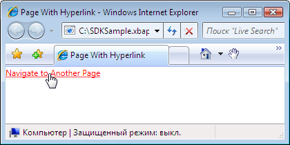  
  
 Как и следовало ожидать, щелкнув <xref:System.Windows.Documents.Hyperlink> вызывает [!INCLUDE[TLA2#tla_xbap](../../../../includes/tla2sharptla-xbap-md.md)] для перехода к <xref:System.Windows.Controls.Page> , определяемому `NavigateUri` атрибута. Кроме того [!INCLUDE[TLA2#tla_xbap](../../../../includes/tla2sharptla-xbap-md.md)] добавляет запись для предыдущего <xref:System.Windows.Controls.Page> в список последних страниц в [!INCLUDE[TLA2#tla_ie](../../../../includes/tla2sharptla-ie-md.md)]. Это показано на следующем рисунке.  
  
 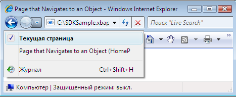  
  
 Наряду с поддержкой переходить от одной <xref:System.Windows.Controls.Page> в другой, <xref:System.Windows.Documents.Hyperlink> также поддерживает переход к фрагменту.  
  
   
### Переход к фрагменту  
 *Переход к фрагменту* — переход к фрагменту содержимого, либо текущая <xref:System.Windows.Controls.Page> или другой <xref:System.Windows.Controls.Page>. В [!INCLUDE[TLA2#tla_wpf](../../../../includes/tla2sharptla-wpf-md.md)], фрагмент содержимого представляет собой данные, содержащиеся в именованном элементе. Именованный элемент — элемент, имеющий его `Name` набором атрибутов. В следующем примере показана именованного `TextBlock` элемент, который содержит фрагмент содержимого.  
  
 [!code-xaml[NavigationOverviewSnippets#PageWithContentFragmentsMARKUP1](../../../../samples/snippets/csharp/VS_Snippets_Wpf/NavigationOverviewSnippets/CSharp/PageWithFragments.xaml#pagewithcontentfragmentsmarkup1)]  
[!code-xaml[NavigationOverviewSnippets#PageWithContentFragmentsMARKUP2](../../../../samples/snippets/csharp/VS_Snippets_Wpf/NavigationOverviewSnippets/CSharp/PageWithFragments.xaml#pagewithcontentfragmentsmarkup2)]  
[!code-xaml[NavigationOverviewSnippets#PageWithContentFragmentsMARKUP3](../../../../samples/snippets/csharp/VS_Snippets_Wpf/NavigationOverviewSnippets/CSharp/PageWithFragments.xaml#pagewithcontentfragmentsmarkup3)]  
  
 Для <xref:System.Windows.Documents.Hyperlink> для перехода к фрагменту содержимого `NavigateUri` атрибут должен включать следующие:  
  
-   [!INCLUDE[TLA2#tla_uri](../../../../includes/tla2sharptla-uri-md.md)] Из <xref:System.Windows.Controls.Page> с для перехода к фрагменту содержимого.  
  
-   Символ "#".  
  
-   Имя элемента на <xref:System.Windows.Controls.Page> , содержащий фрагмент содержимого.  
  
 Фрагмент [!INCLUDE[TLA2#tla_uri](../../../../includes/tla2sharptla-uri-md.md)] имеет следующий формат.  
  
 *URI_страницы* `#` *имя_элемента*.  
  
 Ниже показан пример `Hyperlink` , настроенный для перехода к фрагменту содержимого.  
  
 [!code-xaml[NavigationOverviewSnippets#PageThatNavigatesXAML1](../../../../samples/snippets/csharp/VS_Snippets_Wpf/NavigationOverviewSnippets/CSharp/PageThatNavigatesToFragment.xaml#pagethatnavigatesxaml1)]  
[!code-xaml[NavigationOverviewSnippets#PageThatNavigatesXAML2](../../../../samples/snippets/csharp/VS_Snippets_Wpf/NavigationOverviewSnippets/CSharp/PageThatNavigatesToFragment.xaml#pagethatnavigatesxaml2)]  
[!code-xaml[NavigationOverviewSnippets#PageThatNavigatesXAML3](../../../../samples/snippets/csharp/VS_Snippets_Wpf/NavigationOverviewSnippets/CSharp/PageThatNavigatesToFragment.xaml#pagethatnavigatesxaml3)]  
  
> [!NOTE]
>  Этот раздел описывает реализацию переходов фрагмента по умолчанию в [!INCLUDE[TLA2#tla_wpf](../../../../includes/tla2sharptla-wpf-md.md)]. [!INCLUDE[TLA2#tla_wpf](../../../../includes/tla2sharptla-wpf-md.md)] также позволяет реализовать собственную схему навигации фрагмент, который частично требует обработки <xref:System.Windows.Navigation.NavigationService.FragmentNavigation?displayProperty=nameWithType> событий.  
  
> [!IMPORTANT]
>  Можно перейти к фрагменту свободных [!INCLUDE[TLA2#tla_xaml](../../../../includes/tla2sharptla-xaml-md.md)] страниц (только для разметки [!INCLUDE[TLA2#tla_xaml](../../../../includes/tla2sharptla-xaml-md.md)] файлы с `Page` как корневой элемент) только в том случае, если страницы можно просмотреть с помощью [!INCLUDE[TLA2#tla_http](../../../../includes/tla2sharptla-http-md.md)].  
>   
>  Тем не менее свободный [!INCLUDE[TLA2#tla_xaml](../../../../includes/tla2sharptla-xaml-md.md)] страницу можно перейти на свои собственные фрагменты.  
  
   
### Служба переходов  
 Хотя <xref:System.Windows.Documents.Hyperlink> позволяет пользователю инициировать переход к конкретной <xref:System.Windows.Controls.Page>, выполняемой работы по поиску и загрузке страницы <xref:System.Windows.Navigation.NavigationService> класса. По существу <xref:System.Windows.Navigation.NavigationService> предоставляет возможность обработки запроса перехода от лица клиентского кода, такие как <xref:System.Windows.Documents.Hyperlink>. Кроме того <xref:System.Windows.Navigation.NavigationService> реализует поддержку более высокого уровня для отслеживания и влияние на запрос о переходе.  
  
 Когда <xref:System.Windows.Documents.Hyperlink> нажатии [!INCLUDE[TLA2#tla_wpf](../../../../includes/tla2sharptla-wpf-md.md)] вызовы <xref:System.Windows.Navigation.NavigationService.Navigate%2A?displayProperty=nameWithType> для обнаружения и загрузки <xref:System.Windows.Controls.Page> в указанный пакет [!INCLUDE[TLA2#tla_uri](../../../../includes/tla2sharptla-uri-md.md)]. Загруженного <xref:System.Windows.Controls.Page> преобразуется в дерево объектов, корневой объект является экземпляром загруженной <xref:System.Windows.Controls.Page>. Ссылка на корневой <xref:System.Windows.Controls.Page> объект сохраняется в <xref:System.Windows.Navigation.NavigationService.Content%2A?displayProperty=nameWithType> свойство. Пакет [!INCLUDE[TLA2#tla_uri](../../../../includes/tla2sharptla-uri-md.md)] для содержимого, к которому был осуществлен переход, сохраняется в <xref:System.Windows.Navigation.NavigationService.Source%2A?displayProperty=nameWithType> свойство, пока <xref:System.Windows.Navigation.NavigationService.CurrentSource%2A?displayProperty=nameWithType> сохраняет пакет [!INCLUDE[TLA2#tla_uri](../../../../includes/tla2sharptla-uri-md.md)] страницы, на который был открыт.  
  
> [!NOTE]
>  Существует возможность [!INCLUDE[TLA2#tla_wpf](../../../../includes/tla2sharptla-wpf-md.md)] приложению требуется более одного активного <xref:System.Windows.Navigation.NavigationService>. Дополнительные сведения см. в разделе [узлы переходов](#Navigation_Hosts) далее в этом разделе.  
  
   
### Программный переход с помощью службы переходов  
 Не нужно знать о <xref:System.Windows.Navigation.NavigationService> Если переход реализован декларативно в разметке с помощью <xref:System.Windows.Documents.Hyperlink>, так как <xref:System.Windows.Documents.Hyperlink> использует <xref:System.Windows.Navigation.NavigationService> от вашего имени. Это означает, что пока прямой или косвенный родительским для <xref:System.Windows.Documents.Hyperlink> является узлом перехода (см. [узлы переходов](#Navigation_Hosts)), <xref:System.Windows.Documents.Hyperlink> , смогут находить и использовать службу переходов этого узла для обработки запрос навигации.  
  
 Однако существуют ситуации, когда необходимо использовать <xref:System.Windows.Navigation.NavigationService> напрямую, включая следующие:  
  
-   Если необходимо создать экземпляр <xref:System.Windows.Controls.Page> с помощью конструктора не по умолчанию.  
  
-   При необходимости задайте свойства на <xref:System.Windows.Controls.Page> перед переходом к нему.  
  
-   Когда <xref:System.Windows.Controls.Page> , должен осуществлять переходы можно определить только во время выполнения.  
  
 В этих случаях необходимо написать код для программной инициации переходов, вызвав <xref:System.Windows.Navigation.NavigationService.Navigate%2A> метод <xref:System.Windows.Navigation.NavigationService> объекта. Что требуется получить ссылку на <xref:System.Windows.Navigation.NavigationService>.  
  
#### Получение ссылки на службу переходов  
 В целях, описанных в [узлы переходов](#Navigation_Hosts) разделе [!INCLUDE[TLA2#tla_wpf](../../../../includes/tla2sharptla-wpf-md.md)] приложение может иметь более одного <xref:System.Windows.Navigation.NavigationService>. Это означает, что в коде необходимо предусмотреть способ поиска <xref:System.Windows.Navigation.NavigationService>, которое обычно является <xref:System.Windows.Navigation.NavigationService> , приводящую к текущей <xref:System.Windows.Controls.Page>. Можно получить ссылку на <xref:System.Windows.Navigation.NavigationService> путем вызова `static` <xref:System.Windows.Navigation.NavigationService.GetNavigationService%2A?displayProperty=nameWithType> метод. Для получения <xref:System.Windows.Navigation.NavigationService> , к которому необходимо перейти к конкретному <xref:System.Windows.Controls.Page>, передать ссылку на <xref:System.Windows.Controls.Page> в качестве аргумента <xref:System.Windows.Navigation.NavigationService.GetNavigationService%2A> метод. Следующий код показывает способ получения <xref:System.Windows.Navigation.NavigationService> для текущего <xref:System.Windows.Controls.Page>.  
  
 [!code-csharp[NavigationOverviewSnippets#GetNSCODEBEHIND1](../../../../samples/snippets/csharp/VS_Snippets_Wpf/NavigationOverviewSnippets/CSharp/GetNSPage.xaml.cs#getnscodebehind1)]  
[!code-csharp[NavigationOverviewSnippets#GetNSCODEBEHIND2](../../../../samples/snippets/csharp/VS_Snippets_Wpf/NavigationOverviewSnippets/CSharp/GetNSPage.xaml.cs#getnscodebehind2)]
[!code-vb[NavigationOverviewSnippets#GetNSCODEBEHIND2](../../../../samples/snippets/visualbasic/VS_Snippets_Wpf/NavigationOverviewSnippets/VisualBasic/GetNSPage.xaml.vb#getnscodebehind2)]  
  
 Как быстро найти <xref:System.Windows.Navigation.NavigationService> для <xref:System.Windows.Controls.Page>, <xref:System.Windows.Controls.Page> реализует <xref:System.Windows.Controls.Page.NavigationService%2A> свойство. Эти действия показаны в следующем примере.  
  
 [!code-csharp[NavigationOverviewSnippets#GetNSShortcutCODEBEHIND1](../../../../samples/snippets/csharp/VS_Snippets_Wpf/NavigationOverviewSnippets/CSharp/GetNSPageShortCut.xaml.cs#getnsshortcutcodebehind1)]  
[!code-csharp[NavigationOverviewSnippets#GetNSShortcutCODEBEHIND2](../../../../samples/snippets/csharp/VS_Snippets_Wpf/NavigationOverviewSnippets/CSharp/GetNSPageShortCut.xaml.cs#getnsshortcutcodebehind2)]
[!code-vb[NavigationOverviewSnippets#GetNSShortcutCODEBEHIND2](../../../../samples/snippets/visualbasic/VS_Snippets_Wpf/NavigationOverviewSnippets/VisualBasic/GetNSPageShortCut.xaml.vb#getnsshortcutcodebehind2)]  
  
> [!NOTE]
>  Объект <xref:System.Windows.Controls.Page> можно получить только ссылку на его <xref:System.Windows.Navigation.NavigationService> при <xref:System.Windows.Controls.Page> вызывает <xref:System.Windows.FrameworkElement.Loaded> событий.  
  
#### Программный переход к объекту страницы  
 В следующем примере показано, как использовать <xref:System.Windows.Navigation.NavigationService> для программным путем перехода к <xref:System.Windows.Controls.Page>. Программный переход является обязательным, поскольку <xref:System.Windows.Controls.Page> то есть, куда выполняется переход могут быть созданы только с помощью одного конструктора, не по умолчанию конструктора. <xref:System.Windows.Controls.Page> С помощью конструктора не по умолчанию отображается в следующую разметку и код.  
  
 [!code-xaml[NavigationOverviewSnippets#PageWithNonDefaultConstructorXAML](../../../../samples/snippets/csharp/VS_Snippets_Wpf/NavigationOverviewSnippets/CSharp/PageWithNonDefaultConstructor.xaml#pagewithnondefaultconstructorxaml)]  
  
 [!code-csharp[NavigationOverviewSnippets#PageWithNonDefaultConstructorCODEBEHIND](../../../../samples/snippets/csharp/VS_Snippets_Wpf/NavigationOverviewSnippets/CSharp/PageWithNonDefaultConstructor.xaml.cs#pagewithnondefaultconstructorcodebehind)]
 [!code-vb[NavigationOverviewSnippets#PageWithNonDefaultConstructorCODEBEHIND](../../../../samples/snippets/visualbasic/VS_Snippets_Wpf/NavigationOverviewSnippets/VisualBasic/PageWithNonDefaultConstructor.xaml.vb#pagewithnondefaultconstructorcodebehind)]  
  
 <xref:System.Windows.Controls.Page> , Переходит к <xref:System.Windows.Controls.Page> с помощью конструктора не по умолчанию отображается в следующую разметку и код.  
  
 [!code-xaml[NavigationOverviewSnippets#NSNavigationPageXAML](../../../../samples/snippets/csharp/VS_Snippets_Wpf/NavigationOverviewSnippets/CSharp/NSNavigationPage.xaml#nsnavigationpagexaml)]  
  
 [!code-csharp[NavigationOverviewSnippets#NSNavigationPageCODEBEHIND](../../../../samples/snippets/csharp/VS_Snippets_Wpf/NavigationOverviewSnippets/CSharp/NSNavigationPage.xaml.cs#nsnavigationpagecodebehind)]
 [!code-vb[NavigationOverviewSnippets#NSNavigationPageCODEBEHIND](../../../../samples/snippets/visualbasic/VS_Snippets_Wpf/NavigationOverviewSnippets/VisualBasic/NSNavigationPage.xaml.vb#nsnavigationpagecodebehind)]  
  
 При <xref:System.Windows.Documents.Hyperlink> в данном <xref:System.Windows.Controls.Page> — нажатии навигации инициируется путем создания экземпляра <xref:System.Windows.Controls.Page> для перехода с помощью конструктора не по умолчанию и вызов <xref:System.Windows.Navigation.NavigationService.Navigate%2A?displayProperty=nameWithType> метод. <xref:System.Windows.Navigation.NavigationService.Navigate%2A> Представляет ссылку на объект, <xref:System.Windows.Navigation.NavigationService> , произойдет переход, а не является пакетом [!INCLUDE[TLA2#tla_uri](../../../../includes/tla2sharptla-uri-md.md)].  
  
#### Программный переход с URI типа pack  
 Если необходимо создать пакет [!INCLUDE[TLA2#tla_uri](../../../../includes/tla2sharptla-uri-md.md)] программным образом (если только определения пакета [!INCLUDE[TLA2#tla_uri](../../../../includes/tla2sharptla-uri-md.md)] во время выполнения, например), можно использовать <xref:System.Windows.Navigation.NavigationService.Navigate%2A?displayProperty=nameWithType> метода. Эти действия показаны в следующем примере.  
  
 [!code-xaml[NavigationOverviewSnippets#NSUriNavigationPageXAML](../../../../samples/snippets/csharp/VS_Snippets_Wpf/NavigationOverviewSnippets/CSharp/NSUriNavigationPage.xaml#nsurinavigationpagexaml)]  
  
 [!code-csharp[NavigationOverviewSnippets#NSUriNavigationPageCODEBEHIND](../../../../samples/snippets/csharp/VS_Snippets_Wpf/NavigationOverviewSnippets/CSharp/NSUriNavigationPage.xaml.cs#nsurinavigationpagecodebehind)]
 [!code-vb[NavigationOverviewSnippets#NSUriNavigationPageCODEBEHIND](../../../../samples/snippets/visualbasic/VS_Snippets_Wpf/NavigationOverviewSnippets/VisualBasic/NSUriNavigationPage.xaml.vb#nsurinavigationpagecodebehind)]  
  
#### Обновление текущей страницы  
 Объект <xref:System.Windows.Controls.Page> не загружается, если он имеет тот же пакет [!INCLUDE[TLA2#tla_uri](../../../../includes/tla2sharptla-uri-md.md)] как пакет [!INCLUDE[TLA2#tla_uri](../../../../includes/tla2sharptla-uri-md.md)] , хранящегося в <xref:System.Windows.Navigation.NavigationService.Source%2A?displayProperty=nameWithType> свойство. Чтобы принудительно [!INCLUDE[TLA2#tla_wpf](../../../../includes/tla2sharptla-wpf-md.md)] повторно загрузить текущую страницу, можно вызвать <xref:System.Windows.Navigation.NavigationService.Refresh%2A?displayProperty=nameWithType> метода, как показано в следующем примере.  
  
 [!code-xaml[NavigationOverviewSnippets#NSRefreshNavigationPageXAML1](../../../../samples/snippets/csharp/VS_Snippets_Wpf/NavigationOverviewSnippets/CSharp/NSRefreshNavigationPage.xaml#nsrefreshnavigationpagexaml1)]  
  
 [!code-csharp[NavigationOverviewSnippets#NSRefreshNavigationPageCODEBEHIND1](../../../../samples/snippets/csharp/VS_Snippets_Wpf/NavigationOverviewSnippets/CSharp/NSRefreshNavigationPage.xaml.cs#nsrefreshnavigationpagecodebehind1)]
 [!code-vb[NavigationOverviewSnippets#NSRefreshNavigationPageCODEBEHIND1](../../../../samples/snippets/visualbasic/VS_Snippets_Wpf/NavigationOverviewSnippets/VisualBasic/NSRefreshNavigationPage.xaml.vb#nsrefreshnavigationpagecodebehind1)]  
[!code-csharp[NavigationOverviewSnippets#NSRefreshNavigationPageCODEBEHIND2](../../../../samples/snippets/csharp/VS_Snippets_Wpf/NavigationOverviewSnippets/CSharp/NSRefreshNavigationPage.xaml.cs#nsrefreshnavigationpagecodebehind2)]
[!code-vb[NavigationOverviewSnippets#NSRefreshNavigationPageCODEBEHIND2](../../../../samples/snippets/visualbasic/VS_Snippets_Wpf/NavigationOverviewSnippets/VisualBasic/NSRefreshNavigationPage.xaml.vb#nsrefreshnavigationpagecodebehind2)]  
  
   
### Время существования перехода  
 Как вы уже видели, существует множество способов инициации перехода. При инициации переходов и навигации во время выполнения, можно отслеживать и влияют на следующие события, которые реализуются с помощью переходов <xref:System.Windows.Navigation.NavigationService>:  
  
-   <xref:System.Windows.Navigation.NavigationService.Navigating>. Появляется, когда запрошен новый переход. Можно использовать для отмены перехода.  
  
-   <xref:System.Windows.Navigation.NavigationService.NavigationProgress>. Происходит периодически во время загрузки, тем самым предоставляя информацию о ходе процесса навигации.  
  
-   <xref:System.Windows.Navigation.NavigationService.Navigated>. Появляется, когда страница найдена и загружена.  
  
-   <xref:System.Windows.Navigation.NavigationService.NavigationStopped>. Возникает при остановке навигации (путем вызова <xref:System.Windows.Navigation.NavigationService.StopLoading%2A>), или при запросе нового перехода во время выполнения текущего перехода.  
  
-   <xref:System.Windows.Navigation.NavigationService.NavigationFailed>. Появляется при возникновении ошибки во время перехода к запрошенному содержимому.  
  
-   <xref:System.Windows.Navigation.NavigationService.LoadCompleted>. Появляется, когда содержимое, к которому был осуществлен переход, загружено и проанализировано и начинается его отрисовка.  
  
-   <xref:System.Windows.Navigation.NavigationService.FragmentNavigation>. Появляется в начале перехода к фрагменту содержимого, который происходит:  
  
    -   немедленно, если нужный фрагмент находится в текущем содержимом;  
  
    -   после загрузки исходного содержимого, если нужный фрагмент находится в другом содержимом.  
  
 События перехода вызываются в порядке, который показан на следующем рисунке.  
  
 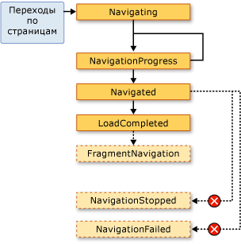  
  
 Как правило <xref:System.Windows.Controls.Page> не связан с этими событиями. Вполне вероятно, что приложение связано с ними, и по этой причине эти события также возникает, если <xref:System.Windows.Application> класса:  
  
-   <xref:System.Windows.Application.Navigating?displayProperty=nameWithType>  
  
-   <xref:System.Windows.Application.NavigationProgress?displayProperty=nameWithType>  
  
-   <xref:System.Windows.Application.Navigated?displayProperty=nameWithType>  
  
-   <xref:System.Windows.Application.NavigationFailed?displayProperty=nameWithType>  
  
-   <xref:System.Windows.Application.NavigationStopped?displayProperty=nameWithType>  
  
-   <xref:System.Windows.Application.LoadCompleted?displayProperty=nameWithType>  
  
-   <xref:System.Windows.Application.FragmentNavigation?displayProperty=nameWithType>  
  
 Каждый раз <xref:System.Windows.Navigation.NavigationService> вызывает событие <xref:System.Windows.Application> класс вызывает соответствующее событие. <xref:System.Windows.Controls.Frame> и <xref:System.Windows.Navigation.NavigationWindow> обеспечивают те же события, для обнаружения навигации в своих областях.  
  
 В некоторых случаях <xref:System.Windows.Controls.Page> могут быть заинтересованы эти события. Например <xref:System.Windows.Controls.Page> может обрабатывать <xref:System.Windows.Navigation.NavigationService.Navigating?displayProperty=nameWithType> событие, чтобы определить необходимость отмены перехода с текущей страницы. Эти действия показаны в следующем примере.  
  
 [!code-xaml[NavigationOverviewSnippets#CancelNavigationPageXAML](../../../../samples/snippets/csharp/VS_Snippets_Wpf/NavigationOverviewSnippets/CSharp/CancelNavigationPage.xaml#cancelnavigationpagexaml)]  
  
 [!code-csharp[NavigationOverviewSnippets#CancelNavigationPageCODEBEHIND](../../../../samples/snippets/csharp/VS_Snippets_Wpf/NavigationOverviewSnippets/CSharp/CancelNavigationPage.xaml.cs#cancelnavigationpagecodebehind)]
 [!code-vb[NavigationOverviewSnippets#CancelNavigationPageCODEBEHIND](../../../../samples/snippets/visualbasic/VS_Snippets_Wpf/NavigationOverviewSnippets/VisualBasic/CancelNavigationPage.xaml.vb#cancelnavigationpagecodebehind)]  
  
 Если регистрация обработчика с событием перехода из <xref:System.Windows.Controls.Page>, как и в предыдущем примере, необходимо также отменить регистрацию обработчика событий. Если этого не сделать, может быть побочные эффекты, как [!INCLUDE[TLA2#tla_wpf](../../../../includes/tla2sharptla-wpf-md.md)] навигации запоминает <xref:System.Windows.Controls.Page> с помощью журнала.  
  
   
### Запоминание перехода в журнале  
 [!INCLUDE[TLA2#tla_wpf](../../../../includes/tla2sharptla-wpf-md.md)] использует два стека для запоминания страниц, с которых был осуществлен переход: стек "Назад" и стек "Вперед". При переходе из текущего <xref:System.Windows.Controls.Page> в новую <xref:System.Windows.Controls.Page> или вперед на существующую <xref:System.Windows.Controls.Page>, текущий <xref:System.Windows.Controls.Page> добавляется *стек*. При переходе из текущего <xref:System.Windows.Controls.Page> вернитесь к предыдущему <xref:System.Windows.Controls.Page>, текущий <xref:System.Windows.Controls.Page> добавляется *прямом стеке*. Стек "Назад", стек "Вперед" и функциональные возможности для управления ими в совокупности называются журналом. Каждый элемент в стеке назад и вперед — экземпляр <xref:System.Windows.Navigation.JournalEntry> класса и называется *запись в журнале*.  
  
#### Перемещение по журналу в браузере Internet Explorer  
 По существу, журнал, функционирует так же, как **обратно** и **вперед** кнопки в [!INCLUDE[TLA2#tla_ie](../../../../includes/tla2sharptla-ie-md.md)] сделать. Это показано на следующем рисунке.  
  
   
  
 Для [!INCLUDE[TLA2#tla_xbap#plural](../../../../includes/tla2sharptla-xbapsharpplural-md.md)] , размещенных в [!INCLUDE[TLA2#tla_ie](../../../../includes/tla2sharptla-ie-md.md)], [!INCLUDE[TLA2#tla_wpf](../../../../includes/tla2sharptla-wpf-md.md)] интегрирует журнал навигации [!INCLUDE[TLA2#tla_ui](../../../../includes/tla2sharptla-ui-md.md)] из [!INCLUDE[TLA2#tla_ie](../../../../includes/tla2sharptla-ie-md.md)]. Это позволяет пользователям перемещаться по страницам в [!INCLUDE[TLA2#tla_xbap](../../../../includes/tla2sharptla-xbap-md.md)] с помощью **обратно**, **вперед**, и **последние страницы** кнопки в [!INCLUDE[TLA2#tla_ie](../../../../includes/tla2sharptla-ie-md.md)]. Журнал не интегрирован в [!INCLUDE[TLA2#tla_ie6](../../../../includes/tla2sharptla-ie6-md.md)] таким же образом для [!INCLUDE[TLA2#tla_ie7](../../../../includes/tla2sharptla-ie7-md.md)] или Internet Explorer 8. Вместо этого [!INCLUDE[TLA2#tla_wpf](../../../../includes/tla2sharptla-wpf-md.md)] отображает навигации замена [!INCLUDE[TLA2#tla_ui](../../../../includes/tla2sharptla-ui-md.md)].  
  
> [!IMPORTANT]
>  В [!INCLUDE[TLA2#tla_ie](../../../../includes/tla2sharptla-ie-md.md)], когда пользователь переходит с и обратно [!INCLUDE[TLA2#tla_xbap](../../../../includes/tla2sharptla-xbap-md.md)], в журнале сохраняются только записи журнала для страниц, которые не поддерживались в активном состоянии. Обсуждение поддержки страниц в активном состоянии в разделе [время существования страницы и журнал](#PageLifetime) далее в этом разделе.  
  
 По умолчанию текст для каждой <xref:System.Windows.Controls.Page> , которая отображается в **последние страницы** список [!INCLUDE[TLA2#tla_ie](../../../../includes/tla2sharptla-ie-md.md)] — [!INCLUDE[TLA2#tla_uri](../../../../includes/tla2sharptla-uri-md.md)] для <xref:System.Windows.Controls.Page>. В большинстве случаев это не особенно важно для пользователя. К счастью можно изменить текст, используя следующие параметры.  
  
1.  Прикрепленное `JournalEntry.Name` значение атрибута.  
  
2.  `Page.Title` Значение атрибута.  
  
3.  `Page.WindowTitle` Значения атрибута и [!INCLUDE[TLA2#tla_uri](../../../../includes/tla2sharptla-uri-md.md)] для текущего <xref:System.Windows.Controls.Page>.  
  
4.  Интерфейс [!INCLUDE[TLA2#tla_uri](../../../../includes/tla2sharptla-uri-md.md)] для текущего объекта <xref:System.Windows.Controls.Page>. (Значение по умолчанию)  
  
 Порядок, в котором перечислены параметры, совпадает с порядком приоритета для поиска текста. Например если `JournalEntry.Name` не установлен, другие значения игнорируются.  
  
 В следующем примере используется `Page.Title` атрибут, чтобы изменить текст, отображаемый в записи журнала.  
  
 [!code-xaml[NavigationOverviewSnippets#PageTitleMARKUP1](../../../../samples/snippets/csharp/VS_Snippets_Wpf/NavigationOverviewSnippets/CSharp/PageWithTitle.xaml#pagetitlemarkup1)]  
[!code-xaml[NavigationOverviewSnippets#PageTitleMARKUP2](../../../../samples/snippets/csharp/VS_Snippets_Wpf/NavigationOverviewSnippets/CSharp/PageWithTitle.xaml#pagetitlemarkup2)]  
  
 [!code-csharp[NavigationOverviewSnippets#PageTitleCODEBEHIND1](../../../../samples/snippets/csharp/VS_Snippets_Wpf/NavigationOverviewSnippets/CSharp/PageWithTitle.xaml.cs#pagetitlecodebehind1)]
 [!code-vb[NavigationOverviewSnippets#PageTitleCODEBEHIND1](../../../../samples/snippets/visualbasic/VS_Snippets_Wpf/NavigationOverviewSnippets/VisualBasic/PageWithTitle.xaml.vb#pagetitlecodebehind1)]  
[!code-csharp[NavigationOverviewSnippets#PageTitleCODEBEHIND2](../../../../samples/snippets/csharp/VS_Snippets_Wpf/NavigationOverviewSnippets/CSharp/PageWithTitle.xaml.cs#pagetitlecodebehind2)]
[!code-vb[NavigationOverviewSnippets#PageTitleCODEBEHIND2](../../../../samples/snippets/visualbasic/VS_Snippets_Wpf/NavigationOverviewSnippets/VisualBasic/PageWithTitle.xaml.vb#pagetitlecodebehind2)]  
  
#### Перемещение по журналу с помощью WPF  
 Несмотря на то, что пользователь может перемещаться по журналу с помощью **обратно**, **вперед**, и **последние страницы** в [!INCLUDE[TLA2#tla_ie](../../../../includes/tla2sharptla-ie-md.md)], вы также можете переходить с помощью журнала декларативные и программные механизмы, предоставляемые [!INCLUDE[TLA2#tla_wpf](../../../../includes/tla2sharptla-wpf-md.md)]. Одной из причин для этого является предоставление пользовательских переходов [!INCLUDE[TLA2#tla_ui#plural](../../../../includes/tla2sharptla-uisharpplural-md.md)] на страницах.  
  
 Можно декларативно добавить поддержку навигации журнала с помощью команды навигации, предоставляемым <xref:System.Windows.Input.NavigationCommands>. В следующем примере демонстрируется использование `BrowseBack` команды перехода.  
  
 [!code-xaml[NavigationOverviewSnippets#NavigationCommandsPageXAML1](../../../../samples/snippets/csharp/VS_Snippets_Wpf/NavigationOverviewSnippets/CSharp/NavigationCommandsPage.xaml#navigationcommandspagexaml1)]  
[!code-xaml[NavigationOverviewSnippets#NavigationCommandsPageXAML2](../../../../samples/snippets/csharp/VS_Snippets_Wpf/NavigationOverviewSnippets/CSharp/NavigationCommandsPage.xaml#navigationcommandspagexaml2)]  
[!code-xaml[NavigationOverviewSnippets#NavigationCommandsPageXAML3](../../../../samples/snippets/csharp/VS_Snippets_Wpf/NavigationOverviewSnippets/CSharp/NavigationCommandsPage.xaml#navigationcommandspagexaml3)]  
[!code-xaml[NavigationOverviewSnippets#NavigationCommandsPageXAML4](../../../../samples/snippets/csharp/VS_Snippets_Wpf/NavigationOverviewSnippets/CSharp/NavigationCommandsPage.xaml#navigationcommandspagexaml4)]  
  
 Перемещения по журналу можно программным образом с помощью одного из следующих членов <xref:System.Windows.Navigation.NavigationService> класса:  
  
-   <xref:System.Windows.Navigation.NavigationService.GoBack%2A>  
  
-   <xref:System.Windows.Navigation.NavigationService.GoForward%2A>  
  
-   <xref:System.Windows.Navigation.NavigationService.CanGoBack%2A>  
  
-   <xref:System.Windows.Navigation.NavigationService.CanGoForward%2A>  
  
 Журнал можно также управлять программным образом, как описано в [сохранение состояния содержимого с помощью журнала переходов](#RetainingContentStateWithNavigationHistory) далее в этом разделе.  
  
   
### Время существования страницы и журнал  
 Рассмотрим [!INCLUDE[TLA2#tla_xbap](../../../../includes/tla2sharptla-xbap-md.md)] с несколькими страницами, содержащий большое, включая графики, анимации и мультимедиа. Объем памяти для подобных страниц может быть довольно большим, особенно если используются видеоматериалы и звуковые файлы. Учитывая, что в журнале «запоминаются» страниц, которые были для перехода, например [!INCLUDE[TLA2#tla_xbap](../../../../includes/tla2sharptla-xbap-md.md)] может быстро расходовать значительный объем памяти.  
  
 По этой причине, по умолчанию журнала выполняется для хранения <xref:System.Windows.Controls.Page> метаданные в каждой записи журнала, а не ссылку на <xref:System.Windows.Controls.Page> объекта. При переходе к записи журнала его <xref:System.Windows.Controls.Page> метаданные используются для создания нового экземпляра заданного <xref:System.Windows.Controls.Page>. В результате каждый <xref:System.Windows.Controls.Page> , выполняется переход с временем существования, который показан на следующем рисунке.  
  
 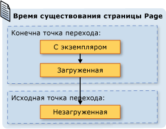  
  
 Хотя при использовании поведения журнала по умолчанию можно сэкономить потребление памяти, производительность отрисовки каждой страницы может уменьшиться; повторное создание экземпляров <xref:System.Windows.Controls.Page> может занимать много времени, особенно в том случае, если он имеет много содержимого. Если вы хотите сохранить <xref:System.Windows.Controls.Page> экземпляр журнала, можно создавать на два способа это сделать. Во-первых, программными средствами можно перейти к <xref:System.Windows.Controls.Page> путем вызова метода <xref:System.Windows.Navigation.NavigationService.Navigate%2A?displayProperty=nameWithType> метод.  
  
 Во-вторых, можно указать, что [!INCLUDE[TLA2#tla_wpf](../../../../includes/tla2sharptla-wpf-md.md)] сохранить экземпляр <xref:System.Windows.Controls.Page> в журнале, задав <xref:System.Windows.Controls.Page.KeepAlive%2A> свойства `true` (значение по умолчанию — `false`). Как показано в следующем примере, можно задать <xref:System.Windows.Controls.Page.KeepAlive%2A> декларативно в разметке.  
  
 [!code-xaml[NavigationOverviewSnippets#KeepAlivePageXAML](../../../../samples/snippets/csharp/VS_Snippets_Wpf/NavigationOverviewSnippets/CSharp/KeepAlivePage.xaml#keepalivepagexaml)]  
  
 Время существования <xref:System.Windows.Controls.Page> , находиться в активном состоянии, немного отличается от которого не поддерживается. В первый раз <xref:System.Windows.Controls.Page> , остается активным осуществляется переход, так же, как создается экземпляр <xref:System.Windows.Controls.Page> , не сохраняется. Тем не менее поскольку экземпляр <xref:System.Windows.Controls.Page> сохраняется в журнале, он никогда не инициализируется повторно для до тех пор, пока он остается в журнале. Следовательно Если <xref:System.Windows.Controls.Page> имеет логику инициализации, который должен вызываться всякий раз <xref:System.Windows.Controls.Page> осуществляется переход, его следует переместить из конструктора в обработчик <xref:System.Windows.FrameworkElement.Loaded> событий. Как показано на следующем рисунке <xref:System.Windows.FrameworkElement.Loaded> и <xref:System.Windows.FrameworkElement.Unloaded> каждый раз, по-прежнему возникают события, <xref:System.Windows.Controls.Page> выполняется переход к и из, соответственно.  
  
 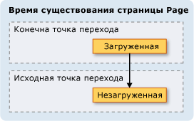  
  
 Когда <xref:System.Windows.Controls.Page> — не поддерживается в активном состоянии, не следует одно из следующих:  
  
-   Сохранять ссылку или любую его часть.  
  
-   Регистрировать обработчики событий с событиями, которые не реализованы в объекте.  
  
 Выполнения любого из этих действий будут созданы ссылки, которые принудительно <xref:System.Windows.Controls.Page> должно храниться в памяти, даже после удаления из журнала.  
  
 В общем случае следует выбирать значение по умолчанию <xref:System.Windows.Controls.Page> поведение не <xref:System.Windows.Controls.Page> проверки активности. Однако при этом существуют реализации состояния, которые описаны в следующем разделе.  
  
   
### Сохранение состояния содержимого с помощью журнала переходов  
 Если <xref:System.Windows.Controls.Page> не сохраняется, но имеет элементы управления для сбора данных от пользователя, что происходит с данными, если пользователь переходит с и обратно в <xref:System.Windows.Controls.Page>? С точки зрения пользователя следует ожидать появления ранее введенных данных. К сожалению поскольку новый экземпляр <xref:System.Windows.Controls.Page> создается при каждом переходе, элементы управления, собранные данные повторно создаются экземпляры, и данные будут потеряны.  
  
 К счастью, журнал обеспечивает запоминание данных через <xref:System.Windows.Controls.Page> переходах, включая данные элемента управления. В частности, запись журнала для каждого <xref:System.Windows.Controls.Page> действует как временный контейнер для соответствующего <xref:System.Windows.Controls.Page> состояния. Ниже описывается использование этой поддержки при <xref:System.Windows.Controls.Page> перехода из:  
  
1.  Запись для текущего <xref:System.Windows.Controls.Page> добавляется в журнал.  
  
2.  Состояние <xref:System.Windows.Controls.Page> хранятся записи журнала для этой страницы, которая добавляется в стек.  
  
3.  Новый <xref:System.Windows.Controls.Page> осуществляется переход.  
  
 Если страница <xref:System.Windows.Controls.Page> является переход назад к, с помощью журнала, следующие действия выполняются:  
  
1.  <xref:System.Windows.Controls.Page> Создается (самая верхняя запись журнала в стеке назад).  
  
2.  <xref:System.Windows.Controls.Page> Обновляется с состоянием, которое было сохранено в записи журнала для <xref:System.Windows.Controls.Page>.  
  
3.  <xref:System.Windows.Controls.Page> Переход назад к.  
  
 [!INCLUDE[TLA2#tla_wpf](../../../../includes/tla2sharptla-wpf-md.md)] автоматически использует эту поддержку при использовании следующих элементов управления на <xref:System.Windows.Controls.Page>:  
  
-   <xref:System.Windows.Controls.CheckBox>  
  
-   <xref:System.Windows.Controls.ComboBox>  
  
-   <xref:System.Windows.Controls.Expander>  
  
-   <xref:System.Windows.Controls.Frame>  
  
-   <xref:System.Windows.Controls.ListBox>  
  
-   <xref:System.Windows.Controls.ListBoxItem>  
  
-   <xref:System.Windows.Controls.MenuItem>  
  
-   <xref:System.Windows.Controls.ProgressBar>  
  
-   <xref:System.Windows.Controls.RadioButton>  
  
-   <xref:System.Windows.Controls.Slider>  
  
-   <xref:System.Windows.Controls.TabControl>  
  
-   <xref:System.Windows.Controls.TabItem>  
  
-   <xref:System.Windows.Controls.TextBox>  
  
 Если <xref:System.Windows.Controls.Page> использует эти элементы управления, содержащиеся в них данные запоминаются <xref:System.Windows.Controls.Page> переходах, как показано в предыдущем **любимого цвета** <xref:System.Windows.Controls.ListBox> на следующем рисунке.  
  
   
  
 Когда <xref:System.Windows.Controls.Page> содержит элементы управления, отличные от приведенных в предыдущем списке, или когда состояние сохраняется в пользовательских объектах, необходимо написать код для сохранения в журнале состояния <xref:System.Windows.Controls.Page> переходов.  
  
 Если необходимо знать небольшой части состояния <xref:System.Windows.Controls.Page> переходах, можно использовать свойства зависимостей (см. <xref:System.Windows.DependencyProperty>), настроенные с <xref:System.Windows.FrameworkPropertyMetadata.Journal%2A?displayProperty=nameWithType> флаг метаданных.  
  
 Если состояние, к <xref:System.Windows.Controls.Page> необходимо запомнить при переходах состоит из нескольких фрагментов данных, может оказаться меньше кода служб с интенсивными вычислениями инкапсуляцию состояния в отдельный класс и реализовать <xref:System.Windows.Navigation.IProvideCustomContentState> интерфейса.  
  
 Требуется для просмотра различных состояний из одного <xref:System.Windows.Controls.Page>, без перемещения из <xref:System.Windows.Controls.Page> , можно использовать <xref:System.Windows.Navigation.IProvideCustomContentState> и <xref:System.Windows.Navigation.NavigationService.AddBackEntry%2A?displayProperty=nameWithType>.  
  
   
### Файлы cookie  
 Другим способом, что [!INCLUDE[TLA2#tla_wpf](../../../../includes/tla2sharptla-wpf-md.md)] приложения могут хранить данные с помощью файлов cookie, которые создаются, обновлять и удалять с помощью <xref:System.Windows.Application.SetCookie%2A> и <xref:System.Windows.Application.GetCookie%2A> методы. Файлы cookie, которые можно создать в [!INCLUDE[TLA2#tla_wpf](../../../../includes/tla2sharptla-wpf-md.md)] — использовать те же cookie других типов веб-приложений, файлы cookie — это произвольные фрагменты данных, которые хранятся в приложение на клиентском компьютере во время или между сеансами приложения. Данные файлов cookie обычно представлены в форме пары "имя — значение" в следующем формате.  
  
 *имя* `=` *значение*  
  
 При передаче данных <xref:System.Windows.Application.SetCookie%2A>, вместе с <xref:System.Uri> расположения, для которых задан файл cookie, файл cookie создается в памяти, и он доступен только в течение текущего сеанса приложения. Этот тип файлов cookie называется *файла cookie сеанса*.  
  
 Чтобы сохранить файл cookie на протяжении нескольких сеансов приложения, необходимо добавить в файл cookie дату окончания срока действия, используя следующий формат.  
  
 *имя* `=` *значение* `; expires=DAY, DD-MMM-YYYY HH:MM:SS GMT`  
  
 Файл cookie с датой окончания срока действия хранится в текущем [!INCLUDE[TLA#tla_mswin](../../../../includes/tlasharptla-mswin-md.md)] папке временных файлов Интернета для установки до истечения срока действия файла cookie. Такой файл cookie называется *постоянный файл cookie* , так как он сохраняется между сеансами приложения.  
  
 Получить сеансов и сохраняемые файлы cookie, вызывая <xref:System.Windows.Application.GetCookie%2A> метод, передавая <xref:System.Uri> расположения, где был задан файл cookie с <xref:System.Windows.Application.SetCookie%2A> метод.  
  
 Ниже перечислены некоторые из способов, которые поддерживаются файлы cookie в [!INCLUDE[TLA2#tla_wpf](../../../../includes/tla2sharptla-wpf-md.md)]:  
  
-   [!INCLUDE[TLA2#tla_wpf](../../../../includes/tla2sharptla-wpf-md.md)] Автономные приложения и [!INCLUDE[TLA2#tla_xbap#plural](../../../../includes/tla2sharptla-xbapsharpplural-md.md)] можно создавать и управлять файлы cookie.  
  
-   Файлы cookie, которые создаются путем [!INCLUDE[TLA2#tla_xbap](../../../../includes/tla2sharptla-xbap-md.md)] можно получить из браузера.  
  
-   [!INCLUDE[TLA2#tla_xbap#plural](../../../../includes/tla2sharptla-xbapsharpplural-md.md)] из одного домена могут создавать и совместно использовать файлы cookie.  
  
-   [!INCLUDE[TLA2#tla_xbap#plural](../../../../includes/tla2sharptla-xbapsharpplural-md.md)] и [!INCLUDE[TLA2#tla_html](../../../../includes/tla2sharptla-html-md.md)] страницы из того же домена можно создавать и совместно использовать файлы cookie.  
  
-   Файлы cookie отправляются при [!INCLUDE[TLA2#tla_xbap#plural](../../../../includes/tla2sharptla-xbapsharpplural-md.md)] и свободные [!INCLUDE[TLA2#tla_xaml](../../../../includes/tla2sharptla-xaml-md.md)] выполнение страницы веб-запросов.  
  
-   Оба верхнего уровня [!INCLUDE[TLA2#tla_xbap#plural](../../../../includes/tla2sharptla-xbapsharpplural-md.md)] и [!INCLUDE[TLA2#tla_xbap#plural](../../../../includes/tla2sharptla-xbapsharpplural-md.md)] размещенного в РАМКИ можно получить доступ к куки-файлы.  
  
-   Поддержка файлов cookie в [!INCLUDE[TLA2#tla_wpf](../../../../includes/tla2sharptla-wpf-md.md)] является одинаковым для всех поддерживаемых браузерах.  
  
-   В [!INCLUDE[TLA2#tla_ie](../../../../includes/tla2sharptla-ie-md.md)], политика P3P, относятся к файлам cookie учитывается по [!INCLUDE[TLA2#tla_wpf](../../../../includes/tla2sharptla-wpf-md.md)], особенно в отношении основном и сторонних [!INCLUDE[TLA2#tla_xbap#plural](../../../../includes/tla2sharptla-xbapsharpplural-md.md)].  
  
   
### Структурная навигация  
 Если необходимо передать данные из одного <xref:System.Windows.Controls.Page> в другую, можно передать данные в качестве аргументов для конструктора не по умолчанию <xref:System.Windows.Controls.Page>. Обратите внимание, что при использовании этого метода, то необходимо поддерживать <xref:System.Windows.Controls.Page> alive; Если нет, в следующий раз, перейдите к <xref:System.Windows.Controls.Page>, [!INCLUDE[TLA2#tla_wpf](../../../../includes/tla2sharptla-wpf-md.md)] заново создается <xref:System.Windows.Controls.Page> с помощью конструктора по умолчанию.  
  
 Кроме того ваш <xref:System.Windows.Controls.Page> можно реализовать свойства, которые устанавливаются с помощью данных, которое должно быть передано. Что нового в непростой задачей, однако, когда <xref:System.Windows.Controls.Page> требуется для передачи данных обратно в <xref:System.Windows.Controls.Page> , переходит к нему. Проблема заключается в том, что изначально переходы не поддерживают механизмы, гарантирующие, что <xref:System.Windows.Controls.Page> будет возвращен после перехода от. По существу переходы не поддерживают семантику вызова/возврата. Чтобы решить эту проблему, [!INCLUDE[TLA2#tla_wpf](../../../../includes/tla2sharptla-wpf-md.md)] предоставляет <xref:System.Windows.Navigation.PageFunction%601> класс, который можно использовать, чтобы убедиться, что <xref:System.Windows.Controls.Page> возвращается в прогнозируемом и структурированном виде. Дополнительные сведения см. в разделе [Structured Navigation Overview](../../../../docs/framework/wpf/app-development/structured-navigation-overview.md).  
  
   
## Класс NavigationWindow  
 К этому моменту мы рассмотрели целый ряд служб переходов, которые с наибольшей вероятностью будут использоваться для построения приложений с содержимым, допускающим переходы. Эти службы обсуждались в контексте [!INCLUDE[TLA2#tla_xbap#plural](../../../../includes/tla2sharptla-xbapsharpplural-md.md)], несмотря на то, что они не ограничиваются [!INCLUDE[TLA2#tla_xbap#plural](../../../../includes/tla2sharptla-xbapsharpplural-md.md)]. Воспользуйтесь преимуществами опыт работы современных пользователей для включения переходов в стиле браузера в автономные приложения, современных операционных систем и приложений Windows. Вот наиболее распространенные примеры.  
  
-   **Тезаурус**: переход по вариантам слов.  
  
-   **Обозреватель файлов**: переход по файлам и папкам.  
  
-   **Мастеры**: разбиение сложной задачи на несколько страниц, по которым можно перемещаться. Например, мастер компонентов Windows, который обрабатывает добавление и удаление компонентов Windows.  
  
 Для включения переходов в стиле браузера в автономные приложения, можно использовать <xref:System.Windows.Navigation.NavigationWindow> класса. <xref:System.Windows.Navigation.NavigationWindow> является производным от <xref:System.Windows.Window> и расширяет его с такой же поддержкой навигации, [!INCLUDE[TLA2#tla_xbap#plural](../../../../includes/tla2sharptla-xbapsharpplural-md.md)] предоставить. Можно использовать <xref:System.Windows.Navigation.NavigationWindow> как главное окно автономного приложения или как дополнительное окно, например диалоговое окно.  
  
 Для реализации <xref:System.Windows.Navigation.NavigationWindow>, как и в случае с классами самого верхнего уровня в [!INCLUDE[TLA2#tla_wpf](../../../../includes/tla2sharptla-wpf-md.md)] (<xref:System.Windows.Window>, <xref:System.Windows.Controls.Page>и так далее), используйте сочетание разметки и кода. Эти действия показаны в следующем примере.  
  
 [!code-xaml[IntroToNavNavigationWindowSnippets#NavigationWindowMARKUP](../../../../samples/snippets/csharp/VS_Snippets_Wpf/IntroToNavNavigationWindowSnippets/CSharp/MainWindow.xaml#navigationwindowmarkup)]  
  
 [!code-csharp[IntroToNavNavigationWindowSnippets#NavigationWindowCODEBEHIND](../../../../samples/snippets/csharp/VS_Snippets_Wpf/IntroToNavNavigationWindowSnippets/CSharp/MainWindow.xaml.cs#navigationwindowcodebehind)]
 [!code-vb[IntroToNavNavigationWindowSnippets#NavigationWindowCODEBEHIND](../../../../samples/snippets/visualbasic/VS_Snippets_Wpf/IntroToNavNavigationWindowSnippets/VisualBasic/MainWindow.xaml.vb#navigationwindowcodebehind)]  
  
 Этот код создает <xref:System.Windows.Navigation.NavigationWindow> , автоматически переходит к <xref:System.Windows.Controls.Page> (HomePage.xaml) при <xref:System.Windows.Navigation.NavigationWindow> открыт. Если <xref:System.Windows.Navigation.NavigationWindow> является главное окно приложения, можно использовать `StartupUri` атрибут, чтобы запустить его. Это показано в следующем примере разметки.  
  
 [!code-xaml[IntroToNavNavigationWindowSnippets#AppLaunchNavWindow](../../../../samples/snippets/csharp/VS_Snippets_Wpf/IntroToNavNavigationWindowSnippets/CSharp/App.xaml#applaunchnavwindow)]  
  
 На следующем рисунке показан <xref:System.Windows.Navigation.NavigationWindow> как главное окно автономного приложения.  
  
   
  
 На рисунке можно видеть, что <xref:System.Windows.Navigation.NavigationWindow> имеет заголовок, даже если он не задан в <xref:System.Windows.Navigation.NavigationWindow> реализацию кода из предыдущего примера. Вместо этого заголовок задается с помощью <xref:System.Windows.Controls.Page.WindowTitle%2A> свойства, как показано в следующем коде.  
  
 [!code-xaml[IntroToNavNavigationWindowSnippets#HomePageMARKUP1](../../../../samples/snippets/csharp/VS_Snippets_Wpf/IntroToNavNavigationWindowSnippets/CSharp/HomePage.xaml#homepagemarkup1)]  
[!code-xaml[IntroToNavNavigationWindowSnippets#HomePageMARKUP2](../../../../samples/snippets/csharp/VS_Snippets_Wpf/IntroToNavNavigationWindowSnippets/CSharp/HomePage.xaml#homepagemarkup2)]  
  
 Установка <xref:System.Windows.Controls.Page.WindowWidth%2A> и <xref:System.Windows.Controls.Page.WindowHeight%2A> также влияет на свойства <xref:System.Windows.Navigation.NavigationWindow>.  
  
 Обычно вы реализуете собственную <xref:System.Windows.Navigation.NavigationWindow> при необходимости настроить его внешний вид или поведение. Если вы этого не сделали, можно использовать команду быстрого вызова. При указании пакете [!INCLUDE[TLA2#tla_uri](../../../../includes/tla2sharptla-uri-md.md)] из <xref:System.Windows.Controls.Page> как <xref:System.Windows.Application.StartupUri%2A> в автономном приложении, <xref:System.Windows.Application> автоматически создает <xref:System.Windows.Navigation.NavigationWindow> узел <xref:System.Windows.Controls.Page>. В следующем примере разметки показано, как это сделать.  
  
 [!code-xaml[IntroToNavNavigationWindowSnippets#AppLaunchPage](../../../../samples/snippets/csharp/VS_Snippets_Wpf/IntroToNavNavigationWindowSnippets/CSharp/AnotherApp.xaml#applaunchpage)]  
  
 Если требуется дополнительное окно приложения как диалоговое окно будет <xref:System.Windows.Navigation.NavigationWindow>, можно использовать код в следующем примере, чтобы открыть его.  
  
 [!code-csharp[IntroToNavNavigationWindowSnippets#CreateNWDialogBox](../../../../samples/snippets/csharp/VS_Snippets_Wpf/IntroToNavNavigationWindowSnippets/CSharp/DialogOwnerWindow.xaml.cs#createnwdialogbox)]
 [!code-vb[IntroToNavNavigationWindowSnippets#CreateNWDialogBox](../../../../samples/snippets/visualbasic/VS_Snippets_Wpf/IntroToNavNavigationWindowSnippets/VisualBasic/DialogOwnerWindow.xaml.vb#createnwdialogbox)]  
  
 На рисунке ниже показан результат.  
  
   
  
 Как видите, <xref:System.Windows.Navigation.NavigationWindow> отображает [!INCLUDE[TLA2#tla_ie](../../../../includes/tla2sharptla-ie-md.md)]-стиль **обратно** и **вперед** кнопки, позволяющие пользователям перемещаться по журналу. Эти кнопки предоставляют пользователям те же возможности, что показаны на следующем рисунке.  
  
   
  
 Если страницы предоставляют свои собственные поддержку перемещения по журналу и пользовательского интерфейса, можно скрыть **обратно** и **вперед** кнопки, отображаемые по <xref:System.Windows.Navigation.NavigationWindow> , задав значение <xref:System.Windows.Navigation.NavigationWindow.ShowsNavigationUI%2A> свойства `false`.  
  
 Кроме того, можно использовать поддержку настройки в [!INCLUDE[TLA2#tla_wpf](../../../../includes/tla2sharptla-wpf-md.md)] заменить [!INCLUDE[TLA2#tla_ui](../../../../includes/tla2sharptla-ui-md.md)] из <xref:System.Windows.Navigation.NavigationWindow> сам.  
  
   
## Класс Frame  
 Оба обозреватель и <xref:System.Windows.Navigation.NavigationWindow> — это окна, предоставляющие содержимое. В некоторых случаях приложения имеют содержимое, которое не обязательно должно размещаться в целом окне. Такое содержимое помещается внутрь другого содержимого. Можно вставить содержимое для навигации в другое содержимое с помощью <xref:System.Windows.Controls.Frame> класса. <xref:System.Windows.Controls.Frame> предоставляет такую же поддержку как <xref:System.Windows.Navigation.NavigationWindow> и [!INCLUDE[TLA2#tla_xbap#plural](../../../../includes/tla2sharptla-xbapsharpplural-md.md)].  
  
 Следующий пример демонстрирует добавление <xref:System.Windows.Controls.Frame> для <xref:System.Windows.Controls.Page> декларативно с помощью `Frame` элемента.  
  
 [!code-xaml[NavigationOverviewSnippets#FrameHostPageXAML1](../../../../samples/snippets/csharp/VS_Snippets_Wpf/NavigationOverviewSnippets/CSharp/FrameHostPage.xaml#framehostpagexaml1)]  
[!code-xaml[NavigationOverviewSnippets#FrameHostPageXAML2](../../../../samples/snippets/csharp/VS_Snippets_Wpf/NavigationOverviewSnippets/CSharp/FrameHostPage.xaml#framehostpagexaml2)]  
[!code-xaml[NavigationOverviewSnippets#FrameHostPageXAML3](../../../../samples/snippets/csharp/VS_Snippets_Wpf/NavigationOverviewSnippets/CSharp/FrameHostPage.xaml#framehostpagexaml3)]  
  
 Эта разметка задает `Source` атрибут `Frame` элемент в пакет [!INCLUDE[TLA2#tla_uri](../../../../includes/tla2sharptla-uri-md.md)] для <xref:System.Windows.Controls.Page> , <xref:System.Windows.Controls.Frame> должен перейти сначала. На следующем рисунке показан [!INCLUDE[TLA2#tla_xbap](../../../../includes/tla2sharptla-xbap-md.md)] с <xref:System.Windows.Controls.Page> с <xref:System.Windows.Controls.Frame> , осуществляющий переходы между несколькими страницами.  
  
 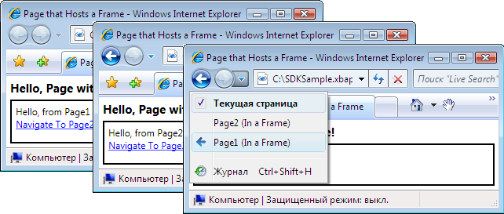  
  
 Вы не обязательно использовать только <xref:System.Windows.Controls.Frame> внутри содержимого <xref:System.Windows.Controls.Page>. Для размещения общих <xref:System.Windows.Controls.Frame> внутри содержимого <xref:System.Windows.Window>.  
  
 По умолчанию <xref:System.Windows.Controls.Frame> использует собственный журнал только при отсутствии другого журнала. Если <xref:System.Windows.Controls.Frame> является частью содержимого, которое размещено внутри <xref:System.Windows.Navigation.NavigationWindow> или [!INCLUDE[TLA2#tla_xbap](../../../../includes/tla2sharptla-xbap-md.md)], <xref:System.Windows.Controls.Frame> использует журнал, который принадлежит <xref:System.Windows.Navigation.NavigationWindow> или [!INCLUDE[TLA2#tla_xbap](../../../../includes/tla2sharptla-xbap-md.md)]. В некоторых случаях, <xref:System.Windows.Controls.Frame> может потребоваться отвечает за собственный журнал. Одна из причин для этого является необходимость разрешения переходов журнала на страницах, которые размещены <xref:System.Windows.Controls.Frame>. Это показано на следующем рисунке.  
  
 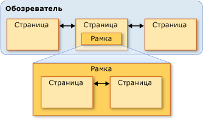  
  
 В этом случае можно настроить <xref:System.Windows.Controls.Frame> с помощью параметра собственный журнал <xref:System.Windows.Controls.Frame.JournalOwnership%2A> свойство <xref:System.Windows.Controls.Frame> для <xref:System.Windows.Navigation.JournalOwnership.OwnsJournal>. Это показано в следующем примере разметки.  
  
 [!code-xaml[NavigationOverviewSnippets#FrameHostPageOwnJournalXAML1](../../../../samples/snippets/csharp/VS_Snippets_Wpf/NavigationOverviewSnippets/CSharp/FrameHostPageOwnJournal.xaml#framehostpageownjournalxaml1)]  
[!code-xaml[NavigationOverviewSnippets#FrameHostPageOwnJournalXAML2](../../../../samples/snippets/csharp/VS_Snippets_Wpf/NavigationOverviewSnippets/CSharp/FrameHostPageOwnJournal.xaml#framehostpageownjournalxaml2)]  
[!code-xaml[NavigationOverviewSnippets#FrameHostPageOwnJournalXAML3](../../../../samples/snippets/csharp/VS_Snippets_Wpf/NavigationOverviewSnippets/CSharp/FrameHostPageOwnJournal.xaml#framehostpageownjournalxaml3)]  
  
 На следующем рисунке показано влияние перехода <xref:System.Windows.Controls.Frame> , используется собственный журнал.  
  
 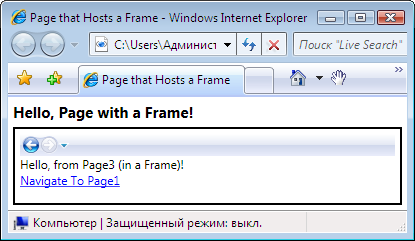  
  
 Обратите внимание, что записи журнала отображаются в области навигации [!INCLUDE[TLA2#tla_ui](../../../../includes/tla2sharptla-ui-md.md)] в <xref:System.Windows.Controls.Frame>, а не с помощью [!INCLUDE[TLA2#tla_ie](../../../../includes/tla2sharptla-ie-md.md)].  
  
> [!NOTE]
>  Если <xref:System.Windows.Controls.Frame> является частью содержимого, размещенного в <xref:System.Windows.Window>, <xref:System.Windows.Controls.Frame> использует собственный журнал и, следовательно, отображает собственный навигации [!INCLUDE[TLA2#tla_ui](../../../../includes/tla2sharptla-ui-md.md)].  
  
 Если вам требуется <xref:System.Windows.Controls.Frame> для предоставления собственный журнал без отображения навигации [!INCLUDE[TLA2#tla_ui](../../../../includes/tla2sharptla-ui-md.md)], можно скрыть навигации [!INCLUDE[TLA2#tla_ui](../../../../includes/tla2sharptla-ui-md.md)] , установив <xref:System.Windows.Controls.Frame.NavigationUIVisibility%2A> для <xref:System.Windows.Visibility.Hidden>. Это показано в следующем примере разметки.  
  
 [!code-xaml[NavigationOverviewSnippets#FrameHostPageHidesUIXAML1](../../../../samples/snippets/csharp/VS_Snippets_Wpf/NavigationOverviewSnippets/CSharp/FrameHostPageOwnHiddenJournal.xaml#framehostpagehidesuixaml1)]  
[!code-xaml[NavigationOverviewSnippets#FrameHostPageHidesUIXAML2](../../../../samples/snippets/csharp/VS_Snippets_Wpf/NavigationOverviewSnippets/CSharp/FrameHostPageOwnHiddenJournal.xaml#framehostpagehidesuixaml2)]  
[!code-xaml[NavigationOverviewSnippets#FrameHostPageHidesUIXAML3](../../../../samples/snippets/csharp/VS_Snippets_Wpf/NavigationOverviewSnippets/CSharp/FrameHostPageOwnHiddenJournal.xaml#framehostpagehidesuixaml3)]  
  
   
## Узлы переходов  
 <xref:System.Windows.Controls.Frame> и <xref:System.Windows.Navigation.NavigationWindow> являются классами, которые известны как узлы переходов. Объект *узла навигации* является классом, можно переходить к и отображения содержимого. Чтобы добиться этого, каждый узел навигации используется собственная <xref:System.Windows.Navigation.NavigationService> и журнала. На следующем рисунке показана основная структура узла переходов.  
  
   
  
 По сути, это позволяет <xref:System.Windows.Navigation.NavigationWindow> и <xref:System.Windows.Controls.Frame> обеспечить такую же поддержку переходов, [!INCLUDE[TLA2#tla_xbap](../../../../includes/tla2sharptla-xbap-md.md)] предоставляет при размещении в браузере.  
  
 Помимо использования <xref:System.Windows.Navigation.NavigationService> и журнала, узлы переходов реализуют те же члены, <xref:System.Windows.Navigation.NavigationService> реализует. Это показано на следующем рисунке.  
  
 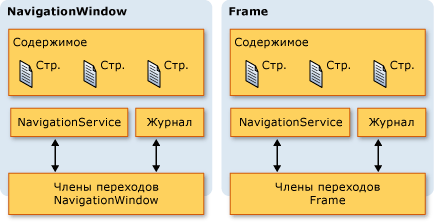  
  
 Это позволяет программировать поддержку переходов непосредственно с ними. Это можно использовать, если необходимо предоставить пользовательский навигационный [!INCLUDE[TLA2#tla_ui](../../../../includes/tla2sharptla-ui-md.md)] для <xref:System.Windows.Controls.Frame> , размещенном в <xref:System.Windows.Window>. Кроме того, оба типа реализуют дополнительные, связанных с навигацией члены, включая `BackStack` (<xref:System.Windows.Navigation.NavigationWindow.BackStack%2A?displayProperty=nameWithType>, <xref:System.Windows.Controls.Frame.BackStack%2A?displayProperty=nameWithType>) и `ForwardStack` (<xref:System.Windows.Navigation.NavigationWindow.ForwardStack%2A?displayProperty=nameWithType>, <xref:System.Windows.Controls.Frame.ForwardStack%2A?displayProperty=nameWithType>), позволяют перебирать записи журнала в обратно стек и переслать стека, соответственно.  
  
 Как упоминалось ранее, в приложении может существовать несколько журналов. На следующем рисунке показано пример, когда это возможно.  
  
   
  
   
## Переход к содержимому, отличному от страниц XAML  
 В этом разделе <xref:System.Windows.Controls.Page> и пакет [!INCLUDE[TLA2#tla_xbap#plural](../../../../includes/tla2sharptla-xbapsharpplural-md.md)] использовались демонстрируют различные возможности навигации [!INCLUDE[TLA2#tla_wpf](../../../../includes/tla2sharptla-wpf-md.md)]. Тем не менее <xref:System.Windows.Controls.Page> , скомпилированный в приложение не только с типом содержимого, к которому можно осуществить переход, и пакет [!INCLUDE[TLA2#tla_xbap#plural](../../../../includes/tla2sharptla-xbapsharpplural-md.md)] не является единственным способом определения содержимого.  
  
 Как показано в этом разделе, можно также перейти к свободным файлам [!INCLUDE[TLA2#tla_xaml](../../../../includes/tla2sharptla-xaml-md.md)] файлы, [!INCLUDE[TLA2#tla_html](../../../../includes/tla2sharptla-html-md.md)] файлы и объекты.  
  
   
### Переход к свободным файлам XAML  
 Свободный [!INCLUDE[TLA2#tla_xaml](../../../../includes/tla2sharptla-xaml-md.md)] файл — это файл со следующими характеристиками:  
  
-   Содержит только [!INCLUDE[TLA2#tla_xaml](../../../../includes/tla2sharptla-xaml-md.md)] (то есть, без кода).  
  
-   имеет объявление соответствующего пространства имен;  
  
-   имя файла имеет расширение XAML.  
  
 Например, рассмотрим следующее содержимое, сохраненное как свободный [!INCLUDE[TLA2#tla_xaml](../../../../includes/tla2sharptla-xaml-md.md)] файле Person.xaml.  
  
 [!code-xaml[NavigationOverviewSnippets#LooseXAML](../../../../samples/snippets/csharp/VS_Snippets_Wpf/NavigationOverviewSnippets/CSharp/Person.xaml#loosexaml)]  
  
 Если дважды щелкнуть файл, браузер откроется, выполнит переход к содержимому и отобразит его. Это показано на следующем рисунке.  
  
 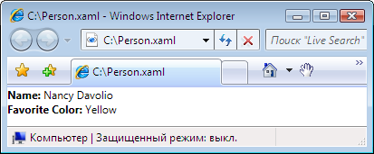  
  
 Можно отобразить свободный [!INCLUDE[TLA2#tla_xaml](../../../../includes/tla2sharptla-xaml-md.md)] файл из следующего:  
  
-   веб-узел на локальном компьютере, в интрасети или Интернете;  
  
-   Объект [!INCLUDE[TLA#tla_unc](../../../../includes/tlasharptla-unc-md.md)] общей папки.  
  
-   локальный диск.  
  
 Свободный [!INCLUDE[TLA2#tla_xaml](../../../../includes/tla2sharptla-xaml-md.md)] файл можно добавить в Избранное браузера или сделать домашней страницей браузера.  
  
> [!NOTE]
>  Дополнительные сведения о публикации и запуске свободных [!INCLUDE[TLA2#tla_xaml](../../../../includes/tla2sharptla-xaml-md.md)] страниц, в разделе [развертывания приложения WPF](../../../../docs/framework/wpf/app-development/deploying-a-wpf-application-wpf.md).  
  
 Единственным ограничением в отношении свободных [!INCLUDE[TLA2#tla_xaml](../../../../includes/tla2sharptla-xaml-md.md)] — что можно размещать только содержимое, которое безопасно для запуска в режиме частичного доверия. Например `Window` не может быть корневым элементом свободного [!INCLUDE[TLA2#tla_xaml](../../../../includes/tla2sharptla-xaml-md.md)] файла. Дополнительные сведения см. в разделе [Безопасность частичного доверия в WPF](../../../../docs/framework/wpf/wpf-partial-trust-security.md).  
  
   
### Переход к файлам HTML элемента управления Frame  
 Как и следует ожидать, вы также можете переходить к [!INCLUDE[TLA2#tla_html](../../../../includes/tla2sharptla-html-md.md)]. Необходимо просто предоставить [!INCLUDE[TLA2#tla_uri](../../../../includes/tla2sharptla-uri-md.md)] , использующий схему http. Например, следующая [!INCLUDE[TLA2#tla_xaml](../../../../includes/tla2sharptla-xaml-md.md)] показывает <xref:System.Windows.Controls.Frame> , переходит к [!INCLUDE[TLA2#tla_html](../../../../includes/tla2sharptla-html-md.md)] страницы.  
  
 [!code-xaml[NavigationOverviewSnippets#FrameHtmlNavMARKUP](../../../../samples/snippets/csharp/VS_Snippets_Wpf/NavigationOverviewSnippets/CSharp/FrameHTMLNavPage.xaml#framehtmlnavmarkup)]  
  
 Переход к [!INCLUDE[TLA2#tla_html](../../../../includes/tla2sharptla-html-md.md)] требует специальных разрешений. Например, нельзя перейти из [!INCLUDE[TLA2#tla_xbap](../../../../includes/tla2sharptla-xbap-md.md)] , на котором выполняется в изолированной безопасности частичного доверия для зоны Интернета. Дополнительные сведения см. в разделе [Безопасность частичного доверия в WPF](../../../../docs/framework/wpf/wpf-partial-trust-security.md).  
  
   
### Переход к файлам HTML с помощью элемента управления WebBrowser  
 <xref:System.Windows.Controls.WebBrowser> Управления поддерживает [!INCLUDE[TLA2#tla_html](../../../../includes/tla2sharptla-html-md.md)] размещение документа, навигации и сценариями и управляемым кодом. Дополнительные сведения о <xref:System.Windows.Controls.WebBrowser> управления см. в разделе <xref:System.Windows.Controls.WebBrowser>.  
  
 Как <xref:System.Windows.Controls.Frame>, перехода по страницам [!INCLUDE[TLA2#tla_html](../../../../includes/tla2sharptla-html-md.md)] с помощью <xref:System.Windows.Controls.WebBrowser> требует специальных разрешений. Например, из приложений с частичным доверием можно перейти только к [!INCLUDE[TLA2#tla_html](../../../../includes/tla2sharptla-html-md.md)] находится на исходном узле. Дополнительные сведения см. в разделе [Безопасность частичного доверия в WPF](../../../../docs/framework/wpf/wpf-partial-trust-security.md).  
  
   
### Переход к пользовательским объектам  
 Если у вас есть данные, которые хранятся в виде пользовательских объектов, один из способов отображения этих данных является создание <xref:System.Windows.Controls.Page> с содержимым, привязанным к таким объектам (см. [Общие сведения о привязке данных](../../../../docs/framework/wpf/data/data-binding-overview.md)). Если не требуется создание всей страницы только для отображения объектов, то можно перейти непосредственно к ним.  
  
 Рассмотрим `Person` класса, реализованный в следующем коде.  
  
 [!code-csharp[NavigateToObjectSnippets#PersonClassCODE](../../../../samples/snippets/csharp/VS_Snippets_Wpf/NavigateToObjectSnippets/CSharp/Person.cs#personclasscode)]
 [!code-vb[NavigateToObjectSnippets#PersonClassCODE](../../../../samples/snippets/visualbasic/VS_Snippets_Wpf/NavigateToObjectSnippets/VisualBasic/Person.vb#personclasscode)]  
  
 Чтобы перейти в эту папку, вызовите <xref:System.Windows.Navigation.NavigationWindow.Navigate%2A?displayProperty=nameWithType> метода, как показано в следующем примере кода.  
  
 [!code-xaml[NavigateToObjectSnippets#PageThatNavsToObject1](../../../../samples/snippets/csharp/VS_Snippets_Wpf/NavigateToObjectSnippets/CSharp/HomePage.xaml#pagethatnavstoobject1)]  
[!code-xaml[NavigateToObjectSnippets#PageThatNavsToObject2](../../../../samples/snippets/csharp/VS_Snippets_Wpf/NavigateToObjectSnippets/CSharp/HomePage.xaml#pagethatnavstoobject2)]  
[!code-xaml[NavigateToObjectSnippets#PageThatNavsToObject3](../../../../samples/snippets/csharp/VS_Snippets_Wpf/NavigateToObjectSnippets/CSharp/HomePage.xaml#pagethatnavstoobject3)]  
  
 [!code-csharp[NavigateToObjectSnippets#PageThatNavsToObjectCODEBEHIND](../../../../samples/snippets/csharp/VS_Snippets_Wpf/NavigateToObjectSnippets/CSharp/HomePage.xaml.cs#pagethatnavstoobjectcodebehind)]
 [!code-vb[NavigateToObjectSnippets#PageThatNavsToObjectCODEBEHIND](../../../../samples/snippets/visualbasic/VS_Snippets_Wpf/NavigateToObjectSnippets/VisualBasic/HomePage.xaml.vb#pagethatnavstoobjectcodebehind)]  
  
 На рисунке ниже показан результат.  
  
 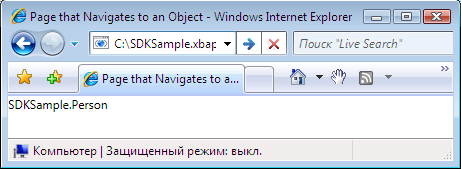  
  
 Из этого рисунка можно видеть, что ничего полезного не отобразилось. На самом деле отображаемое значение представляет возвращаемое значение `ToString` метод **лица** объекта; по умолчанию, это единственный значением, которое [!INCLUDE[TLA2#tla_wpf](../../../../includes/tla2sharptla-wpf-md.md)] можно использовать для представления объекта. Можно переопределить `ToString` метод для возврата более значимую информацию, несмотря на то, что он будет по-прежнему быть только строковым значением. Одним из способов можно использовать преимущества возможностей представления [!INCLUDE[TLA2#tla_wpf](../../../../includes/tla2sharptla-wpf-md.md)] заключается в использовании шаблона данных. Можно реализовать шаблон данных, [!INCLUDE[TLA2#tla_wpf](../../../../includes/tla2sharptla-wpf-md.md)] можно связать с объектом определенного типа. В следующем коде показано шаблон данных для `Person` объекта.  
  
 [!code-xaml[NavigateToObjectSnippets#DataTemplateMARKUP](../../../../samples/snippets/csharp/VS_Snippets_Wpf/NavigateToObjectSnippets/CSharp/App.xaml#datatemplatemarkup)]  
  
 Здесь шаблон данных связан с `Person` типа с помощью `x:Type` расширения разметки в `DataType` атрибута. Шаблон данных привязывается `TextBlock` элементов (см. <xref:System.Windows.Controls.TextBlock>) для свойства `Person` класса. На следующем рисунке показан обновленный внешний вид `Person` объекта.  
  
 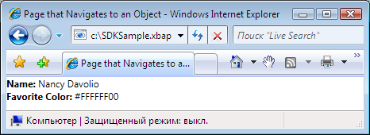  
  
 Преимуществом этого способа является связность, которая обеспечивается возможностью повторного использования шаблона данных для согласованного отображения объектов в любом месте приложения.  
  
 Дополнительные сведения о шаблонах данных см. в разделе [сведения о шаблонах данных](../../../../docs/framework/wpf/data/data-templating-overview.md).  
  
   
## Безопасность  
 [!INCLUDE[TLA2#tla_wpf](../../../../includes/tla2sharptla-wpf-md.md)] Поддержка навигации позволяет [!INCLUDE[TLA2#tla_xbap#plural](../../../../includes/tla2sharptla-xbapsharpplural-md.md)] осуществлять переходы через Интернет, а также позволяет приложениям для размещения содержимого сторонних разработчиков. Для защиты приложений и пользователей от опасных изменений [!INCLUDE[TLA2#tla_wpf](../../../../includes/tla2sharptla-wpf-md.md)] предоставляет широкий набор функций безопасности, которые рассматриваются в [безопасности](../../../../docs/framework/wpf/security-wpf.md) и [Безопасность частичного доверия WPF](../../../../docs/framework/wpf/wpf-partial-trust-security.md).  
  
## См. также  
 <xref:System.Windows.Application.SetCookie%2A>  
 <xref:System.Windows.Application.GetCookie%2A>  
 [Общие сведения об управлении приложением](../../../../docs/framework/wpf/app-development/application-management-overview.md)  
 [URI типа "pack" в WPF](../../../../docs/framework/wpf/app-development/pack-uris-in-wpf.md)  
 [Общие сведения о структурной навигации](../../../../docs/framework/wpf/app-development/structured-navigation-overview.md)  
 [Общие сведения о топологиях навигации](../../../../docs/framework/wpf/app-development/navigation-topologies-overview.md)  
 [Разделы практического руководства](../../../../docs/framework/wpf/app-development/navigation-how-to-topics.md)  
 [Развертывание приложений WPF](../../../../docs/framework/wpf/app-development/deploying-a-wpf-application-wpf.md)
