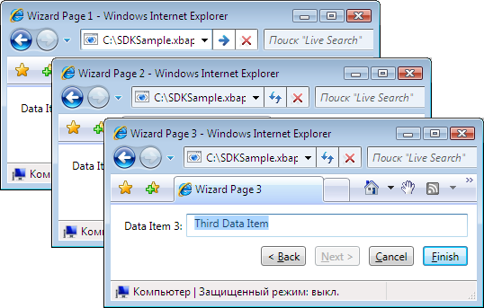
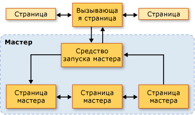
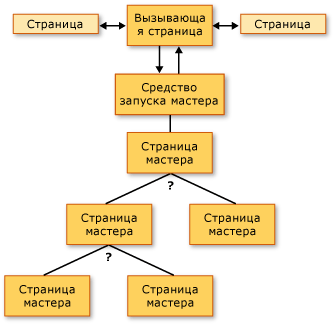
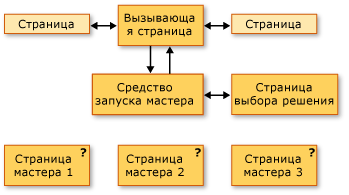
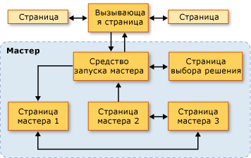

# Общие сведения о топологии переходовNavigation Topologies Overview
Данный обзор представляет собой введение в топологию переходов в [!INCLUDE[TLA2#tla_wpf](../../../../includes/tla2sharptla-wpf-md.md)]. This overview provides an introduction to navigation topologies in [!INCLUDE[TLA2#tla_wpf](../../../../includes/tla2sharptla-wpf-md.md)]. Последовательно рассматриваются три общие топологии навигации с примерами.Three common navigation topologies, with samples, are subsequently discussed.  
  
> [!NOTE]
>  Перед прочтением этого раздела следует ознакомиться с концепцией структурированных переходов в [!INCLUDE[TLA2#tla_wpf](../../../../includes/tla2sharptla-wpf-md.md)] с помощью функции страницы.Before reading this topic, you should be familiar with the concept of structured navigation in [!INCLUDE[TLA2#tla_wpf](../../../../includes/tla2sharptla-wpf-md.md)] using page functions. Дополнительные сведения об этих разделах см. в разделе [Structured Navigation Overview](../../../../docs/framework/wpf/app-development/structured-navigation-overview.md).For more information on both of these topics, see [Structured Navigation Overview](../../../../docs/framework/wpf/app-development/structured-navigation-overview.md).  
  
 В этом разделе содержатся следующие подразделы.This topic contains the following sections:  
  
-   [Топологии навигацииNavigation Topologies](#Navigation_Topologies)  
  
-   [Топологии структурной навигацииStructured Navigation Topologies](#Structured_Navigation_Topologies)  
  
-   [Навигация при фиксированной линейной топологииNavigation over a Fixed Linear Topology](#Navigation_over_a_Fixed_Linear_Topology)  
  
-   [Динамическая навигация при фиксированной иерархической топологииDynamic Navigation over a Fixed Hierarchical Topology](#Dynamic_Navigation_over_a_Fixed_Hierarchical_Topology)  
  
-   [Навигация при динамически создаваемой топологииNavigation over a Dynamically Generated Topology](#Navigation_over_a_Dynamically_Generated_Topology)  
  
   
## Топологии навигацииNavigation Topologies  
 В [!INCLUDE[TLA2#tla_wpf](../../../../includes/tla2sharptla-wpf-md.md)], переход обычно состоит из страниц (<xref:System.Windows.Controls.Page>) с гиперссылками (<xref:System.Windows.Documents.Hyperlink>), перейти на другие страницы, при нажатии.In [!INCLUDE[TLA2#tla_wpf](../../../../includes/tla2sharptla-wpf-md.md)], navigation typically consists of pages (<xref:System.Windows.Controls.Page>) with hyperlinks (<xref:System.Windows.Documents.Hyperlink>) that navigate to other pages when clicked. Страницы, просмотренные определялись [!INCLUDE[TLA#tla_uri#plural](../../../../includes/tlasharptla-urisharpplural-md.md)] (см. [пакет URI в WPF](../../../../docs/framework/wpf/app-development/pack-uris-in-wpf.md)).Pages that are navigated to are identified by [!INCLUDE[TLA#tla_uri#plural](../../../../includes/tlasharptla-urisharpplural-md.md)] (see [Pack URIs in WPF](../../../../docs/framework/wpf/app-development/pack-uris-in-wpf.md)). Рассмотрим следующий простой пример, отображающий страницы, гиперссылки, и [!INCLUDE[TLA#tla_uri#plural](../../../../includes/tlasharptla-urisharpplural-md.md)]:Consider the following simple example that shows pages, hyperlinks, and [!INCLUDE[TLA#tla_uri#plural](../../../../includes/tlasharptla-urisharpplural-md.md)]:  
  
 [!code-xaml[NavigationTopologiesOverviewSnippets#Page1](../../../../samples/snippets/csharp/VS_Snippets_Wpf/NavigationTopologiesOverviewSnippets/CS/Page1.xaml#page1)]  
  
 [!code-xaml[NavigationTopologiesOverviewSnippets#Page2](../../../../samples/snippets/csharp/VS_Snippets_Wpf/NavigationTopologiesOverviewSnippets/CS/Page2.xaml#page2)]  
  
 Эти страницы расположены в *топология переходов* , структура которого определяется как могут осуществлять переход между страницами.These pages are arranged in a *navigation topology* whose structure is determined by how you can navigate between the pages. Эта конкретная топология навигации подходит для простых сценариев, хотя навигация может требовать более сложные топологии, некоторые из которых могут быть определены только при запуске приложения.This particular navigation topology is suitable in simple scenarios, although navigation can require more complex topologies, some of which can only be defined when an application is running.  
  
 В этом разделе рассматриваются три общие топологии переходов: *Фиксированная линейная*, *фиксированная иерархическая*, и *динамически создаваемых*.This topic covers three common navigation topologies: *fixed linear*, *fixed hierarchical*, and *dynamically generated*. Каждая топология переходов демонстрируется пример, который имеет [!INCLUDE[TLA2#tla_ui](../../../../includes/tla2sharptla-ui-md.md)] как показано на следующем рисунке:Each navigation topology is demonstrated with a sample that has a [!INCLUDE[TLA2#tla_ui](../../../../includes/tla2sharptla-ui-md.md)] like the one that is shown in the following figure:  
  
   
  
   
## Топологии структурной навигацииStructured Navigation Topologies  
 Существует два широко известных типа топологии навигации.There are two broad types of navigation topologies:  
  
-   **Фиксированная топология**: определяется во время компиляции и не изменяется во время выполнения.**Fixed Topology**: defined at compile time and does not change at run time. Фиксированные топологии полезны для перехода по фиксированной последовательности страниц в линейном или иерархическом порядке.Fixed topologies are useful for navigation through a fixed sequence of pages in either a linear or hierarchical order.  
  
-   **Динамическая топология**: определяется во время выполнения на основе входных данных, собираемых от пользователей, приложений или системы.**Dynamic Topology**: defined at run time based on input that is collected from the user, the application, or the system. Динамические топологии полезны в тех случаях, когда на страницы можно переходить в разных последовательностях.Dynamic topologies are useful when pages can be navigated in different sequences.  
  
 Хотя возможно создание топологии навигации с помощью страниц, в примерах используются страничные функции, поскольку они предоставляют дополнительные возможности, которые упрощают поддержку передачи и возврата данных по страницам топологии.Although it is possible to create navigation topologies using pages, the samples use page functions because they provide additional support that simplifies support for passing and returning data through the pages of a topology.  
  
   
## Навигация при фиксированной линейной топологииNavigation over a Fixed Linear Topology  
 Фиксированная линейная топология является аналогом структуры мастера с одной или несколькими страницами, по которым можно переходить в фиксированной последовательности.A fixed linear topology is analogous to the structure of a wizard that has one or more wizard pages that are navigated in a fixed sequence. На следующем рисунке показана высокоуровневая структура и поток мастера с фиксированной линейной топологией.The following figure shows the high-level structure and flow of a wizard with a fixed linear topology.  
  
   
  
 Типичные варианты поведения для навигации по фиксированной линейной топологии могут быть следующие.The typical behaviors for navigating over a fixed linear topology include the following:  
  
-   Переход из вызывающей страницы на страницу средства запуска, которое инициализирует мастер и переходит к первой странице мастера.Navigating from the calling page to a launcher page that initializes the wizard and navigates to the first wizard page. Страница запуска ( [!INCLUDE[TLA2#tla_ui](../../../../includes/tla2sharptla-ui-md.md)]-меньше <xref:System.Windows.Navigation.PageFunction%601>) не является обязательным, так как вызывающая страница может напрямую вызывать первую страницу мастера.A launcher page (a [!INCLUDE[TLA2#tla_ui](../../../../includes/tla2sharptla-ui-md.md)]-less <xref:System.Windows.Navigation.PageFunction%601>) is not required, since a calling page can call the first wizard page directly. Однако используя страницу средства запуска, можно упростить инициализацию мастера, особенно если инициализация сложна.Using a launcher page, however, can simplify wizard initialization, particularly if initialization is complex.  
  
-   Пользователи могут переходить между страницами с помощью кнопок "Назад" и "Вперед" (или гиперссылок).Users can navigate between pages by using Back and Forward buttons (or hyperlinks).  
  
-   Пользователи могут переходить по страницам с помощью журнала.Users can navigate between pages using the journal.  
  
-   Пользователи могут отменить работу мастера на любой странице, нажав кнопку "Отмена".Users can cancel the wizard from any wizard page by pressing a Cancel button.  
  
-   Пользователи могут принять работу мастера на последней странице, нажав кнопку "Готово".Users can accept the wizard on the last wizard page by pressing a Finish button.  
  
-   Если мастер отменяется, то он возвращает соответствующий результат и не возвращает никаких данных.If a wizard is canceled, the wizard returns an appropriate result, and does not return any data.  
  
-   Если пользователь принимает работу мастера, мастер возвращает соответствующий результат и возвращает собранные им данные.If a user accepts a wizard, the wizard returns an appropriate result, and returns the data it collected.  
  
-   По завершении мастера (принятия или отмены) страницы, которые составляли мастер, будут удалены из журнала.When the wizard is complete (accepted or canceled), the pages that the wizard comprises are removed from the journal. Это сохраняет каждый экземпляр мастера изолированным, тем самым позволяя избежать потенциальных ошибок данных или состояния.This keeps each instance of the wizard isolated, thereby avoiding potential data or state anomalies.  
  
   
## Динамическая навигация при фиксированной иерархической топологииDynamic Navigation over a Fixed Hierarchical Topology  
 В некоторых приложениях страницы позволяют осуществлять переход на две или несколько страниц, как показано на следующем рисунке.In some applications, pages allow navigation to two or more other pages, as shown in the following figure.  
  
   
  
 Эта структура называется фиксированной иерархической топологией, и последовательность обхода иерархии часто определяется во время выполнения приложением или пользователем.This structure is known as a fixed hierarchical topology, and the sequence in which the hierarchy is traversed is often determined at run time by either the application or the user. Во время выполнения каждая страница в иерархии, позволяющая выполнять переходы на несколько страниц, собирает данные, необходимые для определения страниц для перехода.At run time, each page in the hierarchy that allows navigation to two or more other pages gathers the data required to determine which page to navigate to. Следующий рисунок иллюстрирует одну из нескольких возможных последовательностей переходов на основе предыдущего рисунка.The following figure illustrates one of several possible navigation sequences based on the previous figure.  
  
   
  
 Несмотря на то, что последовательность переходов по страницам в фиксированной иерархической структуре определяется во время выполнения, взаимодействие с пользователем такое же, как в фиксированной линейной топологии.Even though the sequence in which pages in a fixed hierarchical structure are navigated is determined at run time, the user experience is the same as the user experience for a fixed linear topology:  
  
-   Переход из вызывающей страницы на страницу средства запуска, которое инициализирует мастер и переходит к первой странице мастера.Navigating from the calling page to a launcher page that initializes the wizard and navigates to the first wizard page. Страница запуска ( [!INCLUDE[TLA2#tla_ui](../../../../includes/tla2sharptla-ui-md.md)]-меньше <xref:System.Windows.Navigation.PageFunction%601>) не является обязательным, так как вызывающая страница может напрямую вызывать первую страницу мастера.A launcher page (a [!INCLUDE[TLA2#tla_ui](../../../../includes/tla2sharptla-ui-md.md)]-less <xref:System.Windows.Navigation.PageFunction%601>) is not required, since a calling page can call the first wizard page directly. Однако используя страницу средства запуска, можно упростить инициализацию мастера, особенно если инициализация сложна.Using a launcher page, however, can simplify wizard initialization, particularly if initialization is complex.  
  
-   Пользователи могут переходить между страницами с помощью кнопок "Назад" и "Вперед" (или гиперссылок).Users can navigate between pages by using Back and Forward buttons (or hyperlinks).  
  
-   Пользователи могут переходить по страницам с помощью журнала.Users can navigate between pages using the journal.  
  
-   Пользователи могут изменять последовательность навигации, если они перемещаются назад по журналу.Users can change the navigation sequence if they navigate back through the journal.  
  
-   Пользователи могут отменить работу мастера на любой странице, нажав кнопку "Отмена".Users can cancel the wizard from any wizard page by pressing a Cancel button.  
  
-   Пользователи могут принять работу мастера на последней странице, нажав кнопку "Готово".Users can accept the wizard on the last wizard page by pressing a Finish button.  
  
-   Если мастер отменяется, то он возвращает соответствующий результат и не возвращает никаких данных.If a wizard is canceled, the wizard returns an appropriate result, and does not return any data.  
  
-   Если пользователь принимает работу мастера, мастер возвращает соответствующий результат и возвращает собранные им данные.If a user accepts a wizard, the wizard returns an appropriate result, and returns the data it collected.  
  
-   По завершении мастера (принятия или отмены) страницы, которые составляли мастер, будут удалены из журнала.When the wizard is complete (accepted or canceled), the pages that the wizard comprises are removed from the journal. Это сохраняет каждый экземпляр мастера изолированным, тем самым позволяя избежать потенциальных ошибок данных или состояния.This keeps each instance of the wizard isolated, thereby avoiding potential data or state anomalies.  
  
   
## Навигация при динамически создаваемой топологииNavigation over a Dynamically Generated Topology  
 В некоторых приложениях последовательность, в которой осуществляется переход на две или более страниц, может быть определена только во время выполнения пользователем, приложением или внешними данными.In some applications, the sequence in which two or more pages are navigated can only be determined at run time, whether by the user, the application, or external data. Следующий рисунок иллюстрирует набор страниц с неопределенной последовательностью навигации.The following figure illustrates a set of pages with an undetermined navigation sequence.  
  
   
  
 На следующем рисунке показана последовательность навигации, которая была выбрана пользователем во время выполнения.The next figure illustrates a navigation sequence that was chosen by the user at run time.  
  
   
  
 Эта последовательность навигации называется динамически создаваемой топологией.The navigation sequence is known as a dynamically generated topology. Взаимодействие с пользователем такое же, как и в предыдущих топологиях навигации.For the user, as with the other navigation topologies, the user experience is the same as it is for the previous topologies:  
  
-   Переход из вызывающей страницы на страницу средства запуска, которое инициализирует мастер и переходит к первой странице мастера.Navigating from the calling page to a launcher page that initializes the wizard and navigates to the first wizard page. Страница запуска ( [!INCLUDE[TLA2#tla_ui](../../../../includes/tla2sharptla-ui-md.md)]-меньше <xref:System.Windows.Navigation.PageFunction%601>) не является обязательным, так как вызывающая страница может напрямую вызывать первую страницу мастера.A launcher page (a [!INCLUDE[TLA2#tla_ui](../../../../includes/tla2sharptla-ui-md.md)]-less <xref:System.Windows.Navigation.PageFunction%601>) is not required, since a calling page can call the first wizard page directly. Однако используя страницу средства запуска, можно упростить инициализацию мастера, особенно если инициализация сложна.Using a launcher page, however, can simplify wizard initialization, particularly if initialization is complex.  
  
-   Пользователи могут переходить между страницами с помощью кнопок "Назад" и "Вперед" (или гиперссылок).Users can navigate between pages by using Back and Forward buttons (or hyperlinks).  
  
-   Пользователи могут переходить по страницам с помощью журнала.Users can navigate between pages using the journal.  
  
-   Пользователи могут отменить работу мастера на любой странице, нажав кнопку "Отмена".Users can cancel the wizard from any wizard page by pressing a Cancel button.  
  
-   Пользователи могут принять работу мастера на последней странице, нажав кнопку "Готово".Users can accept the wizard on the last wizard page by pressing a Finish button.  
  
-   Если мастер отменяется, то он возвращает соответствующий результат и не возвращает никаких данных.If a wizard is canceled, the wizard returns an appropriate result, and does not return any data.  
  
-   Если пользователь принимает работу мастера, мастер возвращает соответствующий результат и возвращает собранные им данные.If a user accepts a wizard, the wizard returns an appropriate result, and returns the data it collected.  
  
-   По завершении мастера (принятия или отмены) страницы, которые составляли мастер, будут удалены из журнала.When the wizard is complete (accepted or canceled), the pages that the wizard comprises are removed from the journal. Это сохраняет каждый экземпляр мастера изолированным, тем самым позволяя избежать потенциальных ошибок данных или состояния.This keeps each instance of the wizard isolated, thereby avoiding potential data or state anomalies.  
  
## См. такжеSee Also  
 <xref:System.Windows.Controls.Page>  
 <xref:System.Windows.Navigation.PageFunction%601>  
 <xref:System.Windows.Navigation.NavigationService>  
 [Общие сведения о структурной навигацииStructured Navigation Overview](../../../../docs/framework/wpf/app-development/structured-navigation-overview.md)
