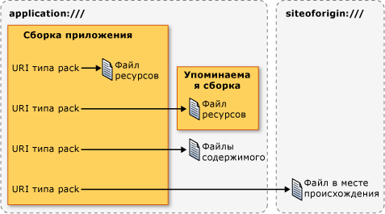

# <a name="pack-uris-in-wpf"></a><span data-ttu-id="f3a1e-102">URI типа "pack" в WPF</span><span class="sxs-lookup"><span data-stu-id="f3a1e-102">Pack URIs in WPF</span></span>
<span data-ttu-id="f3a1e-103">В [!INCLUDE[TLA#tla_wpf](../../../../includes/tlasharptla-wpf-md.md)], [!INCLUDE[TLA#tla_uri#plural](../../../../includes/tlasharptla-urisharpplural-md.md)] используются для идентификации и загрузки файлов несколькими способами, включая следующие:</span><span class="sxs-lookup"><span data-stu-id="f3a1e-103">In [!INCLUDE[TLA#tla_wpf](../../../../includes/tlasharptla-wpf-md.md)], [!INCLUDE[TLA#tla_uri#plural](../../../../includes/tlasharptla-urisharpplural-md.md)] are used to identify and load files in many ways, including the following:</span></span>  
  
-   <span data-ttu-id="f3a1e-104">Указание [!INCLUDE[TLA#tla_ui](../../../../includes/tlasharptla-ui-md.md)] для отображения при первом запуске приложения.</span><span class="sxs-lookup"><span data-stu-id="f3a1e-104">Specifying the [!INCLUDE[TLA#tla_ui](../../../../includes/tlasharptla-ui-md.md)] to show when an application first starts.</span></span>  
  
-   <span data-ttu-id="f3a1e-105">Загрузка изображений.</span><span class="sxs-lookup"><span data-stu-id="f3a1e-105">Loading images.</span></span>  
  
-   <span data-ttu-id="f3a1e-106">Переход по страницам.</span><span class="sxs-lookup"><span data-stu-id="f3a1e-106">Navigating to pages.</span></span>  
  
-   <span data-ttu-id="f3a1e-107">Загрузка неисполняемых файлов данных.</span><span class="sxs-lookup"><span data-stu-id="f3a1e-107">Loading non-executable data files.</span></span>  
  
 <span data-ttu-id="f3a1e-108">Кроме того [!INCLUDE[TLA2#tla_uri#plural](../../../../includes/tla2sharptla-urisharpplural-md.md)] может использоваться для идентификации и загрузки файлов из различных мест, включая следующие:</span><span class="sxs-lookup"><span data-stu-id="f3a1e-108">Furthermore, [!INCLUDE[TLA2#tla_uri#plural](../../../../includes/tla2sharptla-urisharpplural-md.md)] can be used to identify and load files from a variety of locations, including the following:</span></span>  
  
-   <span data-ttu-id="f3a1e-109">Текущая сборка.</span><span class="sxs-lookup"><span data-stu-id="f3a1e-109">The current assembly.</span></span>  
  
-   <span data-ttu-id="f3a1e-110">Указанная ссылками сборка.</span><span class="sxs-lookup"><span data-stu-id="f3a1e-110">A referenced assembly.</span></span>  
  
-   <span data-ttu-id="f3a1e-111">Расположение, связанное со сборкой.</span><span class="sxs-lookup"><span data-stu-id="f3a1e-111">A location relative to an assembly.</span></span>  
  
-   <span data-ttu-id="f3a1e-112">Исходный узел приложения.</span><span class="sxs-lookup"><span data-stu-id="f3a1e-112">The application's site of origin.</span></span>  
  
 <span data-ttu-id="f3a1e-113">Для обеспечения согласованного механизма идентификации и загрузки этих типов файлов в указанных расположениях [!INCLUDE[TLA2#tla_wpf](../../../../includes/tla2sharptla-wpf-md.md)] использует расширяемость *схема URI упаковки*.</span><span class="sxs-lookup"><span data-stu-id="f3a1e-113">To provide a consistent mechanism for identifying and loading these types of files from these locations, [!INCLUDE[TLA2#tla_wpf](../../../../includes/tla2sharptla-wpf-md.md)] leverages the extensibility of the *pack URI scheme*.</span></span> <span data-ttu-id="f3a1e-114">В этом разделе содержатся общие сведения о схеме, описывается, как построение пакета [!INCLUDE[TLA2#tla_uri#plural](../../../../includes/tla2sharptla-urisharpplural-md.md)] для различных сценариев, рассматриваются абсолютными и относительными [!INCLUDE[TLA2#tla_uri#plural](../../../../includes/tla2sharptla-urisharpplural-md.md)] и [!INCLUDE[TLA2#tla_uri](../../../../includes/tla2sharptla-uri-md.md)] разрешение как использовать пакет [!INCLUDE[TLA2#tla_uri#plural](../../../../includes/tla2sharptla-urisharpplural-md.md)] из обоих разметки и код.</span><span class="sxs-lookup"><span data-stu-id="f3a1e-114">This topic provides an overview of the scheme, covers how to construct pack [!INCLUDE[TLA2#tla_uri#plural](../../../../includes/tla2sharptla-urisharpplural-md.md)] for a variety of scenarios, discusses absolute and relative [!INCLUDE[TLA2#tla_uri#plural](../../../../includes/tla2sharptla-urisharpplural-md.md)] and [!INCLUDE[TLA2#tla_uri](../../../../includes/tla2sharptla-uri-md.md)] resolution, before showing how to use pack [!INCLUDE[TLA2#tla_uri#plural](../../../../includes/tla2sharptla-urisharpplural-md.md)] from both markup and code.</span></span>  
  
  
<a name="The_Pack_URI_Scheme"></a>   
## <a name="the-pack-uri-scheme"></a><span data-ttu-id="f3a1e-115">Схема URI типа "pack"</span><span class="sxs-lookup"><span data-stu-id="f3a1e-115">The Pack URI Scheme</span></span>  
 <span data-ttu-id="f3a1e-116">Данный пакет [!INCLUDE[TLA2#tla_uri](../../../../includes/tla2sharptla-uri-md.md)] схемы, используемой [Open Packaging Conventions](http://go.microsoft.com/fwlink/?LinkID=71255) спецификации (OPC), которая описывает модель для организации и идентификации содержимого.</span><span class="sxs-lookup"><span data-stu-id="f3a1e-116">The pack [!INCLUDE[TLA2#tla_uri](../../../../includes/tla2sharptla-uri-md.md)] scheme is used by the [Open Packaging Conventions](http://go.microsoft.com/fwlink/?LinkID=71255) (OPC) specification, which describes a model for organizing and identifying content.</span></span> <span data-ttu-id="f3a1e-117">Основными элементами этой модели являются пакеты и части, где *пакета* — это логический контейнер для одного или более логическими *частей*.</span><span class="sxs-lookup"><span data-stu-id="f3a1e-117">The key elements of this model are packages and parts, where a *package* is a logical container for one or more logical *parts*.</span></span> <span data-ttu-id="f3a1e-118">Эта структура показана на следующем рисунке.</span><span class="sxs-lookup"><span data-stu-id="f3a1e-118">The following figure illustrates this concept.</span></span>  
  
 <span data-ttu-id="f3a1e-119"></span><span class="sxs-lookup"><span data-stu-id="f3a1e-119"></span></span>  
  
 <span data-ttu-id="f3a1e-120">Для определения частей, спецификации OPC использует расширяемость RFC 2396 (универсальных кодов ресурса (URI): общий синтаксис) для определения пакете [!INCLUDE[TLA2#tla_uri](../../../../includes/tla2sharptla-uri-md.md)] схемы.</span><span class="sxs-lookup"><span data-stu-id="f3a1e-120">To identify parts, the OPC specification leverages the extensibility of RFC 2396 (Uniform Resource Identifiers (URI): Generic Syntax) to define the pack [!INCLUDE[TLA2#tla_uri](../../../../includes/tla2sharptla-uri-md.md)] scheme.</span></span>  
  
 <span data-ttu-id="f3a1e-121">Схемы, который задается параметром [!INCLUDE[TLA2#tla_uri](../../../../includes/tla2sharptla-uri-md.md)] определяется его префикс; http, ftp и файл, известных примеров.</span><span class="sxs-lookup"><span data-stu-id="f3a1e-121">The scheme that is specified by a [!INCLUDE[TLA2#tla_uri](../../../../includes/tla2sharptla-uri-md.md)] is defined by its prefix; http, ftp, and file are well-known examples.</span></span> <span data-ttu-id="f3a1e-122">Данный пакет [!INCLUDE[TLA2#tla_uri](../../../../includes/tla2sharptla-uri-md.md)] схема использует «пакет» в качестве схемы и содержит два компонента: полномочия и путь.</span><span class="sxs-lookup"><span data-stu-id="f3a1e-122">The pack [!INCLUDE[TLA2#tla_uri](../../../../includes/tla2sharptla-uri-md.md)] scheme uses "pack" as its scheme, and contains two components: authority and path.</span></span> <span data-ttu-id="f3a1e-123">Формат пакета [!INCLUDE[TLA2#tla_uri](../../../../includes/tla2sharptla-uri-md.md)].</span><span class="sxs-lookup"><span data-stu-id="f3a1e-123">The following is the format for a pack [!INCLUDE[TLA2#tla_uri](../../../../includes/tla2sharptla-uri-md.md)].</span></span>  
  
 <span data-ttu-id="f3a1e-124">пакет: / /*центр*/*путь*</span><span class="sxs-lookup"><span data-stu-id="f3a1e-124">pack://*authority*/*path*</span></span>
  
 <span data-ttu-id="f3a1e-125">*Центр* указывает тип пакета, которое находится элемент, пока *путь* указывает расположение части внутри пакета.</span><span class="sxs-lookup"><span data-stu-id="f3a1e-125">The *authority* specifies the type of package that a part is contained by, while the *path* specifies the location of a part within a package.</span></span>  
  
 <span data-ttu-id="f3a1e-126">Эта концепция показана на следующей схеме:</span><span class="sxs-lookup"><span data-stu-id="f3a1e-126">This concept is illustrated by the following figure:</span></span>  
  
 <span data-ttu-id="f3a1e-127"></span><span class="sxs-lookup"><span data-stu-id="f3a1e-127"></span></span>  
  
 <span data-ttu-id="f3a1e-128">Пакеты и элементы аналогичны приложениям и файлам. Приложение (пакет) может содержать один или несколько файлов (элементов), в том числе:</span><span class="sxs-lookup"><span data-stu-id="f3a1e-128">Packages and parts are analogous to applications and files, where an application (package) can include one or more files (parts), including:</span></span>  
  
-   <span data-ttu-id="f3a1e-129">Файлы ресурсов, скомпилированные в локальную сборку.</span><span class="sxs-lookup"><span data-stu-id="f3a1e-129">Resource files that are compiled into the local assembly.</span></span>  
  
-   <span data-ttu-id="f3a1e-130">Файлы ресурсов, скомпилированные в сборку, на которую указывает ссылка.</span><span class="sxs-lookup"><span data-stu-id="f3a1e-130">Resource files that are compiled into a referenced assembly.</span></span>  
  
-   <span data-ttu-id="f3a1e-131">Файлы ресурсов, скомпилированные в ссылающуюся сборку.</span><span class="sxs-lookup"><span data-stu-id="f3a1e-131">Resource files that are compiled into a referencing assembly.</span></span>  
  
-   <span data-ttu-id="f3a1e-132">Файлы содержимого.</span><span class="sxs-lookup"><span data-stu-id="f3a1e-132">Content files.</span></span>  
  
-   <span data-ttu-id="f3a1e-133">Файлы исходного узла.</span><span class="sxs-lookup"><span data-stu-id="f3a1e-133">Site of origin files.</span></span>  
  
 <span data-ttu-id="f3a1e-134">Для доступа к этим типам файлов, [!INCLUDE[TLA2#tla_wpf](../../../../includes/tla2sharptla-wpf-md.md)] поддерживает два центров: приложение: / / / и siteoforigin: / / /.</span><span class="sxs-lookup"><span data-stu-id="f3a1e-134">To access these types of files, [!INCLUDE[TLA2#tla_wpf](../../../../includes/tla2sharptla-wpf-md.md)] supports two authorities: application:/// and siteoforigin:///.</span></span> <span data-ttu-id="f3a1e-135">Центр application:/// определяет файлы данных приложения, известные во время компиляции, включая файлы ресурсов и файлы содержимого.</span><span class="sxs-lookup"><span data-stu-id="f3a1e-135">The application:/// authority identifies application data files that are known at compile time, including resource and content files.</span></span> <span data-ttu-id="f3a1e-136">Центр siteoforigin:/// определяет файлы исходного узла.</span><span class="sxs-lookup"><span data-stu-id="f3a1e-136">The siteoforigin:/// authority identifies site of origin files.</span></span> <span data-ttu-id="f3a1e-137">На следующем рисунке показана область каждого центра.</span><span class="sxs-lookup"><span data-stu-id="f3a1e-137">The scope of each authority is shown in the following figure.</span></span>  
  
 <span data-ttu-id="f3a1e-138"></span><span class="sxs-lookup"><span data-stu-id="f3a1e-138"></span></span>  
  
> [!NOTE]
>  <span data-ttu-id="f3a1e-139">Компонент центра пакета [!INCLUDE[TLA2#tla_uri](../../../../includes/tla2sharptla-uri-md.md)] является встроенным [!INCLUDE[TLA2#tla_uri](../../../../includes/tla2sharptla-uri-md.md)] , указывающий на пакет и должен соответствовать стандарту RFC 2396.</span><span class="sxs-lookup"><span data-stu-id="f3a1e-139">The authority component of a pack [!INCLUDE[TLA2#tla_uri](../../../../includes/tla2sharptla-uri-md.md)] is an embedded [!INCLUDE[TLA2#tla_uri](../../../../includes/tla2sharptla-uri-md.md)] that points to a package and must conform to RFC 2396.</span></span> <span data-ttu-id="f3a1e-140">Кроме того, символ "/" необходимо заменить символом ",", и необходимо обособлять escape-символами такие зарезервированные символы, как "%" и "?".</span><span class="sxs-lookup"><span data-stu-id="f3a1e-140">Additionally, the "/" character must be replaced with the "," character, and reserved characters such as "%" and "?" must be escaped.</span></span> <span data-ttu-id="f3a1e-141">Подробные сведения см. в OPC.</span><span class="sxs-lookup"><span data-stu-id="f3a1e-141">See the OPC for details.</span></span>  
  
 <span data-ttu-id="f3a1e-142">В следующих разделах рассматривается построение пакета [!INCLUDE[TLA2#tla_uri#plural](../../../../includes/tla2sharptla-urisharpplural-md.md)] с использованием этих полномочий с соответствующими путями для идентификации ресурсов, содержимое и файлы исходного узла.</span><span class="sxs-lookup"><span data-stu-id="f3a1e-142">The following sections explain how to construct pack [!INCLUDE[TLA2#tla_uri#plural](../../../../includes/tla2sharptla-urisharpplural-md.md)] using these two authorities in conjunction with the appropriate paths for identifying resource, content, and site of origin files.</span></span>  
  
<a name="Resource_File_Pack_URIs___Local_Assembly"></a>   
## <a name="resource-file-pack-uris"></a><span data-ttu-id="f3a1e-143">URI типа "pack" для файла ресурсов</span><span class="sxs-lookup"><span data-stu-id="f3a1e-143">Resource File Pack URIs</span></span>  
 <span data-ttu-id="f3a1e-144">Файлы ресурсов настраиваются как [!INCLUDE[TLA2#tla_msbuild](../../../../includes/tla2sharptla-msbuild-md.md)] `Resource` элементы и компилируются в сборки.</span><span class="sxs-lookup"><span data-stu-id="f3a1e-144">Resource files are configured as [!INCLUDE[TLA2#tla_msbuild](../../../../includes/tla2sharptla-msbuild-md.md)]`Resource` items and are compiled into assemblies.</span></span> [!INCLUDE[TLA2#tla_wpf](../../../../includes/tla2sharptla-wpf-md.md)]<span data-ttu-id="f3a1e-145">поддерживает конструирование пакета [!INCLUDE[TLA2#tla_uri#plural](../../../../includes/tla2sharptla-urisharpplural-md.md)] может использоваться для идентификации файлов ресурсов, скомпилированные в локальную сборку или компилируется в сборку, на который ссылается локальной сборки.</span><span class="sxs-lookup"><span data-stu-id="f3a1e-145"> supports the construction of pack [!INCLUDE[TLA2#tla_uri#plural](../../../../includes/tla2sharptla-urisharpplural-md.md)] that can be used to identify resource files that are either compiled into the local assembly or compiled into an assembly that is referenced from the local assembly.</span></span>  
  
<a name="Local_Assembly_Resource_File"></a>   
### <a name="local-assembly-resource-file"></a><span data-ttu-id="f3a1e-146">Файл ресурсов локальной сборки</span><span class="sxs-lookup"><span data-stu-id="f3a1e-146">Local Assembly Resource File</span></span>  
 <span data-ttu-id="f3a1e-147">Данный пакет [!INCLUDE[TLA2#tla_uri](../../../../includes/tla2sharptla-uri-md.md)] для ресурса файла, который компилируется в локальную сборку использует следующие полномочия и путь:</span><span class="sxs-lookup"><span data-stu-id="f3a1e-147">The pack [!INCLUDE[TLA2#tla_uri](../../../../includes/tla2sharptla-uri-md.md)] for a resource file that is compiled into the local assembly uses the following authority and path:</span></span>  
  
-   <span data-ttu-id="f3a1e-148">**Центр**: application:///.</span><span class="sxs-lookup"><span data-stu-id="f3a1e-148">**Authority**: application:///.</span></span>  
  
-   <span data-ttu-id="f3a1e-149">**Путь**: имя файла ресурсов, включая его путь относительно корневой папки проекта локальной сборки.</span><span class="sxs-lookup"><span data-stu-id="f3a1e-149">**Path**: The name of the resource file, including its path, relative to the local assembly project folder root.</span></span>  
  
 <span data-ttu-id="f3a1e-150">В следующем примере показано пакете [!INCLUDE[TLA2#tla_uri](../../../../includes/tla2sharptla-uri-md.md)] для [!INCLUDE[TLA2#tla_xaml](../../../../includes/tla2sharptla-xaml-md.md)] ресурсов в файле, расположенном в корневой папке проекта локальной сборки.</span><span class="sxs-lookup"><span data-stu-id="f3a1e-150">The following example shows the pack [!INCLUDE[TLA2#tla_uri](../../../../includes/tla2sharptla-uri-md.md)] for a [!INCLUDE[TLA2#tla_xaml](../../../../includes/tla2sharptla-xaml-md.md)] resource file that is located in the root of the local assembly's project folder.</span></span>  
  
 `pack://application:,,,/ResourceFile.xaml`  
  
 <span data-ttu-id="f3a1e-151">В следующем примере показано пакете [!INCLUDE[TLA2#tla_uri](../../../../includes/tla2sharptla-uri-md.md)] для [!INCLUDE[TLA2#tla_xaml](../../../../includes/tla2sharptla-xaml-md.md)] файла ресурсов, который находится во вложенной папке проекта локальной сборки.</span><span class="sxs-lookup"><span data-stu-id="f3a1e-151">The following example shows the pack [!INCLUDE[TLA2#tla_uri](../../../../includes/tla2sharptla-uri-md.md)] for a [!INCLUDE[TLA2#tla_xaml](../../../../includes/tla2sharptla-xaml-md.md)] resource file that is located in a subfolder of the local assembly's project folder.</span></span>  
  
 `pack://application:,,,/Subfolder/ResourceFile.xaml`  
  
<a name="Resource_File_Pack_URIs___Referenced_Assembly"></a>   
### <a name="referenced-assembly-resource-file"></a><span data-ttu-id="f3a1e-152">Файл ресурсов указанной ссылками сборки</span><span class="sxs-lookup"><span data-stu-id="f3a1e-152">Referenced Assembly Resource File</span></span>  
 <span data-ttu-id="f3a1e-153">Данный пакет [!INCLUDE[TLA2#tla_uri](../../../../includes/tla2sharptla-uri-md.md)] для ресурса файла, который компилируется в сборку использует следующие полномочия и путь:</span><span class="sxs-lookup"><span data-stu-id="f3a1e-153">The pack [!INCLUDE[TLA2#tla_uri](../../../../includes/tla2sharptla-uri-md.md)] for a resource file that is compiled into a referenced assembly uses the following authority and path:</span></span>  
  
-   <span data-ttu-id="f3a1e-154">**Центр**: application:///.</span><span class="sxs-lookup"><span data-stu-id="f3a1e-154">**Authority**: application:///.</span></span>  
  
-   <span data-ttu-id="f3a1e-155">**Путь**: имя файла ресурсов, который компилируется в указанную ссылками сборку.</span><span class="sxs-lookup"><span data-stu-id="f3a1e-155">**Path**: The name of a resource file that is compiled into a referenced assembly.</span></span> <span data-ttu-id="f3a1e-156">Путь должен соответствовать следующему формату:</span><span class="sxs-lookup"><span data-stu-id="f3a1e-156">The path must conform to the following format:</span></span>  
  
     <span data-ttu-id="f3a1e-157">*AssemblyShortName*{*; Версия*] {*; PublicKey*]; component /*путь*</span><span class="sxs-lookup"><span data-stu-id="f3a1e-157">*AssemblyShortName*{*;Version*]{*;PublicKey*];component/*Path*</span></span>  
  
    -   <span data-ttu-id="f3a1e-158">**AssemblyShortName** — краткое имя для указанной ссылками сборки.</span><span class="sxs-lookup"><span data-stu-id="f3a1e-158">**AssemblyShortName**: the short name for the referenced assembly.</span></span>  
  
    -   <span data-ttu-id="f3a1e-159">**;Version** [необязательно] — версия указанной ссылками сборки, которая содержит файл ресурсов.</span><span class="sxs-lookup"><span data-stu-id="f3a1e-159">**;Version** [optional]: the version of the referenced assembly that contains the resource file.</span></span> <span data-ttu-id="f3a1e-160">Используется при загрузке двух или более указанных ссылками сборок с одинаковым кратким именем.</span><span class="sxs-lookup"><span data-stu-id="f3a1e-160">This is used when two or more referenced assemblies with the same short name are loaded.</span></span>  
  
    -   <span data-ttu-id="f3a1e-161">**;PublicKey** [необязательно]: открытый ключ, который использовался для подписи указанной ссылками сборки.</span><span class="sxs-lookup"><span data-stu-id="f3a1e-161">**;PublicKey** [optional]: the public key that was used to sign the referenced assembly.</span></span> <span data-ttu-id="f3a1e-162">Используется при загрузке двух или более указанных ссылками сборок с одинаковым кратким именем.</span><span class="sxs-lookup"><span data-stu-id="f3a1e-162">This is used when two or more referenced assemblies with the same short name are loaded.</span></span>  
  
    -   <span data-ttu-id="f3a1e-163">**;component**: указывает, что на упоминаемую сборку ссылается локальная сборка.</span><span class="sxs-lookup"><span data-stu-id="f3a1e-163">**;component**: specifies that the assembly being referred to is referenced from the local assembly.</span></span>  
  
    -   <span data-ttu-id="f3a1e-164">**/Path**: имя файла ресурсов, включая его путь относительно корневой папки проекта указанной ссылками сборки.</span><span class="sxs-lookup"><span data-stu-id="f3a1e-164">**/Path**: the name of the resource file, including its path, relative to the root of the referenced assembly's project folder.</span></span>  
  
 <span data-ttu-id="f3a1e-165">В следующем примере показано пакете [!INCLUDE[TLA2#tla_uri](../../../../includes/tla2sharptla-uri-md.md)] для [!INCLUDE[TLA2#tla_xaml](../../../../includes/tla2sharptla-xaml-md.md)] ресурсов в файле, расположенном в корневой папке проекта ссылочной сборки.</span><span class="sxs-lookup"><span data-stu-id="f3a1e-165">The following example shows the pack [!INCLUDE[TLA2#tla_uri](../../../../includes/tla2sharptla-uri-md.md)] for a [!INCLUDE[TLA2#tla_xaml](../../../../includes/tla2sharptla-xaml-md.md)] resource file that is located in the root of the referenced assembly's project folder.</span></span>  
  
 `pack://application:,,,/ReferencedAssembly;component/ResourceFile.xaml`  
  
 <span data-ttu-id="f3a1e-166">В следующем примере показано пакете [!INCLUDE[TLA2#tla_uri](../../../../includes/tla2sharptla-uri-md.md)] для [!INCLUDE[TLA2#tla_xaml](../../../../includes/tla2sharptla-xaml-md.md)] файла ресурсов, который находится во вложенной папке проекта ссылочной сборки.</span><span class="sxs-lookup"><span data-stu-id="f3a1e-166">The following example shows the pack [!INCLUDE[TLA2#tla_uri](../../../../includes/tla2sharptla-uri-md.md)] for a [!INCLUDE[TLA2#tla_xaml](../../../../includes/tla2sharptla-xaml-md.md)] resource file that is located in a subfolder of the referenced assembly's project folder.</span></span>  
  
 `pack://application:,,,/ReferencedAssembly;component/Subfolder/ResourceFile.xaml`  
  
 <span data-ttu-id="f3a1e-167">В следующем примере показано пакете [!INCLUDE[TLA2#tla_uri](../../../../includes/tla2sharptla-uri-md.md)] для [!INCLUDE[TLA2#tla_xaml](../../../../includes/tla2sharptla-xaml-md.md)] файла ресурсов, который находится в корневой папке проекта ссылочной сборки определенной версии.</span><span class="sxs-lookup"><span data-stu-id="f3a1e-167">The following example shows the pack [!INCLUDE[TLA2#tla_uri](../../../../includes/tla2sharptla-uri-md.md)] for a [!INCLUDE[TLA2#tla_xaml](../../../../includes/tla2sharptla-xaml-md.md)] resource file that is located in the root folder of a referenced, version-specific assembly's project folder.</span></span>  
  
 `pack://application:,,,/ReferencedAssembly;v1.0.0.1;component/ResourceFile.xaml`  
  
 <span data-ttu-id="f3a1e-168">Обратите внимание, что пакет [!INCLUDE[TLA2#tla_uri](../../../../includes/tla2sharptla-uri-md.md)] синтаксис для файлов ресурсов ссылочной сборки может использоваться только вместе с приложением: / / / центра.</span><span class="sxs-lookup"><span data-stu-id="f3a1e-168">Note that the pack [!INCLUDE[TLA2#tla_uri](../../../../includes/tla2sharptla-uri-md.md)] syntax for referenced assembly resource files can be used only with the application:/// authority.</span></span> <span data-ttu-id="f3a1e-169">Например, следующее не поддерживается в [!INCLUDE[TLA2#tla_wpf](../../../../includes/tla2sharptla-wpf-md.md)].</span><span class="sxs-lookup"><span data-stu-id="f3a1e-169">For example, the following is not supported in [!INCLUDE[TLA2#tla_wpf](../../../../includes/tla2sharptla-wpf-md.md)].</span></span>  
  
 `pack://siteoforigin:,,,/SomeAssembly;component/ResourceFile.xaml`  
  
<a name="Content_File_Pack_URIs"></a>   
## <a name="content-file-pack-uris"></a><span data-ttu-id="f3a1e-170">URI типа "pack" для файла содержимого</span><span class="sxs-lookup"><span data-stu-id="f3a1e-170">Content File Pack URIs</span></span>  
 <span data-ttu-id="f3a1e-171">Данный пакет [!INCLUDE[TLA2#tla_uri](../../../../includes/tla2sharptla-uri-md.md)] для файла содержимого использует следующие полномочия и путь:</span><span class="sxs-lookup"><span data-stu-id="f3a1e-171">The pack [!INCLUDE[TLA2#tla_uri](../../../../includes/tla2sharptla-uri-md.md)] for a content file uses the following authority and path:</span></span>  
  
-   <span data-ttu-id="f3a1e-172">**Центр**: application:///.</span><span class="sxs-lookup"><span data-stu-id="f3a1e-172">**Authority**: application:///.</span></span>  
  
-   <span data-ttu-id="f3a1e-173">**Путь**: имя файла содержимого, включая его путь относительно расположения файловой системы основной исполняемой сборки приложения.</span><span class="sxs-lookup"><span data-stu-id="f3a1e-173">**Path**: The name of the content file, including its path relative to the file system location of the application's main executable assembly.</span></span>  
  
 <span data-ttu-id="f3a1e-174">В следующем примере показано пакете [!INCLUDE[TLA2#tla_uri](../../../../includes/tla2sharptla-uri-md.md)] для [!INCLUDE[TLA2#tla_xaml](../../../../includes/tla2sharptla-xaml-md.md)] содержимого файла, расположенного в той же папке в качестве исполняемой сборки.</span><span class="sxs-lookup"><span data-stu-id="f3a1e-174">The following example shows the pack [!INCLUDE[TLA2#tla_uri](../../../../includes/tla2sharptla-uri-md.md)] for a [!INCLUDE[TLA2#tla_xaml](../../../../includes/tla2sharptla-xaml-md.md)] content file, located in the same folder as the executable assembly.</span></span>  
  
 `pack://application:,,,/ContentFile.xaml`  
  
 <span data-ttu-id="f3a1e-175">В следующем примере показано пакете [!INCLUDE[TLA2#tla_uri](../../../../includes/tla2sharptla-uri-md.md)] для [!INCLUDE[TLA2#tla_xaml](../../../../includes/tla2sharptla-xaml-md.md)] содержимого файла, расположенного во вложенной папке относительно исполняемой сборки приложения.</span><span class="sxs-lookup"><span data-stu-id="f3a1e-175">The following example shows the pack [!INCLUDE[TLA2#tla_uri](../../../../includes/tla2sharptla-uri-md.md)] for a [!INCLUDE[TLA2#tla_xaml](../../../../includes/tla2sharptla-xaml-md.md)] content file, located in a subfolder that is relative to the application's executable assembly.</span></span>  
  
 `pack://application:,,,/Subfolder/ContentFile.xaml`  
  
> [!NOTE]
>  <span data-ttu-id="f3a1e-176">По файлам содержимого [!INCLUDE[TLA2#tla_html](../../../../includes/tla2sharptla-html-md.md)] невозможно перемещаться.</span><span class="sxs-lookup"><span data-stu-id="f3a1e-176">[!INCLUDE[TLA2#tla_html](../../../../includes/tla2sharptla-html-md.md)] content files cannot be navigated to.</span></span> <span data-ttu-id="f3a1e-177">[!INCLUDE[TLA2#tla_uri](../../../../includes/tla2sharptla-uri-md.md)] Схема поддерживает только переход к [!INCLUDE[TLA2#tla_html](../../../../includes/tla2sharptla-html-md.md)] файлы, расположенные на исходном узле.</span><span class="sxs-lookup"><span data-stu-id="f3a1e-177">The [!INCLUDE[TLA2#tla_uri](../../../../includes/tla2sharptla-uri-md.md)] scheme only supports navigation to [!INCLUDE[TLA2#tla_html](../../../../includes/tla2sharptla-html-md.md)] files that are located at the site of origin.</span></span>  
  
<a name="The_siteoforigin_____Authority"></a>   
## <a name="site-of-origin-pack-uris"></a><span data-ttu-id="f3a1e-178">URI типа "pack" исходного узла</span><span class="sxs-lookup"><span data-stu-id="f3a1e-178">Site of Origin Pack URIs</span></span>  
 <span data-ttu-id="f3a1e-179">Данный пакет [!INCLUDE[TLA2#tla_uri](../../../../includes/tla2sharptla-uri-md.md)] для начального узла файла использует следующие полномочия и путь:</span><span class="sxs-lookup"><span data-stu-id="f3a1e-179">The pack [!INCLUDE[TLA2#tla_uri](../../../../includes/tla2sharptla-uri-md.md)] for a site of origin file uses the following authority and path:</span></span>  
  
-   <span data-ttu-id="f3a1e-180">**Центр**: siteoforigin:///.</span><span class="sxs-lookup"><span data-stu-id="f3a1e-180">**Authority**: siteoforigin:///.</span></span>  
  
-   <span data-ttu-id="f3a1e-181">**Путь**: имя файла исходного узла, включая его путь относительно расположения, из которого была запущена исполняемая сборка.</span><span class="sxs-lookup"><span data-stu-id="f3a1e-181">**Path**: The name of the site of origin file, including its path relative to the location from which the executable assembly was launched.</span></span>  
  
 <span data-ttu-id="f3a1e-182">В следующем примере показано пакете [!INCLUDE[TLA2#tla_uri](../../../../includes/tla2sharptla-uri-md.md)] для [!INCLUDE[TLA2#tla_xaml](../../../../includes/tla2sharptla-xaml-md.md)] сайта исходный файл, хранящиеся в расположении, из которого запускается исполняемая сборка.</span><span class="sxs-lookup"><span data-stu-id="f3a1e-182">The following example shows the pack [!INCLUDE[TLA2#tla_uri](../../../../includes/tla2sharptla-uri-md.md)] for a [!INCLUDE[TLA2#tla_xaml](../../../../includes/tla2sharptla-xaml-md.md)] site of origin file, stored in the location from which the executable assembly is launched.</span></span>  
  
 `pack://siteoforigin:,,,/SiteOfOriginFile.xaml`  
  
 <span data-ttu-id="f3a1e-183">В следующем примере показано пакете [!INCLUDE[TLA2#tla_uri](../../../../includes/tla2sharptla-uri-md.md)] для [!INCLUDE[TLA2#tla_xaml](../../../../includes/tla2sharptla-xaml-md.md)] сайта источника файлов, хранящихся во вложенной папке относительно расположения, из которого запускается исполняемая сборка приложения.</span><span class="sxs-lookup"><span data-stu-id="f3a1e-183">The following example shows the pack [!INCLUDE[TLA2#tla_uri](../../../../includes/tla2sharptla-uri-md.md)] for a [!INCLUDE[TLA2#tla_xaml](../../../../includes/tla2sharptla-xaml-md.md)] site of origin file, stored in subfolder that is relative to the location from which the application's executable assembly is launched.</span></span>  
  
 `pack://siteoforigin:,,,/Subfolder/SiteOfOriginFile.xaml`  
  
<a name="Page_Files"></a>   
## <a name="page-files"></a><span data-ttu-id="f3a1e-184">Файлы подкачки</span><span class="sxs-lookup"><span data-stu-id="f3a1e-184">Page Files</span></span>  
 [!INCLUDE[TLA2#tla_xaml](../../../../includes/tla2sharptla-xaml-md.md)]<span data-ttu-id="f3a1e-185">файлы, которые настроены как [!INCLUDE[TLA2#tla_msbuild](../../../../includes/tla2sharptla-msbuild-md.md)] `Page` элементы, компилируются в сборки таким же образом, как и файлы ресурсов.</span><span class="sxs-lookup"><span data-stu-id="f3a1e-185"> files that are configured as [!INCLUDE[TLA2#tla_msbuild](../../../../includes/tla2sharptla-msbuild-md.md)]`Page` items are compiled into assemblies in the same way as resource files.</span></span> <span data-ttu-id="f3a1e-186">Следовательно [!INCLUDE[TLA2#tla_msbuild](../../../../includes/tla2sharptla-msbuild-md.md)] `Page` элементов можно определить с помощью пакета [!INCLUDE[TLA2#tla_uri#plural](../../../../includes/tla2sharptla-urisharpplural-md.md)] файлов ресурсов.</span><span class="sxs-lookup"><span data-stu-id="f3a1e-186">Consequently, [!INCLUDE[TLA2#tla_msbuild](../../../../includes/tla2sharptla-msbuild-md.md)]`Page` items can be identified using pack [!INCLUDE[TLA2#tla_uri#plural](../../../../includes/tla2sharptla-urisharpplural-md.md)] for resource files.</span></span>  
  
 <span data-ttu-id="f3a1e-187">Типы [!INCLUDE[TLA2#tla_xaml](../../../../includes/tla2sharptla-xaml-md.md)] файлы, которые обычно настраиваются как [!INCLUDE[TLA2#tla_msbuild](../../../../includes/tla2sharptla-msbuild-md.md)] `Page` элементы имеют одно из следующих в качестве корневого элемента:</span><span class="sxs-lookup"><span data-stu-id="f3a1e-187">The types of [!INCLUDE[TLA2#tla_xaml](../../../../includes/tla2sharptla-xaml-md.md)] files that are commonly configured as [!INCLUDE[TLA2#tla_msbuild](../../../../includes/tla2sharptla-msbuild-md.md)]`Page` items have one of the following as their root element:</span></span>  
  
-   <xref:System.Windows.Window?displayProperty=nameWithType>  
  
-   <xref:System.Windows.Controls.Page?displayProperty=nameWithType>  
  
-   <xref:System.Windows.Navigation.PageFunction%601?displayProperty=nameWithType>  
  
-   <xref:System.Windows.ResourceDictionary?displayProperty=nameWithType>  
  
-   <xref:System.Windows.Documents.FlowDocument?displayProperty=nameWithType>  
  
-   <xref:System.Windows.Controls.UserControl?displayProperty=nameWithType>  
  
<a name="Absolute_vs_Relative_Pack_URIs"></a>   
## <a name="absolute-vs-relative-pack-uris"></a><span data-ttu-id="f3a1e-188">Абсолютные и относительные URI типа "pack"</span><span class="sxs-lookup"><span data-stu-id="f3a1e-188">Absolute vs. Relative Pack URIs</span></span>  
 <span data-ttu-id="f3a1e-189">Полное имя пакета [!INCLUDE[TLA2#tla_uri](../../../../includes/tla2sharptla-uri-md.md)] включает в себя схему, полномочия и путь, и он считается абсолютный пакет [!INCLUDE[TLA2#tla_uri](../../../../includes/tla2sharptla-uri-md.md)].</span><span class="sxs-lookup"><span data-stu-id="f3a1e-189">A fully qualified pack [!INCLUDE[TLA2#tla_uri](../../../../includes/tla2sharptla-uri-md.md)] includes the scheme, the authority, and the path, and it is considered an absolute pack [!INCLUDE[TLA2#tla_uri](../../../../includes/tla2sharptla-uri-md.md)].</span></span> <span data-ttu-id="f3a1e-190">Для разработчиков, упрощения [!INCLUDE[TLA2#tla_xaml](../../../../includes/tla2sharptla-xaml-md.md)] элементы обычно позволяют задавать соответствующие атрибуты с относительным пакет [!INCLUDE[TLA2#tla_uri](../../../../includes/tla2sharptla-uri-md.md)], который включает только путь.</span><span class="sxs-lookup"><span data-stu-id="f3a1e-190">As a simplification for developers, [!INCLUDE[TLA2#tla_xaml](../../../../includes/tla2sharptla-xaml-md.md)] elements typically allow you to set appropriate attributes with a relative pack [!INCLUDE[TLA2#tla_uri](../../../../includes/tla2sharptla-uri-md.md)], which includes only the path.</span></span>  
  
 <span data-ttu-id="f3a1e-191">Например, рассмотрим следующий абсолютный пакет [!INCLUDE[TLA2#tla_uri](../../../../includes/tla2sharptla-uri-md.md)] для файла ресурсов в локальной сборки.</span><span class="sxs-lookup"><span data-stu-id="f3a1e-191">For example, consider the following absolute pack [!INCLUDE[TLA2#tla_uri](../../../../includes/tla2sharptla-uri-md.md)] for a resource file in the local assembly.</span></span>  
  
 `pack://application:,,,/ResourceFile.xaml`  
  
 <span data-ttu-id="f3a1e-192">Относительный пакет [!INCLUDE[TLA2#tla_uri](../../../../includes/tla2sharptla-uri-md.md)] , ссылается на этот ресурс файла будет следующим.</span><span class="sxs-lookup"><span data-stu-id="f3a1e-192">The relative pack [!INCLUDE[TLA2#tla_uri](../../../../includes/tla2sharptla-uri-md.md)] that refers to this resource file would be the following.</span></span>  
  
 `/ResourceFile.xaml`  
  
> [!NOTE]
>  <span data-ttu-id="f3a1e-193">Поскольку файлы начального узла не связаны со сборками, они могут только ссылаться с помощью абсолютный пакет [!INCLUDE[TLA2#tla_uri#plural](../../../../includes/tla2sharptla-urisharpplural-md.md)].</span><span class="sxs-lookup"><span data-stu-id="f3a1e-193">Because site of origin files are not associated with assemblies, they can only be referred to with absolute pack [!INCLUDE[TLA2#tla_uri#plural](../../../../includes/tla2sharptla-urisharpplural-md.md)].</span></span>  
  
 <span data-ttu-id="f3a1e-194">По умолчанию относительный пакет [!INCLUDE[TLA2#tla_uri](../../../../includes/tla2sharptla-uri-md.md)] считается относительно расположения разметки или кода, содержащего ссылку.</span><span class="sxs-lookup"><span data-stu-id="f3a1e-194">By default, a relative pack [!INCLUDE[TLA2#tla_uri](../../../../includes/tla2sharptla-uri-md.md)] is considered relative to the location of the markup or code that contains the reference.</span></span> <span data-ttu-id="f3a1e-195">Если начальные обратной косой чертой, однако относительные с пакетом обновления [!INCLUDE[TLA2#tla_uri](../../../../includes/tla2sharptla-uri-md.md)] рассматривается относительно корневого каталога приложения.</span><span class="sxs-lookup"><span data-stu-id="f3a1e-195">If a leading backslash is used, however, the relative pack [!INCLUDE[TLA2#tla_uri](../../../../includes/tla2sharptla-uri-md.md)] reference is then considered relative to the root of the application.</span></span> <span data-ttu-id="f3a1e-196">Например, рассмотрим следующую структуру проекта.</span><span class="sxs-lookup"><span data-stu-id="f3a1e-196">For example, consider the following project structure.</span></span>  
  
 `App.xaml`  
  
 `Page2.xaml`  
  
 `\SubFolder`  
  
 `+ Page1.xaml`  
  
 `+ Page2.xaml`  
  
 <span data-ttu-id="f3a1e-197">Если содержит Page1.xaml [!INCLUDE[TLA2#tla_uri](../../../../includes/tla2sharptla-uri-md.md)] ссылающийся *корневой*\SubFolder\Page2.xaml, ссылка можно использовать следующий относительный пакет [!INCLUDE[TLA2#tla_uri](../../../../includes/tla2sharptla-uri-md.md)].</span><span class="sxs-lookup"><span data-stu-id="f3a1e-197">If Page1.xaml contains a [!INCLUDE[TLA2#tla_uri](../../../../includes/tla2sharptla-uri-md.md)] that references *Root*\SubFolder\Page2.xaml, the reference can use the following relative pack [!INCLUDE[TLA2#tla_uri](../../../../includes/tla2sharptla-uri-md.md)].</span></span>  
  
 `Page2.xaml`  
  
 <span data-ttu-id="f3a1e-198">Если содержит Page1.xaml [!INCLUDE[TLA2#tla_uri](../../../../includes/tla2sharptla-uri-md.md)] ссылающийся *корневой*\Page2.xaml, ссылка можно использовать следующий относительный пакет [!INCLUDE[TLA2#tla_uri](../../../../includes/tla2sharptla-uri-md.md)].</span><span class="sxs-lookup"><span data-stu-id="f3a1e-198">If Page1.xaml contains a [!INCLUDE[TLA2#tla_uri](../../../../includes/tla2sharptla-uri-md.md)] that references *Root*\Page2.xaml, the reference can use the following relative pack [!INCLUDE[TLA2#tla_uri](../../../../includes/tla2sharptla-uri-md.md)].</span></span>  
  
 `/Page2.xaml`  
  
<a name="Pack_URI_Resolution"></a>   
## <a name="pack-uri-resolution"></a><span data-ttu-id="f3a1e-199">Разрешение URI типа "pack"</span><span class="sxs-lookup"><span data-stu-id="f3a1e-199">Pack URI Resolution</span></span>  
 <span data-ttu-id="f3a1e-200">Формат пакета [!INCLUDE[TLA2#tla_uri#plural](../../../../includes/tla2sharptla-urisharpplural-md.md)] позволяет пакету [!INCLUDE[TLA2#tla_uri#plural](../../../../includes/tla2sharptla-urisharpplural-md.md)] для различных типов файлов, которые выглядят одинаково.</span><span class="sxs-lookup"><span data-stu-id="f3a1e-200">The format of pack [!INCLUDE[TLA2#tla_uri#plural](../../../../includes/tla2sharptla-urisharpplural-md.md)] makes it is possible for pack [!INCLUDE[TLA2#tla_uri#plural](../../../../includes/tla2sharptla-urisharpplural-md.md)] for different types of files to look the same.</span></span> <span data-ttu-id="f3a1e-201">Например, рассмотрим следующий пакет абсолютный [!INCLUDE[TLA2#tla_uri](../../../../includes/tla2sharptla-uri-md.md)].</span><span class="sxs-lookup"><span data-stu-id="f3a1e-201">For example, consider the following absolute pack [!INCLUDE[TLA2#tla_uri](../../../../includes/tla2sharptla-uri-md.md)].</span></span>  
  
 `pack://application:,,,/ResourceOrContentFile.xaml`  
  
 <span data-ttu-id="f3a1e-202">Этот абсолютный пакет [!INCLUDE[TLA2#tla_uri](../../../../includes/tla2sharptla-uri-md.md)] может ссылаться на файлы ресурсов в локальную сборку или файл содержимого.</span><span class="sxs-lookup"><span data-stu-id="f3a1e-202">This absolute pack [!INCLUDE[TLA2#tla_uri](../../../../includes/tla2sharptla-uri-md.md)] could refer to either a resource file in the local assembly or a content file.</span></span> <span data-ttu-id="f3a1e-203">То же самое верно для следующего относительного [!INCLUDE[TLA2#tla_uri](../../../../includes/tla2sharptla-uri-md.md)].</span><span class="sxs-lookup"><span data-stu-id="f3a1e-203">The same is true for the following relative [!INCLUDE[TLA2#tla_uri](../../../../includes/tla2sharptla-uri-md.md)].</span></span>  
  
 `/ResourceOrContentFile.xaml`  
  
 <span data-ttu-id="f3a1e-204">Чтобы определить тип файла, который пакете [!INCLUDE[TLA2#tla_uri](../../../../includes/tla2sharptla-uri-md.md)] ссылается, [!INCLUDE[TLA2#tla_wpf](../../../../includes/tla2sharptla-wpf-md.md)] разрешает [!INCLUDE[TLA2#tla_uri#plural](../../../../includes/tla2sharptla-urisharpplural-md.md)] файлов ресурсов в локальных сборок и файлов содержимого с помощью эвристики следующие:</span><span class="sxs-lookup"><span data-stu-id="f3a1e-204">In order to determine the type of file that a pack [!INCLUDE[TLA2#tla_uri](../../../../includes/tla2sharptla-uri-md.md)] refers to, [!INCLUDE[TLA2#tla_wpf](../../../../includes/tla2sharptla-wpf-md.md)] resolves [!INCLUDE[TLA2#tla_uri#plural](../../../../includes/tla2sharptla-urisharpplural-md.md)] for resource files in local assemblies and content files by using the following heuristics:</span></span>  
  
1.  <span data-ttu-id="f3a1e-205">Метаданные сборки для проверки <xref:System.Windows.Resources.AssemblyAssociatedContentFileAttribute> атрибут, который соответствует пакете [!INCLUDE[TLA2#tla_uri](../../../../includes/tla2sharptla-uri-md.md)].</span><span class="sxs-lookup"><span data-stu-id="f3a1e-205">Probe the assembly metadata for an <xref:System.Windows.Resources.AssemblyAssociatedContentFileAttribute> attribute that matches the pack [!INCLUDE[TLA2#tla_uri](../../../../includes/tla2sharptla-uri-md.md)].</span></span>  
  
2.  <span data-ttu-id="f3a1e-206">Если <xref:System.Windows.Resources.AssemblyAssociatedContentFileAttribute> обнаружен атрибут, путь пакета [!INCLUDE[TLA2#tla_uri](../../../../includes/tla2sharptla-uri-md.md)] ссылается на файл содержимого.</span><span class="sxs-lookup"><span data-stu-id="f3a1e-206">If the <xref:System.Windows.Resources.AssemblyAssociatedContentFileAttribute> attribute is found, the path of the pack [!INCLUDE[TLA2#tla_uri](../../../../includes/tla2sharptla-uri-md.md)] refers to a content file.</span></span>  
  
3.  <span data-ttu-id="f3a1e-207">Если <xref:System.Windows.Resources.AssemblyAssociatedContentFileAttribute> атрибут не найден, проверки набор файлов ресурсов, которые компилируются в локальную сборку.</span><span class="sxs-lookup"><span data-stu-id="f3a1e-207">If the <xref:System.Windows.Resources.AssemblyAssociatedContentFileAttribute> attribute is not found, probe the set resource files that are compiled into the local assembly.</span></span>  
  
4.  <span data-ttu-id="f3a1e-208">Если файл ресурсов, который соответствует пути пакета [!INCLUDE[TLA2#tla_uri](../../../../includes/tla2sharptla-uri-md.md)] находится путь пакета [!INCLUDE[TLA2#tla_uri](../../../../includes/tla2sharptla-uri-md.md)] ссылается на файл ресурсов.</span><span class="sxs-lookup"><span data-stu-id="f3a1e-208">If a resource file that matches the path of the pack [!INCLUDE[TLA2#tla_uri](../../../../includes/tla2sharptla-uri-md.md)] is found, the path of the pack [!INCLUDE[TLA2#tla_uri](../../../../includes/tla2sharptla-uri-md.md)] refers to a resource file.</span></span>  
  
5.  <span data-ttu-id="f3a1e-209">Если ресурс не найден, то созданный <xref:System.Uri> является недопустимым.</span><span class="sxs-lookup"><span data-stu-id="f3a1e-209">If the resource is not found, the internally created <xref:System.Uri> is invalid.</span></span>  
  
 [!INCLUDE[TLA2#tla_uri](../../../../includes/tla2sharptla-uri-md.md)]<span data-ttu-id="f3a1e-210">разрешения не применяется к [!INCLUDE[TLA2#tla_uri#plural](../../../../includes/tla2sharptla-urisharpplural-md.md)] , которые ссылаются на следующее:</span><span class="sxs-lookup"><span data-stu-id="f3a1e-210"> resolution does not apply for [!INCLUDE[TLA2#tla_uri#plural](../../../../includes/tla2sharptla-urisharpplural-md.md)] that refer to the following:</span></span>  
  
-   <span data-ttu-id="f3a1e-211">Файлы содержимого в ссылочных сборках: эти типы файлов не поддерживаются [!INCLUDE[TLA2#tla_wpf](../../../../includes/tla2sharptla-wpf-md.md)].</span><span class="sxs-lookup"><span data-stu-id="f3a1e-211">Content files in referenced assemblies: these file types are not supported by [!INCLUDE[TLA2#tla_wpf](../../../../includes/tla2sharptla-wpf-md.md)].</span></span>  
  
-   <span data-ttu-id="f3a1e-212">Внедренные файлы в ссылочных сборках: [!INCLUDE[TLA2#tla_uri#plural](../../../../includes/tla2sharptla-urisharpplural-md.md)] , определять их являются уникальными, поскольку они включают в себя имя сборки и `;component` суффикс.</span><span class="sxs-lookup"><span data-stu-id="f3a1e-212">Embedded files in referenced assemblies: [!INCLUDE[TLA2#tla_uri#plural](../../../../includes/tla2sharptla-urisharpplural-md.md)] that identify them are unique because they include both the name of the referenced assembly and the `;component` suffix.</span></span>  
  
-   <span data-ttu-id="f3a1e-213">Файлы исходного узла: [!INCLUDE[TLA2#tla_uri#plural](../../../../includes/tla2sharptla-urisharpplural-md.md)] , определять их являются уникальными, поскольку они являются только файлы, которые могут быть идентифицированы пакетом [!INCLUDE[TLA2#tla_uri#plural](../../../../includes/tla2sharptla-urisharpplural-md.md)] , содержащие siteoforigin: / / / центра.</span><span class="sxs-lookup"><span data-stu-id="f3a1e-213">Site of origin files: [!INCLUDE[TLA2#tla_uri#plural](../../../../includes/tla2sharptla-urisharpplural-md.md)] that identify them are unique because they are the only files that can be identified by pack [!INCLUDE[TLA2#tla_uri#plural](../../../../includes/tla2sharptla-urisharpplural-md.md)] that contain the siteoforigin:/// authority.</span></span>  
  
 <span data-ttu-id="f3a1e-214">Упрощение один, что пакет [!INCLUDE[TLA2#tla_uri](../../../../includes/tla2sharptla-uri-md.md)] позволяет разрешения для кода на несколько независимо от расположения файлов ресурсов и содержимого.</span><span class="sxs-lookup"><span data-stu-id="f3a1e-214">One simplification that pack [!INCLUDE[TLA2#tla_uri](../../../../includes/tla2sharptla-uri-md.md)] resolution allows is for code to be somewhat independent of the locations of resource and content files.</span></span> <span data-ttu-id="f3a1e-215">Например, если имеется файл ресурса в локальной сборке, который перенастроен в файл содержимого пакета [!INCLUDE[TLA2#tla_uri](../../../../includes/tla2sharptla-uri-md.md)] ресурса остается таким же, как и в код, который использует пакет [!INCLUDE[TLA2#tla_uri](../../../../includes/tla2sharptla-uri-md.md)].</span><span class="sxs-lookup"><span data-stu-id="f3a1e-215">For example, if you have a resource file in the local assembly that is reconfigured to be a content file, the pack [!INCLUDE[TLA2#tla_uri](../../../../includes/tla2sharptla-uri-md.md)] for the resource remains the same, as does the code that uses the pack [!INCLUDE[TLA2#tla_uri](../../../../includes/tla2sharptla-uri-md.md)].</span></span>  
  
<a name="Programming_with_Pack_URIs"></a>   
## <a name="programming-with-pack-uris"></a><span data-ttu-id="f3a1e-216">Программирование с использованием URI типа "pack"</span><span class="sxs-lookup"><span data-stu-id="f3a1e-216">Programming with Pack URIs</span></span>  
 <span data-ttu-id="f3a1e-217">Многие [!INCLUDE[TLA2#tla_wpf](../../../../includes/tla2sharptla-wpf-md.md)] классы реализуют свойства, которые можно задать с помощью пакета [!INCLUDE[TLA2#tla_uri#plural](../../../../includes/tla2sharptla-urisharpplural-md.md)], в том числе:</span><span class="sxs-lookup"><span data-stu-id="f3a1e-217">Many [!INCLUDE[TLA2#tla_wpf](../../../../includes/tla2sharptla-wpf-md.md)] classes implement properties that can be set with pack [!INCLUDE[TLA2#tla_uri#plural](../../../../includes/tla2sharptla-urisharpplural-md.md)], including:</span></span>  
  
-   <xref:System.Windows.Application.StartupUri%2A?displayProperty=nameWithType>  
  
-   <xref:System.Windows.Controls.Frame.Source%2A?displayProperty=nameWithType>  
  
-   <xref:System.Windows.Navigation.NavigationWindow.Source%2A?displayProperty=nameWithType>  
  
-   <xref:System.Windows.Documents.Hyperlink.NavigateUri%2A?displayProperty=nameWithType>  
  
-   <xref:System.Windows.Window.Icon%2A?displayProperty=nameWithType>  
  
-   <xref:System.Windows.Controls.Image.Source%2A?displayProperty=nameWithType>  
  
 <span data-ttu-id="f3a1e-218">Эти свойства можно задать из разметки и кода.</span><span class="sxs-lookup"><span data-stu-id="f3a1e-218">These properties can be set from both markup and code.</span></span> <span data-ttu-id="f3a1e-219">В этом разделе демонстрируются основные конструкции для разметки и кода, а также приводятся примеры наиболее распространенных сценариев.</span><span class="sxs-lookup"><span data-stu-id="f3a1e-219">This section demonstrates the basic constructions for both and then shows examples of common scenarios.</span></span>  
  
<a name="Using_Pack_URIs_in_Markup"></a>   
### <a name="using-pack-uris-in-markup"></a><span data-ttu-id="f3a1e-220">Использование URI типа "pack" в разметке</span><span class="sxs-lookup"><span data-stu-id="f3a1e-220">Using Pack URIs in Markup</span></span>  
 <span data-ttu-id="f3a1e-221">Пакет [!INCLUDE[TLA2#tla_uri](../../../../includes/tla2sharptla-uri-md.md)] задается в разметке элемента атрибута с помощью пакета [!INCLUDE[TLA2#tla_uri](../../../../includes/tla2sharptla-uri-md.md)].</span><span class="sxs-lookup"><span data-stu-id="f3a1e-221">A pack [!INCLUDE[TLA2#tla_uri](../../../../includes/tla2sharptla-uri-md.md)] is specified in markup by setting the element of an attribute with the pack [!INCLUDE[TLA2#tla_uri](../../../../includes/tla2sharptla-uri-md.md)].</span></span> <span data-ttu-id="f3a1e-222">Пример:</span><span class="sxs-lookup"><span data-stu-id="f3a1e-222">For example:</span></span>  
  
 `<element attribute="pack://application:,,,/File.xaml" />`  
  
 <span data-ttu-id="f3a1e-223">Таблица 1 демонстрирует различные абсолютные пакет [!INCLUDE[TLA2#tla_uri#plural](../../../../includes/tla2sharptla-urisharpplural-md.md)] , можно задавать в разметке.</span><span class="sxs-lookup"><span data-stu-id="f3a1e-223">Table 1 illustrates the various absolute pack [!INCLUDE[TLA2#tla_uri#plural](../../../../includes/tla2sharptla-urisharpplural-md.md)] that you can specify in markup.</span></span>  
  
 <span data-ttu-id="f3a1e-224">Таблица 1. Абсолютные URI типа "pack" в разметке</span><span class="sxs-lookup"><span data-stu-id="f3a1e-224">Table 1: Absolute Pack URIs in Markup</span></span>  
  
|<span data-ttu-id="f3a1e-225">Файл</span><span class="sxs-lookup"><span data-stu-id="f3a1e-225">File</span></span>|<span data-ttu-id="f3a1e-226">Абсолютный пакет[!INCLUDE[TLA2#tla_uri](../../../../includes/tla2sharptla-uri-md.md)]</span><span class="sxs-lookup"><span data-stu-id="f3a1e-226">Absolute pack [!INCLUDE[TLA2#tla_uri](../../../../includes/tla2sharptla-uri-md.md)]</span></span>|  
|----------|-------------------------------------------------------------------------------------------------------------------------|  
|<span data-ttu-id="f3a1e-227">Файл ресурсов — локальная сборка</span><span class="sxs-lookup"><span data-stu-id="f3a1e-227">Resource file - local assembly</span></span>|`"pack://application:,,,/ResourceFile.xaml"`|  
|<span data-ttu-id="f3a1e-228">Файл ресурсов в подпапке — локальная сборка</span><span class="sxs-lookup"><span data-stu-id="f3a1e-228">Resource file in subfolder - local assembly</span></span>|`"pack://application:,,,/Subfolder/ResourceFile.xaml"`|  
|<span data-ttu-id="f3a1e-229">Файл ресурсов — указанная ссылками сборка</span><span class="sxs-lookup"><span data-stu-id="f3a1e-229">Resource file - referenced assembly</span></span>|`"pack://application:,,,/ReferencedAssembly;component/ResourceFile.xaml"`|  
|<span data-ttu-id="f3a1e-230">Файл ресурсов в подпапке указанной ссылками сборки</span><span class="sxs-lookup"><span data-stu-id="f3a1e-230">Resource file in subfolder of referenced assembly</span></span>|`"pack://application:,,,/ReferencedAssembly;component/Subfolder/ResourceFile.xaml"`|  
|<span data-ttu-id="f3a1e-231">Файл ресурсов в указанной ссылками сборке с несколькими версиями</span><span class="sxs-lookup"><span data-stu-id="f3a1e-231">Resource file in versioned referenced assembly</span></span>|`"pack://application:,,,/ReferencedAssembly;v1.0.0.0;component/ResourceFile.xaml"`|  
|<span data-ttu-id="f3a1e-232">Файл содержимого</span><span class="sxs-lookup"><span data-stu-id="f3a1e-232">Content file</span></span>|`"pack://application:,,,/ContentFile.xaml"`|  
|<span data-ttu-id="f3a1e-233">Файл содержимого в подпапке</span><span class="sxs-lookup"><span data-stu-id="f3a1e-233">Content file in subfolder</span></span>|`"pack://application:,,,/Subfolder/ContentFile.xaml"`|  
|<span data-ttu-id="f3a1e-234">Файл исходного узла</span><span class="sxs-lookup"><span data-stu-id="f3a1e-234">Site of origin file</span></span>|`"pack://siteoforigin:,,,/SOOFile.xaml"`|  
|<span data-ttu-id="f3a1e-235">Файл исходного узла в подпапке</span><span class="sxs-lookup"><span data-stu-id="f3a1e-235">Site of origin file in subfolder</span></span>|`"pack://siteoforigin:,,,/Subfolder/SOOFile.xaml"`|  
  
 <span data-ttu-id="f3a1e-236">Таблица 2 демонстрирует различные относительные пакет [!INCLUDE[TLA2#tla_uri#plural](../../../../includes/tla2sharptla-urisharpplural-md.md)] , можно задавать в разметке.</span><span class="sxs-lookup"><span data-stu-id="f3a1e-236">Table 2 illustrates the various relative pack [!INCLUDE[TLA2#tla_uri#plural](../../../../includes/tla2sharptla-urisharpplural-md.md)] that you can specify in markup.</span></span>  
  
 <span data-ttu-id="f3a1e-237">Таблица 2. Относительные URI типа "pack" в разметке</span><span class="sxs-lookup"><span data-stu-id="f3a1e-237">Table 2: Relative Pack URIs in Markup</span></span>  
  
|<span data-ttu-id="f3a1e-238">Файл</span><span class="sxs-lookup"><span data-stu-id="f3a1e-238">File</span></span>|<span data-ttu-id="f3a1e-239">Относительный пакет[!INCLUDE[TLA2#tla_uri](../../../../includes/tla2sharptla-uri-md.md)]</span><span class="sxs-lookup"><span data-stu-id="f3a1e-239">Relative pack [!INCLUDE[TLA2#tla_uri](../../../../includes/tla2sharptla-uri-md.md)]</span></span>|  
|----------|-------------------------------------------------------------------------------------------------------------------------|  
|<span data-ttu-id="f3a1e-240">Файл ресурсов в локальной сборке</span><span class="sxs-lookup"><span data-stu-id="f3a1e-240">Resource file in local assembly</span></span>|`"/ResourceFile.xaml"`|  
|<span data-ttu-id="f3a1e-241">Файл ресурсов в подпапке — локальная сборка</span><span class="sxs-lookup"><span data-stu-id="f3a1e-241">Resource file in subfolder of local assembly</span></span>|`"/Subfolder/ResourceFile.xaml"`|  
|<span data-ttu-id="f3a1e-242">Файл ресурсов в указанной ссылками сборке</span><span class="sxs-lookup"><span data-stu-id="f3a1e-242">Resource file in referenced assembly</span></span>|`"/ReferencedAssembly;component/ResourceFile.xaml"`|  
|<span data-ttu-id="f3a1e-243">Файл ресурсов в подпапке указанной ссылками сборки</span><span class="sxs-lookup"><span data-stu-id="f3a1e-243">Resource file in subfolder of referenced assembly</span></span>|`"/ReferencedAssembly;component/Subfolder/ResourceFile.xaml"`|  
|<span data-ttu-id="f3a1e-244">Файл содержимого</span><span class="sxs-lookup"><span data-stu-id="f3a1e-244">Content file</span></span>|`"/ContentFile.xaml"`|  
|<span data-ttu-id="f3a1e-245">Файл содержимого в подпапке</span><span class="sxs-lookup"><span data-stu-id="f3a1e-245">Content file in subfolder</span></span>|`"/Subfolder/ContentFile.xaml"`|  
  
<a name="Using_Pack_URIs_in_Code"></a>   
### <a name="using-pack-uris-in-code"></a><span data-ttu-id="f3a1e-246">Использование URI типа "pack" в коде</span><span class="sxs-lookup"><span data-stu-id="f3a1e-246">Using Pack URIs in Code</span></span>  
 <span data-ttu-id="f3a1e-247">Указать пакет [!INCLUDE[TLA2#tla_uri](../../../../includes/tla2sharptla-uri-md.md)] в коде путем создания экземпляра <xref:System.Uri> класса и передачи [!INCLUDE[TLA2#tla_uri](../../../../includes/tla2sharptla-uri-md.md)] как параметр в конструктор.</span><span class="sxs-lookup"><span data-stu-id="f3a1e-247">You specify a pack [!INCLUDE[TLA2#tla_uri](../../../../includes/tla2sharptla-uri-md.md)] in code by instantiating the <xref:System.Uri> class and passing the pack [!INCLUDE[TLA2#tla_uri](../../../../includes/tla2sharptla-uri-md.md)] as a parameter to the constructor.</span></span> <span data-ttu-id="f3a1e-248">Это показано в следующем примере.</span><span class="sxs-lookup"><span data-stu-id="f3a1e-248">This is demonstrated in the following example.</span></span>  
  
```csharp  
Uri uri = new Uri("pack://application:,,,/File.xaml");  
```  
  
 <span data-ttu-id="f3a1e-249">По умолчанию <xref:System.Uri> класс считает, что пакет [!INCLUDE[TLA2#tla_uri#plural](../../../../includes/tla2sharptla-urisharpplural-md.md)] быть абсолютным.</span><span class="sxs-lookup"><span data-stu-id="f3a1e-249">By default, the <xref:System.Uri> class considers pack [!INCLUDE[TLA2#tla_uri#plural](../../../../includes/tla2sharptla-urisharpplural-md.md)] to be absolute.</span></span> <span data-ttu-id="f3a1e-250">Как следствие, возникает исключение при создании экземпляра <xref:System.Uri> относительный пакета создается класс [!INCLUDE[TLA2#tla_uri](../../../../includes/tla2sharptla-uri-md.md)].</span><span class="sxs-lookup"><span data-stu-id="f3a1e-250">Consequently, an exception is raised when an instance of the <xref:System.Uri> class is created with a relative pack [!INCLUDE[TLA2#tla_uri](../../../../includes/tla2sharptla-uri-md.md)].</span></span>  
  
```csharp  
Uri uri = new Uri("/File.xaml");  
```  
  
 <span data-ttu-id="f3a1e-251">К счастью <xref:System.Uri.%23ctor%28System.String%2CSystem.UriKind%29> перегруженная версия <xref:System.Uri> конструктор классов принимает параметр типа <xref:System.UriKind> позволяет указать будет ли пакет [!INCLUDE[TLA2#tla_uri](../../../../includes/tla2sharptla-uri-md.md)] является абсолютным или относительным.</span><span class="sxs-lookup"><span data-stu-id="f3a1e-251">Fortunately, the <xref:System.Uri.%23ctor%28System.String%2CSystem.UriKind%29> overload of the <xref:System.Uri> class constructor accepts a parameter of type <xref:System.UriKind> to allow you to specify whether a pack [!INCLUDE[TLA2#tla_uri](../../../../includes/tla2sharptla-uri-md.md)] is either absolute or relative.</span></span>  
  
```csharp  
// Absolute URI (default)  
Uri absoluteUri = new Uri("pack://application:,,,/File.xaml", UriKind.Absolute);  
// Relative URI  
Uri relativeUri = new Uri("/File.xaml",   
                        UriKind.Relative);  
```  
  
 <span data-ttu-id="f3a1e-252">Следует указывать только <xref:System.UriKind.Absolute> или <xref:System.UriKind.Relative> Если вы являетесь, что указанный пакет [!INCLUDE[TLA2#tla_uri](../../../../includes/tla2sharptla-uri-md.md)] — одно из них.</span><span class="sxs-lookup"><span data-stu-id="f3a1e-252">You should specify only <xref:System.UriKind.Absolute> or <xref:System.UriKind.Relative> when you are certain that the provided pack [!INCLUDE[TLA2#tla_uri](../../../../includes/tla2sharptla-uri-md.md)] is one or the other.</span></span> <span data-ttu-id="f3a1e-253">Если вы не знаете тип пакета [!INCLUDE[TLA2#tla_uri](../../../../includes/tla2sharptla-uri-md.md)] , используемый, например, если пользователь вводит пакете [!INCLUDE[TLA2#tla_uri](../../../../includes/tla2sharptla-uri-md.md)] во время выполнения, используйте <xref:System.UriKind.RelativeOrAbsolute> вместо него.</span><span class="sxs-lookup"><span data-stu-id="f3a1e-253">If you don't know the type of pack [!INCLUDE[TLA2#tla_uri](../../../../includes/tla2sharptla-uri-md.md)] that is used, such as when a user enters a pack [!INCLUDE[TLA2#tla_uri](../../../../includes/tla2sharptla-uri-md.md)] at run time, use <xref:System.UriKind.RelativeOrAbsolute> instead.</span></span>  
  
```csharp  
// Relative or Absolute URI provided by user via a text box  
TextBox userProvidedUriTextBox = new TextBox();  
Uri uri = new Uri(userProvidedUriTextBox.Text, UriKind.RelativeOrAbsolute);  
```  
  
 <span data-ttu-id="f3a1e-254">Таблица 3 демонстрирует различные относительные pack [!INCLUDE[TLA2#tla_uri#plural](../../../../includes/tla2sharptla-urisharpplural-md.md)] , можно указать в коде с помощью <xref:System.Uri?displayProperty=nameWithType>.</span><span class="sxs-lookup"><span data-stu-id="f3a1e-254">Table 3 illustrates the various relative pack [!INCLUDE[TLA2#tla_uri#plural](../../../../includes/tla2sharptla-urisharpplural-md.md)] that you can specify in code by using <xref:System.Uri?displayProperty=nameWithType>.</span></span>  
  
 <span data-ttu-id="f3a1e-255">Таблица 3. Абсолютные URI типа "pack" в коде</span><span class="sxs-lookup"><span data-stu-id="f3a1e-255">Table 3: Absolute Pack URIs in Code</span></span>  
  
|<span data-ttu-id="f3a1e-256">Файл</span><span class="sxs-lookup"><span data-stu-id="f3a1e-256">File</span></span>|<span data-ttu-id="f3a1e-257">Абсолютный пакет[!INCLUDE[TLA2#tla_uri](../../../../includes/tla2sharptla-uri-md.md)]</span><span class="sxs-lookup"><span data-stu-id="f3a1e-257">Absolute pack [!INCLUDE[TLA2#tla_uri](../../../../includes/tla2sharptla-uri-md.md)]</span></span>|  
|----------|-------------------------------------------------------------------------------------------------------------------------|  
|<span data-ttu-id="f3a1e-258">Файл ресурсов — локальная сборка</span><span class="sxs-lookup"><span data-stu-id="f3a1e-258">Resource file - local assembly</span></span>|`Uri uri = new Uri("pack://application:,,,/ResourceFile.xaml", UriKind.Absolute);`|  
|<span data-ttu-id="f3a1e-259">Файл ресурсов в подпапке — локальная сборка</span><span class="sxs-lookup"><span data-stu-id="f3a1e-259">Resource file in subfolder - local assembly</span></span>|`Uri uri = new Uri("pack://application:,,,/Subfolder/ResourceFile.xaml", UriKind.Absolute);`|  
|<span data-ttu-id="f3a1e-260">Файл ресурсов — указанная ссылками сборка</span><span class="sxs-lookup"><span data-stu-id="f3a1e-260">Resource file - referenced assembly</span></span>|`Uri uri = new Uri("pack://application:,,,/ReferencedAssembly;component/ResourceFile.xaml", UriKind.Absolute);`|  
|<span data-ttu-id="f3a1e-261">Файл ресурсов в подпапке указанной ссылками сборки</span><span class="sxs-lookup"><span data-stu-id="f3a1e-261">Resource file in subfolder of referenced assembly</span></span>|`Uri uri = new Uri("pack://application:,,,/ReferencedAssembly;component/Subfolder/ResourceFile.xaml", UriKind.Absolute);`|  
|<span data-ttu-id="f3a1e-262">Файл ресурсов в указанной ссылками сборке с несколькими версиями</span><span class="sxs-lookup"><span data-stu-id="f3a1e-262">Resource file in versioned referenced assembly</span></span>|`Uri uri = new Uri("pack://application:,,,/ReferencedAssembly;v1.0.0.0;component/ResourceFile.xaml", UriKind.Absolute);`|  
|<span data-ttu-id="f3a1e-263">Файл содержимого</span><span class="sxs-lookup"><span data-stu-id="f3a1e-263">Content file</span></span>|`Uri uri = new Uri("pack://application:,,,/ContentFile.xaml", UriKind.Absolute);`|  
|<span data-ttu-id="f3a1e-264">Файл содержимого в подпапке</span><span class="sxs-lookup"><span data-stu-id="f3a1e-264">Content file in subfolder</span></span>|`Uri uri = new Uri("pack://application:,,,/Subfolder/ContentFile.xaml", UriKind.Absolute);`|  
|<span data-ttu-id="f3a1e-265">Файл исходного узла</span><span class="sxs-lookup"><span data-stu-id="f3a1e-265">Site of origin file</span></span>|`Uri uri = new Uri("pack://siteoforigin:,,,/SOOFile.xaml", UriKind.Absolute);`|  
|<span data-ttu-id="f3a1e-266">Файл исходного узла в подпапке</span><span class="sxs-lookup"><span data-stu-id="f3a1e-266">Site of origin file in subfolder</span></span>|`Uri uri = new Uri("pack://siteoforigin:,,,/Subfolder/SOOFile.xaml", UriKind.Absolute);`|  
  
 <span data-ttu-id="f3a1e-267">Таблица 4 демонстрирует различные относительные pack [!INCLUDE[TLA2#tla_uri#plural](../../../../includes/tla2sharptla-urisharpplural-md.md)] , можно указать в коде с помощью <xref:System.Uri?displayProperty=nameWithType>.</span><span class="sxs-lookup"><span data-stu-id="f3a1e-267">Table 4 illustrates the various relative pack [!INCLUDE[TLA2#tla_uri#plural](../../../../includes/tla2sharptla-urisharpplural-md.md)] that you can specify in code using <xref:System.Uri?displayProperty=nameWithType>.</span></span>  
  
 <span data-ttu-id="f3a1e-268">Таблица 4. Относительные URI типа "pack" в коде</span><span class="sxs-lookup"><span data-stu-id="f3a1e-268">Table 4: Relative Pack URIs in Code</span></span>  
  
|<span data-ttu-id="f3a1e-269">Файл</span><span class="sxs-lookup"><span data-stu-id="f3a1e-269">File</span></span>|<span data-ttu-id="f3a1e-270">Относительный пакет[!INCLUDE[TLA2#tla_uri](../../../../includes/tla2sharptla-uri-md.md)]</span><span class="sxs-lookup"><span data-stu-id="f3a1e-270">Relative pack [!INCLUDE[TLA2#tla_uri](../../../../includes/tla2sharptla-uri-md.md)]</span></span>|  
|----------|-------------------------------------------------------------------------------------------------------------------------|  
|<span data-ttu-id="f3a1e-271">Файл ресурсов — локальная сборка</span><span class="sxs-lookup"><span data-stu-id="f3a1e-271">Resource file - local assembly</span></span>|`Uri uri = new Uri("/ResourceFile.xaml", UriKind.Relative);`|  
|<span data-ttu-id="f3a1e-272">Файл ресурсов в подпапке — локальная сборка</span><span class="sxs-lookup"><span data-stu-id="f3a1e-272">Resource file in subfolder - local assembly</span></span>|`Uri uri = new Uri("/Subfolder/ResourceFile.xaml", UriKind.Relative);`|  
|<span data-ttu-id="f3a1e-273">Файл ресурсов — указанная ссылками сборка</span><span class="sxs-lookup"><span data-stu-id="f3a1e-273">Resource file - referenced assembly</span></span>|`Uri uri = new Uri("/ReferencedAssembly;component/ResourceFile.xaml", UriKind.Relative);`|  
|<span data-ttu-id="f3a1e-274">Файл ресурсов в подпапке — указанная ссылками сборка</span><span class="sxs-lookup"><span data-stu-id="f3a1e-274">Resource file in subfolder - referenced assembly</span></span>|`Uri uri = new Uri("/ReferencedAssembly;component/Subfolder/ResourceFile.xaml", UriKind.Relative);`|  
|<span data-ttu-id="f3a1e-275">Файл содержимого</span><span class="sxs-lookup"><span data-stu-id="f3a1e-275">Content file</span></span>|`Uri uri = new Uri("/ContentFile.xaml", UriKind.Relative);`|  
|<span data-ttu-id="f3a1e-276">Файл содержимого в подпапке</span><span class="sxs-lookup"><span data-stu-id="f3a1e-276">Content file in subfolder</span></span>|`Uri uri = new Uri("/Subfolder/ContentFile.xaml", UriKind.Relative);`|  
  
<a name="Common_Pack_URI_Scenarios"></a>   
### <a name="common-pack-uri-scenarios"></a><span data-ttu-id="f3a1e-277">Типичные сценарии URI типа "pack"</span><span class="sxs-lookup"><span data-stu-id="f3a1e-277">Common Pack URI Scenarios</span></span>  
 <span data-ttu-id="f3a1e-278">В предыдущих разделах обсуждалось как построение пакета [!INCLUDE[TLA2#tla_uri#plural](../../../../includes/tla2sharptla-urisharpplural-md.md)] для идентификации ресурсов, содержимое и файлы исходного узла.</span><span class="sxs-lookup"><span data-stu-id="f3a1e-278">The preceding sections have discussed how to construct pack [!INCLUDE[TLA2#tla_uri#plural](../../../../includes/tla2sharptla-urisharpplural-md.md)] to identify resource, content, and site of origin files.</span></span> <span data-ttu-id="f3a1e-279">В [!INCLUDE[TLA2#tla_wpf](../../../../includes/tla2sharptla-wpf-md.md)], эти конструкции используются различными способами, и в следующих разделах описываются некоторые общие способы использования.</span><span class="sxs-lookup"><span data-stu-id="f3a1e-279">In [!INCLUDE[TLA2#tla_wpf](../../../../includes/tla2sharptla-wpf-md.md)], these constructions are used in a variety of ways, and the following sections cover several common usages.</span></span>  
  
<a name="Specifying_the_UI_to_Show_when_an_Application_Starts"></a>   
#### <a name="specifying-the-ui-to-show-when-an-application-starts"></a><span data-ttu-id="f3a1e-280">Указание пользовательского интерфейса для отображения при запуске приложения</span><span class="sxs-lookup"><span data-stu-id="f3a1e-280">Specifying the UI to Show When an Application Starts</span></span>  
 <span data-ttu-id="f3a1e-281"><xref:System.Windows.Application.StartupUri%2A>Указывает первый [!INCLUDE[TLA2#tla_ui](../../../../includes/tla2sharptla-ui-md.md)] для отображения при [!INCLUDE[TLA2#tla_wpf](../../../../includes/tla2sharptla-wpf-md.md)] запуске приложения.</span><span class="sxs-lookup"><span data-stu-id="f3a1e-281"><xref:System.Windows.Application.StartupUri%2A> specifies the first [!INCLUDE[TLA2#tla_ui](../../../../includes/tla2sharptla-ui-md.md)] to show when a [!INCLUDE[TLA2#tla_wpf](../../../../includes/tla2sharptla-wpf-md.md)] application is launched.</span></span> <span data-ttu-id="f3a1e-282">Для автономных приложений [!INCLUDE[TLA2#tla_ui](../../../../includes/tla2sharptla-ui-md.md)] может быть окном, как показано в следующем примере.</span><span class="sxs-lookup"><span data-stu-id="f3a1e-282">For standalone applications, the [!INCLUDE[TLA2#tla_ui](../../../../includes/tla2sharptla-ui-md.md)] can be a window, as shown in the following example.</span></span>  
  
 [!code-xaml[PackURIOverviewSnippets#StartupUriWindow](../../../../samples/snippets/csharp/VS_Snippets_Wpf/PackURIOverviewSnippets/CS/Copy of App.xaml#startupuriwindow)]  
  
 <span data-ttu-id="f3a1e-283">Автономные приложения и [!INCLUDE[TLA#tla_xbap#plural](../../../../includes/tlasharptla-xbapsharpplural-md.md)] можно также указать страницу в качестве начального пользовательского интерфейса, как показано в следующем примере.</span><span class="sxs-lookup"><span data-stu-id="f3a1e-283">Standalone applications and [!INCLUDE[TLA#tla_xbap#plural](../../../../includes/tlasharptla-xbapsharpplural-md.md)] can also specify a page as the initial UI, as shown in the following example.</span></span>  
  
 [!code-xaml[PackURIOverviewSnippets#StartupUriPage](../../../../samples/snippets/csharp/VS_Snippets_Wpf/PackURIOverviewSnippets/CS/App.xaml#startupuripage)]  
  
 <span data-ttu-id="f3a1e-284">Если приложение — это автономное приложение, и страница указывается с <xref:System.Windows.Application.StartupUri%2A>, [!INCLUDE[TLA2#tla_wpf](../../../../includes/tla2sharptla-wpf-md.md)] открывает <xref:System.Windows.Navigation.NavigationWindow> для размещения страницы.</span><span class="sxs-lookup"><span data-stu-id="f3a1e-284">If the application is a standalone application and a page is specified with <xref:System.Windows.Application.StartupUri%2A>, [!INCLUDE[TLA2#tla_wpf](../../../../includes/tla2sharptla-wpf-md.md)] opens a <xref:System.Windows.Navigation.NavigationWindow> to host the page.</span></span> <span data-ttu-id="f3a1e-285">Для [!INCLUDE[TLA2#tla_xbap#plural](../../../../includes/tla2sharptla-xbapsharpplural-md.md)], страница будет отображена в браузере узла.</span><span class="sxs-lookup"><span data-stu-id="f3a1e-285">For [!INCLUDE[TLA2#tla_xbap#plural](../../../../includes/tla2sharptla-xbapsharpplural-md.md)], the page is shown in the host browser.</span></span>  
  
<a name="Navigating_to_a_Page"></a>   
#### <a name="navigating-to-a-page"></a><span data-ttu-id="f3a1e-286">Переход на страницу</span><span class="sxs-lookup"><span data-stu-id="f3a1e-286">Navigating to a Page</span></span>  
 <span data-ttu-id="f3a1e-287">В следующем примере показано, как перейти на какую-либо страницу.</span><span class="sxs-lookup"><span data-stu-id="f3a1e-287">The following example shows how to navigate to a page.</span></span>  
  
 [!code-xaml[NavigationOverviewSnippets#HyperlinkXAML1](../../../../samples/snippets/csharp/VS_Snippets_Wpf/NavigationOverviewSnippets/CSharp/PageWithHyperlink.xaml#hyperlinkxaml1)]  
[!code-xaml[NavigationOverviewSnippets#HyperlinkXAML2](../../../../samples/snippets/csharp/VS_Snippets_Wpf/NavigationOverviewSnippets/CSharp/PageWithHyperlink.xaml#hyperlinkxaml2)]  
[!code-xaml[NavigationOverviewSnippets#HyperlinkXAML3](../../../../samples/snippets/csharp/VS_Snippets_Wpf/NavigationOverviewSnippets/CSharp/PageWithHyperlink.xaml#hyperlinkxaml3)]  
  
 <span data-ttu-id="f3a1e-288">Дополнительные сведения о различных способах перехода в [!INCLUDE[TLA2#tla_wpf](../../../../includes/tla2sharptla-wpf-md.md)], в разделе [Общие сведения о навигации](../../../../docs/framework/wpf/app-development/navigation-overview.md).</span><span class="sxs-lookup"><span data-stu-id="f3a1e-288">For more information on the various ways to navigate in [!INCLUDE[TLA2#tla_wpf](../../../../includes/tla2sharptla-wpf-md.md)], see [Navigation Overview](../../../../docs/framework/wpf/app-development/navigation-overview.md).</span></span>  
  
<a name="Specifying_a_Window_Icon"></a>   
#### <a name="specifying-a-window-icon"></a><span data-ttu-id="f3a1e-289">Указание значка окна</span><span class="sxs-lookup"><span data-stu-id="f3a1e-289">Specifying a Window Icon</span></span>  
 <span data-ttu-id="f3a1e-290">В следующем примере показано использование URI для указания значка окна.</span><span class="sxs-lookup"><span data-stu-id="f3a1e-290">The following example shows how to use a URI to specify a window's icon.</span></span>  
  
 [!code-xaml[WindowIconSnippets#WindowIconSetXAML](../../../../samples/snippets/xaml/VS_Snippets_Wpf/WindowIconSnippets/XAML/MainWindow.xaml#windowiconsetxaml)]  
  
 <span data-ttu-id="f3a1e-291">Для получения дополнительной информации см. <xref:System.Windows.Window.Icon%2A>.</span><span class="sxs-lookup"><span data-stu-id="f3a1e-291">For more information, see <xref:System.Windows.Window.Icon%2A>.</span></span>  
  
<a name="Loading_Image__Audio__and_Video_Files"></a>   
#### <a name="loading-image-audio-and-video-files"></a><span data-ttu-id="f3a1e-292">Загрузка файлов изображения, аудио и видео файлов</span><span class="sxs-lookup"><span data-stu-id="f3a1e-292">Loading Image, Audio, and Video Files</span></span>  
 [!INCLUDE[TLA2#tla_wpf](../../../../includes/tla2sharptla-wpf-md.md)]<span data-ttu-id="f3a1e-293">позволяет приложениям использовать самые разнообразные типы носителей, все из которых можно определить и загрузить пакет [!INCLUDE[TLA2#tla_uri#plural](../../../../includes/tla2sharptla-urisharpplural-md.md)], как показано в следующих примерах.</span><span class="sxs-lookup"><span data-stu-id="f3a1e-293"> allows applications to use a wide variety of media types, all of which can be identified and loaded with pack [!INCLUDE[TLA2#tla_uri#plural](../../../../includes/tla2sharptla-urisharpplural-md.md)], as shown in the following examples.</span></span>  
  
 [!code-xaml[MediaPlayerVideoSample#VideoPackURIAtSOO](../../../../samples/snippets/csharp/VS_Snippets_Wpf/MediaPlayerVideoSample/CS/HomePage.xaml#videopackuriatsoo)]  
  
 [!code-xaml[MediaPlayerAudioSample#AudioPackURIAtSOO](../../../../samples/snippets/csharp/VS_Snippets_Wpf/MediaPlayerAudioSample/CS/HomePage.xaml#audiopackuriatsoo)]  
  
 [!code-xaml[ImageSample#ImagePackURIContent](../../../../samples/snippets/csharp/VS_Snippets_Wpf/ImageSample/CS/HomePage.xaml#imagepackuricontent)]  
  
 <span data-ttu-id="f3a1e-294">Дополнительные сведения о работе с мультимедийным содержимым см. в разделе [графики и мультимедиа](../../../../docs/framework/wpf/graphics-multimedia/index.md).</span><span class="sxs-lookup"><span data-stu-id="f3a1e-294">For more information on working with media content, see [Graphics and Multimedia](../../../../docs/framework/wpf/graphics-multimedia/index.md).</span></span>  
  
<a name="Loading_a_Resource_Dictionary_from_the_Site_of_Origin"></a>   
#### <a name="loading-a-resource-dictionary-from-the-site-of-origin"></a><span data-ttu-id="f3a1e-295">Загрузка словаря ресурсов с исходного узла</span><span class="sxs-lookup"><span data-stu-id="f3a1e-295">Loading a Resource Dictionary from the Site of Origin</span></span>  
 <span data-ttu-id="f3a1e-296">Словари ресурсов (<xref:System.Windows.ResourceDictionary>) можно использовать для поддержки тем приложений.</span><span class="sxs-lookup"><span data-stu-id="f3a1e-296">Resource dictionaries (<xref:System.Windows.ResourceDictionary>) can be used to support application themes.</span></span> <span data-ttu-id="f3a1e-297">Одним из способов создания тем и управления ими является создание нескольких тем в качестве словарей ресурсов, расположенных в исходном узле приложения.</span><span class="sxs-lookup"><span data-stu-id="f3a1e-297">One way to create and manage themes is to create multiple themes as resource dictionaries that are located at an application's site of origin.</span></span> <span data-ttu-id="f3a1e-298">Это позволяет добавлять и обновлять темы без повторной компиляции и развертывания приложения.</span><span class="sxs-lookup"><span data-stu-id="f3a1e-298">This allows themes to be added and updated without recompiling and redeploying an application.</span></span> <span data-ttu-id="f3a1e-299">Эти словари ресурсов можно определить и загрузить с помощью пакета [!INCLUDE[TLA2#tla_uri#plural](../../../../includes/tla2sharptla-urisharpplural-md.md)], как показано в следующем примере.</span><span class="sxs-lookup"><span data-stu-id="f3a1e-299">These resource dictionaries can be identified and loaded using pack [!INCLUDE[TLA2#tla_uri#plural](../../../../includes/tla2sharptla-urisharpplural-md.md)], which is shown in the following example.</span></span>  
  
 [!code-xaml[ResourceDictionarySnippets#ResourceDictionaryPackURI](../../../../samples/snippets/csharp/VS_Snippets_Wpf/ResourceDictionarySnippets/CS/App.xaml#resourcedictionarypackuri)]  
  
 <span data-ttu-id="f3a1e-300">Общие сведения о темах в [!INCLUDE[TLA2#tla_wpf](../../../../includes/tla2sharptla-wpf-md.md)], в разделе [Стилизация и использование шаблонов](../../../../docs/framework/wpf/controls/styling-and-templating.md).</span><span class="sxs-lookup"><span data-stu-id="f3a1e-300">For an overview of themes in [!INCLUDE[TLA2#tla_wpf](../../../../includes/tla2sharptla-wpf-md.md)], see [Styling and Templating](../../../../docs/framework/wpf/controls/styling-and-templating.md).</span></span>  
  
## <a name="see-also"></a><span data-ttu-id="f3a1e-301">См. также</span><span class="sxs-lookup"><span data-stu-id="f3a1e-301">See Also</span></span>  
 [<span data-ttu-id="f3a1e-302">Файлы ресурсов, содержимого и данных WPF-приложения</span><span class="sxs-lookup"><span data-stu-id="f3a1e-302">WPF Application Resource, Content, and Data Files</span></span>](../../../../docs/framework/wpf/app-development/wpf-application-resource-content-and-data-files.md)
