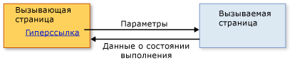

# Общие сведения о структурной навигации
Содержимое, которое может быть размещено приложением обозревателя [!INCLUDE[TLA#tla_xbap](../../../../includes/tlasharptla-xbap-md.md)], объектом <xref:System.Windows.Controls.Frame> или <xref:System.Windows.Navigation.NavigationWindow>, состоит из страниц, которые могут определяться [!INCLUDE[TLA#tla_uri#plural](../../../../includes/tlasharptla-urisharpplural-md.md)] пакета и просматриваться с помощью гиперссылок.  Структура страниц и способы, с помощью которых их можно просмотреть с помощью гиперссылок, называется топологией навигации.  Такая топология подходит для различных типов приложений, особенно тех, которые осуществляют навигацию по документам.  Для таких приложений пользователю необязательно знать что\-либо о других страницах при перемещении с одной страницы на другую.  
  
 Однако другие типы приложений содержат страницы, которые должны быть известны при перемещении между ними.  Например, рассмотрим приложение управления персоналом, имеющее одну страницу со списком всех сотрудников организации — страница «Список сотрудников».  Эта страница могла бы также разрешить пользователям добавлять нового сотрудника, щелкнув гиперссылку.  После щелчка выполняется переход на страницу «Добавить сотрудника», чтобы собрать сведения о новом сотруднике, и возврат к странице «Список сотрудников», чтобы добавить нового сотрудника и обновить список.  Этот стиль перехода аналогичен вызову метода для выполнения обработки и возврата значения, что называется структурным программированием.  Такой стиль перехода называется *структурная навигация*.  
  
 Класс <xref:System.Windows.Controls.Page> не реализует поддержку структурной навигации.  Вместо этого, класс <xref:System.Windows.Navigation.PageFunction%601> производится из класса <xref:System.Windows.Controls.Page> и расширяет его с помощью основных конструкций, необходимых для структурированных переходов.  В этом разделе показано, как установить структурную навигацию, используя объект <xref:System.Windows.Navigation.PageFunction%601>.  
  
   
  
   
## Структурная навигация  
 Когда одна страница вызывает другую страницу в структурной навигации, требуются некоторые или все из следующих условий:  
  
-   Вызывающая страница которая переходит к вызванной странице, при необходимости, передает ей необходимые параметры.  
  
-   Вызванная страница, когда пользователь завершил ее вызов, возвращает вызывающей странице, при необходимости:  
  
    -   Возвращение сведений о состоянии, описывающие, как была завершена вызывающая страница \(например, какую кнопку нажал пользователь: «ОК» или «Отмена»\).  
  
    -   Возвращение данных, которые были собраны от пользователя \(например, сведения о новом сотруднике\).  
  
-   Когда вызывающая страница возвращается к вызванной странице, вызванная страницы удаляется из истории переходов для изоляции одного экземпляра вызванной страницы от другого.  
  
 Это поведение показано на следующем рисунке.  
  
   
  
 Для реализации этого поведения можно использовать объект <xref:System.Windows.Navigation.PageFunction%601> в качестве вызванной страницы.  
  
   
## Структурная навигация с помощью PageFunction  
 В этом разделе показано, как реализовать основной механизм структурной навигации с помощью одного объекта <xref:System.Windows.Navigation.PageFunction%601>.  В этом примере объект <xref:System.Windows.Controls.Page> вызывает объект <xref:System.Windows.Navigation.PageFunction%601>, чтобы получить значение <xref:System.String> от пользователя и вернуть его.  
  
### Создание вызывающей страницы  
 Страница, которая вызывает <xref:System.Windows.Navigation.PageFunction%601>, может быть <xref:System.Windows.Controls.Page> или <xref:System.Windows.Navigation.PageFunction%601>.  В данном примере, это <xref:System.Windows.Controls.Page>, как показано в следующем коде.  
  
 [!code-xml[StructuredNavigationSample#CallingPageDefaultMARKUP1](../../../../samples/snippets/csharp/VS_Snippets_Wpf/StructuredNavigationSample/CSharp/CallingPage.xaml#callingpagedefaultmarkup1)]  
[!code-xml[StructuredNavigationSample#CallingPageDefaultMARKUP2](../../../../samples/snippets/csharp/VS_Snippets_Wpf/StructuredNavigationSample/CSharp/CallingPage.xaml#callingpagedefaultmarkup2)]  
  
 [!code-csharp[StructuredNavigationSample#CallingPageDefaultCODEBEHIND1](../../../../samples/snippets/csharp/VS_Snippets_Wpf/StructuredNavigationSample/CSharp/CallingPage.xaml.cs#callingpagedefaultcodebehind1)]
 [!code-vb[StructuredNavigationSample#CallingPageDefaultCODEBEHIND1](../../../../samples/snippets/visualbasic/VS_Snippets_Wpf/StructuredNavigationSample/VisualBasic/CallingPage.xaml.vb#callingpagedefaultcodebehind1)]  
[!code-csharp[StructuredNavigationSample#CallingPageDefaultCODEBEHIND2](../../../../samples/snippets/csharp/VS_Snippets_Wpf/StructuredNavigationSample/CSharp/CallingPage.xaml.cs#callingpagedefaultcodebehind2)]
[!code-vb[StructuredNavigationSample#CallingPageDefaultCODEBEHIND2](../../../../samples/snippets/visualbasic/VS_Snippets_Wpf/StructuredNavigationSample/VisualBasic/CallingPage.xaml.vb#callingpagedefaultcodebehind2)]  
[!code-csharp[StructuredNavigationSample#CallingPageDefaultCODEBEHIND3](../../../../samples/snippets/csharp/VS_Snippets_Wpf/StructuredNavigationSample/CSharp/CallingPage.xaml.cs#callingpagedefaultcodebehind3)]
[!code-vb[StructuredNavigationSample#CallingPageDefaultCODEBEHIND3](../../../../samples/snippets/visualbasic/VS_Snippets_Wpf/StructuredNavigationSample/VisualBasic/CallingPage.xaml.vb#callingpagedefaultcodebehind3)]  
  
### Создание функции страницы для вызова  
 Поскольку вызывающая страница может использовать вызванную страницу для сбора и возврата данных от пользователя, объект <xref:System.Windows.Navigation.PageFunction%601> реализован как базовый класс, тип аргумента которого определяет тип значения, которое вернет вызванная страница.  Следующий код показывает начальную реализацию вызванной страницы, используя объект <xref:System.Windows.Navigation.PageFunction%601>, который возвращает <xref:System.String>.  
  
 [!code-xml[StructuredNavigationSample#CalledPageFunctionMARKUP](../../../../samples/snippets/csharp/VS_Snippets_Wpf/StructuredNavigationSample/CSharp/CalledPageFunction.xaml#calledpagefunctionmarkup)]  
  
 [!code-csharp[StructuredNavigationSample#CalledPageFunctionCODEBEHIND1](../../../../samples/snippets/csharp/VS_Snippets_Wpf/StructuredNavigationSample/CSharp/CalledPageFunction.xaml.cs#calledpagefunctioncodebehind1)]
 [!code-vb[StructuredNavigationSample#CalledPageFunctionCODEBEHIND1](../../../../samples/snippets/visualbasic/VS_Snippets_Wpf/StructuredNavigationSample/VisualBasic/CalledPageFunction.xaml.vb#calledpagefunctioncodebehind1)]  
[!code-csharp[StructuredNavigationSample#CalledPageFunctionCODEBEHIND2](../../../../samples/snippets/csharp/VS_Snippets_Wpf/StructuredNavigationSample/CSharp/CalledPageFunction.xaml.cs#calledpagefunctioncodebehind2)]
[!code-vb[StructuredNavigationSample#CalledPageFunctionCODEBEHIND2](../../../../samples/snippets/visualbasic/VS_Snippets_Wpf/StructuredNavigationSample/VisualBasic/CalledPageFunction.xaml.vb#calledpagefunctioncodebehind2)]  
  
 Объявление объекта <xref:System.Windows.Navigation.PageFunction%601> похоже на объявление объекта <xref:System.Windows.Controls.Page> с добавлением аргументов типа.  Как видно из примера кода, аргументы типа указаны в обеих метках [!INCLUDE[TLA2#tla_xaml](../../../../includes/tla2sharptla-xaml-md.md)], с помощью атрибута `x:TypeArguments`, и фоновом коде, с помощью стандартного синтаксиса аргумента универсального типа.  
  
 Нет необходимости использовать только классы [!INCLUDE[dnprdnshort](../../../../includes/dnprdnshort-md.md)] в качестве аргументов типа.  Объект <xref:System.Windows.Navigation.PageFunction%601> может быть вызван для сбора данных отдельного домена, которые абстрагированы как пользовательский типа.  В следующем коде показано использование пользовательского типа в качестве аргумента типа для объекта <xref:System.Windows.Navigation.PageFunction%601>.  
  
 [!code-csharp[CustomTypePageFunctionSnippets#CustomTypeCODE1](../../../../samples/snippets/csharp/VS_Snippets_Wpf/CustomTypePageFunctionSnippets/CSharp/CustomType.cs#customtypecode1)]
 [!code-vb[CustomTypePageFunctionSnippets#CustomTypeCODE1](../../../../samples/snippets/visualbasic/VS_Snippets_Wpf/CustomTypePageFunctionSnippets/VisualBasic/CustomType.vb#customtypecode1)]  
[!code-csharp[CustomTypePageFunctionSnippets#CustomTypeCODE2](../../../../samples/snippets/csharp/VS_Snippets_Wpf/CustomTypePageFunctionSnippets/CSharp/CustomType.cs#customtypecode2)]
[!code-vb[CustomTypePageFunctionSnippets#CustomTypeCODE2](../../../../samples/snippets/visualbasic/VS_Snippets_Wpf/CustomTypePageFunctionSnippets/VisualBasic/CustomType.vb#customtypecode2)]  
  
 [!code-xml[CustomTypePageFunctionSnippets#CustomTypePageFunctionMARKUP1](../../../../samples/snippets/csharp/VS_Snippets_Wpf/CustomTypePageFunctionSnippets/CSharp/CustomTypePageFunction.xaml#customtypepagefunctionmarkup1)]  
[!code-xml[CustomTypePageFunctionSnippets#CustomTypePageFunctionMARKUP2](../../../../samples/snippets/csharp/VS_Snippets_Wpf/CustomTypePageFunctionSnippets/CSharp/CustomTypePageFunction.xaml#customtypepagefunctionmarkup2)]  
  
 [!code-csharp[CustomTypePageFunctionSnippets#CustomTypePageFunctionCODEBEHIND1](../../../../samples/snippets/csharp/VS_Snippets_Wpf/CustomTypePageFunctionSnippets/CSharp/CustomTypePageFunction.xaml.cs#customtypepagefunctioncodebehind1)]
 [!code-vb[CustomTypePageFunctionSnippets#CustomTypePageFunctionCODEBEHIND1](../../../../samples/snippets/visualbasic/VS_Snippets_Wpf/CustomTypePageFunctionSnippets/VisualBasic/CustomTypePageFunction.xaml.vb#customtypepagefunctioncodebehind1)]  
  
  
 Аргументы типа для объекта <xref:System.Windows.Navigation.PageFunction%601> обеспечивают основу для связи между вызывающей и вызываемой страницами, которая рассматривается в следующих разделах.  
  
 Как можно видеть дальше, тип, который определен с помощью объявления объекта <xref:System.Windows.Navigation.PageFunction%601>, играет важную роль в возвращении данных из объекта <xref:System.Windows.Navigation.PageFunction%601> в вызывающую страницу.  
  
### Вызов PageFunction и передача параметров  
 Чтобы вызвать страницу, вызывающая страница должна создать экземпляр вызванной страницы и перейти к ней с помощью метода <xref:System.Windows.Navigation.NavigationService.Navigate%2A>.  Это позволяет вызывающей странице передать исходные данные вызванной странице, такие как значения по умолчанию данных, собранных вызываемой страницей.  
  
 В следующем коде демонстрируется вызываемая страница с конструктором, не заданным по умолчанию и принимающим параметры из вызывающей страницы.  
  
 [!code-csharp[StructuredNavigationSample#AcceptsInitialDataCODEBEHIND1](../../../../samples/snippets/csharp/VS_Snippets_Wpf/StructuredNavigationSample/CSharp/CalledPageFunction.xaml.cs#acceptsinitialdatacodebehind1)]
 [!code-vb[StructuredNavigationSample#AcceptsInitialDataCODEBEHIND1](../../../../samples/snippets/visualbasic/VS_Snippets_Wpf/StructuredNavigationSample/VisualBasic/CalledPageFunction.xaml.vb#acceptsinitialdatacodebehind1)]  
[!code-csharp[StructuredNavigationSample#AcceptsInitialDataCODEBEHIND2](../../../../samples/snippets/csharp/VS_Snippets_Wpf/StructuredNavigationSample/CSharp/CalledPageFunction.xaml.cs#acceptsinitialdatacodebehind2)]
[!code-vb[StructuredNavigationSample#AcceptsInitialDataCODEBEHIND2](../../../../samples/snippets/visualbasic/VS_Snippets_Wpf/StructuredNavigationSample/VisualBasic/CalledPageFunction.xaml.vb#acceptsinitialdatacodebehind2)]  
[!code-csharp[StructuredNavigationSample#AcceptsInitialDataCODEBEHIND3](../../../../samples/snippets/csharp/VS_Snippets_Wpf/StructuredNavigationSample/CSharp/CalledPageFunction.xaml.cs#acceptsinitialdatacodebehind3)]
[!code-vb[StructuredNavigationSample#AcceptsInitialDataCODEBEHIND3](../../../../samples/snippets/visualbasic/VS_Snippets_Wpf/StructuredNavigationSample/VisualBasic/CalledPageFunction.xaml.vb#acceptsinitialdatacodebehind3)]  
[!code-csharp[StructuredNavigationSample#AcceptsInitialDataCODEBEHIND4](../../../../samples/snippets/csharp/VS_Snippets_Wpf/StructuredNavigationSample/CSharp/CalledPageFunction.xaml.cs#acceptsinitialdatacodebehind4)]
[!code-vb[StructuredNavigationSample#AcceptsInitialDataCODEBEHIND4](../../../../samples/snippets/visualbasic/VS_Snippets_Wpf/StructuredNavigationSample/VisualBasic/CalledPageFunction.xaml.vb#acceptsinitialdatacodebehind4)]  
  
 В следующем коде показана вызывающая страница, обрабатывающая событие <xref:System.Windows.Documents.Hyperlink.Click> объекта <xref:System.Windows.Documents.Hyperlink>, предназначенного для создания экземпляра вызываемой страницы и передачи ей исходного строкового значения.  
  
 [!code-xml[StructuredNavigationSample#PassingDataMARKUP2](../../../../samples/snippets/csharp/VS_Snippets_Wpf/StructuredNavigationSample/CSharp/CallingPage.xaml#passingdatamarkup2)]  
[!code-csharp[StructuredNavigationSample#PassingDataCODEBEHIND1](../../../../samples/snippets/csharp/VS_Snippets_Wpf/StructuredNavigationSample/CSharp/CallingPage.xaml.cs#passingdatacodebehind1)]
[!code-vb[StructuredNavigationSample#PassingDataCODEBEHIND1](../../../../samples/snippets/visualbasic/VS_Snippets_Wpf/StructuredNavigationSample/VisualBasic/CallingPage.xaml.vb#passingdatacodebehind1)]  
[!code-csharp[StructuredNavigationSample#PassingDataCODEBEHIND2](../../../../samples/snippets/csharp/VS_Snippets_Wpf/StructuredNavigationSample/CSharp/CallingPage.xaml.cs#passingdatacodebehind2)]
[!code-vb[StructuredNavigationSample#PassingDataCODEBEHIND2](../../../../samples/snippets/visualbasic/VS_Snippets_Wpf/StructuredNavigationSample/VisualBasic/CallingPage.xaml.vb#passingdatacodebehind2)]  
[!code-csharp[StructuredNavigationSample#PassingDataCODEBEHIND3](../../../../samples/snippets/csharp/VS_Snippets_Wpf/StructuredNavigationSample/CSharp/CallingPage.xaml.cs#passingdatacodebehind3)]
[!code-vb[StructuredNavigationSample#PassingDataCODEBEHIND3](../../../../samples/snippets/visualbasic/VS_Snippets_Wpf/StructuredNavigationSample/VisualBasic/CallingPage.xaml.vb#passingdatacodebehind3)]  
  
 Не требуется передача параметров вызываемой странице.  Вместо этого, можно выполнить следующие действия.  
  
-   Их вызывающей страницы:  
  
    1.  Создайте экземпляр вызываемого объекта <xref:System.Windows.Navigation.PageFunction%601> с помощью конструктора по умолчанию.  
  
    2.  Сохраните параметры в свойстве <xref:System.Windows.Application.Properties%2A>.  
  
    3.  Перейдите к вызываемому объекту <xref:System.Windows.Navigation.PageFunction%601>.  
  
-   Из вызываемого объекта <xref:System.Windows.Navigation.PageFunction%601>:  
  
    -   Извлеките и используйте параметры, хранящиеся в свойстве <xref:System.Windows.Application.Properties%2A>.  
  
 Но, как будет сразу видно, по\-прежнему нужно использовать код для создания экземпляра и перехода к вызываемой странице для сбора возвращаемых ею данных.  По этой причине, объект <xref:System.Windows.Navigation.PageFunction%601> должен поддерживаться активным; в противном случае, при следующем переходе к объекту <xref:System.Windows.Navigation.PageFunction%601> [!INCLUDE[TLA2#tla_wpf](../../../../includes/tla2sharptla-wpf-md.md)] создает экземпляр <xref:System.Windows.Navigation.PageFunction%601> с помощью конструктора по умолчанию.  
  
 Перед тем как вызванная страница может вернуться, она должно возвратить данные, которые могут быть получены вызывающей страницей.  
  
### Возвращение результатов и данных задачи из задачи в вызывающую страницу  
 Когда пользователь завершил работу с вызванной страницей — в этом примере нажатием кнопки «ОК» или «Отмена» — вызванная страница должна вернуться.  Поскольку вызывающая страница использует вызванную страницу для сбора данных от пользователя, вызывающая страница требует два типа данных:  
  
1.  Отменил ли пользователь вызванную страницу \(в этом примере — с помощью нажатия кнопки «ОК» или «Отмена»\).  Это позволяет вызывающей странице определить, требуется ли обработка данных, собранных вызванной страницей от пользователя.  
  
2.  Данные, которые были предоставлены пользователем.  
  
 Для возврата данных объект <xref:System.Windows.Navigation.PageFunction%601> реализует метод <xref:System.Windows.Navigation.PageFunction%601.OnReturn%2A>.  Следующий код иллюстрирует, как его вызвать.  
  
 [!code-csharp[StructuredNavigationSample#ReturnCODEBEHIND1](../../../../samples/snippets/csharp/VS_Snippets_Wpf/StructuredNavigationSample/CSharp/CalledPageFunction.xaml.cs#returncodebehind1)]
 [!code-vb[StructuredNavigationSample#ReturnCODEBEHIND1](../../../../samples/snippets/visualbasic/VS_Snippets_Wpf/StructuredNavigationSample/VisualBasic/CalledPageFunction.xaml.vb#returncodebehind1)]  
[!code-csharp[StructuredNavigationSample#ReturnCODEBEHIND2](../../../../samples/snippets/csharp/VS_Snippets_Wpf/StructuredNavigationSample/CSharp/CalledPageFunction.xaml.cs#returncodebehind2)]
[!code-vb[StructuredNavigationSample#ReturnCODEBEHIND2](../../../../samples/snippets/visualbasic/VS_Snippets_Wpf/StructuredNavigationSample/VisualBasic/CalledPageFunction.xaml.vb#returncodebehind2)]  
  
 В этом примере, если пользователь нажимает кнопку «Отмена», вызывающей странице возвращается значение `null`.  Если вместо этого пользователь нажмет кнопку "ОК", возвратится строковое значение, предоставленное пользователем.  Объект <xref:System.Windows.Navigation.PageFunction%601.OnReturn%2A> представляет собой защищенный \(`protected`\) виртуальный \(`virtual`\) метод, который можно вызвать для возвращения данных пользователя на вызывающую страницу.  Данные необходимо упаковать в экземпляре универсального типа <xref:System.Windows.Navigation.ReturnEventArgs%601>, тип аргумента которого указывает тип значения, возвращающего свойство <xref:System.Windows.Navigation.ReturnEventArgs%601.Result%2A>.  Таким образом, при объявлении объекта <xref:System.Windows.Navigation.PageFunction%601> с определенным аргументом типа, пользователь заявляет, что объект <xref:System.Windows.Navigation.PageFunction%601> вернет экземпляр типа, который определен аргументом типа.  В этом примере, аргумент типа и, следовательно, возвращенное значение является объектом <xref:System.String> типа.  
  
 При вызове метода <xref:System.Windows.Navigation.PageFunction%601.OnReturn%2A> вызывающей странице требуется способ получения возвращенного значения <xref:System.Windows.Navigation.PageFunction%601>.  По этой причине, <xref:System.Windows.Navigation.PageFunction%601> реализует событие <xref:System.Windows.Navigation.PageFunction%601.Return> для вызывающей страницы для обработки.  При вызове метода <xref:System.Windows.Navigation.PageFunction%601.OnReturn%2A> вызывается событие <xref:System.Windows.Navigation.PageFunction%601.Return>, поэтому вызывающая страница может зарегистрировать событие <xref:System.Windows.Navigation.PageFunction%601.Return> для получения уведомления.  
  
 [!code-csharp[StructuredNavigationSample#ProcessResultCODEBEHIND1](../../../../samples/snippets/csharp/VS_Snippets_Wpf/StructuredNavigationSample/CSharp/CallingPage.xaml.cs#processresultcodebehind1)]
 [!code-vb[StructuredNavigationSample#ProcessResultCODEBEHIND1](../../../../samples/snippets/visualbasic/VS_Snippets_Wpf/StructuredNavigationSample/VisualBasic/CallingPage.xaml.vb#processresultcodebehind1)]  
[!code-csharp[StructuredNavigationSample#ProcessResultCODEBEHIND2](../../../../samples/snippets/csharp/VS_Snippets_Wpf/StructuredNavigationSample/CSharp/CallingPage.xaml.cs#processresultcodebehind2)]
[!code-vb[StructuredNavigationSample#ProcessResultCODEBEHIND2](../../../../samples/snippets/visualbasic/VS_Snippets_Wpf/StructuredNavigationSample/VisualBasic/CallingPage.xaml.vb#processresultcodebehind2)]  
  
### Удаление страниц задачи при ее завершении  
 Когда вызванная страница возвращается, и пользователь не отменил ее, вызывающая страница будет обрабатывать данные, предоставленные пользователем, и также данные, возвращенные вызванной страницей.  Получение данных таким образом обычно является изолированным действием; при возвращении вызванной страны вызывающая страница должна создать новую страницу и перейти к ней, чтобы получить больше данных.  
  
 Однако если вызванная страница не удалена из [журнала](GTMT), пользователь может вернуться к предыдущему экземпляру вызывающей страницы.  Сохранен ли объект <xref:System.Windows.Navigation.PageFunction%601> в [журнале](GTMT), определяется свойством <xref:System.Windows.Navigation.PageFunctionBase.RemoveFromJournal%2A>.  По умолчанию функция страницы автоматически удаляется при вызове метода <xref:System.Windows.Navigation.PageFunction%601.OnReturn%2A>, так как для свойства <xref:System.Windows.Navigation.PageFunctionBase.RemoveFromJournal%2A> установлено значение `true`.  Чтобы сохранить функцию страницы в истории переходов после вызова метода <xref:System.Windows.Navigation.PageFunction%601.OnReturn%2A>, задайте для свойства <xref:System.Windows.Navigation.PageFunctionBase.RemoveFromJournal%2A> значение `false`.  
  
   
## Другие типы структурной навигации  
 В этом разделе показано большинство основных способов использования объекта <xref:System.Windows.Navigation.PageFunction%601> для поддержки вызова\/возврата структурной навигации.  Эта база обеспечивает возможность создания более сложных типов структурных переходов.  
  
 Например, иногда вызывающей странице требуется несколько страниц для сбора достаточных данных от пользователя или для выполнения задачи.  Использование нескольких страниц называется «мастером».  
  
 В других случаях, приложения для эффективной работы могут иметь сложные топологии переходов, зависящие от структурной навигации.  Дополнительные сведения см. в разделе [Общие сведения о топологии переходов](../../../../docs/framework/wpf/app-development/navigation-topologies-overview.md).  
  
## См. также  
 <xref:System.Windows.Navigation.PageFunction%601>   
 <xref:System.Windows.Navigation.NavigationService>   
 [Общие сведения о топологии переходов](../../../../docs/framework/wpf/app-development/navigation-topologies-overview.md)