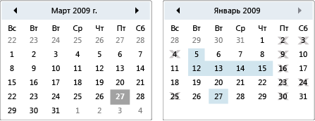

# КалендарьCalendar
Календарь позволяет пользователю выбрать дату с помощью отображения визуального календаря.A calendar enables a user to select a date by using a visual calendar display.  
  
 Элемент управления <xref:System.Windows.Controls.Calendar> может использоваться самостоятельно или в виде раскрывающейся части элемента управления <xref:System.Windows.Controls.DatePicker>.A <xref:System.Windows.Controls.Calendar> control can be used on its own, or as a drop-down part of a <xref:System.Windows.Controls.DatePicker> control. Для получения дополнительной информации см. <xref:System.Windows.Controls.DatePicker>.For more information, see <xref:System.Windows.Controls.DatePicker>.  
  
 На следующем рисунке показаны два элемента управления <xref:System.Windows.Controls.Calendar>: один с выбранными значениями и датами отключения, а другой — без.The following illustration shows two <xref:System.Windows.Controls.Calendar> controls, one with selections and blackout dates and one without.  
  
   
Элементы управления календаряCalendar controls  
  
 В следующей таблице приведены сведения о задачах, которые обычно связаны с <xref:System.Windows.Controls.Calendar>.The following table provides information about tasks that are typically associated with the <xref:System.Windows.Controls.Calendar>.  
  
|ЗадачаTask|РеализацияImplementation|  
|----------|--------------------|  
|Укажите даты, которые не могут быть выбраны.Specify dates that cannot be selected.|Используйте свойство <xref:System.Windows.Controls.Calendar.BlackoutDates%2A>.Use the <xref:System.Windows.Controls.Calendar.BlackoutDates%2A> property.|  
|<xref:System.Windows.Controls.Calendar> отобразить месяц, целый год или десятилетие.Have the <xref:System.Windows.Controls.Calendar> display a month, an entire year, or a decade.|Задайте для свойства <xref:System.Windows.Controls.Calendar.DisplayMode%2A> значение месяц, год или десятилетие.Set the <xref:System.Windows.Controls.Calendar.DisplayMode%2A> property to Month, Year, or Decade.|  
|Укажите, может ли пользователь выбрать дату, диапазон дат или несколько диапазонов дат.Specify whether the user can select a date, a range of dates, or multiple ranges of dates.|Используйте <xref:System.Windows.Controls.Calendar.SelectionMode%2A>.Use the <xref:System.Windows.Controls.Calendar.SelectionMode%2A>.|  
|Укажите диапазон дат, отображаемых <xref:System.Windows.Controls.Calendar>.Specify the range of dates that the <xref:System.Windows.Controls.Calendar> displays.|Используйте свойства <xref:System.Windows.Controls.Calendar.DisplayDateStart%2A> и <xref:System.Windows.Controls.Calendar.DisplayDateEnd%2A>.Use the <xref:System.Windows.Controls.Calendar.DisplayDateStart%2A> and <xref:System.Windows.Controls.Calendar.DisplayDateEnd%2A> properties.|  
|Укажите, выделена ли текущая дата.Specify whether the current date is highlighted.|Используйте свойство <xref:System.Windows.Controls.Calendar.IsTodayHighlighted%2A>.Use the <xref:System.Windows.Controls.Calendar.IsTodayHighlighted%2A> property. По умолчанию <xref:System.Windows.Controls.Calendar.IsTodayHighlighted%2A> `true`.By default, <xref:System.Windows.Controls.Calendar.IsTodayHighlighted%2A> is `true`.|  
|Измените размер <xref:System.Windows.Controls.Calendar>.Change the size of the <xref:System.Windows.Controls.Calendar>.|Используйте <xref:System.Windows.Controls.Viewbox> или задайте для свойства <xref:System.Windows.FrameworkElement.LayoutTransform%2A> значение <xref:System.Windows.Media.ScaleTransform>.Use a <xref:System.Windows.Controls.Viewbox> or set the <xref:System.Windows.FrameworkElement.LayoutTransform%2A> property to a <xref:System.Windows.Media.ScaleTransform>. Обратите внимание, что если задать свойства <xref:System.Windows.FrameworkElement.Width%2A> и <xref:System.Windows.FrameworkElement.Height%2A> <xref:System.Windows.Controls.Calendar>, реальный календарь не изменит свой размер.Note that if you set the <xref:System.Windows.FrameworkElement.Width%2A> and <xref:System.Windows.FrameworkElement.Height%2A> properties of a <xref:System.Windows.Controls.Calendar>, the actual calendar does not change its size.|  
  
 Элемент управления <xref:System.Windows.Controls.Calendar> обеспечивает базовую навигацию с помощью мыши или клавиатуры.The <xref:System.Windows.Controls.Calendar> control provides basic navigation using either the mouse or keyboard. В следующей таблице представлены сведения о переходе с помощью клавиатуры.The following table summarizes keyboard navigation.  
  
|Сочетание клавишKey Combination|<xref:System.Windows.Controls.Calendar.DisplayMode%2A>|ДействиеAction|  
|---------------------|-----------------------------------------------------------------------------------------------------------------------------------------------------------|------------|  
|СПИСКОМARROW|<xref:System.Windows.Controls.CalendarMode.Month>|Изменяет свойство <xref:System.Windows.Controls.Calendar.SelectedDate%2A>, если свойство <xref:System.Windows.Controls.Calendar.SelectionMode%2A> не имеет значение <xref:System.Windows.Controls.CalendarSelectionMode.None>.Changes the <xref:System.Windows.Controls.Calendar.SelectedDate%2A> property if the <xref:System.Windows.Controls.Calendar.SelectionMode%2A> property is not set to <xref:System.Windows.Controls.CalendarSelectionMode.None>.|  
|СПИСКОМARROW|<xref:System.Windows.Controls.CalendarMode.Year>|Изменяет месяц свойства <xref:System.Windows.Controls.Calendar.DisplayDate%2A>.Changes the month of the <xref:System.Windows.Controls.Calendar.DisplayDate%2A> property. Обратите внимание, что <xref:System.Windows.Controls.Calendar.SelectedDate%2A> не изменяется.Note that the <xref:System.Windows.Controls.Calendar.SelectedDate%2A> does not change.|  
|СПИСКОМARROW|<xref:System.Windows.Controls.CalendarMode.Decade>|Изменяет год <xref:System.Windows.Controls.Calendar.DisplayDate%2A>.Changes the year of the <xref:System.Windows.Controls.Calendar.DisplayDate%2A>. Обратите внимание, что <xref:System.Windows.Controls.Calendar.SelectedDate%2A> не изменяется.Note that the <xref:System.Windows.Controls.Calendar.SelectedDate%2A> does not change.|  
|SHIFT + СТРЕЛКАSHIFT+ARROW|<xref:System.Windows.Controls.CalendarMode.Month>|Если параметр <xref:System.Windows.Controls.Calendar.SelectionMode%2A> не имеет значение <xref:System.Windows.Controls.CalendarSelectionMode.SingleDate> или <xref:System.Windows.Controls.CalendarSelectionMode.None>, расширяет диапазон выбранных дат.If <xref:System.Windows.Controls.Calendar.SelectionMode%2A> is not set to <xref:System.Windows.Controls.CalendarSelectionMode.SingleDate> or <xref:System.Windows.Controls.CalendarSelectionMode.None>, extends the range of selected dates.|  
|ГЛАВНАЯHOME|<xref:System.Windows.Controls.CalendarMode.Month>|Изменяет <xref:System.Windows.Controls.Calendar.SelectedDate%2A> на первый день текущего месяца.Changes the <xref:System.Windows.Controls.Calendar.SelectedDate%2A> to the first day of the current month.|  
|ГЛАВНАЯHOME|<xref:System.Windows.Controls.CalendarMode.Year>|Изменяет месяц <xref:System.Windows.Controls.Calendar.DisplayDate%2A> на первый месяц года.Changes the month of the <xref:System.Windows.Controls.Calendar.DisplayDate%2A> to the first month of the year. <xref:System.Windows.Controls.Calendar.SelectedDate%2A> не изменяется.The <xref:System.Windows.Controls.Calendar.SelectedDate%2A> does not change.|  
|ГЛАВНАЯHOME|<xref:System.Windows.Controls.CalendarMode.Decade>|Изменяет год <xref:System.Windows.Controls.Calendar.DisplayDate%2A> на первый год десятилетия.Changes the year of the <xref:System.Windows.Controls.Calendar.DisplayDate%2A> to the first year of the decade. <xref:System.Windows.Controls.Calendar.SelectedDate%2A> не изменяется.The <xref:System.Windows.Controls.Calendar.SelectedDate%2A> does not change.|  
|ENDEND|<xref:System.Windows.Controls.CalendarMode.Month>|Изменяет <xref:System.Windows.Controls.Calendar.SelectedDate%2A> на последний день текущего месяца.Changes the <xref:System.Windows.Controls.Calendar.SelectedDate%2A> to the last day of the current month.|  
|ENDEND|<xref:System.Windows.Controls.CalendarMode.Year>|Изменяет месяц <xref:System.Windows.Controls.Calendar.DisplayDate%2A> на последний месяц года.Changes the month of the <xref:System.Windows.Controls.Calendar.DisplayDate%2A> to the last month of the year. <xref:System.Windows.Controls.Calendar.SelectedDate%2A> не изменяется.The <xref:System.Windows.Controls.Calendar.SelectedDate%2A> does not change.|  
|ENDEND|<xref:System.Windows.Controls.CalendarMode.Decade>|Изменяет год <xref:System.Windows.Controls.Calendar.DisplayDate%2A> на последний год десятилетия.Changes the year of the <xref:System.Windows.Controls.Calendar.DisplayDate%2A> to the last year of the decade. <xref:System.Windows.Controls.Calendar.SelectedDate%2A> не изменяется.The <xref:System.Windows.Controls.Calendar.SelectedDate%2A> does not change.|  
|CTRL + СТРЕЛКА ВВЕРХCTRL+UP ARROW|ЛюбойAny|Переключается на следующие более крупные <xref:System.Windows.Controls.Calendar.DisplayMode%2A>.Switches to the next larger <xref:System.Windows.Controls.Calendar.DisplayMode%2A>. Если <xref:System.Windows.Controls.Calendar.DisplayMode%2A> уже <xref:System.Windows.Controls.CalendarMode.Decade>, никаких действий не происходит.If <xref:System.Windows.Controls.Calendar.DisplayMode%2A> is already <xref:System.Windows.Controls.CalendarMode.Decade>, no action.|  
|CTRL+СТРЕЛКА ВНИЗCTRL+DOWN ARROW|ЛюбойAny|Переключается на следующий <xref:System.Windows.Controls.Calendar.DisplayMode%2A>меньшего размера.Switches to the next smaller <xref:System.Windows.Controls.Calendar.DisplayMode%2A>. Если <xref:System.Windows.Controls.Calendar.DisplayMode%2A> уже <xref:System.Windows.Controls.CalendarMode.Month>, никаких действий не происходит.If <xref:System.Windows.Controls.Calendar.DisplayMode%2A> is already <xref:System.Windows.Controls.CalendarMode.Month>, no action.|  
|ПРОБЕЛ или вводSPACEBAR or ENTER|<xref:System.Windows.Controls.CalendarMode.Year> или <xref:System.Windows.Controls.CalendarMode.Decade><xref:System.Windows.Controls.CalendarMode.Year> or <xref:System.Windows.Controls.CalendarMode.Decade>|Переключается <xref:System.Windows.Controls.Calendar.DisplayMode%2A> <xref:System.Windows.Controls.CalendarMode.Month> или <xref:System.Windows.Controls.CalendarMode.Year>, представленных элементом с сортировкой.Switches <xref:System.Windows.Controls.Calendar.DisplayMode%2A> to the <xref:System.Windows.Controls.CalendarMode.Month> or <xref:System.Windows.Controls.CalendarMode.Year> represented by focused item.|  
  
## См. такжеSee also

- [Элементы управленияControls](index.md)
- [Стилизация и использование шаблоновStyling and Templating](../../../desktop-wpf/fundamentals/styles-templates-overview.md)
