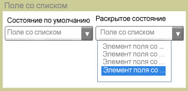

# ComboBoxComboBox
<xref:System.Windows.Controls.ComboBox> Управления предоставляется пользователям в список параметров.The <xref:System.Windows.Controls.ComboBox> control presents users with a list of options. Список отображения или скрытия как элемент управления развернут и свернут.The list is shown and hidden as the control expands and collapses. В состоянии по умолчанию список свернут, отображая только один вариант.In its default state, the list is collapsed, displaying only one choice. Пользователь нажимает кнопку, чтобы увидеть полный список параметров.The user clicks a button to see the complete list of options.  
  
 На следующем рисунке показано <xref:System.Windows.Controls.ComboBox> в различных состояниях.The following illustration shows a <xref:System.Windows.Controls.ComboBox> in different states.  
  
   
Свернуть и развернутьCollapsed and expanded  
  
## СсылкаReference  
 <xref:System.Windows.Controls.ComboBox>
