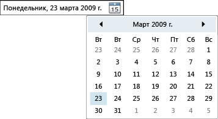

# DatePicker
Элемент управления <xref:System.Windows.Controls.DatePicker> позволяет пользователю выбрать дату, введя ее в текстовое поле, или с помощью раскрывающегося <xref:System.Windows.Controls.Calendar> элемента управления.  
  
 На следующем рисунке показан <xref:System.Windows.Controls.DatePicker>.  
  
   
Элемент управления DatePicker  
  
 Многие свойства <xref:System.Windows.Controls.DatePicker> элемента управления предназначены для управления встроенными <xref:System.Windows.Controls.Calendar>и функционируют аналогично эквивалентному свойству в <xref:System.Windows.Controls.Calendar>. В частности, свойства <xref:System.Windows.Controls.DatePicker.IsTodayHighlighted%2A?displayProperty=nameWithType>, <xref:System.Windows.Controls.DatePicker.FirstDayOfWeek%2A?displayProperty=nameWithType>, <xref:System.Windows.Controls.DatePicker.BlackoutDates%2A?displayProperty=nameWithType>, <xref:System.Windows.Controls.DatePicker.DisplayDateStart%2A?displayProperty=nameWithType>, <xref:System.Windows.Controls.DatePicker.DisplayDateEnd%2A?displayProperty=nameWithType>, <xref:System.Windows.Controls.DatePicker.DisplayDate%2A?displayProperty=nameWithType>и <xref:System.Windows.Controls.DatePicker.SelectedDate%2A?displayProperty=nameWithType> идентичны своим <xref:System.Windows.Controls.Calendar>ным аналогам. Для получения дополнительной информации см. <xref:System.Windows.Controls.Calendar>.  
  
 Пользователи могут вводить дату непосредственно в текстовое поле, которое задает свойство <xref:System.Windows.Controls.DatePicker.Text%2A>. Если <xref:System.Windows.Controls.DatePicker> не может преобразовать входную строку в допустимую дату, будет вызвано событие <xref:System.Windows.Controls.DatePicker.DateValidationError>. По умолчанию это вызывает исключение, но обработчик событий для <xref:System.Windows.Controls.DatePicker.DateValidationError> может установить для свойства <xref:System.Windows.Controls.DatePickerDateValidationErrorEventArgs.ThrowException%2A> значение `false` и предотвратить возникновение исключения.  
  
## См. также

- [Элементы управления](index.md)
- [Стилизация и использование шаблонов](../../../desktop-wpf/fundamentals/styles-templates-overview.md)
