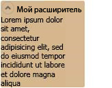

# ExpanderExpander
<xref:System.Windows.Controls.Expander> Позволяет пользователю просмотреть заголовок и развернуть заголовок, чтобы просмотреть дополнительные сведения, или свернуть раздел до заголовка.An <xref:System.Windows.Controls.Expander> allows a user to view a header and expand that header to see further details, or to collapse a section up to a header.  
  
 Ниже приведен пример этого элемента управления в развернутом положении.The following illustration provides an example of this control in its expanded position.  
  
   
Expander - элемент управленияExpander control  
  
## В этом разделеIn This Section  
 [Общие сведения о расширителеExpander Overview](../../../../docs/framework/wpf/controls/expander-overview.md)  
 [Разделы практического руководстваHow-to Topics](../../../../docs/framework/wpf/controls/expander-how-to-topics.md)  
  
## СсылкаReference  
 <xref:System.Windows.Controls.Expander>  
  
## Связанные разделыRelated Sections
